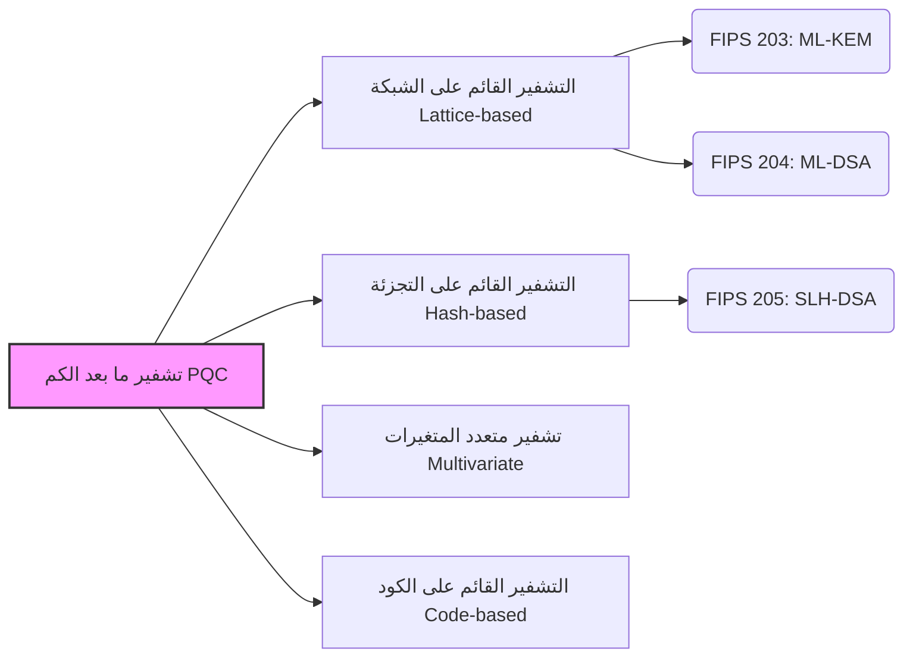

## مقدمة: "التهديد" الذي تشكله الحواسيب الكمومية على تقنيات التشفير

في الوقت الحاضر، يتم حماية الغالبية العظمى من الاتصالات اليومية التي نجريها عبر الإنترنت - بدءًا من المدفوعات المصرفية عبر الإنترنت، وتصفح الويب (HTTPS)، وتبادل الرسائل في التطبيقات، وصولاً إلى معاملات البلوكشين والأصول المشفرة - بواسطة تقنية تُعرف باسم "تشفير المفتاح العام". وعلى وجه التحديد، تشكل خوارزميات مثل تشفير RSA وتشفير المنحنى الإهليلجي (ECC) الأساس الذي تقوم عليه موثوقية المجتمع الرقمي الحديث.

تعتمد طرق التشفير هذه في أمانها على مسائل رياضية معقدة مثل "تحليل الأعداد الأولية الكبيرة" أو "مسألة اللوغاريتم المتقطع"، والتي تستغرق وقتًا فلكيًا لحلها بواسطة الحواسيب الكلاسيكية الحالية (بما في ذلك الحواسيب الخارقة). ومع ذلك، مع التقدم السريع الذي أحرزته **الحواسيب الكمومية** في السنوات الأخيرة، فإن هذا الأساس سينهار تمامًا بمجرد وضعها موضع التنفيذ.

في عام 1994، نشر بيتر شور "خوارزمية شور"، والتي أثبتت رياضيًا أنه يمكن حل مسائل تحليل الأعداد الأولية واللوغاريتم المتقطع في وقت قصير جدًا باستخدام حاسوب كمومي ذي أداء كافٍ. وهذا يعني أن هناك خطرًا من أن جميع الاتصالات المشفرة التي تحمي الإنترنت اليوم سيتم فك تشفيرها في المستقبل (وهي مشكلة تعرف باسم Y2Q: سنوات حتى الكم، أو Q-Day).

وما يزيد الأمر خطورة هو وجود أسلوب هجوم يُعرف باسم "احصد الآن، وفك التشفير لاحقًا (Harvest Now, Decrypt Later)" (أي سرقة البيانات الآن وتخزينها، وفك تشفيرها عندما يصبح التشفير قابلاً للكسر في المستقبل). فالبيانات التي يجب الحفاظ على سريتها لعقود، مثل أسرار الدولة، والملكية الفكرية للشركات، والمعلومات البيومترية للأفراد، ربما تكون بالفعل هدفًا للسرقة على افتراض أنه سيتم فك تشفيرها مستقبلاً.

استجابة لهذه الأزمة غير المسبوقة، يعمل خبراء التشفير ومعاهد الأبحاث في جميع أنحاء العالم بكل طاقتهم لتطوير تقنية تشفير من الجيل القادم قادرة على مقاومة هجمات الحواسيب الكمومية، وهي **تشفير ما بعد الكم (PQC: Post-Quantum Cryptography)** . في هذه المقالة، سنشرح بالتفصيل أساسيات PQC، وآليات الخوارزميات الرئيسية، وأحدث اتجاهات التوحيد القياسي العالمي التي يقودها المعهد الوطني الأمريكي للمعايير والتكنولوجيا (NIST).

---

## ما هو تشفير ما بعد الكم (PQC)؟

يُعد تشفير ما بعد الكم (PQC) مصطلحًا شاملاً لخوارزميات التشفير المصممة للعمل على الحواسيب الكلاسيكية الحالية مع الاحتفاظ بالقدرة على مقاومة الهجمات من الحواسيب الكمومية واسعة النطاق في المستقبل (مثل خوارزمية شور).

غالبًا ما يتم الخلط بين هذه التكنولوجيا و "التشفير الكمومي" أو "توزيع المفتاح الكمومي (QKD)"، إلا أنهما نهجان مختلفان تمامًا. فالتشفير الكمومي (QKD) هو تقنية تعتمد على الأجهزة تستخدم القوانين الفيزيائية لميكانيكا الكم (مثل خاصية تغير الحالة عند المراقبة) لجعل التنصت على مسار الاتصال مستحيلاً ماديًا. وهو يتطلب أليافًا بصرية خاصة أو معدات خاصة، ويواجه تحديات مثل تكلفة التنفيذ وقيود المسافة.

من ناحية أخرى، **تُعد PQC تقنية تشفير تعتمد على البرامج وتستند بالكامل إلى "الرياضيات"** . وبالتالي، يمكن دمجها كتحديث برمجي في البنية التحتية الحالية للإنترنت، والخوادم، والهواتف الذكية، والمتصفحات، وغيرها، مما يجعل قابليتها للتطبيق في العالم الحقيقي عالية جدًا. وتعتبر شركات تكنولوجيا المعلومات والوكالات الحكومية في جميع أنحاء العالم الآن أن استبدال (ترحيل) خوارزميات RSA و ECC المستخدمة حاليًا بتقنية PQC هذه يمثل أولوية قصوى.

---

## المناهج الرياضية الرئيسية الأربعة التي تدعم PQC

تم اقتراح العديد من خوارزميات PQC بناءً على مسائل رياضية يصعب حلها بكفاءة حتى باستخدام الحواسيب الكمومية (مثل المسائل صعبة الحل NP-hard). نستعرض هنا الفئات الأربع الرئيسية السائدة حاليًا.

### المناهج الرئيسية لتشفير ما بعد الكم (PQC)

### 1. التشفير القائم على الشبكة (Lattice-based Cryptography)

يُعد التشفير القائم على الشبكة حاليًا التوجه الأبرز والأكثر الواعدة في مجال PQC. يعتمد هذا التشفير في أمانه على المسائل المتعلقة بالنقاط المرتبة بانتظام (نقاط الشبكة) في المساحات متعددة الأبعاد. تشمل المسائل الشهيرة "مسألة أقصر متجه (SVP)" و "مسألة التعلم مع الأخطاء (LWE)".

**نظرة عامة على الآلية:** 
تخيل عددًا لا يحصى من النقاط المرتبة في نمط شبكي في مساحة عالية الأبعاد (مئات إلى آلاف الأبعاد). من السهل العثور على نقطة شبكة معينة في بعدين أو ثلاثة أبعاد، ولكن في مئات الأبعاد، لم يتم العثور على خوارزمية فعالة للعثور عليها سواء للحواسيب الكلاسيكية أو الكمومية. وتستفيد مسألة LWE تحديدًا من الخاصية التي تنص على أن "إضافة 'ضوضاء (خطأ)' صغيرة عمدًا إلى نظام من المعادلات الخطية يجعل تخمين المتغيرات الأصلية أمرًا بالغ الصعوبة".

**المزايا:** 
- قابل للتطبيق لكل من تبادل المفاتيح (KEM) والتوقيعات الرقمية.
- سرعة المعالجة عالية جدًا (تكون أحيانًا أسرع من RSA أو ECC).
- حجم المفتاح والنص المشفر صغير نسبيًا، مما يجعله متوازنًا.

تعتمد معظم الخوارزميات التي تقوم NIST بتوحيدها حاليًا (مثل ML-KEM و ML-DSA) على هذا التشفير القائم على الشبكة.

### 2. التشفير القائم على التجزئة (Hash-based Cryptography)

التشفير القائم على التجزئة هو خوارزمية PQC مخصصة للتوقيعات الرقمية. يعتمد أمانها حصريًا على مقاومة الاصطدام والاتجاه الواحد لـ "وظائف التجزئة التشفيرية" الآمنة، مثل SHA-2 أو SHA-3.

**نظرة عامة على الآلية:** 
يبدأ الأمر بمخطط توقيع يُستخدم لمرة واحدة يُسمى "توقيع لامبورت (Lamport Signature)"، والذي لا يمكن استخدامه إلا مرة واحدة. من خلال تجميع هذه التوقيعات في بنية بيانات شجرية تسمى "شجرة ميركل (Merkle Tree)"، فإنها تتيح توقيعات متعددة باستخدام زوج مفاتيح واحد.

**المزايا:** 
- أساس الأمان قوي للغاية، مع إثبات قوي على أنه "طالما كانت وظيفة التجزئة آمنة، فهو آمن".
- نظرًا لقلة الاعتماد على الهياكل الرياضية، فإن خطر العثور على طرق غير متوقعة لكسر التشفير منخفض جدًا.

**العيوب:** 
- لا يمكن استخدامه لتبادل المفاتيح (KEM)، فقط للتوقيعات الرقمية.
- يميل حجم التوقيع إلى أن يكون كبيرًا.
- توجد إصدارات "تحتفظ بالحالة (stateful)" و "بدون حالة (stateless)". تمثل الإصدارات التي تحتفظ بالحالة (مثل XMSS) تحديًا كبيرًا في التنفيذ نظرًا للحاجة إلى إدارة عدد مرات استخدام المفاتيح بدقة.

قامت NIST بتوحيد "SLH-DSA (سابقًا SPHINCS+)" كمعيار لتوقيعات التجزئة بدون حالة.

### 3. التشفير متعدد المتغيرات (Multivariate Cryptography)

يعتمد التشفير متعدد المتغيرات في أمانه على صعوبة حل أنظمة المعادلات التربيعية المتعددة التي تحتوي على العديد من المتغيرات (مسألة MQ: Multivariate Quadratic problem). من المعروف أن هذه المسألة صعبة الحل (NP-hard).

**نظرة عامة على الآلية:** 
يقوم المرسل بإنشاء نص مشفر (توقيع) عن طريق تعويض النص العادي (أو قيمة التجزئة) في معادلة معقدة ذات متغيرات متعددة يتم توفيرها كمفتاح عام. يمتلك المتلقي الشرعي "معلومات مخفية (باب خلفي) تحول بنية المعادلة إلى شكل يسهل حله" كمفتاح سري، ويستخدمه لفك التشفير (أو التحقق من التوقيع).

**المزايا:** 
- حجم التوقيع صغير جدًا.
- سرعة التحقق من التوقيع سريعة للغاية. مناسب لأجهزة إنترنت الأشياء (IoT) ذات الموارد المحدودة.

**العيوب:** 
- حجم المفتاح العام كبير جدًا (قد يصل إلى عشرات أو مئات الكيلوبايت).
- في الماضي، تم اختراق بعض الخوارزميات البارزة (مثل Rainbow) بواسطة هجمات كلاسيكية، مما يجعل بناء الثقة في أمانها أصعب قليلاً مقارنة بالطرق الأخرى.

### 4. التشفير القائم على الكود (Code-based Cryptography)

التشفير القائم على الكود هو تطبيق لنظرية "أكواد تصحيح الأخطاء" المستخدمة لتصحيح الأخطاء في قنوات الاتصال في مجال التشفير. يعتبر "تشفير ماك إيليس (McEliece Cryptography)" المقترح في عام 1978 هو الأكثر شهرة، وهو أحد أقدم التقنيات في مجال PQC.

**نظرة عامة على الآلية:** 
يقوم المرسل بتشفير النص العادي باستخدام المفتاح العام للمتلقي (مصفوفة التوليد لكود تصحيح الأخطاء التي تخفي بنية معينة)، ويضيف أخطاءً متعمدة (ضوضاء) قبل الإرسال. يستخدم المتلقي المفتاح السري لإزالة الأخطاء واستخراج النص العادي. ويجب على المهاجم تصحيح الأخطاء من كود عشوائي دون معرفة بنيته، وهو ما يسمى "مسألة فك تشفير المتلازمة العامة" وهي مثبتة كمسألة صعبة الحل (NP-hard).

**المزايا:** 
- تمت دراسته بدقة لأكثر من 40 عامًا دون العثور على هجمات فعالة، مما يضمن موثوقية عالية للأمان.
- سرعة عالية في عمليات التشفير وفك التشفير.

**العيوب:** 
- حجم المفتاح العام كبير جدًا (قد يصل إلى عدة ميغابايت). وبالتالي، يصعب استخدامه في البيئات ذات النطاق الترددي أو الذاكرة المحدودة (مثل مصافحة بروتوكول TLS).

---

## أحدث اتجاهات التوحيد القياسي لـ PQC من قبل NIST

أطلق المعهد الوطني الأمريكي للمعايير والتكنولوجيا (NIST) دعوة عالمية لتقديم خوارزميات تشفير ما بعد الكم من الجيل القادم في عام 2016، وأجرى جولات متعددة من التقييم الصارم على مدى سنوات عديدة.

في عام 2024، أعلنت NIST أخيرًا عن الخوارزميات الثلاث التالية كمعايير لمعالجة المعلومات الفيدرالية (FIPS) الرسمية. وهذا يضع أساسًا قويًا للمؤسسات في جميع أنحاء العالم للبدء في تنفيذها في بيئات الإنتاج.

### معايير FIPS المعتمدة (2024)

1. **FIPS 203: ML-KEM (سابقًا CRYSTALS-Kyber)** 
   - **الغرض:** آلية تغليف المفتاح (KEM) / التشفير وتبادل المفاتيح
   - **التقنية الأساسية:** التشفير القائم على الشبكة (Module-LWE)
   - **الميزات:** يوفر توازنًا ممتازًا بين حجم المفتاح والسرعة، وسيعمل كمعيار افتراضي لتبادل مفاتيح PQC في تطبيقات الإنترنت العامة مثل اتصالات الويب (TLS) وتطبيقات المراسلة الآمنة.

2. **FIPS 204: ML-DSA (سابقًا CRYSTALS-Dilithium)** 
   - **الغرض:** التوقيع الرقمي
   - **التقنية الأساسية:** التشفير القائم على الشبكة (Module-LWE)
   - **الميزات:** المعيار الرئيسي للتوقيعات الرقمية. يوفر معالجة فعالة، وسيصبح المعيار الجديد لجميع حالات استخدام التوقيع الإلكتروني، مثل توقيع البرامج والمصادقة على المستندات.

3. **FIPS 205: SLH-DSA (سابقًا SPHINCS+)** 
   - **الغرض:** التوقيع الرقمي
   - **التقنية الأساسية:** التشفير القائم على التجزئة (بدون حالة)
   - **الميزات:** يلعب دورًا مهمًا كخيار احتياطي في حالة اكتشاف ثغرات أمنية في التشفير القائم على الشبكة في المستقبل. ورغم أن حجم التوقيع أكبر، إلا أنه مناسب للاستخدامات التي تتطلب موثوقية طويلة المدى.

### السعي نحو مزيد من التنوع

بينما أنهت NIST عملية التوحيد القياسي الأولية، فإنها تواصل البحث عن خوارزميات إضافية. ونظرًا لأن المعايير تميل بشكل كبير نحو "التشفير القائم على الشبكة"، يعتبر ضمان **"تنوع التشفير (Crypto Diversity)"** أمرًا بالغ الأهمية. ويجري تقييم التشفير القائم على الكود وغيرها كمعايير احتياطية لتبادل المفاتيح، مما سيعزز من قوة أساس PQC في المستقبل.

---

## سيناريوهات وتحديات الانتقال إلى PQC: أهمية "رشاقة التشفير"

مع إصدار المعايير الرسمية من قبل NIST، ستعمل الوكالات الحكومية والمؤسسات المالية وشركات التكنولوجيا في جميع أنحاء العالم على تسريع انتقالها (الهجرة) من RSA/ECC الحالي إلى PQC. كما توصي المبادئ التوجيهية الصادرة عن وكالة الأمن القومي الأمريكية (NSA) وغيرها بالانتهاء من الانتقال في وقت مبكر.

### اعتماد النهج الهجين

نظرًا لأن خوارزميات PQC جديدة، فإنها لم تخضع لـ "اختبار الزمن" مثل التشفير الكلاسيكي. وبالنظر إلى مخاطر الأخطاء الخفية في التنفيذ أو اكتشاف أساليب هجوم جديدة، يوصى باتباع **"النهج الهجين"** خلال الفترة الانتقالية. يجمع هذا الأسلوب بين تقنيات التشفير الحالية والمثبتة (مثل ECDHE) مع خوارزميات PQC الجديدة (مثل ML-KEM) لتبادل المفاتيح. في الوقت الحالي، يتم اختبار هذا النهج بشكل متسارع في المتصفحات والخدمات السحابية الرئيسية.

### تحقيق رشاقة التشفير (Crypto-Agility)

إن أهم شيء يجب على الشركات ومطوري الأنظمة إدراكه للمضي قدمًا هو ضمان **"رشاقة التشفير (Crypto-Agility)"** . من الضروري تصميم بنية مرنة تسمح بتبديل خوارزميات التشفير أو تحديثها بسرعة دون إيقاف النظام في حالة اكتشاف عيوب في الخوارزمية أو ظهور معايير جديدة.

يعد إنشاء قائمة مواد التشفير (CBOM: Cryptography Bill of Materials) لفهم "أين" و "أي تشفير" و "لأي غرض" يتم استخدامه داخل الأنظمة الداخلية بدقة، بمثابة خطوة أولى مهمة نحو الانتقال إلى PQC.

---

## الخاتمة: الاستعداد لـ "Q-Day" القادم

في حين أن تطور الحواسيب الكمومية سيجلب فوائد هائلة للبشرية، فإنه يشكل أيضًا التهديد الأكبر لأمن التشفير الذي يمثل أساس مجتمعنا الرقمي الحالي. لم يعد تشفير ما بعد الكم (PQC) مجرد "موضوع بحثي للمستقبل البعيد". فبعد الإنجاز المتمثل في إصدار معايير FIPS من قبل NIST، دخلت PQC الآن مرحلة التوسع في "التنفيذ والانتقال".

بالنظر إلى تهديد "احصد الآن، وفك التشفير لاحقًا"، فإن الانتقال إلى PQC هو أولوية قصوى يجب أن تبدأ "الآن" لأي مؤسسة تتعامل مع بيانات حساسة. دعونا نتجاوز عصر الحواسيب الكمومية القادم بأمان من خلال الفهم العميق لتقنيات تشفير الجيل القادم وتعزيز رشاقة التشفير في أنظمتنا.
