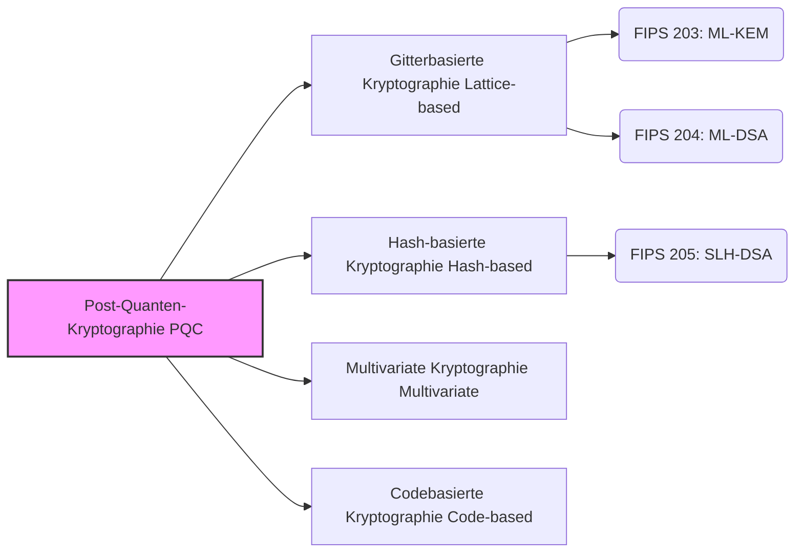

## Einführung: Die "Bedrohung" der Kryptographie durch Quantencomputer

Heutzutage wird ein Großteil unserer alltäglichen Kommunikation im Internet – Online-Banking-Zahlungen, das Surfen auf Websites (HTTPS), Nachrichten in Messenger-Apps bis hin zu Blockchain- und Krypto-Asset-Transaktionen – durch eine Technologie namens "Public-Key-Kryptographie" geschützt. Konkret bilden Algorithmen wie die RSA-Kryptographie und die Elliptische-Kurven-Kryptographie (ECC) die Grundlage für die Zuverlässigkeit unserer modernen digitalen Gesellschaft.

Diese Verschlüsselungsmethoden basieren auf der Sicherheit mathematischer Probleme, wie der "Faktorisierung riesiger Zahlen" und dem "diskreten Logarithmusproblem", für deren Lösung heutige klassische Computer (einschließlich Supercomputer) astronomisch lange brauchen würden. Wenn jedoch der in den letzten Jahren rasant voranschreitende **Quantencomputer** in die Praxis umgesetzt wird, wird diese Prämisse grundlegend auf den Kopf gestellt.

Der "Shor-Algorithmus", der 1994 von Peter Shor veröffentlicht wurde, bewies mathematisch, dass ein Quantencomputer mit ausreichender Leistung Probleme wie Faktorisierung und diskrete Logarithmen in extrem kurzer Zeit lösen kann. Das bedeutet das Risiko, dass die kryptographische Kommunikation, die das heutige Internet schützt, in Zukunft vollständig entschlüsselt wird (ein Problem, das als Y2Q: Years to Quantum oder Q-Day bezeichnet wird).

Noch gravierender ist die Existenz einer Angriffsmethode namens "Harvest Now, Decrypt Later" (Jetzt Daten stehlen und speichern, später entschlüsseln, wenn die Kryptographie gebrochen werden kann). Daten, die über Jahrzehnte hinweg vertraulich bleiben müssen, wie nationale Geheimnisse, geistiges Eigentum von Unternehmen und persönliche biometrische Informationen, könnten bereits jetzt gestohlen werden mit der Prämisse einer künftigen Entschlüsselung.

Um auf diese beispiellose Krise zu reagieren, bündeln Kryptographen und Forschungseinrichtungen auf der ganzen Welt ihre Anstrengungen, um eine kryptographische Technologie der nächsten Generation zu entwickeln, die auch gegen Angriffe durch Quantencomputer sicher bleibt: die **Post-Quanten-Kryptographie (PQC)** . In diesem Artikel erklären wir die Grundlagen der PQC, die Mechanismen wichtiger Algorithmen und die neuesten Trends in der globalen Standardisierung, die vom US-amerikanischen National Institute of Standards and Technology (NIST) vorangetrieben werden.

---

## Was ist Post-Quanten-Kryptographie (PQC)?

Post-Quanten-Kryptographie (Post-Quantum Cryptography, PQC) ist ein Sammelbegriff für kryptographische Algorithmen, die so konzipiert sind, dass sie auf bestehenden klassischen Computern laufen und gleichzeitig resistent gegen Angriffe durch zukünftige große Quantencomputer (wie den Shor-Algorithmus) sind.

Technologien, die oft damit verwechselt werden, sind die "Quantenkryptographie (Quantum Cryptography)" und die "Quantenschlüsselverteilung (QKD)", aber diese verfolgen völlig andere Ansätze. Die Quantenkryptographie (QKD) ist eine hardwarebasierte Technologie, die physikalische Gesetze der Quantenmechanik (wie die Eigenschaft, dass sich der Zustand bei Beobachtung ändert) nutzt, um Abhören auf dem Kommunikationsweg physikalisch unmöglich zu machen. Sie erfordert dedizierte Glasfasern und spezielle Geräte, was zu Herausforderungen hinsichtlich Einführungskosten und Entfernungsbeschränkungen führt.

Andererseits ist die **PQC eine rein "mathematisch" basierte, softwarebasierte kryptographische Technologie** . Daher kann sie als Software-Update in bestehende Internet-Infrastrukturen, Server, Smartphones, Browser usw. integriert werden und zeichnet sich durch eine sehr hohe Anwendbarkeit in der realen Welt aus. Für IT-Unternehmen und Regierungsbehörden weltweit ist es eine dringende Aufgabe, die derzeit verwendeten RSA und ECC durch diese PQC zu ersetzen (zu migrieren).

---

## Die 4 wichtigsten mathematischen Ansätze der PQC

Basierend auf mathematischen Problemen (wie NP-schweren Problemen), die selbst mit Quantencomputern nicht effizient gelöst werden können, wurden verschiedene PQC-Algorithmen vorgeschlagen. Hier stellen wir die vier wichtigsten Kategorien vor, die derzeit im Mainstream sind.

### Hauptansätze der Post-Quanten-Kryptographie (PQC)

### 1. Gitterbasierte Kryptographie (Lattice-based Cryptography)

Derzeit gilt die "gitterbasierte Kryptographie" als die vielversprechendste und am weitesten verbreitete Methode im Bereich der PQC. Gitterbasierte Kryptographie stützt ihre Sicherheit auf Probleme im Zusammenhang mit regelmäßig angeordneten Punkten (Gitterpunkten) in vieldimensionalen Räumen. Bekannte Probleme sind das "Kürzeste-Vektor-Problem (SVP: Shortest Vector Problem)" und das "Learning With Errors (LWE)"-Problem.

**Überblick über die Funktionsweise:** 
Stellen Sie sich unzählige Punkte vor, die in einem gitterartigen Muster in einem Raum mit extrem hoher Dimension (Hunderte bis Tausende von Dimensionen) angeordnet sind. Einen bestimmten Gitterpunkt in zwei oder drei Dimensionen zu finden, ist einfach, aber in Hunderten von Dimensionen wurde noch kein Algorithmus entdeckt, um ihn effizient zu finden, weder mit einem klassischen noch mit einem Quantencomputer. Insbesondere das LWE-Problem nutzt die Eigenschaft, dass "wenn man absichtlich ein kleines 'Rauschen (Fehler)' zu einem System linearer Gleichungen hinzufügt, es drastisch schwieriger wird, die ursprünglichen Variablen zu erraten".

**Vorteile:** 
- Anwendbar sowohl für Schlüsselaustausch (KEM) als auch für digitale Signaturen.
- Sehr schnelle Verarbeitungsgeschwindigkeit (in einigen Fällen schneller als RSA und ECC).
- Gute Balance mit relativ kleinen Schlüssel- und Chiffretextgrößen.

Viele der derzeit vom NIST standardisierten Algorithmen (wie ML-KEM und ML-DSA) verwenden diese gitterbasierte Kryptographie.

### 2. Hash-basierte Kryptographie (Hash-based Cryptography)

Die hashbasierte Kryptographie ist ein auf digitale Signaturen spezialisierter PQC-Algorithmus. Die Grundlage ihrer Sicherheit hängt ausschließlich von der Kollisionsresistenz und Einwegfunktion sicherer "kryptographischer Hash-Funktionen" wie SHA-2 und SHA-3 ab.

**Überblick über die Funktionsweise:** 
Der Ausgangspunkt ist ein Einweg-Signaturschema (One-Time-Signatur), das nur einmal verwendet werden kann, genannt "Lamport-Signatur". Durch die Bündelung dieser mit einer baumartigen Datenstruktur, dem sogenannten "Merkle-Baum", wird es möglich, mehrere Signaturen mit einem einzigen Schlüsselpaar zu erstellen.

**Vorteile:** 
- Die Sicherheitsgrundlage ist extrem robust, mit einem starken Beweis, dass sie "sicher ist, solange die Hash-Funktion sicher ist".
- Da es weniger Abhängigkeit von mathematischen Strukturen gibt, ist das Risiko, eine unerwartete Entschlüsselungsmethode zu finden, gering.

**Nachteile:** 
- Kann nicht für den Schlüsselaustausch (KEM) verwendet werden, nur für digitale Signaturen.
- Die Signaturgrößen neigen dazu, groß zu sein.
- Es gibt "Zustandsbehaftete (Stateful)" und "Zustandslose (Stateless)" Versionen, wobei stateful (wie XMSS) bei der Implementierung schwierig sind, da die Anzahl der Schlüsselverwendungen streng verwaltet werden muss.

NIST standardisiert "SLH-DSA (ehemals SPHINCS+)" als zustandslose hashbasierte Signatur.

### 3. Multivariate Kryptographie (Multivariate Cryptography)

Multivariate Kryptographie basiert auf der Schwierigkeit, Systeme multivariater quadratischer Polynome mit vielen Variablen (MQ-Problem: Multivariate Quadratic problem) zu lösen. Dieses Problem ist bekanntermaßen NP-schwer.

**Überblick über die Funktionsweise:** 
Der Sender erstellt einen Chiffretext (Signatur), indem er Klartext (oder einen Hash-Wert) in eine komplexe Gleichung mit vielen Variablen einfügt, die als öffentlicher Schlüssel bereitgestellt wird. Der rechtmäßige Empfänger besitzt "verborgene Informationen (eine Trapdoor), die die Struktur der Gleichung in eine leicht lösbare Form umwandeln" als privaten Schlüssel und verwendet diesen zum Entschlüsseln (oder zur Signaturüberprüfung).

**Vorteile:** 
- Sehr kleine Signaturgrößen.
- Extrem schnelle Signaturüberprüfung. Geeignet für IoT-Geräte mit begrenzten Ressourcen.

**Nachteile:** 
- Die Größe des öffentlichen Schlüssels ist sehr groß (oft von mehreren Dutzend bis Hunderten von Kilobyte).
- Es gibt Fälle in der Vergangenheit, in denen vielversprechende Algorithmen (wie Rainbow) durch klassische Angriffe gebrochen wurden, was es schwieriger macht, Vertrauen in ihre Sicherheit aufzubauen als bei anderen Methoden.

### 4. Codebasierte Kryptographie (Code-based Cryptography)

Die codebasierte Kryptographie wendet die Theorie der "Fehlerkorrekturcodes", die zur Korrektur von Fehlern auf Kommunikationswegen verwendet werden, auf die Kryptographie an. Das 1978 vorgeschlagene "McEliece-Kryptosystem" ist das bekannteste und eines der ältesten in der PQC.

**Überblick über die Funktionsweise:** 
Der Sender codiert den Klartext unter Verwendung des öffentlichen Schlüssels des Empfängers (eine Generatormatrix eines Fehlerkorrekturcodes mit verborgener spezifischer Struktur) und fügt absichtliche Fehler (Rauschen) hinzu, bevor er ihn sendet. Der Empfänger verwendet den privaten Schlüssel, um die Fehler zu entfernen und den Klartext zu extrahieren. Ein Kryptoanalytiker muss die Fehler aus einem bloßen Zufallscode korrigieren, dessen Struktur er nicht kennt; dies wird als "allgemeines Syndrom-Dekodierungsproblem" bezeichnet und es ist bewiesen, dass es NP-schwer ist.

**Vorteile:** 
- Da es seit über 40 Jahren intensiv erforscht wird und bisher keine wirksamen Angriffe gefunden wurden, ist die Zuverlässigkeit seiner Sicherheit extrem hoch.
- Schnelle Verarbeitungsgeschwindigkeiten für Verschlüsselung und Entschlüsselung.

**Nachteile:** 
- Die Größe des öffentlichen Schlüssels ist enorm (kann mehrere Megabyte betragen). Daher ist es schwierig, es in Umgebungen mit begrenzter Kommunikationsbandbreite oder Speicherkapazität (wie bei TLS-Handshakes) zu verwenden.

---

## Neueste Entwicklungen der PQC-Standardisierung durch NIST

Das US-amerikanische National Institute of Standards and Technology (NIST) rief 2016 weltweit zur Einreichung von Vorschlägen für Post-Quanten-Kryptographie-Algorithmen der nächsten Generation auf und hat über mehrere Jahre hinweg strenge Evaluierungen und Runden durchgeführt.

Im Jahr 2024 veröffentlichte NIST schließlich die folgenden drei Algorithmen als offizielle Federal Information Processing Standards (FIPS). Damit wurde ein solides Fundament für Organisationen auf der ganzen Welt geschaffen, um mit der Implementierung in Produktionsumgebungen zu beginnen.

### Festgelegte FIPS-Standards (2024)

1. **FIPS 203: ML-KEM (früher: CRYSTALS-Kyber)** 
   - **Verwendung:** Key Encapsulation Mechanism (KEM) / Verschlüsselung & Schlüsselaustausch
   - **Basistechnologie:** Gitterbasierte Kryptographie (Module-LWE)
   - **Eigenschaften:** Hervorragendes Gleichgewicht zwischen Schlüsselgröße und Geschwindigkeit; dient als Standard-PQC-Schlüsselaustausch für allgemeine Internetanwendungen wie Webkommunikation (TLS) und sichere Messaging-Apps.

2. **FIPS 204: ML-DSA (früher: CRYSTALS-Dilithium)** 
   - **Verwendung:** Digitale Signatur
   - **Basistechnologie:** Gitterbasierte Kryptographie (Module-LWE)
   - **Eigenschaften:** Der primäre Standard für digitale Signaturen. Es ermöglicht eine effiziente Verarbeitung und wird der neue Standard für alle elektronischen Signaturanwendungen sein, wie z. B. Software-Signaturen und Dokumentenauthentifizierung.

3. **FIPS 205: SLH-DSA (früher: SPHINCS+)** 
   - **Verwendung:** Digitale Signatur
   - **Basistechnologie:** Hash-basierte Kryptographie (zustandslos)
   - **Eigenschaften:** Spielt eine entscheidende Rolle, da es als Backup fungiert, falls in Zukunft Schwachstellen in der gitterbasierten Kryptographie entdeckt werden sollten. Die Signaturgröße ist größer, aber es eignet sich für Anwendungen, die eine langfristige Zuverlässigkeit erfordern.

### Das Streben nach weiterer Diversität

Während das NIST seinen ersten Standardisierungsprozess abgeschlossen hat, setzt es die Suche nach weiteren Algorithmen fort. Insbesondere weil die Standards derzeit auf "Gitterbasierte Kryptographie" ausgerichtet sind, wird der Gewährleistung von **kryptographischer Diversität (Crypto Diversity)** große Bedeutung beigemessen. Codebasierte Kryptographie und andere werden als Backup-Standards für den Schlüsselaustausch evaluiert, und das Fundament der PQC soll in Zukunft noch robuster werden.

---

## Übergangsszenarien zur PQC und Herausforderungen: Die Bedeutung der "Crypto-Agility"

Mit der Veröffentlichung formeller Standards durch das NIST werden Regierungsbehörden, Finanzinstitute und Technologieunternehmen auf der ganzen Welt den Übergang (Migration) vom bestehenden RSA/ECC zur PQC ernsthaft einleiten. Richtlinien von Organisationen wie der NSA (National Security Agency) empfehlen ebenfalls einen baldigen Abschluss der Migration.

### Annahme eines hybriden Ansatzes

Da PQC-Algorithmen neu sind, haben sie im Vergleich zur klassischen Kryptographie nicht den "Test der Zeit" bestanden. Um das Risiko von Fehlern in der Implementierung oder der Entdeckung neuer Angriffsmethoden zu berücksichtigen, wird während der Übergangsphase ein **"hybrider Ansatz"** empfohlen. Hierbei wird ein bewährtes bestehendes Kryptosystem (z. B. ECDHE) mit einem neuen PQC (z. B. ML-KEM) für den Schlüsselaustausch kombiniert. Derzeit schreitet die probeweise Einführung dieses Ansatzes in großen Browsern und Cloud-Diensten rasant voran.

### Erreichen von Crypto-Agility (Kryptographische Agilität)

Was Unternehmen und Systementwickler in Zukunft am meisten im Auge behalten sollten, ist die Gewährleistung der **"Crypto-Agility"** . Eine flexible Architektur, die es ermöglicht, kryptographische Algorithmen schnell auszutauschen und zu aktualisieren, ohne das System anzuhalten, wenn in Zukunft Schwachstellen in einem Algorithmus entdeckt werden oder neue Standards aufkommen, ist unerlässlich.

Die Erstellung eines Kryptographie-Inventars (CBOM: Cryptography Bill of Materials), um genau zu verstehen, "wo", "welche Kryptographie" und "zu welchem Zweck" in den eigenen Systemen verwendet wird, ist ein wichtiger erster Schritt in Richtung PQC-Migration.

---

## Fazit: Vorbereitung auf den kommenden "Q-Day"

Während die Entwicklung von Quantencomputern der Menschheit enorme Vorteile bringen wird, stellt sie gleichzeitig die größte Bedrohung für die kryptographische Sicherheit dar, die die Grundlage unserer derzeitigen digitalen Gesellschaft bildet. Die Post-Quanten-Kryptographie (PQC) ist kein "Forschungsthema der fernen Zukunft" mehr. Durch den Meilenstein der Veröffentlichung von FIPS-Standards durch das NIST ist die PQC in eine vollwertige Phase der "Implementierung und Migration" eingetreten.

In Anbetracht der Bedrohung durch "Harvest Now, Decrypt Later" ist der Übergang zur PQC eine oberste Priorität, die für jede Organisation, die mit hochsensiblen Daten umgeht, "jetzt sofort" angegangen werden muss. Lassen Sie uns die Technologie der Kryptographie der nächsten Generation tief verstehen und die Crypto-Agility unserer Systeme erhöhen, um das kommende Quantencomputer-Zeitalter sicher zu meistern.
