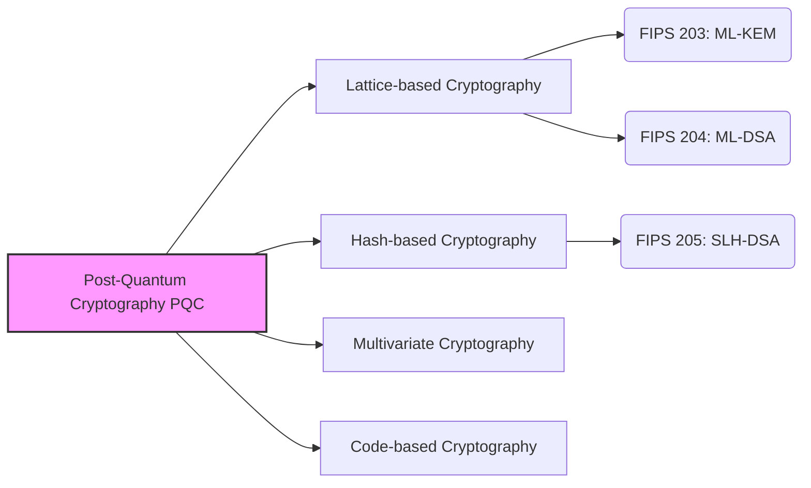

## Introduction: The "Threat" Quantum Computers Pose to Cryptography

Currently, many of the communications we conduct daily on the internet—such as online banking payments, website browsing (HTTPS), messaging app exchanges, and blockchain/crypto asset transactions—are protected by a technology called "Public Key Cryptography". Specifically, algorithms like RSA and Elliptic Curve Cryptography (ECC) form the foundation supporting the reliability of our modern digital society.

These cryptographic methods rely on mathematical hard problems, such as "prime factorization of large numbers" and the "discrete logarithm problem," which would take astronomical amounts of time for current classical computers (including supercomputers) to solve. However, when **"quantum computers,"** which have been making remarkable progress in recent years, become practically viable, this premise will be fundamentally overturned.

Shor's Algorithm, introduced by Peter Shor in 1994, mathematically proved that a sufficiently powerful quantum computer could solve prime factorization and discrete logarithm problems in an extremely short time. This means there is a risk that all cryptographic communications currently protecting the internet will eventually be decrypted (an issue known as Y2Q: Years to Quantum, or Q-Day).

Even more serious is the existence of the "Harvest Now, Decrypt Later" attack method (stealing and storing data now to decrypt it in the future when cryptography can be broken). Data that needs to remain confidential for decades, such as state secrets, corporate intellectual property, and personal biometric information, may already be the target of theft with the premise of future decryption.

To respond to this unprecedented crisis, cryptographers and research institutions around the world are working together to develop **Post-Quantum Cryptography (PQC)**, a next-generation cryptographic technology designed to maintain security against attacks by quantum computers. This article will explain the basics of PQC, the mechanisms of its major algorithms, and the latest trends in global standardization driven by the National Institute of Standards and Technology (NIST).

---

## What is Post-Quantum Cryptography (PQC)?

Post-Quantum Cryptography (PQC) is a general term for cryptographic algorithms designed to run on existing classical computers while also being resistant to attacks by large-scale quantum computers expected in the future (such as Shor's algorithm).

It is often confused with "Quantum Cryptography" or "Quantum Key Distribution (QKD)," but these take entirely different approaches. Quantum Cryptography (QKD) is a hardware-based technology that uses the physical laws of quantum mechanics (such as the property that observing a quantum state changes it) to make eavesdropping on communication paths physically impossible. It requires dedicated optical fibers and specialized equipment, posing challenges related to deployment costs and distance limitations.

On the other hand, **PQC is strictly a software-based cryptographic technology based on "mathematics."** Therefore, it can be integrated into existing internet infrastructure, servers, smartphones, and browsers as software updates, making it highly applicable to the real world. IT companies and government agencies around the world consider replacing (migrating) the currently used RSA and ECC with PQC as an urgent priority.

---

## The 4 Major Mathematical Approaches Supporting PQC

Various PQC algorithms have been proposed based on mathematical hard problems (such as NP-hard problems) that cannot be solved efficiently even with a quantum computer. Here, we introduce the four main categories currently in the mainstream.

### Major Approaches to Post-Quantum Cryptography (PQC)

### 1. Lattice-based Cryptography

Currently, "Lattice-based Cryptography" is considered the most promising and mainstream approach in the field of PQC. It bases its security on problems related to points (lattice points) regularly arranged in a multidimensional space. Famous problems include the "Shortest Vector Problem (SVP)" and the "Learning With Errors (LWE) problem."

**Mechanism Overview:** 
Imagine countless points arranged in a grid within a very high-dimensional (hundreds to thousands of dimensions) space. Finding a specific lattice point is easy in 2 or 3 dimensions, but in hundreds of dimensions, no efficient algorithm has been found for either classical or quantum computers. The LWE problem, in particular, exploits the property that "if small 'noise (errors)' is intentionally added to a system of linear equations, deducing the original variables becomes drastically harder."

**Pros:** 
- Applicable to both Key Encapsulation Mechanisms (KEM) and digital signatures.
- Extremely fast processing speeds (sometimes faster than RSA and ECC).
- Well-balanced with relatively small key and ciphertext sizes.

Many of the algorithms currently being standardized by NIST (such as ML-KEM and ML-DSA) adopt this lattice-based cryptography.

### 2. Hash-based Cryptography

Hash-based cryptography is a PQC algorithm specialized for digital signatures. Its security relies entirely on the collision resistance and one-wayness of secure "cryptographic hash functions" like SHA-2 and SHA-3.

**Mechanism Overview:** 
It starts with a one-time signature scheme called "Lamport Signature." By bundling this in a tree-structured data format called a "Merkle Tree," it allows for multiple signatures using a single key pair.

**Pros:** 
- The foundation of its security is extremely solid, carrying a strong proof that it is "secure as long as the hash function is secure."
- Due to its low reliance on mathematical structures, the risk of unexpected decryption methods being discovered is low.

**Cons:** 
- Cannot be used for Key Encapsulation (KEM); only applicable to digital signatures.
- Tends to have larger signature sizes.
- There are "stateful" and "stateless" variants. The stateful ones (like XMSS) require strict management of the number of key uses, making implementation difficult.

NIST has standardized "SLH-DSA (formerly SPHINCS+)" as a stateless hash-based signature.

### 3. Multivariate Cryptography

Multivariate cryptography bases its security on the difficulty of solving systems of multivariate quadratic polynomial equations (the Multivariate Quadratic problem, or MQ problem). This problem is known to be NP-hard.

**Mechanism Overview:** 
The sender creates a ciphertext (or signature) by substituting plaintext (or hash values) into complex equations with numerous variables provided as the public key. The legitimate receiver holds "hidden information (a trapdoor) that transforms the structure of the equations into an easily solvable form" as a private key, and uses this for decryption (or signature verification).

**Pros:** 
- Signature sizes are very small.
- Signature verification speeds are extremely fast. Suitable for IoT devices with limited resources.

**Cons:** 
- Public key sizes are very large (ranging from tens to hundreds of kilobytes).
- There have been cases where prominent algorithms (like Rainbow) were broken by classical attacks in the past, making it somewhat more challenging to establish trust in its security compared to other methods.

### 4. Code-based Cryptography

Code-based cryptography applies the theory of "error-correcting codes," which are used to correct errors over communication channels, to cryptography. The "McEliece Cryptosystem," proposed in 1978, is the most famous and one of the oldest in PQC.

**Mechanism Overview:** 
The sender encodes the plaintext using the receiver's public key (a generator matrix of an error-correcting code with a hidden structure) and intentionally adds errors (noise) before sending. The receiver removes the errors using their private key to retrieve the plaintext. An attacker must correct the errors from a seemingly random code without knowing its structure, a problem known as general "syndrome decoding," which has been proven to be NP-hard.

**Pros:** 
- Has been thoroughly studied for over 40 years without any effective attacks being found, so confidence in its security is extremely high.
- Fast encryption and decryption processing.

**Cons:** 
- Public key sizes are massive (sometimes reaching several megabytes). Therefore, it is difficult to use in environments with limited communication bandwidth or memory (such as TLS handshakes).

---

## Latest Trends in NIST's PQC Standardization

The US National Institute of Standards and Technology (NIST) began soliciting next-generation post-quantum cryptography algorithms globally in 2016, and has undergone several years of rigorous evaluation rounds.

In 2024, NIST finally published the following three algorithms as official Federal Information Processing Standards (FIPS). This has laid a solid foundation for organizations worldwide to begin implementing them in production environments.

### Established FIPS Standards (2024)

1. **FIPS 203: ML-KEM (Formerly: CRYSTALS-Kyber)** 
   - **Use Case:** Key Encapsulation Mechanism (KEM) / Encryption & Key Exchange
   - **Underlying Tech:** Lattice-based Cryptography (Module-LWE)
   - **Features:** It offers an excellent balance of key size and speed, serving as the default PQC key exchange for general internet use, such as web communications (TLS) and secure messaging apps.

2. **FIPS 204: ML-DSA (Formerly: CRYSTALS-Dilithium)** 
   - **Use Case:** Digital Signatures
   - **Underlying Tech:** Lattice-based Cryptography (Module-LWE)
   - **Features:** The primary standard for digital signatures. It allows for efficient processing and will become the new standard for all electronic signature applications, including software signing and document authentication.

3. **FIPS 205: SLH-DSA (Formerly: SPHINCS+)** 
   - **Use Case:** Digital Signatures
   - **Underlying Tech:** Hash-based Cryptography (Stateless)
   - **Features:** Plays a crucial role by serving as a backup in case vulnerabilities are ever found in lattice-based cryptography. Although the signature size is larger, it is suitable for applications requiring long-term reliability.

### The Pursuit of Further Diversity

While NIST has completed the initial standardization process, it continues to explore further algorithms. In particular, because the standards lean heavily toward "lattice-based cryptography," ensuring **Crypto Diversity** is seen as critical. The evaluation of code-based cryptography and others is ongoing as backup standards for key exchange, aiming to make the foundation of PQC even more robust in the future.

---

## PQC Migration Scenarios and Challenges: The Importance of "Crypto-Agility"

With the release of official standards from NIST, government agencies, financial institutions, and tech companies around the world will begin transitioning (migrating) from existing RSA/ECC to PQC in earnest. Guidelines from organizations like the NSA (National Security Agency) also recommend early completion of this migration.

### Adopting a Hybrid Approach

Because PQC algorithms are new, they have not withstood the "test of time" compared to classical cryptography. Considering the risks of hidden bugs in implementations or the discovery of new attack methods, a **"Hybrid Approach"** is recommended during this transitional period. This method involves performing key exchanges by combining proven existing cryptography (e.g., ECDHE) with the new PQC (e.g., ML-KEM). Trial introductions of this approach are rapidly advancing in major browsers and cloud services.

### Achieving Crypto-Agility

What companies and system developers must focus on most moving forward is ensuring **"Crypto-Agility."** When flaws are found in algorithms or new standards emerge, it is essential to have a flexible architectural design that allows cryptographic algorithms to be swapped or updated quickly without stopping the system.

Creating a Cryptography Bill of Materials (CBOM) to accurately grasp "where," "what cryptography," and "for what purpose" it is being used within a company's systems is a critical first step toward PQC migration.

---

## Conclusion: Preparing for the Coming "Q-Day"

The evolution of quantum computers will bring tremendous benefits to humanity, while simultaneously posing the greatest threat to the cryptographic security that forms the foundation of our modern digital society. Post-Quantum Cryptography (PQC) is no longer a "research topic of the distant future." Following the milestone of NIST's publication of the FIPS standards, PQC has fully entered the phase of "implementation and migration."

Given the threat of "Harvest Now, Decrypt Later," transitioning to PQC is an immediate, top-priority task for all organizations handling highly sensitive data. By deeply understanding next-generation cryptographic technologies and enhancing your system's crypto-agility, we can safely navigate the approaching quantum computer era.
