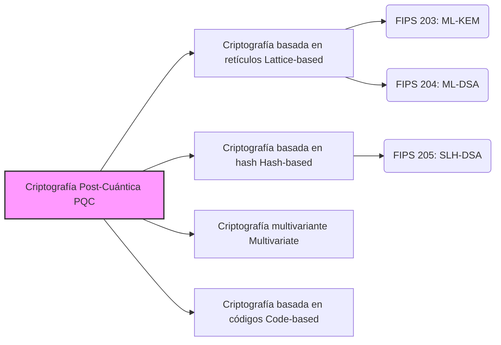

---

title: "【PQC】La visión completa de la criptografía post-cuántica: La criptografía de próxima generación de la era de las computadoras cuánticas"
tags: ["Criptografía", "PQC", "Seguridad", "Tecnología de próxima generación"]
image: "post_quantum_cryptography_1788613735417.jpg"
date: 2026-09-05T22:09:22+09:00
categories: ["Matemáticas, Criptografía y Cuántica"]
---

## Introducción: La "amenaza" de las computadoras cuánticas a la criptografía

En la actualidad, gran parte de nuestras comunicaciones diarias en Internet (como los pagos bancarios en línea, la navegación web (HTTPS), los mensajes en aplicaciones de mensajería, el blockchain y las transacciones de criptomonedas) están protegidas por una tecnología llamada "criptografía de clave pública". Específicamente, algoritmos como RSA y la criptografía de curva elíptica (ECC) constituyen la base fundamental que sustenta la fiabilidad de nuestra sociedad digital moderna.

Estos sistemas criptográficos basan su seguridad en problemas matemáticos difíciles, como la "factorización de enteros gigantes" y el "problema del logaritmo discreto", cuya resolución tomaría un tiempo astronómico para las computadoras clásicas actuales (incluyendo las supercomputadoras). Sin embargo, cuando se materialice el rápido progreso reciente y las **"computadoras cuánticas"** se vuelvan prácticas, esta premisa se verá alterada desde sus cimientos.

En 1994, Peter Shor publicó el "Algoritmo de Shor", demostrando matemáticamente que una computadora cuántica con suficiente capacidad puede resolver la factorización de enteros y los problemas de logaritmos discretos en muy poco tiempo. Esto significa el riesgo (conocido como Y2Q: Years to Quantum, o el problema Q-Day) de que toda la comunicación cifrada que protege la Internet actual sea descifrada en el futuro.

Aún más grave es la existencia de una técnica de ataque llamada "Cosechar ahora, descifrar después" (Harvest Now, Decrypt Later), en la cual los datos se roban y almacenan hoy para descifrarlos en el futuro cuando la tecnología lo permita. Los datos que requieren mantenerse confidenciales durante décadas, como la información clasificada del estado, la propiedad intelectual corporativa y la información biométrica personal, ya podrían ser objeto de robo con la premisa de ser descifrados en el futuro.

Para hacer frente a esta crisis sin precedentes, criptógrafos e institutos de investigación de todo el mundo están aunando esfuerzos para desarrollar una tecnología criptográfica de próxima generación que pueda mantener la seguridad incluso contra ataques de computadoras cuánticas: la **Criptografía Post-Cuántica (PQC: Post-Quantum Cryptography)**. En este artículo, explicaremos en detalle desde los fundamentos de la PQC hasta cómo funcionan sus principales algoritmos, así como las últimas tendencias de estandarización global impulsadas por el Instituto Nacional de Estándares y Tecnología de los Estados Unidos (NIST).

---

## ¿Qué es la Criptografía Post-Cuántica (PQC)?

La Criptografía Post-Cuántica (PQC) es un término general para los algoritmos criptográficos diseñados para funcionar en las computadoras clásicas existentes y, al mismo tiempo, ser resistentes a ataques de las computadoras cuánticas a gran escala que surgirán en el futuro (como el algoritmo de Shor).

A menudo se confunde con tecnologías como la "Criptografía Cuántica" y la "Distribución Cuántica de Claves (QKD)", pero estos son enfoques completamente diferentes. La Criptografía Cuántica (QKD) es una tecnología basada en hardware que utiliza las leyes de la física cuántica (como la propiedad de que la observación altera el estado) para hacer que las escuchas clandestinas en la ruta de comunicación sean físicamente imposibles. Requiere fibra óptica dedicada y equipo especial, lo que presenta desafíos en términos de costos de implementación y limitaciones de distancia.

Por otro lado, **la PQC es una tecnología criptográfica basada en software fundamentada puramente en "matemáticas"**. Por lo tanto, puede incorporarse como actualizaciones de software en la infraestructura de Internet existente, servidores, teléfonos inteligentes, navegadores, etc., lo que la hace altamente aplicable en el mundo real. Las empresas de TI y las agencias gubernamentales de todo el mundo consideran urgente reemplazar (migrar) los actuales RSA y ECC por esta PQC.

---

## Los 4 enfoques matemáticos principales que sustentan la PQC

Se han propuesto varios algoritmos de PQC basados en problemas matemáticos difíciles de resolver de manera eficiente incluso con computadoras cuánticas (como los problemas NP-difíciles). Aquí presentamos las 4 categorías principales que dominan actualmente.

### Enfoques principales de la Criptografía Post-Cuántica (PQC)

### 1. Criptografía basada en retículos (Lattice-based Cryptography)

Actualmente, la criptografía basada en retículos es la más prometedora y predominante en el campo de la PQC. Su seguridad se fundamenta en problemas relacionados con puntos dispuestos regularmente (puntos de retículo) en espacios multidimensionales. Problemas famosos incluyen el "Problema del Vector Más Corto (SVP)" y el "Aprendizaje con Errores (LWE)".

**Resumen del funcionamiento:** 
Imagine innumerables puntos dispuestos como una cuadrícula (retículo) en un espacio de altísima dimensión (cientos a miles de dimensiones). Encontrar un punto de retículo específico es fácil en 2 o 3 dimensiones, pero a cientos de dimensiones, no se ha descubierto un algoritmo eficiente para encontrarlo, ni para computadoras clásicas ni cuánticas. El problema LWE, en particular, aprovecha la propiedad de que "si se agrega intencionalmente un pequeño 'ruido (error)' a un sistema de ecuaciones lineales, se vuelve drásticamente más difícil adivinar las variables originales".

**Ventajas:** 
- Aplicable tanto a la encapsulación de claves (KEM) como a firmas digitales.
- Velocidad de procesamiento extremadamente rápida (a veces más rápida que RSA y ECC).
- Buen equilibrio entre el tamaño de la clave y el tamaño del texto cifrado.

Muchos de los algoritmos actualmente estandarizados por el NIST (como ML-KEM y ML-DSA) utilizan esta criptografía basada en retículos.

### 2. Criptografía basada en hash (Hash-based Cryptography)

La criptografía basada en hash es un algoritmo PQC especializado en firmas digitales. La base de su seguridad depende únicamente de la resistencia a colisiones y la unidireccionalidad de "funciones hash criptográficas" seguras como SHA-2 y SHA-3.

**Resumen del funcionamiento:** 
Comienza con un esquema de firma de un solo uso llamado "Firma de Lamport". Al agrupar estas firmas utilizando una estructura de datos en forma de árbol llamada "Árbol de Merkle", se permiten múltiples firmas con un solo par de claves.

**Ventajas:** 
- La base de seguridad es extremadamente robusta; hay una fuerte prueba de que "es seguro mientras la función hash sea segura".
- Al depender poco de una estructura matemática, el riesgo de que se descubra un método de descifrado imprevisto es bajo.

**Desventajas:** 
- Solo se puede usar para firmas digitales, no para el establecimiento de claves (KEM).
- El tamaño de la firma tiende a ser grande.
- Existen variantes "con estado" (stateful) y "sin estado" (stateless). Las variantes con estado (como XMSS) requieren una gestión estricta del número de usos de la clave, lo que dificulta su implementación.

NIST ha estandarizado "SLH-DSA (anteriormente SPHINCS+)" como una firma basada en hash sin estado.

### 3. Criptografía multivariante (Multivariate Cryptography)

La criptografía de polinomios multivariantes basa su seguridad en la dificultad de resolver un sistema de ecuaciones polinómicas cuadráticas simultáneas con múltiples variables (el problema MQ). Se sabe que este problema es NP-difícil.

**Resumen del funcionamiento:** 
El remitente crea un texto cifrado (firma) sustituyendo el texto sin formato (o el valor hash) en una compleja ecuación con múltiples variables proporcionada como clave pública. El destinatario legítimo posee "información oculta (una puerta trasera) que transforma la estructura de la ecuación en una forma fácil de resolver" como su clave privada, y la utiliza para descifrar (o verificar la firma).

**Ventajas:** 
- El tamaño de la firma es muy pequeño.
- La velocidad de verificación de la firma es extremadamente rápida. Adecuado para dispositivos IoT con recursos limitados.

**Desventajas:** 
- El tamaño de la clave pública es muy grande (puede ser de decenas a cientos de kilobytes).
- En el pasado, algoritmos prominentes (como Rainbow) han sido quebrados por ataques clásicos, lo que dificulta establecer la confianza en su seguridad en comparación con otros métodos.

### 4. Criptografía basada en códigos (Code-based Cryptography)

La criptografía basada en códigos aplica a la criptografía la teoría de los "códigos de corrección de errores" utilizados para corregir errores en las rutas de comunicación. El "criptosistema McEliece", propuesto en 1978, es el más famoso y uno de los más antiguos de la PQC.

**Resumen del funcionamiento:** 
El remitente codifica el texto sin formato utilizando la clave pública del destinatario (una matriz generadora de un código de corrección de errores con una estructura oculta), agrega un error intencional (ruido) y lo envía. El destinatario elimina el error usando la clave privada y extrae el texto sin formato. El atacante debe corregir el error de un código aparentemente aleatorio sin conocer su estructura, lo que se conoce como el "problema general de decodificación de síndrome", probado como NP-difícil.

**Ventajas:** 
- Tras más de 40 años de estudio exhaustivo, no se han encontrado ataques efectivos, lo que le otorga una altísima confianza en su seguridad.
- Procesamiento de cifrado y descifrado rápido.

**Desventajas:** 
- El tamaño de la clave pública es gigantesco (puede ser de varios megabytes). Por lo tanto, es difícil de utilizar en entornos con ancho de banda de comunicación o memoria limitados (como en el handshake de TLS).

---

## Últimas tendencias en la estandarización de PQC por parte del NIST

El Instituto Nacional de Estándares y Tecnología de los Estados Unidos (NIST) comenzó en 2016 a solicitar algoritmos criptográficos post-cuánticos de próxima generación en todo el mundo, llevando a cabo evaluaciones rigurosas y múltiples rondas durante varios años.

En 2024, el NIST anunció finalmente los siguientes tres algoritmos como Estándares Federales de Procesamiento de Información (FIPS) oficiales. Esto proporciona una base sólida para que las organizaciones de todo el mundo comiencen a implementarlos en entornos de producción.

### Estándares FIPS Promulgados (2024)

1. **FIPS 203: ML-KEM (anteriormente CRYSTALS-Kyber)** 
   - **Uso:** Mecanismo de encapsulación de claves (KEM) / Cifrado e intercambio de claves
   - **Tecnología base:** Criptografía de retículos (Module-LWE)
   - **Características:** Excelente equilibrio entre tamaño de clave y velocidad. Actuará como el intercambio de claves PQC predeterminado en aplicaciones comunes de Internet, como la comunicación web (TLS) y las aplicaciones de mensajería segura.

2. **FIPS 204: ML-DSA (anteriormente CRYSTALS-Dilithium)** 
   - **Uso:** Firma digital
   - **Tecnología base:** Criptografía de retículos (Module-LWE)
   - **Características:** El estándar principal para firmas digitales. Permite un procesamiento eficiente y se convertirá en el nuevo estándar para todos los propósitos de firmas electrónicas, como la firma de software y la autenticación de documentos.

3. **FIPS 205: SLH-DSA (anteriormente SPHINCS+)** 
   - **Uso:** Firma digital
   - **Tecnología base:** Criptografía basada en hash (sin estado)
   - **Características:** Juega un papel crucial al actuar como respaldo en caso de que se descubran vulnerabilidades en la criptografía de retículos en el futuro. Aunque el tamaño de la firma es mayor, es adecuado para aplicaciones que requieren confiabilidad a largo plazo.

### En busca de una mayor diversidad

Si bien el NIST ha completado su proceso de estandarización inicial, continúa explorando más algoritmos. Debido a que el estándar está fuertemente sesgado hacia la "criptografía de retículos", se hace hincapié en asegurar la **"Diversidad Criptográfica" (Crypto Diversity)**. Se están evaluando métodos como la criptografía basada en códigos como estándares de respaldo para el intercambio de claves, lo que fortalecerá aún más la base de la PQC en el futuro.

---

## Escenarios y desafíos en la transición a PQC: La importancia de la "Agilidad Criptográfica"

Con el lanzamiento de las normas oficiales por parte del NIST, agencias gubernamentales, instituciones financieras y empresas tecnológicas de todo el mundo intensificarán su transición (migración) del RSA/ECC existente a PQC. Las pautas de la NSA (Agencia de Seguridad Nacional de EE. UU.) y otros también recomiendan completar esta transición de manera temprana.

### Adopción de un enfoque híbrido

Como los algoritmos PQC son nuevos, no han superado la "prueba del tiempo" en comparación con la criptografía clásica. Considerando el riesgo de posibles errores de implementación o el descubrimiento de nuevos métodos de ataque, se recomienda un **"enfoque híbrido"** durante el período de transición. Esto implica combinar criptografía existente probada (por ejemplo, ECDHE) con la nueva PQC (por ejemplo, ML-KEM) para el intercambio de claves. Actualmente, los principales navegadores y servicios en la nube están avanzando rápidamente en implementaciones de prueba de este método.

### Lograr la Agilidad Criptográfica (Crypto-Agility)

Lo que las empresas y los desarrolladores de sistemas deben tener más presente en el futuro es asegurar la **"Agilidad Criptográfica" (Crypto-Agility)**. Es indispensable diseñar una arquitectura flexible que permita reemplazar y actualizar rápidamente los algoritmos criptográficos sin detener el sistema, en caso de que se descubran fallos en los algoritmos en el futuro o surjan nuevos estándares.

El primer y crucial paso para la transición a PQC es la creación de un Inventario Criptográfico (CBOM: Cryptography Bill of Materials), que permita saber exactamente "dónde", "qué criptografía" y "con qué propósito" se está utilizando dentro de los sistemas de la empresa.

---

## Conclusión: Preparándose para el "Día Q" (Q-Day)

Si bien la evolución de las computadoras cuánticas traerá enormes beneficios a la humanidad, también representa la mayor amenaza para la seguridad criptográfica, que es la columna vertebral de nuestra sociedad digital actual. La Criptografía Post-Cuántica (PQC) ya no es un "tema de investigación en un futuro lejano". Con el hito de la publicación de los estándares FIPS por parte del NIST, la PQC ha entrado en una fase de "implementación y transición" a gran escala.

Teniendo en cuenta la amenaza de "Cosechar ahora, descifrar después", migrar a PQC es una prioridad absoluta que todas las organizaciones que manejan datos altamente confidenciales deben abordar "ahora mismo". Comprendiendo profundamente las tecnologías criptográficas de próxima generación y aumentando la agilidad criptográfica de los sistemas, preparémonos para superar de forma segura la inminente era de las computadoras cuánticas.
