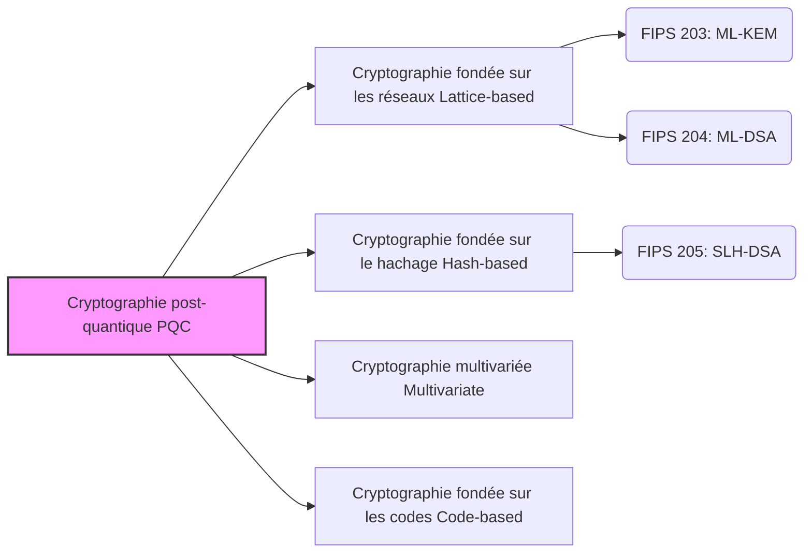

## Introduction : La "menace" de l'informatique quantique pour la technologie de cryptographie

Actuellement, la plupart des communications que nous effectuons quotidiennement sur Internet — paiements bancaires en ligne, navigation web (HTTPS), échanges sur des applications de messagerie, et même transactions sur blockchain ou cryptomonnaies — sont protégées par une technologie appelée "cryptographie à clé publique". Plus précisément, des algorithmes comme le chiffrement RSA et la cryptographie sur les courbes elliptiques (ECC) constituent le fondement de la fiabilité de notre société numérique moderne.

Ces méthodes de cryptographie reposent sur des problèmes mathématiques difficiles, tels que la "factorisation en nombres premiers de très grands nombres" et le "problème du logarithme discret", dont la résolution par les ordinateurs classiques actuels (y compris les supercalculateurs) prendrait un temps astronomique, garantissant ainsi leur sécurité. Cependant, avec la mise en pratique des **ordinateurs quantiques** , qui connaissent des progrès remarquables ces dernières années, cette prémisse sera fondamentalement renversée.

L'algorithme de Shor, présenté par Peter Shor en 1994, a prouvé mathématiquement qu'un ordinateur quantique doté de performances suffisantes pourrait résoudre des problèmes de factorisation et de logarithme discret en un temps extrêmement court. Cela signifie que toutes les communications chiffrées protégeant l'Internet actuel risquent d'être déchiffrées à l'avenir (un problème connu sous le nom de Y2Q : Years to Quantum, ou Q-Day).

Encore plus préoccupante est l'existence d'une méthode d'attaque appelée "Harvest Now, Decrypt Later" (Récolter maintenant, déchiffrer plus tard : voler les données maintenant, les stocker, et les déchiffrer à l'avenir quand cela deviendra possible). Les données nécessitant une confidentialité sur plusieurs décennies, telles que les secrets d'État, la propriété intellectuelle des entreprises et les données biométriques personnelles, pourraient déjà faire l'objet de vols en vue d'un déchiffrement futur.

Pour faire face à cette crise sans précédent, des cryptographes et des instituts de recherche du monde entier concentrent leurs efforts pour développer la **cryptographie post-quantique (PQC : Post-Quantum Cryptography)** , une technologie de chiffrement de nouvelle génération capable de maintenir la sécurité même contre les attaques d'ordinateurs quantiques. Dans cet article, nous expliquerons en détail depuis les bases de la PQC jusqu'aux mécanismes de ses principaux algorithmes, ainsi que les dernières tendances de normalisation mondiale menées par l'Institut national des normes et de la technologie (NIST) des États-Unis.

---

## Qu'est-ce que la cryptographie post-quantique (PQC) ?

La cryptographie post-quantique (Post-Quantum Cryptography, PQC) est un terme générique désignant les algorithmes de chiffrement conçus pour fonctionner sur les ordinateurs classiques existants, tout en résistant aux attaques (comme l'algorithme de Shor) menées par de futurs ordinateurs quantiques à grande échelle.

Des technologies souvent confondues sont la "cryptographie quantique (Quantum Cryptography)" et la "distribution quantique de clés (QKD)", mais il s'agit d'approches totalement différentes. La cryptographie quantique (QKD) est une technologie matérielle qui utilise les lois de la mécanique quantique (comme le fait que l'observation modifie l'état) pour rendre l'écoute sur le canal de communication physiquement impossible. Elle nécessite des fibres optiques dédiées et des équipements spéciaux, ce qui pose des problèmes de coût de déploiement et de limite de distance.

En revanche, **la PQC est une technologie de cryptographie purement logicielle basée sur les mathématiques** . Par conséquent, elle peut être intégrée sous forme de mise à jour logicielle dans l'infrastructure Internet existante, les serveurs, les smartphones, les navigateurs, etc., ce qui la rend extrêmement applicable dans le monde réel. Pour les entreprises informatiques et les gouvernements du monde entier, remplacer (migrer) le RSA et l'ECC actuellement utilisés par cette PQC est une tâche urgente.

---

## Les 4 principales approches mathématiques soutenant la PQC

Divers algorithmes de PQC ont été proposés, basés sur des problèmes mathématiques difficiles (comme les problèmes NP-difficiles) qui ne peuvent pas être résolus efficacement même avec un ordinateur quantique. Nous présentons ici les quatre catégories principales actuellement dominantes.

### Approches principales de la cryptographie post-quantique (PQC)

### 1. Cryptographie fondée sur les réseaux (Lattice-based Cryptography)

Actuellement, cette "cryptographie fondée sur les réseaux" est considérée comme la plus prometteuse et constitue la tendance principale dans le domaine de la PQC. La cryptographie sur les réseaux base sa sécurité sur des problèmes liés à des points régulièrement espacés (points de réseau) dans un espace multidimensionnel. Parmi les problèmes célèbres figurent le "problème du vecteur le plus court (SVP : Shortest Vector Problem)" et le "problème d'apprentissage avec erreurs (LWE : Learning With Errors)".

**Aperçu du mécanisme :** 
Imaginez un nombre infini de points disposés en réseau dans un espace à très haute dimension (des centaines à des milliers de dimensions). Trouver un point de réseau spécifique est facile en 2 ou 3 dimensions, mais avec des centaines de dimensions, aucun algorithme efficace n'a été découvert pour y parvenir, ni pour les ordinateurs classiques ni pour les quantiques. En particulier, le problème LWE exploite la propriété selon laquelle « ajouter intentionnellement un petit "bruit (erreur)" à un système d'équations linéaires rend considérablement plus difficile la déduction des variables originales ».

**Avantages :** 
- Applicable à la fois à l'échange de clés (KEM) et aux signatures numériques.
- Vitesse de traitement très rapide (parfois plus rapide que RSA ou ECC).
- Bon équilibre avec des tailles de clé et de texte chiffré relativement petites.

La plupart des algorithmes actuellement normalisés par le NIST (tels que ML-KEM et ML-DSA) adoptent cette cryptographie basée sur les réseaux.

### 2. Cryptographie fondée sur le hachage (Hash-based Cryptography)

La cryptographie fondée sur le hachage est un algorithme PQC spécialisé dans les signatures numériques. Sa sécurité repose uniquement sur la résistance aux collisions et l'unidirectionnalité de "fonctions de hachage cryptographiques" sûres comme SHA-2 ou SHA-3.

**Aperçu du mécanisme :** 
Le point de départ est un schéma de signature à usage unique appelé "signature de Lamport (Lamport Signature)". En les regroupant dans une structure de données arborescente appelée "arbre de Merkle (Merkle Tree)", il devient possible d'effectuer plusieurs signatures avec une seule paire de clés.

**Avantages :** 
- Le fondement de la sécurité est extrêmement solide, avec une forte preuve que "c'est sûr tant que la fonction de hachage est sûre".
- Moins dépendant d'une structure mathématique, réduisant le risque de découvrir des méthodes de décryptage inattendues.

**Inconvénients :** 
- Ne peut pas être utilisé pour l'échange de clés (KEM), uniquement pour les signatures numériques.
- La taille de la signature a tendance à être grande.
- Il existe des approches "avec état (stateful)" et "sans état (stateless)" ; les méthodes avec état (comme XMSS) nécessitent une gestion stricte du nombre d'utilisations de la clé, ce qui les rend difficiles à implémenter.

Le NIST a normalisé "SLH-DSA (anciennement SPHINCS+)" en tant que signature basée sur le hachage sans état.

### 3. Cryptographie multivariée (Multivariate Cryptography)

La cryptographie multivariée base sa sécurité sur la difficulté de résoudre un système d'équations polynomiales quadratiques à plusieurs variables (le problème MQ : Multivariate Quadratic problem). Ce problème est connu pour être NP-difficile.

**Aperçu du mécanisme :** 
L'expéditeur crée un texte chiffré (ou une signature) en substituant le texte clair (ou la valeur de hachage) dans une équation complexe à plusieurs variables fournie en tant que clé publique. Le destinataire légitime possède une "information cachée (trappe)" sous forme de clé secrète permettant de transformer facilement la structure de l'équation sous une forme soluble, et l'utilise pour déchiffrer (ou vérifier la signature).

**Avantages :** 
- La taille de la signature est très petite.
- La vitesse de vérification de la signature est extrêmement rapide. Convient aux appareils IoT aux ressources limitées.

**Inconvénients :** 
- La taille de la clé publique est très grande (peut atteindre des dizaines à des centaines de kilo-octets).
- Dans le passé, des algorithmes prometteurs (comme Rainbow) ont été compromis par des attaques classiques, ce qui rend la confiance en leur sécurité plus difficile à établir que pour d'autres méthodes.

### 4. Cryptographie fondée sur les codes (Code-based Cryptography)

La cryptographie fondée sur les codes applique à la cryptographie la théorie des "codes correcteurs d'erreurs" utilisés pour corriger les erreurs sur les canaux de communication. La "cryptographie de McEliece", proposée en 1978, est la plus célèbre et l'une des plus anciennes du domaine de la PQC.

**Aperçu du mécanisme :** 
L'expéditeur utilise la clé publique du destinataire (une matrice génératrice d'un code correcteur d'erreurs cachant une structure spécifique) pour encoder le texte clair, puis ajoute des erreurs intentionnelles (du bruit) avant de le transmettre. Le destinataire utilise sa clé secrète pour supprimer les erreurs et récupérer le texte clair. Un cryptanalyste doit corriger les erreurs d'un code aléatoire sans en connaître la structure, ce qui est appelé le "problème général de décodage par syndrome", prouvé NP-difficile.

**Avantages :** 
- Ayant été étudiée de manière exhaustive pendant plus de 40 ans sans qu'aucune attaque efficace n'ait été trouvée, sa fiabilité en matière de sécurité est extrêmement élevée.
- Le traitement du chiffrement et du déchiffrement est rapide.

**Inconvénients :** 
- La taille de la clé publique est énorme (peut atteindre plusieurs mégaoctets). Par conséquent, il est difficile de l'utiliser dans des environnements où la bande passante ou la mémoire sont limitées (comme le handshake TLS).

---

## Dernières tendances de la normalisation de la PQC par le NIST

L'Institut national des normes et de la technologie (NIST) des États-Unis a lancé un appel public mondial en 2016 pour les algorithmes de cryptographie post-quantique de nouvelle génération, menant des évaluations rigoureuses sur plusieurs années.

En 2024, le NIST a finalement annoncé les trois algorithmes suivants en tant que normes fédérales de traitement de l'information (FIPS) officielles. Cela fournit une base solide aux organisations du monde entier pour commencer leur implémentation en environnement de production.

### Normes FIPS établies (2024)

1. **FIPS 203: ML-KEM (anciennement : CRYSTALS-Kyber)** 
   - **Utilisation :** Mécanisme d'encapsulation de clé (KEM) / Chiffrement et échange de clés
   - **Technologie de base :** Cryptographie fondée sur les réseaux (Module-LWE)
   - **Caractéristiques :** Excellent équilibre entre la taille de la clé et la vitesse, il servira d'échange de clés PQC par défaut pour des utilisations Internet générales telles que les communications web (TLS) et les applications de messagerie sécurisées.

2. **FIPS 204: ML-DSA (anciennement : CRYSTALS-Dilithium)** 
   - **Utilisation :** Signature numérique
   - **Technologie de base :** Cryptographie fondée sur les réseaux (Module-LWE)
   - **Caractéristiques :** Norme principale pour les signatures numériques. Permettant un traitement efficace, elle deviendra la nouvelle norme pour toutes les applications de signature électronique, telles que la signature de logiciels et l'authentification de documents.

3. **FIPS 205: SLH-DSA (anciennement : SPHINCS+)** 
   - **Utilisation :** Signature numérique
   - **Technologie de base :** Cryptographie fondée sur le hachage (sans état)
   - **Caractéristiques :** Joue un rôle crucial car il sert de sauvegarde au cas où des vulnérabilités seraient découvertes dans la cryptographie sur les réseaux à l'avenir. Bien que la taille de la signature soit plus grande, elle convient aux applications nécessitant une fiabilité à long terme.

### La recherche d'une plus grande diversité

Bien que le NIST ait terminé son premier processus de normalisation, il continue d'explorer d'autres algorithmes. La normalisation étant particulièrement biaisée en faveur de la "cryptographie fondée sur les réseaux", il est jugé essentiel d'assurer la **diversité des algorithmes (Crypto Diversity)** . Des évaluations sont en cours pour des méthodes comme la cryptographie basée sur les codes comme norme de sauvegarde pour l'échange de clés, et les fondations de la PQC devraient devenir encore plus solides à l'avenir.

---

## Scénarios de transition vers la PQC et défis : L'importance de la "Crypto-Agilité"

Avec la publication de normes officielles par le NIST, les agences gouvernementales, les institutions financières et les entreprises technologiques du monde entier accélèrent leur migration (transition) des systèmes existants RSA/ECC vers la PQC. Les directives d'organismes tels que la NSA (Agence nationale de sécurité américaine) recommandent également d'achever cette migration rapidement.

### Adoption d'une approche hybride

Étant donné que les algorithmes PQC sont nouveaux, ils n'ont pas subi l'épreuve du temps contrairement aux cryptographies classiques. En tenant compte du risque de bugs cachés dans l'implémentation ou de la découverte de nouvelles méthodes d'attaque, une **"approche hybride"** est recommandée pendant la période de transition. Il s'agit d'une méthode d'échange de clés combinant une cryptographie existante éprouvée (ex. : ECDHE) et une nouvelle PQC (ex. : ML-KEM). Actuellement, les principaux navigateurs et services cloud adoptent rapidement cette méthode à titre expérimental.

### Réalisation de la crypto-agilité (Crypto-Agility)

Ce dont les entreprises et les développeurs de systèmes devront être le plus conscients à l'avenir, c'est d'assurer la **"crypto-agilité (Crypto-Agility)"** . Il est essentiel de concevoir une architecture flexible permettant d'échanger et de mettre à jour rapidement les algorithmes de chiffrement sans arrêter le système, au cas où des failles seraient découvertes dans un algorithme ou si de nouvelles normes apparaissaient à l'avenir.

La création d'un inventaire cryptographique (CBOM : Cryptography Bill of Materials) pour identifier avec précision "où", "quelle cryptographie" et "dans quel but" est utilisée au sein des systèmes de l'entreprise constitue une première étape importante vers la migration PQC.

---

## Conclusion : Se préparer au futur "Q-Day"

L'évolution de l'informatique quantique apportera d'énormes avantages à l'humanité, mais elle représente également la plus grande menace pour la sécurité cryptographique qui constitue le fondement de notre société numérique actuelle. La cryptographie post-quantique (PQC) n'est plus un "thème de recherche d'un futur lointain". Après avoir franchi l'étape de la publication des normes FIPS par le NIST, la PQC est entrée dans une véritable phase d'"implémentation et de migration".

Compte tenu de la menace "Harvest Now, Decrypt Later", la migration vers la PQC est une priorité absolue qui doit être entreprise "immédiatement" par toutes les organisations traitant des données sensibles. En comprenant en profondeur la technologie de cryptographie de nouvelle génération et en augmentant la crypto-agilité des systèmes, surmontons en toute sécurité l'ère imminente de l'informatique quantique.
