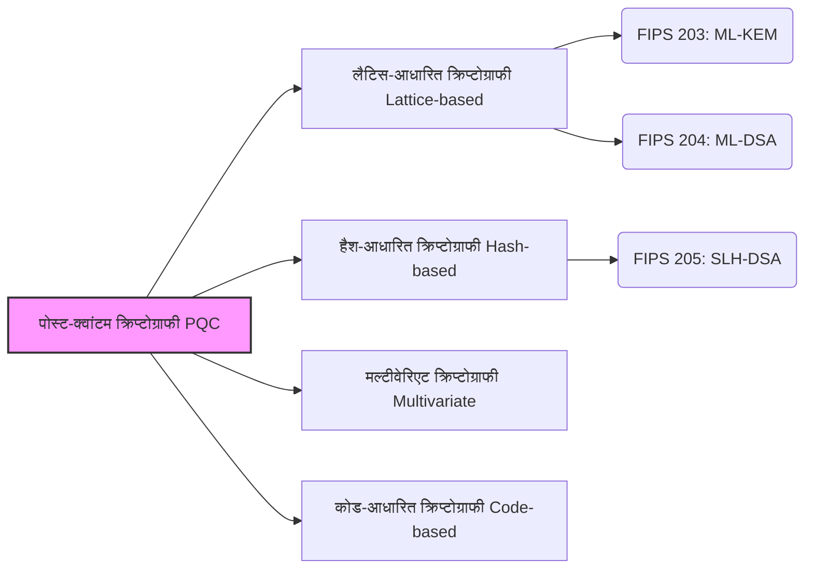

## परिचय: क्वांटम कंप्यूटर द्वारा क्रिप्टोग्राफी के लिए लाया गया "खतरा"

वर्तमान में, हम इंटरनेट पर जो संचार प्रतिदिन करते हैं - ऑनलाइन बैंकिंग में भुगतान, वेबसाइट ब्राउज़िंग (HTTPS), मैसेजिंग ऐप्स के माध्यम से बातचीत, और ब्लॉकचेन या क्रिप्टोकरेंसी लेनदेन - उनमें से अधिकांश "पब्लिक-की क्रिप्टोग्राफी" (Public-key cryptography) नामक तकनीक द्वारा सुरक्षित हैं। विशेष रूप से, RSA और एलीप्टिक कर्व क्रिप्टोग्राफी (ECC) जैसे एल्गोरिदम आधुनिक डिजिटल समाज की विश्वसनीयता का आधार हैं।

ये क्रिप्टोग्राफ़िक विधियां "बड़ी संख्याओं के अभाज्य गुणनखंडन" (Prime factorization) और "असतत लघुगणक समस्या" (Discrete logarithm problem) जैसी गणितीय समस्याओं पर आधारित हैं, जिन्हें हल करने में वर्तमान क्लासिकल कंप्यूटरों (सुपरकंप्यूटरों सहित) को खगोलीय समय लगेगा। हालाँकि, जब **"क्वांटम कंप्यूटर"** (जो हाल के वर्षों में उल्लेखनीय प्रगति कर रहे हैं) व्यावहारिक उपयोग में आ जाएंगे, तो यह आधारभूत मान्यता पूरी तरह से उलट जाएगी।

1994 में पीटर शोर (Peter Shor) द्वारा प्रकाशित "शोर का एल्गोरिदम", गणितीय रूप से साबित करता है कि पर्याप्त शक्ति वाला एक क्वांटम कंप्यूटर अभाज्य गुणनखंडन और असतत लघुगणक समस्याओं को बहुत कम समय में हल कर सकता है। इसका मतलब यह है कि वर्तमान में इंटरनेट की रक्षा करने वाले सभी एन्क्रिप्टेड संचारों को भविष्य में डिक्रिप्ट किए जाने का जोखिम है (इस समस्या को Y2Q: Years to Quantum, या Q-Day कहा जाता है)।

इससे भी अधिक गंभीर बात यह है कि "अभी हार्वेस्ट करें, बाद में डिक्रिप्ट करें" (Harvest Now, Decrypt Later - अभी डेटा चुराएं और स्टोर करें, भविष्य में डिक्रिप्शन संभव होने पर डिक्रिप्ट करें) जैसी हमले की तकनीकें मौजूद हैं। राज्य के रहस्य, कॉर्पोरेट बौद्धिक संपदा, और व्यक्तिगत बायोमेट्रिक जानकारी जैसे डेटा जिन्हें दशकों तक गोपनीय रखने की आवश्यकता होती है, पहले से ही भविष्य के डिक्रिप्शन के इरादे से चोरी का लक्ष्य हो सकते हैं।

इस अभूतपूर्व संकट का जवाब देने के लिए, दुनिया भर के क्रिप्टोग्राफर और शोध संस्थान एक अगली पीढ़ी की क्रिप्टोग्राफ़िक तकनीक विकसित करने के लिए मिलकर काम कर रहे हैं जो क्वांटम कंप्यूटर हमलों के खिलाफ सुरक्षा बनाए रख सके: **पोस्ट-क्वांटम क्रिप्टोग्राफी (PQC)** । इस लेख में, हम PQC की मूल बातों से लेकर, प्रमुख एल्गोरिदम कैसे काम करते हैं, और संयुक्त राज्य अमेरिका के राष्ट्रीय मानक और प्रौद्योगिकी संस्थान (NIST) द्वारा संचालित वैश्विक मानकीकरण के नवीनतम रुझानों तक सब कुछ विस्तार से बताएंगे।

---

## पोस्ट-क्वांटम क्रिप्टोग्राफी (PQC) क्या है?

पोस्ट-क्वांटम क्रिप्टोग्राफी (Post-Quantum Cryptography, PQC) उन क्रिप्टोग्राफ़िक एल्गोरिदम के लिए एक सामान्य शब्द है जो मौजूदा क्लासिकल कंप्यूटरों पर चलते हैं और भविष्य के बड़े पैमाने के क्वांटम कंप्यूटरों (जैसे शोर के एल्गोरिदम) द्वारा किए जाने वाले हमलों के प्रतिरोधी होने के लिए डिज़ाइन किए गए हैं।

प्रौद्योगिकियां जिन्हें अक्सर PQC के साथ भ्रमित किया जाता है वे हैं "क्वांटम क्रिप्टोग्राफी" (Quantum Cryptography) और "क्वांटम की डिस्ट्रीब्यूशन" (QKD), लेकिन ये पूरी तरह से अलग दृष्टिकोण हैं। क्वांटम क्रिप्टोग्राफी (QKD) एक हार्डवेयर-आधारित तकनीक है जो संचार पथों पर ईव्सड्रॉपिंग को भौतिक रूप से असंभव बनाने के लिए क्वांटम यांत्रिकी के भौतिक नियमों (जैसे कि देखे जाने पर अवस्थाओं को बदलने का गुण) का उपयोग करती है। इसके लिए समर्पित ऑप्टिकल फाइबर और विशेष उपकरणों की आवश्यकता होती है, और इसमें स्थापना लागत और दूरी की सीमाओं जैसी चुनौतियाँ हैं।

दूसरी ओर, **PQC विशुद्ध रूप से "गणित" पर आधारित एक सॉफ्टवेयर-आधारित क्रिप्टोग्राफिक तकनीक है** । इसलिए, इसे मौजूदा इंटरनेट इंफ्रास्ट्रक्चर, सर्वर, स्मार्टफोन और ब्राउज़र में सॉफ़्टवेयर अपडेट के रूप में शामिल किया जा सकता है, जो इसे वास्तविक दुनिया के अनुप्रयोगों के लिए अत्यधिक अनुकूल बनाता है। दुनिया भर की आईटी कंपनियों और सरकारी एजेंसियों के लिए यह एक आवश्यक कार्य बन गया है कि वे वर्तमान में उपयोग किए जा रहे RSA और ECC को इस PQC से बदलें (माइग्रेट करें)।

---

## PQC का समर्थन करने वाले 4 मुख्य गणितीय दृष्टिकोण

विभिन्न PQC एल्गोरिदम गणितीय समस्याओं (जैसे NP-hard समस्याएं) के आधार पर प्रस्तावित किए गए हैं जिन्हें क्वांटम कंप्यूटर का उपयोग करके भी कुशलता से हल नहीं किया जा सकता है। यहाँ हम वर्तमान में मुख्यधारा की चार प्रमुख श्रेणियों का परिचय देंगे।

### पोस्ट-क्वांटम क्रिप्टोग्राफी (PQC) के प्रमुख दृष्टिकोण

### 1. लैटिस-आधारित क्रिप्टोग्राफी (Lattice-based Cryptography)

वर्तमान में, PQC के क्षेत्र में सबसे आशाजनक और मुख्यधारा का दृष्टिकोण यह "लैटिस-आधारित क्रिप्टोग्राफी" है। लैटिस-आधारित क्रिप्टोग्राफी अपनी सुरक्षा को एक बहुआयामी अंतरिक्ष में नियमित रूप से व्यवस्थित बिंदुओं (लैटिस पॉइंट्स) से संबंधित समस्याओं पर आधारित करती है। प्रसिद्ध समस्याओं में "शॉर्टेस्ट वेक्टर प्रॉब्लम" (SVP) और "लर्निंग विद एरर्स" (LWE) शामिल हैं।

**सिस्टम का अवलोकन:** 
कल्पना करें कि एक बहुत ही उच्च-आयामी (सैकड़ों से हजारों आयाम) अंतरिक्ष में एक ग्रिड पैटर्न में व्यवस्थित अनगिनत बिंदु हैं। 2 या 3 आयामों में किसी विशिष्ट लैटिस बिंदु को खोजना आसान है, लेकिन जब बात सैकड़ों आयामों की आती है, तो ऐसा कोई एल्गोरिदम नहीं खोजा गया है जो इसे क्लासिकल या क्वांटम कंप्यूटर दोनों से कुशलतापूर्वक ढूंढ सके। विशेष रूप से LWE समस्या इस गुण का उपयोग करती है कि "यदि जानबूझकर समकालिक रैखिक समीकरणों में थोड़ा सा 'शोर' (त्रुटि) जोड़ा जाए, तो मूल चर का अनुमान लगाना नाटकीय रूप से कठिन हो जाता है।"

**फायदे:** 
- की एनकैप्सुलेशन (KEM) और डिजिटल सिग्नेचर दोनों के लिए लागू।
- प्रसंस्करण गति बहुत तेज है (कुछ मामलों में RSA या ECC से भी तेज)।
- की (key) का आकार और सिफरटेक्स्ट का आकार अपेक्षाकृत छोटा और अच्छी तरह से संतुलित है।

वर्तमान में NIST द्वारा मानकीकृत अधिकांश एल्गोरिदम (जैसे ML-KEM और ML-DSA) इस लैटिस-आधारित क्रिप्टोग्राफी को अपनाते हैं।

### 2. हैश-आधारित क्रिप्टोग्राफी (Hash-based Cryptography)

हैश-आधारित क्रिप्टोग्राफी एक PQC एल्गोरिदम है जो डिजिटल सिग्नेचर में माहिर है। सुरक्षा का आधार पूरी तरह से SHA-2 और SHA-3 जैसे सुरक्षित "क्रिप्टोग्राफिक हैश फ़ंक्शंस" के टकराव प्रतिरोध (collision resistance) और एकतरफा (one-wayness) पर निर्भर करता है।

**सिस्टम का अवलोकन:** 
शुरुआती बिंदु एक वन-टाइम सिग्नेचर स्कीम है जिसे "लैम्पोर्ट सिग्नेचर" (Lamport Signature) कहा जाता है, जिसका उपयोग केवल एक बार किया जा सकता है। "मर्कल ट्री" (Merkle Tree) नामक ट्री-संरचित डेटा प्रारूप में इन्हें बंडल करके, एक की-पेयर (key pair) के साथ कई सिग्नेचर संभव हो जाते हैं।

**फायदे:** 
- सुरक्षा का आधार अत्यंत मजबूत है, और एक मजबूत प्रमाण है कि "यह तब तक सुरक्षित है जब तक हैश फ़ंक्शन सुरक्षित है"।
- गणितीय संरचनाओं पर कम निर्भरता के कारण, अप्रत्याशित डिक्रिप्शन विधियों के खोजे जाने का जोखिम कम है।

**नुकसान:** 
- इसका उपयोग की शेयरिंग (KEM) के लिए नहीं किया जा सकता है, केवल डिजिटल सिग्नेचर के लिए।
- सिग्नेचर का आकार बड़ा हो जाता है।
- इसमें "स्टेटफुल" और "स्टेटलेस" प्रकार होते हैं, और स्टेटफुल प्रकार (जैसे XMSS) को लागू करना मुश्किल होता है क्योंकि की के उपयोग की संख्या को सख्ती से प्रबंधित करना आवश्यक होता है।

NIST ने "SLH-DSA (पूर्व में SPHINCS+)" को एक स्टेटलेस हैश-आधारित सिग्नेचर के रूप में मानकीकृत किया है।

### 3. मल्टीवेरिएट पॉलीनोमियल-आधारित क्रिप्टोग्राफी (Multivariate Cryptography)

मल्टीवेरिएट पॉलीनोमियल क्रिप्टोग्राफी एक ऐसी विधि है जिसकी सुरक्षा का आधार कई चर (MQ समस्या: Multivariate Quadratic problem) वाले एक साथ द्विघात बहुपदों की प्रणाली को हल करने की कठिनाई है। यह समस्या NP-hard मानी जाती है।

**सिस्टम का अवलोकन:** 
प्रेषक एक सार्वजनिक कुंजी (पब्लिक की) के रूप में पारित कई चर वाले एक जटिल समीकरण में प्लेनटेक्स्ट (या हैश मान) को प्रतिस्थापित करके एक सिफरटेक्स्ट (सिग्नेचर) बनाता है। वैध प्राप्तकर्ता के पास एक निजी कुंजी (प्राइवेट की) के रूप में "समीकरण संरचना को आसानी से हल करने योग्य रूप में बदलने के लिए छिपी हुई जानकारी (ट्रैपडोर)" होती है, और वह डिक्रिप्शन (या सिग्नेचर वेरिफिकेशन) करने के लिए इसका उपयोग करता है।

**फायदे:** 
- सिग्नेचर का आकार बहुत छोटा होता है।
- सिग्नेचर वेरिफिकेशन गति अत्यंत तेज है। यह सीमित संसाधनों वाले IoT उपकरणों आदि के लिए उपयुक्त है।

**नुकसान:** 
- सार्वजनिक कुंजी (पब्लिक की) का आकार बहुत बड़ा होता है (यह दहाई या सैकड़ों किलोबाइट तक हो सकता है)।
- ऐसे मामले सामने आए हैं जहां अतीत में शक्तिशाली एल्गोरिदम (जैसे रेनबो) क्लासिकल हमलों से टूट गए थे, जिससे अन्य तरीकों की तुलना में इसकी सुरक्षा में विश्वास स्थापित करना अधिक कठिन हो गया।

### 4. कोड-आधारित क्रिप्टोग्राफी (Code-based Cryptography)

कोड-आधारित क्रिप्टोग्राफी संचार पथ पर त्रुटियों को ठीक करने के लिए उपयोग किए जाने वाले "त्रुटि-सुधार कोड" (Error-correcting codes) के सिद्धांत का क्रिप्टोग्राफी में अनुप्रयोग है। 1978 में प्रस्तावित "McEliece क्रिप्टोग्राफी" सबसे प्रसिद्ध है और यह PQC के सबसे पुराने तरीकों में से एक है।

**सिस्टम का अवलोकन:** 
प्रेषक प्राप्तकर्ता की सार्वजनिक कुंजी (एक त्रुटि-सुधार कोड का जनरेटर मैट्रिक्स जिसकी विशिष्ट संरचना छिपी हुई है) का उपयोग करके प्लेनटेक्स्ट को एन्कोड करता है, जानबूझकर त्रुटियां (शोर) जोड़ता है और इसे भेजता है। प्राप्तकर्ता त्रुटियों को दूर करने और प्लेनटेक्स्ट को निकालने के लिए निजी कुंजी का उपयोग करता है। एक कोडब्रेकर को केवल एक यादृच्छिक कोड से त्रुटियों को ठीक करना होगा जिसकी संरचना वह नहीं जानता है, जिसे "सामान्य सिंड्रोम डिकोडिंग समस्या" (General Syndrome Decoding Problem) कहा जाता है, और यह साबित हो गया है कि यह NP-hard है।

**फायदे:** 
- 40 से अधिक वर्षों तक इसका गहन अध्ययन किया गया है, और अभी तक कोई प्रभावी हमले नहीं पाए गए हैं, इसलिए इसकी सुरक्षा विश्वसनीयता अत्यंत उच्च है।
- एन्क्रिप्शन और डिक्रिप्शन प्रोसेसिंग की गति तेज है।

**नुकसान:** 
- सार्वजनिक कुंजी (पब्लिक की) का आकार बहुत विशाल है (यह कई मेगाबाइट तक हो सकता है)। इसलिए, इसे सीमित संचार बैंडविड्थ और मेमोरी (जैसे TLS हैंडशेक) वाले वातावरण में उपयोग करना मुश्किल है।

---

## NIST द्वारा PQC मानकीकरण के नवीनतम रुझान

यूएस नेशनल इंस्टीट्यूट ऑफ स्टैंडर्ड एंड टेक्नोलॉजी (NIST) ने 2016 में दुनिया भर से अगली पीढ़ी के पोस्ट-क्वांटम क्रिप्टोग्राफी एल्गोरिदम के लिए सार्वजनिक आह्वान शुरू किया और कई वर्षों तक कड़े मूल्यांकन और राउंड आयोजित किए हैं।

2024 में, NIST ने अंततः निम्नलिखित तीन एल्गोरिदम को आधिकारिक संघीय सूचना प्रसंस्करण मानकों (FIPS) के रूप में घोषित किया। इसने दुनिया भर के संगठनों के लिए उत्पादन वातावरण में कार्यान्वयन शुरू करने के लिए एक ठोस आधार प्रदान किया है।

### स्थापित FIPS मानक (2024)

1. **FIPS 203: ML-KEM (पूर्व नाम: CRYSTALS-Kyber)** 
   - **अनुप्रयोग:** की एनकैप्सुलेशन मैकेनिज्म (KEM) / एन्क्रिप्शन और की शेयरिंग
   - **आधार तकनीक:** लैटिस क्रिप्टोग्राफी (Module-LWE)
   - **विशेषताएं:** की (key) के आकार और गति के बीच बहुत अच्छा संतुलन है, और यह वेब संचार (TLS) और सुरक्षित मैसेजिंग ऐप्स जैसे सामान्य इंटरनेट अनुप्रयोगों के लिए डिफ़ॉल्ट PQC की शेयरिंग के रूप में कार्य करता है।

2. **FIPS 204: ML-DSA (पूर्व नाम: CRYSTALS-Dilithium)** 
   - **अनुप्रयोग:** डिजिटल सिग्नेचर
   - **आधार तकनीक:** लैटिस क्रिप्टोग्राफी (Module-LWE)
   - **विशेषताएं:** डिजिटल सिग्नेचर के लिए प्रमुख मानक। यह कुशल प्रसंस्करण में सक्षम है और सॉफ़्टवेयर सिग्नेचर और दस्तावेज़ प्रमाणीकरण जैसे सभी इलेक्ट्रॉनिक हस्ताक्षर अनुप्रयोगों के लिए नया मानक होगा।

3. **FIPS 205: SLH-DSA (पूर्व नाम: SPHINCS+)** 
   - **अनुप्रयोग:** डिजिटल सिग्नेचर
   - **आधार तकनीक:** हैश-आधारित क्रिप्टोग्राफी (स्टेटलेस)
   - **विशेषताएं:** यह इस अवांछित स्थिति में एक बैकअप के रूप में कार्य करता है कि भविष्य में लैटिस क्रिप्टोग्राफी में कोई भेद्यता पाई जाए, इसलिए यह एक अत्यंत महत्वपूर्ण भूमिका निभाता है। सिग्नेचर का आकार बड़ा होता है, लेकिन यह उन अनुप्रयोगों के लिए उपयुक्त है जहाँ दीर्घकालिक विश्वसनीयता की आवश्यकता होती है।

### विविधता के लिए आगे की खोज

हालाँकि NIST ने प्रारंभिक मानकीकरण प्रक्रिया पूरी कर ली है, लेकिन यह और अधिक एल्गोरिदम खोजना जारी रखे हुए है। विशेष रूप से, चूँकि मानक "लैटिस क्रिप्टोग्राफी" की ओर झुके हुए हैं, **एल्गोरिदम विविधता (Crypto Diversity)** सुनिश्चित करना महत्वपूर्ण माना जाता है। कोड-आधारित क्रिप्टोग्राफी का मूल्यांकन की शेयरिंग के लिए बैकअप मानक के रूप में किया जा रहा है, और भविष्य में PQC की नींव और भी मजबूत हो जाएगी।

---

## PQC माइग्रेशन परिदृश्य और चुनौतियाँ: "क्रिप्टो-एजिलिटी" का महत्व

NIST से आधिकारिक मानकों के जारी होने के साथ, दुनिया भर की सरकारी एजेंसियां, वित्तीय संस्थान और प्रौद्योगिकी कंपनियां मौजूदा RSA/ECC से PQC की ओर माइग्रेशन (स्थानांतरण) में तेजी ला रही हैं। NSA (यूएस नेशनल सिक्योरिटी एजेंसी) के दिशानिर्देश भी माइग्रेशन के शीघ्र पूरा होने की सलाह देते हैं।

### हाइब्रिड दृष्टिकोण अपनाना

चूँकि PQC एल्गोरिदम नए हैं, इसलिए उन्होंने क्लासिकल क्रिप्टोग्राफी की तुलना में "समय की कसौटी" का सामना नहीं किया है। कार्यान्वयन में छिपे बग और नई हमले की तकनीकों के खोजे जाने के जोखिम को ध्यान में रखते हुए, संक्रमण काल के दौरान एक **"हाइब्रिड विधि"** (Hybrid method) की सिफारिश की जाती है। यह की एक्सचेंज (key exchange) करने के लिए एक स्थापित मौजूदा क्रिप्टोग्राफी (जैसे ECDHE) और एक नए PQC (जैसे ML-KEM) को संयोजित करने की एक विधि है। वर्तमान में, प्रमुख ब्राउज़रों और क्लाउड सेवाओं में इस पद्धति की परीक्षण-प्रस्तुति तेजी से आगे बढ़ रही है।

### क्रिप्टो-एजिलिटी (क्रिप्टोग्राफिक चपलता) को प्राप्त करना

कंपनियों और सिस्टम डेवलपर्स को भविष्य में जिस चीज के बारे में सबसे ज्यादा जागरूक होना चाहिए, वह है **"क्रिप्टो-एजिलिटी" (Crypto-Agility)** सुनिश्चित करना। यदि भविष्य में किसी एल्गोरिदम में कोई दोष पाया जाता है বাধ या कोई नया मानक सामने आता है, तो एक लचीले आर्किटेक्चर डिज़ाइन का होना आवश्यक है जो सिस्टम को रोके बिना क्रिप्टोग्राफ़िक एल्गोरिदम को तुरंत बदल और अपडेट कर सके।

एक क्रिप्टोग्राफ़िक इन्वेंट्री (CBOM: Cryptography Bill of Materials) बनाना जो सटीक रूप से पहचानती है कि आपके सिस्टम के भीतर "कहाँ", "कौन सी क्रिप्टोग्राफी", और "किस उद्देश्य से" उपयोग की जा रही है, PQC माइग्रेशन की दिशा में पहला महत्वपूर्ण कदम है।

---

## निष्कर्ष: आने वाले "Q-Day" की तैयारी

क्वांटम कंप्यूटर का विकास जहाँ एक ओर मानवता को बड़े लाभ पहुँचाता है, वहीं दूसरी ओर यह क्रिप्टोग्राफिक सुरक्षा के लिए सबसे बड़ा खतरा भी है, जो हमारे वर्तमान डिजिटल समाज का आधार है। पोस्ट-क्वांटम क्रिप्टोग्राफी (PQC) अब कोई "सुदूर भविष्य का शोध विषय" नहीं है। NIST द्वारा FIPS मानकों को जारी करने के मील के पत्थर के साथ, PQC पूरे पैमाने पर "कार्यान्वयन और माइग्रेशन" चरण में प्रवेश कर गया है।

"Harvest Now, Decrypt Later" के खतरे को ध्यान में रखते हुए, PQC में माइग्रेशन उच्च-गोपनीयता वाले डेटा को संभालने वाले सभी संगठनों के लिए "अभी" निपटने के लिए एक सर्वोच्च प्राथमिकता है। आइए अगली पीढ़ी की क्रिप्टोग्राफ़िक तकनीक को गहराई से समझकर और सिस्टम की क्रिप्टो-एजिलिटी को बढ़ाकर आने वाले क्वांटम कंप्यूटर युग को सुरक्षित रूप से पार करें।
