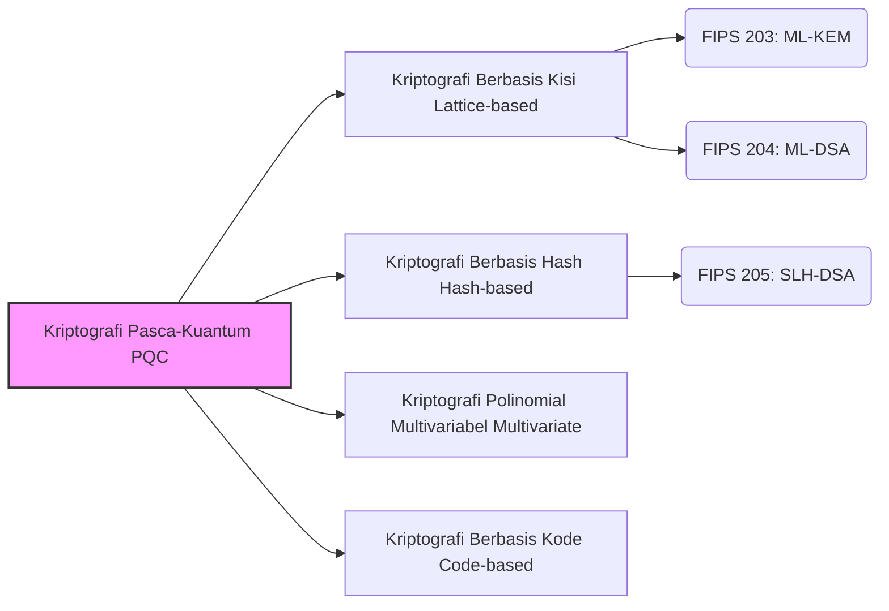

## Pengantar: "Ancaman" terhadap Teknologi Kriptografi yang Dibawa oleh Komputer Kuantum

Saat ini, komunikasi yang kita lakukan setiap hari di internet——pembayaran perbankan online, penjelajahan situs web (HTTPS), pertukaran pesan di aplikasi, hingga transaksi blockchain dan aset kripto——sebagian besar dilindungi oleh teknologi yang disebut "kriptografi kunci publik". Secara khusus, algoritma seperti kriptografi RSA dan Kriptografi Kurva Eliptik (ECC) menjadi dasar yang mendukung keandalan masyarakat digital modern.

Metode kriptografi ini didasarkan pada masalah matematika yang sulit, seperti "faktorisasi bilangan prima besar" atau "masalah logaritma diskrit", yang membutuhkan waktu astronomis untuk dipecahkan oleh komputer klasik saat ini (termasuk superkomputer). Namun, seiring dengan kemajuan pesat **Komputer Kuantum** dalam beberapa tahun terakhir, premis ini akan runtuh secara mendasar jika komputer tersebut dipraktikkan.

Pada tahun 1994, Peter Shor menerbitkan "Algoritma Shor", yang membuktikan secara matematis bahwa faktorisasi bilangan prima dan masalah logaritma diskrit dapat diselesaikan dalam waktu yang sangat singkat jika menggunakan komputer kuantum dengan kinerja yang memadai. Ini berarti ada risiko bahwa semua komunikasi terenkripsi yang melindungi internet saat ini akan dapat didekripsi di masa depan (masalah yang disebut Y2Q: Years to Quantum, atau Q-Day).

Lebih parah lagi, ada metode serangan yang disebut "Harvest Now, Decrypt Later (Curi data sekarang dan simpan, dekripsi nanti saat kriptografi dapat dipecahkan)". Data yang perlu dirahasiakan selama beberapa dekade, seperti informasi rahasia negara, kekayaan intelektual perusahaan, dan informasi biometrik individu, mungkin telah menjadi sasaran pencurian dengan premis bahwa mereka akan didekripsi di masa depan.

Untuk mengatasi krisis yang belum pernah terjadi sebelumnya ini, kriptografer dan lembaga penelitian di seluruh dunia mengerahkan seluruh upaya untuk mengembangkan teknologi kriptografi generasi berikutnya yang dapat mempertahankan keamanan dari serangan komputer kuantum, yaitu **Kriptografi Pasca-Kuantum (PQC: Post-Quantum Cryptography)** . Artikel ini akan menjelaskan secara rinci mulai dari dasar-dasar PQC, mekanisme algoritma utama, hingga tren standardisasi global terbaru yang didorong oleh Institut Nasional Standar dan Teknologi AS (NIST).

---

## Apa itu Kriptografi Pasca-Kuantum (PQC)?

Kriptografi Pasca-Kuantum (Post-Quantum Cryptography, PQC) adalah istilah umum untuk algoritma kriptografi yang dirancang agar dapat beroperasi di komputer klasik yang ada, namun tetap tahan terhadap serangan oleh komputer kuantum skala besar di masa depan (seperti Algoritma Shor).

Teknologi yang sering dibingungkan adalah "Kriptografi Kuantum (Quantum Cryptography)" dan "Distribusi Kunci Kuantum (QKD)", namun ini adalah pendekatan yang sama sekali berbeda. Kriptografi Kuantum (QKD) adalah teknologi berbasis perangkat keras yang menggunakan hukum fisika mekanika kuantum (seperti sifat di mana status berubah saat diamati) untuk membuat penyadapan di jalur komunikasi tidak mungkin secara fisik. Ini membutuhkan serat optik khusus atau peralatan khusus, dan memiliki tantangan seperti biaya implementasi serta batasan jarak.

Di sisi lain, **PQC adalah teknologi kriptografi berbasis perangkat lunak yang murni berdasar pada "matematika"** . Oleh karena itu, ia dapat diintegrasikan sebagai pembaruan perangkat software ke infrastruktur internet yang ada, server, ponsel pintar, peramban, dan lainnya, sehingga memiliki penerapan yang sangat tinggi dalam dunia nyata. Perusahaan TI dan lembaga pemerintah di seluruh dunia kini menganggap penting dan mendesak untuk menggantikan (migrasi) RSA dan ECC yang saat ini digunakan dengan PQC ini.

---

## 4 Pendekatan Matematis Utama yang Mendukung PQC

Berbagai algoritma PQC telah diusulkan berdasarkan masalah matematika yang sulit dipecahkan secara efisien bahkan dengan menggunakan komputer kuantum (seperti masalah NP-hard). Di sini, kami memperkenalkan 4 kategori utama yang mendominasi saat ini.

### Pendekatan Utama Kriptografi Pasca-Kuantum (PQC)

### 1. Kriptografi Berbasis Kisi (Lattice-based Cryptography)

Saat ini, "kriptografi kisi" adalah yang paling menjanjikan dan menjadi arus utama di bidang PQC. Kriptografi kisi mendasarkan keamanannya pada masalah titik-titik yang tersusun teratur (titik kisi) dalam ruang multidimensi. Masalah yang terkenal termasuk "Masalah Vektor Terpendek (SVP: Shortest Vector Problem)" dan "Masalah Pembelajaran dengan Kesalahan (LWE: Learning With Errors)".

**Ringkasan Mekanisme:** 
Bayangkan titik-titik yang tak terhitung jumlahnya tersusun dalam pola kisi dalam ruang berdimensi sangat tinggi (ratusan hingga ribuan dimensi). Menemukan titik kisi tertentu itu mudah dalam 2 atau 3 dimensi, tetapi pada ratusan dimensi, baik komputer klasik maupun kuantum belum menemukan algoritma untuk menemukannya secara efisien. Secara khusus, masalah LWE memanfaatkan sifat di mana "menambahkan 'kebisingan (kesalahan)' kecil secara sengaja ke dalam sistem persamaan linear membuat sangat sulit untuk menebak variabel aslinya".

**Kelebihan:** 
- Berlaku untuk pembagian kunci (KEM) maupun tanda tangan digital.
- Kecepatan pemrosesan sangat tinggi (terkadang lebih cepat dari RSA atau ECC).
- Ukuran kunci dan ciphertext relatif kecil, sehingga seimbang.

Sebagian besar algoritma yang saat ini distandarisasi oleh NIST (seperti ML-KEM dan ML-DSA) mengadopsi kriptografi berbasis kisi ini.

### 2. Kriptografi Berbasis Hash (Hash-based Cryptography)

Kriptografi berbasis hash adalah algoritma PQC yang dikhususkan untuk tanda tangan digital. Keamanannya murni bergantung pada ketahanan terhadap benturan dan fungsi satu arah dari "fungsi hash kriptografis" yang aman, seperti SHA-2 atau SHA-3.

**Ringkasan Mekanisme:** 
Ini dimulai dengan skema tanda tangan sekali pakai (one-time signature) yang disebut "Tanda Tangan Lamport (Lamport Signature)", yang hanya dapat digunakan sekali. Dengan menggabungkannya ke dalam format data struktur pohon yang disebut "Merkle Tree", ia memungkinkan beberapa tanda tangan dengan satu pasang kunci.

**Kelebihan:** 
- Dasar keamanannya sangat kokoh, dengan bukti kuat bahwa "selama fungsi hash aman, ini aman".
- Karena kurangnya ketergantungan pada struktur matematika, risiko ditemukannya metode pemecahan yang tidak terduga sangat rendah.

**Kekurangan:** 
- Tidak dapat digunakan untuk pembagian kunci (KEM), hanya tanda tangan digital.
- Ukuran tanda tangan cenderung lebih besar.
- Ada versi "stateful" dan "stateless". Versi stateful (seperti XMSS) memiliki tingkat kesulitan implementasi yang tinggi karena perlu mengelola jumlah penggunaan kunci dengan ketat.

NIST menstandarisasi "SLH-DSA (sebelumnya SPHINCS+)" sebagai tanda tangan berbasis hash yang stateless.

### 3. Kriptografi Berbasis Polinomial Multivariabel (Multivariate Cryptography)

Kriptografi polinomial multivariabel mendasarkan keamanannya pada kesulitan menyelesaikan sistem polinomial kuadratik yang memiliki banyak variabel (Masalah MQ: Multivariate Quadratic problem). Masalah ini diketahui merupakan NP-hard.

**Ringkasan Mekanisme:** 
Pengirim membuat ciphertext (tanda tangan) dengan mensubstitusikan plaintext (atau nilai hash) ke dalam persamaan kompleks dengan banyak variabel yang diberikan sebagai kunci publik. Penerima yang sah memiliki "informasi tersembunyi (trapdoor) yang mengubah struktur persamaan menjadi bentuk yang mudah diselesaikan" sebagai kunci rahasia, yang digunakannya untuk mendekripsi (atau memverifikasi tanda tangan).

**Kelebihan:** 
- Ukuran tanda tangan sangat kecil.
- Kecepatan verifikasi tanda tangan sangat cepat. Sangat cocok untuk perangkat IoT dengan sumber daya terbatas.

**Kekurangan:** 
- Ukuran kunci publik sangat besar (bisa mencapai puluhan hingga ratusan kilobyte).
- Di masa lalu, beberapa algoritma yang menonjol (seperti Rainbow) telah dipecahkan oleh serangan klasik, sehingga sedikit lebih sulit untuk membangun kepercayaan terhadap keamanannya dibandingkan dengan metode lain.

### 4. Kriptografi Berbasis Kode (Code-based Cryptography)

Kriptografi berbasis kode adalah penerapan teori "kode koreksi kesalahan" yang digunakan untuk memperbaiki kesalahan di jalur komunikasi ke dalam kriptografi. "Kriptografi McEliece" yang diusulkan pada tahun 1978 adalah yang paling terkenal, dan merupakan salah satu yang tertua di PQC.

**Ringkasan Mekanisme:** 
Pengirim menyandikan plaintext menggunakan kunci publik penerima (matriks generator kode koreksi kesalahan yang menyembunyikan struktur tertentu), dan menambahkan kesalahan yang disengaja (kebisingan) sebelum mengirim. Penerima menggunakan kunci rahasia untuk menghilangkan kesalahan dan mengambil plaintext. Penyerang kriptografi harus memperbaiki kesalahan dari kode acak yang tidak tahu strukturnya, yang disebut "masalah dekoding sindrom umum" dan terbukti NP-hard.

**Kelebihan:** 
- Telah dipelajari secara menyeluruh selama lebih dari 40 tahun tanpa ditemukan serangan yang efektif, sehingga keandalan keamanannya sangat tinggi.
- Proses enkripsi dan dekripsi yang cepat.

**Kekurangan:** 
- Ukuran kunci publik sangat besar (bisa mencapai beberapa megabyte). Akibatnya, sulit digunakan dalam lingkungan dengan keterbatasan bandwidth atau memori (seperti handshake TLS).

---

## Tren Standardisasi PQC Terbaru oleh NIST

Institut Nasional Standar dan Teknologi AS (NIST) meluncurkan panggilan global untuk algoritma kriptografi pasca-kuantum generasi berikutnya pada tahun 2016, dan telah melalui beberapa putaran evaluasi ketat selama bertahun-tahun.

Pada tahun 2024, NIST akhirnya mengumumkan tiga algoritma berikut sebagai Standar Pemrosesan Informasi Federal (FIPS) resmi. Hal ini menyelesaikan fondasi yang kuat bagi organisasi di seluruh dunia untuk mulai mengimplementasikannya di lingkungan produksi.

### Standar FIPS yang Ditetapkan (2024)

1. **FIPS 203: ML-KEM (sebelumnya: CRYSTALS-Kyber)** 
   - **Tujuan:** Mekanisme Enkapsulasi Kunci (KEM) / Enkripsi dan Pembagian Kunci
   - **Teknologi Dasar:** Kriptografi Kisi (Module-LWE)
   - **Karakteristik:** Menawarkan keseimbangan yang sangat baik antara ukuran kunci dan kecepatan, dan berfungsi sebagai pembagian kunci PQC default untuk penggunaan internet umum seperti komunikasi Web (TLS) dan aplikasi pesan yang aman.

2. **FIPS 204: ML-DSA (sebelumnya: CRYSTALS-Dilithium)** 
   - **Tujuan:** Tanda Tangan Digital
   - **Teknologi Dasar:** Kriptografi Kisi (Module-LWE)
   - **Karakteristik:** Standar utama untuk tanda tangan digital. Menawarkan pemrosesan yang efisien, dan akan menjadi standar baru untuk semua kasus penggunaan tanda tangan elektronik, seperti penandatanganan perangkat lunak dan otentikasi dokumen.

3. **FIPS 205: SLH-DSA (sebelumnya: SPHINCS+)** 
   - **Tujuan:** Tanda Tangan Digital
   - **Teknologi Dasar:** Kriptografi Berbasis Hash (Stateless)
   - **Karakteristik:** Memainkan peran penting karena berfungsi sebagai cadangan (backup) jika kelemahan ditemukan dalam kriptografi kisi di masa depan. Meskipun ukuran tanda tangan lebih besar, ini cocok untuk penggunaan yang memerlukan keandalan jangka panjang.

### Mengejar Keragaman Lebih Lanjut

Meskipun NIST telah menyelesaikan proses standardisasi awal, mereka terus mencari algoritma tambahan. Mengingat bahwa standarnya cenderung "kriptografi kisi", memastikan **Keragaman Kripto (Crypto Diversity)** dianggap sangat penting. Evaluasi kriptografi berbasis kode dan lainnya sedang berlangsung sebagai standar cadangan untuk pembagian kunci, dan fondasi PQC akan menjadi lebih kuat di masa depan.

---

## Skenario dan Tantangan Migrasi PQC: Pentingnya "Agility Kripto"

Dengan dirilisnya standar resmi oleh NIST, lembaga pemerintah, lembaga keuangan, dan perusahaan teknologi di seluruh dunia akan mempercepat migrasi mereka dari RSA/ECC yang ada ke PQC. Pedoman dari Badan Keamanan Nasional AS (NSA) dan lainnya juga merekomendasikan penyelesaian migrasi sejak dini.

### Mengadopsi Pendekatan Hibrida

Karena algoritma PQC masih baru, mereka belum melalui "ujian waktu" seperti kriptografi klasik. Mengingat risiko bug tersembunyi dalam implementasi atau metode serangan baru yang ditemukan, **"Pendekatan Hibrida"** direkomendasikan selama masa transisi. Ini adalah metode pertukaran kunci yang menggabungkan kriptografi yang sudah ada dan terbukti (misalnya: ECDHE) dengan PQC baru (misalnya: ML-KEM). Saat ini, uji coba pendekatan ini berkembang pesat di peramban utama dan layanan cloud.

### Mencapai Agility Kripto (Kelincahan Kriptografi)

Hal terpenting yang perlu disadari oleh perusahaan dan pengembang sistem ke depan adalah memastikan **"Agility Kripto (Crypto-Agility)"** . Desain arsitektur yang fleksibel yang memungkinkan algoritma kriptografi untuk dipertukarkan atau diperbarui dengan cepat tanpa menghentikan sistem saat cacat ditemukan pada algoritma atau standar baru muncul sangatlah penting.

Langkah pertama yang penting menuju migrasi PQC adalah membuat Inventaris Kriptografi (CBOM: Cryptography Bill of Materials) untuk memahami secara akurat "di mana", "kriptografi apa", dan "untuk tujuan apa" ia digunakan di dalam sistem internal.

---

## Kesimpulan: Bersiap untuk "Q-Day" yang Akan Datang

Sementara evolusi komputer kuantum akan membawa manfaat besar bagi umat manusia, itu juga merupakan ancaman terbesar bagi keamanan kriptografi yang merupakan fondasi masyarakat digital kita saat ini. Kriptografi Pasca-Kuantum (PQC) bukan lagi sekadar "topik penelitian masa depan yang jauh". Menyusul tonggak penerbitan standar FIPS oleh NIST, PQC kini telah memasuki fase "implementasi dan migrasi" berskala penuh.

Mengingat ancaman "Harvest Now, Decrypt Later", migrasi ke PQC adalah prioritas utama yang harus dimulai "sekarang" untuk setiap organisasi yang menangani data sensitif. Mari kita atasi era komputer kuantum yang akan datang dengan aman dengan memahami secara mendalam teknologi kriptografi generasi berikutnya dan meningkatkan agility kripto sistem kita.
