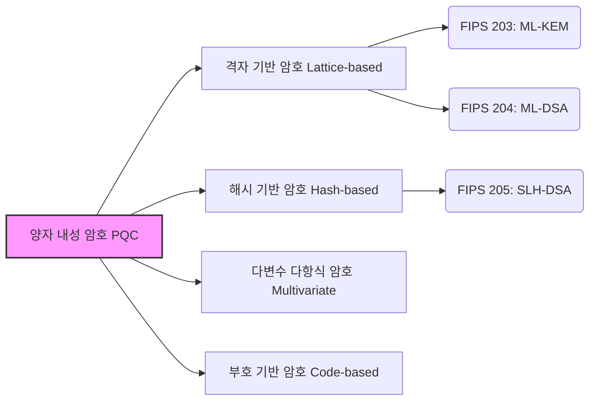

---

title: "[PQC] 양자 컴퓨터 시대의 차세대 암호 ''양자 내성 암호''의 전모"
tags: ['암호 기술', 'PQC', '보안', '차세대 기술']
image: 'post_quantum_cryptography_1788613735417.jpg'
date: 2026-09-05T22:09:22+09:00
categories: ['수학·암호·양자']
---

## 들어가며: 양자 컴퓨터가 가져올 암호 기술에 대한 '위협'

현재 우리가 인터넷상에서 일상적으로 수행하는 통신——온라인 뱅킹 결제, 웹사이트 탐색(HTTPS), 메시지 앱에서의 주고받기, 그리고 블록체인이나 암호화폐 거래에 이르기까지——그 중 많은 것들이 '공개키 암호'라고 불리는 기술에 의해 보호받고 있습니다. 구체적으로는 RSA 암호나 타원곡선 암호(ECC)와 같은 알고리즘이 현대 디지털 사회의 신뢰성을 지탱하는 근간이 되고 있습니다.

이러한 암호 방식은 '거대한 수의 소인수 분해'나 '이산 대수 문제'와 같이, 현재의 고전적 컴퓨터(슈퍼컴퓨터를 포함한)로는 푸는 데 천문학적인 시간이 걸리는 수학적 난제를 안전성의 근거로 삼고 있습니다. 하지만 최근 눈부신 발전을 거듭하고 있는 **'양자 컴퓨터'** 가 실용화되면 이러한 전제가 근본부터 뒤집히게 됩니다.

1994년 피터 쇼어(Peter Shor)가 발표한 '쇼어의 알고리즘'은 충분한 성능을 가진 양자 컴퓨터를 이용하면 소인수 분해나 이산 대수 문제를 극히 짧은 시간에 풀 수 있음을 수학적으로 증명했습니다. 이는 곧 현재의 인터넷을 보호하고 있는 암호 통신이 장래에는 모두 해독되어 버릴 위험(Y2Q: Years to Quantum, 또는 Q-Day라고 불리는 문제)을 의미합니다.

더욱 심각한 것은 'Harvest Now, Decrypt Later(지금 데이터를 훔쳐서 축적하고, 장래에 암호를 풀 수 있게 되었을 때 해독한다)'라는 공격 수법의 존재입니다. 국가 기밀정보나 기업의 지적 재산, 개인 생체정보 등 수십 년에 걸쳐 기밀성을 유지해야 하는 데이터는 이미 현재, 미래의 해독을 전제로 한 탈취의 대상이 되고 있을 가능성이 있습니다.

이 미증유의 위기에 대응하기 위해 전 세계의 암호 학자나 연구 기관이 총력을 기울여 개발을 진행하고 있는 것이, 양자 컴퓨터의 공격에 대해서도 안전성을 유지할 수 있는 차세대 암호 기술, **양자 내성 암호(PQC: Post-Quantum Cryptography)** 입니다. 본 기사에서는 PQC의 기초부터 주요 알고리즘의 구조, 그리고 미국 국립표준기술연구소(NIST)가 추진하는 세계적인 표준화의 최신 동향까지 자세히 해설합니다.

---

## 양자 내성 암호(PQC)란 무엇인가?

양자 내성 암호(Post-Quantum Cryptography, PQC)란, 기존의 고전적 컴퓨터상에서도 동작하며 장래에 등장할 대규모 양자 컴퓨터에 의한 공격(쇼어의 알고리즘 등)에 대해서도 내성을 갖도록 설계된 암호 알고리즘의 총칭입니다.

자주 혼동하기 쉬운 기술로 '양자 암호(Quantum Cryptography)'나 '양자 키 분배(QKD)'가 있습니다만, 이들은 전혀 다른 접근 방식입니다. 양자 암호(QKD)는 양자 역학의 물리 법칙(관측하면 상태가 변화하는 성질 등)을 이용하여 통신 경로상의 도청을 물리적으로 불가능하게 만드는 하드웨어 기반 기술입니다. 전용 광케이블이나 특수 기기가 필요하며, 도입 비용이나 거리 제한이라는 과제가 있습니다.

반면, **PQC는 어디까지나 '수학'을 기반으로 한 소프트웨어 기반의 암호 기술** 입니다. 따라서 기존의 인터넷 인프라, 서버, 스마트폰, 브라우저 등에 소프트웨어 업데이트로 통합하는 것이 가능하여, 현실 사회로의 적용성이 매우 높은 것이 특징입니다. 전 세계의 IT 기업이나 정부 기관은 현재 사용하고 있는 RSA나 ECC를 이 PQC로 교체(마이그레이션)하는 것을 급선무로 삼고 있습니다.

---

## PQC를 지탱하는 4가지 주요 수학적 접근

양자 컴퓨터를 사용해도 효율적으로 풀 수 없는 수학적 난제(NP 난해 문제 등)를 기반으로 다양한 PQC 알고리즘이 제안되고 있습니다. 여기에서는 현재 주류가 되고 있는 주요 4가지 카테고리를 소개합니다.

### 양자 내성 암호(PQC)의 주요 접근 방식

### 1. 격자 기반 암호(Lattice-based Cryptography)

현재 PQC 분야에서 가장 유망하게 여겨지며 주류가 되고 있는 것이 이 '격자 암호'입니다. 격자 암호는 다차원 공간에 규칙적으로 배열된 점(격자점)에 관한 문제를 안전성의 근거로 삼고 있습니다. 유명한 문제로는 '최단 벡터 문제(SVP: Shortest Vector Problem)'나 'LWE 문제(Learning With Errors)' 등이 있습니다.

**구조 개요:** 
매우 차원이 높은(수백～수천 차원) 공간 내에 무수히 많은 점이 격자 모양으로 배열되어 있다고 상상해 보십시오. 어느 특정 격자점을 찾는 것은 2차원이나 3차원이라면 간단하지만, 수백 차원이 되면 고전 컴퓨터든 양자 컴퓨터든 효율적으로 찾아내는 알고리즘은 발견되지 않았습니다. 특히 LWE 문제는 '연립 일차 방정식에 의도적으로 작은 노이즈(오차)를 더하면, 원래 변수를 추측하는 것이 극적으로 어려워진다'는 성질을 이용하고 있습니다.

**장점:** 
- 키 캡슐화(KEM)와 디지털 서명 모두에 적용 가능.
- 처리 속도가 매우 빠름(RSA나 ECC보다 빠를 수도 있음).
- 키 크기나 암호문 크기가 비교적 작고 균형이 좋음.

현재 NIST가 표준화하고 있는 알고리즘의 상당수(ML-KEM이나 ML-DSA 등)가 이 격자 기반 암호를 채택하고 있습니다.

### 2. 해시 기반 암호(Hash-based Cryptography)

해시 기반 암호는 디지털 서명에 특화된 PQC 알고리즘입니다. 안전성의 근거는 SHA-2나 SHA-3과 같은 안전한 '암호학적 해시 함수'가 가진 충돌 내성이나 일방향성에만 의존합니다.

**구조 개요:** 
'램포트 서명(Lamport Signature)'이라고 불리는, 한 번밖에 쓸 수 없는 일회용 서명 방식(원타임 서명)을 출발점으로 삼습니다. 이를 '머클 트리(Merkle Tree)'라고 불리는 트리 구조의 데이터 형식으로 묶음으로써, 1개의 키 쌍으로 여러 번의 서명을 가능하게 합니다.

**장점:** 
- 보안의 근거가 지극히 견고하며, '해시 함수가 안전한 한 안전하다'는 강력한 증명이 있음.
- 수학적 구조에 대한 의존이 적어, 예기치 않은 해독법이 발견될 위험이 낮음.

**단점:** 
- 키 캡슐화(KEM)에는 사용할 수 없으며 디지털 서명에만 가능.
- 서명 크기가 커지는 경향이 있음.
- '상태 저장(Stateful)'과 '상태 비저장(Stateless)'이 있으며, 상태 저장(XMSS 등)은 키 사용 횟수를 엄격히 관리해야 하므로 구현 난이도가 높음.

NIST는 상태 비저장 해시 기반 서명으로 'SLH-DSA(구 SPHINCS+)'를 표준화하고 있습니다.

### 3. 다변수 다항식 기반 암호(Multivariate Cryptography)

다변수 다항식 암호는 다수의 변수를 가진 연립 이차 다항식 시스템을 푸는 것의 어려움(MQ 문제: Multivariate Quadratic problem)을 안전성의 근거로 삼는 방식입니다. 이 문제는 NP 난해인 것으로 알려져 있습니다.

**구조 개요:** 
송신자는 공개키로 전달된 다수의 변수를 가진 복잡한 방정식에 평문(또는 해시값)을 대입하여 암호문(서명)을 작성합니다. 정당한 수신자는 비밀키로서 '방정식의 구조를 쉽게 풀 수 있는 형태로 변환하는 숨겨진 정보(트랩도어)'를 가지고 있으며, 이를 사용하여 복호화(또는 서명 검증)를 수행합니다.

**장점:** 
- 서명 크기가 매우 작음.
- 서명 검증 속도가 지극히 빠름. 리소스가 제한된 IoT 디바이스 등에 적합.

**단점:** 
- 공개키 크기가 매우 큼(수십 킬로바이트～수백 킬로바이트가 될 수도 있음).
- 과거에 유력한 알고리즘(Rainbow 등)이 고전적인 공격에 의해 파훼된 사례가 있어, 안전성에 대한 신뢰를 확립하는 것이 다른 방식에 비해 어려운 측면이 있음.

### 4. 부호 기반 암호(Code-based Cryptography)

부호 기반 암호는 통신 경로상의 오류를 정정하기 위해 사용되는 '오류 정정 부호' 이론을 암호에 응용한 것입니다. 1978년에 제안된 '매켈리스(McEliece) 암호'가 가장 유명하며, PQC 중에서도 가장 역사가 깊은 것 중 하나입니다.

**구조 개요:** 
송신자는 수신자의 공개키(특정 구조를 은폐한 오류 정정 부호의 생성 행렬)를 이용하여 평문을 인코딩하고, 의도적인 오류(노이즈)를 추가하여 전송합니다. 수신자는 비밀키를 사용하여 오류를 제거하고 평문을 꺼냅니다. 암호 해독자는 구조를 모르는 단순한 무작위 부호에서 오류 정정을 해야 하며, 이는 '일반적 신드롬 복호 문제'로 불리며 NP 난해임이 증명되어 있습니다.

**장점:** 
- 40년 이상의 긴 세월 동안 철저하게 연구되어, 지금까지 유효한 공격이 발견되지 않았으므로 안전성의 신뢰성이 극히 높음.
- 암호화·복호화 처리가 빠름.

**단점:** 
- 공개키 크기가 매우 거대함(수 메가바이트가 될 수도 있음). 따라서 통신 대역이나 메모리에 제한이 있는 환경(TLS 핸드셰이크 등)에서의 이용이 어려움.

---

## NIST에 의한 PQC 표준화의 최신 동향

미국 국립표준기술연구소(NIST)는 2016년부터 전 세계를 대상으로 차세대 양자 내성 암호 알고리즘의 공모를 개시하여, 수년간에 걸친 엄격한 평가와 라운드를 거듭해 왔습니다.

2024년, NIST는 마침내 정식 연방 정보 처리 표준(FIPS)으로서 다음의 3가지 알고리즘을 발표했습니다. 이로써 전 세계의 조직이 프로덕션 환경에서 구현을 시작하기 위한 견고한 토대가 완성된 셈입니다.

### 제정된 FIPS 표준 (2024년)

1. **FIPS 203: ML-KEM (구 명칭: CRYSTALS-Kyber)** 
   - **용도:** 키 캡슐화 메커니즘(KEM) / 암호화·키 공유
   - **기반 기술:** 격자 암호(Module-LWE)
   - **특징:** 키 크기나 속도의 밸런스가 매우 좋아, 웹 통신(TLS)이나 안전한 메시징 앱 등 일반적인 인터넷 용도의 기본 PQC 키 공유로 기능합니다.

2. **FIPS 204: ML-DSA (구 명칭: CRYSTALS-Dilithium)** 
   - **용도:** 디지털 서명
   - **기반 기술:** 격자 암호(Module-LWE)
   - **특징:** 디지털 서명의 주요 표준. 효율적인 처리가 가능하여, 소프트웨어 서명이나 문서 인증 등 모든 전자 서명 용도의 새로운 표준이 됩니다.

3. **FIPS 205: SLH-DSA (구 명칭: SPHINCS+)** 
   - **용도:** 디지털 서명
   - **기반 기술:** 해시 기반 암호(상태 비저장)
   - **특징:** 만약 장래에 격자 암호에서 취약성이 발견될 경우의 백업으로 기능하기 때문에 극히 중요한 역할을 담당합니다. 서명 크기는 커지지만, 장기적인 신뢰성이 요구되는 용도에 적합합니다.

### 더욱 다양한 방식의 추구

NIST는 최초의 표준화 프로세스를 완료한 한편, 더 많은 알고리즘의 탐색을 계속하고 있습니다. 특히 '격자 암호'에 표준이 편중되어 있기 때문에, **알고리즘의 다양성(Crypto Diversity)** 을 확보하는 것이 중요하게 여겨지고 있습니다. 키 공유의 백업 표준으로서 부호 기반 암호 등의 평가가 진행되고 있으며, PQC의 기반은 향후 더욱 견고해질 예정입니다.

---

## PQC로의 이행 시나리오와 과제: '암호 민첩성'의 중요성

NIST로부터 정식 표준 규격이 릴리스됨에 따라, 전 세계의 정부 기관, 금융 기관, 테크 기업은 기존의 RSA/ECC에서 PQC로의 이행(마이그레이션)을 본격화할 것입니다. NSA(미국 국가안보국) 등의 가이드라인에서도 조기 이행 완료가 권장되고 있습니다.

### 하이브리드 접근법의 채택

PQC 알고리즘은 새롭기 때문에, 고전적인 암호와 비교하면 '시간의 시련'을 거치지 않았습니다. 구현에 숨어있는 버그나 새로운 공격 수법이 발견될 위험을 고려하여, 과도기에는 **'하이브리드 방식'** 이 권장되고 있습니다. 이는 실적이 있는 기존 암호(예: ECDHE)와 새로운 PQC(예: ML-KEM)를 조합하여 키 교환을 수행하는 방법입니다. 현재 주요 브라우저나 클라우드 서비스에서는 이 방식의 시험 도입이 급속히 진행되고 있습니다.

### 암호 민첩성(Crypto-Agility)의 실현

기업이나 시스템 개발자가 향후 가장 의식해야 할 것은 **'암호 민첩성(Crypto-Agility)'** 의 확보입니다. 장래 알고리즘에 결함이 발견되거나 새로운 표준이 등장했을 때, 시스템을 멈추지 않고 신속하게 암호 알고리즘을 교체·업데이트할 수 있는 유연한 아키텍처 설계가 필수적입니다.

자사 시스템 내의 '어디에서' '어떤 암호가' '무슨 목적으로' 사용되고 있는지를 정확히 파악하는 암호 인벤토리(CBOM: Cryptography Bill of Materials)의 작성이 PQC 이행을 향한 중요한 첫걸음이 됩니다.

---

## 마무리: 다가올 'Q-Day'에 대비하여

양자 컴퓨터의 진화는 인류에게 막대한 혜택을 가져다주는 한편, 현재 디지털 사회의 근간인 암호 보안에 대한 최대의 위협이기도 합니다. 양자 내성 암호(PQC)는 더 이상 '먼 미래의 연구 주제'가 아닙니다. NIST에 의한 FIPS 표준 발행이라는 이정표를 거쳐, PQC는 본격적인 '구현과 이행' 단계로 돌입했습니다.

'Harvest Now, Decrypt Later'의 위협을 고려한다면, 기밀성이 높은 데이터를 다루는 모든 조직에게 있어 PQC로의 이행은 '지금 당장' 착수해야 할 최우선 과제입니다. 차세대 암호 기술을 깊이 이해하고, 시스템의 암호 민첩성을 높임으로써, 다가올 양자 컴퓨터 시대를 안전하게 극복해 나갑시다.
