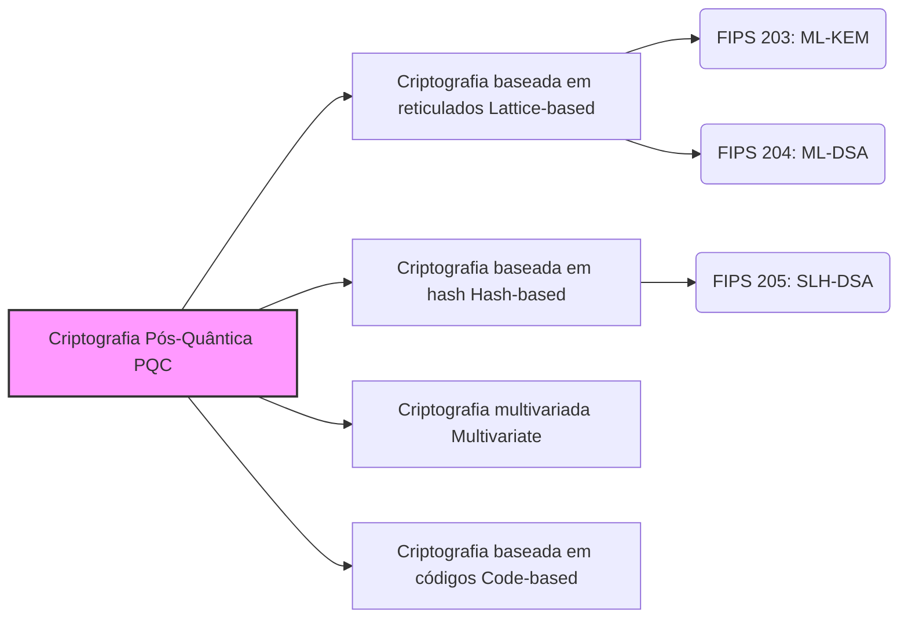

## Introdução: A "Ameaça" dos Computadores Quânticos à Criptografia

Atualmente, muitas das comunicações que realizamos diariamente na internet —— desde pagamentos em serviços bancários online, navegação em sites (HTTPS), troca de mensagens em aplicativos, até transações de blockchain e criptomoedas —— são protegidas por uma tecnologia chamada "criptografia de chave pública". Especificamente, algoritmos como a criptografia RSA e a criptografia de curva elíptica (ECC) são os pilares que sustentam a confiabilidade da nossa sociedade digital moderna.

Esses métodos de criptografia baseiam sua segurança em problemas matemáticos complexos, como a "fatoração de números primos gigantes" e o "problema do logaritmo discreto", que levariam um tempo astronômico para serem resolvidos por computadores clássicos atuais (incluindo supercomputadores). No entanto, com a concretização dos **"computadores quânticos"** , que têm feito progressos notáveis nos últimos anos, essa premissa será fundamentalmente derrubada.

O "Algoritmo de Shor", publicado por Peter Shor em 1994, provou matematicamente que, se usarmos um computador quântico com desempenho suficiente, poderemos resolver a fatoração de números primos e o problema do logaritmo discreto em um tempo extremamente curto. Isso significa que a comunicação criptografada que protege a internet hoje corre o risco de ser totalmente decodificada no futuro (um problema conhecido como Y2Q: Years to Quantum, ou Q-Day).

Ainda mais grave é a existência de um método de ataque chamado "Harvest Now, Decrypt Later" (Roube agora, decifre depois). Dados que precisam manter a confidencialidade por décadas, como informações confidenciais de estados, propriedade intelectual corporativa e informações biométricas pessoais, já podem ser alvo de roubo hoje, com a intenção de serem decodificados no futuro.

Para responder a essa crise sem precedentes, criptógrafos e instituições de pesquisa em todo o mundo estão trabalhando juntos para desenvolver a criptografia de próxima geração que pode manter a segurança mesmo contra ataques de computadores quânticos, a **Criptografia Pós-Quântica (PQC)** . Neste artigo, explicaremos em detalhes desde os fundamentos da PQC até os mecanismos de seus principais algoritmos e as tendências mais recentes de padronização global lideradas pelo Instituto Nacional de Padrões e Tecnologia dos EUA (NIST).

---

## O que é a Criptografia Pós-Quântica (PQC)?

A Criptografia Pós-Quântica (Post-Quantum Cryptography, PQC) é um termo genérico para algoritmos de criptografia projetados para operar em computadores clássicos existentes e, ao mesmo tempo, serem resistentes a ataques (como o algoritmo de Shor) de computadores quânticos de grande escala que surgirão no futuro.

Tecnologias frequentemente confundidas com ela são a "Criptografia Quântica (Quantum Cryptography)" e a "Distribuição Quântica de Chaves (QKD)", mas estas são abordagens completamente diferentes. A criptografia quântica (QKD) é uma tecnologia baseada em hardware que utiliza as leis físicas da mecânica quântica (como a propriedade de que o estado muda ao ser observado) para tornar a espionagem nos canais de comunicação fisicamente impossível. Ela requer fibras ópticas dedicadas e equipamentos especiais, enfrentando desafios como custos de implementação e limitações de distância.

Por outro lado, **a PQC é uma tecnologia de criptografia baseada em software, fundamentada puramente em "matemática"** . Portanto, ela pode ser incorporada à infraestrutura de internet existente, servidores, smartphones, navegadores, etc., como uma atualização de software, sendo altamente aplicável ao mundo real. Empresas de TI e governos de todo o mundo consideram urgente substituir (migrar) o RSA e o ECC atualmente em uso por esta PQC.

---

## As 4 Principais Abordagens Matemáticas que Sustentam a PQC

Vários algoritmos de PQC foram propostos, baseando-se em problemas matemáticos complexos (como problemas NP-difíceis) que não podem ser resolvidos de forma eficiente mesmo com um computador quântico. Aqui, apresentaremos as 4 principais categorias que dominam atualmente.

### Principais Abordagens da Criptografia Pós-Quântica (PQC)

### 1. Criptografia baseada em reticulados (Lattice-based Cryptography)

Atualmente, esta "criptografia baseada em reticulados" é considerada a mais promissora e é a principal tendência no campo da PQC. A criptografia de reticulados baseia sua segurança em problemas relacionados a pontos dispostos regularmente (pontos de reticulado) em um espaço multidimensional. Problemas famosos incluem o "Problema do Vetor Mais Curto (SVP: Shortest Vector Problem)" e o "Problema de Aprendizado com Erros (LWE: Learning With Errors)".

**Visão geral do mecanismo:** 
Imagine que inumeráveis pontos estão dispostos em forma de grade (reticulado) dentro de um espaço de dimensão muito alta (centenas a milhares de dimensões). Encontrar um ponto de reticulado específico é fácil em 2 ou 3 dimensões, mas quando se trata de centenas de dimensões, ainda não foi descoberto nenhum algoritmo que o encontre de forma eficiente, seja em um computador clássico ou quântico. O problema LWE, em particular, utiliza a propriedade de que "se você adicionar propositalmente um pequeno 'ruído (erro)' a um sistema de equações lineares, torna-se drasticamente mais difícil adivinhar as variáveis originais".

**Vantagens:** 
- Aplicável tanto ao compartilhamento de chaves (KEM) quanto às assinaturas digitais.
- A velocidade de processamento é muito rápida (em alguns casos, mais rápida que RSA e ECC).
- O tamanho da chave e o tamanho do texto cifrado são relativamente pequenos, oferecendo um bom equilíbrio.

Muitos dos algoritmos atualmente sendo padronizados pelo NIST (como ML-KEM e ML-DSA) adotam essa criptografia baseada em reticulados.

### 2. Criptografia baseada em hash (Hash-based Cryptography)

A criptografia baseada em hash é um algoritmo PQC especializado em assinaturas digitais. A base de sua segurança depende exclusivamente da resistência à colisão e da unidirecionalidade de "funções de hash criptográficas" seguras, como SHA-2 e SHA-3.

**Visão geral do mecanismo:** 
Ela tem como ponto de partida um esquema de assinatura descartável de uso único (assinatura de uso único) chamado "Assinatura Lamport (Lamport Signature)". Ao agrupar isso em um formato de dados em estrutura de árvore chamado "Árvore de Merkle (Merkle Tree)", possibilita múltiplas assinaturas com um único par de chaves.

**Vantagens:** 
- A base de segurança é extremamente robusta, com a forte prova de que "é segura desde que a função de hash seja segura".
- Como a dependência de estruturas matemáticas é baixa, o risco de serem descobertos métodos inesperados de decodificação é menor.

**Desvantagens:** 
- Não pode ser usada para compartilhamento de chaves (KEM), servindo apenas para assinaturas digitais.
- O tamanho da assinatura tende a ser grande.
- Existem as modalidades "stateful" (com estado) e "stateless" (sem estado). A versão stateful (como XMSS) requer um gerenciamento rigoroso do número de vezes que a chave é usada, tornando a implementação mais difícil.

O NIST padronizou o "SLH-DSA (anteriormente SPHINCS+)" como uma assinatura baseada em hash stateless.

### 3. Criptografia multivariada (Multivariate Cryptography)

A criptografia de polinômios multivariados baseia sua segurança na dificuldade de resolver um sistema de equações polinomiais quadráticas simultâneas com muitas variáveis (Problema MQ: Multivariate Quadratic problem). Sabe-se que este problema é NP-difícil.

**Visão geral do mecanismo:** 
O remetente cria um texto cifrado (assinatura) substituindo o texto simples (ou valor de hash) em uma equação complexa com muitas variáveis fornecida como chave pública. O destinatário legítimo possui como chave privada uma "informação oculta (alçapão) que converte a estrutura da equação em uma forma fácil de resolver", usando-a para realizar a decodificação (ou verificação de assinatura).

**Vantagens:** 
- O tamanho da assinatura é muito pequeno.
- A velocidade de verificação da assinatura é extremamente alta. É adequado para dispositivos de IoT com recursos limitados.

**Desvantagens:** 
- O tamanho da chave pública é muito grande (pode chegar a dezenas ou centenas de kilobytes).
- No passado, algoritmos proeminentes (como Rainbow) foram quebrados por ataques clássicos, tornando mais difícil estabelecer a confiança na segurança em comparação com outros métodos.

### 4. Criptografia baseada em códigos (Code-based Cryptography)

A criptografia baseada em códigos aplica a teoria dos "códigos de correção de erros", usados para corrigir erros nos canais de comunicação, à criptografia. A "Criptografia McEliece", proposta em 1978, é a mais famosa e uma das mais antigas entre as PQC.

**Visão geral do mecanismo:** 
O remetente codifica o texto simples usando a chave pública do destinatário (a matriz geradora de um código de correção de erros que oculta uma estrutura específica), adiciona um erro intencional (ruído) e o envia. O destinatário usa a chave privada para remover o erro e extrair o texto simples. Um decodificador precisaria corrigir os erros a partir de um código aleatório sem conhecer sua estrutura; isso é chamado de "problema geral de decodificação de síndrome", que é comprovadamente NP-difícil.

**Vantagens:** 
- Tendo sido exaustivamente estudada por mais de 40 anos e sem nenhum ataque eficaz encontrado até agora, a confiança na sua segurança é extremamente alta.
- Os processos de criptografia e descriptografia são rápidos.

**Desvantagens:** 
- O tamanho da chave pública é imenso (pode chegar a vários megabytes). Portanto, é difícil usá-la em ambientes com limitações de largura de banda de comunicação ou memória (como no handshake de TLS).

---

## Tendências Recentes na Padronização PQC pelo NIST

O Instituto Nacional de Padrões e Tecnologia dos EUA (NIST) iniciou em 2016 uma chamada global para algoritmos de criptografia pós-quântica de próxima geração, realizando avaliações rigorosas e várias rodadas de análises ao longo de anos.

Em 2024, o NIST finalmente anunciou os seguintes três algoritmos como Padrões Federais de Processamento de Informações (FIPS) oficiais. Isso concluiu a formação de uma base sólida para que organizações em todo o mundo comecem a implementá-los em ambientes de produção.

### Padrões FIPS Estabelecidos (2024)

1. **FIPS 203: ML-KEM (Nome anterior: CRYSTALS-Kyber)** 
   - **Uso:** Mecanismo de encapsulamento de chaves (KEM) / Criptografia e compartilhamento de chaves
   - **Tecnologia base:** Criptografia baseada em reticulados (Module-LWE)
   - **Características:** Oferece um excelente equilíbrio entre o tamanho da chave e a velocidade. Servirá como o compartilhamento de chaves PQC padrão para usos comuns da internet, como comunicação na Web (TLS) e aplicativos de mensagens seguros.

2. **FIPS 204: ML-DSA (Nome anterior: CRYSTALS-Dilithium)** 
   - **Uso:** Assinatura digital
   - **Tecnologia base:** Criptografia baseada em reticulados (Module-LWE)
   - **Características:** O principal padrão para assinaturas digitais. Permite processamento eficiente, tornando-se o novo padrão para todas as aplicações de assinatura eletrônica, como assinaturas de software e autenticação de documentos.

3. **FIPS 205: SLH-DSA (Nome anterior: SPHINCS+)** 
   - **Uso:** Assinatura digital
   - **Tecnologia base:** Criptografia baseada em hash (stateless)
   - **Características:** Desempenha um papel vital como um backup caso vulnerabilidades sejam descobertas na criptografia baseada em reticulados no futuro. Embora o tamanho da assinatura seja grande, é adequado para aplicações que exigem confiabilidade de longo prazo.

### Busca por Maior Diversidade

Embora o NIST tenha concluído o processo inicial de padronização, ele continua buscando mais algoritmos. Especialmente porque os padrões estão muito inclinados para a "criptografia baseada em reticulados", a garantia da **diversidade de algoritmos (Crypto Diversity)** é altamente valorizada. A avaliação da criptografia baseada em códigos e outros métodos está em andamento como padrão de backup para compartilhamento de chaves, e a base da PQC deve se tornar ainda mais robusta no futuro.

---

## Cenários e Desafios da Transição para a PQC: A Importância da "Agilidade Criptográfica"

Com o lançamento de padrões oficiais pelo NIST, agências governamentais, instituições financeiras e empresas de tecnologia em todo o mundo acelerarão a transição (migração) do RSA/ECC existente para a PQC. Diretrizes de agências como a NSA (Agência de Segurança Nacional dos EUA) também recomendam a conclusão antecipada dessa transição.

### Adoção da Abordagem Híbrida

Como os algoritmos PQC são novos, eles não passaram pelo "teste do tempo" em comparação com a criptografia clássica. Considerando os riscos de bugs ocultos em implementações ou a descoberta de novos métodos de ataque, recomenda-se uma **"abordagem híbrida"** durante o período de transição. Isso envolve realizar a troca de chaves combinando criptografia existente e comprovada (por exemplo, ECDHE) com a nova PQC (por exemplo, ML-KEM). Atualmente, as principais implementações de teste dessa abordagem estão avançando rapidamente em navegadores e serviços em nuvem.

### Atingindo a Agilidade Criptográfica (Crypto-Agility)

O que empresas e desenvolvedores de sistemas devem ter mais em mente daqui para frente é garantir a **"Agilidade Criptográfica (Crypto-Agility)"** . É essencial ter um projeto arquitetônico flexível que permita a substituição e atualização rápida dos algoritmos de criptografia sem paralisar o sistema, caso falhas sejam encontradas nos algoritmos no futuro ou surjam novos padrões.

Criar um inventário criptográfico (CBOM: Cryptography Bill of Materials) que identifique com precisão "onde", "qual criptografia" e "para qual propósito" está sendo usada dentro do sistema da empresa é um primeiro passo vital em direção à transição para PQC.

---

## Conclusão: Preparando-se para o "Q-Day" Iminente

A evolução dos computadores quânticos trará enormes benefícios à humanidade, mas ao mesmo tempo representa a maior ameaça à segurança criptográfica que é a base de nossa sociedade digital moderna. A Criptografia Pós-Quântica (PQC) não é mais um "tema de pesquisa para um futuro distante". Com o marco da publicação dos padrões FIPS pelo NIST, a PQC entrou na fase de "implementação e transição" em larga escala.

Considerando a ameaça do "Harvest Now, Decrypt Later", a transição para a PQC é a maior prioridade a ser tratada "agora mesmo" por todas as organizações que lidam com dados altamente confidenciais. Ao entender profundamente as tecnologias de criptografia de próxima geração e aumentar a agilidade criptográfica dos sistemas, poderemos superar com segurança a iminente era dos computadores quânticos.
