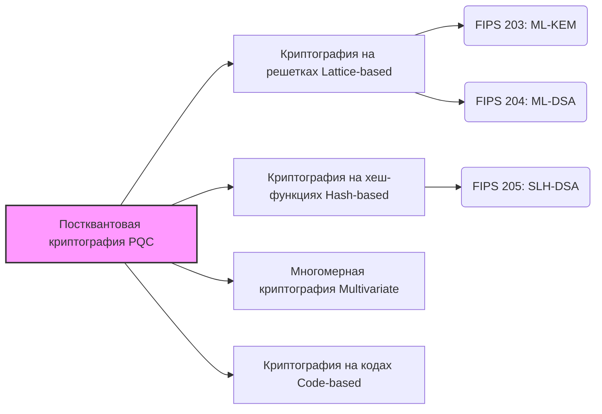

## Введение: «Угроза» криптографическим технологиям со стороны квантовых компьютеров

В настоящее время большинство наших повседневных коммуникаций в интернете — онлайн-банкинг, просмотр веб-сайтов (HTTPS), обмен сообщениями в приложениях, а также транзакции блокчейна и криптоактивов — защищены технологией, известной как «криптография с открытым ключом». В частности, такие алгоритмы, как RSA и криптография на эллиптических кривых (ECC), служат основой, обеспечивающей надежность современного цифрового общества.

Эти методы криптографии основаны на математических проблемах, таких как «факторизация больших простых чисел» и «проблема дискретного логарифма», решение которых на современных классических компьютерах (включая суперкомпьютеры) требует астрономического количества времени. Однако с быстрым развитием **квантовых компьютеров** в последние годы, этот фундамент будет полностью разрушен, как только они будут внедрены на практике.

В 1994 году Питер Шор (Peter Shor) опубликовал «Алгоритм Шора», математически доказав, что факторизацию и задачу дискретного логарифмирования можно решить за очень короткое время с помощью достаточно мощного квантового компьютера. Это означает риск того, что все зашифрованные коммуникации, защищающие сегодня интернет, будут расшифрованы в будущем (проблема, известная как Y2Q: Years to Quantum, или Q-Day).

Еще более серьезной является проблема так называемого «Harvest Now, Decrypt Later (Собери сейчас, расшифруй позже)». Данные, которые необходимо сохранять в тайне десятилетиями, такие как государственные секреты, интеллектуальная собственность компаний и биометрическая информация лиц, уже могут становиться объектами краж с расчетом на их расшифровку в будущем.

Чтобы противостоять этому беспрецедентному кризису, криптографы и исследовательские институты по всему миру объединяют усилия для разработки криптографических технологий следующего поколения, способных противостоять атакам квантовых компьютеров — **постквантовой криптографии (PQC: Post-Quantum Cryptography)** . В этой статье мы подробно рассмотрим основы PQC, механизмы работы основных алгоритмов и последние тенденции глобальной стандартизации, продвигаемые Национальным институтом стандартов и технологий США (NIST).

---

## Что такое постквантовая криптография (PQC)?

Постквантовая криптография (Post-Quantum Cryptography, PQC) — это общий термин для криптографических алгоритмов, предназначенных для работы на существующих классических компьютерах, но при этом устойчивых к атакам крупномасштабных квантовых компьютеров в будущем (включая атаки с использованием алгоритма Шора).

Часто путают такие технологии, как «Квантовая криптография (Quantum Cryptography)» и «Квантовое распределение ключей (QKD)», но это совершенно разные подходы. Квантовая криптография (QKD) — это аппаратная технология, использующая законы квантовой механики (например, изменение состояния при наблюдении) для физического исключения прослушивания в каналах связи. Для этого требуются специальные оптоволоконные линии и оборудование, что связано с высокими затратами на внедрение и ограничениями по расстоянию.

С другой стороны, **PQC — это программная технология криптографии, основанная исключительно на «математике»** . Поэтому её можно внедрить в виде обновлений программного обеспечения в существующую интернет-инфраструктуру, серверы, смартфоны, браузеры и т.д., что делает её применение в реальном мире крайне удобным. ИТ-компании и правительственные учреждения по всему миру считают первоочередной задачей замену (миграцию) используемых сегодня алгоритмов RSA и ECC на PQC.

---

## 4 основных математических подхода, на которых базируется PQC

Различные алгоритмы PQC основаны на математических задачах, которые сложно эффективно решить даже с помощью квантового компьютера (например, NP-трудные задачи). Здесь мы представляем 4 основные категории, доминирующие в настоящее время.

### Основные подходы к постквантовой криптографии (PQC)

### 1. Криптография на решетках (Lattice-based Cryptography)

В настоящее время «криптография на решетках» является наиболее перспективным и основным направлением в области PQC. Эта криптография основывает свою безопасность на проблемах точек, регулярно расположенных в виде решеток в многомерных пространствах. Известные проблемы включают «Проблему кратчайшего вектора (SVP)» и «Обучение с ошибками (LWE)».

**Краткое описание механизма:** 
Представьте себе бесчисленное множество точек, выстроенных в виде решетки в пространстве с очень высокой размерностью (от сотен до тысяч измерений). Найти определенную точку решетки легко в двух или трех измерениях, но в сотнях измерений до сих пор не существует эффективного алгоритма ни для классических, ни для квантовых компьютеров. В частности, проблема LWE использует свойство, согласно которому «намеренное добавление небольшого 'шума (ошибки)' к системе линейных уравнений делает угадывание исходных переменных чрезвычайно сложным».

**Преимущества:** 
- Применима как для обмена ключами (KEM), так и для цифровых подписей.
- Очень высокая скорость обработки (иногда быстрее, чем RSA или ECC).
- Сбалансированный размер ключа и шифротекста.

Большинство алгоритмов, стандартизируемых NIST в настоящее время (такие как ML-KEM и ML-DSA), используют криптографию на решетках.

### 2. Криптография на хеш-функциях (Hash-based Cryptography)

Криптография на хеш-функциях — это алгоритмы PQC, специализирующиеся на цифровых подписях. Их безопасность основана исключительно на устойчивости к коллизиям и односторонности безопасных «криптографических хеш-функций», таких как SHA-2 или SHA-3.

**Краткое описание механизма:** 
Отправной точкой является схема одноразовой подписи, называемая «Подписью Лэмпорта (Lamport Signature)», которую можно использовать только один раз. Связывая их в древовидную структуру данных под названием «Дерево Меркла (Merkle Tree)», она позволяет использовать один набор ключей для множества подписей.

**Преимущества:** 
- Исключительно надежная основа безопасности, с сильным доказательством того, что «пока хеш-функция безопасна, алгоритм тоже безопасен».
- Низкий риск обнаружения неожиданных методов взлома из-за слабой зависимости от математических структур.

**Недостатки:** 
- Не может использоваться для обмена ключами (KEM), только для цифровых подписей.
- Размер подписи, как правило, большой.
- Существуют версии с сохранением состояния (stateful) и без (stateless). В версиях с сохранением состояния (например, XMSS) сложно управлять ключами, что усложняет их внедрение.

NIST стандартизировал «SLH-DSA (ранее SPHINCS+)» в качестве стандарта хеш-подписи без сохранения состояния.

### 3. Многомерная криптография (Multivariate Cryptography)

Многомерная криптография основывает свою безопасность на трудности решения систем квадратных уравнений с множеством переменных (проблема MQ: Multivariate Quadratic problem). Эта проблема известна как NP-трудная.

**Краткое описание механизма:** 
Отправитель создает шифротекст (подпись), подставляя открытый текст (или хеш-значение) в сложное уравнение с множеством переменных, переданное в качестве открытого ключа. Законный получатель владеет «скрытой информацией (лазейкой), преобразующей структуру уравнения в легко решаемую форму» в качестве секретного ключа, и использует её для расшифровки (или проверки подписи).

**Преимущества:** 
- Очень маленький размер подписи.
- Чрезвычайно высокая скорость проверки подписи. Подходит для IoT-устройств с ограниченными ресурсами.

**Недостатки:** 
- Очень большой размер открытого ключа (может достигать от десятков до сотен килобайт).
- В прошлом некоторые перспективные алгоритмы (например, Rainbow) были взломаны классическими атаками, что делает создание доверия к их безопасности немного сложнее по сравнению с другими методами.

### 4. Криптография на кодах (Code-based Cryptography)

Криптография на кодах — это применение теории «кодов с исправлением ошибок», используемых для устранения ошибок в каналах связи. Предложенная в 1978 году «Криптосистема Мак-Элиса (McEliece)» является самой известной и одной из старейших в области PQC.

**Краткое описание механизма:** 
Отправитель кодирует открытый текст, используя открытый ключ получателя (генераторную матрицу кода с исправлением ошибок, скрывающую определенную структуру), и намеренно добавляет ошибки (шум) перед отправкой. Получатель использует секретный ключ для устранения ошибок и извлечения текста. Атакующий должен исправить ошибки в случайном коде, не зная его структуры, что называется «задачей синдромного декодирования», которая является NP-трудной.

**Преимущества:** 
- Интенсивно изучается на протяжении более 40 лет без нахождения эффективных атак, что гарантирует высокую надежность безопасности.
- Высокая скорость процессов шифрования и дешифрования.

**Недостатки:** 
- Очень большой размер открытого ключа (может достигать нескольких мегабайт). Поэтому трудно использовать в средах с ограниченной пропускной способностью или памятью (например, при рукопожатии TLS).

---

## Последние тенденции стандартизации PQC в NIST

Национальный институт стандартов и технологий США (NIST) объявил глобальный конкурс на алгоритмы постквантовой криптографии следующего поколения в 2016 году и провел несколько этапов строгой оценки на протяжении многих лет.

В 2024 году NIST окончательно утвердил следующие три алгоритма в качестве официальных Федеральных стандартов обработки информации (FIPS). Это создает прочную основу для организаций по всему миру, чтобы начать их внедрение в производственных средах.

### Утвержденные стандарты FIPS (2024)

1. **FIPS 203: ML-KEM (ранее CRYSTALS-Kyber)** 
   - **Назначение:** Механизм инкапсуляции ключей (KEM) / Шифрование и обмен ключами
   - **Базовая технология:** Криптография на решетках (Module-LWE)
   - **Особенности:** Предлагает отличный баланс между размером ключа и скоростью, становясь стандартом по умолчанию для обмена ключами PQC в общих интернет-приложениях, таких как веб-коммуникации (TLS) и защищенные мессенджеры.

2. **FIPS 204: ML-DSA (ранее CRYSTALS-Dilithium)** 
   - **Назначение:** Цифровая подпись
   - **Базовая технология:** Криптография на решетках (Module-LWE)
   - **Особенности:** Основной стандарт для цифровых подписей. Обеспечивает эффективную обработку и станет новым стандартом для всех сценариев использования электронных подписей, таких как подписание программного обеспечения и аутентификация документов.

3. **FIPS 205: SLH-DSA (ранее SPHINCS+)** 
   - **Назначение:** Цифровая подпись
   - **Базовая технология:** Криптография на хеш-функциях (без сохранения состояния)
   - **Особенности:** Играет важную роль в качестве резервного варианта на случай обнаружения уязвимостей в криптографии на решетках. Хотя размер подписи больше, это подходит для случаев, когда требуется долгосрочная надежность.

### Стремление к разнообразию

Хотя NIST завершил начальный процесс стандартизации, поиск дополнительных алгоритмов продолжается. Учитывая сильный уклон стандартов в сторону «криптографии на решетках», обеспечение **криптографического разнообразия (Crypto Diversity)** считается крайне важным. Ведется оценка криптографии на кодах и других методов в качестве резервных стандартов для обмена ключами, что укрепит основу PQC в будущем.

---

## Сценарии миграции на PQC и вызовы: важность «криптографической гибкости»

С выпуском официальных стандартов NIST, правительственные учреждения, финансовые институты и технологические компании по всему миру начнут ускорять переход с существующих RSA/ECC на PQC. Руководства Агентства национальной безопасности США (NSA) также рекомендуют скорейшее завершение миграции.

### Внедрение гибридного подхода

Поскольку алгоритмы PQC являются новыми, они не прошли проверку временем, как классическая криптография. Учитывая риски скрытых ошибок в реализациях или обнаружения новых методов атак, на переходном этапе рекомендуется **«гибридный подход»** . Этот метод сочетает проверенную криптографию (например, ECDHE) с новыми PQC (например, ML-KEM) для обмена ключами. В настоящее время браузеры и облачные сервисы активно внедряют этот подход в тестовом режиме.

### Достижение криптографической гибкости (Crypto-Agility)

Самое важное для компаний и разработчиков систем — обеспечение **«криптографической гибкости (Crypto-Agility)»** . Важнейшее значение имеет гибкая архитектура системы, позволяющая быстро обновлять или заменять криптографические алгоритмы без остановки системы в случае обнаружения дефектов или появления новых стандартов.

Создание криптографического перечня (CBOM: Cryptography Bill of Materials) для точного понимания того, «где», «какая криптография» и «для какой цели» используется в системе, является важным первым шагом на пути к миграции на PQC.

---

## Заключение: Подготовка к грядущему дню «Q-Day»

Хотя развитие квантовых компьютеров принесет огромную пользу человечеству, это также и величайшая угроза криптографической безопасности — основе нашего цифрового общества. Постквантовая криптография (PQC) больше не является «отдаленной темой исследований будущего». После публикации стандартов FIPS от NIST, PQC вступила в стадию полномасштабного «внедрения и миграции».

Учитывая угрозу «Собери сейчас, расшифруй позже», миграция на PQC — это первоочередная задача, которую любая организация, работающая с конфиденциальными данными, должна начать решать «прямо сейчас». Давайте безопасно преодолеем эпоху квантовых компьютеров, глубоко понимая криптографические технологии следующего поколения и повышая криптографическую гибкость наших систем.
