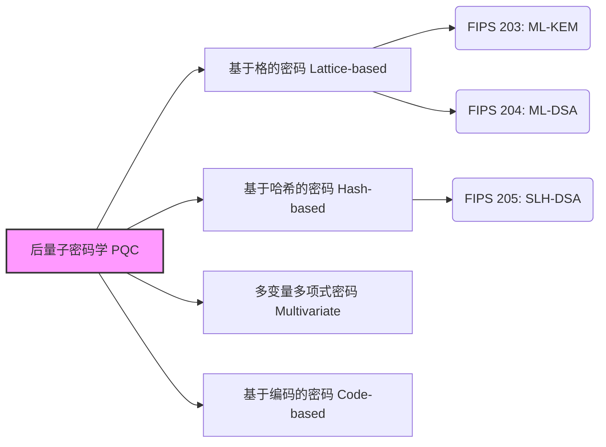

## 引言：量子计算机带来的密码技术“威胁”

目前，我们在互联网上日常进行的通信——在线银行的支付、网站的浏览（HTTPS）、消息应用程序中的交流，乃至区块链和加密资产的交易——其中很大一部分都受到被称为“公钥密码学”的技术的保护。具体而言，RSA加密和椭圆曲线加密（ECC）等算法，构成了支撑现代数字社会可靠性的根基。

这些密码方式的安全性依据是“大数分解”和“离散对数问题”等数学难题，使用当前的经典计算机（包括超级计算机）去破解需要耗费天文数字般的时间。然而，随着近年来取得显著进展的 **“量子计算机”** 投入实际应用，这一前提将被彻底推翻。

1994年彼得·肖尔（Peter Shor）发表的“肖尔算法”在数学上证明了，如果使用具备足够性能的量子计算机，就能在极短的时间内解决大数分解和离散对数问题。这意味着，目前保护互联网的加密通信在未来都面临着被破解的风险（这被称为 Y2Q：Years to Quantum，或 Q-Day 问题）。

更加严重的是存在一种被称为“Harvest Now, Decrypt Later（先窃取存储，待未来能破解时再解密）”的攻击手法。对于国家机密、企业知识产权、个人生物特征信息等需要保密几十年的数据，现在可能已经成为为了未来解密而被窃取的目标。

为了应对这一前所未有的危机，全世界的密码学家和研究机构正全力以赴开发即使面对量子计算机的攻击也能保持安全的新一代密码技术—— **后量子密码学（PQC：Post-Quantum Cryptography）**。本文将详细介绍PQC的基础、主要算法的机制，以及美国国家标准与技术研究院（NIST）推进的全球标准化最新动向。

---

## 什么是后量子密码学（PQC）？

后量子密码学（Post-Quantum Cryptography, PQC）是指设计为既能在现有的经典计算机上运行，又能够抵御未来出现的大规模量子计算机攻击（如肖尔算法等）的一类密码算法的总称。

常被混淆的技术有“量子密码学（Quantum Cryptography）”和“量子密钥分发（QKD）”，但它们是完全不同的路径。量子密码学（QKD）是利用量子力学的物理法则（如观测会改变状态的特性等），在物理层面上使通信路径上的窃听变得不可能的硬件基础技术。它需要专用的光纤和特殊设备，面临着导入成本和距离限制等挑战。

另一方面，**PQC说到底是基于“数学”的软件基础密码技术**。因此，它作为软件更新集成到现有的互联网基础设施、服务器、智能手机和浏览器中是可行的，具有极高的现实社会适用性。全世界的IT企业和政府机构当前的当务之急是将目前使用的RSA或ECC替换（迁移）为这种PQC。

---

## 支撑PQC的4个主要数学路径

基于即使使用量子计算机也无法高效求解的数学难题（如NP困难问题等），人们提出了各种PQC算法。这里介绍目前成为主流的4个主要类别。

### 后量子密码学（PQC）的主要路径

### 1. 基于格的密码（Lattice-based Cryptography）

目前，在PQC领域最被看好且成为主流的是这种“基于格的密码”。格密码的安全性基于多维空间中规则排列的点（格点）相关的问题。著名的问题包括“最短向量问题（SVP：Shortest Vector Problem）”和“LWE问题（Learning With Errors）”等。

**机制概要：** 
想象在一个维度极高（数百至数千维）的空间中，无数的点呈网格状排列。要在2维或3维中找到某个特定的格点很容易，但在数百维中，目前尚未发现能用经典计算机或量子计算机高效找出的算法。特别是LWE问题利用了这样一个特性：“如果在联立一次方程中故意加入微小的‘噪声（误差）’，推测原始变量就会变得极度困难”。

**优点：** 
- 适用于密钥封装机制（KEM）和数字签名。
- 处理速度极快（有时甚至比RSA和ECC还要快）。
- 密钥尺寸和密文尺寸相对较小，平衡性好。

目前NIST正在标准化的算法中，很多（如ML-KEM和ML-DSA）都采用了这种基于格的密码。

### 2. 基于哈希的密码（Hash-based Cryptography）

基于哈希的密码是专注于数字签名的PQC算法。其安全性的基础仅仅依赖于安全的“密码学哈希函数”（如SHA-2或SHA-3）所具备的抗碰撞性和单向性。

**机制概要：** 
以只能使用一次的所谓“兰波特签名（Lamport Signature）”（一次性签名）为出发点，通过使用被称为“默克尔树（Merkle Tree）”的树状数据结构将其捆绑，从而使得一个密钥对能够进行多次签名。

**优点：** 
- 安全基础极其坚固，有着“只要哈希函数安全则密码安全”的强力证明。
- 对数学结构的依赖少，发现未预料到的破解方法的风险低。

**缺点：** 
- 无法用于密钥封装机制（KEM），只能用于数字签名。
- 签名尺寸往往较大。
- 分为“有状态”和“无状态”，有状态（如XMSS）由于需要严格管理密钥的使用次数，在实现上难度较高。

NIST已将“SLH-DSA（旧称 SPHINCS+）”作为无状态哈希签名进行了标准化。

### 3. 多变量多项式密码（Multivariate Cryptography）

多变量多项式密码的安全性依据是求解具有众多变量的非线性方程组系统（MQ问题：Multivariate Quadratic problem）的困难程度。已知该问题是NP困难的。

**机制概要：** 
发送方将明文（或哈希值）代入作为公钥传递过来的具有众多变量的复杂方程中，从而生成密文（签名）。合法的接收方拥有将“方程结构转换为易于求解的形式的隐藏信息（陷门）”作为私钥，利用它来进行解密（或签名验证）。

**优点：** 
- 签名尺寸非常小。
- 签名验证速度极快。适合于资源受限的物联网设备等。

**缺点：** 
- 公钥尺寸非常大（有时可达数十至数百千字节）。
- 过去曾出现过有力的算法（如Rainbow）被经典攻击攻破的案例，因此与其他方式相比，建立对其安全性的信任较为困难。

### 4. 基于编码的密码（Code-based Cryptography）

基于编码的密码是将用于纠正通信路径上错误的“纠错码”理论应用到密码学中。1978年提出的“McEliece密码”最为著名，也是PQC中历史最悠久的算法之一。

**机制概要：** 
发送方利用接收方的公钥（隐藏了特定结构的纠错码的生成矩阵）对明文进行编码，并故意加入错误（噪声）后发送。接收方使用私钥去除错误，提取出明文。破译者必须从不知其结构的普通随机编码中纠正错误，这被称为“一般伴随式解码问题（Syndrome Decoding Problem）”，并被证明是NP困难的。

**优点：** 
- 经过40多年以上的透彻研究，至今未发现有效的攻击，安全信任度极高。
- 加解密处理速度快。

**缺点：** 
- 公钥尺寸极其巨大（有时可达几兆字节）。因此，在通信带宽和内存受限的环境（如TLS握手等）中难以利用。

---

## NIST推进PQC标准化的最新动向

美国国家标准与技术研究院（NIST）自2016年起开始向全球公开征集新一代后量子密码算法，并经历了多年的严格评估和多轮筛选。

2024年，NIST终于作为正式的联邦信息处理标准（FIPS）发布了以下三种算法。这为全球各组织在生产环境中开始实施奠定了坚实的基础。

### 已制定的FIPS标准（2024年）

1. **FIPS 203: ML-KEM（旧称: CRYSTALS-Kyber）** 
   - **用途:** 密钥封装机制（KEM）／加密与密钥共享
   - **基础技术:** 基于格的密码（Module-LWE）
   - **特点:** 密钥尺寸和速度的平衡极佳，将作为Web通信（TLS）和安全消息应用程序等一般互联网用途中的默认PQC密钥共享机制。

2. **FIPS 204: ML-DSA（旧称: CRYSTALS-Dilithium）** 
   - **用途:** 数字签名
   - **基础技术:** 基于格的密码（Module-LWE）
   - **特点:** 数字签名的主要标准。能够高效处理，将成为软件签名和文档认证等各种电子签名用途的新标准。

3. **FIPS 205: SLH-DSA（旧称: SPHINCS+）** 
   - **用途:** 数字签名
   - **基础技术:** 基于哈希的密码（无状态）
   - **特点:** 万一未来基于格的密码被发现存在漏洞，它将作为备用选项发挥极其重要的作用。虽然签名尺寸较大，但适用于需要长期可靠性的用途。

### 追求进一步的多样性

尽管NIST完成了最初的标准化进程，但仍在继续探索更多的算法。尤其是由于标准过于偏向“基于格的密码”，因此确保 **算法的多样性（Crypto Diversity）** 被认为非常重要。作为密钥共享的备用标准，基于编码的密码等算法的评估正在推进中，预计未来PQC的基础将变得更加牢固。

---

## 向PQC迁移的场景与挑战：“密码敏捷性”的重要性

随着NIST正式标准规范的发布，全球各地的政府机构、金融机构和科技公司将全面加速从现有的RSA/ECC向PQC的迁移（Migration）。美国国家安全局（NSA）等机构的指南也建议尽早完成迁移。

### 采用混合方法

因为PQC算法较新，与经典密码相比尚未经过“时间的考验”。考虑到实现中潜藏的缺陷或发现新攻击方法的风险，在过渡期建议采用 **“混合方式”**。这是一种将现有且经过验证的密码（例如：ECDHE）与新型PQC（例如：ML-KEM）结合起来进行密钥交换的方法。目前，主流浏览器和云服务中这种方式的试验性导入正在快速推进。

### 实现密码敏捷性（Crypto-Agility）

企业和系统开发者今后最应该意识到的是确保 **“密码敏捷性（Crypto-Agility）”**。当未来算法被发现缺陷或出现新标准时，必须具备能够在不停止系统的情况下，迅速更换和更新密码算法的灵活架构设计。

准确掌握自己系统内部“在哪里”、“使用了什么密码”、“为了什么目的”，从而制定密码材料清单（CBOM：Cryptography Bill of Materials），是迈向PQC迁移的重要第一步。

---

## 结语：为即将到来的“Q-Day”做好准备

量子计算机的进化在为人类带来巨大恩惠的同时，也是对作为现代数字社会基石的密码安全的最大威胁。后量子密码学（PQC）已不再是“遥远未来的研究课题”。经历了NIST发布FIPS标准这一里程碑，PQC已正式进入了全面的“实施与迁移”阶段。

考虑到“Harvest Now, Decrypt Later”的威胁，对于所有处理高度机密数据的组织而言，向PQC迁移是“现在立即”就应该着手进行的最优先课题。让我们深刻理解新一代密码技术，提高系统的密码敏捷性，从而安全地度过即将到来的量子计算机时代。
