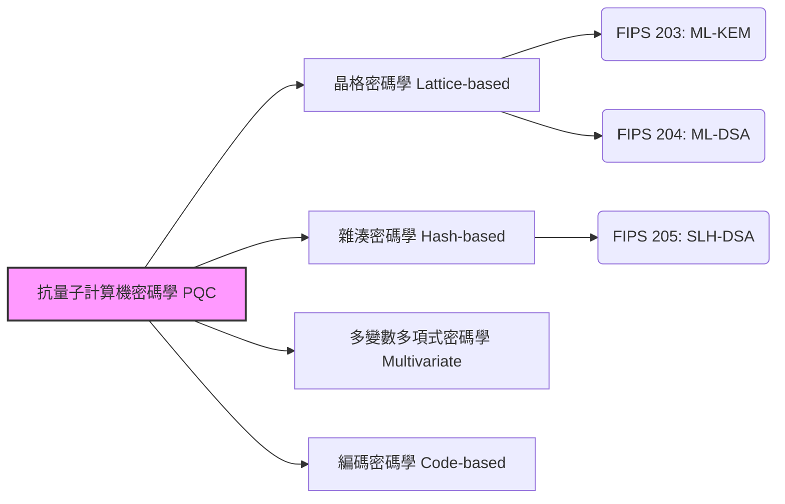

## 前言：量子電腦為密碼技術帶來的「威脅」

現在，我們在網際網路上日常進行的通訊——線上銀行的支付、網站的瀏覽（HTTPS）、通訊軟體的交流，甚至區塊鏈與加密資產的交易——其中大部分都受到被稱為「公開金鑰密碼學」的技術保護。具體來說，RSA密碼學和橢圓曲線密碼學（ECC）等演算法，成為了支撐現代數位社會可靠性的基礎。

這些密碼體系，是以目前古典電腦（包含超級電腦）需要花費天文數字時間才能解開的數學難題，如「巨大數字的質因數分解」或「離散對數問題」作為安全性的基礎。然而，近年來取得顯著進展的 **「量子電腦」** 一旦實用化，這個前提將會從根本上被推翻。

1994年彼得·蕭爾（Peter Shor）發表的「蕭爾演算法」，在數學上證明了只要使用具備足夠效能的量子電腦，就能在極短的時間內解開質因數分解或離散對數問題。這也意味著，保護現今網際網路的密碼通訊，在未來有全部遭到破解的風險（被稱為 Y2Q：Years to Quantum，或 Q-Day 的問題）。

更嚴重的是，「Harvest Now, Decrypt Later（現在竊取並儲存數據，等到未來能夠解密時再破解）」這種攻擊手法的存在。國家的機密情報、企業的智慧財產、個人的生物特徵等需要保密數十年的數據，現在可能已經成為以未來解密為前提的竊取目標。

為了應對這場前所未有的危機，世界各地的密碼學家與研究機構正傾全力開發能夠抵禦量子電腦攻擊的次世代密碼技術，也就是 **抗量子計算機密碼學（PQC：Post-Quantum Cryptography）** 。本篇文章將從PQC的基礎開始，詳細解說主要演算法的機制，以及美國國家標準技術研究所（NIST）推動的全球標準化最新動向。

---

## 什麼是抗量子計算機密碼學（PQC）？

抗量子計算機密碼學（Post-Quantum Cryptography, PQC）是能在現有古典電腦上運行，且被設計成能夠抵抗未來可能出現的大型量子電腦攻擊（如蕭爾演算法等）的密碼演算法的總稱。

經常被混淆的技術有「量子密碼學（Quantum Cryptography）」和「量子金鑰分發（QKD）」，但這些是完全不同的方法。量子密碼學（QKD）是利用量子力學的物理定律（如觀測會改變狀態的特性），在物理上讓通訊路徑上的竊聽變得不可能的基於硬體的技術。它需要專用的光纖或特殊設備，並面臨導入成本和距離限制等課題。

另一方面， **PQC 則是完全以「數學」為基礎，基於軟體的密碼技術** 。因此，它可以作為軟體更新整合到現有的網際網路基礎設施、伺服器、智慧型手機、瀏覽器中，具有極高的現實社會適用性。全球的IT企業與政府機構目前的當務之急，是將現行使用的 RSA 或 ECC 替換（轉移）為這項 PQC。

---

## 支撐 PQC 的 4 種主要數學方法

基於即使用了量子電腦也無法有效解開的數學難題（如 NP 困難問題等），各界提出了多種 PQC 演算法。在這裡，我們將介紹目前成為主流的 4 個主要類別。

### 抗量子計算機密碼學（PQC）的主要方法

### 1. 晶格密碼學（Lattice-based Cryptography）

目前在 PQC 領域中最被看好且成為主流的，就是這項「晶格密碼學」。晶格密碼學是以多維空間中規律排列的點（晶格點）相關的問題作為安全性的基礎。著名的問題包括「最短向量問題（SVP：Shortest Vector Problem）」與「錯誤學習問題（LWE：Learning With Errors）」等。

**機制概要：** 
請想像在一個維度非常高（數百到數千維）的空間內，有無數的點呈現晶格狀排列。要找到特定的晶格點，在 2 維或 3 維空間很簡單，但到了數百維，目前無論是古典電腦還是量子電腦，都沒有發現能夠有效找出的演算法。尤其是 LWE 問題，利用了「若在聯立一次方程式中刻意加入微小的『雜訊（誤差）』，要推測原始變數會變得極其困難」的特性。

**優點：** 
- 適用於金鑰封裝（KEM）與數位簽章兩者。
- 處理速度非常快（有時甚至比 RSA 或 ECC 更快）。
- 金鑰大小與密文大小相對較小，平衡性良好。

目前 NIST 正在進行標準化的演算法中，有許多（如 ML-KEM 或 ML-DSA 等）都採用了這項晶格密碼學。

### 2. 雜湊密碼學（Hash-based Cryptography）

雜湊密碼學是專門用於數位簽章的 PQC 演算法。其安全性的基礎，僅依賴於 SHA-2 或 SHA-3 等安全的「密碼學雜湊函數」所具備的抗碰撞性與單向性。

**機制概要：** 
以被稱為「藍波簽章（Lamport Signature）」的只能使用一次的一次性簽章方式為起點。透過將其與被稱為「默克爾樹（Merkle Tree）」的樹狀資料結構綁定，實現了使用單一金鑰對進行多次簽章。

**優點：** 
- 安全性的基礎極其堅固，有著「只要雜湊函數安全就安全」的強力證明。
- 對數學結構的依賴較少，被發現預期外破解方法的風險較低。

**缺點：** 
- 無法用於金鑰封裝（KEM），僅限於數位簽章。
- 簽章大小往往會變得較大。
- 有分為「有狀態（Stateful）」與「無狀態（Stateless）」，有狀態（如 XMSS 等）因為必須嚴格控管金鑰的使用次數，在實作上的難度較高。

NIST 已經將作為無狀態雜湊簽章的「SLH-DSA (舊名 SPHINCS+)」予以標準化。

### 3. 多變數多項式密碼學（Multivariate Cryptography）

多變數多項式密碼學是以解開包含多個變數的聯立二次多項式系統的困難度（MQ 問題：Multivariate Quadratic problem）作為安全性基礎的方法。這個問題已知屬於 NP 困難。

**機制概要：** 
發送方將明文（或雜湊值）代入作為公鑰傳遞的包含多個變數的複雜方程式中，製作出密文（簽章）。合法的接收方擁有「能將方程式結構轉換為容易解開形式的隱藏資訊（陷門）」作為私鑰，並使用它來進行解密（或簽章驗證）。

**優點：** 
- 簽章大小非常小。
- 簽章的驗證速度極快。適合用於資源受限的物聯網（IoT）設備等。

**缺點：** 
- 公鑰的大小非常大（有時可達數十到數百 KB）。
- 過去曾有有力的演算法（如 Rainbow 等）被古典攻擊破解的案例，與其他方法相比，在建立對安全性的信任方面有較困難的一面。

### 4. 編碼密碼學（Code-based Cryptography）

編碼密碼學是將用於修正通訊路徑上錯誤的「錯誤更正碼」理論應用於密碼學中。1978 年提出的「McEliece 密碼學」最為著名，也是 PQC 中歷史最悠久的方法之一。

**機制概要：** 
發送方使用接收方的公鑰（隱藏了特定結構的錯誤更正碼的生成矩陣）對明文進行編碼，並額外加入刻意的錯誤（雜訊）後發送。接收方則使用私鑰去除錯誤，取出明文。密碼分析者必須從不知道結構的純隨機編碼中修正錯誤，這被稱為「一般症狀解碼問題」，已被證明屬於 NP 困難。

**優點：** 
- 經過 40 年以上漫長時間的徹底研究，至今尚未發現有效的攻擊方式，安全性的可靠度極高。
- 加密與解密的處理速度快。

**缺點：** 
- 公鑰的大小非常巨大（有時可達數 MB）。因此，很難在通訊頻寬或記憶體受限的環境（如 TLS 交握等）中使用。

---

## NIST 的 PQC 標準化最新動向

美國國家標準技術研究所（NIST）自 2016 年起，開始向全世界公開徵求次世代抗量子計算機密碼學演算法，並經過了長達數年的嚴格評估與多輪篩選。

2024 年，NIST 終於發布了以下 3 種演算法作為正式的聯邦資訊處理標準（FIPS）。這意味著全球組織要在正式環境中開始實作的堅固基礎已經完成。

### 已制定的 FIPS 標準（2024 年）

1. **FIPS 203: ML-KEM（舊名: CRYSTALS-Kyber）** 
   - **用途:** 金鑰封裝機制（KEM）／加密與金鑰共享
   - **基礎技術:** 晶格密碼學（Module-LWE）
   - **特徵:** 金鑰大小與速度的平衡非常良好，將作為 Web 通訊（TLS）或安全的通訊軟體等一般網際網路用途中的預設 PQC 金鑰共享發揮作用。

2. **FIPS 204: ML-DSA（舊名: CRYSTALS-Dilithium）** 
   - **用途:** 數位簽章
   - **基礎技術:** 晶格密碼學（Module-LWE）
   - **特徵:** 數位簽章的主要標準。可進行高效率的處理，將成為軟體簽章或文件驗證等所有電子簽章用途的新標準。

3. **FIPS 205: SLH-DSA（舊名: SPHINCS+）** 
   - **用途:** 數位簽章
   - **基礎技術:** 雜湊密碼學（無狀態）
   - **特徵:** 萬一未來晶格密碼學被發現存在漏洞時，將作為備用方案發揮作用，因此擔負著極其重要的角色。簽章大小雖然較大，但適合需要長期可靠性的用途。

### 追求更多的多樣性

NIST 在完成首批標準化流程的同時，仍持續探索更多的演算法。特別是因為標準偏向「晶格密碼學」，因此確保 **演算法的多樣性（Crypto Diversity）** 被視為一項重點。作為金鑰共享的備用標準，目前正推動對編碼密碼學等進行評估，PQC 的基礎預計在未來將變得更加穩固。

---

## 邁向 PQC 的轉移劇本與課題：「密碼敏捷性」的重要性

隨著 NIST 發布正式的標準規格，全球的政府機構、金融機構、科技企業將開始正式推動從現有的 RSA/ECC 轉移（遷移）至 PQC。美國國家安全局（NSA）等機構的指南中，也建議應儘早完成轉移。

### 採用混合式方法

由於 PQC 演算法較為新穎，與古典密碼學相比尚未經歷過「時間的考驗」。考慮到實作中潛藏的錯誤或可能發現新攻擊手法的風險，在過渡時期建議採用 **「混合式方法」** 。這是一種結合具有實績的現有密碼學（例：ECDHE）與新的 PQC（例：ML-KEM）來進行金鑰交換的方法。目前，主流瀏覽器與雲端服務正快速推進這種方法的測試導入。

### 實現密碼敏捷性（Crypto-Agility）

企業與系統開發者今後最應該意識到的，是確保 **「密碼敏捷性（Crypto-Agility）」** 。當未來演算法被發現缺陷或出現新標準時，必須具備能夠在不停止系統運作的情況下，迅速更換與更新密碼演算法的彈性架構設計。

精確掌握自家系統內部「在何處」、「使用了哪種密碼」、「基於何種目的」來建立密碼物料清單（CBOM：Cryptography Bill of Materials），將是邁向 PQC 轉移的重要第一步。

---

## 總結：為即將到來的「Q-Day」做好準備

量子電腦的進化在為人類帶來巨大恩惠的同時，也是對現代數位社會基礎之密碼安全性的最大威脅。抗量子計算機密碼學（PQC）已不再是「遙遠未來的研究主題」。經過 NIST 發布 FIPS 標準這項里程碑，PQC 已經正式進入「實作與轉移」的階段。

考慮到「Harvest Now, Decrypt Later」的威脅，對於所有處理機密數據的組織來說，轉移至 PQC 是「現在立刻」就該著手進行的最優先課題。透過深入理解次世代密碼技術並提升系統的密碼敏捷性，讓我們安全地度過即將到來的量子電腦時代吧。
