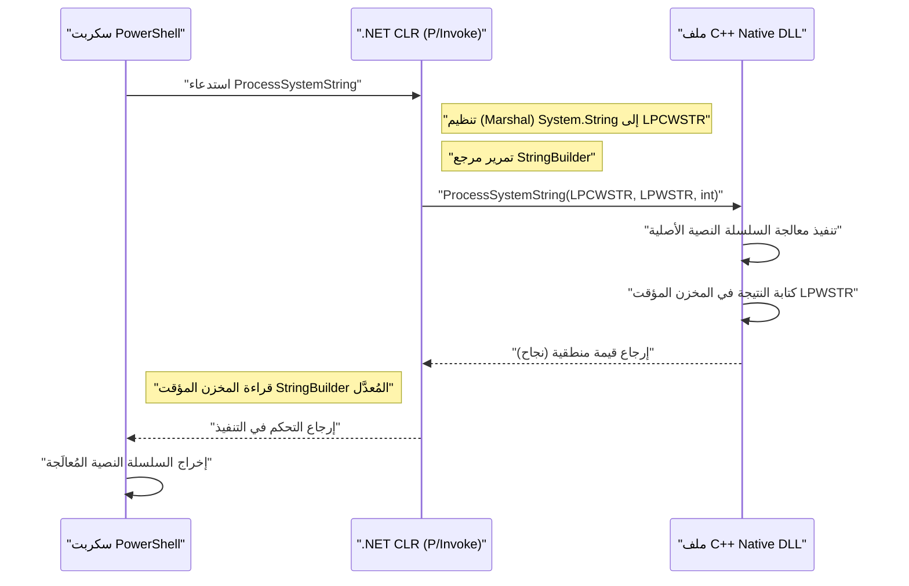

## مقدمة

في إدارة أنظمة Windows والأتمتة، أصبح PowerShell الأداة القياسية الفعلية. يمكنك كتابة نصوص برمجية (سكربتات) لأي مهمة تقريبًا، مثل إدارة Active Directory، ومعالجة نظام الملفات، وتغيير تكوين الشبكة. ومع ذلك، على الرغم من أن PowerShell متعدد الاستخدامات، إلا أن هناك أوقاتًا تعاني فيها من قيود الأداء الخاصة بلغات السكربتات أو صعوبة الوصول إلى واجهات برمجة تطبيقات Windows (Windows API) ذات المستوى المنخفض جدًا.

هنا يأتي "التكامل مع C++" كحل قوي. توفر لغة C++ سرعة تنفيذ أصلية (native) ووصولاً كاملاً إلى واجهات برمجة تطبيقات Win32 وكائنات COM. من خلال الجمع بين "الإنتاجية العالية والمرونة" لـ PowerShell مع "الأداء الفائق والتحكم منخفض المستوى" لـ C++، يصبح من الممكن تحسين مهام إدارة النظام المعقدة والواسعة النطاق للغاية في بيئات المؤسسات.

في هذه المقالة، سنشرح بالتفصيل المعمارية المحددة، وتقنيات التنفيذ، وأفضل الممارسات لإدارة الذاكرة وتحويل السلاسل النصية (strings) لربط PowerShell و C++ ثنائي الاتجاه.

## لماذا ندمج بين PowerShell و C++؟

### 1. تجاوز قيود الأداء

يعمل PowerShell على إطار عمل .NET Framework (أو .NET Core / .NET) ويحتوي على عناصر لغة مفسرة ومكتوبة ديناميكيًا. لذلك، عند معالجة كميات كبيرة من النصوص، أو إجراء عمليات تشفير معقدة، أو تحليل سجلات الأحداث التي تصل إلى ملايين الأسطر، يمكن أن تصبح سرعة التنفيذ واستهلاك الذاكرة بمثابة عنق زجاجة (bottleneck).

دعونا نفكر في نموذج لحجم الحساب ووقت المعالجة. بافتراض أن وقت المعالجة الإجمالي للمهمة هو $T_{total}$، فإن وقت المعالجة باستخدام PowerShell وحده، ووقت المعالجة عند نقل الحمل (offloading) إلى C++ يمكن صياغته على النحو التالي.

$$ T_{total}^{(PS)} = N \times (t_{overhead} + t_{compute}^{(PS)}) $$

$$ T_{total}^{(C++)} = t_{interop} + N \times t_{compute}^{(C++)} $$

حيث $N$ هو عدد العناصر التي يتم معالجتها، و $t_{overhead}$ هو العبء الإضافي (overhead) المرتبط بمعالجة الحلقات (loops) في PowerShell، و $t_{compute}$ هو وقت الحساب النقي لكل عنصر، و $t_{interop}$ هو العبء الإضافي لاستدعاء الحدود مثل P/Invoke.

عندما يكون $N$ كبيرًا بما يكفي، وبما أن $t_{overhead} \gg 0$ و $t_{compute}^{(PS)} > t_{compute}^{(C++)}$، فإن تفويض المعالجة إلى C++ (نقل الحمل) حتى مع دفع التكلفة الأولية $t_{interop}$ يقلل من زمن الوصول الإجمالي (latency) بشكل كبير.

### 2. الوصول إلى واجهات برمجة تطبيقات Win32 الأصلية

على الرغم من أنه من الممكن استدعاء Win32 API عبر C# باستخدام `Add-Type` في PowerShell وحده، إلا أنه من الصعب جدًا تعريف واجهات برمجة التطبيقات (APIs) التي تتضمن هياكل (structures) معقدة أو دوال رد الاتصال (callback functions) (مثل: التحكم في برامج تشغيل الفلتر المصغر، والمعالجة المتقدمة لذاكرة العملية) مباشرة في C# / PowerShell. من خلال إنشاء ملف DLL أصلي مغلف في C++ واستدعائه من PowerShell، يصبح التحكم في النظام آمنًا من حيث النوع وموثوقًا به ممكنًا.

## استدعاء ملف DLL أصلي بلغة C++ من PowerShell

نمط التكامل الأكثر شيوعًا هو تنفيذ المعالجة الثقيلة أو المعالجة الخاصة بالنظام كملف DLL بلغة C++، واستدعاء ذلك من سكربت PowerShell.

### تنفيذ ملف DLL من جانب C++ (لـ Win32 API والمنطق المخصص)

أولاً، قم بإنشاء ملف DLL بلغة C++ يحتوي على دوال مُصدَّرة (exported functions) يمكن استدعاؤها من PowerShell. نعرض هنا رمز C++ بسيطًا يفترض "دالة تقوم بتشفير وفك تشفير بيانات السلاسل النصية الكبيرة الحجم، أو إجراء حسابات تجزئة (hash) معقدة" كمثال.

```cpp
// NativeLib.cpp
#include <windows.h>
#include <string>

// تحديد رابط C و __stdcall لتسهيل الاستدعاء باستخدام P/Invoke
extern "C" {

    __declspec(dllexport) int __stdcall ComputeHeavyTask(int multiplier, int dataSize) {
        int result = 0;
        // محاكاة لمعالجة ثقيلة متعمدة
        for (int i = 0; i < dataSize; ++i) {
            result += (i % multiplier);
        }
        return result;
    }

    // دالة لمعالجة السلاسل النصية (استخدام LPWSTR لدعم Unicode)
    __declspec(dllexport) bool __stdcall ProcessSystemString(LPCWSTR inputString, LPWSTR outputBuffer, int bufferSize) {
        if (inputString == nullptr || outputBuffer == nullptr) {
            return false;
        }

        std::wstring str(inputString);
        // بعض معالجات السلاسل النصية المعقدة (مثال: إضافة مُعرّف النظام)
        std::wstring result = L"PROCESSED_" + str;

        if (result.length() >= (size_t)bufferSize) {
            return false; // منع تجاوز سعة المخزن المؤقت (buffer overrun)
        }

        wcscpy_s(outputBuffer, bufferSize, result.c_str());
        return true;
    }
}
```

### إدارة الذاكرة وتحويل السلاسل النصية (`BSTR`، `LPWSTR`)

عند تبادل البيانات بين C++ و PowerShell (.NET)، فإن أهم ما يجب الانتباه إليه هو **ترميز السلاسل النصية (string encoding)** و **إدارة الذاكرة**.

- **`LPCWSTR` / `LPWSTR`**: مؤشر سلسلة نصية عريضة (UTF-16LE) في C/C++. يُستخدم بشكل قياسي في دوال نظام Windows API من نوع `W`. في P/Invoke، من خلال تحديد `CharSet = CharSet.Unicode`، يتم تنظيمه (marshaling) تلقائيًا باستخدام `String` و `StringBuilder` في .NET.
- **`BSTR`**: سلسلة نصية عريضة ببادئة الطول (length-prefixed) تُستخدم في COM (Component Object Model). يجب إدارة الذاكرة باستخدام `SysAllocString` و `SysFreeString`. حدد `[MarshalAs(UnmanagedType.BStr)]` في P/Invoke.

عند تخصيص ذاكرة جديدة في جانب C++ وإعادتها إلى جانب PowerShell، تظهر مشكلة تحديد مَن سيقوم بتحرير الذاكرة (الملكية). في الدالة `ProcessSystemString` أعلاه، نعتمد النمط القياسي لـ Win32 API حيث "يقوم C++ بكتابة النتيجة في المخزن المؤقت (buffer) (`outputBuffer`) الذي تم تخصيصه مسبقًا بواسطة المتصل (PowerShell)". هذا يمنع تسرب الذاكرة (memory leaks).

### إضافة الأنواع بـ `Add-Type` و P/Invoke من جانب PowerShell

بمجرد تجميع ملف DLL الخاص بـ C++ (`NativeLib.dll`)، استدعه من سكربت PowerShell. يمكنك الاستفادة من توقيع C# الخاص بـ P/Invoke وتجميعه ديناميكيًا باستخدام `Add-Type`.

```powershell
# PowerShell Script: Invoke-NativeDLL.ps1

$signature = @'
using System;
using System.Runtime.InteropServices;
using System.Text;

public class NativeInterop
{
    // تعريف الدالة ComputeHeavyTask في C++
    [DllImport("NativeLib.dll", CallingConvention = CallingConvention.StdCall)]
    public static extern int ComputeHeavyTask(int multiplier, int dataSize);

    // تعريف الدالة ProcessSystemString في C++
    [DllImport("NativeLib.dll", CharSet = CharSet.Unicode, CallingConvention = CallingConvention.StdCall)]
    public static extern bool ProcessSystemString(string inputString, StringBuilder outputBuffer, int bufferSize);
}
'@

# تجميع كود C# وإضافته إلى جلسة PowerShell
Add-Type -TypeDefinition $signature -PassThru | Out-Null

# 1. استدعاء العملية الحسابية الثقيلة
$result = [NativeInterop]::ComputeHeavyTask(7, 100000000)
Write-Host "Compute Task Result: $result"

# 2. استدعاء معالجة السلسلة النصية
$input = "SYSTEM_NODE_001"
$bufferSize = 256
# استخدام StringBuilder كمخزن مؤقت للكتابة عليه من جانب C++
$outputBuffer = New-Object System.Text.StringBuilder -ArgumentList $bufferSize

$success = [NativeInterop]::ProcessSystemString($input, $outputBuffer, $bufferSize)

if ($success) {
    Write-Host "Processed String: $($outputBuffer.ToString())"
} else {
    Write-Host "String processing failed." -ForegroundColor Red
}
```

### عرض المعمارية مرئيًا

يوضح مخطط التسلسل (sequence diagram) التالي تدفق الاستدعاءات وتبادل الذاكرة من PowerShell إلى ملف C++ DLL.



## استدعاء PowerShell من C++

الآن سنتناول النهج العكسي. قد ترغب في تنفيذ سكربت PowerShell ديناميكيًا والحصول على النتيجة من خدمة نظام أو تطبيق سطح مكتب مبني باستخدام C++. على سبيل المثال، السيناريو الذي يتم فيه تنفيذ سكربت إصلاح عبر PowerShell عندما يكتشف وكيل المراقبة في C++ خللًا معينًا.

هناك نهجان رئيسيان:
1. **بدء العملية (`CreateProcess` / `_popen`)**: تشغيل `powershell.exe` كعملية مستقلة وربط الإدخال والإخراج القياسي عبر الأنابيب (pipes).
2. **واجهة برمجة تطبيقات استضافة PowerShell (عبر C++/CLI)**: استضافة بيئة تشغيل PowerShell داخل نفس العملية.

في هذه المقالة، سنشرح طريقة **CreateProcess باستخدام خطوط الأنابيب (pipelines)**، وهي الطريقة الأكثر قوة وتنوعًا في برمجة النظام.

### التنفيذ عبر الأنابيب المجهولة و CreateProcess

يقوم كود C++ التالي بإنشاء أنابيب مجهولة (Anonymous Pipes)، وتشغيل `powershell.exe` كعملية فرعية لتنفيذ سكربت، ثم قراءة النتيجة من الإخراج القياسي.

```cpp
#include <windows.h>
#include <iostream>
#include <string>
#include <vector>

std::string ExecutePowerShellScript(const std::string& script) {
    HANDLE hReadPipe, hWritePipe;
    SECURITY_ATTRIBUTES sa;
    sa.nLength = sizeof(SECURITY_ATTRIBUTES);
    sa.bInheritHandle = TRUE; // توريث مقبض الأنبوب للعملية الفرعية
    sa.lpSecurityDescriptor = NULL;

    // 1. إنشاء الأنبوب
    if (!CreatePipe(&hReadPipe, &hWritePipe, &sa, 0)) {
        return "Error: CreatePipe failed.";
    }

    // 2. إعداد معلومات بدء التشغيل للعملية الفرعية (PowerShell)
    STARTUPINFOA si;
    ZeroMemory(&si, sizeof(STARTUPINFOA));
    si.cb = sizeof(STARTUPINFOA);
    si.dwFlags = STARTF_USESTDHANDLES | STARTF_USESHOWWINDOW;
    si.hStdOutput = hWritePipe;
    si.hStdError = hWritePipe;
    si.wShowWindow = SW_HIDE; // إخفاء النافذة

    PROCESS_INFORMATION pi;
    ZeroMemory(&pi, sizeof(PROCESS_INFORMATION));

    // بناء سطر الأوامر (نسخة مبسطة تتجنب تشفير Base64 وما إلى ذلك باستخدام سياسة Bypass)
    std::string cmd = "powershell.exe -NoProfile -NonInteractive -Command \"" + script + "\"";
    std::vector<char> cmdBuffer(cmd.begin(), cmd.end());
    cmdBuffer.push_back('\0');

    // 3. إنشاء العملية
    if (!CreateProcessA(NULL, cmdBuffer.data(), NULL, NULL, TRUE, 0, NULL, NULL, &si, &pi)) {
        CloseHandle(hReadPipe);
        CloseHandle(hWritePipe);
        return "Error: CreateProcess failed.";
    }

    // إغلاق أنبوب الكتابة في جانب العملية الأصلية لأنه غير مطلوب (عدم إغلاقه سيؤدي إلى حظر عملية القراءة)
    CloseHandle(hWritePipe);

    // 4. قراءة النتائج
    std::string output = "";
    DWORD bytesRead;
    char buffer[4096];

    while (ReadFile(hReadPipe, buffer, sizeof(buffer) - 1, &bytesRead, NULL) && bytesRead > 0) {
        buffer[bytesRead] = '\0';
        output += buffer;
    }

    // 5. التنظيف (Cleanup)
    WaitForSingleObject(pi.hProcess, INFINITE);
    CloseHandle(pi.hProcess);
    CloseHandle(pi.hThread);
    CloseHandle(hReadPipe);

    return output;
}

int main() {
    // أمر PowerShell للحصول على قائمة العمليات وفرزها حسب استخدام وحدة المعالجة المركزية (CPU)
    std::string psCommand = "Get-Process | Sort-Object CPU -Descending | Select-Object -First 5 | Format-Table Name, CPU, Id";
    
    std::cout << "Executing PowerShell from C++..." << std::endl;
    std::string result = ExecutePowerShellScript(psCommand);
    
    std::cout << "Result:\n" << result << std::endl;
    return 0;
}
```

### التكامل بين سجل Windows و PowerShell

عند تنفيذ سكربت من C++، يجب تجنب الترميز الثابت (hardcoding) لقيم الإعدادات الديناميكية أو مسارات التنفيذ. في كثير من الأحيان، تقرأ تطبيقات C++ إعداداتها من **سجل Windows (Windows Registry)**.

تُفضَّل معمارية في أنظمة المؤسسات حيث يستخدم جانب C++ `RegOpenKeyEx` و `RegQueryValueEx` لاسترداد مسار سكربت PowerShell من `HKLM\SOFTWARE\MyApp` وتمريره كوسيطة لـ `CreateProcess` المذكور أعلاه.

```mermaid
flowchart TD
    A["خدمة وكيل C++"] -->|RegQueryValueEx| B["سجل Windows"]
    B -->|إرجاع مسار السكربت| A
    A -->|CreateProcess| C["powershell.exe"]
    C -->|تنفيذ| D["سكربت الإدارة (مثال: Restart-Service)"]
    D -->|الإخراج القياسي (stdout) عبر الأنبوب| C
    C -->|ReadFile| A
    A -->|تسجيل| E["عارض الأحداث / ملف السجل (Log)"]
```

## تحليل الأداء ومزايا نقل الحمل (Offloading)

لماذا نعتمد مثل هذه المعمارية المعقدة؟ كسيناريو محدد، دعونا نفكر في "تحليل ملفات سجل IIS المخصصة التي تصل مساحتها إلى عدة جيجابايت".

عند استخدام `Get-Content` في PowerShell وتحليل سطر بسطر باستخدام التعبيرات النمطية (Regular Expressions)، يتم استهلاك قدر كبير من وقت وحدة المعالجة المركزية بسبب العبء الإضافي لإنشاء الكائنات وجمع القمامة (Garbage Collection أو GC).

يتناسب عدد مرات تخصيص الذاكرة $A$ ومرات تشغيل GC $G$ في تنفيذ السكربت على النحو التالي.

$$ G \propto \sum_{i=1}^{N} A_i $$

عند نقل المعالجة إلى كود أصلي في C++، يمكن استخراج الملف بأكمله مباشرة في الذاكرة باستخدام تخطيط الذاكرة (Memory Mapping) (`CreateFileMapping`, `MapViewOfFile`)، وإجراء بحث عن السلاسل النصية بنسخ صفري (Zero-copy) عبر عمليات المؤشرات. في هذه الحالة، يصبح العبء الإضافي لإنشاء الكائنات فعليًا صفرًا، ويكتمل التحليل بسرعة تقترب من الحد الأقصى النظري لعرض النطاق الترددي للذاكرة.

من خلال إرجاع النتيجة التي تم تحليلها فقط (مثال: قائمة عناوين IP للوصول غير المصرح به) إلى جانب PowerShell، يمكن أيضًا تقليل تكلفة تنظيم P/Invoke إلى الحد الأدنى.

## سيناريوهات عملية لأتمتة إدارة النظام

### السيناريو 1: فحص نظام الملفات وتغيير الصلاحيات بسرعة فائقة

مهمة على خادم ملفات ضخم لاستخراج الملفات ذات الامتدادات المعينة والتي تم إعدادها بقائمة التحكم في الوصول (ACL) محددة، ثم تغيير أذوناتها دفعة واحدة.
- **دور C++**: اجتياز (traverse) شجرة الدلائل بسرعة فائقة باستخدام `FindFirstFile` / `FindNextFile` وتعدد مؤشرات الترابط (Multithreading)، وإنشاء قائمة بمسارات الملفات التي تستوفي الشروط.
- **دور PowerShell**: تطبيق الأذونات دفعة واحدة على القائمة المستلمة من C++ باستخدام `Set-Acl` (أو معالجة متكاملة مع Active Directory).

### السيناريو 2: جمع معلومات الأجهزة المخصصة

مراقبة معلومات الأجهزة المخصصة (مثل بطاقات PCIe الخاصة أو المستشعرات) التي لا يمكن استردادها بواسطة WMI (Windows Management Instrumentation) أو CIM (Common Information Model).
- **دور C++**: ملف DLL يستدعي `DeviceIoControl` لبرامج تشغيل الأجهزة لاسترداد وتحليل البيانات الثنائية.
- **دور PowerShell**: استدعاء ملف DLL بانتظام، وتنسيق نتائج التحليل بتنسيق JSON، وإرسالها إلى REST API الخاص بخادم المراقبة.

## أفضل الممارسات لإدارة الذاكرة واستكشاف الأخطاء وإصلاحها

أكثر الأخطاء (bugs) شيوعًا في عملية التكامل هي **تسرب الذاكرة (Memory Leaks)** و **انتهاكات الوصول (Access Violation: 0xC0000005)**.

1. **صلاحية المؤشر (Pointer Lifetime)**: عند تمرير `[ref]` أو `StringBuilder` في جانب PowerShell، يقوم P/Invoke بتثبيت (Pin) هذه الذاكرة فقط أثناء الاستدعاء. يجب ألا تحفظ هذا المؤشر في متغير عام على جانب C++ للوصول إليه لاحقًا. إذا كنت تجري استدعاءات غير متزامنة (asynchronous callbacks)، فيجب عليك استخدام `GCHandle` لتثبيت الذاكرة بشكل صريح.
2. **حجم المؤشر في بيئة 64 بت**: أنظمة Windows الحديثة تعتمد بشكل أساسي على 64 بت (x64). حجم المؤشر في جانب C++ هو 8 بايت، ويجب استخدام `IntPtr` في جانب PowerShell (.NET). نظرًا لأن `long` في C++ يبلغ 4 بايت في Windows، فإن الكود القديم الذي يحول المؤشرات إلى `long` ويمررها سيؤدي إلى انهيار النظام.
3. **عدم تطابق ترميز السلاسل النصية**: يستخدم PowerShell ترميز UTF-16 داخليًا. إذا حاولت استلام السلسلة كسلسلة ANSI (`std::string`، `char*`) في جانب C++، فستظهر أحرف غير مفهومة (Mojibake). استخدم دائمًا السلاسل العريضة (`std::wstring`، `wchar_t*`) وحدد `CharSet = CharSet.Unicode` على جانب P/Invoke أيضًا.

## الخلاصة

يعد التكامل بين PowerShell و C++ المزيج الأمثل في أتمتة إدارة النظام، حيث يجمع بين سهولة لغات السكربتات وقوة اللغات الأصلية (Native).

من خلال استدعاء C++ DLLs باستخدام P/Invoke، يمكنك نقل المهام التي تتطلب قوة حوسبة عالية (offload) وتقليل وقت التنفيذ بشكل كبير. على العكس من ذلك، يمكنك تقليل تكاليف التطوير بشكل كبير من خلال الاستفادة من وحدات إدارة النظام الغنية في PowerShell من تطبيقات C++ عبر إطلاق العمليات أو الأنابيب.

وعلى الرغم من الحاجة إلى الحذر فيما يتعلق بإدارة الذاكرة وتحويل السلاسل النصية عند نقاط الحدود (boundaries)، فإن إتقان أنماط المعمارية وتقنيات التنفيذ المقدمة في هذه المقالة سيمكنك من بناء أدوات إدارة نظام Windows أكثر تقدمًا وقوة.

---

*في هذه المدونة التقنية، سنستمر في تغطية مواضيع عميقة تتعلق بالبنية الداخلية لنظام Windows والأتمتة المتقدمة. إذا كان لديك أي أسئلة أو تعليقات، فلا تتردد في تركها في قسم التعليقات.*
