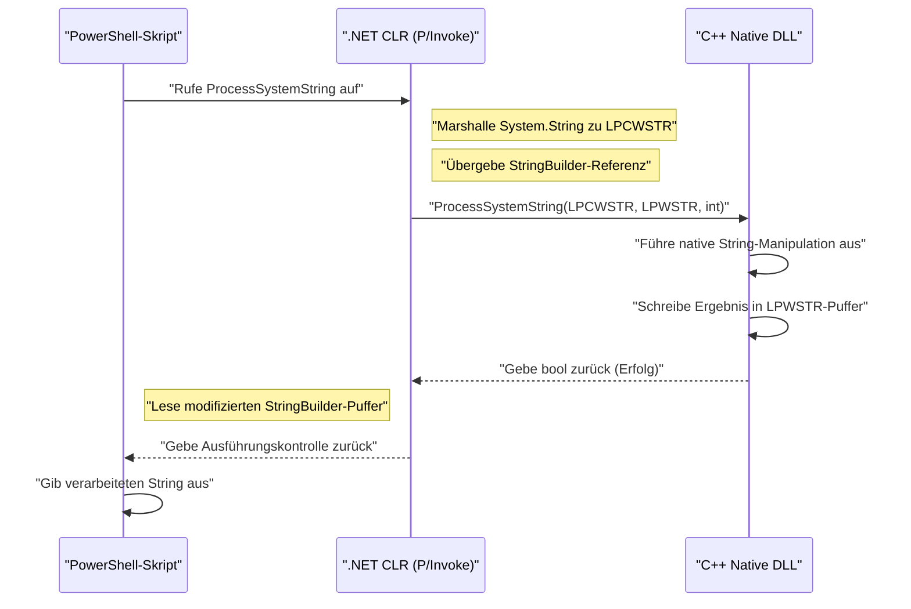
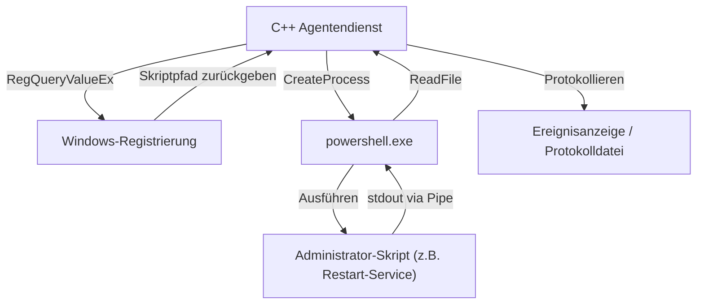

## Einführung

In der Windows-Systemverwaltung und -Automatisierung ist PowerShell zum De-facto-Standardwerkzeug geworden. Alle Aufgaben, wie die Verwaltung von Active Directory, Dateisystemoperationen und die Änderung von Netzwerkkonfigurationen, können mit Skripten beschrieben werden. Obwohl PowerShell vielseitig ist, gibt es jedoch Situationen, in denen man mit den Leistungsgrenzen kämpft, die für Skriptsprachen typisch sind, oder mit dem Zugriff auf sehr tiefgreifende Windows-APIs.

Eine leistungsstarke Lösung hierfür ist die "Integration mit C++". C++ bietet native Ausführungsgeschwindigkeit und vollständigen Zugriff auf Win32-APIs sowie COM-Objekte. Durch die Kombination von PowerShells "hoher Produktivität und Flexibilität" mit der "überwältigenden Leistung und Low-Level-Steuerung" von C++ ist es möglich, äußerst komplexe und umfangreiche Systemverwaltungsaufgaben in Unternehmensumgebungen zu optimieren.

Dieser Artikel erklärt sehr detailliert die spezifischen Architekturen und Implementierungsmethoden für die bidirektionale Integration von PowerShell und C++ sowie Best Practices für Speicherverwaltung und Zeichenfolgenkonvertierung.

## Warum PowerShell und C++ integrieren?

### 1. Überwindung von Leistungsgrenzen

PowerShell hat interpretierte, dynamisch typisierte Sprachmerkmale, die auf dem .NET Framework (oder .NET Core / .NET) ausgeführt werden. Daher können Ausführungsgeschwindigkeit und Speicherverbrauch bei der massenhaften Textverarbeitung, bei komplexen Verschlüsselungsprozessen oder bei der Analyse von Ereignisprotokollen mit Millionen von Zeilen zu Engpässen werden.

Betrachten wir ein Modell für Rechenkomplexität und Verarbeitungszeit. Wenn die Gesamtverarbeitungszeit der Aufgabe $T_{total}$ ist, können die Verarbeitungszeiten für PowerShell allein und bei Auslagerung an C++ wie folgt formuliert werden:

$$ T_{total}^{(PS)} = N \times (t_{overhead} + t_{compute}^{(PS)}) $$

$$ T_{total}^{(C++)} = t_{interop} + N \times t_{compute}^{(C++)} $$

Hier ist $N$ die Anzahl der zu verarbeitenden Elemente, $t_{overhead}$ der Overhead im Zusammenhang mit der Schleifenverarbeitung in PowerShell, $t_{compute}$ die reine Berechnungszeit pro Element und $t_{interop}$ der Overhead für den Grenzübergangsaufruf (P/Invoke etc.).

Wenn $N$ groß genug ist, gilt $t_{overhead} \gg 0$ und $t_{compute}^{(PS)} > t_{compute}^{(C++)}$. Daher sinkt die Gesamtlatenz drastisch, wenn man die Verarbeitung an C++ delegiert (auslagert), selbst wenn man den anfänglichen $t_{interop}$ bezahlen muss.

### 2. Zugriff auf native Win32-APIs

Obwohl es möglich ist, Win32-APIs über C# mit `Add-Type` auch in PowerShell allein aufzurufen, ist es äußerst schwierig, APIs mit komplexen Strukturen oder Callback-Funktionen (z. B. die Steuerung von Minifilter-Treibern, fortgeschrittene Prozessspeicher-Manipulationen) direkt in C# / PowerShell zu definieren. Durch das Erstellen einer in C++ gewrappten nativen DLL und deren Aufruf aus PowerShell wird eine typsichere und zuverlässige Systemsteuerung möglich.

## Aufrufen nativer C++ DLLs aus PowerShell

Das häufigste Integrationsmuster besteht darin, rechenintensive oder systemspezifische Prozesse als C++-DLLs zu implementieren und diese aus PowerShell-Skripten aufzurufen.

### C++ DLL-Implementierung (Win32-API und benutzerdefinierte Logik)

Zunächst erstellen wir eine C++-DLL mit Exportfunktionen, die von PowerShell aus aufgerufen werden können. Hier zeigen wir einen einfachen C++-Code, der als Beispiel Funktionen für "Ver- und Entschlüsselung von großflächigen String-Daten oder komplexe Hash-Berechnungen" annimmt.

```cpp
// NativeLib.cpp
#include <windows.h>
#include <string>

// Spezifikation von C-Bindung und __stdcall, um den P/Invoke-Aufruf zu erleichtern
extern "C" {

    __declspec(dllexport) int __stdcall ComputeHeavyTask(int multiplier, int dataSize) {
        int result = 0;
        // Simulation eines absichtlich schweren Prozesses
        for (int i = 0; i < dataSize; ++i) {
            result += (i % multiplier);
        }
        return result;
    }

    // Funktion zur Verarbeitung von Zeichenfolgen (verwendet LPWSTR für Unicode-Unterstützung)
    __declspec(dllexport) bool __stdcall ProcessSystemString(LPCWSTR inputString, LPWSTR outputBuffer, int bufferSize) {
        if (inputString == nullptr || outputBuffer == nullptr) {
            return false;
        }

        std::wstring str(inputString);
        // Irgendeine komplexe String-Verarbeitung (z. B. Hinzufügen einer Systemkennung)
        std::wstring result = L"PROCESSED_" + str;

        if (result.length() >= (size_t)bufferSize) {
            return false; // Verhindert Pufferüberlauf (Buffer Overrun)
        }

        wcscpy_s(outputBuffer, bufferSize, result.c_str());
        return true;
    }
}
```

### Speicherverwaltung und Zeichenfolgenkonvertierung (`BSTR`, `LPWSTR`)

Beim Datenaustausch zwischen C++ und PowerShell (.NET) sind die **Zeichenfolgenkodierung** und die **Speicherverwaltung** die wichtigsten Punkte, auf die man achten muss.

- **`LPCWSTR` / `LPWSTR`**: Pointer auf C/C++ Wide Strings (UTF-16LE). Sie werden standardmäßig in den `W`-Funktionen der Windows-API verwendet. Bei P/Invoke werden sie durch Angabe von `CharSet = CharSet.Unicode` automatisch in .NET `String` oder `StringBuilder` gemarshallt.
- **`BSTR`**: Wide Strings mit Längenpräfix, die in COM (Component Object Model) verwendet werden. Der Speicher muss mit `SysAllocString` und `SysFreeString` verwaltet werden. In P/Invoke wird `[MarshalAs(UnmanagedType.BStr)]` angegeben.

Wenn auf der C++-Seite neuer Speicher zugewiesen und an PowerShell zurückgegeben wird, stellt sich die Frage, wer den Speicher freigibt (Eigentümerschaft). In der obigen Funktion `ProcessSystemString` wird das Standardmuster der Win32-API angewendet: "C++ schreibt das Ergebnis in den Puffer (`outputBuffer`), den der Aufrufer (PowerShell) zuvor zugewiesen hat". Dies verhindert Speicherlecks.

### `Add-Type` und P/Invoke auf der PowerShell-Seite

Nach dem Kompilieren der C++-DLL (`NativeLib.dll`) rufen wir sie aus dem PowerShell-Skript auf. Wir verwenden `Add-Type`, um die C#-P/Invoke-Signatur dynamisch zu kompilieren und zu nutzen.

```powershell
# PowerShell Script: Invoke-NativeDLL.ps1

$signature = @'
using System;
using System.Runtime.InteropServices;
using System.Text;

public class NativeInterop
{
    // Definition der C++ ComputeHeavyTask
    [DllImport("NativeLib.dll", CallingConvention = CallingConvention.StdCall)]
    public static extern int ComputeHeavyTask(int multiplier, int dataSize);

    // Definition der C++ ProcessSystemString
    [DllImport("NativeLib.dll", CharSet = CharSet.Unicode, CallingConvention = CallingConvention.StdCall)]
    public static extern bool ProcessSystemString(string inputString, StringBuilder outputBuffer, int bufferSize);
}
'@

# Kompiliert und fügt den C#-Code in die PowerShell-Sitzung ein
Add-Type -TypeDefinition $signature -PassThru | Out-Null

# 1. Aufruf der schweren numerischen Berechnung
$result = [NativeInterop]::ComputeHeavyTask(7, 100000000)
Write-Host "Compute Task Result: $result"

# 2. Aufruf der String-Verarbeitung
$input = "SYSTEM_NODE_001"
$bufferSize = 256
# Verwendet StringBuilder als Puffer, damit C++ hineinschreiben kann
$outputBuffer = New-Object System.Text.StringBuilder -ArgumentList $bufferSize

$success = [NativeInterop]::ProcessSystemString($input, $outputBuffer, $bufferSize)

if ($success) {
    Write-Host "Processed String: $($outputBuffer.ToString())"
} else {
    Write-Host "String processing failed." -ForegroundColor Red
}
```

### Architekturvisualisierung

Das folgende Sequenzdiagramm zeigt den Aufruffluss und den Speicheraustausch vom PowerShell-Skript zur C++-DLL.



## Aufrufen von PowerShell aus C++

Jetzt betrachten wir den umgekehrten Ansatz. Es kann vorkommen, dass Sie PowerShell-Skripte dynamisch von einem in C++ geschriebenen Systemdienst oder einer Desktop-Anwendung aus ausführen und deren Ergebnisse abrufen möchten. Ein Szenario ist beispielsweise, wenn ein C++-Überwachungsagent eine bestimmte Anomalie erkennt und ein PowerShell-Wiederherstellungsskript ausführt.

Es gibt hauptsächlich zwei Ansätze:
1. **Prozessstart (`CreateProcess` / `_popen`)**: Eine Methode, bei der `powershell.exe` als unabhängiger Prozess gestartet und die Standard-Ein-/Ausgabe über eine Pipe verbunden wird.
2. **PowerShell Hosting API (über C++/CLI)**: Eine Methode, bei der die PowerShell-Laufzeitumgebung innerhalb desselben Prozesses gehostet wird.

In diesem Artikel erläutern wir die Methode mit **CreateProcess und einer Pipeline**, da diese in der Systemprogrammierung am robustesten und universellsten ist.

### Ausführung mit CreateProcess und Anonymous Pipe

Der folgende C++-Code erstellt eine anonyme Pipe (Anonymous Pipes), startet `powershell.exe` als untergeordneten Prozess zur Skriptausführung und liest das Ergebnis aus der Standardausgabe.

```cpp
#include <windows.h>
#include <iostream>
#include <string>
#include <vector>

std::string ExecutePowerShellScript(const std::string& script) {
    HANDLE hReadPipe, hWritePipe;
    SECURITY_ATTRIBUTES sa;
    sa.nLength = sizeof(SECURITY_ATTRIBUTES);
    sa.bInheritHandle = TRUE; // Pipe-Handle an den Child-Prozess vererben
    sa.lpSecurityDescriptor = NULL;

    // 1. Erstellen der Pipe
    if (!CreatePipe(&hReadPipe, &hWritePipe, &sa, 0)) {
        return "Error: CreatePipe failed.";
    }

    // 2. Festlegen der Startinformationen für den Child-Prozess (PowerShell)
    STARTUPINFOA si;
    ZeroMemory(&si, sizeof(STARTUPINFOA));
    si.cb = sizeof(STARTUPINFOA);
    si.dwFlags = STARTF_USESTDHANDLES | STARTF_USESHOWWINDOW;
    si.hStdOutput = hWritePipe;
    si.hStdError = hWritePipe;
    si.wShowWindow = SW_HIDE; // Fenster ausblenden

    PROCESS_INFORMATION pi;
    ZeroMemory(&pi, sizeof(PROCESS_INFORMATION));

    // Aufbau der Befehlszeile (Vereinfachte Version mit Bypass-Richtlinie zur Vermeidung von Base64-Kodierung etc.)
    std::string cmd = "powershell.exe -NoProfile -NonInteractive -Command \"" + script + "\"";
    std::vector<char> cmdBuffer(cmd.begin(), cmd.end());
    cmdBuffer.push_back('\0');

    // 3. Erstellen des Prozesses
    if (!CreateProcessA(NULL, cmdBuffer.data(), NULL, NULL, TRUE, 0, NULL, NULL, &si, &pi)) {
        CloseHandle(hReadPipe);
        CloseHandle(hWritePipe);
        return "Error: CreateProcess failed.";
    }

    // Auf der Parent-Prozess-Seite wird die Schreib-Pipe nicht benötigt und daher geschlossen (sonst wird Read blockiert)
    CloseHandle(hWritePipe);

    // 4. Lesen des Ergebnisses
    std::string output = "";
    DWORD bytesRead;
    char buffer[4096];

    while (ReadFile(hReadPipe, buffer, sizeof(buffer) - 1, &bytesRead, NULL) && bytesRead > 0) {
        buffer[bytesRead] = '\0';
        output += buffer;
    }

    // 5. Aufräumen (Cleanup)
    WaitForSingleObject(pi.hProcess, INFINITE);
    CloseHandle(pi.hProcess);
    CloseHandle(pi.hThread);
    CloseHandle(hReadPipe);

    return output;
}

int main() {
    // Ein Befehl zum Abrufen der Prozessliste in PowerShell, sortiert nach CPU-Auslastung absteigend
    std::string psCommand = "Get-Process | Sort-Object CPU -Descending | Select-Object -First 5 | Format-Table Name, CPU, Id";
    
    std::cout << "Executing PowerShell from C++..." << std::endl;
    std::string result = ExecutePowerShellScript(psCommand);
    
    std::cout << "Result:\n" << result << std::endl;
    return 0;
}
```

### Integration von Windows-Registrierung und PowerShell

Bei der Ausführung von Skripten aus C++ sollte das Hardcodieren von dynamischen Konfigurationswerten oder Ausführungspfaden vermieden werden. In vielen Fällen lesen C++-Anwendungen ihre Einstellungen aus der **Windows-Registrierung** (Registry).

Eine Architektur, bei der die C++-Seite `RegOpenKeyEx` und `RegQueryValueEx` verwendet, um den Pfad des PowerShell-Skripts aus `HKLM\SOFTWARE\MyApp` abzurufen und diesen als Argument an das obige `CreateProcess` zu übergeben, wird in Unternehmenssystemen bevorzugt.



## Leistungsanalyse und Vorteile des Offloadings

Warum wird eine so komplexe Architektur gewählt? Betrachten wir als konkretes Szenario die "Analyse von benutzerdefinierten IIS-Protokolldateien, die mehrere Gigabyte groß sind".

Wenn `Get-Content` in PowerShell verwendet wird, um jede Zeile einzeln mit regulären Ausdrücken zu parsen, wird durch den Overhead der Objekterstellung und der Garbage Collection (GC) eine enorme Menge an CPU-Zeit verbraucht.

Die Anzahl der Speicherzuweisungen $A$ und die Anzahl der GC-Auslöser $G$ verhalten sich bei der Skriptausführung proportional wie folgt:

$$ G \propto \sum_{i=1}^{N} A_i $$

Wenn der Prozess in nativen C++-Code ausgelagert wird, kann die gesamte Datei mit Memory-Mapping (`CreateFileMapping`, `MapViewOfFile`) direkt in den Speicher abgebildet und die Zeichenfolgensuche mithilfe von Zeigerarithmetik mittels Zero-Copy (Nullkopie) durchgeführt werden. In diesem Fall ist der Overhead für die Objekterstellung praktisch null, und das Parsen wird mit einer Geschwindigkeit abgeschlossen, die nahe der theoretischen Grenze der Speicherbandbreite liegt.

Indem nur die geparsten Ergebnisse (z. B. eine Liste von IP-Adressen für unbefugte Zugriffe) an PowerShell zurückgegeben werden, können auch die P/Invoke-Marshalling-Kosten minimiert werden.

## Praktische Automatisierungsszenarien für die Systemverwaltung

### Szenario 1: Schneller Dateisystem-Scan und Berechtigungsänderungen

Auf großen Dateiservern müssen Dateien mit bestimmten Erweiterungen und spezifischen ACLs (Access Control Lists) extrahiert und ihre Berechtigungen stapelweise geändert werden.
- **Rolle von C++**: Verwendet `FindFirstFile` / `FindNextFile` und Multithreading, um den Verzeichnisbaum extrem schnell zu durchsuchen und eine Liste von Dateipfaden zu erstellen, die den Kriterien entsprechen.
- **Rolle von PowerShell**: Verwendet `Set-Acl` für die Liste, die von C++ empfangen wurde, um Berechtigungen stapelweise anzuwenden (oder Prozesse in Verbindung mit Active Directory durchzuführen).

### Szenario 2: Erfassung spezifischer Hardwareinformationen

Überwachung von Informationen von proprietären Hardwaregeräten (z. B. speziellen PCIe-Karten oder Sensoren), die über WMI (Windows Management Instrumentation) oder CIM (Common Information Model) nicht erfasst werden können.
- **Rolle von C++**: Eine DLL, die `DeviceIoControl`-Aufrufe an Gerätetreiber durchführt, um Binärdaten abzurufen und zu analysieren.
- **Rolle von PowerShell**: Ruft die DLL regelmäßig auf, formatiert die Analyseergebnisse in JSON und sendet sie an die REST-API des Überwachungsservers.

## Best Practices für Speicherverwaltung und Fehlerbehebung

Die am häufigsten auftretenden Fehler bei der Integration sind **Speicherlecks (Memory Leaks)** und **Zugriffsverletzungen (Access Violation: 0xC0000005)**.

1. **Lebensdauer von Zeigern**: Wenn `[ref]` oder `StringBuilder` von der PowerShell-Seite übergeben werden, fixiert (pinnt) P/Invoke den Speicher nur während des Aufrufs. Die C++-Seite darf diesen Zeiger nicht in einer globalen Variablen speichern und später darauf zugreifen. Wenn asynchrone Callbacks durchgeführt werden, muss der Speicher explizit mit `GCHandle` fixiert werden.
2. **Zeigergröße in 64-Bit-Umgebungen**: Moderne Windows-Systeme basieren standardmäßig auf 64-Bit (x64). Die Zeigergröße auf der C++-Seite beträgt 8 Byte, und auf der PowerShell-Seite (.NET) muss `IntPtr` verwendet werden. Da C++ `long` in Windows 4 Byte groß ist, führt alter Code, bei dem Zeiger in `long` gecastet und übergeben werden, zu Abstürzen.
3. **Inkonsistenz bei der Zeichenfolgenkodierung**: PowerShell verwendet intern UTF-16. Wenn Sie versuchen, diese auf der C++-Seite als ANSI-Zeichenfolgen (`std::string`, `char*`) zu empfangen, treten fehlerhafte Zeichen (Mojibake) auf. Verwenden Sie immer Wide Strings (`std::wstring`, `wchar_t*`) und geben Sie auf der P/Invoke-Seite ebenfalls `CharSet = CharSet.Unicode` an.

## Zusammenfassung

Die Integration von PowerShell und C++ ist die stärkste Kombination, um die Einfachheit von Skriptsprachen mit der Leistungsfähigkeit von nativen Sprachen bei der Automatisierung der Systemverwaltung zu vereinen.

Durch den Aufruf von C++-DLLs mithilfe von P/Invoke können rechenintensive Aufgaben ausgelagert und die Ausführungszeit drastisch verkürzt werden. Umgekehrt können Entwicklungskosten erheblich gesenkt werden, indem die umfangreichen PowerShell-Systemverwaltungsmodule über Prozessstarts oder Pipelines von C++-Anwendungen aus genutzt werden.

Obwohl Vorsicht bei der Speicherverwaltung und Zeichenfolgenkonvertierung an den Grenzen geboten ist, werden Sie durch die Beherrschung der in diesem Artikel vorgestellten Architekturmuster und Implementierungstechniken in der Lage sein, fortschrittlichere und robustere Tools für die Windows-Systemverwaltung zu entwickeln.

---

*In diesem technischen Blog werden wir weiterhin tiefgreifende Themen im Zusammenhang mit internen Windows-Strukturen und fortgeschrittener Automatisierung behandeln. Wenn Sie Fragen oder Feedback haben, hinterlassen Sie bitte einen Kommentar im Kommentarbereich.*
