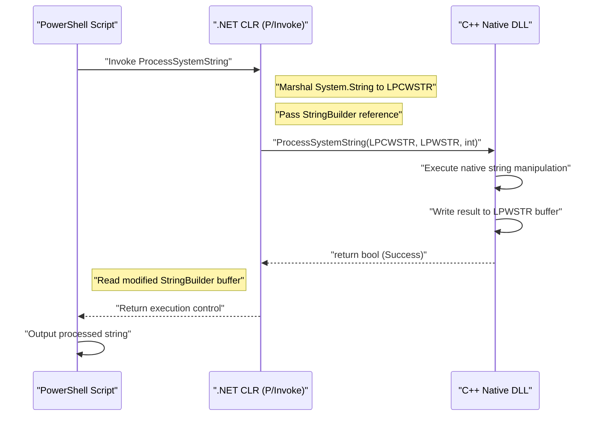
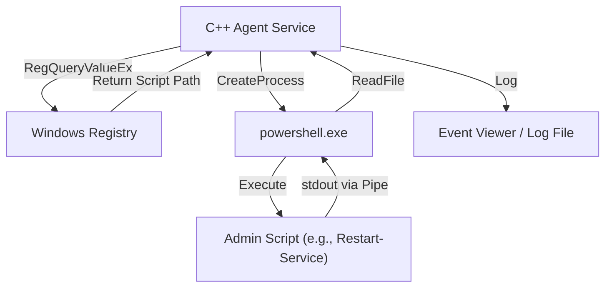

## Introduction

In Windows system administration and automation, PowerShell has become the de facto standard tool. You can script almost any task, such as managing Active Directory, manipulating the file system, or changing network configurations. However, while PowerShell is versatile, there are situations where you may struggle with the performance limitations typical of scripting languages or with accessing very low-level Windows APIs.

This is where "integration with C++" becomes a powerful solution. C++ offers native execution speed and full access to Win32 APIs and COM objects. By combining PowerShell's "high productivity and flexibility" with C++'s "overwhelming performance and low-level control", it becomes possible to optimize extremely complex and large-scale system administration tasks in enterprise environments.

In this article, we will explain in great detail the specific architectures, implementation techniques, and best practices for memory management and string conversion to integrate PowerShell and C++ bidirectionally.

## Why Integrate PowerShell and C++?

### 1. Breaking Through Performance Limits

PowerShell has interpreter-based and dynamically typed language elements running on the .NET Framework (or .NET Core / .NET). Because of this, execution speed and memory consumption can become bottlenecks when processing large amounts of text, performing complex cryptographic operations, or parsing event logs that span millions of lines.

Let's consider a model of computational complexity and processing time. Assuming the total processing time for a task is $T_{total}$, the processing time for PowerShell alone and the processing time when offloaded to C++ can be formulated as follows.

$$ T_{total}^{(PS)} = N \times (t_{overhead} + t_{compute}^{(PS)}) $$

$$ T_{total}^{(C++)} = t_{interop} + N \times t_{compute}^{(C++)} $$

Here, $N$ is the number of elements to process, $t_{overhead}$ is the overhead associated with PowerShell loop processing, $t_{compute}$ is the pure computation time per element, and $t_{interop}$ is the boundary call overhead due to P/Invoke, etc.

When $N$ is sufficiently large, since $t_{overhead} \gg 0$ and $t_{compute}^{(PS)} > t_{compute}^{(C++)}$, delegating (offloading) the processing to C++ will dramatically lower the overall latency, even if you have to pay the initial $t_{interop}$.

### 2. Access to Native Win32 APIs

Although it is possible to call Win32 APIs from PowerShell alone via C# using `Add-Type`, it is very difficult to define APIs involving complex structures or callback functions (e.g., controlling mini-filter drivers, advanced process memory manipulation) directly in C# / PowerShell. By creating a native DLL wrapped in C++ and calling it from PowerShell, type-safe and reliable system control becomes possible.

## Calling C++ Native DLLs from PowerShell

The most common integration pattern is to implement heavy processing or system-specific processing as a C++ DLL and call it from a PowerShell script.

### C++ DLL Implementation (Win32 API and Custom Logic)

First, create a C++ DLL with exported functions that can be called from PowerShell. Here, we show simple C++ code assuming "functions that perform encryption/decryption of large string data or complex hash calculations" as an example.

```cpp
// NativeLib.cpp
#include <windows.h>
#include <string>

// Specify C linkage and __stdcall for easier calling via P/Invoke
extern "C" {

    __declspec(dllexport) int __stdcall ComputeHeavyTask(int multiplier, int dataSize) {
        int result = 0;
        // Simulating intentionally heavy processing
        for (int i = 0; i < dataSize; ++i) {
            result += (i % multiplier);
        }
        return result;
    }

    // Function to process strings (using LPWSTR for Unicode support)
    __declspec(dllexport) bool __stdcall ProcessSystemString(LPCWSTR inputString, LPWSTR outputBuffer, int bufferSize) {
        if (inputString == nullptr || outputBuffer == nullptr) {
            return false;
        }

        std::wstring str(inputString);
        // Some complex string processing (e.g., adding a system identifier)
        std::wstring result = L"PROCESSED_" + str;

        if (result.length() >= (size_t)bufferSize) {
            return false; // Prevent buffer overrun
        }

        wcscpy_s(outputBuffer, bufferSize, result.c_str());
        return true;
    }
}
```

### Memory Management and String Conversion (`BSTR`, `LPWSTR`)

When exchanging data between C++ and PowerShell (.NET), the most important things to pay attention to are **string encoding** and **memory management**.

- **`LPCWSTR` / `LPWSTR`**: C/C++ wide string pointers (UTF-16LE). Standardly used in `W` variant functions of the Windows API. In P/Invoke, by specifying `CharSet = CharSet.Unicode`, they are automatically marshaled to .NET's `String` or `StringBuilder`.
- **`BSTR`**: A length-prefixed wide string used in COM (Component Object Model). Memory must be managed with `SysAllocString` and `SysFreeString`. Specify `[MarshalAs(UnmanagedType.BStr)]` in P/Invoke.

When allocating new memory on the C++ side and returning it to the PowerShell side, the issue is who will free the memory (ownership). The `ProcessSystemString` function above adopts the standard Win32 API pattern: "C++ writes the result to a buffer (`outputBuffer`) pre-allocated by the caller (PowerShell)". This prevents memory leaks.

### `Add-Type` and P/Invoke in PowerShell

Once you have compiled the C++ DLL (`NativeLib.dll`), you call it from your PowerShell script. You dynamically compile and use the C# P/Invoke signature with `Add-Type`.

```powershell
# PowerShell Script: Invoke-NativeDLL.ps1

$signature = @'
using System;
using System.Runtime.InteropServices;
using System.Text;

public class NativeInterop
{
    // Define C++ ComputeHeavyTask
    [DllImport("NativeLib.dll", CallingConvention = CallingConvention.StdCall)]
    public static extern int ComputeHeavyTask(int multiplier, int dataSize);

    // Define C++ ProcessSystemString
    [DllImport("NativeLib.dll", CharSet = CharSet.Unicode, CallingConvention = CallingConvention.StdCall)]
    public static extern bool ProcessSystemString(string inputString, StringBuilder outputBuffer, int bufferSize);
}
'@

# Compile and add the C# code to the PowerShell session
Add-Type -TypeDefinition $signature -PassThru | Out-Null

# 1. Calling the heavy numerical computation
$result = [NativeInterop]::ComputeHeavyTask(7, 100000000)
Write-Host "Compute Task Result: $result"

# 2. Calling the string processing
$input = "SYSTEM_NODE_001"
$bufferSize = 256
# Using StringBuilder as a buffer for C++ to write into
$outputBuffer = New-Object System.Text.StringBuilder -ArgumentList $bufferSize

$success = [NativeInterop]::ProcessSystemString($input, $outputBuffer, $bufferSize)

if ($success) {
    Write-Host "Processed String: $($outputBuffer.ToString())"
} else {
    Write-Host "String processing failed." -ForegroundColor Red
}
```

### Visualizing the Architecture

The sequence diagram below shows the call flow and memory exchange from PowerShell to the C++ DLL.



## Calling PowerShell from C++

Now for the reverse approach. You may want to dynamically execute a PowerShell script from a system service or desktop application written in C++ and retrieve its results. For example, a scenario where a C++ monitoring agent detects a specific anomaly and executes a PowerShell remediation script.

There are two main approaches:
1. **Process Launch (`CreateProcess` / `_popen`)**: Launching `powershell.exe` as an independent process and connecting standard input/output via pipes.
2. **PowerShell Hosting API (via C++/CLI)**: Hosting the PowerShell runtime within the same process.

In this article, we will explain the technique of **CreateProcess using pipelines**, which is the most robust and versatile in system programming.

### Execution via CreateProcess and Anonymous Pipes

The following C++ code creates Anonymous Pipes, launches `powershell.exe` as a child process to execute a script, and reads the results from standard output.

```cpp
#include <windows.h>
#include <iostream>
#include <string>
#include <vector>

std::string ExecutePowerShellScript(const std::string& script) {
    HANDLE hReadPipe, hWritePipe;
    SECURITY_ATTRIBUTES sa;
    sa.nLength = sizeof(SECURITY_ATTRIBUTES);
    sa.bInheritHandle = TRUE; // Allow pipe handles to be inherited by the child process
    sa.lpSecurityDescriptor = NULL;

    // 1. Create pipes
    if (!CreatePipe(&hReadPipe, &hWritePipe, &sa, 0)) {
        return "Error: CreatePipe failed.";
    }

    // 2. Set startup information for the child process (PowerShell)
    STARTUPINFOA si;
    ZeroMemory(&si, sizeof(STARTUPINFOA));
    si.cb = sizeof(STARTUPINFOA);
    si.dwFlags = STARTF_USESTDHANDLES | STARTF_USESHOWWINDOW;
    si.hStdOutput = hWritePipe;
    si.hStdError = hWritePipe;
    si.wShowWindow = SW_HIDE; // Hide the window

    PROCESS_INFORMATION pi;
    ZeroMemory(&pi, sizeof(PROCESS_INFORMATION));

    // Build the command line (simplified version avoiding Base64 encoding with Bypass policy)
    std::string cmd = "powershell.exe -NoProfile -NonInteractive -Command \"" + script + "\"";
    std::vector<char> cmdBuffer(cmd.begin(), cmd.end());
    cmdBuffer.push_back('\0');

    // 3. Create the process
    if (!CreateProcessA(NULL, cmdBuffer.data(), NULL, NULL, TRUE, 0, NULL, NULL, &si, &pi)) {
        CloseHandle(hReadPipe);
        CloseHandle(hWritePipe);
        return "Error: CreateProcess failed.";
    }

    // Close the write pipe in the parent process (otherwise Read will block)
    CloseHandle(hWritePipe);

    // 4. Read the results
    std::string output = "";
    DWORD bytesRead;
    char buffer[4096];

    while (ReadFile(hReadPipe, buffer, sizeof(buffer) - 1, &bytesRead, NULL) && bytesRead > 0) {
        buffer[bytesRead] = '\0';
        output += buffer;
    }

    // 5. Cleanup
    WaitForSingleObject(pi.hProcess, INFINITE);
    CloseHandle(pi.hProcess);
    CloseHandle(pi.hThread);
    CloseHandle(hReadPipe);

    return output;
}

int main() {
    // Command to get the list of processes in PowerShell and sort them by CPU usage
    std::string psCommand = "Get-Process | Sort-Object CPU -Descending | Select-Object -First 5 | Format-Table Name, CPU, Id";
    
    std::cout << "Executing PowerShell from C++..." << std::endl;
    std::string result = ExecutePowerShellScript(psCommand);
    
    std::cout << "Result:\n" << result << std::endl;
    return 0;
}
```

### Integration Between Windows Registry and PowerShell

When executing scripts from C++, hardcoding dynamic settings or execution paths should be avoided. In many cases, C++ applications read settings from the **Windows Registry**.

An architecture where the C++ side uses `RegOpenKeyEx` and `RegQueryValueEx` to retrieve the PowerShell script path from `HKLM\SOFTWARE\MyApp` and passes it as an argument to `CreateProcess` above is preferred in enterprise systems.



## Performance Analysis and Benefits of Offloading

Why adopt such a complex architecture? As a specific scenario, consider "parsing custom IIS log files spanning several gigabytes."

When parsing line by line using regular expressions with `Get-Content` in PowerShell, a massive amount of CPU time is consumed due to object creation and Garbage Collection (GC) overhead.

The number of memory allocations $A$ and the number of GC triggers $G$ are proportional to the following in script execution.

$$ G \propto \sum_{i=1}^{N} A_i $$

If you transfer the processing to native C++ code, you can use memory mapping (`CreateFileMapping`, `MapViewOfFile`) to expand the entire file directly into memory and perform string searches with zero-copy using pointer arithmetic. In this case, the overhead associated with object creation becomes effectively zero, and parsing is completed at speeds close to the theoretical limit of memory bandwidth.

By returning only the parsed results (e.g., a list of IP addresses from unauthorized accesses) to the PowerShell side, P/Invoke marshaling costs can also be minimized.

## Practical System Administration Automation Scenarios

### Scenario 1: Fast File System Scanning and Permission Modification

In a large-scale file server, a task to extract files that have a specific extension and a specific ACL (Access Control List) set, and change their permissions in bulk.
- **Role of C++**: Use `FindFirstFile` / `FindNextFile` and multithreading to traverse the directory tree extremely fast and generate a list of file paths that match the conditions.
- **Role of PowerShell**: Apply permissions in bulk using `Set-Acl` (or processing integrated with Active Directory) against the list received from C++.

### Scenario 2: Collecting Proprietary Hardware Information

Monitoring information from proprietary hardware devices (e.g., specialized PCIe cards or sensors) that cannot be retrieved via WMI (Windows Management Instrumentation) or CIM (Common Information Model).
- **Role of C++**: A DLL that makes `DeviceIoControl` calls to the device driver to retrieve and parse binary data.
- **Role of PowerShell**: Periodically call the DLL, format the parsing results into JSON, and send it to the monitoring server's REST API.

## Best Practices for Memory Management and Troubleshooting

The most common bugs that occur during integration are **memory leaks** and **Access Violations (0xC0000005)**.

1. **Pointer Lifetimes**: When passing `[ref]` or `StringBuilder` from the PowerShell side, P/Invoke pins the memory only during the call. Do not save that pointer to a global variable on the C++ side and access it later. When performing asynchronous callbacks, you must explicitly pin the memory using `GCHandle`.
2. **Pointer Sizes in 64-bit Environments**: Modern Windows is fundamentally 64-bit (x64). Pointer sizes on the C++ side are 8 bytes, so you must use `IntPtr` on the PowerShell (.NET) side. Since a C++ `long` is 4 bytes on Windows, old code that casts a pointer to a `long` and passes it will cause crashes.
3. **String Encoding Mismatches**: PowerShell uses UTF-16 internally. If you try to receive it as an ANSI string (`std::string`, `char*`) on the C++ side, garbled characters will occur. Always use wide strings (`std::wstring`, `wchar_t*`) and ensure you specify `CharSet = CharSet.Unicode` on the P/Invoke side as well.

## Conclusion

The integration of PowerShell and C++ is the most powerful combination in system administration automation, balancing the convenience of a scripting language with the power of a native language.

By calling C++ DLLs using P/Invoke, you can offload computationally intensive tasks and dramatically reduce execution times. Conversely, by utilizing PowerShell's rich system administration modules from a C++ application via process launching or pipelines, you can significantly reduce development costs.

Although careful attention is required for memory management and string conversion at the boundaries, by mastering the architectural patterns and implementation techniques introduced in this article, you will be able to build more advanced and robust Windows system administration tools.

---

*In this technical blog, we will continue to cover deep topics related to Windows internal structures and advanced automation. If you have any questions or feedback, please feel free to leave them in the comments section.*
