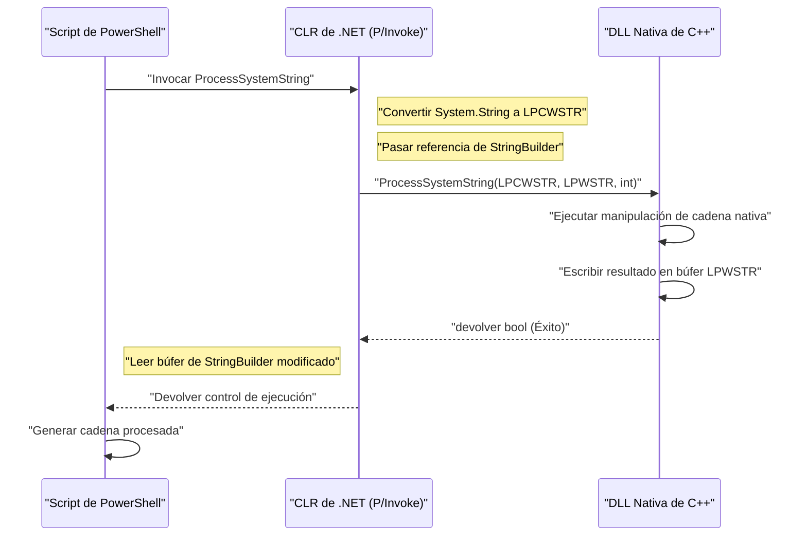
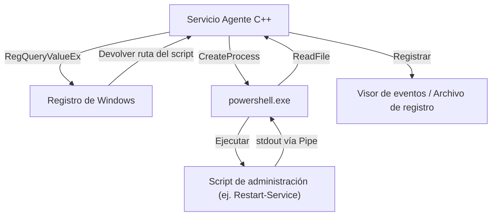

## Introducción

En la administración de sistemas y automatización de Windows, PowerShell se ha convertido en la herramienta estándar de facto. Todas las tareas, como administrar Active Directory, manipular sistemas de archivos y cambiar configuraciones de red, se pueden describir mediante scripts. Sin embargo, si bien PowerShell es versátil, existen situaciones en las que se experimentan dificultades debido a los límites de rendimiento inherentes a los lenguajes de scripting o al acceder a la API de Windows a un nivel muy bajo.

Una solución poderosa aquí es la "integración con C++". C++ ofrece velocidades de ejecución nativas y acceso completo a la API Win32 y objetos COM. Al combinar la "alta productividad y flexibilidad" de PowerShell con el "rendimiento abrumador y control de bajo nivel" de C++, es posible optimizar tareas de administración de sistemas extremadamente complejas y a gran escala en entornos empresariales.

En este artículo, explicaremos con gran detalle la arquitectura específica para la integración bidireccional entre PowerShell y C++, métodos de implementación, y las mejores prácticas para la gestión de memoria y conversión de cadenas.

## ¿Por qué integrar PowerShell y C++?

### 1. Superar los límites de rendimiento

PowerShell tiene elementos de lenguaje tipados dinámicamente y de tipo intérprete que se ejecutan sobre .NET Framework (o .NET Core / .NET). Por lo tanto, la velocidad de ejecución y el consumo de memoria pueden convertirse en cuellos de botella al procesar grandes cantidades de texto, realizar procesamientos de cifrado complejos, o analizar registros de eventos de millones de líneas.

Consideremos un modelo de complejidad computacional y tiempo de procesamiento. Si el tiempo total de procesamiento de la tarea es $T_{total}$, el tiempo de procesamiento solo con PowerShell y el tiempo de procesamiento cuando se descarga a C++ se pueden formular de la siguiente manera.

$$ T_{total}^{(PS)} = N \times (t_{overhead} + t_{compute}^{(PS)}) $$

$$ T_{total}^{(C++)} = t_{interop} + N \times t_{compute}^{(C++)} $$

Aquí, $N$ es el número de elementos a procesar, $t_{overhead}$ es la sobrecarga asociada con el procesamiento de bucles de PowerShell, $t_{compute}$ es el tiempo de cálculo puro por elemento, y $t_{interop}$ es la sobrecarga de llamada de límite debido a P/Invoke, etc.

Cuando $N$ es suficientemente grande, dado que $t_{overhead} \gg 0$ y $t_{compute}^{(PS)} > t_{compute}^{(C++)}$, delegar (descargar) el procesamiento a C++, incluso pagando el $t_{interop}$ inicial, reducirá drásticamente la latencia general.

### 2. Acceso a la API Win32 nativa

Aunque es posible llamar a la API Win32 a través de C# utilizando `Add-Type` solo con PowerShell, es muy difícil definir directamente en C# / PowerShell API que involucren estructuras y funciones de devolución de llamada complejas (ej. control de controladores de minifiltro, manipulación avanzada de memoria de procesos). Al crear una DLL nativa envuelta en C++ y llamarla desde PowerShell, se hace posible un control del sistema seguro y con tipos seguros.

## Llamar a una DLL nativa de C++ desde PowerShell

El patrón de integración más común es implementar un procesamiento pesado o específico del sistema como una DLL de C++, y llamarlo desde un script de PowerShell.

### Implementación de DLL del lado de C++ (API Win32 y lógica personalizada)

Primero, creamos una DLL de C++ que tenga una función exportada que se pueda llamar desde PowerShell. Aquí, mostramos un código C++ simple que asume una "función que cifra/descifra grandes datos de cadenas de texto o realiza cálculos de hash complejos" como ejemplo.

```cpp
// NativeLib.cpp
#include <windows.h>
#include <string>

// Especificar enlace C y __stdcall para facilitar llamadas desde P/Invoke
extern "C" {

    __declspec(dllexport) int __stdcall ComputeHeavyTask(int multiplier, int dataSize) {
        int result = 0;
        // Simulación intencional de un procesamiento pesado
        for (int i = 0; i < dataSize; ++i) {
            result += (i % multiplier);
        }
        return result;
    }

    // Función para procesar cadenas (Se usa LPWSTR para soporte Unicode)
    __declspec(dllexport) bool __stdcall ProcessSystemString(LPCWSTR inputString, LPWSTR outputBuffer, int bufferSize) {
        if (inputString == nullptr || outputBuffer == nullptr) {
            return false;
        }

        std::wstring str(inputString);
        // Algún procesamiento de cadena complejo (ej: añadir identificador de sistema)
        std::wstring result = L"PROCESSED_" + str;

        if (result.length() >= (size_t)bufferSize) {
            return false; // Prevención de desbordamiento de búfer
        }

        wcscpy_s(outputBuffer, bufferSize, result.c_str());
        return true;
    }
}
```

### Gestión de memoria y conversión de cadenas (`BSTR`, `LPWSTR`)

Al intercambiar datos entre C++ y PowerShell (.NET), lo que requiere mayor atención es la **codificación de cadenas** y la **gestión de memoria**.

- **`LPCWSTR` / `LPWSTR`**: Puntero de cadena ancha (UTF-16LE) de C/C++. Se utiliza de manera estándar en las funciones de la serie `W` de la API de Windows. En P/Invoke, al especificar `CharSet = CharSet.Unicode`, se agrupa (marshal) automáticamente con el `String` o `StringBuilder` de .NET.
- **`BSTR`**: Cadena ancha con prefijo de longitud utilizada en COM (Component Object Model). Es necesario gestionar la memoria con `SysAllocString` y `SysFreeString`. En P/Invoke, se especifica con `[MarshalAs(UnmanagedType.BStr)]`.

Cuando el lado de C++ asigna nueva memoria y la devuelve al lado de PowerShell, el problema es quién libera la memoria (propiedad). En la función `ProcessSystemString` de arriba, se adopta el patrón estándar de la API Win32: "C++ escribe el resultado en un búfer (`outputBuffer`) asignado de antemano por el que llama (PowerShell)". Esto evita fugas de memoria.

### Uso de `Add-Type` y P/Invoke en el lado de PowerShell

Después de compilar la DLL de C++ (`NativeLib.dll`), la llamamos desde el script de PowerShell. Compilamos y usamos dinámicamente la firma P/Invoke de C# mediante `Add-Type`.

```powershell
# PowerShell Script: Invoke-NativeDLL.ps1

$signature = @'
using System;
using System.Runtime.InteropServices;
using System.Text;

public class NativeInterop
{
    // Definir ComputeHeavyTask de C++
    [DllImport("NativeLib.dll", CallingConvention = CallingConvention.StdCall)]
    public static extern int ComputeHeavyTask(int multiplier, int dataSize);

    // Definir ProcessSystemString de C++
    [DllImport("NativeLib.dll", CharSet = CharSet.Unicode, CallingConvention = CallingConvention.StdCall)]
    public static extern bool ProcessSystemString(string inputString, StringBuilder outputBuffer, int bufferSize);
}
'@

# Compilar y añadir el código C# a la sesión de PowerShell
Add-Type -TypeDefinition $signature -PassThru | Out-Null

# 1. Llamada al cálculo numérico pesado
$result = [NativeInterop]::ComputeHeavyTask(7, 100000000)
Write-Host "Resultado de la tarea computacional: $result"

# 2. Llamada al procesamiento de cadenas
$input = "SYSTEM_NODE_001"
$bufferSize = 256
# Usar StringBuilder como búfer para permitir la escritura desde el lado de C++
$outputBuffer = New-Object System.Text.StringBuilder -ArgumentList $bufferSize

$success = [NativeInterop]::ProcessSystemString($input, $outputBuffer, $bufferSize)

if ($success) {
    Write-Host "Cadena procesada: $($outputBuffer.ToString())"
} else {
    Write-Host "El procesamiento de la cadena falló." -ForegroundColor Red
}
```

### Visualización de la arquitectura

El siguiente diagrama de secuencia muestra el flujo de llamadas y el intercambio de memoria desde PowerShell a la DLL de C++.



## Llamar a PowerShell desde C++

Ahora veamos el enfoque inverso. Puede haber casos en los que desee ejecutar dinámicamente un script de PowerShell desde un servicio de sistema o aplicación de escritorio creada en C++, y obtener el resultado. Por ejemplo, en un escenario donde un agente de monitoreo en C++ ejecuta un script de reparación en PowerShell cuando detecta una anomalía específica.

Existen principalmente dos enfoques:
1. **Inicio de proceso (`CreateProcess` / `_popen`)**: Método para iniciar `powershell.exe` como un proceso independiente y conectar la entrada/salida estándar con tuberías (pipes).
2. **API de alojamiento de PowerShell (PowerShell Hosting API a través de C++/CLI)**: Método para alojar el tiempo de ejecución (runtime) de PowerShell dentro del mismo proceso.

En este artículo, explicaremos el método de **CreateProcess usando tuberías (pipes)**, que es el más robusto y versátil en la programación de sistemas.

### Ejecución mediante CreateProcess y tuberías anónimas

El siguiente código C++ crea tuberías anónimas (Anonymous Pipes), inicia `powershell.exe` como un proceso hijo para ejecutar un script, y lee el resultado desde la salida estándar.

```cpp
#include <windows.h>
#include <iostream>
#include <string>
#include <vector>

std::string ExecutePowerShellScript(const std::string& script) {
    HANDLE hReadPipe, hWritePipe;
    SECURITY_ATTRIBUTES sa;
    sa.nLength = sizeof(SECURITY_ATTRIBUTES);
    sa.bInheritHandle = TRUE; // Permitir que el proceso hijo herede los identificadores (handles) del pipe
    sa.lpSecurityDescriptor = NULL;

    // 1. Creación del pipe (tubería)
    if (!CreatePipe(&hReadPipe, &hWritePipe, &sa, 0)) {
        return "Error: Falló CreatePipe.";
    }

    // 2. Configuración de la información de inicio del proceso hijo (PowerShell)
    STARTUPINFOA si;
    ZeroMemory(&si, sizeof(STARTUPINFOA));
    si.cb = sizeof(STARTUPINFOA);
    si.dwFlags = STARTF_USESTDHANDLES | STARTF_USESHOWWINDOW;
    si.hStdOutput = hWritePipe;
    si.hStdError = hWritePipe;
    si.wShowWindow = SW_HIDE; // Ocultar la ventana

    PROCESS_INFORMATION pi;
    ZeroMemory(&pi, sizeof(PROCESS_INFORMATION));

    // Construcción de la línea de comandos (versión simplificada que evita la codificación Base64 con la política Bypass)
    std::string cmd = "powershell.exe -NoProfile -NonInteractive -Command \"" + script + "\"";
    std::vector<char> cmdBuffer(cmd.begin(), cmd.end());
    cmdBuffer.push_back('\0');

    // 3. Creación del proceso
    if (!CreateProcessA(NULL, cmdBuffer.data(), NULL, NULL, TRUE, 0, NULL, NULL, &si, &pi)) {
        CloseHandle(hReadPipe);
        CloseHandle(hWritePipe);
        return "Error: Falló CreateProcess.";
    }

    // El proceso padre no necesita el pipe de escritura, así que se cierra (si no se cierra, la lectura se bloqueará)
    CloseHandle(hWritePipe);

    // 4. Lectura de los resultados
    std::string output = "";
    DWORD bytesRead;
    char buffer[4096];

    while (ReadFile(hReadPipe, buffer, sizeof(buffer) - 1, &bytesRead, NULL) && bytesRead > 0) {
        buffer[bytesRead] = '\0';
        output += buffer;
    }

    // 5. Limpieza
    WaitForSingleObject(pi.hProcess, INFINITE);
    CloseHandle(pi.hProcess);
    CloseHandle(pi.hThread);
    CloseHandle(hReadPipe);

    return output;
}

int main() {
    // Comando para obtener la lista de procesos con PowerShell y ordenarlos por uso de CPU
    std::string psCommand = "Get-Process | Sort-Object CPU -Descending | Select-Object -First 5 | Format-Table Name, CPU, Id";
    
    std::cout << "Ejecutando PowerShell desde C++..." << std::endl;
    std::string result = ExecutePowerShellScript(psCommand);
    
    std::cout << "Resultado:\n" << result << std::endl;
    return 0;
}
```

### Integración de PowerShell con el Registro de Windows

Al ejecutar scripts desde C++, se debe evitar codificar rígidamente (hardcode) valores de configuración o rutas de ejecución dinámicas. En muchos casos, las aplicaciones C++ leen la configuración del **Registro de Windows**.

Una arquitectura preferida en sistemas empresariales es aquella donde la parte C++ utiliza `RegOpenKeyEx` y `RegQueryValueEx` para obtener la ruta del script de PowerShell desde `HKLM\SOFTWARE\MyApp`, y la pasa como argumento al `CreateProcess` mencionado anteriormente.



## Ventajas del análisis de rendimiento y descarga de procesamiento

¿Por qué adoptar una arquitectura tan compleja? Consideremos como escenario específico: "Análisis de archivos de registro personalizados de IIS de varios gigabytes".

Si se utiliza `Get-Content` en PowerShell y se analiza línea por línea con expresiones regulares, se consumirá una gran cantidad de tiempo de CPU debido a la creación de objetos y a la sobrecarga del recolector de basura (GC).

El número de asignaciones de memoria $A$ y el número de activaciones del GC $G$ son proporcionales en la ejecución del script de la siguiente manera:

$$ G \propto \sum_{i=1}^{N} A_i $$

Si el procesamiento se transfiere a código nativo en C++, se puede usar el mapeo de memoria (`CreateFileMapping`, `MapViewOfFile`) para expandir el archivo completo directamente en la memoria y realizar la búsqueda de cadenas de texto sin copia (zero-copy) mediante operaciones de puntero. En este caso, la sobrecarga asociada a la creación de objetos es virtualmente nula y el análisis se completa a una velocidad cercana al límite teórico del ancho de banda de memoria.

Al devolver al lado de PowerShell solo los resultados analizados (por ejemplo, una lista de direcciones IP de accesos no autorizados), el costo de conversión (marshalling) de P/Invoke también se puede mantener al mínimo.

## Escenarios prácticos de automatización de administración de sistemas

### Escenario 1: Escaneo de sistema de archivos de alta velocidad y cambio de permisos

En un servidor de archivos a gran escala, la tarea consiste en extraer los archivos que tienen una extensión específica y una ACL (Lista de Control de Acceso) específica establecida, y cambiar sus permisos en masa.
- **Rol de C++**: Atravesar el árbol de directorios de manera ultrarrápida utilizando `FindFirstFile` / `FindNextFile` y subprocesos múltiples (multithreading) para generar una lista de rutas de archivos que coincidan con las condiciones.
- **Rol de PowerShell**: Aplicar los permisos de una sola vez usando `Set-Acl` (o mediante un procesamiento vinculado con Active Directory) a la lista recibida desde C++.

### Escenario 2: Recopilación de información de hardware personalizada

Monitorizar la información de un dispositivo de hardware exclusivo (ej. una tarjeta PCIe o sensor especial) que no se puede obtener mediante WMI (Windows Management Instrumentation) o CIM (Common Information Model).
- **Rol de C++**: Una DLL que realiza llamadas a `DeviceIoControl` al controlador del dispositivo para obtener y analizar datos binarios.
- **Rol de PowerShell**: Llamar a la DLL de forma periódica, formatear los resultados del análisis en JSON y enviarlos a la API REST del servidor de monitoreo.

## Mejores prácticas de gestión de memoria y solución de problemas

Los errores (bugs) más frecuentes que ocurren durante la integración son las **fugas de memoria** y las **infracciones de acceso (Access Violation: 0xC0000005)**.

1. **Tiempo de validez del puntero**: Al pasar `[ref]` o `StringBuilder` en el lado de PowerShell, P/Invoke fija (pin) esa memoria solo durante la llamada. No debe almacenar ese puntero en una variable global en el lado de C++ e intentar acceder a él más tarde. Al realizar retrollamadas (callbacks) asíncronas, debe fijar la memoria explícitamente utilizando `GCHandle`.
2. **Tamaño del puntero en un entorno de 64 bits**: Las versiones modernas de Windows se basan en 64 bits (x64). El tamaño de un puntero en C++ es de 8 bytes y se debe usar `IntPtr` en el lado de PowerShell (.NET). Como `long` en C++ tiene 4 bytes en Windows, código antiguo que pasa un puntero convirtiéndolo a `long` provocará que la aplicación se bloquee.
3. **Incompatibilidad de codificación de cadenas**: PowerShell utiliza UTF-16 internamente. Si intenta recibirlo como una cadena ANSI (`std::string`, `char*`) en el lado de C++, los caracteres se distorsionarán (mojibake). Asegúrese siempre de usar cadenas anchas (`std::wstring`, `wchar_t*`) y de especificar también `CharSet = CharSet.Unicode` en el lado de P/Invoke.

## Resumen

La integración entre PowerShell y C++ es la combinación más sólida para la automatización de la administración de sistemas, combinando la simplicidad de un lenguaje de scripting y el poder de un lenguaje nativo.

Al usar P/Invoke para llamar a una DLL de C++, se pueden descargar las tareas con una alta carga computacional y reducir drásticamente el tiempo de ejecución. Por el contrario, al aprovechar los ricos módulos de administración de sistemas de PowerShell a través de la iniciación de procesos o tuberías (pipelines) desde aplicaciones C++, se pueden reducir de manera significativa los costos de desarrollo.

Aunque es necesario prestar atención a la gestión de memoria y la conversión de cadenas en los límites, al dominar los patrones de arquitectura y las técnicas de implementación presentados en este artículo, podrá construir herramientas de administración de sistemas de Windows más avanzadas y robustas.

---

*En este blog técnico, continuaremos cubriendo temas profundos sobre la estructura interna de Windows y la automatización avanzada en el futuro. Si tiene alguna pregunta o comentario, déjenos un mensaje en la sección de comentarios.*
