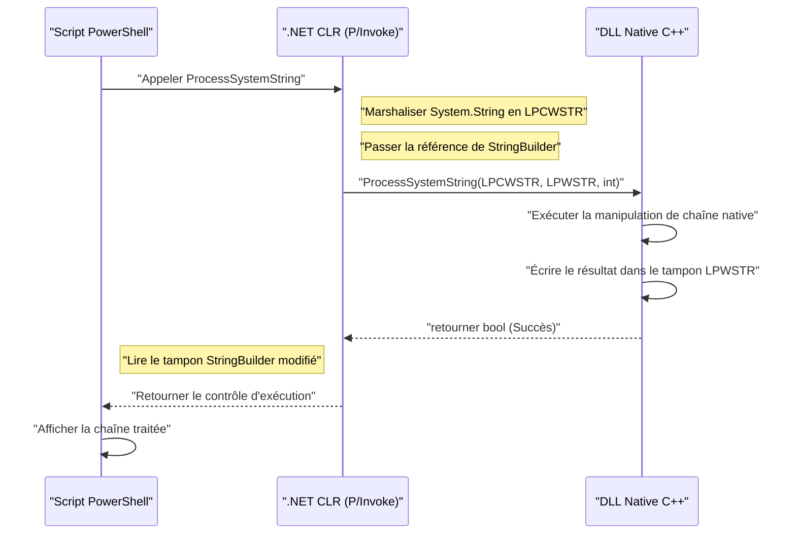
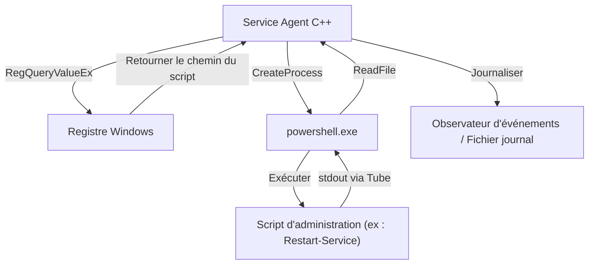

## Introduction

Dans l'administration et l'automatisation des systèmes Windows, PowerShell est devenu l'outil standard de facto. Vous pouvez écrire des scripts pour toutes sortes de tâches telles que la gestion d'Active Directory, les opérations sur le système de fichiers et la modification des configurations réseau. Cependant, bien que PowerShell soit polyvalent, il existe des situations où vous pouvez être confronté aux limites de performances inhérentes aux langages de script ou rencontrer des difficultés pour accéder aux API Windows de très bas niveau.

Une solution puissante à ce problème est « l'intégration avec C++ ». C++ offre une vitesse d'exécution native et un accès complet à l'API Win32 et aux objets COM. En combinant la « productivité et flexibilité élevées » de PowerShell avec les « performances écrasantes et le contrôle de bas niveau » de C++, il devient possible d'optimiser des tâches d'administration système extrêmement complexes et à grande échelle dans des environnements d'entreprise.

Cet article explique très en détail l'architecture spécifique, les méthodes d'implémentation et les meilleures pratiques de gestion de la mémoire et de conversion de chaînes de caractères pour une intégration bidirectionnelle entre PowerShell et C++.

## Pourquoi intégrer PowerShell et C++ ?

### 1. Dépasser les limites de performances

PowerShell possède des éléments de langage interprété et à typage dynamique exécutés sur le .NET Framework (ou .NET Core / .NET). Par conséquent, lors du traitement massif de texte, du chiffrement complexe ou de l'analyse de journaux d'événements comptant des millions de lignes, la vitesse d'exécution et la consommation de mémoire peuvent devenir des goulots d'étranglement.

Considérons un modèle de complexité de calcul et de temps de traitement. Si le temps de traitement total de la tâche est $T_{total}$, le temps de traitement avec PowerShell seul et le temps de traitement lorsqu'il est déchargé sur C++ peuvent être formulés comme suit :

$$ T_{total}^{(PS)} = N \times (t_{overhead} + t_{compute}^{(PS)}) $$

$$ T_{total}^{(C++)} = t_{interop} + N \times t_{compute}^{(C++)} $$

Ici, $N$ est le nombre d'éléments à traiter, $t_{overhead}$ est la surcharge associée au traitement des boucles de PowerShell, $t_{compute}$ est le temps de calcul pur par élément, et $t_{interop}$ est la surcharge des appels aux limites via P/Invoke, etc.

Lorsque $N$ est suffisamment grand, puisque $t_{overhead} \gg 0$ et $t_{compute}^{(PS)} > t_{compute}^{(C++)}$, il est bien plus efficace de déléguer (décharger) le traitement à C++, même en payant le $t_{interop}$ initial, car la latence globale diminuera considérablement.

### 2. Accès à l'API native Win32

Bien qu'il soit possible d'appeler l'API Win32 via C# en utilisant `Add-Type` dans PowerShell, il est extrêmement difficile de définir directement en C# / PowerShell des API impliquant des structures complexes ou des fonctions de rappel (ex : contrôle du pilote de mini-filtre, opérations avancées sur la mémoire des processus). En créant une DLL native enveloppée en C++ et en l'appelant depuis PowerShell, un contrôle système sûr et sécurisé quant au typage devient possible.

## Appeler une DLL native C++ depuis PowerShell

Le modèle d'intégration le plus courant consiste à implémenter des traitements lourds ou spécifiques au système sous forme de DLL C++, puis à les appeler depuis un script PowerShell.

### Implémentation de la DLL côté C++ (API Win32 et logique personnalisée)

Tout d'abord, créez une DLL C++ avec des fonctions exportées pouvant être appelées depuis PowerShell. Voici un code C++ simple en guise d'exemple, supposant une "fonction effectuant un chiffrement/déchiffrement de données textuelles à grande échelle ou un calcul de hachage complexe".

```cpp
// NativeLib.cpp
#include <windows.h>
#include <string>

// Spécifier le chaînage C et __stdcall pour faciliter l'appel via P/Invoke
extern "C" {

    __declspec(dllexport) int __stdcall ComputeHeavyTask(int multiplier, int dataSize) {
        int result = 0;
        // Simulation intentionnelle d'un traitement lourd
        for (int i = 0; i < dataSize; ++i) {
            result += (i % multiplier);
        }
        return result;
    }

    // Fonction traitant les chaînes de caractères (utilisation de LPWSTR pour la compatibilité Unicode)
    __declspec(dllexport) bool __stdcall ProcessSystemString(LPCWSTR inputString, LPWSTR outputBuffer, int bufferSize) {
        if (inputString == nullptr || outputBuffer == nullptr) {
            return false;
        }

        std::wstring str(inputString);
        // Traitement complexe de la chaîne (ex : ajout d'un identifiant système)
        std::wstring result = L"PROCESSED_" + str;

        if (result.length() >= (size_t)bufferSize) {
            return false; // Prévention des dépassements de tampon
        }

        wcscpy_s(outputBuffer, bufferSize, result.c_str());
        return true;
    }
}
```

### Gestion de la mémoire et conversion de chaînes (`BSTR`, `LPWSTR`)

Lors de l'échange de données entre C++ et PowerShell (.NET), les points les plus importants à surveiller sont l'**encodage des chaînes** et la **gestion de la mémoire**.

- **`LPCWSTR` / `LPWSTR`** : Pointeur de chaîne large C/C++ (UTF-16LE). Couramment utilisé dans les fonctions de la série `W` de l'API Windows. Dans P/Invoke, en spécifiant `CharSet = CharSet.Unicode`, il sera automatiquement marshalisé avec `String` et `StringBuilder` de .NET.
- **`BSTR`** : Chaîne large préfixée par sa longueur utilisée dans COM (Component Object Model). La mémoire doit être gérée via `SysAllocString` et `SysFreeString`. Dans P/Invoke, vous spécifiez `[MarshalAs(UnmanagedType.BStr)]`.

Lorsque vous allouez de la nouvelle mémoire côté C++ et que vous la renvoyez à PowerShell, la question de savoir qui libère la mémoire (propriété) se pose. La fonction `ProcessSystemString` ci-dessus adopte le modèle standard de l'API Win32 selon lequel "le C++ écrit le résultat dans un tampon (`outputBuffer`) alloué au préalable par l'appelant (PowerShell)". Cela permet de prévenir les fuites de mémoire.

### `Add-Type` et P/Invoke côté PowerShell

Une fois la DLL C++ (`NativeLib.dll`) compilée, appelez-la depuis un script PowerShell. Vous compilez et utilisez dynamiquement la signature P/Invoke C# via `Add-Type`.

```powershell
# PowerShell Script: Invoke-NativeDLL.ps1

$signature = @'
using System;
using System.Runtime.InteropServices;
using System.Text;

public class NativeInterop
{
    // Définition de ComputeHeavyTask en C++
    [DllImport("NativeLib.dll", CallingConvention = CallingConvention.StdCall)]
    public static extern int ComputeHeavyTask(int multiplier, int dataSize);

    // Définition de ProcessSystemString en C++
    [DllImport("NativeLib.dll", CharSet = CharSet.Unicode, CallingConvention = CallingConvention.StdCall)]
    public static extern bool ProcessSystemString(string inputString, StringBuilder outputBuffer, int bufferSize);
}
'@

# Compilation et ajout du code C# à la session PowerShell
Add-Type -TypeDefinition $signature -PassThru | Out-Null

# 1. Appel du calcul numérique lourd
$result = [NativeInterop]::ComputeHeavyTask(7, 100000000)
Write-Host "Compute Task Result: $result"

# 2. Appel du traitement de chaîne
$input = "SYSTEM_NODE_001"
$bufferSize = 256
# Utilisation de StringBuilder comme tampon pour l'écriture côté C++
$outputBuffer = New-Object System.Text.StringBuilder -ArgumentList $bufferSize

$success = [NativeInterop]::ProcessSystemString($input, $outputBuffer, $bufferSize)

if ($success) {
    Write-Host "Processed String: $($outputBuffer.ToString())"
} else {
    Write-Host "String processing failed." -ForegroundColor Red
}
```

### Visualisation de l'architecture

Le diagramme de séquence suivant illustre le flux d'appels et l'échange de mémoire entre le script PowerShell et la DLL C++.



## Appeler PowerShell depuis C++

Maintenant, l'approche inverse. Il existe des cas où vous souhaitez exécuter dynamiquement des scripts PowerShell à partir de services système ou d'applications de bureau créés en C++ et obtenir leurs résultats. Par exemple, un scénario dans lequel un agent de surveillance en C++ exécute un script de réparation PowerShell lorsqu'il détecte une anomalie spécifique.

Il y a principalement deux approches :
1. **Lancement de processus (`CreateProcess` / `_popen`)** : Démarrer `powershell.exe` comme un processus indépendant et connecter les entrées/sorties standard par un tube (pipe).
2. **API d'hébergement PowerShell (via C++/CLI)** : Héberger l'environnement d'exécution PowerShell au sein du même processus.

Cet article décrit la méthode de **CreateProcess avec un pipeline**, qui est la plus robuste et polyvalente dans la programmation système.

### Exécution avec CreateProcess et les tubes anonymes (Anonymous Pipes)

Le code C++ suivant crée des tubes anonymes, lance `powershell.exe` comme processus enfant pour exécuter le script, et lit le résultat depuis la sortie standard.

```cpp
#include <windows.h>
#include <iostream>
#include <string>
#include <vector>

std::string ExecutePowerShellScript(const std::string& script) {
    HANDLE hReadPipe, hWritePipe;
    SECURITY_ATTRIBUTES sa;
    sa.nLength = sizeof(SECURITY_ATTRIBUTES);
    sa.bInheritHandle = TRUE; // Permettre l'héritage du handle du tube par le processus enfant
    sa.lpSecurityDescriptor = NULL;

    // 1. Création du tube
    if (!CreatePipe(&hReadPipe, &hWritePipe, &sa, 0)) {
        return "Error: CreatePipe failed.";
    }

    // 2. Configuration des informations de démarrage du processus enfant (PowerShell)
    STARTUPINFOA si;
    ZeroMemory(&si, sizeof(STARTUPINFOA));
    si.cb = sizeof(STARTUPINFOA);
    si.dwFlags = STARTF_USESTDHANDLES | STARTF_USESHOWWINDOW;
    si.hStdOutput = hWritePipe;
    si.hStdError = hWritePipe;
    si.wShowWindow = SW_HIDE; // Masquer la fenêtre

    PROCESS_INFORMATION pi;
    ZeroMemory(&pi, sizeof(PROCESS_INFORMATION));

    // Construction de la ligne de commande (Version simplifiée évitant l'encodage Base64 avec la stratégie Bypass)
    std::string cmd = "powershell.exe -NoProfile -NonInteractive -Command \"" + script + "\"";
    std::vector<char> cmdBuffer(cmd.begin(), cmd.end());
    cmdBuffer.push_back('\0');

    // 3. Création du processus
    if (!CreateProcessA(NULL, cmdBuffer.data(), NULL, NULL, TRUE, 0, NULL, NULL, &si, &pi)) {
        CloseHandle(hReadPipe);
        CloseHandle(hWritePipe);
        return "Error: CreateProcess failed.";
    }

    // Le tube d'écriture n'est pas nécessaire du côté du processus parent, nous le fermons donc (sinon Read sera bloqué)
    CloseHandle(hWritePipe);

    // 4. Lecture des résultats
    std::string output = "";
    DWORD bytesRead;
    char buffer[4096];

    while (ReadFile(hReadPipe, buffer, sizeof(buffer) - 1, &bytesRead, NULL) && bytesRead > 0) {
        buffer[bytesRead] = '\0';
        output += buffer;
    }

    // 5. Nettoyage
    WaitForSingleObject(pi.hProcess, INFINITE);
    CloseHandle(pi.hProcess);
    CloseHandle(pi.hThread);
    CloseHandle(hReadPipe);

    return output;
}

int main() {
    // Commande PowerShell pour obtenir la liste des processus et les trier par utilisation du CPU
    std::string psCommand = "Get-Process | Sort-Object CPU -Descending | Select-Object -First 5 | Format-Table Name, CPU, Id";
    
    std::cout << "Executing PowerShell from C++..." << std::endl;
    std::string result = ExecutePowerShellScript(psCommand);
    
    std::cout << "Result:\n" << result << std::endl;
    return 0;
}
```

### Intégration du registre Windows et de PowerShell

Lors de l'exécution de scripts depuis C++, il faut éviter de coder en dur les valeurs de configuration dynamiques ou les chemins d'exécution. Dans la plupart des cas, les applications C++ lisent la configuration depuis le **registre Windows**.

Dans les systèmes d'entreprise, on préfère une architecture où le côté C++ utilise `RegOpenKeyEx` et `RegQueryValueEx` pour récupérer le chemin du script PowerShell depuis `HKLM\SOFTWARE\MyApp`, et le transmet en tant qu'argument au `CreateProcess` ci-dessus.



## Analyse des performances et avantages du déchargement (offloading)

Pourquoi adopter une architecture aussi complexe ? Comme scénario spécifique, considérons « l'analyse de journaux IIS personnalisés de plusieurs gigaoctets ».

En utilisant `Get-Content` dans PowerShell et en analysant ligne par ligne avec des expressions régulières, une quantité massive de temps CPU est consommée en raison de la surcharge liée à la création d'objets et au ramasse-miettes (Garbage Collection, GC).

Le nombre d'allocations de mémoire $A$ et le nombre de déclenchements du GC $G$ sont proportionnels à l'exécution du script comme suit :

$$ G \propto \sum_{i=1}^{N} A_i $$

Lorsque le traitement est transféré au code natif C++, il est possible d'utiliser le mappage de mémoire (`CreateFileMapping`, `MapViewOfFile`) pour déployer l'intégralité du fichier directement en mémoire, et d'effectuer des recherches de chaînes sans copie (Zero-copy) via l'arithmétique des pointeurs. Dans ce cas, la surcharge associée à la création d'objets devient pratiquement nulle, et l'analyse s'achève à une vitesse proche de la limite théorique de la bande passante de la mémoire.

En ne renvoyant que les résultats de l'analyse (ex : liste des adresses IP aux accès non autorisés) côté PowerShell, le coût de marshaling de P/Invoke peut également être minimisé.

## Scénarios pratiques d'automatisation de l'administration système

### Scénario 1 : Analyse rapide du système de fichiers et modification des autorisations

Sur un serveur de fichiers à grande échelle, tâche consistant à extraire les fichiers avec une extension spécifique et pour lesquels une liste de contrôle d'accès (ACL) particulière est définie, puis à modifier les autorisations par lots.
- **Rôle de C++** : Traverser l'arborescence des répertoires de manière ultra-rapide en utilisant `FindFirstFile` / `FindNextFile` et le multi-threading, et générer une liste de chemins de fichiers correspondant aux conditions.
- **Rôle de PowerShell** : Pour la liste reçue de C++, appliquer les autorisations par lots (ou un traitement lié à Active Directory) en utilisant `Set-Acl`.

### Scénario 2 : Collecte d'informations matérielles personnalisées

Surveiller les informations de périphériques matériels propriétaires (ex : cartes PCIe spéciales ou capteurs) qui ne peuvent pas être acquises via WMI (Windows Management Instrumentation) ou CIM (Common Information Model).
- **Rôle de C++** : Une DLL qui effectue un appel `DeviceIoControl` vers le pilote du périphérique pour récupérer et analyser les données binaires.
- **Rôle de PowerShell** : Appeler régulièrement la DLL, formater les résultats de l'analyse en JSON et les envoyer à l'API REST du serveur de surveillance.

## Meilleures pratiques pour la gestion de la mémoire et le dépannage

Les bogues les plus fréquemment rencontrés lors de l'intégration sont les **fuites de mémoire** et les **violations d'accès (Access Violation: 0xC0000005)**.

1. **Durée de vie des pointeurs** : Lors de la transmission de `[ref]` ou `StringBuilder` côté PowerShell, P/Invoke fixe (Pin) cette mémoire uniquement pendant l'appel. Vous ne devez pas enregistrer ce pointeur dans une variable globale côté C++ pour y accéder ultérieurement. Si vous effectuez un rappel (callback) asynchrone, vous devez fixer explicitement la mémoire à l'aide de `GCHandle`.
2. **Taille de pointeur dans les environnements 64 bits** : Le Windows moderne est fondamentalement en 64 bits (x64). La taille du pointeur côté C++ est de 8 octets et vous devez utiliser `IntPtr` côté PowerShell (.NET). Étant donné que `long` en C++ fait 4 octets sous Windows, un ancien code qui convertit (cast) un pointeur en `long` pour le transmettre entraînera un plantage.
3. **Inadéquation de l'encodage des chaînes** : PowerShell utilise l'UTF-16 en interne. Si vous essayez de les recevoir sous forme de chaînes ANSI (`std::string`, `char*`) côté C++, les caractères seront déformés. Assurez-vous d'utiliser des chaînes larges (`std::wstring`, `wchar_t*`) et spécifiez `CharSet = CharSet.Unicode` également côté P/Invoke.

## Conclusion

L'intégration de PowerShell et C++ est la combinaison ultime qui allie la commodité d'un langage de script à la puissance d'un langage natif pour automatiser l'administration du système.

En appelant une DLL C++ à l'aide de P/Invoke, vous pouvez décharger les tâches gourmandes en calcul et réduire considérablement le temps d'exécution. À l'inverse, l'exploitation des riches modules d'administration système de PowerShell par le biais du lancement de processus ou de pipelines à partir d'applications C++ permet de réduire significativement les coûts de développement.

Bien qu'il faille prêter attention à la gestion de la mémoire et à la conversion des chaînes aux frontières des langages, la maîtrise des modèles architecturaux et des techniques d'implémentation présentés dans cet article vous permettra de concevoir des outils d'administration système Windows plus avancés et plus robustes.

---

*Sur ce blog technique, nous continuerons à aborder des sujets approfondis concernant l'architecture interne de Windows et l'automatisation avancée. Si vous avez des questions ou des commentaires, n'hésitez pas à les laisser dans la section des commentaires.*
