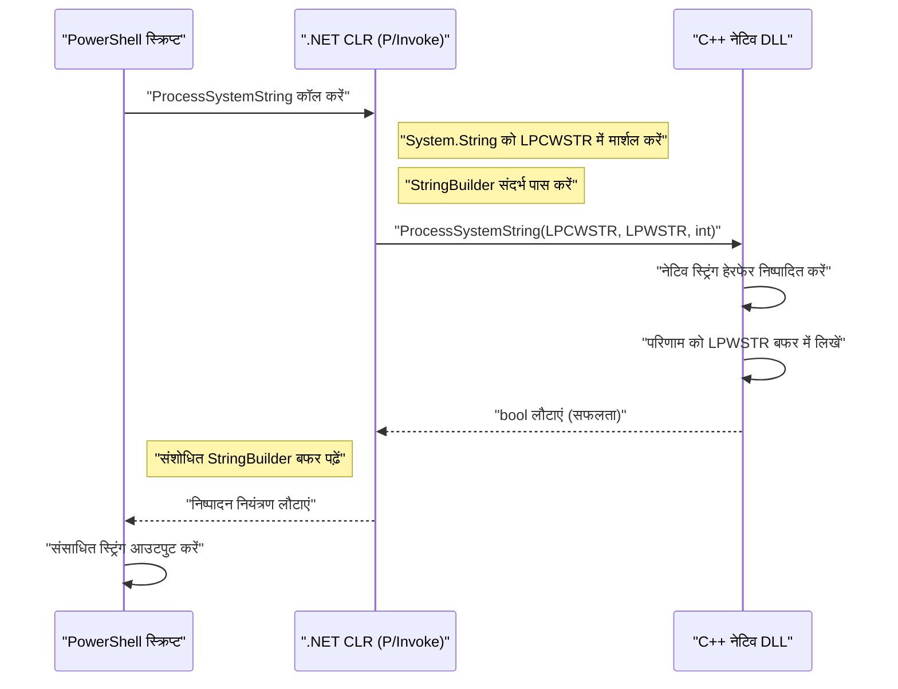
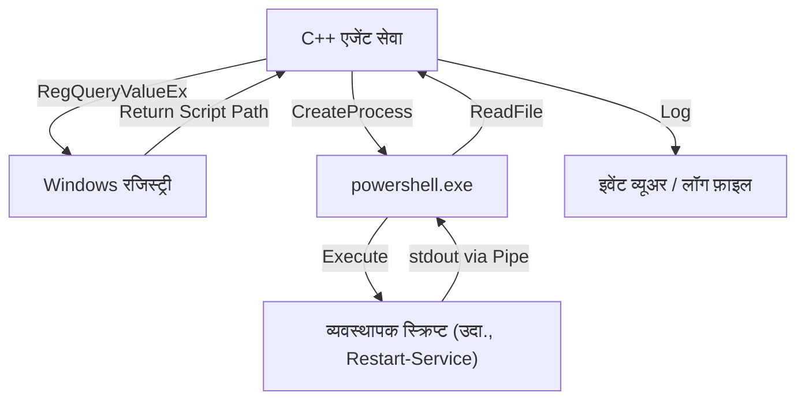

## परिचय

Windows सिस्टम प्रबंधन और स्वचालन (automation) में, PowerShell एक वास्तविक मानक उपकरण (de facto standard tool) बन गया है। Active Directory का प्रबंधन, फ़ाइल सिस्टम का संचालन, नेटवर्क कॉन्फ़िगरेशन में बदलाव आदि जैसे हर कार्य को स्क्रिप्ट द्वारा लिखा जा सकता है। हालाँकि, जहाँ PowerShell सर्वशक्तिमान है, वहीं इसके स्क्रिप्टिंग भाषा-विशिष्ट प्रदर्शन की सीमाएँ हैं और बहुत निम्न-स्तरीय (low-level) Windows API तक पहुँचने में संघर्ष करने जैसी परिस्थितियाँ भी मौजूद हैं।

यहाँ एक शक्तिशाली समाधान "C++ के साथ एकीकरण" है। C++ मूल निष्पादन गति (native execution speed) और Win32 API व COM ऑब्जेक्ट्स तक पूर्ण पहुँच प्रदान करता है। PowerShell की "उच्च उत्पादकता और लचीलापन" को C++ के "अत्यधिक प्रदर्शन और निम्न-स्तरीय नियंत्रण" के साथ जोड़कर, एंटरप्राइज़ वातावरण में बेहद जटिल और बड़े पैमाने पर सिस्टम प्रबंधन कार्यों को अनुकूलित (optimize) करना संभव हो जाता है।

इस लेख में, हम PowerShell और C++ को द्विदिश रूप (bidirectionally) से जोड़ने के लिए विशिष्ट आर्किटेक्चर, कार्यान्वयन (implementation) विधियों, और मेमोरी प्रबंधन व स्ट्रिंग रूपांतरण के सर्वोत्तम अभ्यासों (best practices) के बारे में बहुत विस्तार से बताएंगे।

## PowerShell और C++ को एक साथ क्यों जोड़ें?

### 1. प्रदर्शन (Performance) की सीमाओं को पार करना

PowerShell में .NET Framework (या .NET Core / .NET) पर चलने वाले इंटरप्रिटेड (interpreted) और डायनेमिकली टाइप्ड (dynamically typed) भाषा के तत्व हैं। इसलिए, बड़ी मात्रा में टेक्स्ट को संसाधित (process) करते समय, जटिल एन्क्रिप्शन प्रक्रियाएँ करते समय, या लाखों इवेंट लॉग्स का विश्लेषण करते समय, निष्पादन गति और मेमोरी की खपत एक बाधा (bottleneck) बन सकती है।

आइए गणना की जटिलता (computational complexity) और प्रसंस्करण समय (processing time) के मॉडल पर विचार करें। यह मानते हुए कि किसी कार्य का कुल प्रसंस्करण समय $T_{total}$ है, अकेले PowerShell के साथ प्रसंस्करण समय और C++ पर ऑफलोड (offload) किए जाने पर प्रसंस्करण समय को निम्नानुसार तैयार किया जा सकता है।

$$ T_{total}^{(PS)} = N \times (t_{overhead} + t_{compute}^{(PS)}) $$

$$ T_{total}^{(C++)} = t_{interop} + N \times t_{compute}^{(C++)} $$

यहाँ, $N$ संसाधित किए जाने वाले तत्वों की संख्या है, $t_{overhead}$ PowerShell के लूप प्रसंस्करण से जुड़ा ओवरहेड है, $t_{compute}$ प्रति तत्व शुद्ध गणना समय है, और $t_{interop}$ P/Invoke आदि द्वारा सीमा कॉलिंग (boundary calling) का ओवरहेड है।

जब $N$ पर्याप्त रूप से बड़ा होता है, $t_{overhead} \gg 0$ और $t_{compute}^{(PS)} > t_{compute}^{(C++)}$, इसलिए प्रारंभिक $t_{interop}$ का भुगतान करके भी C++ को प्रसंस्करण सौंपना (ऑफलोड करना) समग्र विलंबता (latency) को नाटकीय रूप से कम कर देता है।

### 2. नेटिव Win32 API तक पहुँच

यद्यपि `Add-Type` का उपयोग करके C# के माध्यम से Win32 API को कॉल करना अकेले PowerShell के साथ संभव है, लेकिन सीधे C# / PowerShell में जटिल संरचनाओं (structures) और कॉलबैक फ़ंक्शंस (जैसे: मिनीफ़िल्टर ड्राइवर नियंत्रण, उन्नत प्रक्रिया मेमोरी हेरफेर) को परिभाषित करना बहुत मुश्किल है। C++ में लिपटे (wrapped) एक नेटिव DLL बनाकर और उसे PowerShell से कॉल करके, टाइप-सेफ (type-safe) और विश्वसनीय सिस्टम नियंत्रण संभव हो जाता है।

## PowerShell से C++ नेटिव DLL को कॉल करना

सबसे आम एकीकरण पैटर्न भारी प्रसंस्करण या सिस्टम-विशिष्ट प्रसंस्करण को C++ DLL के रूप में लागू करना और उसे PowerShell स्क्रिप्ट से कॉल करना है।

### C++ साइड DLL कार्यान्वयन (Win32 API और कस्टम लॉजिक)

सबसे पहले, एक C++ DLL बनाएं जिसमें एक एक्सपोर्ट फ़ंक्शन हो जिसे PowerShell से कॉल किया जा सके। यहाँ एक साधारण C++ कोड का उदाहरण दिया गया है जो "बड़े पैमाने पर स्ट्रिंग डेटा एन्क्रिप्शन/डिक्रिप्शन, या जटिल हैश गणना फ़ंक्शन" की कल्पना करता है।

```cpp
// NativeLib.cpp
#include <windows.h>
#include <string>

// P/Invoke के साथ आसानी से कॉल करने के लिए C लिंकेज और __stdcall निर्दिष्ट करें
extern "C" {

    __declspec(dllexport) int __stdcall ComputeHeavyTask(int multiplier, int dataSize) {
        int result = 0;
        // जानबूझकर भारी प्रसंस्करण का अनुकरण (simulation)
        for (int i = 0; i < dataSize; ++i) {
            result += (i % multiplier);
        }
        return result;
    }

    // स्ट्रिंग को संसाधित करने वाला फ़ंक्शन (Unicode समर्थन के लिए LPWSTR का उपयोग करता है)
    __declspec(dllexport) bool __stdcall ProcessSystemString(LPCWSTR inputString, LPWSTR outputBuffer, int bufferSize) {
        if (inputString == nullptr || outputBuffer == nullptr) {
            return false;
        }

        std::wstring str(inputString);
        // कुछ जटिल स्ट्रिंग प्रसंस्करण (उदाहरण: सिस्टम पहचानकर्ता (identifier) जोड़ना)
        std::wstring result = L"PROCESSED_" + str;

        if (result.length() >= (size_t)bufferSize) {
            return false; // बफर ओवररन (buffer overrun) से बचाना
        }

        wcscpy_s(outputBuffer, bufferSize, result.c_str());
        return true;
    }
}
```

### मेमोरी प्रबंधन और स्ट्रिंग रूपांतरण (`BSTR`, `LPWSTR`)

C++ और PowerShell (.NET) के बीच डेटा का आदान-प्रदान करते समय ध्यान देने योग्य सबसे महत्वपूर्ण बातें **स्ट्रिंग एन्कोडिंग** और **मेमोरी प्रबंधन** हैं।

- **`LPCWSTR` / `LPWSTR`**: C/C++ वाइड स्ट्रिंग पॉइंटर (UTF-16LE)। यह मानक रूप से Windows API के `W` फ़ंक्शंस में उपयोग किया जाता है। P/Invoke में `CharSet = CharSet.Unicode` निर्दिष्ट करके, यह स्वचालित रूप से .NET के `String` और `StringBuilder` के साथ मार्शल (marshal) हो जाता है।
- **`BSTR`**: COM (Component Object Model) में प्रयुक्त लंबाई-उपसर्ग (length-prefixed) वाली वाइड स्ट्रिंग। मेमोरी को `SysAllocString` और `SysFreeString` के साथ प्रबंधित किया जाना चाहिए। P/Invoke में `[MarshalAs(UnmanagedType.BStr)]` निर्दिष्ट करें।

जब C++ साइड नई मेमोरी आवंटित करता है और इसे PowerShell साइड को वापस करता है, तो यह सवाल उठता है कि मेमोरी कौन मुक्त (free) करेगा (स्वामित्व (ownership))। उपर्युक्त `ProcessSystemString` फ़ंक्शन में, हम मानक Win32 API पैटर्न को अपनाते हैं जहाँ "कॉल करने वाला (PowerShell) द्वारा पूर्व-आवंटित बफर (`outputBuffer`) में C++ परिणाम लिखता है"। यह मेमोरी लीक को रोकता है।

### PowerShell साइड में `Add-Type` और P/Invoke

C++ DLL (`NativeLib.dll`) को संकलित (compile) करने के बाद, हम इसे PowerShell स्क्रिप्ट से कॉल करते हैं। हम `Add-Type` का उपयोग करके C# के P/Invoke सिग्नेचर को गतिशील रूप से संकलित (dynamically compile) करते हैं।

```powershell
# PowerShell Script: Invoke-NativeDLL.ps1

$signature = @'
using System;
using System.Runtime.InteropServices;
using System.Text;

public class NativeInterop
{
    // C++ का ComputeHeavyTask परिभाषित करें
    [DllImport("NativeLib.dll", CallingConvention = CallingConvention.StdCall)]
    public static extern int ComputeHeavyTask(int multiplier, int dataSize);

    // C++ का ProcessSystemString परिभाषित करें
    [DllImport("NativeLib.dll", CharSet = CharSet.Unicode, CallingConvention = CallingConvention.StdCall)]
    public static extern bool ProcessSystemString(string inputString, StringBuilder outputBuffer, int bufferSize);
}
'@

# C# कोड को PowerShell सत्र में संकलित करें और जोड़ें
Add-Type -TypeDefinition $signature -PassThru | Out-Null

# 1. भारी संख्यात्मक गणना (numerical calculation) कॉल
$result = [NativeInterop]::ComputeHeavyTask(7, 100000000)
Write-Host "Compute Task Result: $result"

# 2. स्ट्रिंग प्रसंस्करण कॉल
$input = "SYSTEM_NODE_001"
$bufferSize = 256
# C++ साइड को लिखने के लिए बफर के रूप में StringBuilder का उपयोग करें
$outputBuffer = New-Object System.Text.StringBuilder -ArgumentList $bufferSize

$success = [NativeInterop]::ProcessSystemString($input, $outputBuffer, $bufferSize)

if ($success) {
    Write-Host "Processed String: $($outputBuffer.ToString())"
} else {
    Write-Host "String processing failed." -ForegroundColor Red
}
```

### आर्किटेक्चर विज़ुअलाइज़ेशन

निम्नलिखित अनुक्रम आरेख (sequence diagram) PowerShell से C++ DLL में कॉलिंग प्रवाह (flow) और मेमोरी एक्सचेंज को दर्शाता है।



## C++ से PowerShell को कॉल करना

अब यह विपरीत दृष्टिकोण है। ऐसे मामले हो सकते हैं जहाँ आप गतिशील रूप से (dynamically) C++ में निर्मित सिस्टम सेवा या डेस्कटॉप एप्लिकेशन से PowerShell स्क्रिप्ट को निष्पादित करना चाहते हैं और उसके परिणाम प्राप्त करना चाहते हैं। उदाहरण के लिए, जब कोई C++ मॉनिटरिंग एजेंट किसी विशिष्ट विसंगति (anomaly) का पता लगाता है, तो वह PowerShell की उपचारात्मक स्क्रिप्ट (remediation script) चलाता है।

दृष्टिकोण मुख्य रूप से दो हैं:
1. **प्रक्रिया प्रारंभ (`CreateProcess` / `_popen`)**: `powershell.exe` को एक स्वतंत्र प्रक्रिया के रूप में प्रारंभ करना और मानक इनपुट/आउटपुट को पाइप से जोड़ना।
2. **PowerShell होस्टिंग API (C++/CLI के माध्यम से)**: PowerShell रनटाइम को उसी प्रक्रिया के भीतर होस्ट करना।

इस लेख में, हम सिस्टम प्रोग्रामिंग में सबसे मजबूत और बहुमुखी **पाइपलाइन का उपयोग करके CreateProcess** विधि के बारे में बताएंगे।

### CreateProcess और अनाम (Anonymous) पाइप्स के माध्यम से निष्पादन

निम्नलिखित C++ कोड अनाम पाइप (Anonymous Pipes) बनाता है, `powershell.exe` को बाल प्रक्रिया (child process) के रूप में शुरू करके स्क्रिप्ट निष्पादित करता है, और मानक आउटपुट (standard output) से परिणाम पढ़ता है।

```cpp
#include <windows.h>
#include <iostream>
#include <string>
#include <vector>

std::string ExecutePowerShellScript(const std::string& script) {
    HANDLE hReadPipe, hWritePipe;
    SECURITY_ATTRIBUTES sa;
    sa.nLength = sizeof(SECURITY_ATTRIBUTES);
    sa.bInheritHandle = TRUE; // पाइप हैंडल को बाल प्रक्रिया में विरासत (inherit) में दें
    sa.lpSecurityDescriptor = NULL;

    // 1. पाइप बनाना
    if (!CreatePipe(&hReadPipe, &hWritePipe, &sa, 0)) {
        return "Error: CreatePipe failed.";
    }

    // 2. बाल प्रक्रिया (PowerShell) के स्टार्टअप जानकारी को सेट करना
    STARTUPINFOA si;
    ZeroMemory(&si, sizeof(STARTUPINFOA));
    si.cb = sizeof(STARTUPINFOA);
    si.dwFlags = STARTF_USESTDHANDLES | STARTF_USESHOWWINDOW;
    si.hStdOutput = hWritePipe;
    si.hStdError = hWritePipe;
    si.wShowWindow = SW_HIDE; // विंडो छिपाएं

    PROCESS_INFORMATION pi;
    ZeroMemory(&pi, sizeof(PROCESS_INFORMATION));

    // कमांड लाइन का निर्माण (सरलीकृत संस्करण जो बायपास नीति के साथ Base64 एन्कोडिंग आदि से बचता है)
    std::string cmd = "powershell.exe -NoProfile -NonInteractive -Command \"" + script + "\"";
    std::vector<char> cmdBuffer(cmd.begin(), cmd.end());
    cmdBuffer.push_back('\0');

    // 3. प्रक्रिया बनाना
    if (!CreateProcessA(NULL, cmdBuffer.data(), NULL, NULL, TRUE, 0, NULL, NULL, &si, &pi)) {
        CloseHandle(hReadPipe);
        CloseHandle(hWritePipe);
        return "Error: CreateProcess failed.";
    }

    // पैरेंट प्रोसेस (parent process) में राइट पाइप की आवश्यकता नहीं है इसलिए इसे बंद करें (यदि बंद नहीं किया गया, तो Read ब्लॉक हो जाएगा)
    CloseHandle(hWritePipe);

    // 4. परिणाम पढ़ना
    std::string output = "";
    DWORD bytesRead;
    char buffer[4096];

    while (ReadFile(hReadPipe, buffer, sizeof(buffer) - 1, &bytesRead, NULL) && bytesRead > 0) {
        buffer[bytesRead] = '\0';
        output += buffer;
    }

    // 5. क्लीनअप
    WaitForSingleObject(pi.hProcess, INFINITE);
    CloseHandle(pi.hProcess);
    CloseHandle(pi.hThread);
    CloseHandle(hReadPipe);

    return output;
}

int main() {
    // PowerShell में प्रक्रिया सूची प्राप्त करने और CPU उपयोग द्वारा सॉर्ट करने का आदेश
    std::string psCommand = "Get-Process | Sort-Object CPU -Descending | Select-Object -First 5 | Format-Table Name, CPU, Id";
    
    std::cout << "Executing PowerShell from C++..." << std::endl;
    std::string result = ExecutePowerShellScript(psCommand);
    
    std::cout << "Result:\n" << result << std::endl;
    return 0;
}
```

### Windows रजिस्ट्री और PowerShell का एकीकरण

C++ से स्क्रिप्ट चलाते समय, डायनेमिक कॉन्फ़िगरेशन मानों (dynamic configuration values) या निष्पादन पथों (execution paths) को हार्डकोड करने से बचना चाहिए। कई मामलों में, C++ एप्लिकेशन **Windows रजिस्ट्री** से सेटिंग्स पढ़ते हैं।

एंटरप्राइज़ सिस्टम में वह आर्किटेक्चर पसंद किया जाता है जहाँ C++ साइड `RegOpenKeyEx` और `RegQueryValueEx` का उपयोग करके `HKLM\SOFTWARE\MyApp` से PowerShell स्क्रिप्ट का पथ प्राप्त करता है, और इसे उपर्युक्त `CreateProcess` में तर्क (argument) के रूप में पास करता है।



## प्रदर्शन विश्लेषण (Performance Analysis) और ऑफलोडिंग (Offloading) के लाभ

हम इस तरह के जटिल आर्किटेक्चर को क्यों अपनाते हैं? एक विशिष्ट परिदृश्य के रूप में, "कई गीगाबाइट की कस्टम IIS लॉग फ़ाइलों के पार्सिंग (parsing)" पर विचार करें।

जब आप PowerShell में `Get-Content` का उपयोग करते हैं और रेगुलर एक्सप्रेशन (regular expressions) का उपयोग करके इसे पंक्ति-दर-पंक्ति पार्स करते हैं, तो ऑब्जेक्ट निर्माण और कचरा संग्रहण (Garbage Collection: GC) के ओवरहेड के कारण CPU समय की बड़ी मात्रा का उपभोग होता है।

स्क्रिप्ट निष्पादन में मेमोरी आवंटन संख्या $A$ और GC ट्रिगर संख्या $G$ निम्नानुसार अनुपातिक (proportional) हैं:

$$ G \propto \sum_{i=1}^{N} A_i $$

जब प्रसंस्करण को C++ नेटिव कोड में स्थानांतरित (offload) किया जाता है, तो मेमोरी मैपिंग (`CreateFileMapping`, `MapViewOfFile`) का उपयोग पूरी फ़ाइल को सीधे मेमोरी में विस्तारित करने के लिए किया जा सकता है, और पॉइंटर अंकगणित (pointer arithmetic) द्वारा जीरो-कॉपी (Zero-copy) के साथ स्ट्रिंग खोज की जा सकती है। इस मामले में, ऑब्जेक्ट निर्माण से जुड़ा ओवरहेड वस्तुतः शून्य हो जाता है, और पार्सिंग सैद्धांतिक मेमोरी बैंडविड्थ सीमा के करीब की गति से पूरी होती है।

पार्स किए गए परिणामों (जैसे: अनधिकृत पहुँच वाले IP पतों की सूची) को केवल PowerShell साइड पर वापस करने से, P/Invoke मार्शलिंग लागतों को भी न्यूनतम किया जा सकता है।

## व्यावहारिक सिस्टम प्रबंधन स्वचालन परिदृश्य

### परिदृश्य 1: उच्च गति फ़ाइल सिस्टम स्कैन और अनुमति (Permission) परिवर्तन

बड़े पैमाने पर फ़ाइल सर्वर में, यह एक ऐसा कार्य है जहाँ विशिष्ट एक्सटेंशन वाली फ़ाइलों को निकाला जाता है जिनमें विशिष्ट ACL (एक्सेस कंट्रोल लिस्ट) सेट होती है, और फिर बैच (batch) में उनकी अनुमतियों (permissions) को बदला जाता है।
- **C++ की भूमिका**: `FindFirstFile` / `FindNextFile` और मल्टीथ्रेडिंग का उपयोग करके बहुत तेज़ गति से निर्देशिका ट्री (directory tree) को पार (traverse) करना और शर्तों से मेल खाने वाले फ़ाइल पथों की एक सूची तैयार करना।
- **PowerShell की भूमिका**: C++ से प्राप्त सूची पर बैच में अनुमतियों को लागू करने के लिए `Set-Acl` का उपयोग करना (या Active Directory के साथ एकीकृत प्रक्रिया)।

### परिदृश्य 2: अद्वितीय (Unique) हार्डवेयर जानकारी एकत्र करना

विशिष्ट हार्डवेयर उपकरणों (जैसे: विशेष PCIe कार्ड या सेंसर) की जानकारी की निगरानी करना जिसे WMI (Windows Management Instrumentation) या CIM (Common Information Model) के माध्यम से प्राप्त नहीं किया जा सकता है।
- **C++ की भूमिका**: एक DLL जो डिवाइस ड्राइवर को `DeviceIoControl` कॉल करता है और बाइनरी डेटा प्राप्त और विश्लेषण करता है।
- **PowerShell की भूमिका**: नियमित रूप से DLL को कॉल करना, विश्लेषण परिणामों को JSON में फ़ॉर्मेट करना और इसे मॉनिटरिंग सर्वर के REST API पर भेजना।

## मेमोरी प्रबंधन और समस्या निवारण (Troubleshooting) के सर्वोत्तम अभ्यास

एकीकरण (integration) में सबसे अधिक होने वाले बग **मेमोरी लीक** और **एक्सेस उल्लंघन (Access Violation: 0xC0000005)** हैं।

1. **पॉइंटर की वैधता अवधि**: जब PowerShell की ओर से `[ref]` या `StringBuilder` पास किया जाता है, तो P/Invoke केवल कॉल के दौरान उस मेमोरी को पिन (Pin) करता है। C++ पक्ष पर, आपको उस पॉइंटर को वैश्विक चर (global variable) में सहेजकर बाद में एक्सेस नहीं करना चाहिए। अतुल्यकालिक कॉलबैक (asynchronous callbacks) करते समय, आपको `GCHandle` का उपयोग करके मेमोरी को स्पष्ट रूप से पिन करना चाहिए।
2. **64-बिट वातावरण में पॉइंटर का आकार**: आधुनिक Windows मूल रूप से 64-बिट (x64) है। C++ साइड में पॉइंटर का आकार 8 बाइट्स होता है, इसलिए आपको PowerShell (.NET) साइड पर `IntPtr` का उपयोग करना चाहिए। चूँकि C++ का `long` Windows में 4 बाइट्स का होता है, इसलिए पुराने कोड जहाँ पॉइंटर को `long` में कास्ट करके पास किया जाता है, क्रैश का कारण बन सकते हैं।
3. **स्ट्रिंग एन्कोडिंग बेमेल (Mismatch)**: PowerShell आंतरिक रूप से UTF-16 का उपयोग करता है। यदि आप इसे C++ साइड में ANSI स्ट्रिंग (`std::string`, `char*`) के रूप में प्राप्त करने का प्रयास करते हैं, तो टेक्स्ट विकृत (garbled) हो जाएगा। हमेशा वाइड स्ट्रिंग (`std::wstring`, `wchar_t*`) का उपयोग करें, और सुनिश्चित करें कि P/Invoke साइड पर `CharSet = CharSet.Unicode` निर्दिष्ट किया गया है।

## निष्कर्ष

PowerShell और C++ का एकीकरण सिस्टम प्रबंधन स्वचालन में एक शक्तिशाली संयोजन है जो एक स्क्रिप्टिंग भाषा की सरलता को एक नेटिव भाषा की शक्ति के साथ संतुलित करता है।

P/Invoke का उपयोग करके C++ DLL को कॉल करके, आप गणना-गहन (compute-intensive) कार्यों को ऑफलोड कर सकते हैं और निष्पादन समय को नाटकीय रूप से कम कर सकते हैं। इसके विपरीत, C++ एप्लिकेशन से प्रक्रिया प्रारंभ (process start) या पाइपलाइनों के माध्यम से PowerShell के समृद्ध सिस्टम प्रबंधन मॉड्यूल का उपयोग करके, आप विकास लागतों को काफी कम कर सकते हैं।

यद्यपि सीमाओं (boundaries) पर मेमोरी प्रबंधन और स्ट्रिंग रूपांतरण पर ध्यान देने की आवश्यकता है, इस लेख में पेश किए गए आर्किटेक्चर पैटर्न और कार्यान्वयन तकनीकों में महारत हासिल करके, आप अधिक उन्नत और मजबूत Windows सिस्टम प्रबंधन उपकरण बनाने में सक्षम होंगे।

---

*इस तकनीकी ब्लॉग में, हम भविष्य में Windows आंतरिक संरचना और उन्नत स्वचालन से संबंधित गहन विषयों को कवर करना जारी रखेंगे। यदि आपके कोई प्रश्न या प्रतिक्रिया है, तो कृपया उन्हें टिप्पणी अनुभाग (comment section) में छोड़ दें।*
