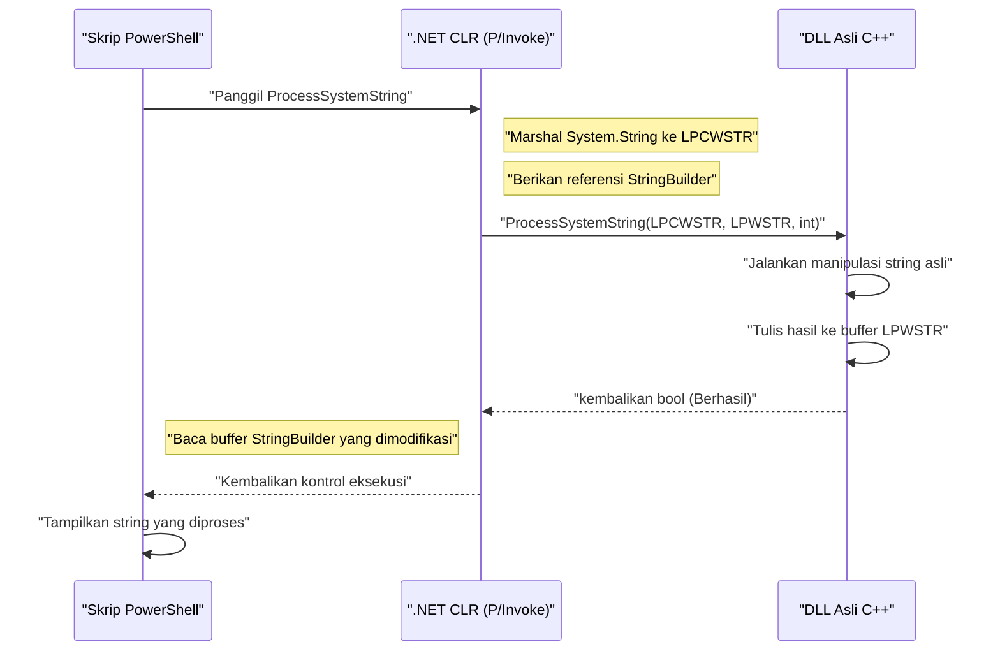
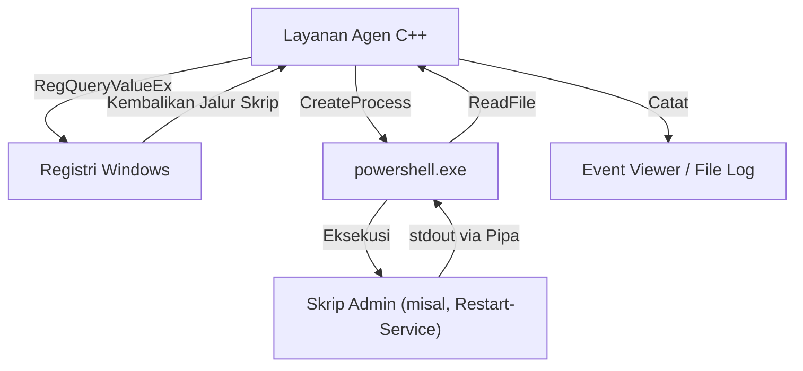

## Pendahuluan

Dalam administrasi sistem dan otomatisasi Windows, PowerShell telah menjadi standar alat secara de facto. Anda dapat menulis skrip untuk setiap tugas seperti manajemen Active Directory, operasi sistem file, dan perubahan konfigurasi jaringan. Namun, meskipun PowerShell serbaguna, ada batasan kinerja khas bahasa skrip dan situasi di mana sulit untuk mengakses API Windows tingkat rendah.

Solusi ampuh untuk masalah ini adalah "Integrasi dengan C++". C++ memberikan kecepatan eksekusi asli dan akses penuh ke objek COM dan API Win32. Dengan menggabungkan "produktivitas dan fleksibilitas tinggi" PowerShell dengan "kinerja luar biasa dan kontrol lapisan rendah" C++, menjadi mungkin untuk mengoptimalkan tugas administrasi sistem berskala besar dan sangat kompleks di lingkungan perusahaan.

Artikel ini membahas secara detail arsitektur spesifik, metode implementasi, dan praktik terbaik untuk manajemen memori dan konversi string untuk mengintegrasikan PowerShell dan C++ secara dua arah.

## Mengapa Mengintegrasikan PowerShell dan C++?

### 1. Menembus Batas Kinerja

PowerShell memiliki elemen bahasa interpreter yang diketik secara dinamis yang berjalan pada .NET Framework (atau .NET Core / .NET). Oleh karena itu, kecepatan eksekusi dan konsumsi memori dapat menjadi hambatan saat memproses teks dalam jumlah besar, melakukan proses enkripsi yang kompleks, atau menganalisis log peristiwa yang mencapai jutaan baris.

Mari kita perhatikan model untuk kompleksitas komputasi dan waktu pemrosesan. Jika total waktu pemrosesan untuk tugas tersebut adalah $T_{total}$, waktu pemrosesan untuk PowerShell itu sendiri dan saat dibongkar (offload) ke C++ dapat dirumuskan sebagai berikut:

$$ T_{total}^{(PS)} = N \times (t_{overhead} + t_{compute}^{(PS)}) $$

$$ T_{total}^{(C++)} = t_{interop} + N \times t_{compute}^{(C++)} $$

Di sini, $N$ adalah jumlah elemen yang akan diproses, $t_{overhead}$ adalah overhead yang terkait dengan pemrosesan loop di PowerShell, $t_{compute}$ adalah waktu komputasi murni per elemen, dan $t_{interop}$ adalah overhead dari pemanggilan batas seperti P/Invoke.

Ketika $N$ cukup besar, karena $t_{overhead} \gg 0$ dan $t_{compute}^{(PS)} > t_{compute}^{(C++)}$, latensi keseluruhan berkurang drastis dengan menyerahkan (membongkar) proses ke C++, bahkan jika harus membayar $t_{interop}$ awal.

### 2. Akses ke API Win32 Asli

Meskipun dimungkinkan untuk memanggil API Win32 melalui C# dari dalam PowerShell menggunakan `Add-Type`, sangat sulit untuk mendefinisikan API yang melibatkan struktur kompleks dan fungsi panggilan balik (misalnya, kontrol driver filter mini, operasi memori proses tingkat lanjut) langsung dalam C# / PowerShell. Dengan membuat DLL asli yang dibungkus dalam C++ dan memanggilnya dari PowerShell, kontrol sistem yang aman dari jenis (type-safe) dan andal menjadi mungkin.

## Memanggil DLL Asli C++ dari PowerShell

Pola integrasi yang paling umum adalah mengimplementasikan pemrosesan berat atau pemrosesan khusus sistem sebagai DLL C++ dan memanggilnya dari skrip PowerShell.

### Implementasi DLL di sisi C++ (API Win32 dan Logika Kustom)

Pertama, buat DLL C++ yang memiliki fungsi ekspor yang dapat dipanggil dari PowerShell. Di sini, kami menunjukkan contoh kode C++ sederhana yang mengasumsikan "fungsi untuk mengenkripsi/mendekripsi data string berskala besar atau melakukan perhitungan hash kompleks".

```cpp
// NativeLib.cpp
#include <windows.h>
#include <string>

// Menentukan tautan C dan __stdcall untuk memudahkan pemanggilan dari P/Invoke
extern "C" {

    __declspec(dllexport) int __stdcall ComputeHeavyTask(int multiplier, int dataSize) {
        int result = 0;
        // Simulasi beban pemrosesan berat yang disengaja
        for (int i = 0; i < dataSize; ++i) {
            result += (i % multiplier);
        }
        return result;
    }

    // Fungsi untuk memproses string (Menggunakan LPWSTR untuk dukungan Unicode)
    __declspec(dllexport) bool __stdcall ProcessSystemString(LPCWSTR inputString, LPWSTR outputBuffer, int bufferSize) {
        if (inputString == nullptr || outputBuffer == nullptr) {
            return false;
        }

        std::wstring str(inputString);
        // Beberapa pemrosesan string kompleks (misalnya: penambahan pengenal sistem)
        std::wstring result = L"PROCESSED_" + str;

        if (result.length() >= (size_t)bufferSize) {
            return false; // Mencegah buffer overrun
        }

        wcscpy_s(outputBuffer, bufferSize, result.c_str());
        return true;
    }
}
```

### Manajemen Memori dan Konversi String (`BSTR`, `LPWSTR`)

Ketika bertukar data antara C++ dan PowerShell (.NET), hal yang paling penting untuk diperhatikan adalah **pengkodean string** dan **manajemen memori**.

- **`LPCWSTR` / `LPWSTR`**: Penunjuk string lebar (UTF-16LE) C/C++. Umumnya digunakan sebagai standar dalam fungsi keluarga `W` di API Windows. Pada P/Invoke, dengan menentukan `CharSet = CharSet.Unicode`, itu akan secara otomatis di-marshal dengan `String` atau `StringBuilder` dari .NET.
- **`BSTR`**: String lebar yang diawali panjang, digunakan pada COM (Component Object Model). Memorinya harus dikelola dengan `SysAllocString` dan `SysFreeString`. Tentukan `[MarshalAs(UnmanagedType.BStr)]` pada P/Invoke.

Saat mengalokasikan memori baru di sisi C++ dan mengembalikannya ke PowerShell, muncul masalah tentang siapa yang akan melepaskan memori (kepemilikan). Dalam fungsi `ProcessSystemString` di atas, kami mengadopsi pola standar API Win32 yaitu "C++ menulis hasilnya pada buffer (`outputBuffer`) yang telah dialokasikan sebelumnya oleh pemanggil (PowerShell)". Ini mencegah kebocoran memori.

### P/Invoke dan `Add-Type` di sisi PowerShell

Setelah mengkompilasi DLL C++ (`NativeLib.dll`), panggil ini dari skrip PowerShell. Kita dapat mengkompilasi dan menggunakan secara dinamis tanda tangan P/Invoke C# menggunakan `Add-Type`.

```powershell
# PowerShell Script: Invoke-NativeDLL.ps1

$signature = @'
using System;
using System.Runtime.InteropServices;
using System.Text;

public class NativeInterop
{
    // Mendefinisikan ComputeHeavyTask C++
    [DllImport("NativeLib.dll", CallingConvention = CallingConvention.StdCall)]
    public static extern int ComputeHeavyTask(int multiplier, int dataSize);

    // Mendefinisikan ProcessSystemString C++
    [DllImport("NativeLib.dll", CharSet = CharSet.Unicode, CallingConvention = CallingConvention.StdCall)]
    public static extern bool ProcessSystemString(string inputString, StringBuilder outputBuffer, int bufferSize);
}
'@

# Mengkompilasi dan menambahkan kode C# ke sesi PowerShell
Add-Type -TypeDefinition $signature -PassThru | Out-Null

# 1. Memanggil komputasi numerik yang berat
$result = [NativeInterop]::ComputeHeavyTask(7, 100000000)
Write-Host "Compute Task Result: $result"

# 2. Memanggil pemrosesan string
$input = "SYSTEM_NODE_001"
$bufferSize = 256
# Menggunakan StringBuilder sebagai buffer untuk membiarkan sisi C++ menulis di dalamnya
$outputBuffer = New-Object System.Text.StringBuilder -ArgumentList $bufferSize

$success = [NativeInterop]::ProcessSystemString($input, $outputBuffer, $bufferSize)

if ($success) {
    Write-Host "Processed String: $($outputBuffer.ToString())"
} else {
    Write-Host "String processing failed." -ForegroundColor Red
}
```

### Visualisasi Arsitektur

Diagram urutan berikut menunjukkan alur pemanggilan dan pertukaran memori dari skrip PowerShell ke DLL C++.



## Memanggil PowerShell dari C++

Kali ini adalah pendekatan sebaliknya. Ada kalanya kita ingin secara dinamis menjalankan skrip PowerShell dan mengambil hasilnya dari aplikasi desktop atau layanan sistem yang dibuat dalam C++. Misalnya, skenario di mana agen pemantauan C++ menjalankan skrip perbaikan PowerShell saat mendeteksi anomali tertentu.

Ada dua pendekatan utama:
1. **Memulai Proses (`CreateProcess` / `_popen`)**: Memulai `powershell.exe` sebagai proses independen dan menghubungkan input/output standar melalui pipa.
2. **PowerShell Hosting API (via C++/CLI)**: Meng-host runtime PowerShell dalam proses yang sama.

Artikel ini menjelaskan metode **CreateProcess dengan pipa (pipeline)**, yang paling tangguh dan serbaguna dalam pemrograman sistem.

### Eksekusi dengan CreateProcess dan Pipa Anonim

Kode C++ berikut membuat pipa anonim (Anonymous Pipes), memulai `powershell.exe` sebagai proses anak untuk menjalankan skrip, dan membaca hasilnya dari output standar.

```cpp
#include <windows.h>
#include <iostream>
#include <string>
#include <vector>

std::string ExecutePowerShellScript(const std::string& script) {
    HANDLE hReadPipe, hWritePipe;
    SECURITY_ATTRIBUTES sa;
    sa.nLength = sizeof(SECURITY_ATTRIBUTES);
    sa.bInheritHandle = TRUE; // Biarkan proses anak mewarisi handle pipa
    sa.lpSecurityDescriptor = NULL;

    // 1. Pembuatan Pipa
    if (!CreatePipe(&hReadPipe, &hWritePipe, &sa, 0)) {
        return "Error: CreatePipe failed.";
    }

    // 2. Pengaturan informasi startup untuk proses anak (PowerShell)
    STARTUPINFOA si;
    ZeroMemory(&si, sizeof(STARTUPINFOA));
    si.cb = sizeof(STARTUPINFOA);
    si.dwFlags = STARTF_USESTDHANDLES | STARTF_USESHOWWINDOW;
    si.hStdOutput = hWritePipe;
    si.hStdError = hWritePipe;
    si.wShowWindow = SW_HIDE; // Sembunyikan jendela

    PROCESS_INFORMATION pi;
    ZeroMemory(&pi, sizeof(PROCESS_INFORMATION));

    // Pembuatan baris perintah (Versi sederhana menghindari pengkodean Base64 dengan kebijakan Bypass)
    std::string cmd = "powershell.exe -NoProfile -NonInteractive -Command \"" + script + "\"";
    std::vector<char> cmdBuffer(cmd.begin(), cmd.end());
    cmdBuffer.push_back('\0');

    // 3. Pembuatan Proses
    if (!CreateProcessA(NULL, cmdBuffer.data(), NULL, NULL, TRUE, 0, NULL, NULL, &si, &pi)) {
        CloseHandle(hReadPipe);
        CloseHandle(hWritePipe);
        return "Error: CreateProcess failed.";
    }

    // Pipa tulis tidak diperlukan di sisi proses induk, jadi tutup (jika tidak ditutup, Read akan terblokir)
    CloseHandle(hWritePipe);

    // 4. Pembacaan hasil
    std::string output = "";
    DWORD bytesRead;
    char buffer[4096];

    while (ReadFile(hReadPipe, buffer, sizeof(buffer) - 1, &bytesRead, NULL) && bytesRead > 0) {
        buffer[bytesRead] = '\0';
        output += buffer;
    }

    // 5. Pembersihan (Cleanup)
    WaitForSingleObject(pi.hProcess, INFINITE);
    CloseHandle(pi.hProcess);
    CloseHandle(pi.hThread);
    CloseHandle(hReadPipe);

    return output;
}

int main() {
    // Perintah untuk mendapatkan daftar proses di PowerShell dan mengurutkannya berdasarkan penggunaan CPU
    std::string psCommand = "Get-Process | Sort-Object CPU -Descending | Select-Object -First 5 | Format-Table Name, CPU, Id";
    
    std::cout << "Executing PowerShell from C++..." << std::endl;
    std::string result = ExecutePowerShellScript(psCommand);
    
    std::cout << "Result:\n" << result << std::endl;
    return 0;
}
```

### Integrasi antara Registri Windows dan PowerShell

Saat menjalankan skrip dari C++, Anda harus menghindari pengkodean secara langsung (hardcoding) untuk nilai pengaturan dinamis dan jalur eksekusi. Sering kali, aplikasi C++ membaca pengaturan dari **Registri Windows**.

Arsitektur di mana sisi C++ mendapatkan jalur skrip PowerShell dari `HKLM\SOFTWARE\MyApp` menggunakan `RegOpenKeyEx` dan `RegQueryValueEx` lalu meneruskannya sebagai argumen ke `CreateProcess` di atas, lebih disukai dalam sistem perusahaan.



## Analisis Kinerja dan Keuntungan Pembongkaran (Offloading)

Mengapa kita mengadopsi arsitektur kompleks seperti ini? Sebagai skenario spesifik, pertimbangkan "menganalisis file log IIS kustom berukuran beberapa gigabyte".

Saat menggunakan `Get-Content` di PowerShell dan mengurai baris demi baris menggunakan ekspresi reguler, sejumlah besar waktu CPU terbuang karena pembuatan objek dan overhead dari garbage collection (GC).

Jumlah alokasi memori $A$ dan jumlah pemicu GC $G$ sebanding dalam eksekusi skrip sebagai berikut:

$$ G \propto \sum_{i=1}^{N} A_i $$

Bila proses dipindahkan ke kode asli C++, Anda dapat memetakan keseluruhan file langsung ke dalam memori menggunakan pemetaan memori (`CreateFileMapping`, `MapViewOfFile`), dan mencari string dengan zero-copy (tanpa penyalinan) melalui aritmatika pointer. Dalam kasus ini, overhead terkait pembuatan objek secara virtual menjadi nol, dan penguraian (parsing) selesai pada kecepatan yang mendekati batas teoritis dari bandwidth memori.

Hanya dengan mengembalikan hasil penguraian (misalnya: daftar alamat IP dari akses tidak sah) ke sisi PowerShell, biaya marshaling dari P/Invoke juga dapat diminimalkan.

## Skenario Otomatisasi Administrasi Sistem yang Praktis

### Skenario 1: Pemindaian Sistem File Berkecepatan Tinggi dan Perubahan Hak Akses

Pada server file berskala besar, tugas ini mengekstrak file dengan ekstensi tertentu dan juga daftar kontrol akses (ACL) tertentu yang telah dikonfigurasi, lalu mengubah hak akses sekaligus.
- **Peran C++**: Menggunakan `FindFirstFile` / `FindNextFile` bersama multithreading untuk melintasi hierarki (tree) direktori pada kecepatan tinggi, dan menghasilkan daftar jalur file yang memenuhi syarat.
- **Peran PowerShell**: Untuk daftar yang diterima dari C++, terapkan hak akses sekaligus menggunakan `Set-Acl` (atau pemrosesan terintegrasi dengan Active Directory).

### Skenario 2: Mengumpulkan Informasi Perangkat Keras Khusus

Memantau informasi perangkat keras khusus (misalnya, kartu PCIe khusus atau sensor) yang tidak dapat diperoleh dari WMI (Windows Management Instrumentation) atau CIM (Common Information Model).
- **Peran C++**: DLL yang melakukan panggilan `DeviceIoControl` ke driver perangkat untuk mendapatkan dan menganalisis data biner.
- **Peran PowerShell**: Memanggil DLL secara berkala, memformat hasil analisis ke dalam JSON, dan mengirimkannya ke REST API dari server pemantauan.

## Praktik Terbaik untuk Manajemen Memori dan Pemecahan Masalah

Bug paling umum yang terjadi dalam integrasi adalah **Kebocoran Memori (Memory Leak)** dan **Pelanggaran Akses (Access Violation: 0xC0000005)**.

1. **Masa Berlaku Pointer**: Jika Anda memberikan `[ref]` atau `StringBuilder` di sisi PowerShell, P/Invoke menyematkan (Pin) memori tersebut hanya selama pemanggilan. Sisi C++ tidak boleh menyimpan pointer ke dalam variabel global dan mengaksesnya lagi nanti. Bila melakukan panggilan balik (callback) asinkron, Anda harus menyematkan memori secara eksplisit menggunakan `GCHandle`.
2. **Ukuran Pointer pada Lingkungan 64-bit**: Windows modern sebagian besar menggunakan sistem 64-bit (x64). Ukuran penunjuk di sisi C++ adalah 8 byte, dan disarankan menggunakan `IntPtr` di sisi PowerShell (.NET). `long` pada C++ di Windows berukuran 4 byte, sehingga kode lama yang memberikan pointer sebagai tipe `long` akan menyebabkan kerusakan (crash).
3. **Ketidakcocokan Pengkodean String**: Secara internal, PowerShell menggunakan UTF-16. Jika sisi C++ mencoba menerimanya sebagai string ANSI (`std::string`, `char*`), maka akan terjadi kerusakan karakter (mojibake). Pastikan untuk selalu menggunakan string lebar (`std::wstring`, `wchar_t*`), dan tentukan `CharSet = CharSet.Unicode` di sisi P/Invoke.

## Kesimpulan

Integrasi antara PowerShell dan C++ adalah kombinasi paling kuat yang menyeimbangkan kemudahan bahasa skrip dengan kekuatan bahasa asli untuk otomatisasi administrasi sistem.

Dengan memanggil DLL C++ menggunakan P/Invoke, tugas yang menuntut komputasi berat dapat dibongkar, sehingga secara drastis mengurangi waktu eksekusi. Sebaliknya, dengan memanfaatkan modul administrasi sistem PowerShell yang kaya dari aplikasi C++ melalui pengaktifan proses atau pipa (pipeline), biaya pengembangan dapat dikurangi secara signifikan.

Meskipun Anda harus berhati-hati dengan manajemen memori dan konversi string pada tingkat perbatasan, menguasai pola arsitektur dan teknik implementasi yang diperkenalkan dalam artikel ini akan memungkinkan Anda membangun alat administrasi sistem Windows yang lebih tangguh dan canggih.

---

*Blog teknologi ini akan terus meliput topik mendalam mengenai struktur internal Windows dan otomatisasi tingkat lanjut di masa mendatang. Jika Anda memiliki pertanyaan atau umpan balik, silakan sampaikan di kolom komentar.*
