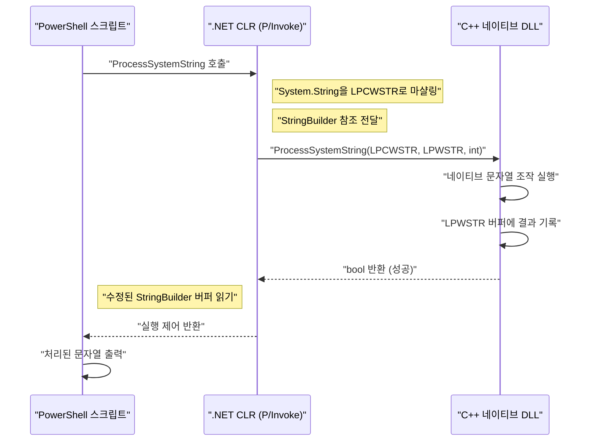
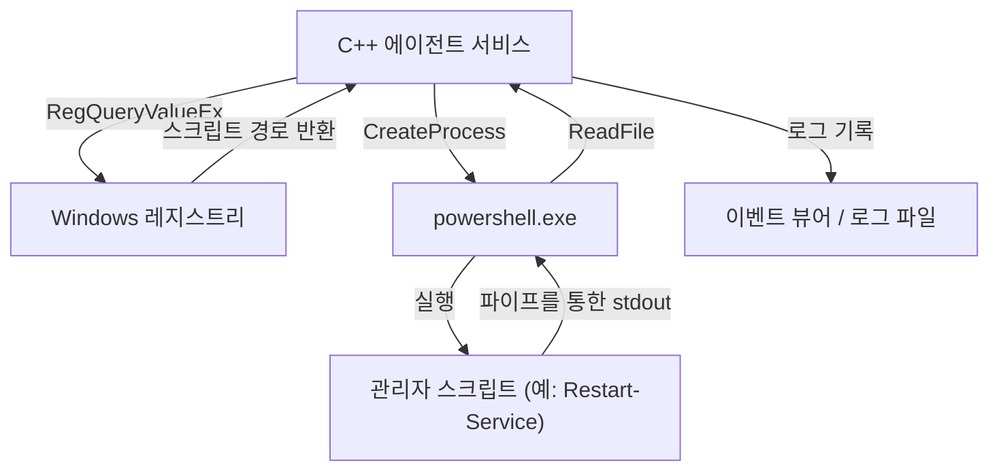

## 시작하며

Windows 시스템 관리 및 자동화에 있어 PowerShell은 사실상 표준 도구가 되었습니다. Active Directory 관리, 파일 시스템 조작, 네트워크 구성 변경 등 모든 작업을 스크립트로 작성할 수 있습니다. 그러나 PowerShell이 만능인 한편, 스크립트 언어 특유의 성능 한계나 매우 낮은 수준의 Windows API에 접근하는 데 어려움을 겪는 상황이 존재합니다.

여기서 강력한 해결책이 되는 것이 'C++과의 연동'입니다. C++은 네이티브 실행 속도와 Win32 API 및 COM 객체에 대한 완전한 접근을 제공합니다. PowerShell의 '높은 생산성·유연성'과 C++의 '압도적인 성능·로우 레벨 제어'를 결합함으로써, 엔터프라이즈 환경에서의 매우 복잡하고 대규모인 시스템 관리 작업을 최적화하는 것이 가능해집니다.

이 글에서는 PowerShell과 C++를 양방향으로 연동하기 위한 구체적인 아키텍처, 구현 기법, 그리고 메모리 관리 및 문자열 변환의 베스트 프랙티스에 대해 매우 상세하게 해설합니다.

## 왜 PowerShell과 C++를 연동하는가?

### 1. 성능의 한계 돌파

PowerShell은 .NET Framework(또는 .NET Core / .NET) 상에서 동작하는 인터프리터형·동적 타이핑 언어 요소를 가집니다. 그렇기 때문에 대량의 텍스트 처리나 복잡한 암호화 처리, 또는 수백만 줄에 달하는 이벤트 로그 분석 등을 수행할 때 실행 속도나 메모리 소비량이 병목이 될 수 있습니다.

계산량과 처리 시간 모델을 생각해 봅시다. 전체 작업의 처리 시간을 $T_{total}$ 이라고 했을 때, PowerShell 단독 처리와 C++로 오프로드했을 경우의 처리 시간은 다음과 같이 공식화할 수 있습니다.

$$ T_{total}^{(PS)} = N \times (t_{overhead} + t_{compute}^{(PS)}) $$

$$ T_{total}^{(C++)} = t_{interop} + N \times t_{compute}^{(C++)} $$

여기서 $N$ 은 처리할 요소의 수, $t_{overhead}$ 는 PowerShell의 루프 처리에 따른 오버헤드, $t_{compute}$ 는 1요소당 순수한 계산 시간, $t_{interop}$ 은 P/Invoke 등에 의한 경계 호출 오버헤드입니다.

$N$ 이 충분히 클 경우, $t_{overhead} \gg 0$ 이고 $t_{compute}^{(PS)} > t_{compute}^{(C++)}$ 이기 때문에, 초기의 $t_{interop}$ 을 지불하더라도 C++에 처리를 위임(오프로드)하는 편이 전체 대기 시간(레이턴시)을 극적으로 낮출 수 있습니다.

### 2. 네이티브 Win32 API에 대한 접근

PowerShell 단독으로도 `Add-Type`을 사용하여 C#을 통해 Win32 API를 호출하는 것은 가능하지만, 복잡한 구조체나 콜백 함수를 동반하는 API(예: 미니 필터 드라이버 제어, 고도의 프로세스 메모리 조작)를 직접 C# / PowerShell로 정의하는 것은 매우 어렵습니다. C++로 래핑한 네이티브 DLL을 생성하고 이를 PowerShell에서 호출함으로써, 타입에 안전하고 확실한 시스템 제어가 가능해집니다.

## PowerShell에서 C++ 네이티브 DLL 호출하기

가장 일반적인 연동 패턴은 무거운 처리나 시스템 고유의 처리를 C++ DLL로 구현하고, 이를 PowerShell 스크립트에서 호출하는 방법입니다.

### C++ 측의 DLL 구현 (Win32 API 및 커스텀 로직)

먼저, PowerShell에서 호출할 수 있는 익스포트 함수를 가진 C++ DLL을 생성합니다. 여기서는 예시로 '대규모 문자열 데이터의 암호화·복호화, 또는 복잡한 해시 계산을 수행하는 함수'를 가정한 간단한 C++ 코드를 보여줍니다.

```cpp
// NativeLib.cpp
#include <windows.h>
#include <string>

// P/Invoke로 호출하기 쉽도록 C 링키지와 __stdcall 지정
extern "C" {

    __declspec(dllexport) int __stdcall ComputeHeavyTask(int multiplier, int dataSize) {
        int result = 0;
        // 의도적인 무거운 처리 시뮬레이션
        for (int i = 0; i < dataSize; ++i) {
            result += (i % multiplier);
        }
        return result;
    }

    // 문자열을 처리하는 함수 (유니코드 지원을 위해 LPWSTR 사용)
    __declspec(dllexport) bool __stdcall ProcessSystemString(LPCWSTR inputString, LPWSTR outputBuffer, int bufferSize) {
        if (inputString == nullptr || outputBuffer == nullptr) {
            return false;
        }

        std::wstring str(inputString);
        // 어떠한 복잡한 문자열 처리 (예: 시스템 식별자 부여)
        std::wstring result = L"PROCESSED_" + str;

        if (result.length() >= (size_t)bufferSize) {
            return false; // 버퍼 오버런 방지
        }

        wcscpy_s(outputBuffer, bufferSize, result.c_str());
        return true;
    }
}
```

### 메모리 관리와 문자열 변환 (`BSTR`, `LPWSTR`)

C++와 PowerShell(.NET) 간에 데이터를 주고받을 때 가장 주의해야 할 점은 **문자열 인코딩**과 **메모리 관리**입니다.

- **`LPCWSTR` / `LPWSTR`**: C/C++의 와이드 문자열 포인터(UTF-16LE). Windows API의 `W` 계열 함수에서 표준으로 사용됩니다. P/Invoke에서는 `CharSet = CharSet.Unicode`를 지정함으로써 .NET의 `String`이나 `StringBuilder`와 자동으로 마샬링됩니다.
- **`BSTR`**: COM(Component Object Model)에서 사용되는 길이 접두사가 있는 와이드 문자열. `SysAllocString`이나 `SysFreeString`으로 메모리를 관리해야 합니다. P/Invoke에서 `[MarshalAs(UnmanagedType.BStr)]`를 지정합니다.

C++ 측에서 새로 메모리를 할당하여 PowerShell 측에 반환할 경우, 누가 메모리를 해제할 것인가(소유권)가 문제가 됩니다. 앞서 살펴본 `ProcessSystemString` 함수에서는 '호출자(PowerShell)가 사전에 할당한 버퍼(`outputBuffer`)에 C++이 결과를 기록한다'라는 Win32 API의 표준적인 패턴을 채택하고 있습니다. 이를 통해 메모리 누수를 방지할 수 있습니다.

### PowerShell 측의 `Add-Type`과 P/Invoke

C++ DLL(`NativeLib.dll`)을 컴파일했다면, PowerShell 스크립트에서 이를 호출합니다. C#의 P/Invoke 시그니처를 `Add-Type`으로 동적 컴파일하여 이용합니다.

```powershell
# PowerShell Script: Invoke-NativeDLL.ps1

$signature = @'
using System;
using System.Runtime.InteropServices;
using System.Text;

public class NativeInterop
{
    // C++의 ComputeHeavyTask를 정의
    [DllImport("NativeLib.dll", CallingConvention = CallingConvention.StdCall)]
    public static extern int ComputeHeavyTask(int multiplier, int dataSize);

    // C++의 ProcessSystemString을 정의
    [DllImport("NativeLib.dll", CharSet = CharSet.Unicode, CallingConvention = CallingConvention.StdCall)]
    public static extern bool ProcessSystemString(string inputString, StringBuilder outputBuffer, int bufferSize);
}
'@

# C# 코드를 PowerShell 세션에 컴파일하여 추가
Add-Type -TypeDefinition $signature -PassThru | Out-Null

# 1. 무거운 수치 계산 호출
$result = [NativeInterop]::ComputeHeavyTask(7, 100000000)
Write-Host "Compute Task Result: $result"

# 2. 문자열 처리 호출
$input = "SYSTEM_NODE_001"
$bufferSize = 256
# C++ 측에 기록하게 하기 위한 버퍼로서 StringBuilder를 사용
$outputBuffer = New-Object System.Text.StringBuilder -ArgumentList $bufferSize

$success = [NativeInterop]::ProcessSystemString($input, $outputBuffer, $bufferSize)

if ($success) {
    Write-Host "Processed String: $($outputBuffer.ToString())"
} else {
    Write-Host "String processing failed." -ForegroundColor Red
}
```

### 아키텍처 시각화

다음 시퀀스 다이어그램은 PowerShell에서 C++ DLL로의 호출 흐름과 메모리 교환을 보여줍니다.



## C++에서 PowerShell 호출하기

이번에는 반대의 접근입니다. C++로 만들어진 시스템 서비스나 데스크톱 애플리케이션에서 PowerShell 스크립트를 동적으로 실행하고 그 결과를 얻고 싶은 경우가 있습니다. 예를 들어, C++ 모니터링 에이전트가 특정 이상을 감지했을 때 PowerShell의 복구 스크립트를 실행하는 시나리오입니다.

접근 방식은 주로 두 가지가 있습니다.
1. **프로세스 기동 (`CreateProcess` / `_popen`)**: 독립된 프로세스로 `powershell.exe`를 실행하고 표준 입출력을 파이프로 연결하는 방법.
2. **PowerShell Hosting API (C++/CLI 경유)**: 동일 프로세스 내에서 PowerShell 런타임을 호스팅하는 방법.

이 글에서는 시스템 프로그래밍에 있어 가장 견고하고 범용적인 **파이프라인을 사용한 CreateProcess** 기법을 해설합니다.

### CreateProcess와 익명 파이프를 이용한 실행

다음 C++ 코드는 익명 파이프(Anonymous Pipes)를 생성하고 자식 프로세스로 `powershell.exe`를 실행하여 스크립트를 실행한 후, 표준 출력에서 결과를 읽어옵니다.

```cpp
#include <windows.h>
#include <iostream>
#include <string>
#include <vector>

std::string ExecutePowerShellScript(const std::string& script) {
    HANDLE hReadPipe, hWritePipe;
    SECURITY_ATTRIBUTES sa;
    sa.nLength = sizeof(SECURITY_ATTRIBUTES);
    sa.bInheritHandle = TRUE; // 파이프 핸들을 자식 프로세스에 상속시킴
    sa.lpSecurityDescriptor = NULL;

    // 1. 파이프 생성
    if (!CreatePipe(&hReadPipe, &hWritePipe, &sa, 0)) {
        return "Error: CreatePipe failed.";
    }

    // 2. 자식 프로세스(PowerShell)의 시작 정보 설정
    STARTUPINFOA si;
    ZeroMemory(&si, sizeof(STARTUPINFOA));
    si.cb = sizeof(STARTUPINFOA);
    si.dwFlags = STARTF_USESTDHANDLES | STARTF_USESHOWWINDOW;
    si.hStdOutput = hWritePipe;
    si.hStdError = hWritePipe;
    si.wShowWindow = SW_HIDE; // 창 숨기기

    PROCESS_INFORMATION pi;
    ZeroMemory(&pi, sizeof(PROCESS_INFORMATION));

    // 명령줄 구성 (Bypass 정책으로 Base64 인코딩 등을 피하는 간략화 버전)
    std::string cmd = "powershell.exe -NoProfile -NonInteractive -Command \"" + script + "\"";
    std::vector<char> cmdBuffer(cmd.begin(), cmd.end());
    cmdBuffer.push_back('\0');

    // 3. 프로세스 생성
    if (!CreateProcessA(NULL, cmdBuffer.data(), NULL, NULL, TRUE, 0, NULL, NULL, &si, &pi)) {
        CloseHandle(hReadPipe);
        CloseHandle(hWritePipe);
        return "Error: CreateProcess failed.";
    }

    // 부모 프로세스 측에서는 쓰기 파이프가 불필요하므로 닫음 (닫지 않으면 Read가 블로킹됨)
    CloseHandle(hWritePipe);

    // 4. 결과 읽기
    std::string output = "";
    DWORD bytesRead;
    char buffer[4096];

    while (ReadFile(hReadPipe, buffer, sizeof(buffer) - 1, &bytesRead, NULL) && bytesRead > 0) {
        buffer[bytesRead] = '\0';
        output += buffer;
    }

    // 5. 정리(클린업)
    WaitForSingleObject(pi.hProcess, INFINITE);
    CloseHandle(pi.hProcess);
    CloseHandle(pi.hThread);
    CloseHandle(hReadPipe);

    return output;
}

int main() {
    // PowerShell에서 프로세스 목록을 가져와 CPU 사용률로 정렬하는 명령
    std::string psCommand = "Get-Process | Sort-Object CPU -Descending | Select-Object -First 5 | Format-Table Name, CPU, Id";
    
    std::cout << "Executing PowerShell from C++..." << std::endl;
    std::string result = ExecutePowerShellScript(psCommand);
    
    std::cout << "Result:\n" << result << std::endl;
    return 0;
}
```

### Windows 레지스트리와 PowerShell의 연동

C++에서 스크립트를 실행할 때, 동적인 설정 값이나 실행 경로를 하드코딩하는 것은 피해야 합니다. 많은 경우, C++ 애플리케이션은 설정을 **Windows 레지스트리**에서 읽어옵니다.

C++ 측에서 `RegOpenKeyEx`와 `RegQueryValueEx`를 사용하여 `HKLM\SOFTWARE\MyApp`으로부터 PowerShell 스크립트의 경로를 가져오고, 이를 인수로 앞서 설명한 `CreateProcess`에 전달하는 아키텍처가 엔터프라이즈 시스템에서 선호됩니다.



## 성능 분석과 오프로드의 이점

왜 이러한 복잡한 아키텍처를 채택하는 것일까요? 구체적인 시나리오로 '수 기가바이트에 달하는 커스텀 IIS 로그 파일 분석'을 생각해 봅니다.

PowerShell에서 `Get-Content`를 사용하고 정규식을 이용해 한 줄씩 파싱할 경우, 객체 생성과 가비지 컬렉션(GC)의 오버헤드로 인해 CPU 시간을 대량으로 소비합니다.

메모리 할당 횟수 $A$ 와 GC의 트리거 횟수 $G$ 는 스크립트 실행에 있어 다음과 같이 비례합니다.

$$ G \propto \sum_{i=1}^{N} A_i $$

C++ 네이티브 코드로 처리를 이관할 경우, 메모리 매핑(`CreateFileMapping`, `MapViewOfFile`)을 사용하여 파일 전체를 직접 메모리에 전개하고, 포인터 연산을 통해 제로 카피(Zero-copy)로 문자열 탐색을 수행할 수 있습니다. 이 경우 객체 생성에 따른 오버헤드는 사실상 제로가 되며, 이론적인 메모리 대역폭의 상한에 가까운 속도로 파싱이 완료됩니다.

파싱한 결과(예: 부정 접근 IP 주소 목록 등)만을 PowerShell 측에 반환함으로써, P/Invoke의 마샬링 비용도 최소한으로 억제할 수 있습니다.

## 실천적인 시스템 관리 자동화 시나리오

### 시나리오 1: 고속 파일 시스템 스캔 및 권한 변경

대규모 파일 서버에서 특정 확장자를 가진 파일 중 특정 ACL(접근 제어 목록)이 설정된 것을 추출하여 일괄적으로 권한을 변경하는 작업.
- **C++의 역할**: `FindFirstFile` / `FindNextFile` 및 멀티스레딩을 사용하여 초고속으로 디렉토리 트리를 순회하고, 조건에 일치하는 파일 경로 목록을 생성.
- **PowerShell의 역할**: C++로부터 받은 목록에 대해 `Set-Acl`을 사용하여 일괄적으로 권한을 적용(또는 Active Directory와 연동된 처리).

### 시나리오 2: 독자적인 하드웨어 정보 수집

WMI(Windows Management Instrumentation)나 CIM(Common Information Model)으로는 얻을 수 없는 독자적인 하드웨어 장치(예: 특수한 PCIe 카드나 센서)의 정보를 모니터링한다.
- **C++의 역할**: 장치 드라이버에 대해 `DeviceIoControl`을 호출하여 바이너리 데이터를 획득·분석하는 DLL.
- **PowerShell의 역할**: 정기적으로 DLL을 호출하고, 분석 결과를 JSON으로 포맷하여 모니터링 서버의 REST API로 전송한다.

## 메모리 관리와 트러블슈팅의 베스트 프랙티스

연동에 있어 가장 많이 발생하는 버그는 **메모리 누수**와 **접근 위반(Access Violation: 0xC0000005)**입니다.

1. **포인터의 유효 기간**: PowerShell 측에서 `[ref]`나 `StringBuilder`를 전달할 경우, P/Invoke는 호출 중에만 그 메모리를 고정(Pin)합니다. C++ 측에서 그 포인터를 전역 변수에 저장하고 나중에 접근해서는 안 됩니다. 비동기 콜백을 수행할 경우에는 `GCHandle`을 사용하여 명시적으로 메모리를 고정할 필요가 있습니다.
2. **64bit 환경의 포인터 크기**: 현대의 Windows는 64bit(x64)가 기본입니다. C++ 측에서의 포인터 크기는 8바이트이며, PowerShell(.NET) 측에서는 `IntPtr`을 사용해야 합니다. C++의 `long`은 Windows에서 4바이트이므로, 포인터를 `long`으로 캐스팅하여 전달하는 낡은 코드는 크래시의 원인이 됩니다.
3. **문자열 인코딩의 불일치**: PowerShell은 내부적으로 UTF-16을 사용합니다. C++ 측에서 ANSI 문자열(`std::string`, `char*`)로 받으려고 하면 글자 깨짐이 발생합니다. 반드시 와이드 문자열(`std::wstring`, `wchar_t*`)을 사용하고, P/Invoke 측에서도 `CharSet = CharSet.Unicode`를 지정해 주세요.

## 요약

PowerShell과 C++의 연동은 시스템 관리 자동화에 있어 스크립트 언어의 편리함과 네이티브 언어의 강력함을 양립시키는 최강의 조합입니다.

P/Invoke를 이용한 C++ DLL 호출을 통해 계산 부하가 높은 작업을 오프로드하여 실행 시간을 극적으로 단축할 수 있습니다. 반대로 C++ 애플리케이션에서 프로세스 기동이나 파이프라인을 통해 PowerShell의 풍부한 시스템 관리 모듈을 활용함으로써 개발 비용을 대폭 절감할 수 있습니다.

경계 부분에서의 메모리 관리나 문자열 변환에는 주의가 필요하지만, 이 글에서 소개한 아키텍처 패턴과 구현 테크닉을 마스터함으로써 보다 고도화되고 견고한 Windows 시스템 관리 도구를 구축할 수 있게 될 것입니다.

---

*이 기술 블로그에서는 앞으로도 Windows 내부 구조나 고도화된 자동화와 관련된 깊이 있는 주제를 다룰 예정입니다. 질문이나 피드백이 있으시다면 꼭 댓글란에 남겨주세요.*
