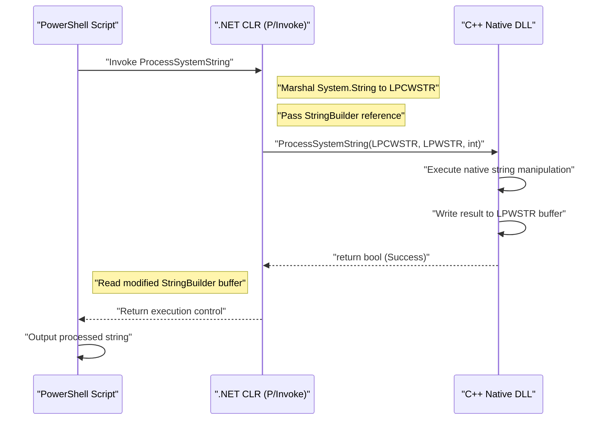
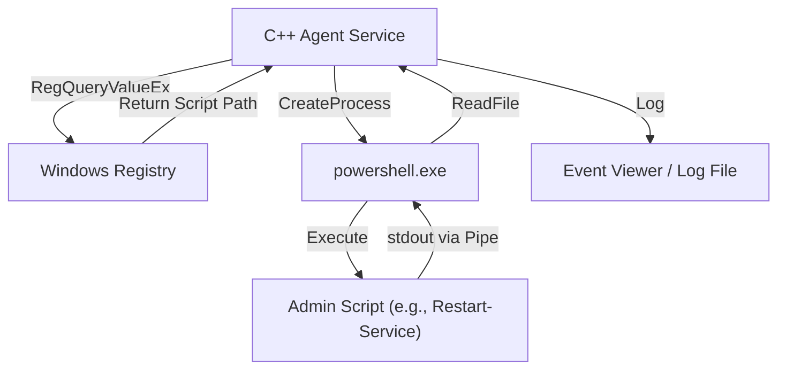

## はじめに

Windowsのシステム管理や自動化において、PowerShellは事実上の標準ツールとなっています。Active Directoryの管理、ファイルシステムの操作、ネットワーク構成の変更など、あらゆるタスクをスクリプトで記述できます。しかし、PowerShellが万能である一方で、スクリプト言語特有のパフォーマンスの限界や、非常に低レベルなWindows APIへのアクセスに苦労する場面が存在します。

ここで強力な解決策となるのが、「C++との連携」です。C++はネイティブな実行速度と、Win32 APIやCOMオブジェクトへの完全なアクセスを提供します。PowerShellの「高い生産性・柔軟性」とC++の「圧倒的なパフォーマンス・低レイヤー制御」を組み合わせることで、エンタープライズ環境における極めて複雑かつ大規模なシステム管理タスクを最適化することが可能になります。

本記事では、PowerShellとC++を双方向に連携させるための具体的なアーキテクチャ、実装手法、およびメモリ管理や文字列変換のベストプラクティスについて、非常に詳細に解説します。

## なぜPowerShellとC++を連携させるのか？

### 1. パフォーマンスの限界突破

PowerShellは.NET Framework（または.NET Core / .NET）上で動作するインタプリタ型・動的型付けの言語要素を持ちます。そのため、テキストの大量処理や複雑な暗号化処理、あるいは数百万行に及ぶイベントログの解析などを行う際、実行速度やメモリ消費量がボトルネックとなることがあります。

計算量と処理時間のモデルを考えてみましょう。タスク全体の処理時間を $T_{total}$ としたとき、PowerShell単体での処理と、C++へオフロードした場合の処理時間は以下のように定式化できます。

$$ T_{total}^{(PS)} = N \times (t_{overhead} + t_{compute}^{(PS)}) $$

$$ T_{total}^{(C++)} = t_{interop} + N \times t_{compute}^{(C++)} $$

ここで、$N$ は処理する要素の数、$t_{overhead}$ はPowerShellのループ処理に伴うオーバーヘッド、$t_{compute}$ は1要素あたりの純粋な計算時間、$t_{interop}$ はP/Invoke等による境界呼び出しのオーバーヘッドです。

$N$ が十分に大きい場合、$t_{overhead} \gg 0$ かつ $t_{compute}^{(PS)} > t_{compute}^{(C++)}$ であるため、初期の $t_{interop}$ を支払ってでもC++に処理を委譲（オフロード）した方が、全体のレイテンシは劇的に低下します。

### 2. ネイティブWin32 APIへのアクセス

PowerShell単体でも `Add-Type` を使ってC#経由でWin32 APIを呼び出すことは可能ですが、複雑な構造体やコールバック関数を伴うAPI（例: ミニフィルタードライバの制御、高度なプロセスメモリ操作）を直接C# / PowerShellで定義するのは非常に困難です。C++でラップしたネイティブDLLを作成し、それをPowerShellから呼び出すことで、型安全かつ確実なシステム制御が可能になります。

## PowerShellからC++ネイティブDLLを呼び出す

最も一般的な連携パターンは、重い処理やシステム固有の処理をC++のDLLとして実装し、それをPowerShellスクリプトから呼び出す方法です。

### C++側のDLL実装 (Win32 APIやカスタムロジック)

まず、PowerShellから呼び出し可能なエクスポート関数を持つC++のDLLを作成します。ここでは、例として「大規模な文字列データの暗号化・復号、あるいは複雑なハッシュ計算を行う関数」を想定した簡単なC++コードを示します。

```cpp
// NativeLib.cpp
#include <windows.h>
#include <string>

// P/Invokeで呼び出しやすいようにCリンケージと__stdcallを指定
extern "C" {

    __declspec(dllexport) int __stdcall ComputeHeavyTask(int multiplier, int dataSize) {
        int result = 0;
        // 意図的な重い処理のシミュレーション
        for (int i = 0; i < dataSize; ++i) {
            result += (i % multiplier);
        }
        return result;
    }

    // 文字列を処理する関数（Unicode対応のためLPWSTRを使用）
    __declspec(dllexport) bool __stdcall ProcessSystemString(LPCWSTR inputString, LPWSTR outputBuffer, int bufferSize) {
        if (inputString == nullptr || outputBuffer == nullptr) {
            return false;
        }

        std::wstring str(inputString);
        // 何らかの複雑な文字列処理（例：システム識別子の付与）
        std::wstring result = L"PROCESSED_" + str;

        if (result.length() >= (size_t)bufferSize) {
            return false; // バッファオーバーラン防止
        }

        wcscpy_s(outputBuffer, bufferSize, result.c_str());
        return true;
    }
}
```

### メモリ管理と文字列変換 (`BSTR`, `LPWSTR`)

C++とPowerShell（.NET）間でデータをやり取りする際、最も注意すべきは**文字列のエンコーディング**と**メモリ管理**です。

- **`LPCWSTR` / `LPWSTR`**: C/C++のワイド文字列ポインタ（UTF-16LE）。Windows APIの `W` 系関数で標準的に使用されます。P/Invokeでは `CharSet = CharSet.Unicode` を指定することで、.NETの `String` や `StringBuilder` と自動的にマーシャリングされます。
- **`BSTR`**: COM (Component Object Model) で使用される長さプレフィックス付きのワイド文字列。`SysAllocString` や `SysFreeString` でメモリを管理する必要があります。P/Invokeで `[MarshalAs(UnmanagedType.BStr)]` を指定します。

C++側で新しくメモリを割り当ててPowerShell側に返す場合、誰がメモリを解放するのか（所有権）が問題になります。上記の `ProcessSystemString` 関数では、「呼び出し元（PowerShell）が事前に割り当てたバッファ（`outputBuffer`）にC++が結果を書き込む」という、Win32 APIの標準的なパターンを採用しています。これによりメモリリークを防ぐことができます。

### PowerShell側での `Add-Type` と P/Invoke

C++のDLL（`NativeLib.dll`）をコンパイルしたら、PowerShellスクリプトからこれを呼び出します。C#のP/Invokeシグネチャを `Add-Type` で動的にコンパイルして利用します。

```powershell
# PowerShell Script: Invoke-NativeDLL.ps1

$signature = @'
using System;
using System.Runtime.InteropServices;
using System.Text;

public class NativeInterop
{
    // C++の ComputeHeavyTask を定義
    [DllImport("NativeLib.dll", CallingConvention = CallingConvention.StdCall)]
    public static extern int ComputeHeavyTask(int multiplier, int dataSize);

    // C++の ProcessSystemString を定義
    [DllImport("NativeLib.dll", CharSet = CharSet.Unicode, CallingConvention = CallingConvention.StdCall)]
    public static extern bool ProcessSystemString(string inputString, StringBuilder outputBuffer, int bufferSize);
}
'@

# C#のコードをPowerShellセッションにコンパイルして追加
Add-Type -TypeDefinition $signature -PassThru | Out-Null

# 1. 重い数値計算の呼び出し
$result = [NativeInterop]::ComputeHeavyTask(7, 100000000)
Write-Host "Compute Task Result: $result"

# 2. 文字列処理の呼び出し
$input = "SYSTEM_NODE_001"
$bufferSize = 256
# C++側に書き込ませるためのバッファとして StringBuilder を使用
$outputBuffer = New-Object System.Text.StringBuilder -ArgumentList $bufferSize

$success = [NativeInterop]::ProcessSystemString($input, $outputBuffer, $bufferSize)

if ($success) {
    Write-Host "Processed String: $($outputBuffer.ToString())"
} else {
    Write-Host "String processing failed." -ForegroundColor Red
}
```

### アーキテクチャの可視化

以下のシーケンス図は、PowerShellからC++ DLLへの呼び出しフローとメモリのやり取りを示しています。



## C++からPowerShellを呼び出す

今度は逆のアプローチです。C++で作られたシステムサービスやデスクトップアプリケーションから、PowerShellスクリプトを動的に実行し、その結果を取得したい場合があります。たとえば、C++の監視エージェントが特定の異常を検知した際に、PowerShellの修復スクリプトを実行するようなシナリオです。

アプローチは主に2つあります。
1. **プロセス起動（`CreateProcess` / `_popen`）**：独立したプロセスとして `powershell.exe` を起動し、標準入出力をパイプでつなぐ方法。
2. **PowerShell Hosting API（C++/CLI経由）**：同一プロセス内でPowerShellのランタイムをホストする方法。

本記事では、システムプログラミングにおいて最も堅牢で汎用的な**パイプラインを用いたCreateProcess**の手法を解説します。

### CreateProcessと無名パイプによる実行

以下のC++コードは、無名パイプ（Anonymous Pipes）を作成し、子プロセスとして `powershell.exe` を起動してスクリプトを実行し、標準出力から結果を読み取ります。

```cpp
#include <windows.h>
#include <iostream>
#include <string>
#include <vector>

std::string ExecutePowerShellScript(const std::string& script) {
    HANDLE hReadPipe, hWritePipe;
    SECURITY_ATTRIBUTES sa;
    sa.nLength = sizeof(SECURITY_ATTRIBUTES);
    sa.bInheritHandle = TRUE; // パイプハンドルを子プロセスに継承させる
    sa.lpSecurityDescriptor = NULL;

    // 1. パイプの作成
    if (!CreatePipe(&hReadPipe, &hWritePipe, &sa, 0)) {
        return "Error: CreatePipe failed.";
    }

    // 2. 子プロセス（PowerShell）のスタートアップ情報の設定
    STARTUPINFOA si;
    ZeroMemory(&si, sizeof(STARTUPINFOA));
    si.cb = sizeof(STARTUPINFOA);
    si.dwFlags = STARTF_USESTDHANDLES | STARTF_USESHOWWINDOW;
    si.hStdOutput = hWritePipe;
    si.hStdError = hWritePipe;
    si.wShowWindow = SW_HIDE; // ウィンドウを隠す

    PROCESS_INFORMATION pi;
    ZeroMemory(&pi, sizeof(PROCESS_INFORMATION));

    // コマンドラインの構築 (BypassポリシーでBase64エンコード等を避ける簡略版)
    std::string cmd = "powershell.exe -NoProfile -NonInteractive -Command \"" + script + "\"";
    std::vector<char> cmdBuffer(cmd.begin(), cmd.end());
    cmdBuffer.push_back('\0');

    // 3. プロセスの作成
    if (!CreateProcessA(NULL, cmdBuffer.data(), NULL, NULL, TRUE, 0, NULL, NULL, &si, &pi)) {
        CloseHandle(hReadPipe);
        CloseHandle(hWritePipe);
        return "Error: CreateProcess failed.";
    }

    // 親プロセス側では書き込みパイプは不要なので閉じる（閉じないとReadがブロックされる）
    CloseHandle(hWritePipe);

    // 4. 結果の読み取り
    std::string output = "";
    DWORD bytesRead;
    char buffer[4096];

    while (ReadFile(hReadPipe, buffer, sizeof(buffer) - 1, &bytesRead, NULL) && bytesRead > 0) {
        buffer[bytesRead] = '\0';
        output += buffer;
    }

    // 5. クリーンアップ
    WaitForSingleObject(pi.hProcess, INFINITE);
    CloseHandle(pi.hProcess);
    CloseHandle(pi.hThread);
    CloseHandle(hReadPipe);

    return output;
}

int main() {
    // PowerShellでプロセス一覧を取得し、CPU使用率でソートするコマンド
    std::string psCommand = "Get-Process | Sort-Object CPU -Descending | Select-Object -First 5 | Format-Table Name, CPU, Id";
    
    std::cout << "Executing PowerShell from C++..." << std::endl;
    std::string result = ExecutePowerShellScript(psCommand);
    
    std::cout << "Result:\n" << result << std::endl;
    return 0;
}
```

### WindowsレジストリとPowerShellの連携

C++からスクリプトを実行する際、動的な設定値や実行パスをハードコードするのは避けるべきです。多くの場合、C++アプリケーションは設定を**Windowsレジストリ**から読み取ります。

C++側で `RegOpenKeyEx` と `RegQueryValueEx` を使用して `HKLM\SOFTWARE\MyApp` からPowerShellスクリプトのパスを取得し、それを引数として上記の `CreateProcess` に渡すアーキテクチャがエンタープライズシステムでは好まれます。



## パフォーマンス分析とオフロードの利点

なぜこのような複雑なアーキテクチャを採用するのでしょうか。具体的なシナリオとして、「数ギガバイトに及ぶカスタムIISログファイルの解析」を考えます。

PowerShellで `Get-Content` を使用し、正規表現を用いて1行ずつパースする場合、オブジェクトの生成とガベージコレクション（GC）のオーバーヘッドにより、CPU時間を大量に消費します。

メモリのアロケーション回数 $A$ とGCのトリガー回数 $G$ は、スクリプト実行において以下のように比例します。

$$ G \propto \sum_{i=1}^{N} A_i $$

C++のネイティブコードへ処理を移管した場合、メモリマッピング（`CreateFileMapping`, `MapViewOfFile`）を使用してファイル全体を直接メモリに展開し、ポインタ演算によってゼロコピー（Zero-copy）で文字列探索を行うことができます。この場合、オブジェクト生成に伴うオーバーヘッドは事実上ゼロとなり、理論上のメモリ帯域幅の上限に近い速度でパースが完了します。

パースした結果（例: 不正アクセスのIPアドレスリストなど）のみをPowerShell側に返すことで、P/Invokeのマーシャリング・コストも最小限に抑えることができます。

## 実践的なシステム管理の自動化シナリオ

### シナリオ1: 高速なファイルシステムスキャンと権限変更

大規模なファイルサーバーにおいて、特定の拡張子を持つファイルで、かつ特定のACL（アクセス制御リスト）が設定されているものを抽出し、一括で権限を変更するタスク。
- **C++の役割**: `FindFirstFile` / `FindNextFile` とマルチスレッドを用いて超高速にディレクトリツリーをトラバースし、条件に合致するファイルパスのリストを生成。
- **PowerShellの役割**: C++から受け取ったリストに対して、`Set-Acl` を用いて一括で権限を適用（またはActive Directoryと連携した処理）。

### シナリオ2: 独自のハードウェア情報の収集

WMI（Windows Management Instrumentation）やCIM（Common Information Model）では取得できない、独自のハードウェアデバイス（例: 特殊なPCIeカードやセンサー）の情報を監視する。
- **C++の役割**: デバイスドライバに対する `DeviceIoControl` 呼び出しを行い、バイナリデータを取得・解析するDLL。
- **PowerShellの役割**: 定期的にDLLを呼び出し、解析結果をJSONにフォーマットして監視サーバーのREST APIに送信する。

## メモリ管理とトラブルシューティングのベストプラクティス

連携において最も多く発生するバグは、**メモリリーク**と**アクセス違反（Access Violation: 0xC0000005）**です。

1. **ポインタの有効期間**: PowerShell側で `[ref]` や `StringBuilder` を渡す場合、P/Invokeは呼び出し中のみそのメモリを固定（Pin）します。C++側でそのポインタをグローバル変数に保存し、後からアクセスしてはいけません。非同期コールバックを行う場合は、`GCHandle` を用いて明示的にメモリを固定する必要があります。
2. **64bit環境のポインタサイズ**: 現代のWindowsは64bit（x64）が基本です。C++側でのポインタサイズは8バイト、PowerShell（.NET）側では `IntPtr` を使用する必要があります。C++の `long` はWindowsでは4バイトであるため、ポインタを `long` にキャストして渡すような古いコードはクラッシュの原因となります。
3. **文字列エンコーディングの不一致**: PowerShellは内部的にUTF-16を使用します。C++側でANSI文字列（`std::string`, `char*`）として受け取ろうとすると文字化けが発生します。必ずワイド文字列（`std::wstring`, `wchar_t*`）を使用し、P/Invoke側でも `CharSet = CharSet.Unicode` を指定してください。

## まとめ

PowerShellとC++の連携は、システム管理の自動化において、スクリプト言語の手軽さとネイティブ言語のパワーを両立させる最強の組み合わせです。

P/Invokeを用いたC++ DLLの呼び出しにより、計算負荷の高いタスクをオフロードし、実行時間を劇的に短縮できます。逆に、C++アプリケーションからプロセス起動やパイプラインを通じてPowerShellの豊富なシステム管理モジュールを活用することで、開発コストを大幅に削減できます。

境界部分でのメモリ管理や文字列変換には注意が必要ですが、本記事で紹介したアーキテクチャパターンと実装テクニックをマスターすることで、より高度で堅牢なWindowsシステム管理ツールを構築できるようになるでしょう。

---

*この技術ブログでは、今後もWindows内部構造や高度な自動化に関するディープなトピックを取り上げていきます。ご質問やフィードバックがあれば、ぜひコメント欄にお寄せください。*
