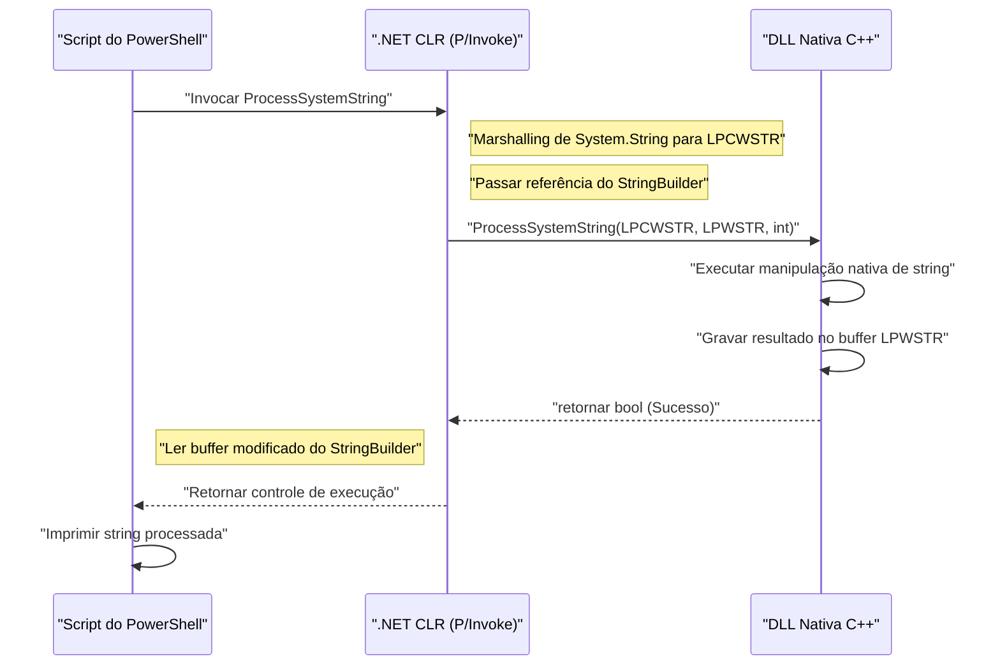
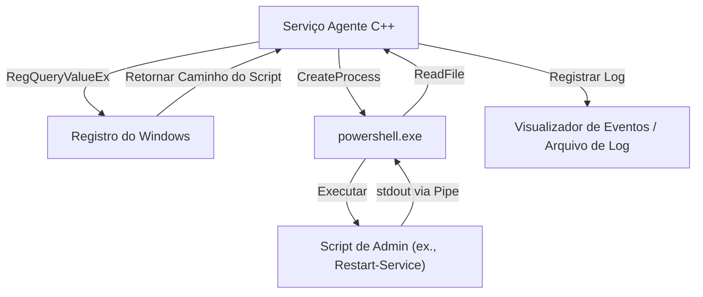

## Introdução

No gerenciamento e automação de sistemas Windows, o PowerShell tornou-se a ferramenta padrão de fato. Todas as tarefas, como o gerenciamento do Active Directory, operações do sistema de arquivos e modificações na configuração de rede, podem ser descritas através de scripts. No entanto, enquanto o PowerShell é incrivelmente versátil, existem cenários onde surgem dificuldades com as limitações de desempenho inerentes a linguagens de script e o acesso de nível muito baixo às APIs do Windows.

Aqui, uma "integração com C++" surge como uma solução poderosa. O C++ fornece velocidade de execução nativa e acesso completo à API Win32 e a objetos COM. Ao combinar a "alta produtividade e flexibilidade" do PowerShell com o "desempenho esmagador e controle de baixo nível" do C++, torna-se possível otimizar tarefas de gerenciamento de sistemas extremamente complexas e de grande escala em ambientes corporativos.

Neste artigo, explicaremos de forma muito detalhada as arquiteturas específicas, os métodos de implementação e as melhores práticas para gerenciamento de memória e conversão de strings para integrar bidirecionalmente o PowerShell e o C++.

## Por que integrar o PowerShell com o C++?

### 1. Superando as limitações de desempenho

O PowerShell possui elementos de uma linguagem interpretada e tipada dinamicamente que é executada no .NET Framework (ou .NET Core / .NET). Portanto, ao executar o processamento de grandes volumes de texto, operações complexas de criptografia, ou a análise de logs de eventos abrangendo milhões de linhas, a velocidade de execução e o consumo de memória podem se tornar gargalos.

Vamos considerar os modelos de complexidade computacional e tempo de processamento. Se assumirmos o tempo total de processamento da tarefa como $T_{total}$, o tempo de processamento usando o PowerShell de forma autônoma e o tempo de processamento ao transferir a carga (offload) para o C++ podem ser formulados da seguinte forma:

$$ T_{total}^{(PS)} = N \times (t_{overhead} + t_{compute}^{(PS)}) $$

$$ T_{total}^{(C++)} = t_{interop} + N \times t_{compute}^{(C++)} $$

Aqui, $N$ é o número de elementos a serem processados, $t_{overhead}$ é a sobrecarga associada ao processamento de loop do PowerShell, $t_{compute}$ é o tempo de computação puro por elemento, e $t_{interop}$ é a sobrecarga da chamada de fronteira por métodos como o P/Invoke.

Se $N$ for suficientemente grande, visto que $t_{overhead} \gg 0$ e $t_{compute}^{(PS)} > t_{compute}^{(C++)}$, mesmo pagando o $t_{interop}$ inicial, delegar (transferir) o processamento para o C++ reduz drasticamente a latência geral.

### 2. Acesso à API nativa do Win32

Embora seja possível invocar APIs do Win32 diretamente do PowerShell usando `Add-Type` via C#, é muito difícil definir APIs que envolvam estruturas complexas ou funções de retorno de chamada (callbacks) (ex.: controle de drivers de mini-filtro, operações avançadas de memória de processos) diretamente em C# / PowerShell. Ao criar uma DLL nativa encapsulada em C++ e invocá-la a partir do PowerShell, você permite um controle de sistema de tipo seguro e robusto.

## Chamando uma DLL nativa C++ a partir do PowerShell

O padrão de integração mais comum é implementar processos pesados ou processos específicos do sistema como uma DLL C++ e chamá-la a partir de um script do PowerShell.

### Implementação da DLL no lado do C++ (API do Win32 e lógica customizada)

Primeiro, criaremos uma DLL C++ com funções de exportação que podem ser invocadas pelo PowerShell. Aqui, mostramos um código C++ simples assumindo "uma função que executa criptografia/descriptografia em larga escala de dados de string, ou cálculos complexos de hash" como exemplo.

```cpp
// NativeLib.cpp
#include <windows.h>
#include <string>

// Especifica ligação C e __stdcall para facilitar a chamada via P/Invoke
extern "C" {

    __declspec(dllexport) int __stdcall ComputeHeavyTask(int multiplier, int dataSize) {
        int result = 0;
        // Simulação intencional de um processo pesado
        for (int i = 0; i < dataSize; ++i) {
            result += (i % multiplier);
        }
        return result;
    }

    // Função que processa strings (Usa LPWSTR para suporte ao Unicode)
    __declspec(dllexport) bool __stdcall ProcessSystemString(LPCWSTR inputString, LPWSTR outputBuffer, int bufferSize) {
        if (inputString == nullptr || outputBuffer == nullptr) {
            return false;
        }

        std::wstring str(inputString);
        // Algum processamento de string complexo (ex: adicionar um identificador de sistema)
        std::wstring result = L"PROCESSED_" + str;

        if (result.length() >= (size_t)bufferSize) {
            return false; // Prevenção contra buffer overrun
        }

        wcscpy_s(outputBuffer, bufferSize, result.c_str());
        return true;
    }
}
```

### Gerenciamento de Memória e Conversão de Strings (`BSTR`, `LPWSTR`)

Ao trocar dados entre o C++ e o PowerShell (.NET), os aspectos mais críticos a serem observados são a **codificação de strings** e o **gerenciamento de memória**.

- **`LPCWSTR` / `LPWSTR`**: Ponteiro de string larga do C/C++ (UTF-16LE). É usado de forma padrão nas funções com o sufixo `W` da API do Windows. No P/Invoke, ao especificar `CharSet = CharSet.Unicode`, a organização e conversão (marshaling) com o `String` ou `StringBuilder` do .NET são feitas automaticamente.
- **`BSTR`**: String larga com prefixo de comprimento usada no COM (Component Object Model). A memória precisa ser gerenciada com `SysAllocString` e `SysFreeString`. No P/Invoke, isso é especificado com `[MarshalAs(UnmanagedType.BStr)]`.

Ao alocar memória nova no lado do C++ e devolvê-la ao PowerShell, surge a questão de quem liberará essa memória (propriedade). Na função `ProcessSystemString` acima, adotamos o padrão usual da API Win32: "O C++ escreve o resultado num buffer (`outputBuffer`) previamente alocado pelo chamador (PowerShell)". Com isso, podemos evitar vazamentos de memória (memory leaks).

### `Add-Type` e P/Invoke no lado do PowerShell

Uma vez compilada a DLL C++ (`NativeLib.dll`), nós a chamaremos a partir do script do PowerShell. Usaremos `Add-Type` para compilar dinamicamente e utilizar assinaturas do P/Invoke em C#.

```powershell
# PowerShell Script: Invoke-NativeDLL.ps1

$signature = @'
using System;
using System.Runtime.InteropServices;
using System.Text;

public class NativeInterop
{
    // Define a ComputeHeavyTask do C++
    [DllImport("NativeLib.dll", CallingConvention = CallingConvention.StdCall)]
    public static extern int ComputeHeavyTask(int multiplier, int dataSize);

    // Define a ProcessSystemString do C++
    [DllImport("NativeLib.dll", CharSet = CharSet.Unicode, CallingConvention = CallingConvention.StdCall)]
    public static extern bool ProcessSystemString(string inputString, StringBuilder outputBuffer, int bufferSize);
}
'@

# Compila e adiciona o código C# à sessão do PowerShell
Add-Type -TypeDefinition $signature -PassThru | Out-Null

# 1. Chamada de computação numérica pesada
$result = [NativeInterop]::ComputeHeavyTask(7, 100000000)
Write-Host "Compute Task Result: $result"

# 2. Chamada de processamento de string
$input = "SYSTEM_NODE_001"
$bufferSize = 256
# Usa StringBuilder como buffer para permitir que o C++ escreva nele
$outputBuffer = New-Object System.Text.StringBuilder -ArgumentList $bufferSize

$success = [NativeInterop]::ProcessSystemString($input, $outputBuffer, $bufferSize)

if ($success) {
    Write-Host "Processed String: $($outputBuffer.ToString())"
} else {
    Write-Host "String processing failed." -ForegroundColor Red
}
```

### Visualização da Arquitetura

O diagrama de sequência a seguir ilustra o fluxo de chamadas e a troca de memória do PowerShell para a DLL C++.



## Chamando o PowerShell a partir do C++

Agora veremos a abordagem oposta. Existem casos em que queremos executar dinamicamente um script do PowerShell e recuperar seus resultados de dentro de um serviço de sistema ou aplicativo desktop construído em C++. Por exemplo, em um cenário onde um agente de monitoramento em C++ detecta uma anomalia específica e executa um script de reparo no PowerShell.

Existem principalmente duas abordagens:
1. **Início de Processo (`CreateProcess` / `_popen`)**: Um método que inicia o `powershell.exe` como um processo independente e conecta as entradas e saídas padrão (I/O) utilizando canais (pipes).
2. **API de Hospedagem do PowerShell (via C++/CLI)**: Um método para hospedar o runtime do PowerShell dentro do mesmo processo.

Neste artigo, explicaremos o método do **CreateProcess usando pipes (canais)**, que é o mais robusto e versátil em programação de sistemas.

### Execução via CreateProcess e Pipes Anônimos

O código C++ a seguir cria pipes anônimos (Anonymous Pipes), inicia o `powershell.exe` como um processo filho para executar um script e lê o resultado da saída padrão.

```cpp
#include <windows.h>
#include <iostream>
#include <string>
#include <vector>

std::string ExecutePowerShellScript(const std::string& script) {
    HANDLE hReadPipe, hWritePipe;
    SECURITY_ATTRIBUTES sa;
    sa.nLength = sizeof(SECURITY_ATTRIBUTES);
    sa.bInheritHandle = TRUE; // Permitir que o processo filho herde o identificador do pipe
    sa.lpSecurityDescriptor = NULL;

    // 1. Criação do pipe
    if (!CreatePipe(&hReadPipe, &hWritePipe, &sa, 0)) {
        return "Error: CreatePipe failed.";
    }

    // 2. Configurar as informações de inicialização do processo filho (PowerShell)
    STARTUPINFOA si;
    ZeroMemory(&si, sizeof(STARTUPINFOA));
    si.cb = sizeof(STARTUPINFOA);
    si.dwFlags = STARTF_USESTDHANDLES | STARTF_USESHOWWINDOW;
    si.hStdOutput = hWritePipe;
    si.hStdError = hWritePipe;
    si.wShowWindow = SW_HIDE; // Ocultar a janela

    PROCESS_INFORMATION pi;
    ZeroMemory(&pi, sizeof(PROCESS_INFORMATION));

    // Construção da linha de comando (Versão simplificada evitando base64 com política Bypass)
    std::string cmd = "powershell.exe -NoProfile -NonInteractive -Command \"" + script + "\"";
    std::vector<char> cmdBuffer(cmd.begin(), cmd.end());
    cmdBuffer.push_back('\0');

    // 3. Criação do processo
    if (!CreateProcessA(NULL, cmdBuffer.data(), NULL, NULL, TRUE, 0, NULL, NULL, &si, &pi)) {
        CloseHandle(hReadPipe);
        CloseHandle(hWritePipe);
        return "Error: CreateProcess failed.";
    }

    // O pipe de escrita não é necessário no lado do processo pai, então o fechamos (se não fechado, a leitura será bloqueada)
    CloseHandle(hWritePipe);

    // 4. Lendo o resultado
    std::string output = "";
    DWORD bytesRead;
    char buffer[4096];

    while (ReadFile(hReadPipe, buffer, sizeof(buffer) - 1, &bytesRead, NULL) && bytesRead > 0) {
        buffer[bytesRead] = '\0';
        output += buffer;
    }

    // 5. Limpeza
    WaitForSingleObject(pi.hProcess, INFINITE);
    CloseHandle(pi.hProcess);
    CloseHandle(pi.hThread);
    CloseHandle(hReadPipe);

    return output;
}

int main() {
    // Comando para obter a lista de processos no PowerShell e ordená-los pelo uso da CPU
    std::string psCommand = "Get-Process | Sort-Object CPU -Descending | Select-Object -First 5 | Format-Table Name, CPU, Id";
    
    std::cout << "Executing PowerShell from C++..." << std::endl;
    std::string result = ExecutePowerShellScript(psCommand);
    
    std::cout << "Result:\n" << result << std::endl;
    return 0;
}
```

### Integração do Registro do Windows e PowerShell

Ao executar scripts a partir do C++, deve-se evitar colocar configurações dinâmicas e caminhos de execução fixados no código (hardcoding). Na maioria dos casos, os aplicativos C++ lêem as configurações do **Registro do Windows**.

Uma arquitetura na qual o lado C++ usa `RegOpenKeyEx` e `RegQueryValueEx` para obter o caminho do script do PowerShell de `HKLM\SOFTWARE\MyApp` e passa-o como argumento para o `CreateProcess` acima é a preferida em sistemas corporativos.



## Análise de Desempenho e as Vantagens do Offloading

Por que adotamos uma arquitetura tão complexa? Considere um cenário prático: "analisar arquivos de log personalizados do IIS de vários gigabytes de tamanho".

Quando usamos o `Get-Content` no PowerShell para analisar linha por linha usando expressões regulares, uma grande quantidade de tempo de CPU é gasta devido à geração de objetos e a sobrecarga (overhead) de coleta de lixo (Garbage Collection - GC).

O número de alocações de memória $A$ e o número de vezes que a GC é acionada $G$ são proporcionais durante a execução do script conforme abaixo:

$$ G \propto \sum_{i=1}^{N} A_i $$

Quando a carga de processamento é transferida para código nativo em C++, pode-se usar o mapeamento de memória (`CreateFileMapping`, `MapViewOfFile`) para carregar o arquivo inteiro diretamente na memória, pesquisando a string através de aritmética de ponteiro sem realizar cópias (Zero-copy). Nesse caso, a sobrecarga associada à criação de objetos torna-se virtualmente zero e o parsing é completado em velocidades próximas ao limite de largura de banda de memória teórica.

Ao retornar apenas o resultado da análise (ex.: uma lista de endereços IP maliciosos) para o PowerShell, o custo do marshaling de P/Invoke também é reduzido ao mínimo.

## Cenários Práticos de Automação de Gerenciamento de Sistemas

### Cenário 1: Varredura de sistema de arquivos rápida e modificações de permissão

A tarefa de extrair arquivos com extensões específicas e com ACLs (Access Control Lists) específicas e modificar as permissões em massa, num servidor de arquivos de grande escala.
- **Função do C++**: Usar `FindFirstFile` / `FindNextFile` em conjunto com multithreading para atravessar a árvore de diretórios numa velocidade extremamente alta, gerando a lista dos caminhos de arquivos que correspondem à condição.
- **Função do PowerShell**: Para a lista recebida do C++, usar `Set-Acl` para aplicar os privilégios em massa (ou processar essas mudanças integrando-se ao Active Directory).

### Cenário 2: Coleta de informações de hardware únicas

Monitorar informações de dispositivos de hardware exclusivos (ex.: cartões PCIe especiais ou sensores) que não podem ser extraídos via WMI (Windows Management Instrumentation) ou CIM (Common Information Model).
- **Função do C++**: Uma DLL que efetua chamadas `DeviceIoControl` ao driver do dispositivo para adquirir e analisar dados binários.
- **Função do PowerShell**: Invoca a DLL periodicamente, formata os resultados da análise para JSON e envia à API REST do servidor de monitoramento.

## Melhores Práticas para Gerenciamento de Memória e Solução de Problemas

Na integração de ambas as tecnologias, os bugs mais comumente encontrados são **Vazamentos de Memória (Memory Leaks)** e **Violações de Acesso (Access Violation: 0xC0000005)**.

1. **Período de validade dos ponteiros**: Quando o lado do PowerShell passa `[ref]` ou `StringBuilder`, o P/Invoke fixa (Pin) aquela porção da memória apenas durante a chamada. O lado do C++ não pode salvar esse ponteiro numa variável global e acessá-lo mais tarde. Para realizar retornos de chamada (callbacks) assíncronos, é necessário usar um `GCHandle` para travar a memória de forma explícita.
2. **Tamanho do ponteiro em ambientes 64-bit**: No Windows moderno, a arquitetura fundamental é o 64-bit (x64). O tamanho dos ponteiros no lado C++ é de 8 bytes e o `IntPtr` deve ser usado no lado do PowerShell (.NET). Uma vez que um `long` no C++ no Windows tem 4 bytes, códigos legados que moldam ponteiros (cast) num `long` na transferência causarão travamentos de sistema.
3. **Incompatibilidade na codificação das strings**: O PowerShell utiliza UTF-16 internamente. Tentar recebê-la como uma string ANSI no lado do C++ (`std::string`, `char*`) ocasionará em problemas com caracteres embaralhados. Sempre utilize strings largas (`std::wstring`, `wchar_t*`) e configure o `CharSet = CharSet.Unicode` no lado do P/Invoke.

## Conclusão

A integração do PowerShell com o C++ é a combinação suprema que une a conveniência de uma linguagem de scripts e a força bruta das linguagens nativas na automação de gerenciamento de sistemas.

Através da execução de uma DLL C++ utilizando o P/Invoke, tarefas de intensa computação podem ser transferidas (offload), cortando drasticamente os tempos de execução. Por outro lado, utilizando os extensos módulos de gerenciamento de sistema do PowerShell por meio da invocação de processos e pipelines via um aplicativo C++, você conseguirá uma grande redução de custo no desenvolvimento.

Apesar da importância e cautela que o gerenciamento de memória e conversão de strings na fronteira de comunicação requer, ao dominar os padrões de arquitetura e técnicas de implementação exemplificadas neste artigo, você será capaz de montar ferramentas de gerenciamento de sistemas Windows ainda mais sofisticadas e robustas.

---

*Neste blog de tecnologia, vamos continuar cobrindo tópicos profundos em relação às estruturas internas do Windows e automações avançadas. Se houver alguma pergunta ou feedback, fique à vontade para escrever na sessão de comentários.*
