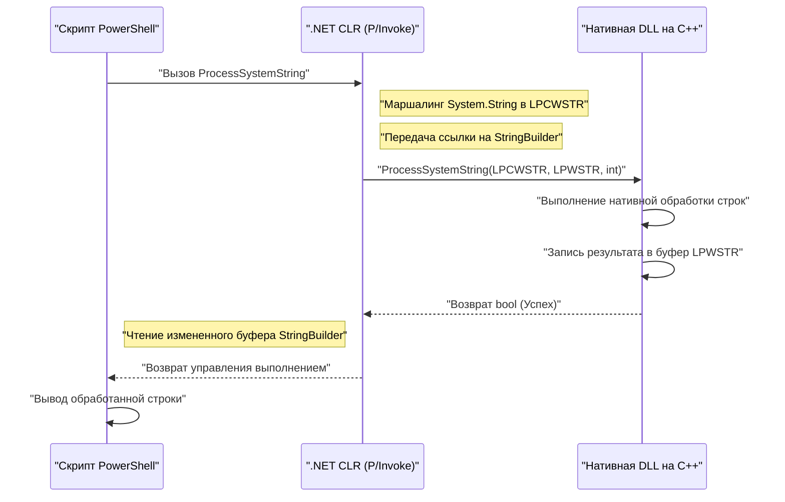
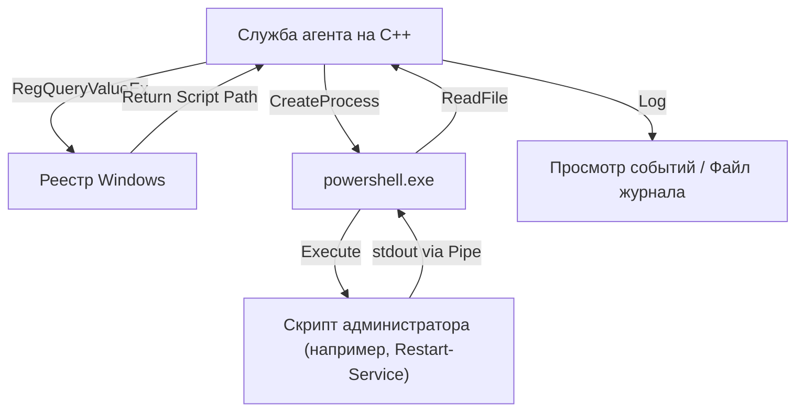

## Введение

В системном администрировании и автоматизации Windows PowerShell стал стандартом де-факто. Управление Active Directory, манипуляции с файловой системой, изменение конфигурации сети — любую задачу можно описать скриптом. Однако, несмотря на универсальность PowerShell, существуют ситуации, когда приходится сталкиваться с ограничениями производительности, свойственными скриптовым языкам, или с трудностями при доступе к низкоуровневым API Windows.

Мощным решением в таких случаях является «интеграция с C++». C++ обеспечивает нативную скорость выполнения и полный доступ к Win32 API и COM-объектам. Объединение «высокой производительности и гибкости» PowerShell с «потрясающей производительностью и низкоуровневым контролем» C++ позволяет оптимизировать чрезвычайно сложные и масштабные задачи управления системами в корпоративных средах.

В этой статье мы подробно рассмотрим конкретную архитектуру, методы реализации, а также лучшие практики управления памятью и преобразования строк для двусторонней интеграции PowerShell и C++.

## Зачем интегрировать PowerShell и C++?

### 1. Преодоление ограничений производительности

PowerShell обладает элементами интерпретируемого и динамически типизированного языка, работающего на платформе .NET Framework (или .NET Core / .NET). Поэтому при массовой обработке текста, сложном шифровании или анализе журналов событий, состоящих из миллионов строк, скорость выполнения и потребление памяти могут стать узким местом.

Рассмотрим модель сложности вычислений и времени обработки. Если общее время обработки задачи обозначить как $T_{total}$, то время обработки только в PowerShell и время обработки при переносе на C++ можно выразить следующими формулами:

$$ T_{total}^{(PS)} = N \times (t_{overhead} + t_{compute}^{(PS)}) $$

$$ T_{total}^{(C++)} = t_{interop} + N \times t_{compute}^{(C++)} $$

Где $N$ — количество обрабатываемых элементов, $t_{overhead}$ — накладные расходы на выполнение циклов в PowerShell, $t_{compute}$ — чистое время вычислений для одного элемента, а $t_{interop}$ — накладные расходы на вызов через границы, например, с помощью P/Invoke.

Когда $N$ достаточно велико, $t_{overhead} \gg 0$ и $t_{compute}^{(PS)} > t_{compute}^{(C++)}$, поэтому, даже заплатив первоначальную цену $t_{interop}$, делегирование (оффлоадинг) обработки в C++ кардинально снижает общую задержку.

### 2. Доступ к нативным Win32 API

Хотя в PowerShell можно вызывать Win32 API через C# с помощью `Add-Type`, определять API со сложными структурами и функциями обратного вызова (например, управление драйверами мини-фильтров, расширенные операции с памятью процессов) непосредственно в C# / PowerShell очень сложно. Создание нативной DLL-обертки на C++ и ее вызов из PowerShell позволяет осуществлять безопасное для типов и надежное управление системой.

## Вызов нативной C++ DLL из PowerShell

Наиболее распространенный шаблон интеграции — реализация ресурсоемких или системно-зависимых процессов в виде C++ DLL, которая затем вызывается из скрипта PowerShell.

### Реализация DLL на стороне C++ (Win32 API и пользовательская логика)

Сначала создайте C++ DLL с экспортируемыми функциями, которые можно вызвать из PowerShell. Здесь в качестве примера приведен простой код на C++, предполагающий функцию, которая выполняет «шифрование/дешифрование больших объемов строковых данных или сложные вычисления хэшей».

```cpp
// NativeLib.cpp
#include <windows.h>
#include <string>

// Указываем C-связывание и __stdcall для облегчения вызова через P/Invoke
extern "C" {

    __declspec(dllexport) int __stdcall ComputeHeavyTask(int multiplier, int dataSize) {
        int result = 0;
        // Симуляция намеренно тяжелой обработки
        for (int i = 0; i < dataSize; ++i) {
            result += (i % multiplier);
        }
        return result;
    }

    // Функция для обработки строк (используем LPWSTR для поддержки Unicode)
    __declspec(dllexport) bool __stdcall ProcessSystemString(LPCWSTR inputString, LPWSTR outputBuffer, int bufferSize) {
        if (inputString == nullptr || outputBuffer == nullptr) {
            return false;
        }

        std::wstring str(inputString);
        // Какая-то сложная обработка строк (например, добавление системного идентификатора)
        std::wstring result = L"PROCESSED_" + str;

        if (result.length() >= (size_t)bufferSize) {
            return false; // Предотвращение переполнения буфера
        }

        wcscpy_s(outputBuffer, bufferSize, result.c_str());
        return true;
    }
}
```

### Управление памятью и преобразование строк (`BSTR`, `LPWSTR`)

При обмене данными между C++ и PowerShell (.NET) самое важное, на что следует обратить внимание, — это **кодировка строк** и **управление памятью**.

- **`LPCWSTR` / `LPWSTR`**: Указатель на широкую строку C/C++ (UTF-16LE). Стандартно используется в `W` версиях функций Windows API. Указав `CharSet = CharSet.Unicode` в P/Invoke, он автоматически маршалируется с `String` или `StringBuilder` в .NET.
- **`BSTR`**: Широкая строка с префиксом длины, используемая в COM (Component Object Model). Необходимо управлять памятью с помощью `SysAllocString` и `SysFreeString`. В P/Invoke указывается `[MarshalAs(UnmanagedType.BStr)]`.

Когда на стороне C++ выделяется новая память и возвращается стороне PowerShell, возникает вопрос о том, кто будет освобождать эту память (владение). В приведенной выше функции `ProcessSystemString` используется стандартный шаблон Win32 API: «вызывающая сторона (PowerShell) предварительно выделяет буфер (`outputBuffer`), в который C++ записывает результат». Это позволяет предотвратить утечки памяти.

### `Add-Type` и P/Invoke на стороне PowerShell

После компиляции C++ DLL (`NativeLib.dll`), вызовите её из скрипта PowerShell. Мы будем динамически компилировать и использовать P/Invoke сигнатуры C# с помощью `Add-Type`.

```powershell
# PowerShell Script: Invoke-NativeDLL.ps1

$signature = @'
using System;
using System.Runtime.InteropServices;
using System.Text;

public class NativeInterop
{
    // Определение C++ ComputeHeavyTask
    [DllImport("NativeLib.dll", CallingConvention = CallingConvention.StdCall)]
    public static extern int ComputeHeavyTask(int multiplier, int dataSize);

    // Определение C++ ProcessSystemString
    [DllImport("NativeLib.dll", CharSet = CharSet.Unicode, CallingConvention = CallingConvention.StdCall)]
    public static extern bool ProcessSystemString(string inputString, StringBuilder outputBuffer, int bufferSize);
}
'@

# Компиляция и добавление C# кода в сессию PowerShell
Add-Type -TypeDefinition $signature -PassThru | Out-Null

# 1. Вызов ресурсоемких численных вычислений
$result = [NativeInterop]::ComputeHeavyTask(7, 100000000)
Write-Host "Compute Task Result: $result"

# 2. Вызов обработки строк
$input = "SYSTEM_NODE_001"
$bufferSize = 256
# Использование StringBuilder в качестве буфера для записи на стороне C++
$outputBuffer = New-Object System.Text.StringBuilder -ArgumentList $bufferSize

$success = [NativeInterop]::ProcessSystemString($input, $outputBuffer, $bufferSize)

if ($success) {
    Write-Host "Processed String: $($outputBuffer.ToString())"
} else {
    Write-Host "String processing failed." -ForegroundColor Red
}
```

### Визуализация архитектуры

Следующая диаграмма последовательности иллюстрирует поток вызовов и обмен памятью между PowerShell и C++ DLL.



## Вызов PowerShell из C++

Теперь рассмотрим обратный подход. Бывают случаи, когда необходимо динамически выполнять скрипты PowerShell и получать результаты из системных служб или десктопных приложений, созданных на C++. Например, когда C++ агент мониторинга обнаруживает определенную аномалию и выполняет скрипт PowerShell для восстановления.

Существует два основных подхода:
1. **Запуск процесса (`CreateProcess` / `_popen`)**: Запуск `powershell.exe` как независимого процесса и соединение стандартного ввода/вывода через каналы (pipes).
2. **PowerShell Hosting API (через C++/CLI)**: Хостинг среды выполнения PowerShell в рамках одного процесса.

В этой статье мы объясним метод с использованием **CreateProcess и анонимных каналов**, который является наиболее надежным и универсальным в системном программировании.

### Выполнение с использованием CreateProcess и анонимных каналов

Следующий C++ код создает анонимные каналы (Anonymous Pipes), запускает `powershell.exe` как дочерний процесс для выполнения скрипта и считывает результат из стандартного вывода.

```cpp
#include <windows.h>
#include <iostream>
#include <string>
#include <vector>

std::string ExecutePowerShellScript(const std::string& script) {
    HANDLE hReadPipe, hWritePipe;
    SECURITY_ATTRIBUTES sa;
    sa.nLength = sizeof(SECURITY_ATTRIBUTES);
    sa.bInheritHandle = TRUE; // Наследование дескрипторов каналов дочерним процессом
    sa.lpSecurityDescriptor = NULL;

    // 1. Создание канала
    if (!CreatePipe(&hReadPipe, &hWritePipe, &sa, 0)) {
        return "Error: CreatePipe failed.";
    }

    // 2. Настройка информации о запуске дочернего процесса (PowerShell)
    STARTUPINFOA si;
    ZeroMemory(&si, sizeof(STARTUPINFOA));
    si.cb = sizeof(STARTUPINFOA);
    si.dwFlags = STARTF_USESTDHANDLES | STARTF_USESHOWWINDOW;
    si.hStdOutput = hWritePipe;
    si.hStdError = hWritePipe;
    si.wShowWindow = SW_HIDE; // Скрытие окна

    PROCESS_INFORMATION pi;
    ZeroMemory(&pi, sizeof(PROCESS_INFORMATION));

    // Построение командной строки (упрощенная версия с политикой Bypass во избежание Base64 кодирования и т.д.)
    std::string cmd = "powershell.exe -NoProfile -NonInteractive -Command \"" + script + "\"";
    std::vector<char> cmdBuffer(cmd.begin(), cmd.end());
    cmdBuffer.push_back('\0');

    // 3. Создание процесса
    if (!CreateProcessA(NULL, cmdBuffer.data(), NULL, NULL, TRUE, 0, NULL, NULL, &si, &pi)) {
        CloseHandle(hReadPipe);
        CloseHandle(hWritePipe);
        return "Error: CreateProcess failed.";
    }

    // Закрытие канала записи в родительском процессе, так как он больше не нужен (если не закрыть, чтение заблокируется)
    CloseHandle(hWritePipe);

    // 4. Чтение результата
    std::string output = "";
    DWORD bytesRead;
    char buffer[4096];

    while (ReadFile(hReadPipe, buffer, sizeof(buffer) - 1, &bytesRead, NULL) && bytesRead > 0) {
        buffer[bytesRead] = '\0';
        output += buffer;
    }

    // 5. Очистка
    WaitForSingleObject(pi.hProcess, INFINITE);
    CloseHandle(pi.hProcess);
    CloseHandle(pi.hThread);
    CloseHandle(hReadPipe);

    return output;
}

int main() {
    // Команда PowerShell для получения списка процессов и сортировки по загрузке CPU
    std::string psCommand = "Get-Process | Sort-Object CPU -Descending | Select-Object -First 5 | Format-Table Name, CPU, Id";
    
    std::cout << "Executing PowerShell from C++..." << std::endl;
    std::string result = ExecutePowerShellScript(psCommand);
    
    std::cout << "Result:\n" << result << std::endl;
    return 0;
}
```

### Интеграция реестра Windows и PowerShell

При выполнении скриптов из C++ следует избегать жесткого кодирования динамических настроек и путей выполнения. Во многих случаях C++ приложение считывает настройки из **реестра Windows**.

В корпоративных системах предпочтительной является архитектура, в которой C++ использует `RegOpenKeyEx` и `RegQueryValueEx` для получения пути к PowerShell-скрипту из `HKLM\SOFTWARE\MyApp` и передачи его в качестве аргумента в `CreateProcess`, как показано выше.



## Анализ производительности и преимущества оффлоадинга

Почему используется такая сложная архитектура? В качестве конкретного сценария рассмотрим «парсинг пользовательских файлов журналов IIS объемом несколько гигабайт».

Если использовать `Get-Content` в PowerShell и анализировать построчно с помощью регулярных выражений, генерация объектов и накладные расходы на сборку мусора (GC) приведут к огромному потреблению процессорного времени.

Количество выделений памяти $A$ и количество запусков сборщика мусора $G$ при выполнении скрипта пропорциональны следующим образом:

$$ G \propto \sum_{i=1}^{N} A_i $$

В случае переноса обработки в нативный код C++, мы можем использовать отображение файлов в память (`CreateFileMapping`, `MapViewOfFile`), чтобы развернуть весь файл непосредственно в памяти, и осуществлять поиск строк без копирования (Zero-copy) с помощью арифметики указателей. В этом случае накладные расходы, связанные с созданием объектов, фактически сводятся к нулю, а парсинг завершается со скоростью, близкой к теоретическому пределу пропускной способности памяти.

Возвращая в PowerShell только результаты парсинга (например, список IP-адресов несанкционированного доступа), можно также минимизировать затраты на маршалинг P/Invoke.

## Практические сценарии автоматизации системного администрирования

### Сценарий 1: Быстрое сканирование файловой системы и изменение прав доступа

На крупном файловом сервере — задача извлечения файлов с определенным расширением и установленным ACL (списком контроля доступа) и массового изменения их прав.
- **Роль C++**: Сверхбыстрый обход дерева каталогов с использованием `FindFirstFile` / `FindNextFile` и многопоточности для генерации списка путей к файлам, соответствующих условиям.
- **Роль PowerShell**: Применение изменения прав ко всему полученному из C++ списку с использованием `Set-Acl` (или обработка, связанная с Active Directory).

### Сценарий 2: Сбор пользовательской информации об оборудовании

Мониторинг информации о специфических аппаратных устройствах (например, специализированных картах PCIe или датчиках), которую невозможно получить через WMI (Windows Management Instrumentation) или CIM (Common Information Model).
- **Роль C++**: DLL, которая выполняет вызовы `DeviceIoControl` к драйверу устройства, собирая и анализируя бинарные данные.
- **Роль PowerShell**: Периодический вызов DLL, форматирование результатов анализа в JSON и их отправка в REST API сервера мониторинга.

## Лучшие практики управления памятью и устранения неполадок

Наиболее частыми ошибками при интеграции являются **утечки памяти** и **нарушения доступа (Access Violation: 0xC0000005)**.

1. **Время жизни указателя**: При передаче `[ref]` или `StringBuilder` из PowerShell, P/Invoke фиксирует (Pin) эту память только во время вызова. Вы не должны сохранять этот указатель в глобальной переменной на стороне C++ и обращаться к нему позже. Если вы выполняете асинхронные обратные вызовы, необходимо явно фиксировать память с помощью `GCHandle`.
2. **Размер указателя в 64-битных средах**: Современные Windows по умолчанию 64-битные (x64). Размер указателя на стороне C++ составляет 8 байт, поэтому на стороне PowerShell (.NET) необходимо использовать `IntPtr`. Поскольку `long` в C++ в Windows имеет размер 4 байта, старый код, в котором указатели приводятся к `long` и передаются, будет вызывать сбои.
3. **Несоответствие кодировки строк**: Внутри PowerShell используется UTF-16. Попытка принять строки как ANSI (`std::string`, `char*`) на стороне C++ приведет к искажению символов. Обязательно используйте широкие строки (`std::wstring`, `wchar_t*`) и указывайте `CharSet = CharSet.Unicode` на стороне P/Invoke.

## Заключение

Интеграция PowerShell и C++ — это идеальное сочетание, объединяющее простоту скриптового языка с мощью нативного языка для автоматизации системного администрирования.

Вызов C++ DLL с помощью P/Invoke позволяет перенести (оффлоадить) вычислительно сложные задачи и кардинально сократить время выполнения. И наоборот, использование мощных модулей системного администрирования PowerShell через запуск процессов или пайплайны из C++ приложений позволяет значительно снизить затраты на разработку.

Хотя необходимо уделять внимание управлению памятью и преобразованию строк на границах взаимодействия, освоение архитектурных шаблонов и методов реализации, представленных в этой статье, позволит вам создавать более продвинутые и надежные инструменты управления системами Windows.

---

*В этом техническом блоге мы продолжим освещать глубокие темы, касающиеся внутренних структур Windows и расширенной автоматизации. Если у вас есть вопросы или отзывы, пожалуйста, оставляйте их в комментариях.*
