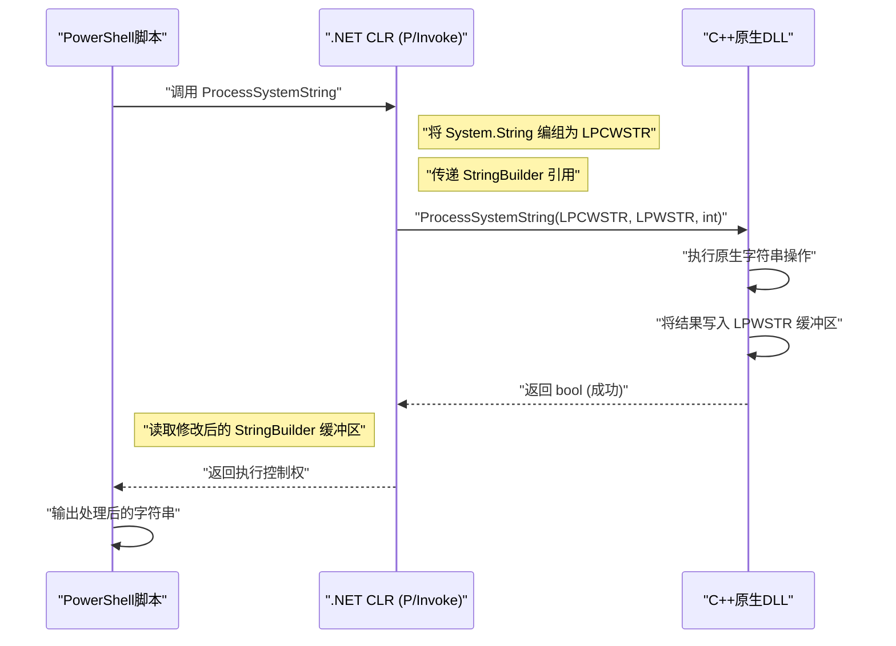
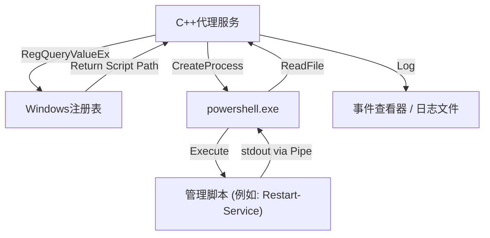

## 引言

在Windows的系统管理和自动化中，PowerShell已成为事实上的标准工具。无论是管理Active Directory、操作文件系统，还是更改网络配置，几乎所有的任务都可以通过脚本来编写。然而，尽管PowerShell非常全能，但它也存在脚本语言特有的性能瓶颈，而且在需要访问非常底层的Windows API时往往会显得力不从心。

此时，“与C++协作”便是一个强大的解决方案。C++不仅提供了原生的执行速度，还能完全访问Win32 API和COM对象。将PowerShell的“高生产力与灵活性”与C++的“压倒性的性能与底层控制”结合起来，就可以在企业环境中优化极其复杂且大规模的系统管理任务。

本文将非常详细地讲解如何实现PowerShell与C++的双向协作，包括具体的架构、实现手法，以及内存管理和字符串转换的最佳实践。

## 为什么需要让PowerShell与C++协作？

### 1. 突破性能极限

PowerShell具有解释型和动态类型的语言特性，运行在.NET Framework（或.NET Core / .NET）之上。因此，在进行海量文本处理、复杂的加密操作，或是解析数百万行的事件日志时，执行速度和内存消耗往往会成为瓶颈。

让我们考虑一下计算量与处理时间的模型。假设整个任务的处理时间为 $T_{total}$，那么仅使用PowerShell处理时的时间，以及将任务卸载（Offload）给C++处理时的时间，可以分别用以下公式表示：

$$ T_{total}^{(PS)} = N \times (t_{overhead} + t_{compute}^{(PS)}) $$

$$ T_{total}^{(C++)} = t_{interop} + N \times t_{compute}^{(C++)} $$

在这里，$N$ 是处理的元素数量，$t_{overhead}$ 是PowerShell在循环处理时产生的开销，$t_{compute}$ 是每个元素的纯计算时间，$t_{interop}$ 是通过P/Invoke等方式进行边界调用的开销。

当 $N$ 足够大时，由于 $t_{overhead} \gg 0$ 且 $t_{compute}^{(PS)} > t_{compute}^{(C++)}$，即使需要付出初始的 $t_{interop}$ 开销，将处理任务委托（卸载）给C++也能让整体延迟大幅降低。

### 2. 访问原生Win32 API

虽然PowerShell本身可以使用 `Add-Type` 通过C#来调用Win32 API，但如果API涉及复杂的结构体或回调函数（例如：控制微过滤驱动程序、高级进程内存操作等），在C#或PowerShell中直接定义它们将会非常困难。通过创建一个用C++封装的原生DLL，并从PowerShell中调用它，就能实现类型安全且可靠的系统控制。

## 从PowerShell调用C++原生DLL

最常见的协作模式是将繁重的处理或系统特定的操作实现为C++的DLL，然后从PowerShell脚本中调用它。

### C++端的DLL实现（Win32 API或自定义逻辑）

首先，创建一个具有可供PowerShell调用的导出函数的C++ DLL。在此我们以“对大规模字符串数据进行加解密，或执行复杂哈希计算的函数”为例，展示一段简单的C++代码。

```cpp
// NativeLib.cpp
#include <windows.h>
#include <string>

// P/Invokeで呼び出しやすいようにCリンケージと__stdcallを指定
extern "C" {

    __declspec(dllexport) int __stdcall ComputeHeavyTask(int multiplier, int dataSize) {
        int result = 0;
        // 意図的な重い処理のシミュレーション
        for (int i = 0; i < dataSize; ++i) {
            result += (i % multiplier);
        }
        return result;
    }

    // 文字列を処理する関数（Unicode対応のためLPWSTRを使用）
    __declspec(dllexport) bool __stdcall ProcessSystemString(LPCWSTR inputString, LPWSTR outputBuffer, int bufferSize) {
        if (inputString == nullptr || outputBuffer == nullptr) {
            return false;
        }

        std::wstring str(inputString);
        // 何らかの複雑な文字列処理（例：システム識別子の付与）
        std::wstring result = L"PROCESSED_" + str;

        if (result.length() >= (size_t)bufferSize) {
            return false; // バッファオーバーラン防止
        }

        wcscpy_s(outputBuffer, bufferSize, result.c_str());
        return true;
    }
}
```

### 内存管理与字符串转换（`BSTR`, `LPWSTR`）

在C++与PowerShell（.NET）之间交换数据时，最需要注意的是**字符串的编码**和**内存管理**。

- **`LPCWSTR` / `LPWSTR`**：C/C++的宽字符串指针（UTF-16LE）。在Windows API的 `W` 系列函数中被标准使用。在P/Invoke中，通过指定 `CharSet = CharSet.Unicode`，它可以与.NET的 `String` 或 `StringBuilder` 自动进行编组（Marshalling）。
- **`BSTR`**：在COM（Component Object Model）中使用的带有长度前缀的宽字符串。需要使用 `SysAllocString` 和 `SysFreeString` 来管理内存。在P/Invoke中需指定 `[MarshalAs(UnmanagedType.BStr)]`。

如果在C++端分配新内存并将其返回给PowerShell端，那么由谁来释放内存（所有权问题）就会成为一个难题。在上述的 `ProcessSystemString` 函数中，我们采用了Win32 API的标准模式，即“调用方（PowerShell）预先分配缓冲区（`outputBuffer`），然后由C++将结果写入其中”。这样可以有效防止内存泄漏。

### 在PowerShell端使用 `Add-Type` 和 P/Invoke

将C++的DLL（`NativeLib.dll`）编译完成后，就可以从PowerShell脚本中调用它了。我们将使用 `Add-Type` 动态编译C#的P/Invoke签名以供使用。

```powershell
# PowerShell Script: Invoke-NativeDLL.ps1

$signature = @'
using System;
using System.Runtime.InteropServices;
using System.Text;

public class NativeInterop
{
    // C++の ComputeHeavyTask を定義
    [DllImport("NativeLib.dll", CallingConvention = CallingConvention.StdCall)]
    public static extern int ComputeHeavyTask(int multiplier, int dataSize);

    // C++の ProcessSystemString を定義
    [DllImport("NativeLib.dll", CharSet = CharSet.Unicode, CallingConvention = CallingConvention.StdCall)]
    public static extern bool ProcessSystemString(string inputString, StringBuilder outputBuffer, int bufferSize);
}
'@

# C#のコードをPowerShellセッションにコンパイルして追加
Add-Type -TypeDefinition $signature -PassThru | Out-Null

# 1. 重い数値計算の呼び出し
$result = [NativeInterop]::ComputeHeavyTask(7, 100000000)
Write-Host "Compute Task Result: $result"

# 2. 文字列処理の呼び出し
$input = "SYSTEM_NODE_001"
$bufferSize = 256
# C++側に書き込ませるためのバッファとして StringBuilder を使用
$outputBuffer = New-Object System.Text.StringBuilder -ArgumentList $bufferSize

$success = [NativeInterop]::ProcessSystemString($input, $outputBuffer, $bufferSize)

if ($success) {
    Write-Host "Processed String: $($outputBuffer.ToString())"
} else {
    Write-Host "String processing failed." -ForegroundColor Red
}
```

### 架构的可视化

以下序列图展示了从PowerShell调用C++ DLL的流程以及内存的交互。



## 从C++调用PowerShell

这次是相反的方法。有时我们需要从用C++编写的系统服务或桌面应用程序中动态执行PowerShell脚本，并获取其结果。例如，当C++监控代理检测到特定异常时，执行PowerShell的修复脚本。

实现方法主要有两种：
1. **启动进程（`CreateProcess` / `_popen`）**：作为独立进程启动 `powershell.exe`，并通过管道连接标准输入输出的方法。
2. **PowerShell Hosting API（通过C++/CLI）**：在同一进程内托管PowerShell运行时的做法。

在本文中，我们将讲解在系统编程中最稳健且通用的**使用管道的 CreateProcess** 方式。

### 使用 CreateProcess 和匿名管道执行

以下C++代码将创建匿名管道（Anonymous Pipes），作为子进程启动 `powershell.exe` 以执行脚本，并从标准输出中读取结果。

```cpp
#include <windows.h>
#include <iostream>
#include <string>
#include <vector>

std::string ExecutePowerShellScript(const std::string& script) {
    HANDLE hReadPipe, hWritePipe;
    SECURITY_ATTRIBUTES sa;
    sa.nLength = sizeof(SECURITY_ATTRIBUTES);
    sa.bInheritHandle = TRUE; // パイプハンドルを子プロセスに継承させる
    sa.lpSecurityDescriptor = NULL;

    // 1. パイプの作成
    if (!CreatePipe(&hReadPipe, &hWritePipe, &sa, 0)) {
        return "Error: CreatePipe failed.";
    }

    // 2. 子プロセス（PowerShell）のスタートアップ情報の設定
    STARTUPINFOA si;
    ZeroMemory(&si, sizeof(STARTUPINFOA));
    si.cb = sizeof(STARTUPINFOA);
    si.dwFlags = STARTF_USESTDHANDLES | STARTF_USESHOWWINDOW;
    si.hStdOutput = hWritePipe;
    si.hStdError = hWritePipe;
    si.wShowWindow = SW_HIDE; // ウィンドウを隠す

    PROCESS_INFORMATION pi;
    ZeroMemory(&pi, sizeof(PROCESS_INFORMATION));

    // コマンドラインの構築 (BypassポリシーでBase64エンコード等を避ける簡略版)
    std::string cmd = "powershell.exe -NoProfile -NonInteractive -Command \"" + script + "\"";
    std::vector<char> cmdBuffer(cmd.begin(), cmd.end());
    cmdBuffer.push_back('\0');

    // 3. プロセスの作成
    if (!CreateProcessA(NULL, cmdBuffer.data(), NULL, NULL, TRUE, 0, NULL, NULL, &si, &pi)) {
        CloseHandle(hReadPipe);
        CloseHandle(hWritePipe);
        return "Error: CreateProcess failed.";
    }

    // 親プロセス側では書き込みパイプは不要なので閉じる（閉じないとReadがブロックされる）
    CloseHandle(hWritePipe);

    // 4. 結果の読み取り
    std::string output = "";
    DWORD bytesRead;
    char buffer[4096];

    while (ReadFile(hReadPipe, buffer, sizeof(buffer) - 1, &bytesRead, NULL) && bytesRead > 0) {
        buffer[bytesRead] = '\0';
        output += buffer;
    }

    // 5. クリーンアップ
    WaitForSingleObject(pi.hProcess, INFINITE);
    CloseHandle(pi.hProcess);
    CloseHandle(pi.hThread);
    CloseHandle(hReadPipe);

    return output;
}

int main() {
    // PowerShellでプロセス一覧を取得し、CPU使用率でソートするコマンド
    std::string psCommand = "Get-Process | Sort-Object CPU -Descending | Select-Object -First 5 | Format-Table Name, CPU, Id";
    
    std::cout << "Executing PowerShell from C++..." << std::endl;
    std::string result = ExecutePowerShellScript(psCommand);
    
    std::cout << "Result:\n" << result << std::endl;
    return 0;
}
```

### Windows注册表与PowerShell的协作

从C++执行脚本时，应避免硬编码动态配置值或执行路径。在大多数情况下，C++应用程序会从**Windows注册表**中读取设置。

在企业系统中，通常倾向于使用这种架构：在C++端使用 `RegOpenKeyEx` 和 `RegQueryValueEx` 从 `HKLM\SOFTWARE\MyApp` 获取PowerShell脚本的路径，然后将其作为参数传递给上述的 `CreateProcess`。



## 性能分析与卸载的优势

为什么要采用这样复杂的架构呢？我们来考虑一个具体场景：“解析达到数GB的自定义IIS日志文件”。

如果在PowerShell中使用 `Get-Content`，并使用正则表达式逐行解析，那么对象生成和垃圾回收（GC）的开销将会消耗大量的CPU时间。

在脚本执行过程中，内存分配次数 $A$ 与触发GC的次数 $G$ 存在如下的正比关系：

$$ G \propto \sum_{i=1}^{N} A_i $$

如果将处理任务转移给C++原生代码，就可以使用内存映射（`CreateFileMapping`, `MapViewOfFile`）将整个文件直接映射到内存中，并通过指针运算以零拷贝（Zero-copy）的方式进行字符串搜索。在这种情况下，对象生成所伴随的开销几乎为零，解析工作能以接近理论内存带宽上限的速度完成。

通过仅将解析结果（例如：非法访问的IP地址列表等）返回给PowerShell端，P/Invoke的编组（Marshalling）成本也能被控制在最低限度。

## 实用的系统管理自动化场景

### 场景1：高速的文件系统扫描与权限更改

在大型文件服务器上，提取具有特定扩展名且设置了特定ACL（访问控制列表）的文件，并批量修改其权限的任务。
- **C++的作用**：使用 `FindFirstFile` / `FindNextFile` 结合多线程进行极速的目录树遍历，生成符合条件的文件路径列表。
- **PowerShell的作用**：接收来自C++的列表，使用 `Set-Acl` 批量应用权限（或与Active Directory联动进行处理）。

### 场景2：采集独有硬件信息

监控通过WMI（Windows Management Instrumentation）或CIM（Common Information Model）无法获取的独特硬件设备（例如：特殊的PCIe扩展卡或传感器）的信息。
- **C++的作用**：向设备驱动程序发起 `DeviceIoControl` 调用，以获取并解析二进制数据的DLL。
- **PowerShell的作用**：定期调用该DLL，将解析结果格式化为JSON，并发送给监控服务器的REST API。

## 内存管理与故障排查的最佳实践

在两者协作中最常出现的Bug是**内存泄漏**和**访问冲突（Access Violation: 0xC0000005）**。

1. **指针的有效期**：在PowerShell端传递 `[ref]` 或 `StringBuilder` 时，P/Invoke仅在调用期间固定（Pin）该内存。切勿在C++端将该指针保存到全局变量并在之后访问它。如果需要进行异步回调，必须使用 `GCHandle` 显式地固定内存。
2. **64位环境的指针大小**：现代Windows基本都是64位（x64）的。在C++端指针大小为8字节，在PowerShell（.NET）端需要使用 `IntPtr`。由于C++中的 `long` 在Windows中是4字节，因此将指针强制转换为 `long` 并传递的旧代码会导致崩溃。
3. **字符串编码不匹配**：PowerShell在内部使用的是UTF-16。如果在C++端尝试以ANSI字符串（`std::string`, `char*`）来接收它，就会发生乱码。务必要使用宽字符串（`std::wstring`, `wchar_t*`），并在P/Invoke端指定 `CharSet = CharSet.Unicode`。

## 总结

在系统管理自动化中，PowerShell与C++的协作是兼顾脚本语言的便利性与原生语言强大性能的最强组合。

通过使用P/Invoke调用C++ DLL，我们可以将计算负荷高的任务卸载出去，从而大幅缩短执行时间。反之，通过从C++应用程序启动进程或利用管道来调用PowerShell丰富的系统管理模块，也能大大降低开发成本。

虽然在边界处的内存管理和字符串转换需要多加注意，但只要掌握了本文介绍的架构模式和实现技巧，您一定能构建出更高级、更稳健的Windows系统管理工具。

---

*本技术博客今后也将继续探讨有关Windows内部结构和高级自动化的深度话题。如果您有任何问题或反馈，请务必在评论区留言。*
