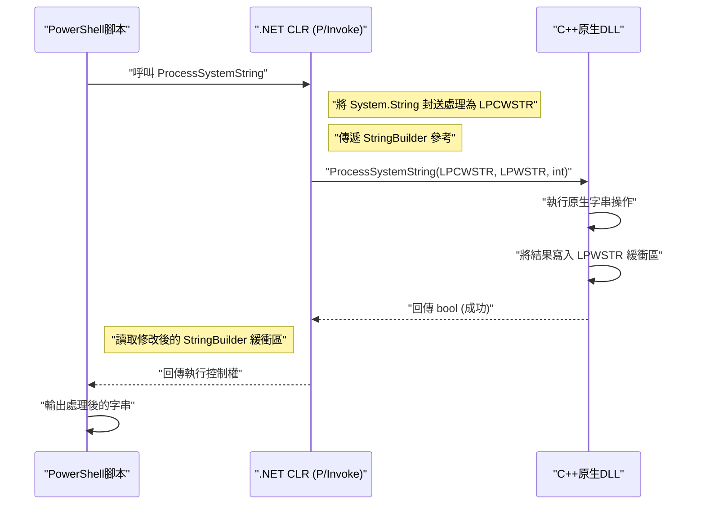
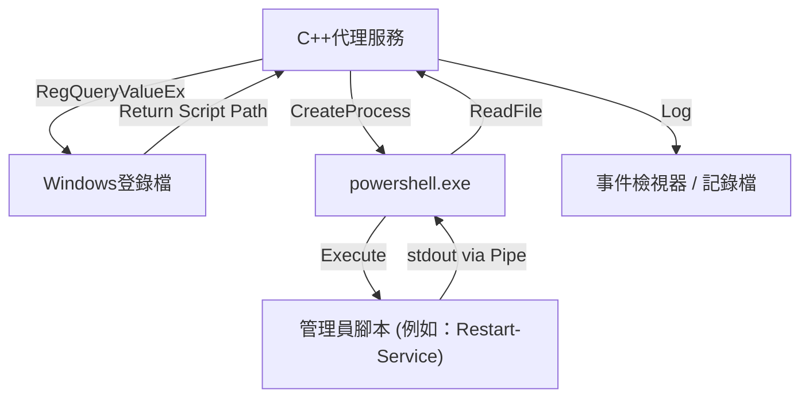

## 簡介

在Windows的系統管理與自動化中，PowerShell已成為事實上的標準工具。無論是Active Directory管理、檔案系統操作或是網路設定變更，幾乎所有任務都可以透過腳本撰寫。然而，雖然PowerShell萬能，但在面對腳本語言特有的效能瓶頸，或是需要存取非常底層的Windows API時，仍會感到吃力。

此時，「與C++整合」便是強而有力的解決方案。C++提供了原生的執行速度，以及對Win32 API和COM物件的完整存取能力。將PowerShell的「高生產力與彈性」和C++的「壓倒性效能與底層控制」結合起來，就能夠最佳化企業環境中極度複雜且大規模的系統管理任務。

本文將針對PowerShell與C++雙向整合的具體架構、實作手法，以及記憶體管理和字串轉換的最佳實踐，進行非常詳細的解說。

## 為什麼要讓PowerShell與C++整合？

### 1. 突破效能極限

PowerShell是在.NET Framework（或.NET Core / .NET）上運作，具有直譯式、動態型別的語言特性。因此，在進行大量文字處理、複雜的加密運算，或是解析數百萬行事件記錄檔時，執行速度與記憶體消耗往往會成為瓶頸。

讓我們來思考一下運算量與處理時間的模型。假設整體任務的處理時間為 $T_{total}$，那麼單獨使用PowerShell處理與卸載給C++處理的時間可公式化如下：

$$ T_{total}^{(PS)} = N \times (t_{overhead} + t_{compute}^{(PS)}) $$

$$ T_{total}^{(C++)} = t_{interop} + N \times t_{compute}^{(C++)} $$

其中，$N$ 為處理的元素數量，$t_{overhead}$ 是PowerShell迴圈處理伴隨的負擔，$t_{compute}$ 是每個元素的純粹計算時間，$t_{interop}$ 則是透過P/Invoke等邊界呼叫所產生的負擔。

當 $N$ 足夠大時，由於 $t_{overhead} \gg 0$ 且 $t_{compute}^{(PS)} > t_{compute}^{(C++)}$，即使需要付出初期的 $t_{interop}$ 成本，將處理委派（卸載）給C++依然能大幅降低整體的延遲。

### 2. 存取原生的Win32 API

雖然PowerShell單獨也能透過 `Add-Type` 經由C#呼叫Win32 API，但要直接用C# / PowerShell定義伴隨複雜結構體或回呼函數的API（例如：Mini-filter驅動程式的控制、進階程序記憶體操作）非常困難。透過建立由C++封裝的原生DLL，再由PowerShell呼叫，就能實現型別安全且可靠的系統控制。

## 從PowerShell呼叫C++原生DLL

最常見的整合模式，是將繁重或系統特有的處理實作為C++的DLL，並從PowerShell腳本中呼叫它。

### C++端的DLL實作 (Win32 API與自訂邏輯)

首先，我們建立一個包含可供PowerShell呼叫之匯出函數的C++ DLL。在此提供一段簡單的C++程式碼作為範例，模擬「處理大規模字串資料的加密、解密，或複雜雜湊計算的函數」。

```cpp
// NativeLib.cpp
#include <windows.h>
#include <string>

// 為了方便P/Invoke呼叫，指定C語言連結與__stdcall
extern "C" {

    __declspec(dllexport) int __stdcall ComputeHeavyTask(int multiplier, int dataSize) {
        int result = 0;
        // 刻意模擬繁重的處理
        for (int i = 0; i < dataSize; ++i) {
            result += (i % multiplier);
        }
        return result;
    }

    // 處理字串的函數（為支援Unicode，使用LPWSTR）
    __declspec(dllexport) bool __stdcall ProcessSystemString(LPCWSTR inputString, LPWSTR outputBuffer, int bufferSize) {
        if (inputString == nullptr || outputBuffer == nullptr) {
            return false;
        }

        std::wstring str(inputString);
        // 某種複雜的字串處理（例如：加上系統識別碼）
        std::wstring result = L"PROCESSED_" + str;

        if (result.length() >= (size_t)bufferSize) {
            return false; // 防止緩衝區溢位
        }

        wcscpy_s(outputBuffer, bufferSize, result.c_str());
        return true;
    }
}
```

### 記憶體管理與字串轉換 (`BSTR`, `LPWSTR`)

在C++與PowerShell（.NET）之間傳遞資料時，最需要注意的是**字串編碼**與**記憶體管理**。

- **`LPCWSTR` / `LPWSTR`**：C/C++的寬字串指標（UTF-16LE）。在Windows API的 `W` 系列函數中為標準用法。在P/Invoke中指定 `CharSet = CharSet.Unicode`，就會自動與.NET的 `String` 或 `StringBuilder` 進行封送處理。
- **`BSTR`**：在COM（Component Object Model）中使用的帶有長度前綴的寬字串。必須使用 `SysAllocString` 與 `SysFreeString` 來管理記憶體。在P/Invoke中須指定 `[MarshalAs(UnmanagedType.BStr)]`。

當C++端配置新的記憶體並回傳給PowerShell端時，會面臨由誰來釋放記憶體（所有權）的問題。在上述的 `ProcessSystemString` 函數中，採用了Win32 API的標準模式：「呼叫方（PowerShell）預先配置緩衝區（`outputBuffer`），再由C++將結果寫入其中」。這麼做可有效防止記憶體洩漏。

### PowerShell端的 `Add-Type` 與 P/Invoke

編譯好C++的DLL（`NativeLib.dll`）後，就能從PowerShell腳本呼叫它。透過 `Add-Type` 動態編譯C#的P/Invoke簽章並加以利用。

```powershell
# PowerShell Script: Invoke-NativeDLL.ps1

$signature = @'
using System;
using System.Runtime.InteropServices;
using System.Text;

public class NativeInterop
{
    // 定義C++的 ComputeHeavyTask
    [DllImport("NativeLib.dll", CallingConvention = CallingConvention.StdCall)]
    public static extern int ComputeHeavyTask(int multiplier, int dataSize);

    // 定義C++的 ProcessSystemString
    [DllImport("NativeLib.dll", CharSet = CharSet.Unicode, CallingConvention = CallingConvention.StdCall)]
    public static extern bool ProcessSystemString(string inputString, StringBuilder outputBuffer, int bufferSize);
}
'@

# 將C#程式碼編譯並加入至PowerShell工作階段
Add-Type -TypeDefinition $signature -PassThru | Out-Null

# 1. 呼叫繁重的數值計算
$result = [NativeInterop]::ComputeHeavyTask(7, 100000000)
Write-Host "Compute Task Result: $result"

# 2. 呼叫字串處理
$input = "SYSTEM_NODE_001"
$bufferSize = 256
# 使用 StringBuilder 作為讓C++端寫入資料的緩衝區
$outputBuffer = New-Object System.Text.StringBuilder -ArgumentList $bufferSize

$success = [NativeInterop]::ProcessSystemString($input, $outputBuffer, $bufferSize)

if ($success) {
    Write-Host "Processed String: $($outputBuffer.ToString())"
} else {
    Write-Host "String processing failed." -ForegroundColor Red
}
```

### 架構視覺化

以下的循序圖展示了從PowerShell呼叫C++ DLL的流程與記憶體傳遞方式。



## 從C++呼叫PowerShell

接下來是反向的作法。有時我們可能會想要從C++打造的系統服務或桌面應用程式中，動態執行PowerShell腳本並取得結果。例如，當C++的監控代理程式偵測到特定異常時，執行PowerShell修復腳本的情境。

主要有兩種作法：
1. **程序啟動（`CreateProcess` / `_popen`）**：作為獨立程序啟動 `powershell.exe`，並透過管線（Pipe）連接標準輸入/輸出。
2. **PowerShell Hosting API（透過C++/CLI）**：在同一個程序內代管PowerShell執行階段的方法。

本文將針對在系統程式設計中最為穩健且通用的**使用管線搭配CreateProcess**之手法進行解說。

### 透過CreateProcess與匿名管線執行

以下的C++程式碼建立了匿名管線（Anonymous Pipes），並將 `powershell.exe` 作為子程序啟動以執行腳本，最後從標準輸出讀取結果。

```cpp
#include <windows.h>
#include <iostream>
#include <string>
#include <vector>

std::string ExecutePowerShellScript(const std::string& script) {
    HANDLE hReadPipe, hWritePipe;
    SECURITY_ATTRIBUTES sa;
    sa.nLength = sizeof(SECURITY_ATTRIBUTES);
    sa.bInheritHandle = TRUE; // 讓子程序繼承管線控制代碼
    sa.lpSecurityDescriptor = NULL;

    // 1. 建立管線
    if (!CreatePipe(&hReadPipe, &hWritePipe, &sa, 0)) {
        return "Error: CreatePipe failed.";
    }

    // 2. 設定子程序（PowerShell）的啟動資訊
    STARTUPINFOA si;
    ZeroMemory(&si, sizeof(STARTUPINFOA));
    si.cb = sizeof(STARTUPINFOA);
    si.dwFlags = STARTF_USESTDHANDLES | STARTF_USESHOWWINDOW;
    si.hStdOutput = hWritePipe;
    si.hStdError = hWritePipe;
    si.wShowWindow = SW_HIDE; // 隱藏視窗

    PROCESS_INFORMATION pi;
    ZeroMemory(&pi, sizeof(PROCESS_INFORMATION));

    // 建構命令列 (為避開Bypass原則的Base64編碼等簡化版)
    std::string cmd = "powershell.exe -NoProfile -NonInteractive -Command \"" + script + "\"";
    std::vector<char> cmdBuffer(cmd.begin(), cmd.end());
    cmdBuffer.push_back('\0');

    // 3. 建立程序
    if (!CreateProcessA(NULL, cmdBuffer.data(), NULL, NULL, TRUE, 0, NULL, NULL, &si, &pi)) {
        CloseHandle(hReadPipe);
        CloseHandle(hWritePipe);
        return "Error: CreateProcess failed.";
    }

    // 在父程序端不需要寫入管線因此關閉（若不關閉會導致Read阻塞）
    CloseHandle(hWritePipe);

    // 4. 讀取結果
    std::string output = "";
    DWORD bytesRead;
    char buffer[4096];

    while (ReadFile(hReadPipe, buffer, sizeof(buffer) - 1, &bytesRead, NULL) && bytesRead > 0) {
        buffer[bytesRead] = '\0';
        output += buffer;
    }

    // 5. 清理資源
    WaitForSingleObject(pi.hProcess, INFINITE);
    CloseHandle(pi.hProcess);
    CloseHandle(pi.hThread);
    CloseHandle(hReadPipe);

    return output;
}

int main() {
    // 取得程序列表並依照CPU使用率降冪排序，取出前5名的PowerShell命令
    std::string psCommand = "Get-Process | Sort-Object CPU -Descending | Select-Object -First 5 | Format-Table Name, CPU, Id";
    
    std::cout << "Executing PowerShell from C++..." << std::endl;
    std::string result = ExecutePowerShellScript(psCommand);
    
    std::cout << "Result:\n" << result << std::endl;
    return 0;
}
```

### Windows登錄檔與PowerShell的整合

在從C++執行腳本時，應避免將動態設定值或執行路徑寫死（hardcode）。在多數情況下，C++應用程式會從**Windows登錄檔**讀取設定。

在企業系統中，較偏好的架構是在C++端使用 `RegOpenKeyEx` 與 `RegQueryValueEx` 從 `HKLM\SOFTWARE\MyApp` 取得PowerShell腳本的路徑，並將其作為參數傳遞給上述的 `CreateProcess`。



## 效能分析與卸載的優勢

為什麼要採用這麼複雜的架構呢？作為具體情境，我們考慮「解析高達數GB的自訂IIS記錄檔」。

若使用PowerShell的 `Get-Content` 並透過正規表示式逐行解析，由於產生物件與記憶體回收（GC）的負擔，將會消耗大量的CPU時間。

在腳本執行中，記憶體配置次數 $A$ 與GC觸發次數 $G$ 的關係如下式成正比：

$$ G \propto \sum_{i=1}^{N} A_i $$

若將處理移交給C++原生程式碼，可使用記憶體對應（`CreateFileMapping`, `MapViewOfFile`）將整個檔案直接展開於記憶體中，並藉由指標運算以零拷貝（Zero-copy）的方式進行字串搜尋。在這種情況下，產生物件的負擔實質上降為零，解析工作能以接近理論記憶體頻寬上限的速度完成。

只要將解析結果（例如：未經授權存取的IP位址清單等）回傳給PowerShell端，P/Invoke的封送處理成本也能降至最低。

## 實用的系統管理自動化情境

### 情境1：高速檔案系統掃描與權限變更

在大規模檔案伺服器中，萃取出具備特定副檔名且設定了特定ACL（存取控制清單）的檔案，並批次變更其權限的任務。
- **C++的角色**：使用 `FindFirstFile` / `FindNextFile` 與多執行緒極速走訪目錄樹，產生符合條件的檔案路徑清單。
- **PowerShell的角色**：針對從C++接收到的清單，使用 `Set-Acl` 批次套用權限（或是與Active Directory整合的處理）。

### 情境2：收集自訂的硬體資訊

監控無法透過WMI（Windows Management Instrumentation）或CIM（Common Information Model）取得資訊的自訂硬體裝置（例如：特殊的PCIe卡或感測器）。
- **C++的角色**：向裝置驅動程式發出 `DeviceIoControl` 呼叫，負責取得並解析二進位資料的DLL。
- **PowerShell的角色**：定期呼叫DLL，將解析結果格式化為JSON並傳送至監控伺服器的REST API。

## 記憶體管理與疑難排解的最佳實踐

在整合時最常發生的Bug為**記憶體洩漏**與**存取違規（Access Violation: 0xC0000005）**。

1. **指標的有效期間**：當從PowerShell端傳遞 `[ref]` 或 `StringBuilder` 時，P/Invoke僅會在呼叫期間固定（Pin）該記憶體。切勿在C++端將該指標儲存至全域變數，並在日後存取。若需進行非同步回呼，必須使用 `GCHandle` 明確固定記憶體。
2. **64位元環境的指標大小**：現代的Windows基本上皆為64位元（x64）。C++端的指標大小為8位元組，而PowerShell（.NET）端必須使用 `IntPtr`。由於Windows中C++的 `long` 為4位元組，將指標強制轉型為 `long` 來傳遞等老舊程式碼寫法將成為崩潰的主因。
3. **字串編碼不一致**：PowerShell內部使用UTF-16。若C++端試圖以ANSI字串（`std::string`, `char*`）接收，將會發生亂碼。請務必使用寬字串（`std::wstring`, `wchar_t*`），並在P/Invoke端指定 `CharSet = CharSet.Unicode`。

## 總結

在系統管理自動化中，PowerShell與C++的整合是能同時兼顧腳本語言的便利性與原生語言之威力的最強組合。

透過P/Invoke呼叫C++ DLL，可卸載高運算負載的任務，大幅縮短執行時間。反之，從C++應用程式透過程序啟動或管線運用PowerShell豐富的系統管理模組，也能大幅降低開發成本。

雖然需要特別注意邊界區塊的記憶體管理與字串轉換，但只要掌握本文所介紹的架構模式與實作技巧，就能夠建構出更進階、穩健的Windows系統管理工具。

---

*在本技術部落格中，未來也將持續探討有關Windows內部結構與進階自動化的深入主題。如有任何問題或回饋，歡迎在留言區與我們分享。*
