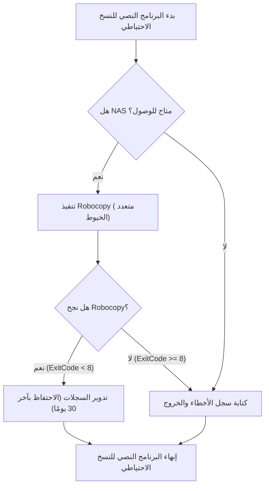
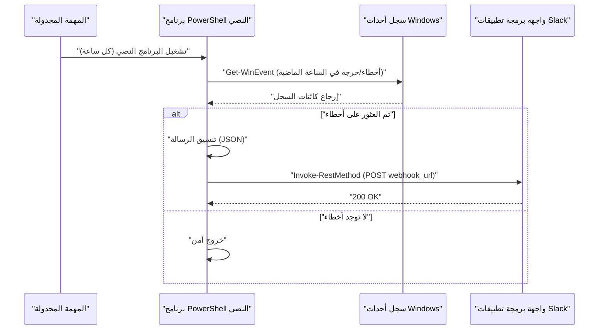

## مقدمة: لماذا نستخدم PowerShell لأتمتة المهام

في البنى التحتية لتكنولوجيا المعلومات وبيئات التطوير الحديثة، تُعد "المهام اليومية الروتينية" تحديًا لا مفر منه للمستخدمين الذين يعتمدون على نظام التشغيل Windows كمنصة أساسية. القيام بهذه المهام يدويًا، مثل النسخ الاحتياطي للملفات، ومراقبة سجلات النظام، وتحديث وبناء موارد التطوير (مستودعات Git)، يُعد بيئة خصبة للأخطاء البشرية ويؤدي إلى إهدار وقت ثمين.

في الماضي، كانت تُستخدم الملفات الدفعية (`.bat` أو `.cmd`) أو VBScript، ولكن في الوقت الحاضر، الحل الأمثل بلا شك هو **PowerShell**. لا يُعد PowerShell مجرد غلاف (shell) يعتمد على النصوص، بل هو مبني على أساس متين موجه للكائنات في إطار عمل .NET Framework (و .NET Core). نظرًا لأن البيانات التي يتم تمريرها عبر خط الأنابيب (pipeline) ليست "سلاسل نصية" بل "كائنات"، فلا توجد حاجة لتنفيذ تحليلات نصية معقدة (مثل عمليات grep أو awk أو sed) بنفسك؛ حيث يمكنك الوصول بسهولة إلى البيانات فقط من خلال تحديد الخصائص.

في هذه المقالة، سنقدم ثلاثة أمثلة عملية لبرامج نصية (scripts) للأتمتة الكاملة ترتبط مباشرة بالعمل الفعلي باستخدام PowerShell (النسخ الاحتياطي إلى NAS وتدوير السجلات، ومراقبة سجلات الأحداث وإشعارات Slack، والتحديث المجمع والبناء لمستودعات Git المتعددة). وقبل ذلك، سنشرح بالتفصيل التقنيات الأساسية المطلوبة مثل سياسات تنفيذ PowerShell، وتحويل التعليمات البرمجية إلى وحدات (modularization)، والتكامل مع جدولة المهام (Task Scheduler).

---

## إعداد البنية التحتية لأتمتة PowerShell

لكي تعمل برامج الأتمتة النصية بأمان وموثوقية في بيئة الإنتاج، لا بد من بعض الترتيبات المسبقة. سنشرح هنا بالتفصيل فهم سياسات التنفيذ، والتقسيم إلى وحدات لزيادة قابلية إعادة الاستخدام، ومعالجة الأخطاء القوية.

### 1. سياسة تنفيذ PowerShell (Execution Policy)

في نظام التشغيل Windows، لضمان عدم تنفيذ البرامج النصية الضارة عن طريق الخطأ في الحالة الافتراضية، تم إعداد "سياسة تنفيذ"، وفي الحالة الأولية (`Restricted`) لا يمكن تنفيذ أي برنامج نصي (ملف `.ps1`). لتشغيل الأتمتة، من الضروري تغيير هذا إلى مستوى مناسب.

تشمل سياسات التنفيذ الأنواع التالية:

- **Restricted**: لا يسمح بتشغيل أي برامج نصية. (الافتراضي)
- **AllSigned**: يسمح فقط بتشغيل البرامج النصية الموقعة من قبل ناشر موثوق.
- **RemoteSigned**: يمكن تشغيل البرامج النصية التي تم إنشاؤها محليًا كما هي، لكن البرامج النصية التي تم تنزيلها من الإنترنت تتطلب توقيعًا.
- **Unrestricted**: يمكن تشغيل جميع البرامج النصية، لكن سيتم عرض تحذير عند محاولة تشغيل البرامج النصية التي تم تنزيلها من الإنترنت.
- **Bypass**: لا يتم حظر أي شيء، ولا تُعرض أي تحذيرات. يُستخدم غالبًا لتنفيذ البرامج النصية المؤقتة (مثل خطوط أنابيب CI/CD).

عند تشغيل البرامج النصية التي تم إنشاؤها ذاتيًا في بيئة محلية للشركات باستخدام جدولة المهام وما إلى ذلك، فإن الإعداد الأكثر واقعية وأمانًا هو `RemoteSigned`. قم بتشغيل PowerShell بصلاحيات المسؤول (Administrator) ونفذ الأمر التالي:

```powershell
Set-ExecutionPolicy RemoteSigned -Scope LocalMachine -Force
```

سيسمح هذا بتشغيل البرامج النصية مثل نصوص النسخ الاحتياطي التي تم إنشاؤها محليًا دون أن يتم حظرها.

### 2. إعادة استخدام التعليمات البرمجية من خلال التقسيم إلى وحدات (.psm1 / .psd1)

عند إجراء عمليات أتمتة معقدة، لا يُنصح بكتابة جميع العمليات في ملف `.ps1` واحد ضخم من منظور قابلية الصيانة. الوظائف المستخدمة بشكل متكرر (مثل إخراج السجلات، إرسال خطافات الويب (Webhook) إلى Slack، معالجة الأخطاء، إلخ) يجب فصلها كـ "وحدات".

تتكون وحدات PowerShell بشكل أساسي من ملف وحدة برمجية نصية (`.psm1`) وملف بيان الوحدة (`.psd1`).

مثال على **CommonUtils.psm1**:
```powershell
function Write-CustomLog {
    [CmdletBinding()]
    param (
        [Parameter(Mandatory=$true)]
        [string]$Message,
        
        [ValidateSet('INFO', 'WARNING', 'ERROR')]
        [string]$Level = 'INFO'
    )
    
    $timestamp = Get-Date -Format "yyyy-MM-dd HH:mm:ss"
    $logLine = "[$timestamp] [$Level] $Message"
    
    # تنفيذ الإخراج على الشاشة والإخراج إلى الملف
    Write-Host $logLine
    Add-Content -Path "C:\logs\automation.log" -Value $logLine
}

Export-ModuleMember -Function Write-CustomLog
```

لاستدعاء هذه الوحدة من برامج نصية أخرى، استخدم `Import-Module` في بداية البرنامج النصي.

```powershell
Import-Module "C:\Scripts\Modules\CommonUtils.psm1"
Write-CustomLog -Message "بدء عملية النسخ الاحتياطي." -Level 'INFO'
```

### 3. معالجة الأخطاء القوية (try / catch)

أهم شيء في الأتمتة هو "كيفية التصرف عند حدوث فشل". في PowerShell، من خلال تعيين المتغير المدمج `$ErrorActionPreference`، يمكنك التحكم في السلوك الافتراضي عند فشل أمر ما. السلوك الافتراضي هو `Continue` (عرض الخطأ ومتابعة المعالجة)، ولكن في برامج الأتمتة النصية، فإن أفضل ممارسة هي تعيينه إلى `Stop` والتقاط الاستثناءات صراحةً باستخدام كتل `try / catch`.

```powershell
$ErrorActionPreference = 'Stop'

try {
    # معالجة قد تفشل
    $content = Get-Content -Path "C:\NonExistentFile.txt"
} catch [System.Management.Automation.ItemNotFoundException] {
    # التقاط خطأ محدد
    Write-Host "الملف غير موجود: $($_.Exception.Message)" -ForegroundColor Red
} catch {
    # التقاط جميع الأخطاء الأخرى
    Write-Host "حدث خطأ غير متوقع: $($_.Exception.Message)" -ForegroundColor Red
} finally {
    # عملية تنظيف تُنفذ دائمًا بغض النظر عن النجاح أو الفشل
    Write-Host "إنهاء المعالجة."
}
```

من خلال الاستفادة من هذه البنية التحتية، يمكنك بناء برامج نصية آمنة وقابلة للتتبع حتى عند تشغيلها بدون تدخل بشري أثناء الليل.

---

## التكامل مع جدولة المهام (Register-ScheduledTask)

بمجرد اكتمال البرنامج النصي، ستحتاج بعد ذلك إلى آلية لتشغيله بشكل دوري. الأداة الأكثر موثوقية في Windows هي "جدولة المهام" (Task Scheduler). في حين أنه من الممكن إعداده من واجهة المستخدم الرسومية (`taskschd.msc`)، سنشرح هنا كيفية تسجيل المهام باستخدام أوامر PowerShell، وذلك من منظور تحويل أدلة البنية التحتية إلى تعليمات برمجية (Infrastructure as Code).

يحتوي PowerShell على وحدة `ScheduledTasks` الجاهزة للاستخدام، والتي تتيح لك تحديد المشغلات (متى يتم التنفيذ)، والإجراءات (ما يتم تنفيذه)، والأساسيات (تحت أي صلاحيات مستخدم يتم التنفيذ) بالتفصيل.

```powershell
# 1. تحديد الإجراء (تشغيل PowerShell بشكل مخفي وتمرير البرنامج النصي المحدد)
$action = New-ScheduledTaskAction -Execute "powershell.exe" -Argument "-NoProfile -WindowStyle Hidden -ExecutionPolicy Bypass -File C:\Scripts\DailyTasks.ps1"

# 2. تحديد المشغل (يعمل يوميًا في الساعة 3:00 صباحًا)
$trigger = New-ScheduledTaskTrigger -Daily -At "3:00AM"

# 3. تحديد الصلاحية (التنفيذ بصلاحيات SYSTEM)
$principal = New-ScheduledTaskPrincipal -UserId "NT AUTHORITY\SYSTEM" -LogonType ServiceAccount -RunLevel Highest

# 4. بناء إعدادات المهمة
$settings = New-ScheduledTaskSettingsSet -AllowStartIfOnBatteries -DontStopIfGoingOnBatteries -StartWhenAvailable -DontStopOnIdleEnd

# 5. تسجيل المهمة
$taskName = "MyDailyAutomationTask"
Register-ScheduledTask -TaskName $taskName -Action $action -Trigger $trigger -Principal $principal -Settings $settings -Description "مهمة لتنفيذ الأعمال الروتينية اليومية تلقائيًا" -Force
```

بمجرد تشغيل هذا البرنامج النصي، سيتم تسجيل الوظيفة في جدولة المهام، وسيتم تشغيل البرنامج النصي يوميًا في الوقت المحدد بصلاحيات النظام (SYSTEM) (أعلى الصلاحيات الممكنة في الخلفية دون إظهار شاشة).

---

## المثال العملي 1: النسخ الاحتياطي إلى NAS خارجي وتدوير السجلات

النسخ الاحتياطي اليومي لبيانات العمل أمر إلزامي، لكن النسخ اليدوي غير وارد. هنا سنقوم بإنشاء برنامج نصي يستدعي `Robocopy`، وهو أقوى أمر نسخ مدمج في Windows، من خلال PowerShell، ويُخرج سجلات لنتائج التنفيذ، ويحذف السجلات القديمة تلقائيًا (التدوير).

### القيمة النظرية لوقت التنفيذ في نقل الشبكة (Math)

عند تصميم برنامج نصي للنسخ الاحتياطي، من المهم تشغيليًا تقدير الوقت الذي ستستغرقه العملية حتى تكتمل. يمكن تقريب الوقت المقدر $T_{backup}$ المطلوب للنسخ الاحتياطي عبر شبكة إلى وحدة تخزين متصلة بالشبكة (NAS) باستخدام المعادلة التالية:

$$ T_{backup} = \frac{S_{total}}{B \times (1 - \alpha)} + C \times L $$

حيث تكون المتغيرات كالتالي:
- $S_{total}$ : إجمالي حجم البيانات المراد نسخها احتياطيًا (بالبت)
- $B$ : عرض النطاق الترددي للشبكة (بت في الثانية، مثال: 1 جيجابت في الثانية = $10^9$ بت/ثانية)
- $\alpha$ : الحمل الزائد للشبكة والبروتوكولات (عادةً ما يتراوح بين 0.1 و 0.2 في بروتوكولات TCP/IP أو SMB)
- $C$ : العدد الإجمالي للملفات
- $L$ : وقت الاستجابة لمعالجة الملف الواحد (بالثواني)

بشكل خاص، عند إجراء نسخ احتياطي لعدد كبير من الملفات الصغيرة (مثل التعليمات البرمجية المصدر)، فإن عامل التأخير الناتج عن عدد الملفات $C$ ($C \times L$) يكون هو المهيمن. لهذا السبب، في عمليات النسخ الاحتياطي، من الأفضل استخدام `Robocopy`، الذي يدعم النقل متعدد الخيوط، بدلاً من أداة نسخ ملفات بسيطة.

### تدفق عملية البرنامج النصي للنسخ الاحتياطي



### مثال على تنفيذ برنامج PowerShell النصي (`Backup-ToNas.ps1`)

```powershell
$ErrorActionPreference = 'Stop'

# قيم الإعداد
$SourceDir = "C:\WorkData"
$TargetNasDir = "\\NAS01\Backup\WorkData"
$LogDir = "C:\Scripts\Logs"
$DateStr = Get-Date -Format "yyyyMMdd"
$LogFile = Join-Path $LogDir "Backup_$DateStr.log"
$RetainDays = 30

try {
    # 1. فحص مسبق: هل يمكن الوصول إلى NAS؟
    if (-not (Test-Path $TargetNasDir)) {
        throw "لا يمكن الوصول إلى المسار المستهدف في NAS: $TargetNasDir"
    }

    Write-Host "بدء النسخ الاحتياطي: $SourceDir -> $TargetNasDir"

    # 2. تنفيذ Robocopy
    # /MIR : عكس (Mirroring) (حذف الملفات التي ليست في المصدر)
    # /MT:16 : نسخ متعدد الخيوط مع 16 خيطًا
    # /NP : عدم طباعة تقدم العملية (%) (لتجنب فوضى السجلات)
    # /R:2 /W:2 : عدد مرات إعادة المحاولة عند حدوث خطأ 2، ووقت الانتظار 2 ثانية
    $roboArgs = @(
        $SourceDir,
        $TargetNasDir,
        "/MIR",
        "/MT:16",
        "/NP",
        "/R:2",
        "/W:2",
        "/LOG+:$LogFile"
    )

    # عند استدعاء أمر خارجي من PowerShell، يُفضل استخدام Start-Process لضمان الموثوقية
    $process = Start-Process -FilePath "robocopy.exe" -ArgumentList $roboArgs -Wait -NoNewWindow -PassThru
    $exitCode = $process.ExitCode

    # مواصفات كود خروج Robocopy: 0-7 تعني نجاحًا أو سلوكًا متوقعًا. 8 فما فوق تعني خطأ
    if ($exitCode -ge 8) {
        throw "انتهى Robocopy بوجود خطأ. كود الخروج: $exitCode"
    }

    Write-Host "اكتمل النسخ الاحتياطي بنجاح. كود الخروج: $exitCode"

    # 3. تدوير السجلات
    Write-Host "جارٍ حذف ملفات السجل القديمة (فترة الاحتفاظ: ${RetainDays} يومًا)"
    $limitDate = (Get-Date).AddDays(-$RetainDays)
    Get-ChildItem -Path $LogDir -Filter "Backup_*.log" | 
        Where-Object { $_.LastWriteTime -lt $limitDate } | 
        Remove-Item -Force

    Write-Host "اكتمل تنظيف السجلات."

} catch {
    $errorMessage = "حدث خطأ أثناء عملية النسخ الاحتياطي: $($_.Exception.Message)"
    Write-Error $errorMessage
    # كتابة الخطأ في ملف سجل الأخطاء الفعلي
    Add-Content -Path (Join-Path $LogDir "Error.log") -Value "[(Get-Date -Format 'yyyy-MM-dd HH:mm:ss')] $errorMessage"
    # الخروج برمز غير صفري لإخطار جدولة المهام بوجود خطأ
    exit 1
}
```

هذا البرنامج النصي، عند اقترانه بجدولة المهام، يحقق أتمتة كاملة للنسخ الاحتياطي اليومي. التعامل مع كود خروج `Robocopy` هو أمر بالغ الأهمية. حتى عند نجاح العملية، يقوم Robocopy بإرجاع 1 إذا "تم نسخ ملفات جديدة"، و 2 إذا "تم حذف ملفات إضافية"، إلخ. لذلك، يجب الانتباه إلى أن الفحص البسيط مثل `$LASTEXITCODE -eq 0` لن يعمل بشكل صحيح.

---

## المثال العملي 2: مراقبة سجل أحداث النظام وإشعارات Slack (Webhook)

في خوادم Windows أو محطات عمل المبدعين، من الأهمية بمكان اكتشاف علامات أخطاء الأقراص التي تنذر بشاشة الموت الزرقاء (BSoD) أو أعطال التطبيقات (Application Error) في أقرب وقت ممكن.
هنا سنقوم بإنشاء برنامج نصي يستخرج سجلات مستوى "الخطأ" (Error) و"الخطير" (Critical) من سجلات أحداث `System` و `Application` للساعة الماضية، وإرسال إشعار إلى Slack في حالة العثور على أي منها.

### مخطط تسلسل لعملية الإشعارات



### مثال على تنفيذ برنامج PowerShell النصي (`Monitor-EventLog.ps1`)

```powershell
$ErrorActionPreference = 'Stop'

# رابط Slack Webhook (تم الحصول عليه مسبقًا من خلال دمج Incoming Webhooks في Slack)
$SlackWebhookUrl = "https://hooks.slack.com/services/TXXXXX/BXXXXX/XXXXXXXXXXXXX"

# النطاق الزمني للبحث (الساعة الماضية)
$startTime = (Get-Date).AddHours(-1)

# استخدام مرشح XPath للبحث في سجل الأحداث بسرعة
# المستوى 1: خطير (Critical)، 2: خطأ (Error)
$xmlFilter = @"
<QueryList>
  <Query Id="0" Path="System">
    <Select Path="System">*[System[(Level=1 or Level=2) and TimeCreated[@SystemTime&gt;='$($startTime.ToUniversalTime().ToString("o"))']]]</Select>
  </Query>
  <Query Id="1" Path="Application">
    <Select Path="Application">*[System[(Level=1 or Level=2) and TimeCreated[@SystemTime&gt;='$($startTime.ToUniversalTime().ToString("o"))']]]</Select>
  </Query>
</QueryList>
"@

try {
    # جلب السجلات باستخدام Get-WinEvent
    # -ErrorAction SilentlyContinue يُستخدم لتجاهل الأخطاء عندما لا يتم العثور على سجلات
    $events = Get-WinEvent -FilterXml $xmlFilter -ErrorAction SilentlyContinue

    if ($events -and $events.Count -gt 0) {
        $eventCount = $events.Count
        Write-Host "تم العثور على $eventCount سجلات لأخطاء/أحداث خطيرة في الساعة الماضية."

        # بناء نص الإشعار
        $messageBody = "*تنبيه نظام Windows* :rotating_light:`n"
        $messageBody += "تم اكتشاف $eventCount أخطاء في الساعة الماضية.`n`n"

        # تفصيل آخر 3 أحداث فقط (مع مراعاة الحد الأقصى لعدد الأحرف)
        $events | Select-Object -First 3 | ForEach-Object {
            $messageBody += "*$($_.LogName)* - $($_.ProviderName) (معرف الحدث: $($_.Id))`n"
            $messageBody += "> $($_.Message -replace '`n', ' ')`n`n"
        }

        if ($eventCount -gt 3) {
            $messageBody += "※ هناك $($eventCount - 3) أخطاء أخرى. يرجى التحقق من عارض الأحداث (Event Viewer)."
        }

        # إنشاء حمولة JSON للإرسال إلى Slack
        $payload = @{
            text = $messageBody
            username = "SystemMonitor"
            icon_emoji = ":desktop_computer:"
        }
        $jsonPayload = $payload | ConvertTo-Json -Depth 3

        # استدعاء REST API للإرسال إلى Slack
        Invoke-RestMethod -Uri $SlackWebhookUrl -Method Post -Body $jsonPayload -ContentType "application/json; charset=utf-8"
        
        Write-Host "تم إرسال الإشعار إلى Slack."
    } else {
        Write-Host "لم يتم العثور على سجلات أخطاء/أحداث خطيرة. النظام طبيعي."
    }
} catch {
    Write-Error "حدث خطأ في البرنامج النصي لمراقبة سجل الأحداث: $($_.Exception.Message)"
    exit 1
}
```

النقطة الفنية الرئيسية في هذا البرنامج النصي هي استخدام `Get-WinEvent -FilterXml`. إن الأسلوب التقليدي باستخدام `Get-EventLog` أو التصفية بواسطة `Where-Object` في خط الأنابيب يعد بطيئًا للغاية؛ لأنه يحمّل جميع كائنات الأحداث في الذاكرة قبل معالجتها. باستخدام تصفية XML، تتم التصفية على جانب خدمة سجل أحداث Windows، مما يؤدي إلى تحسن هائل في الأداء مع بقاء وقت التنفيذ في حدود بضع ثوانٍ.

---

## المثال العملي 3: التحديث المجمع وبناء الأتمتة لمستودعات Git المتعددة

بالنسبة للمطورين، يُعد مزامنة مستودعات Git المتعددة (مثل الواجهة الأمامية، والخلفية، ومستودعات البنية التحتية) الموجودة على حواسيب العمل الخاصة بهم مع أحدث إصدار من فرع `main` كل صباح، وتثبيت الحزم اللازمة (مثل `npm install`) وإجراء عمليات البناء (build) مهمة شاقة.
سنقوم بإنشاء أداة تؤدي هذه المهام دفعة واحدة باستخدام برنامج PowerShell النصي.

يقوم هذا البرنامج النصي باكتشاف كافة مستودعات Git تلقائيًا ضمن دليل رئيسي محدد، وإذا لم تكن هناك تغييرات غير ملتزم بها (uncommitted changes)، فإنه يقوم بتنفيذ أمر `git pull`. وعلاوة على ذلك، إذا تم سحب تغييرات جديدة، فإنه يقوم بإصدار أمر بناء تلقائيًا.

### البرنامج النصي للتحديث التلقائي للمستودعات المتعددة (`Update-GitRepos.ps1`)

```powershell
$ErrorActionPreference = 'Stop'

# قائمة بالأدلة الرئيسية حيث توجد المستودعات
$TargetDirectories = @(
    "C:\Dev\FrontendProjects",
    "C:\Dev\BackendProjects"
)

# استكشاف كل دليل
foreach ($parentDir in $TargetDirectories) {
    if (-not (Test-Path $parentDir)) {
        Write-Warning "الدليل غير موجود: $parentDir"
        continue
    }

    # الحصول على قائمة بالأدلة الفرعية
    $subDirs = Get-ChildItem -Path $parentDir -Directory
    
    foreach ($repoDir in $subDirs) {
        $repoPath = $repoDir.FullName
        $gitDir = Join-Path $repoPath ".git"

        # التحقق مما إذا كان مجلد .git موجودًا (ما إذا كان مستودع Git)
        if (Test-Path $gitDir) {
            Write-Host "---------------------------------"
            Write-Host "تتم معالجة المستودع: $repoPath" -ForegroundColor Cyan
            
            # تغيير دليل العمل الحالي في PowerShell
            Set-Location -Path $repoPath

            try {
                # التحقق مما إذا كانت هناك تغييرات غير ملتزم بها
                $status = git status --porcelain
                if ($status) {
                    Write-Host "تخطي نظرًا لوجود تغييرات غير ملتزم بها." -ForegroundColor Yellow
                    continue
                }

                # الحصول على الفرع الحالي
                $branch = git rev-parse --abbrev-ref HEAD
                if ($branch -ne "main" -and $branch -ne "master") {
                    Write-Host "تخطي لأن الفرع الحالي هو $branch (مستهدف فقط main/master)." -ForegroundColor Yellow
                    continue
                }

                # تنفيذ عملية Pull وتخزين النتيجة في متغير
                Write-Host "جارٍ الحصول على أحدث التحديثات من الخادم البعيد (git pull)..."
                $pullResult = git pull origin $branch 2>&1
                
                # إخراج إلى وحدة التحكم أيضًا
                $pullResult | ForEach-Object { Write-Host "  $_" }

                # إذا كانت النتيجة تحتوي على نصوص بخلاف "Already up to date."، فيُعتبر أن هناك تحديثًا
                $isUpdated = $false
                foreach ($line in $pullResult) {
                    if ($line -notmatch "Already up to date") {
                        $isUpdated = $true
                        break
                    }
                }

                if ($isUpdated) {
                    Write-Host "تم تحديث المستودع. جارٍ بدء مهمة البناء..." -ForegroundColor Green
                    
                    # إذا كان هناك package.json، قم بتنفيذ npm install و npm run build
                    if (Test-Path "package.json") {
                        Write-Host "جارٍ تنفيذ npm install..."
                        npm install
                        Write-Host "جارٍ تنفيذ npm run build..."
                        npm run build
                    }
                    
                    # إذا كان هناك ملف .sln (Visual Studio Solution)، قم بتنفيذ msbuild أو dotnet build
                    $slnFiles = Get-ChildItem -Filter "*.sln"
                    if ($slnFiles.Count -gt 0) {
                        Write-Host "جارٍ بناء تطبيق .NET..."
                        dotnet build $slnFiles[0].FullName
                    }
                }

            } catch {
                Write-Error "حدث خطأ أثناء معالجة المستودع $repoPath : $($_.Exception.Message)"
            }
        }
    }
}

Write-Host "---------------------------------"
Write-Host "اكتملت عملية تحديث جميع المستودعات." -ForegroundColor Green
```

تم تصميم هذا البرنامج النصي بحيث يمكنه الاستمرار في المعالجة من خلال `try / catch` وحلقة `foreach` حتى في حالة حدوث أخطاء، دون التأثير على معالجة المستودع التالي. بالإضافة إلى ذلك، يتم استخدام خيار `git status --porcelain` المخصص لمعالجة البرامج النصية لتحديد نظافة شجرة العمل بشكل موثوق. إذا قمت بوضع هذا البرنامج النصي في مجلد بدء التشغيل أو قمت بتسجيله في جدولة المهام عند تسجيل دخول المستخدم، فستكون جميع بيئات التطوير الخاصة بك محدثة بالكامل بحلول الوقت الذي تقوم فيه بتشغيل جهاز الكمبيوتر وتحضير فنجان من القهوة.

---

## ملاحظات تشغيلية وتقنيات متقدمة

عند تشغيل برامج أتمتة PowerShell النصية على المدى الطويل، هناك بعض أفضل الممارسات التي ينبغي أخذها في الاعتبار.

### 1. الإدارة الآمنة لبيانات الاعتماد
من المخاطر الأمنية الكبيرة تضمين كلمات المرور أو مفاتيح واجهة برمجة التطبيقات (مثل رابط Slack Webhook وسلاسل اتصال قواعد البيانات) كنص صريح داخل البرنامج النصي. يحتوي PowerShell على ميزات مضمنة مثل `Export-Clixml` و `ConvertFrom-SecureString` التي تشفر بيانات الاعتماد قبل حفظها.

```powershell
# ينفذ يدويًا في المرة الأولى فقط (سيظهر مربع حوار لإدخال كلمة المرور)
# Get-Credential | Export-Clixml -Path "C:\Scripts\Creds\admin.xml"

# القراءة داخل برنامج الأتمتة النصي
$cred = Import-Clixml -Path "C:\Scripts\Creds\admin.xml"
# استخدام $cred للاتصال بخادم بعيد وما إلى ذلك
```

يضمن هذا أن بيانات المصادقة آمنة ولا يمكن فك تشفيرها إلا في ملف تعريف المستخدم الذي يُشغل البرنامج النصي.

### 2. التسجيل الكامل لسجل التنفيذ من خلال النصوص (Transcript)
في الأمثلة السابقة، قمنا بإخراج السجلات بشكل فردي باستخدام أوامر مثل `Add-Content`، لكن PowerShell يتمتع بميزة "Transcript" التي تسجل تلقائيًا كافة المعلومات المعروضة على الشاشة (بما في ذلك رسائل الخطأ والإخراج القياسي) إلى ملف.

فقط من خلال إضافة ما يلي إلى بداية البرنامج النصي ونهايته، يمكنك إنشاء سجل تدقيق قوي.

```powershell
Start-Transcript -Path "C:\Scripts\Logs\Execution_$(Get-Date -Format 'yyyyMMdd_HHmmss').log" -Append

# (محتوى البرنامج النصي هنا)

Stop-Transcript
```

### 3. النهج الرياضي للمراقبة واكتشاف الحالات الشاذة (Math)

في الأتمتة واسعة النطاق، لا يكفي اكتشاف الأخطاء ببساطة؛ بل من الفعال استخدام أساليب إحصائية لاكتشاف "الأشياء غير المعتادة". على سبيل المثال، إذا كان وقت النسخ الاحتياطي اليومي ينحرف بشكل كبير عن متوسطه المعتاد، فقد يكون هذا مؤشرًا مبكرًا على مشاكل في الشبكة أو عطل وشيك في القرص.

إذا كان وقت النسخ الاحتياطي اليومي $x_1, x_2, \dots, x_n$، فيمكن حساب متوسط العينة $\mu$ والانحراف المعياري $\sigma$ كالتالي:

$$ \mu = \frac{1}{n} \sum_{i=1}^n x_i $$
$$ \sigma = \sqrt{ \frac{1}{n-1} \sum_{i=1}^n (x_i - \mu)^2 } $$

إذا تجاوز وقت التنفيذ لليوم $x_{today}$ قيمة $\mu + 3\sigma$ (قاعدة الثلاثة سيغما)، يمكنك بناء منطق يعتبر أن هناك "شذوذًا إحصائيًا" ويرسل إشعارًا تحذيريًا. باستخدام أمر `Measure-Object` في PowerShell، يمكن تنفيذ مثل هذه المعالجات الإحصائية في بضعة أسطر فقط.

## الخلاصة

في هذه المقالة، قمنا بشرح كيفية استخدام PowerShell في بيئة Windows لأتمتة المهام اليومية الروتينية بالكامل مع تقديم أمثلة عملية.
بدءًا من إعداد سياسات التنفيذ وبناء البنية الأساسية من خلال التقسيم إلى وحدات، وصولًا إلى تقديم برامج نصية جاهزة للاستخدام في العمل الحقيقي، مثل النسخ الاحتياطي وتدوير السجلات، ومراقبة سجلات الأحداث مع إشعارات Slack، وعمليات البناء التلقائية لمستودعات Git المتعددة.

يُعد PowerShell أداة عميقة جدًا؛ وعلى الرغم من كونه أداة سطر أوامر، إلا أنه محرك أتمتة قوي قادر على الوصول إلى كافة ميزات .NET تقريبًا. بالاعتماد على البرامج النصية المقدمة في هذه المقالة، يمكنك تخصيص المسارات ومنطق المعالجة ليتناسب مع بيئة عملك، وتوفير وقتك للإبداع بدلًا من القيام بمهام يدوية مملة.

نجاح الأتمتة يعتمد على "البدء ببرنامج نصي صغير وزيادة قوته تدريجيًا من خلال إضافة معالجة الأخطاء وإخراج السجلات وما إلى ذلك". لمَ لا تبدأ رحلة الأتمتة باستخدام PowerShell عن طريق إجراء نسخ احتياطي لمجلد واحد فقط على جهاز الكمبيوتر الخاص بك؟
