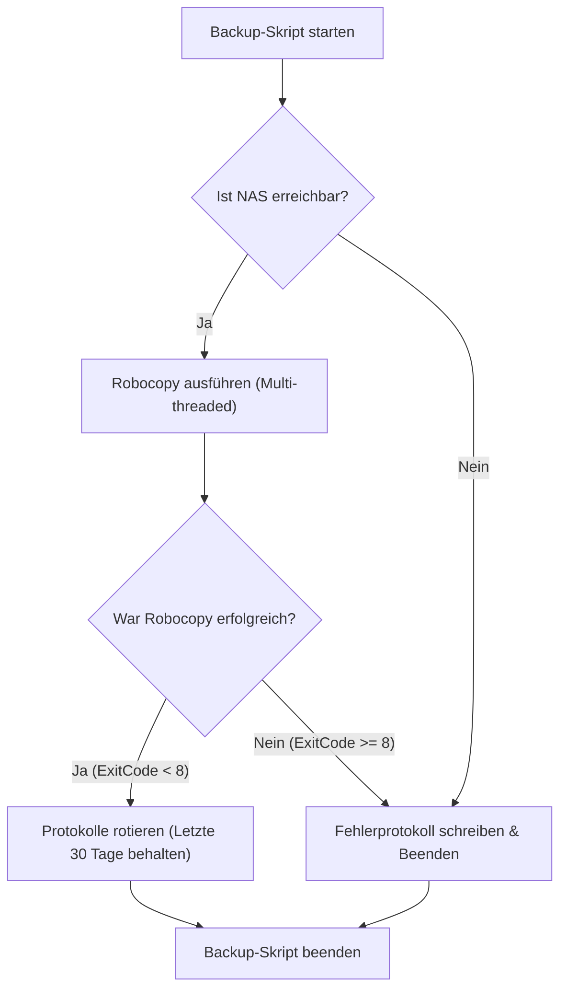
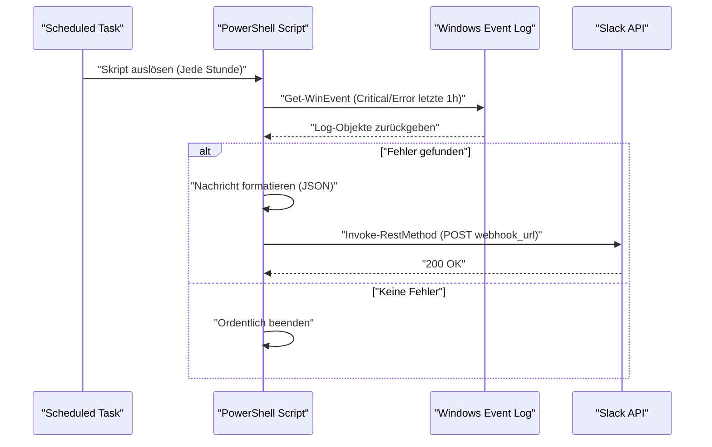

## Einführung: Warum PowerShell zur Automatisierung von Aufgaben nutzen?

In modernen IT-Infrastrukturen und Entwicklungsumgebungen, in denen Windows OS als Plattform genutzt wird, sind "tägliche Routineaufgaben" eine unvermeidliche Herausforderung für Nutzer. Die manuelle Durchführung von Aufgaben wie Dateisicherungen, Überwachung von Systemprotokollen und Aktualisierung sowie Erstellung von Entwicklungsressourcen (Git-Repositories) ist eine Brutstätte für menschliche Fehler und führt zu wertvoller Zeitverschwendung.

Früher wurden Batch-Dateien (`.bat` und `.cmd`) oder VBScript verwendet, aber heutzutage ist die optimale Lösung zweifellos **PowerShell**. PowerShell ist nicht nur eine textbasierte Shell, sondern baut auf der leistungsstarken objektorientierten Basis des .NET Frameworks (und .NET Core) auf. Da die über die Pipeline übergebenen Daten keine "Strings" (Zeichenketten), sondern "Objekte" sind, ist es nicht notwendig, eine komplexe Textanalyse (wie mit grep, awk, sed) selbst zu implementieren, und Sie können leicht auf Daten zugreifen, indem Sie einfach Eigenschaften angeben.

In diesem Artikel stellen wir drei praktische Beispiele für vollständige Automatisierungsskripte mit PowerShell vor, die direkt mit der praktischen Arbeit verknüpft sind (Backup auf ein NAS und Log-Rotation, Ereignisprotokollüberwachung und Slack-Benachrichtigungen, Batch-Update und Build mehrerer Git-Repositories). Vorab werden wir zudem grundlegende Technologien, die dafür erforderlich sind, wie PowerShell-Ausführungsrichtlinien, Modularisierung und die Integration in die Aufgabenplanung (Task Scheduler), eingehend erläutern.

---

## Die Grundlagen für die PowerShell-Automatisierung schaffen

Um Automatisierungsskripte sicher und zuverlässig in einer Produktionsumgebung auszuführen, sind einige Vorbereitungen erforderlich. Hier erläutern wir ausführlich das Verständnis von Ausführungsrichtlinien, die Modularisierung zur Verbesserung der Wiederverwendbarkeit und eine robuste Fehlerbehandlung.

### 1. PowerShell-Ausführungsrichtlinien (Execution Policy)

In Windows ist standardmäßig eine "Ausführungsrichtlinie" eingerichtet, um die versehentliche Ausführung schädlicher Skripte zu verhindern. Im Ausgangszustand (`Restricted`) können überhaupt keine Skripte (`.ps1`-Dateien) ausgeführt werden. Um eine Automatisierung durchzuführen, muss dies auf ein geeignetes Level geändert werden.

Es gibt folgende Arten von Ausführungsrichtlinien:

- **Restricted**: Erlaubt die Ausführung von Skripten nicht. (Standard)
- **AllSigned**: Erlaubt nur die Ausführung von Skripten, die von einem vertrauenswürdigen Herausgeber signiert wurden.
- **RemoteSigned**: Lokal erstellte Skripte können wie gewohnt ausgeführt werden, aber Skripte, die aus dem Internet heruntergeladen wurden, erfordern eine Signatur.
- **Unrestricted**: Alle Skripte können ausgeführt werden, jedoch wird bei der Ausführung von aus dem Internet heruntergeladenen Skripten eine Warnung angezeigt.
- **Bypass**: Nichts wird blockiert und es werden keine Warnungen angezeigt. Wird häufig für temporäre Skriptausführungen (wie CI/CD-Pipelines) verwendet.

Wenn Sie selbst erstellte Skripte über die Aufgabenplanung in der lokalen Umgebung eines Unternehmens ausführen, ist die praktischste und sicherste Einstellung `RemoteSigned`. Starten Sie PowerShell mit Administratorrechten und führen Sie den folgenden Befehl aus.

```powershell
Set-ExecutionPolicy RemoteSigned -Scope LocalMachine -Force
```

Dadurch werden lokal erstellte Backup-Skripte und ähnliches ausgeführt, ohne blockiert zu werden.

### 2. Wiederverwendbarkeit von Code durch Modularisierung (.psm1 / .psd1)

Bei der Durchführung komplexer Automatisierungsprozesse ist es aus Sicht der Wartbarkeit nicht empfehlenswert, alle Prozesse in eine einzige riesige `.ps1`-Datei zu schreiben. Häufig verwendete Funktionen (z. B. Protokollausgabe, Senden von Webhooks an Slack, Fehlerbehandlung usw.) sollten als "Module" aufgeteilt werden.

Ein PowerShell-Modul besteht hauptsächlich aus einer Skriptmodul-Datei (`.psm1`) und einem Modulmanifest (`.psd1`).

Beispiel für **CommonUtils.psm1**:
```powershell
function Write-CustomLog {
    [CmdletBinding()]
    param (
        [Parameter(Mandatory=$true)]
        [string]$Message,
        
        [ValidateSet('INFO', 'WARNING', 'ERROR')]
        [string]$Level = 'INFO'
    )
    
    $timestamp = Get-Date -Format "yyyy-MM-dd HH:mm:ss"
    $logLine = "[$timestamp] [$Level] $Message"
    
    # Sowohl Bildschirmausgabe als auch Dateiausgabe durchführen
    Write-Host $logLine
    Add-Content -Path "C:\logs\automation.log" -Value $logLine
}

Export-ModuleMember -Function Write-CustomLog
```

Um dieses Modul aus einem anderen Skript aufzurufen, verwenden Sie `Import-Module` am Anfang des Skripts.

```powershell
Import-Module "C:\Scripts\Modules\CommonUtils.psm1"
Write-CustomLog -Message "Backup-Vorgang wird gestartet." -Level 'INFO'
```

### 3. Robuste Fehlerbehandlung (try / catch)

Das Wichtigste bei der Automatisierung ist, "wie man sich verhält, wenn etwas schief geht". In PowerShell können Sie das Standardverhalten beim Fehlschlagen eines Befehls steuern, indem Sie die integrierte Variable `$ErrorActionPreference` setzen. Der Standardwert ist `Continue` (Fehler anzeigen und mit der Verarbeitung fortfahren), aber für Automatisierungsskripte ist es die beste Vorgehensweise, ihn auf `Stop` zu setzen und Ausnahmen explizit mit einem `try / catch`-Block abzufangen.

```powershell
$ErrorActionPreference = 'Stop'

try {
    # Ein Vorgang, der fehlschlagen könnte
    $content = Get-Content -Path "C:\NonExistentFile.txt"
} catch [System.Management.Automation.ItemNotFoundException] {
    # Einen spezifischen Fehler abfangen
    Write-Host "Datei nicht gefunden: $($_.Exception.Message)" -ForegroundColor Red
} catch {
    # Alle anderen Fehler abfangen
    Write-Host "Ein unerwarteter Fehler ist aufgetreten: $($_.Exception.Message)" -ForegroundColor Red
} finally {
    # Bereinigungs-Code, der unabhängig von Erfolg oder Fehlschlag immer ausgeführt wird
    Write-Host "Verarbeitung wird beendet."
}
```

Durch Nutzung dieser Basis können Sie Skripte erstellen, die sicher und nachvollziehbar sind, auch wenn sie nachts unbeaufsichtigt laufen.

---

## Integration in die Aufgabenplanung (Task Scheduler) (Register-ScheduledTask)

Sobald das Skript fertig ist, benötigen Sie einen Mechanismus, um es regelmäßig auszuführen. In Windows ist die "Aufgabenplanung" (Task Scheduler) am zuverlässigsten. Es ist zwar möglich, dies über die GUI (`taskschd.msc`) einzurichten, aber aus Sicht von Infrastructure as Code erklären wir hier, wie Aufgaben mithilfe von PowerShell-Cmdlets registriert werden.

PowerShell bietet das Modul `ScheduledTasks`, mit dem Sie Trigger (wann es ausgeführt werden soll), Aktionen (was ausgeführt werden soll) und Prinzipale (unter welchen Benutzerrechten es ausgeführt werden soll) im Detail definieren können.

```powershell
# 1. Aktion definieren (PowerShell ausgeblendet ausführen und das angegebene Skript übergeben)
$action = New-ScheduledTaskAction -Execute "powershell.exe" -Argument "-NoProfile -WindowStyle Hidden -ExecutionPolicy Bypass -File C:\Scripts\DailyTasks.ps1"

# 2. Trigger definieren (Täglich um 03:00 Uhr ausführen)
$trigger = New-ScheduledTaskTrigger -Daily -At "3:00AM"

# 3. Prinzipal (Ausführungsbenutzerrechte) definieren (Mit SYSTEM-Rechten ausführen)
$principal = New-ScheduledTaskPrincipal -UserId "NT AUTHORITY\SYSTEM" -LogonType ServiceAccount -RunLevel Highest

# 4. Aufgabeneinstellungen konfigurieren
$settings = New-ScheduledTaskSettingsSet -AllowStartIfOnBatteries -DontStopIfGoingOnBatteries -StartWhenAvailable -DontStopOnIdleEnd

# 5. Aufgabe registrieren
$taskName = "MyDailyAutomationTask"
Register-ScheduledTask -TaskName $taskName -Action $action -Trigger $trigger -Principal $principal -Settings $settings -Description "Aufgabe zur automatischen Ausführung täglicher Routineaufgaben" -Force
```

Durch einfaches Ausführen dieses Skripts wird ein Job in der Aufgabenplanung registriert, und das Skript wird täglich zur festgelegten Zeit mit SYSTEM-Rechten (den höchsten Rechten, die im Hintergrund ausgeführt werden, ohne ein Fenster anzuzeigen) ausgeführt.

---

## Praxisbeispiel 1: Backup auf externes NAS und Log-Rotation

Die tägliche Sicherung von Geschäftsdaten ist unerlässlich, aber ein manuelles Kopieren ist keine Option. Hier erstellen wir ein Skript, das `Robocopy`, den stärksten Standard-Kopierbefehl in Windows, über PowerShell aufruft, die Ausführungsprotokolle ausgibt und alte Protokolle automatisch löscht (rotiert).

### Theoretischer Wert der Ausführungszeit bei Netzwerkübertragungen (Math)

Beim Entwerfen von Backup-Skripten ist es für den Betrieb wichtig abzuschätzen, wie lange der Vorgang dauern wird. Die geschätzte benötigte Zeit $T_{backup}$ für das Sichern auf einem NAS über das Netzwerk lässt sich durch die folgende Formel annähern.

$$ T_{backup} = \frac{S_{total}}{B \times (1 - \alpha)} + C \times L $$

Hierbei sind die Variablen wie folgt definiert:
- $S_{total}$ : Gesamtmenge der zu sichernden Daten (Bit)
- $B$ : Netzwerkbandbreite (bps, z. B. 1 Gbps = $10^9$ bps)
- $\alpha$ : Overhead des Netzwerks oder Protokolls (normalerweise 0,1 bis 0,2 bei TCP/IP oder SMB-Protokoll)
- $C$ : Gesamtzahl der Dateien
- $L$ : Verarbeitungs-Latenz pro Datei (Sekunden)

Insbesondere bei der Sicherung vieler kleiner Dateien (wie z. B. Quellcode) ist der Term für die Verzögerung aufgrund der Dateianzahl $C$ ($C \times L$) dominant. Aus diesem Grund ist es bei Backup-Vorgängen optimal, `Robocopy` zu verwenden, das Multithreading-Übertragungen ermöglicht, anstatt ein einfaches Datei-Kopiertool zu nutzen.

### Ablaufdiagramm des Backup-Skripts



### PowerShell-Skript Implementierungsbeispiel (`Backup-ToNas.ps1`)

```powershell
$ErrorActionPreference = 'Stop'

# Einstellungen
$SourceDir = "C:\WorkData"
$TargetNasDir = "\\NAS01\Backup\WorkData"
$LogDir = "C:\Scripts\Logs"
$DateStr = Get-Date -Format "yyyyMMdd"
$LogFile = Join-Path $LogDir "Backup_$DateStr.log"
$RetainDays = 30

try {
    # 1. Vorabprüfung: Kann auf das NAS zugegriffen werden?
    if (-not (Test-Path $TargetNasDir)) {
        throw "Auf den NAS-Zielpfad kann nicht zugegriffen werden: $TargetNasDir"
    }

    Write-Host "Backup wird gestartet: $SourceDir -> $TargetNasDir"

    # 2. Robocopy ausführen
    # /MIR : Spiegeln (Dateien löschen, die in der Quelle nicht mehr vorhanden sind)
    # /MT:16 : Multithread-Kopieren mit 16 Threads
    # /NP : Fortschritt (%) nicht ausgeben (um das Protokoll nicht unübersichtlich zu machen)
    # /R:2 /W:2 : 2 Wiederholungsversuche bei Fehler, 2 Sekunden Wartezeit
    $roboArgs = @(
        $SourceDir,
        $TargetNasDir,
        "/MIR",
        "/MT:16",
        "/NP",
        "/R:2",
        "/W:2",
        "/LOG+:$LogFile"
    )

    # Bei Aufruf externer Befehle aus PowerShell heraus ist Start-Process die sicherste Methode
    $process = Start-Process -FilePath "robocopy.exe" -ArgumentList $roboArgs -Wait -NoNewWindow -PassThru
    $exitCode = $process.ExitCode

    # Robocopy Exit-Code-Spezifikation: 0-7 bedeuten Erfolg oder spezifikationsgemäßes Verhalten. 8 und höher sind Fehler
    if ($exitCode -ge 8) {
        throw "Robocopy mit Fehler beendet. ExitCode: $exitCode"
    }

    Write-Host "Backup erfolgreich abgeschlossen. ExitCode: $exitCode"

    # 3. Log-Rotation
    Write-Host "Alte Protokolldateien werden gelöscht (Aufbewahrungsdauer: ${RetainDays} Tage)"
    $limitDate = (Get-Date).AddDays(-$RetainDays)
    Get-ChildItem -Path $LogDir -Filter "Backup_*.log" | 
        Where-Object { $_.LastWriteTime -lt $limitDate } | 
        Remove-Item -Force

    Write-Host "Log-Bereinigung abgeschlossen."

} catch {
    $errorMessage = "Während des Backup-Vorgangs ist ein Fehler aufgetreten: $($_.Exception.Message)"
    Write-Error $errorMessage
    # In die eigentliche Fehlerprotokolldatei schreiben
    Add-Content -Path (Join-Path $LogDir "Error.log") -Value "[(Get-Date -Format 'yyyy-MM-dd HH:mm:ss')] $errorMessage"
    # Mit Code 1 beenden (ungleich null), um die Aufgabenplanung über den Fehler zu benachrichtigen
    exit 1
}
```

Dieses Skript in Kombination mit der Aufgabenplanung realisiert ein vollautomatisches, tägliches Backup. Insbesondere die Behandlung der Exit-Codes von `Robocopy` ist sehr wichtig. Beachten Sie, dass Robocopy auch bei Erfolg eine 1 zurückgeben kann (wenn "neue Dateien kopiert wurden") oder eine 2 (wenn "zusätzliche Dateien gelöscht wurden"), sodass eine einfache Überprüfung wie `$LASTEXITCODE -eq 0` nicht korrekt funktionieren würde.

---

## Praxisbeispiel 2: Überwachung des Systemereignisprotokolls und Slack-Benachrichtigung (Webhook)

Bei Windows-Servern oder Workstations für Kreative ist es äußerst wichtig, frühzeitig Festplattenfehler zu erkennen, die Vorboten eines Bluescreens (BSoD) sein könnten, oder Anwendungscrashs (Application Errors) festzustellen.
Hier erstellen wir ein Skript, das Protokolle der Stufen "Fehler" (Error) und "Kritisch" (Critical) der letzten Stunde aus den Ereignisprotokollen `System` und `Application` extrahiert und beim Auffinden eine Benachrichtigung an Slack sendet.

### Sequenzdiagramm des Benachrichtigungsprozesses



### PowerShell-Skript Implementierungsbeispiel (`Monitor-EventLog.ps1`)

```powershell
$ErrorActionPreference = 'Stop'

# Slack Webhook URL (vorab über die Slack Incoming Webhooks Integration beziehen)
$SlackWebhookUrl = "https://hooks.slack.com/services/TXXXXX/BXXXXX/XXXXXXXXXXXXX"

# Zeitbereich für die Suche (vergangene 1 Stunde)
$startTime = (Get-Date).AddHours(-1)

# Ereignisprotokolle schnell mithilfe von XPath-Filtern durchsuchen
# Level 1: Kritisch (Critical), 2: Fehler (Error)
$xmlFilter = @"
<QueryList>
  <Query Id="0" Path="System">
    <Select Path="System">*[System[(Level=1 or Level=2) and TimeCreated[@SystemTime&gt;='$($startTime.ToUniversalTime().ToString("o"))']]]</Select>
  </Query>
  <Query Id="1" Path="Application">
    <Select Path="Application">*[System[(Level=1 or Level=2) and TimeCreated[@SystemTime&gt;='$($startTime.ToUniversalTime().ToString("o"))']]]</Select>
  </Query>
</QueryList>
"@

try {
    # Protokolle mit Get-WinEvent abrufen
    # -ErrorAction SilentlyContinue ignoriert Fehler, wenn keine Protokolle gefunden werden
    $events = Get-WinEvent -FilterXml $xmlFilter -ErrorAction SilentlyContinue

    if ($events -and $events.Count -gt 0) {
        $eventCount = $events.Count
        Write-Host "In der vergangenen Stunde wurden $eventCount Fehler/kritische Protokolle gefunden."

        # Text für die Benachrichtigung zusammensetzen
        $messageBody = "*Windows System-Alarm* :rotating_light:`n"
        $messageBody += "In der vergangenen Stunde wurden $eventCount Fehler erkannt.`n`n"

        # Nur Details zu den letzten 3 Einträgen anzeigen (unter Berücksichtigung von Zeichenbeschränkungen usw.)
        $events | Select-Object -First 3 | ForEach-Object {
            $messageBody += "*$($_.LogName)* - $($_.ProviderName) (EventID: $($_.Id))`n"
            $messageBody += "> $($_.Message -replace '`n', ' ')`n`n"
        }

        if ($eventCount -gt 3) {
            $messageBody += "※Es gibt $($eventCount - 3) weitere Fehler. Bitte überprüfen Sie die Ereignisanzeige (Event Viewer)."
        }

        # JSON-Nutzlast (Payload) zum POSTen in Slack erstellen
        $payload = @{
            text = $messageBody
            username = "SystemMonitor"
            icon_emoji = ":desktop_computer:"
        }
        $jsonPayload = $payload | ConvertTo-Json -Depth 3

        # REST API aufrufen und an Slack senden
        Invoke-RestMethod -Uri $SlackWebhookUrl -Method Post -Body $jsonPayload -ContentType "application/json; charset=utf-8"
        
        Write-Host "Benachrichtigung an Slack wurde gesendet."
    } else {
        Write-Host "Keine Fehler oder kritischen Protokolle gefunden. Das System funktioniert normal."
    }
} catch {
    Write-Error "Ein Fehler ist im Ereignisprotokoll-Überwachungsskript aufgetreten: $($_.Exception.Message)"
    exit 1
}
```

Der technische Kern dieses Skripts ist die Verwendung von `Get-WinEvent -FilterXml`. Herkömmliche Cmdlets wie `Get-EventLog` oder die Filterung mit `Where-Object` über Pipelines sind extrem langsam, da sie alle Ereignisobjekte zuerst in den Arbeitsspeicher laden und dann verarbeiten. Durch die Verwendung von XML-Filtern wird die Filterung auf Seiten des Windows-Ereignisprotokolldienstes durchgeführt. Dies führt zu einer drastischen Leistungssteigerung, bei der die Ausführungszeit meist im Bereich von wenigen Sekunden liegt.

---

## Praxisbeispiel 3: Batch-Aktualisierung mehrerer Git-Repositories und Build-Automatisierung

Für Entwickler ist es sehr mühsam, am frühen Morgen als Erstes mehrere Git-Repositories (z.B. Frontend, Backend, Infrastruktur-Repositories) auf dem eigenen Arbeits-PC mit dem neuesten `main`-Branch zu synchronisieren und bei Bedarf die Installation von Paketen (wie `npm install`) oder Builds durchzuführen.
Wir erstellen ein Tool, das dies mithilfe eines PowerShell-Skripts auf einmal erledigt.

Dieses Skript erkennt automatisch alle Git-Repositories unterhalb eines bestimmten übergeordneten Verzeichnisses und führt ein `git pull` aus, falls es keine nicht-festgeschriebenen (uncommitted) Änderungen gibt. Wenn neue Änderungen gezogen (gepullt) werden, wird außerdem automatisch ein Build-Befehl ausgeführt.

### Skript zur automatischen Aktualisierung mehrerer Repositories (`Update-GitRepos.ps1`)

```powershell
$ErrorActionPreference = 'Stop'

# Liste der übergeordneten Verzeichnisse, in denen sich die Repositories befinden
$TargetDirectories = @(
    "C:\Dev\FrontendProjects",
    "C:\Dev\BackendProjects"
)

# Jedes Verzeichnis durchsuchen
foreach ($parentDir in $TargetDirectories) {
    if (-not (Test-Path $parentDir)) {
        Write-Warning "Verzeichnis nicht gefunden: $parentDir"
        continue
    }

    # Liste der Unterverzeichnisse abrufen
    $subDirs = Get-ChildItem -Path $parentDir -Directory
    
    foreach ($repoDir in $subDirs) {
        $repoPath = $repoDir.FullName
        $gitDir = Join-Path $repoPath ".git"

        # Prüfen, ob der Ordner .git existiert (ob es ein Git-Repository ist)
        if (Test-Path $gitDir) {
            Write-Host "---------------------------------"
            Write-Host "Verarbeite Repository: $repoPath" -ForegroundColor Cyan
            
            # Das aktuelle Arbeitsverzeichnis in PowerShell ändern
            Set-Location -Path $repoPath

            try {
                # Auf uncommitted Änderungen prüfen
                $status = git status --porcelain
                if ($status) {
                    Write-Host "Übersprungen, da nicht-festgeschriebene Änderungen vorhanden sind." -ForegroundColor Yellow
                    continue
                }

                # Den aktuellen Branch (Zweig) ermitteln
                $branch = git rev-parse --abbrev-ref HEAD
                if ($branch -ne "main" -and $branch -ne "master") {
                    Write-Host "Übersprungen, da der aktuelle Branch $branch ist (nur main/master wird unterstützt)." -ForegroundColor Yellow
                    continue
                }

                # Pull ausführen und das Ergebnis in einer Variablen speichern
                Write-Host "Die neuesten Änderungen vom Remote-Repository werden abgerufen (git pull)..."
                $pullResult = git pull origin $branch 2>&1
                
                # Auch auf der Konsole ausgeben
                $pullResult | ForEach-Object { Write-Host "  $_" }

                # Wenn eine andere Zeichenfolge als "Already up to date." enthalten ist, wird davon ausgegangen, dass es ein Update gab
                $isUpdated = $false
                foreach ($line in $pullResult) {
                    if ($line -notmatch "Already up to date") {
                        $isUpdated = $true
                        break
                    }
                }

                if ($isUpdated) {
                    Write-Host "Repository wurde aktualisiert. Build-Aufgabe wird gestartet..." -ForegroundColor Green
                    
                    # Wenn package.json vorhanden ist, npm install und npm run build ausführen
                    if (Test-Path "package.json") {
                        Write-Host "Führe npm install aus..."
                        npm install
                        Write-Host "Führe npm run build aus..."
                        npm run build
                    }
                    
                    # Wenn .sln (Visual Studio Solution) vorhanden ist, msbuild oder dotnet build ausführen
                    $slnFiles = Get-ChildItem -Filter "*.sln"
                    if ($slnFiles.Count -gt 0) {
                        Write-Host "Erstelle .NET-Anwendung..."
                        dotnet build $slnFiles[0].FullName
                    }
                }

            } catch {
                Write-Error "Ein Fehler ist bei der Verarbeitung des Repositories $repoPath aufgetreten: $($_.Exception.Message)"
            }
        }
    }
}

Write-Host "---------------------------------"
Write-Host "Aktualisierung aller Repositories abgeschlossen." -ForegroundColor Green
```

Dieses Skript ist so konzipiert, dass auch bei einem Fehler in einem Repository dank `try / catch` und der `foreach`-Schleife die Verarbeitung der nächsten Repositories problemlos fortgesetzt wird. Darüber hinaus wird die Option `git status --porcelain`, die speziell für die Skriptverarbeitung gedacht ist, genutzt, um den "Sauberkeitszustand" (Cleanliness) des Arbeitsbaums (Working Tree) zuverlässig zu bestimmen. Wenn Sie dieses Skript im Autostart-Ordner ablegen oder es im Task-Scheduler beim Anmelden des Benutzers registrieren, sind all Ihre Entwicklungsumgebungen auf dem neuesten Stand, während Sie sich nach dem Booten des PCs einen Kaffee holen.

---

## Hinweise zum Betrieb und fortgeschrittene Techniken

Beim langfristigen Betrieb von Automatisierungsskripten mit PowerShell gibt es einige bewährte Methoden (Best Practices), die Sie beachten sollten.

### 1. Sichere Verwaltung von Zugangsdaten
Passwörter oder API-Schlüssel (z. B. Slack Webhook URL, Datenbank-Verbindungszeichenfolgen) als Klartext im Skript fest zu codieren (Hardcoding), stellt ein großes Sicherheitsrisiko dar. PowerShell verfügt über Funktionen wie `Export-Clixml` und `ConvertFrom-SecureString`, um Authentifizierungsinformationen verschlüsselt zu speichern.

```powershell
# Nur beim ersten Mal manuell ausführen (Ein Dialogfeld zur Passworteingabe wird angezeigt)
# Get-Credential | Export-Clixml -Path "C:\Scripts\Creds\admin.xml"

# Einlesen innerhalb des Automatisierungsskripts
$cred = Import-Clixml -Path "C:\Scripts\Creds\admin.xml"
# Nutzen Sie $cred, um z. B. eine Verbindung zum Remote-Server herzustellen
```

Dies ermöglicht einen sicheren Umgang mit Authentifizierungsinformationen, die nur im Profil des Benutzers entschlüsselt werden können, der das Skript ausführt.

### 2. Vollständige Aufzeichnung von Ausführungsprotokollen mit Transcript
In den vorherigen Beispielen wurden Protokolle einzeln mit Befehlen wie `Add-Content` ausgegeben. PowerShell verfügt jedoch über eine Transcript-Funktion, die automatisch alle auf dem Bildschirm ausgegebenen Informationen (einschließlich Fehlermeldungen und Standardausgabe) in eine Datei schreibt.

Fügen Sie einfach Folgendes am Anfang und am Ende des Skripts ein, um ein robustes Audit-Protokoll (Audit Log) zu erstellen.

```powershell
Start-Transcript -Path "C:\Scripts\Logs\Execution_$(Get-Date -Format 'yyyyMMdd_HHmmss').log" -Append

# (Hier steht die eigentliche Skriptlogik)

Stop-Transcript
```

### 3. Mathematischer Ansatz zur Überwachung und Anomalieerkennung (Math)

Bei groß angelegten Automatisierungen ist es effektiv, nicht nur Fehler zu erkennen, sondern auch "Ungewöhnliches" statistisch zu erfassen. Wenn beispielsweise die tägliche Backup-Zeit extrem vom Durchschnitt abweicht, könnte dies ein Vorbote für ein Netzwerkproblem oder einen Festplattenausfall sein.

Angenommen, die täglichen Backup-Zeiten sind $x_1, x_2, \dots, x_n$. Dann lassen sich der Stichprobenmittelwert (Sample Mean) $\mu$ und die Standardabweichung $\sigma$ wie folgt berechnen:

$$ \mu = \frac{1}{n} \sum_{i=1}^n x_i $$
$$ \sigma = \sqrt{ \frac{1}{n-1} \sum_{i=1}^n (x_i - \mu)^2 } $$

Wenn die heutige Ausführungszeit $x_{today}$ den Wert von $\mu + 3\sigma$ überschreitet (Drei-Sigma-Regel), kann das System dies als "statistische Anomalie" betrachten und eine Logik implementieren, die eine Warnmeldung ausgibt. Mit dem PowerShell-Cmdlet `Measure-Object` lassen sich derartige statistische Vorgänge in nur wenigen Zeilen umsetzen.

## Zusammenfassung

In diesem Artikel haben wir anhand von Praxisbeispielen erläutert, wie Sie Routineaufgaben in Windows-Umgebungen mithilfe von PowerShell vollständig automatisieren können.
Beginnend mit grundlegenden Schritten wie der Verwaltung von Ausführungsrichtlinien und der Modularisierung haben wir Skripte vorgestellt, die in der Praxis direkt einsetzbar sind, wie z.B. Backups und Log-Rotation, Überwachung von Ereignisprotokollen mit Slack-Benachrichtigungen und den automatisierten Build für mehrere Git-Repositories.

PowerShell ist äußerst tiefgreifend; es ist eine leistungsstarke Automatisierungs-Engine, die, obwohl sie ein Kommandozeilenwerkzeug ist, auf fast alle Funktionen von .NET zugreifen kann. Basierend auf den hier vorgestellten Skripten können Sie Pfade und Logiken an Ihre eigene Arbeitsumgebung anpassen und so kreative Zeit gewinnen, befreit von mühsamer manueller Arbeit.

Der Erfolg der Automatisierung hängt davon ab, "mit kleinen Skripten anzufangen und nach und nach deren Robustheit wie Fehlerbehandlung und Protokollierung zu verbessern". Wie wäre es, Ihre Reise in die PowerShell-Automatisierung zu starten, indem Sie einfach zunächst einen einzigen Ordner auf Ihrem eigenen PC sichern?
