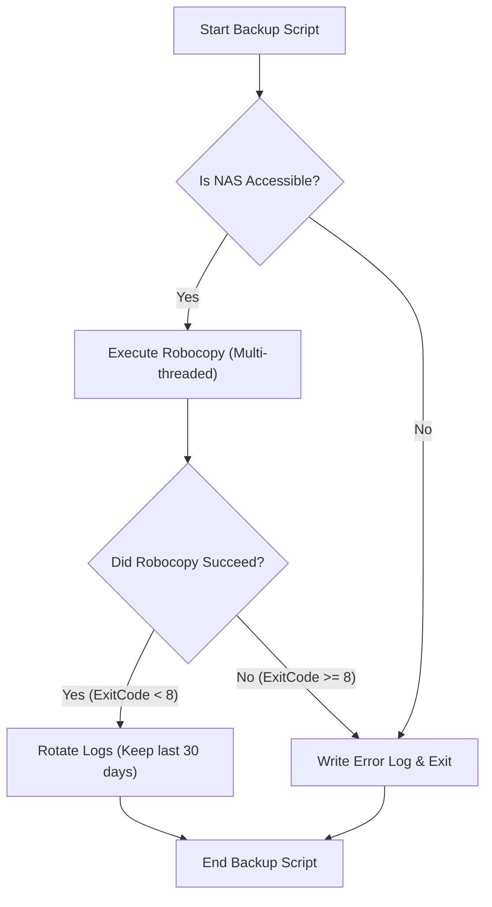
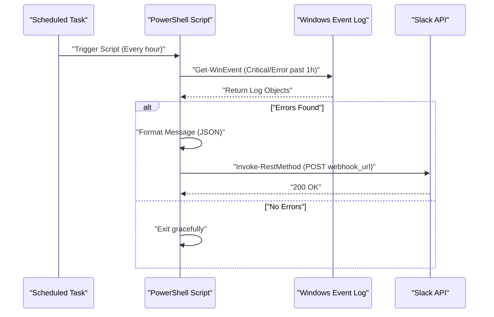

## Introduction: Why Automate Tasks with PowerShell?

In modern IT infrastructures and development environments, "daily routine tasks" are an unavoidable challenge for users utilizing the Windows OS as a platform. Performing tasks such as file backups, system log monitoring, and updating/building development resources (Git repositories) manually becomes a breeding ground for human error and leads to a waste of valuable time.

In the past, batch files (`.bat` and `.cmd`) and VBScript were used, but today, the optimal solution is undoubtedly **PowerShell**. PowerShell is not just a text-based shell; it is built on the powerful object-oriented foundation of the .NET Framework (and .NET Core). Because the data passed through the pipeline consists of "objects" rather than "strings", there is no need to implement complex text parsing (like grep, awk, or sed processing) on your own. You can easily access data simply by specifying properties.

In this article, we will introduce three practical, fully automated script examples using PowerShell that directly relate to actual operations (backup to NAS and log rotation, event log monitoring and Slack notifications, and batch updating/building of multiple Git repositories). Prior to that, we will also delve into and explain foundational technologies required, such as PowerShell execution policies, modularization, and Task Scheduler integration.

---

## Establishing the Foundation for PowerShell Automation

To operate automation scripts safely and reliably in a production environment, some preparation is required. Here, we will detail understanding execution policies, modularization to enhance reusability, and robust error handling.

### 1. PowerShell Execution Policy (Execution Policy)

In Windows, an "Execution Policy" is set by default to prevent malicious scripts from being executed accidentally. In its initial state (`Restricted`), no scripts (`.ps1` files) can be executed at all. To automate tasks, this must be changed to an appropriate level.

The execution policies include the following types:

- **Restricted**: Does not allow any scripts to run. (Default)
- **AllSigned**: Allows execution only for scripts signed by a trusted publisher.
- **RemoteSigned**: Scripts created locally can be run as is, but scripts downloaded from the internet require a signature.
- **Unrestricted**: All scripts can be run, but a warning will be displayed when running scripts downloaded from the internet.
- **Bypass**: Nothing is blocked, and no warnings are displayed. Often used for temporary script execution (such as CI/CD pipelines).

When running your own scripts locally in a corporate environment using the Task Scheduler, the most realistic and safe setting is `RemoteSigned`. Launch PowerShell with administrator privileges and run the following command:

```powershell
Set-ExecutionPolicy RemoteSigned -Scope LocalMachine -Force
```

This ensures that locally created backup scripts and others will run without being blocked.

### 2. Code Reusability through Modularization (.psm1 / .psd1)

When performing complex automation tasks, writing all the processing in a single huge `.ps1` file is not recommended from a maintainability perspective. Frequently used functions (e.g., log output, sending Webhooks to Slack, error handling) should be separated into "modules".

PowerShell modules primarily consist of a script module file (`.psm1`) and a module manifest (`.psd1`).

Example of **CommonUtils.psm1**:
```powershell
function Write-CustomLog {
    [CmdletBinding()]
    param (
        [Parameter(Mandatory=$true)]
        [string]$Message,
        
        [ValidateSet('INFO', 'WARNING', 'ERROR')]
        [string]$Level = 'INFO'
    )
    
    $timestamp = Get-Date -Format "yyyy-MM-dd HH:mm:ss"
    $logLine = "[$timestamp] [$Level] $Message"
    
    # Execute both screen output and file output
    Write-Host $logLine
    Add-Content -Path "C:\logs\automation.log" -Value $logLine
}

Export-ModuleMember -Function Write-CustomLog
```

To call this module from another script, use `Import-Module` at the beginning of the script.

```powershell
Import-Module "C:\Scripts\Modules\CommonUtils.psm1"
Write-CustomLog -Message "Starting backup process." -Level 'INFO'
```

### 3. Robust Error Handling (try / catch)

The most important aspect of automation is "how to behave when it fails." In PowerShell, you can control the default behavior upon command failure by setting the built-in variable `$ErrorActionPreference`. The default is `Continue` (displays the error and continues processing), but for automation scripts, it is best practice to set it to `Stop` and explicitly catch exceptions using `try / catch` blocks.

```powershell
$ErrorActionPreference = 'Stop'

try {
    # Process that might fail
    $content = Get-Content -Path "C:\NonExistentFile.txt"
} catch [System.Management.Automation.ItemNotFoundException] {
    # Catch a specific error
    Write-Host "File not found: $($_.Exception.Message)" -ForegroundColor Red
} catch {
    # Catch all other errors
    Write-Host "An unexpected error occurred: $($_.Exception.Message)" -ForegroundColor Red
} finally {
    # Cleanup process that runs regardless of success or failure
    Write-Host "Terminating the process."
}
```

By leveraging this foundation, you can build scripts that operate safely and trackably even when running unattended overnight.

---

## Task Scheduler Integration (Register-ScheduledTask)

Once the script is complete, the next thing needed is a mechanism to run the script on a regular basis. The most reliable method in Windows is the "Task Scheduler". While it can be configured from the GUI (`taskschd.msc`), we will explain how to register tasks using PowerShell cmdlets from the perspective of coding infrastructure procedures (Infrastructure as Code).

PowerShell provides the `ScheduledTasks` module, which allows you to define triggers (when to run), actions (what to run), and principals (under which user privileges to run) in detail.

```powershell
# 1. Define the action (run PowerShell hidden and pass the specified script)
$action = New-ScheduledTaskAction -Execute "powershell.exe" -Argument "-NoProfile -WindowStyle Hidden -ExecutionPolicy Bypass -File C:\Scripts\DailyTasks.ps1"

# 2. Define the trigger (run daily at 3:00 AM)
$trigger = New-ScheduledTaskTrigger -Daily -At "3:00AM"

# 3. Define the principal (execution user privileges) (run with SYSTEM privileges)
$principal = New-ScheduledTaskPrincipal -UserId "NT AUTHORITY\SYSTEM" -LogonType ServiceAccount -RunLevel Highest

# 4. Build task settings
$settings = New-ScheduledTaskSettingsSet -AllowStartIfOnBatteries -DontStopIfGoingOnBatteries -StartWhenAvailable -DontStopOnIdleEnd

# 5. Register the task
$taskName = "MyDailyAutomationTask"
Register-ScheduledTask -TaskName $taskName -Action $action -Trigger $trigger -Principal $principal -Settings $settings -Description "Task that automatically executes daily routine tasks" -Force
```

Simply running this script registers a job in the Task Scheduler, and the script will be executed every day at the specified time with SYSTEM privileges (the highest privileges, in the background without displaying a screen).

---

## Practical Example 1: Backup to External NAS and Log Rotation

Backing up daily business data is mandatory, but manual copying is out of the question. Here, we will create a script that calls `Robocopy`, the strongest copy command standard in Windows, from PowerShell, outputs the execution result log, and automatically deletes (rotates) older logs.

### Theoretical Value of Execution Time in Network Transfer (Math)

When designing a backup script, it is operationally important to estimate how long the process will take to complete. The estimated required time $T_{backup}$ when backing up to a NAS over a network can be approximated by the following formula:

$$ T_{backup} = \frac{S_{total}}{B \times (1 - \alpha)} + C \times L $$

Here, each variable is as follows:
- $S_{total}$ : Total amount of data to be backed up (Bits)
- $B$ : Network bandwidth (bps, e.g., 1Gbps = $10^9$ bps)
- $\alpha$ : Network and protocol overhead (usually 0.1 to 0.2 for TCP/IP and SMB protocols)
- $C$ : Total number of files
- $L$ : Processing latency per file (seconds)

Particularly when backing up a large number of small files (like source code), the delay term due to the number of files $C$ ($C \times L$) becomes dominant. For this reason, it is optimal to use `Robocopy`, which is capable of multi-threaded transfer, rather than a simple file copy tool for backup processes.

### Backup Script Processing Flow



### PowerShell Script Implementation Example (`Backup-ToNas.ps1`)

```powershell
$ErrorActionPreference = 'Stop'

# Settings
$SourceDir = "C:\WorkData"
$TargetNasDir = "\\NAS01\Backup\WorkData"
$LogDir = "C:\Scripts\Logs"
$DateStr = Get-Date -Format "yyyyMMdd"
$LogFile = Join-Path $LogDir "Backup_$DateStr.log"
$RetainDays = 30

try {
    # 1. Pre-check: Is the NAS accessible?
    if (-not (Test-Path $TargetNasDir)) {
        throw "Cannot access NAS target path: $TargetNasDir"
    }

    Write-Host "Starting backup: $SourceDir -> $TargetNasDir"

    # 2. Execute Robocopy
    # /MIR : Mirror a directory tree (delete files not present in the source)
    # /MT:16 : Multi-threaded copy with 16 threads
    # /NP : Do not output progress (%) (to prevent log pollution)
    # /R:2 /W:2 : 2 retries on failed copies, with a 2-second wait
    $roboArgs = @(
        $SourceDir,
        $TargetNasDir,
        "/MIR",
        "/MT:16",
        "/NP",
        "/R:2",
        "/W:2",
        "/LOG+:$LogFile"
    )

    # Start-Process is reliable when calling external commands from PowerShell
    $process = Start-Process -FilePath "robocopy.exe" -ArgumentList $roboArgs -Wait -NoNewWindow -PassThru
    $exitCode = $process.ExitCode

    # Robocopy exit code specifications: 0-7 are success or expected behavior. 8 and above are errors.
    if ($exitCode -ge 8) {
        throw "Robocopy exited with an error. ExitCode: $exitCode"
    }

    Write-Host "Backup completed successfully. ExitCode: $exitCode"

    # 3. Log Rotation
    Write-Host "Deleting old log files (Retention period: ${RetainDays} days)"
    $limitDate = (Get-Date).AddDays(-$RetainDays)
    Get-ChildItem -Path $LogDir -Filter "Backup_*.log" | 
        Where-Object { $_.LastWriteTime -lt $limitDate } | 
        Remove-Item -Force

    Write-Host "Log cleanup is complete."

} catch {
    $errorMessage = "An error occurred during the backup process: $($_.Exception.Message)"
    Write-Error $errorMessage
    # Write to the actual error log file
    Add-Content -Path (Join-Path $LogDir "Error.log") -Value "[(Get-Date -Format 'yyyy-MM-dd HH:mm:ss')] $errorMessage"
    # Exit with a non-zero code to notify the Task Scheduler of the error
    exit 1
}
```

This script, combined with the Task Scheduler, achieves fully automated daily backups. Handling the `Robocopy` exit code is particularly important. Even on success, Robocopy returns 1 if "new files were copied," and 2 if "extra files were deleted," so it is important to note that a simple check like `$LASTEXITCODE -eq 0` will not work correctly.

---

## Practical Example 2: System Event Log Monitoring and Slack Notifications (Webhook)

In Windows servers or creator workstations, it is extremely important to quickly detect disk errors, which foreshadow Blue Screens of Death (BSoD), or application crashes (Application Errors).
Here, we will create a script that extracts "Error" and "Critical" level logs from the `System` and `Application` event logs over the past hour, and sends a notification to Slack if any are found.

### Notification Processing Sequence Diagram



### PowerShell Script Implementation Example (`Monitor-EventLog.ps1`)

```powershell
$ErrorActionPreference = 'Stop'

# Slack Webhook URL (Obtain beforehand via Slack's Incoming Webhooks integration)
$SlackWebhookUrl = "https://hooks.slack.com/services/TXXXXX/BXXXXX/XXXXXXXXXXXXX"

# Search time range (past 1 hour)
$startTime = (Get-Date).AddHours(-1)

# Use XPath filters to search event logs at high speed
# Level 1: Critical, 2: Error
$xmlFilter = @"
<QueryList>
  <Query Id="0" Path="System">
    <Select Path="System">*[System[(Level=1 or Level=2) and TimeCreated[@SystemTime&gt;='$($startTime.ToUniversalTime().ToString("o"))']]]</Select>
  </Query>
  <Query Id="1" Path="Application">
    <Select Path="Application">*[System[(Level=1 or Level=2) and TimeCreated[@SystemTime&gt;='$($startTime.ToUniversalTime().ToString("o"))']]]</Select>
  </Query>
</QueryList>
"@

try {
    # Retrieve logs using Get-WinEvent
    # -ErrorAction SilentlyContinue is to ignore errors when no logs are found
    $events = Get-WinEvent -FilterXml $xmlFilter -ErrorAction SilentlyContinue

    if ($events -and $events.Count -gt 0) {
        $eventCount = $events.Count
        Write-Host "Found $eventCount error/critical logs in the past hour."

        # Assemble the text for the notification
        $messageBody = "*Windows System Alert* :rotating_light:`n"
        $messageBody += "$eventCount errors have been detected in the past hour.`n`n"

        # Include details for only the latest 3 entries (considering character limits, etc.)
        $events | Select-Object -First 3 | ForEach-Object {
            $messageBody += "*$($_.LogName)* - $($_.ProviderName) (EventID: $($_.Id))`n"
            $messageBody += "> $($_.Message -replace '`n', ' ')`n`n"
        }

        if ($eventCount -gt 3) {
            $messageBody += "*There are $($eventCount - 3) other errors. Please check the Event Viewer."
        }

        # Create a JSON payload to POST to Slack
        $payload = @{
            text = $messageBody
            username = "SystemMonitor"
            icon_emoji = ":desktop_computer:"
        }
        $jsonPayload = $payload | ConvertTo-Json -Depth 3

        # Call the REST API to send to Slack
        Invoke-RestMethod -Uri $SlackWebhookUrl -Method Post -Body $jsonPayload -ContentType "application/json; charset=utf-8"
        
        Write-Host "Slack notification sent successfully."
    } else {
        Write-Host "No error/critical logs found. The system is operating normally."
    }
} catch {
    Write-Error "An error occurred in the event log monitoring script: $($_.Exception.Message)"
    exit 1
}
```

The technical point of this script is the use of `Get-WinEvent -FilterXml`. Filtering via the pipeline with `Where-Object` or the traditional `Get-EventLog` cmdlet is extremely slow because it loads all event objects into memory before processing. By using XML filters, the filtering is performed on the Windows event log service side, which leads to an overwhelming performance improvement, keeping the execution time within a few seconds.

---

## Practical Example 3: Batch Updating Multiple Git Repositories and Build Automation

For developers, it is very tedious first thing in the morning to sync multiple Git repositories (frontend, backend, infrastructure repositories, etc.) on their work PC to the latest `main` branch, and perform package installations (like `npm install`) and builds as needed.
We will create a tool to perform this in batches using a PowerShell script.

This script automatically detects all Git repositories under a specific parent directory and runs `git pull` if there are no uncommitted changes. Furthermore, if new changes are pulled, it automatically issues a build command.

### Multiple Repository Automatic Update Script (`Update-GitRepos.ps1`)

```powershell
$ErrorActionPreference = 'Stop'

# List of parent directories where repositories are located
$TargetDirectories = @(
    "C:\Dev\FrontendProjects",
    "C:\Dev\BackendProjects"
)

# Explore each directory
foreach ($parentDir in $TargetDirectories) {
    if (-not (Test-Path $parentDir)) {
        Write-Warning "Directory not found: $parentDir"
        continue
    }

    # Get a list of subdirectories
    $subDirs = Get-ChildItem -Path $parentDir -Directory
    
    foreach ($repoDir in $subDirs) {
        $repoPath = $repoDir.FullName
        $gitDir = Join-Path $repoPath ".git"

        # Check if the .git folder exists (is it a Git repository?)
        if (Test-Path $gitDir) {
            Write-Host "---------------------------------"
            Write-Host "Processing repository: $repoPath" -ForegroundColor Cyan
            
            # Change PowerShell's current working directory
            Set-Location -Path $repoPath

            try {
                # Check for uncommitted changes
                $status = git status --porcelain
                if ($status) {
                    Write-Host "Skipping because there are uncommitted changes." -ForegroundColor Yellow
                    continue
                }

                # Get the current branch
                $branch = git rev-parse --abbrev-ref HEAD
                if ($branch -ne "main" -and $branch -ne "master") {
                    Write-Host "Skipping because the current branch is $branch (only main/master are targeted)." -ForegroundColor Yellow
                    continue
                }

                # Execute Pull and store the result in a variable
                Write-Host "Fetching the latest from remote (git pull)..."
                $pullResult = git pull origin $branch 2>&1
                
                # Also output to the console
                $pullResult | ForEach-Object { Write-Host "  $_" }

                # If the string "Already up to date." is not included, assume there was an update
                $isUpdated = $false
                foreach ($line in $pullResult) {
                    if ($line -notmatch "Already up to date") {
                        $isUpdated = $true
                        break
                    }
                }

                if ($isUpdated) {
                    Write-Host "Repository has been updated. Starting the build task..." -ForegroundColor Green
                    
                    # If package.json exists, run npm install and npm run build
                    if (Test-Path "package.json") {
                        Write-Host "Running npm install..."
                        npm install
                        Write-Host "Running npm run build..."
                        npm run build
                    }
                    
                    # If a .sln (Visual Studio Solution) exists, run msbuild or dotnet build
                    $slnFiles = Get-ChildItem -Filter "*.sln"
                    if ($slnFiles.Count -gt 0) {
                        Write-Host "Building .NET application..."
                        dotnet build $slnFiles[0].FullName
                    }
                }

            } catch {
                Write-Error "An error occurred while processing repository $repoPath: $($_.Exception.Message)"
            }
        }
    }
}

Write-Host "---------------------------------"
Write-Host "All repository update processes have been completed." -ForegroundColor Green
```

This script is designed so that even if an error occurs, the `try / catch` and `foreach` loop allow it to continue to the next repository without affecting the process. In addition, it uses the `git status --porcelain` option, which is suitable for script processing, to accurately determine the cleanliness of the working tree. By placing this script in the startup folder or registering it in the Task Scheduler upon user logon, all development environments will be up-to-date while you turn on your PC and make coffee.

---

## Operational Points to Note and Advanced Techniques

When operating automation scripts using PowerShell over a long period, there are several best practices you should be aware of.

### 1. Secure Management of Credentials
Hardcoding passwords or API keys (e.g., Slack Webhook URL, database connection strings) in plain text within a script is a major security risk. PowerShell is equipped with functions like `Export-Clixml` and `ConvertFrom-SecureString` to encrypt and store credentials.

```powershell
# Execute manually only for the first time (a password input dialog will appear)
# Get-Credential | Export-Clixml -Path "C:\Scripts\Creds\admin.xml"

# Loading inside the automation script
$cred = Import-Clixml -Path "C:\Scripts\Creds\admin.xml"
# Perform remote server connections, etc., using $cred
```

This enables the secure handling of credentials, which can only be decrypted by the profile of the user running the script.

### 2. Full Recording of Execution Logs via Transcripts
In the previous examples, logs were output individually using `Add-Content`, but PowerShell has a transcript function that automatically writes all information output to the screen (including error messages and standard output) to a file.

You can create robust audit logs simply by writing the following at the beginning and end of your script:

```powershell
Start-Transcript -Path "C:\Scripts\Logs\Execution_$(Get-Date -Format 'yyyyMMdd_HHmmss').log" -Append

# (Main script processing goes here)

Stop-Transcript
```

### 3. Mathematical Approaches to Monitoring and Anomaly Detection (Math)

In large-scale automation, it is effective not only to detect errors but also to use statistical methods to detect when things are "different from usual." For instance, if the daily backup time deviates significantly from the normal average, it could be a sign of a network anomaly or impending disk failure.

If the daily backup times are $x_1, x_2, \dots, x_n$, the sample mean $\mu$ and standard deviation $\sigma$ are calculated as follows:

$$ \mu = \frac{1}{n} \sum_{i=1}^n x_i $$
$$ \sigma = \sqrt{ \frac{1}{n-1} \sum_{i=1}^n (x_i - \mu)^2 } $$

If the execution time today $x_{today}$ exceeds $\mu + 3\sigma$ (the three-sigma rule), you can build logic to have the system consider that a "statistical anomaly has occurred" and issue a warning notification. By leveraging PowerShell's `Measure-Object` cmdlet, such statistical processing can be implemented in just a few lines.

## Conclusion

In this article, we explained the complete automation of routine tasks using PowerShell in a Windows environment, along with practical examples.
Starting with foundational building blocks like managing execution policies and modularization, we introduced production-ready scripts such as backup and log rotation, event log monitoring and Slack notifications, and automatic builds for multiple Git repositories.

PowerShell is incredibly deep; despite being a command-line tool, it is a powerful automation engine capable of accessing nearly all features of .NET. Based on the scripts introduced this time, customize the paths and processing logic to suit your own business environment, and gain creative time freed from tedious manual labor.

The success of automation relies on "starting with small scripts and gradually increasing robustness through error handling and log output." Why not begin your PowerShell automation journey by backing up just one folder on your own PC?
