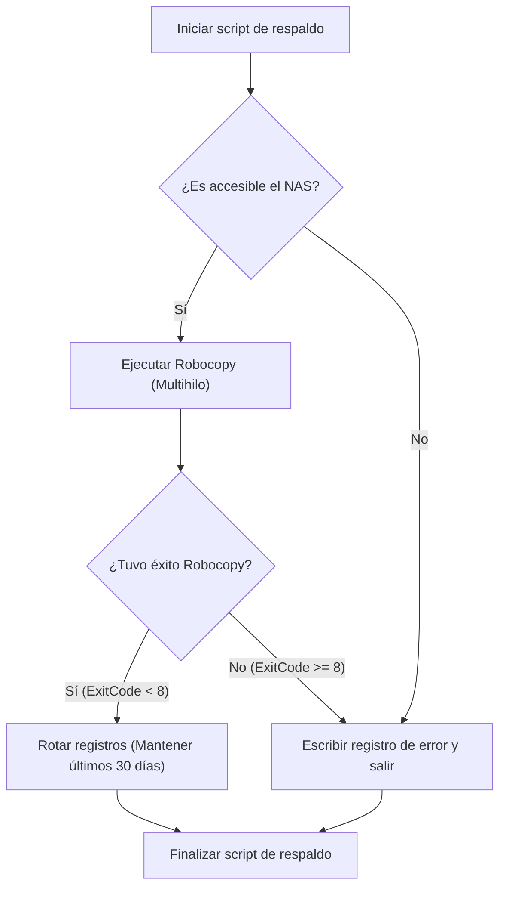
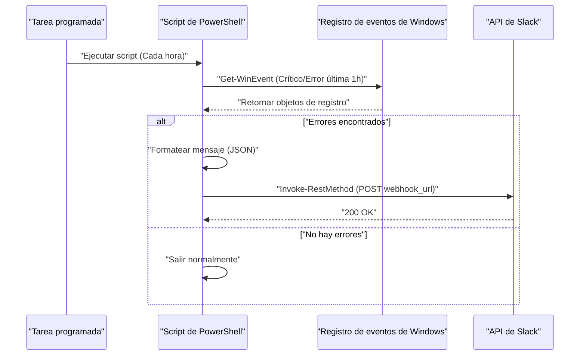

## Introducción: ¿Por qué automatizar tareas con PowerShell?

En la infraestructura de TI y los entornos de desarrollo modernos, para los usuarios que utilizan el sistema operativo Windows como plataforma, las "tareas diarias rutinarias" son un desafío inevitable. Realizar manualmente copias de seguridad de archivos, monitorear los registros del sistema y mantener actualizados y compilar los recursos de desarrollo (repositorios de Git) es un caldo de cultivo para errores humanos y lleva a una gran pérdida de tiempo valioso.

En el pasado se utilizaban archivos por lotes (`.bat` o `.cmd`) o VBScript, pero en la actualidad, la solución óptima es sin duda **PowerShell**. PowerShell no es solo un shell basado en texto, sino que está construido sobre la sólida base orientada a objetos de .NET Framework (y .NET Core). Debido a que los datos pasados a través del pipeline no son "cadenas de texto" sino "objetos", no hay necesidad de implementar un análisis de texto complejo (como grep, awk, sed) por uno mismo; se puede acceder fácilmente a los datos simplemente especificando propiedades.

Este artículo presentará tres ejemplos de scripts de automatización completa directamente vinculados a tareas prácticas usando PowerShell (copia de seguridad en NAS y rotación de registros, monitoreo del registro de eventos con notificaciones de Slack, y actualización/compilación por lotes de múltiples repositorios de Git). Además, explicaremos en profundidad las tecnologías fundamentales requeridas antes de esto, como la política de ejecución de PowerShell, la modularización y la integración con el Programador de tareas.

---

## Preparando las bases para la automatización con PowerShell

Para operar los scripts de automatización de manera segura y confiable en un entorno de producción, es necesaria cierta preparación. Aquí detallamos la comprensión de las políticas de ejecución, la modularización para mejorar la reutilización y el manejo robusto de errores.

### 1. Política de ejecución de PowerShell (Execution Policy)

En Windows, por defecto, se establece una "política de ejecución" para evitar que se ejecuten accidentalmente scripts maliciosos. En el estado inicial (`Restricted`), no se puede ejecutar ningún script (archivos `.ps1`). Para automatizar, esto debe cambiarse a un nivel apropiado.

Existen los siguientes tipos de políticas de ejecución:

- **Restricted**: No permite la ejecución de scripts. (Por defecto)
- **AllSigned**: Solo permite la ejecución de scripts firmados por un editor de confianza.
- **RemoteSigned**: Los scripts creados localmente se pueden ejecutar tal cual, pero los scripts descargados de Internet requieren una firma.
- **Unrestricted**: Se pueden ejecutar todos los scripts, pero se mostrará una advertencia al ejecutar scripts descargados de Internet.
- **Bypass**: No se bloquea nada y no se muestran advertencias. A menudo se utiliza para ejecuciones temporales de scripts (como canales CI/CD).

Al ejecutar scripts de creación propia en un entorno corporativo local usando el Programador de tareas, la configuración más realista y segura es `RemoteSigned`. Abra PowerShell con privilegios de administrador y ejecute el siguiente comando:

```powershell
Set-ExecutionPolicy RemoteSigned -Scope LocalMachine -Force
```

Esto permitirá que los scripts de respaldo creados localmente funcionen sin ser bloqueados.

### 2. Reutilización de código mediante la modularización (.psm1 / .psd1)

Al realizar tareas de automatización complejas, no se recomienda escribir todo el proceso en un único archivo `.ps1` gigante desde el punto de vista del mantenimiento. Las funciones utilizadas con frecuencia (por ejemplo, salida de registros, envío de Webhooks a Slack, manejo de errores, etc.) deben dividirse en "módulos".

Un módulo de PowerShell consta principalmente de un archivo de módulo de script (`.psm1`) y un manifiesto de módulo (`.psd1`).

Ejemplo de **CommonUtils.psm1**:
```powershell
function Write-CustomLog {
    [CmdletBinding()]
    param (
        [Parameter(Mandatory=$true)]
        [string]$Message,
        
        [ValidateSet('INFO', 'WARNING', 'ERROR')]
        [string]$Level = 'INFO'
    )
    
    $timestamp = Get-Date -Format "yyyy-MM-dd HH:mm:ss"
    $logLine = "[$timestamp] [$Level] $Message"
    
    # Ejecuta tanto la salida en pantalla como en archivo
    Write-Host $logLine
    Add-Content -Path "C:\logs\automation.log" -Value $logLine
}

Export-ModuleMember -Function Write-CustomLog
```

Para llamar a este módulo desde otro script, use `Import-Module` al comienzo del script.

```powershell
Import-Module "C:\Scripts\Modules\CommonUtils.psm1"
Write-CustomLog -Message "Iniciando proceso de copia de seguridad." -Level 'INFO'
```

### 3. Manejo robusto de errores (try / catch)

Lo más importante en la automatización es "cómo comportarse cuando algo falla". En PowerShell, puede controlar el comportamiento predeterminado cuando un comando falla estableciendo la variable incorporada `$ErrorActionPreference`. El valor predeterminado es `Continue` (muestra el error y continúa procesando), pero para los scripts de automatización, la mejor práctica es establecerlo en `Stop` y capturar explícitamente las excepciones con un bloque `try / catch`.

```powershell
$ErrorActionPreference = 'Stop'

try {
    # Operación que podría fallar
    $content = Get-Content -Path "C:\NonExistentFile.txt"
} catch [System.Management.Automation.ItemNotFoundException] {
    # Capturar un error específico
    Write-Host "Archivo no encontrado: $($_.Exception.Message)" -ForegroundColor Red
} catch {
    # Capturar todos los demás errores
    Write-Host "Se produjo un error inesperado: $($_.Exception.Message)" -ForegroundColor Red
} finally {
    # Proceso de limpieza que siempre se ejecuta independientemente del éxito o fracaso
    Write-Host "Finalizando proceso."
}
```

Aprovechando esta base, puede crear scripts seguros y rastreables incluso si se ejecutan de forma desatendida por la noche.

---

## Integración con el Programador de tareas (Register-ScheduledTask)

Una vez que se completa el script, necesita un mecanismo para ejecutarlo de forma regular. En Windows, lo más confiable es el "Programador de tareas". Es posible configurarlo desde la GUI (`taskschd.msc`), pero desde la perspectiva de codificar los manuales de infraestructura (Infraestructura como Código), explicaremos cómo registrar tareas usando los cmdlets de PowerShell.

PowerShell proporciona el módulo `ScheduledTasks`, que le permite definir en detalle los disparadores (cuándo ejecutar), las acciones (qué ejecutar) y los principales (con qué privilegios de usuario ejecutar).

```powershell
# 1. Definir la acción (Ejecutar PowerShell de forma oculta y pasar el script especificado)
$action = New-ScheduledTaskAction -Execute "powershell.exe" -Argument "-NoProfile -WindowStyle Hidden -ExecutionPolicy Bypass -File C:\Scripts\DailyTasks.ps1"

# 2. Definir el disparador (Ejecutar todos los días a las 3:00 AM)
$trigger = New-ScheduledTaskTrigger -Daily -At "3:00AM"

# 3. Definir el principal (privilegios de usuario) (Ejecutar con privilegios SYSTEM)
$principal = New-ScheduledTaskPrincipal -UserId "NT AUTHORITY\SYSTEM" -LogonType ServiceAccount -RunLevel Highest

# 4. Construir la configuración de la tarea
$settings = New-ScheduledTaskSettingsSet -AllowStartIfOnBatteries -DontStopIfGoingOnBatteries -StartWhenAvailable -DontStopOnIdleEnd

# 5. Registrar la tarea
$taskName = "MyDailyAutomationTask"
Register-ScheduledTask -TaskName $taskName -Action $action -Trigger $trigger -Principal $principal -Settings $settings -Description "Tarea que ejecuta automáticamente labores diarias" -Force
```

Al simplemente ejecutar este script, se registrará un trabajo en el Programador de tareas y el script se ejecutará todos los días a la hora especificada con privilegios SYSTEM (los privilegios más altos en segundo plano sin mostrar una pantalla).

---

## Ejemplo práctico 1: Copia de seguridad en NAS externo y rotación de registros

Hacer una copia de seguridad de los datos comerciales diarios es esencial, pero la copia manual está fuera de discusión. Aquí, crearemos un script que invoca `Robocopy`, el comando de copia de Windows más poderoso, desde PowerShell, emite un registro de los resultados de la ejecución y elimina (rota) automáticamente los registros antiguos.

### Valor teórico del tiempo de ejecución en la transferencia de red (Math)

Al diseñar un script de respaldo, es operativamente importante estimar cuánto tiempo tomará completar el proceso. El tiempo requerido estimado $T_{backup}$ para realizar una copia de seguridad en un NAS a través de la red se puede aproximar mediante la siguiente fórmula:

$$ T_{backup} = \frac{S_{total}}{B \times (1 - \alpha)} + C \times L $$

Donde cada variable es:
- $S_{total}$ : Cantidad total de datos a respaldar (Bits)
- $B$ : Ancho de banda de la red (bps, ej: 1Gbps = $10^9$ bps)
- $\alpha$ : Gastos generales de red y protocolos (generalmente de 0.1 a 0.2 para los protocolos TCP/IP o SMB)
- $C$ : Número total de archivos
- $L$ : Latencia de procesamiento por archivo (segundos)

Especialmente al respaldar una gran cantidad de archivos pequeños (como código fuente), el término de retraso debido a la cantidad de archivos $C$ ($C \times L$) se vuelve dominante. Por esta razón, es óptimo usar `Robocopy`, que es capaz de realizar transferencias multihilo, en lugar de una simple herramienta de copia de archivos.

### Flujo de procesamiento del script de copia de seguridad



### Ejemplo de implementación del script de PowerShell (`Backup-ToNas.ps1`)

```powershell
$ErrorActionPreference = 'Stop'

# Valores de configuración
$SourceDir = "C:\WorkData"
$TargetNasDir = "\\NAS01\Backup\WorkData"
$LogDir = "C:\Scripts\Logs"
$DateStr = Get-Date -Format "yyyyMMdd"
$LogFile = Join-Path $LogDir "Backup_$DateStr.log"
$RetainDays = 30

try {
    # 1. Verificación previa: ¿Se puede acceder al NAS?
    if (-not (Test-Path $TargetNasDir)) {
        throw "No se puede acceder a la ruta de destino del NAS: $TargetNasDir"
    }

    Write-Host "Iniciando copia de seguridad: $SourceDir -> $TargetNasDir"

    # 2. Ejecución de Robocopy
    # /MIR : Mirroring (elimina archivos que no están en el origen)
    # /MT:16 : Copia multihilo con 16 hilos
    # /NP : No muestra el progreso (%) (para evitar ensuciar el registro)
    # /R:2 /W:2 : Número de reintentos en caso de error 2, tiempo de espera 2 segundos
    $roboArgs = @(
        $SourceDir,
        $TargetNasDir,
        "/MIR",
        "/MT:16",
        "/NP",
        "/R:2",
        "/W:2",
        "/LOG+:$LogFile"
    )

    # Start-Process es la forma más confiable de llamar a comandos externos desde PowerShell
    $process = Start-Process -FilePath "robocopy.exe" -ArgumentList $roboArgs -Wait -NoNewWindow -PassThru
    $exitCode = $process.ExitCode

    # Especificaciones del código de salida de Robocopy: 0-7 significa éxito o comportamiento esperado. 8 o más es un error.
    if ($exitCode -ge 8) {
        throw "Robocopy finalizó con un error. ExitCode: $exitCode"
    }

    Write-Host "Copia de seguridad completada con éxito. ExitCode: $exitCode"

    # 3. Rotación de registros
    Write-Host "Eliminando archivos de registro antiguos (Período de retención: ${RetainDays} días)"
    $limitDate = (Get-Date).AddDays(-$RetainDays)
    Get-ChildItem -Path $LogDir -Filter "Backup_*.log" | 
        Where-Object { $_.LastWriteTime -lt $limitDate } | 
        Remove-Item -Force

    Write-Host "Limpieza de registros completada."

} catch {
    $errorMessage = "Se produjo un error durante el proceso de copia de seguridad: $($_.Exception.Message)"
    Write-Error $errorMessage
    # Escribir en el archivo de registro de errores real
    Add-Content -Path (Join-Path $LogDir "Error.log") -Value "[(Get-Date -Format 'yyyy-MM-dd HH:mm:ss')] $errorMessage"
    # Salir con un código distinto de cero para notificar al Programador de tareas del error
    exit 1
}
```

Al combinar este script con el Programador de tareas, se logran copias de seguridad diarias completamente automatizadas. Es especialmente importante manejar los códigos de salida de `Robocopy`. Dado que Robocopy devuelve un 1 cuando "se copió un archivo nuevo" y un 2 cuando "se eliminaron archivos adicionales" incluso en caso de éxito, tenga en cuenta que una verificación simple `$LASTEXITCODE -eq 0` no funcionará correctamente.

---

## Ejemplo práctico 2: Monitoreo de registros de eventos del sistema y notificaciones de Slack (Webhook)

En servidores de Windows y estaciones de trabajo de creadores, detectar de forma temprana errores de disco, que pueden ser precursores de pantallas azules (BSoD), o bloqueos de aplicaciones (Application Error), es de suma importancia.
Aquí, crearemos un script que extrae los registros de nivel "Error" y "Crítico" de los registros de eventos `System` y `Application` de la última hora y, si se encuentran, envía una notificación a Slack.

### Diagrama de secuencia del proceso de notificación



### Ejemplo de implementación del script de PowerShell (`Monitor-EventLog.ps1`)

```powershell
$ErrorActionPreference = 'Stop'

# URL de Webhook de Slack (Obtenida previamente desde las integraciones de Incoming Webhooks en Slack)
$SlackWebhookUrl = "https://hooks.slack.com/services/TXXXXX/BXXXXX/XXXXXXXXXXXXX"

# Rango de tiempo para la búsqueda (última hora)
$startTime = (Get-Date).AddHours(-1)

# Búsqueda rápida de registros de eventos usando filtro XPath
# Nivel 1: Crítico (Critical), 2: Error (Error)
$xmlFilter = @"
<QueryList>
  <Query Id="0" Path="System">
    <Select Path="System">*[System[(Level=1 or Level=2) and TimeCreated[@SystemTime&gt;='$($startTime.ToUniversalTime().ToString("o"))']]]</Select>
  </Query>
  <Query Id="1" Path="Application">
    <Select Path="Application">*[System[(Level=1 or Level=2) and TimeCreated[@SystemTime&gt;='$($startTime.ToUniversalTime().ToString("o"))']]]</Select>
  </Query>
</QueryList>
"@

try {
    # Obtener registros con Get-WinEvent
    # -ErrorAction SilentlyContinue se usa para ignorar el error cuando no se encuentran registros
    $events = Get-WinEvent -FilterXml $xmlFilter -ErrorAction SilentlyContinue

    if ($events -and $events.Count -gt 0) {
        $eventCount = $events.Count
        Write-Host "Se encontraron $eventCount registros de error/críticos en la última hora."

        # Armar el texto para la notificación
        $messageBody = "*Alerta del sistema Windows* :rotating_light:`n"
        $messageBody += "Se detectaron $eventCount errores en la última hora.`n`n"

        # Incluir detalles de solo las 3 entradas más recientes (considerando límites de caracteres, etc.)
        $events | Select-Object -First 3 | ForEach-Object {
            $messageBody += "*$($_.LogName)* - $($_.ProviderName) (EventID: $($_.Id))`n"
            $messageBody += "> $($_.Message -replace '`n', ' ')`n`n"
        }

        if ($eventCount -gt 3) {
            $messageBody += "※Hay otros $($eventCount - 3) errores. Por favor, revise el Visor de eventos."
        }

        # Crear la carga JSON (payload) para POST a Slack
        $payload = @{
            text = $messageBody
            username = "SystemMonitor"
            icon_emoji = ":desktop_computer:"
        }
        $jsonPayload = $payload | ConvertTo-Json -Depth 3

        # Llamar a la API REST para enviar a Slack
        Invoke-RestMethod -Uri $SlackWebhookUrl -Method Post -Body $jsonPayload -ContentType "application/json; charset=utf-8"
        
        Write-Host "Notificación de Slack completada."
    } else {
        Write-Host "No se encontraron registros de error o críticos. El sistema está funcionando normalmente."
    }
} catch {
    Write-Error "Se produjo un error en el script de monitoreo de registros de eventos: $($_.Exception.Message)"
    exit 1
}
```

El punto técnico de este script es el uso de `Get-WinEvent -FilterXml`. El cmdlet tradicional `Get-EventLog` o el filtrado por canalización con `Where-Object` cargan todos los objetos de evento en la memoria antes de procesarlos, lo que lo hace muy pesado y lento. Al utilizar filtros XML, el filtrado se realiza en el lado del servicio de registro de eventos de Windows, lo que proporciona una mejora abismal del rendimiento y garantiza que la ejecución tarde solo unos pocos segundos.

---

## Ejemplo práctico 3: Actualización masiva y automatización de compilación para múltiples repositorios de Git

Para los desarrolladores, a primera hora de la mañana, sincronizar todos los repositorios de Git alojados en su PC de trabajo (front-end, back-end, repositorios de infraestructura, etc.) a la última rama `main`, e instalar paquetes (`npm install`, etc.) o realizar compilaciones según sea necesario, es una tarea muy tediosa.
Crearemos una herramienta que realiza esto por lotes con un script de PowerShell.

Este script detecta automáticamente todos los repositorios de Git bajo un directorio padre específico y, si no hay cambios no confirmados, ejecuta `git pull`. Además, si se introducen nuevos cambios, emitirá automáticamente el comando de compilación.

### Script de actualización automática de múltiples repositorios (`Update-GitRepos.ps1`)

```powershell
$ErrorActionPreference = 'Stop'

# Lista de directorios padre donde se ubican los repositorios
$TargetDirectories = @(
    "C:\Dev\FrontendProjects",
    "C:\Dev\BackendProjects"
)

# Explorar cada directorio
foreach ($parentDir in $TargetDirectories) {
    if (-not (Test-Path $parentDir)) {
        Write-Warning "Directorio no encontrado: $parentDir"
        continue
    }

    # Obtener la lista de subdirectorios
    $subDirs = Get-ChildItem -Path $parentDir -Directory
    
    foreach ($repoDir in $subDirs) {
        $repoPath = $repoDir.FullName
        $gitDir = Join-Path $repoPath ".git"

        # Comprobar si existe la carpeta .git (si es un repositorio de Git)
        if (Test-Path $gitDir) {
            Write-Host "---------------------------------"
            Write-Host "Procesando repositorio: $repoPath" -ForegroundColor Cyan
            
            # Cambiar el directorio de trabajo actual de PowerShell
            Set-Location -Path $repoPath

            try {
                # Comprobar si hay cambios sin hacer commit
                $status = git status --porcelain
                if ($status) {
                    Write-Host "Omitiendo porque hay cambios sin confirmar." -ForegroundColor Yellow
                    continue
                }

                # Obtener la rama actual
                $branch = git rev-parse --abbrev-ref HEAD
                if ($branch -ne "main" -and $branch -ne "master") {
                    Write-Host "Omitiendo porque la rama actual es $branch (solo aplica a main/master)." -ForegroundColor Yellow
                    continue
                }

                # Ejecutar Pull y almacenar el resultado en una variable
                Write-Host "Obteniendo la última versión del repositorio remoto (git pull)..."
                $pullResult = git pull origin $branch 2>&1
                
                # Mostrar en la consola
                $pullResult | ForEach-Object { Write-Host "  $_" }

                # Si incluye un texto diferente a "Already up to date.", asumimos que hubo actualizaciones
                $isUpdated = $false
                foreach ($line in $pullResult) {
                    if ($line -notmatch "Already up to date") {
                        $isUpdated = $true
                        break
                    }
                }

                if ($isUpdated) {
                    Write-Host "El repositorio se ha actualizado. Iniciando tarea de compilación..." -ForegroundColor Green
                    
                    # Ejecutar npm install y npm run build si existe package.json
                    if (Test-Path "package.json") {
                        Write-Host "Ejecutando npm install..."
                        npm install
                        Write-Host "Ejecutando npm run build..."
                        npm run build
                    }
                    
                    # Ejecutar msbuild o dotnet build si existe un .sln (Visual Studio Solution)
                    $slnFiles = Get-ChildItem -Filter "*.sln"
                    if ($slnFiles.Count -gt 0) {
                        Write-Host "Compilando la aplicación .NET..."
                        dotnet build $slnFiles[0].FullName
                    }
                }

            } catch {
                Write-Error "Ocurrió un error al procesar el repositorio $repoPath: $($_.Exception.Message)"
            }
        }
    }
}

Write-Host "---------------------------------"
Write-Host "Se ha completado el proceso de actualización de todos los repositorios." -ForegroundColor Green
```

Este script está diseñado de manera que incluso si ocurre un error, gracias al bloque `try / catch` y al bucle `foreach`, puede continuar procesando el siguiente repositorio sin verse afectado. Además, se utiliza la opción para secuencias de comandos `git status --porcelain` para determinar de manera confiable la limpieza del árbol de trabajo. Al colocar este script en la carpeta de inicio o al registrarlo en el Programador de tareas al iniciar sesión, todos sus entornos de desarrollo estarán actualizados mientras enciende su PC y se prepara un café.

---

## Consideraciones operativas y técnicas avanzadas

Al operar scripts de automatización mediante PowerShell durante largos períodos de tiempo, existen algunas mejores prácticas que debe tener en cuenta.

### 1. Gestión segura de credenciales
Codificar contraseñas o claves de API (por ejemplo: la URL del Webhook de Slack, las cadenas de conexión a la base de datos) en texto plano dentro de un script es un gran riesgo de seguridad. PowerShell tiene funciones integradas, como `Export-Clixml` y `ConvertFrom-SecureString`, que permiten guardar información de autenticación de forma encriptada.

```powershell
# Solo requiere ejecución manual la primera vez (Aparecerá un diálogo para ingresar la contraseña)
# Get-Credential | Export-Clixml -Path "C:\Scripts\Creds\admin.xml"

# Carga dentro del script de automatización
$cred = Import-Clixml -Path "C:\Scripts\Creds\admin.xml"
# Utilizar $cred para conexiones a servidores remotos, etc.
```

De este modo se puede manejar información de autenticación segura que solo el perfil del usuario que ejecuta el script puede desencriptar.

### 2. Registro completo de las ejecuciones mediante Transcripción (Transcript)
En los ejemplos anteriores, los registros se generaban individualmente mediante `Add-Content` o comandos similares, pero PowerShell cuenta con una funcionalidad de transcripción que graba automáticamente toda la información mostrada en pantalla (incluyendo mensajes de error y la salida estándar) en un archivo.

Con solo añadir las siguientes líneas al principio y al final del script, puede generar registros de auditoría muy robustos.

```powershell
Start-Transcript -Path "C:\Scripts\Logs\Execution_$(Get-Date -Format 'yyyyMMdd_HHmmss').log" -Append

# (Lógica del script principal aquí)

Stop-Transcript
```

### 3. Enfoque matemático para monitoreo y detección de anomalías (Math)

En las automatizaciones a gran escala, no basta con detectar los errores directamente; utilizar métodos estadísticos para identificar situaciones "fuera de lo común" es altamente efectivo. Por ejemplo, si el tiempo de ejecución de la copia de seguridad diaria difiere drásticamente del promedio usual, podría ser un indicador de problemas de red o fallos inminentes en el disco.

Si los tiempos diarios de copia de seguridad son $x_1, x_2, \dots, x_n$, la media muestral $\mu$ y la desviación estándar $\sigma$ se calculan como sigue:

$$ \mu = \frac{1}{n} \sum_{i=1}^n x_i $$
$$ \sigma = \sqrt{ \frac{1}{n-1} \sum_{i=1}^n (x_i - \mu)^2 } $$

Si el tiempo de ejecución del día actual $x_{today}$ supera $\mu + 3\sigma$ (regla de los tres sigmas), el sistema puede considerar que "ha ocurrido una anomalía estadística" y se puede crear una lógica para emitir una alerta. Aprovechando el cmdlet `Measure-Object` de PowerShell, procesos estadísticos como este se pueden implementar en solo un par de líneas.

## Resumen

En este artículo, hemos explicado, con ejemplos prácticos, cómo lograr la automatización completa de tareas diarias usando PowerShell en un entorno Windows.
Comenzando con la creación de una base a través de la gestión de políticas de ejecución y la modularización, cubrimos ejemplos listos para producción, como la copia de seguridad y la rotación de registros, el monitoreo del registro de eventos con notificaciones a Slack, y la compilación automática de múltiples repositorios de Git.

PowerShell es muy profundo y, a pesar de ser una herramienta de línea de comandos, es un motor de automatización poderoso capaz de acceder a casi todas las funciones de .NET. Tomando como base los scripts presentados aquí, le invitamos a personalizar las rutas y las lógicas de procesamiento para que se adapten a su entorno, obteniendo un tiempo creativo liberado de las tediosas tareas manuales.

El éxito en la automatización radica en "comenzar con un pequeño script e ir aumentando gradualmente su solidez mediante el manejo de errores y la salida de registros". ¿Por qué no empezar su viaje de automatización con PowerShell haciendo una copia de seguridad de una sola carpeta de su PC?
