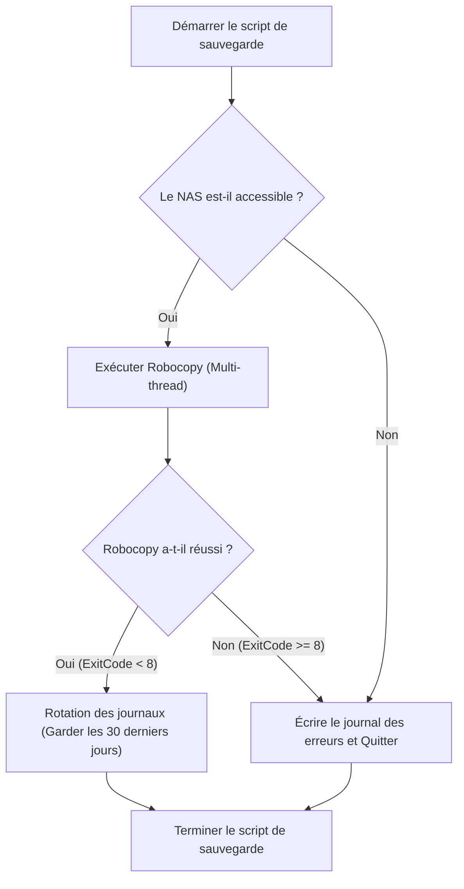
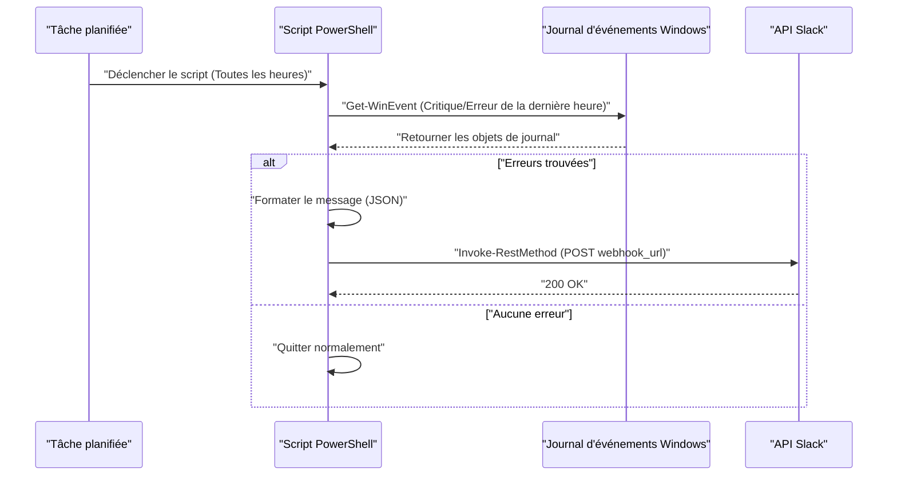

## Introduction : Pourquoi automatiser les tâches avec PowerShell ?

Dans l'infrastructure informatique et les environnements de développement modernes, les « tâches de routine quotidiennes » sont un défi inévitable pour les utilisateurs ayant Windows pour plate-forme. Sauvegarder des fichiers, surveiller les journaux système, mettre à jour et compiler les ressources de développement (dépôts Git)... effectuer ces tâches manuellement est un terrain propice aux erreurs humaines et conduit à une perte de temps précieux.

Autrefois, les fichiers batch (`.bat` ou `.cmd`) ou VBScript étaient utilisés, mais aujourd'hui, la solution optimale est sans aucun doute **PowerShell**. PowerShell n'est pas simplement un shell basé sur du texte, il est construit sur la puissante base orientée objet du .NET Framework (et .NET Core). Les données passées par le pipeline ne sont pas des « chaînes de caractères » mais des « objets », il n'est donc pas nécessaire d'implémenter soi-même une analyse de texte complexe (comme grep, awk ou sed) ; vous pouvez facilement accéder aux données en spécifiant simplement des propriétés.

Dans cet article, nous présenterons trois exemples concrets de scripts d'automatisation complète directement liés au travail pratique utilisant PowerShell (sauvegarde vers un NAS et rotation des journaux, surveillance du journal des événements et notifications Slack, et mise à jour / compilation par lots de multiples dépôts Git). En outre, nous expliquerons en profondeur les technologies fondamentales nécessaires au préalable, telles que les politiques d'exécution de PowerShell, la modularisation et l'intégration du Planificateur de tâches.

---

## Préparer les bases de l'automatisation PowerShell

Pour que les scripts d'automatisation fonctionnent de manière sûre et fiable dans un environnement de production, plusieurs préparatifs sont nécessaires. Ici, nous détaillerons la compréhension des politiques d'exécution, la modularisation pour améliorer la réutilisabilité, ainsi qu'une gestion robuste des erreurs.

### 1. Politique d'exécution de PowerShell (Execution Policy)

Sous Windows, par défaut, une « politique d'exécution » est configurée pour empêcher l'exécution accidentelle de scripts malveillants, et dans son état initial (`Restricted`), aucun script (fichier `.ps1`) ne peut être exécuté. Pour automatiser, il est nécessaire de changer cela à un niveau approprié.

Les types de politiques d'exécution sont les suivants :

- **Restricted**: N'autorise pas l'exécution de scripts. (Par défaut)
- **AllSigned**: N'autorise l'exécution que des scripts signés par un éditeur de confiance.
- **RemoteSigned**: Les scripts créés localement peuvent être exécutés tels quels, mais les scripts téléchargés depuis Internet nécessitent une signature.
- **Unrestricted**: Tous les scripts peuvent être exécutés, mais un avertissement s'affichera lors de l'exécution d'un script téléchargé depuis Internet.
- **Bypass**: Rien n'est bloqué et aucun avertissement n'est affiché. Souvent utilisé pour l'exécution temporaire de scripts (comme les pipelines CI/CD).

Lors de l'exécution de vos propres scripts via le Planificateur de tâches dans un environnement d'entreprise local, le paramètre le plus réaliste et le plus sûr est `RemoteSigned`. Lancez PowerShell avec les privilèges d'administrateur et exécutez la commande suivante :

```powershell
Set-ExecutionPolicy RemoteSigned -Scope LocalMachine -Force
```

Cela permettra aux scripts tels que les scripts de sauvegarde créés localement de fonctionner sans être bloqués.

### 2. Réutilisation du code par la modularisation (.psm1 / .psd1)

Lors du traitement d'automatisations complexes, il n'est pas recommandé d'écrire tout le traitement dans un seul gros fichier `.ps1` d'un point de vue de la maintenabilité. Les fonctions fréquemment utilisées (par exemple, la sortie du journal, l'envoi de Webhooks à Slack, la gestion des erreurs, etc.) doivent être séparées en « modules ».

Les modules PowerShell se composent principalement d'un fichier de module de script (`.psm1`) et d'un manifeste de module (`.psd1`).

Exemple de **CommonUtils.psm1** :
```powershell
function Write-CustomLog {
    [CmdletBinding()]
    param (
        [Parameter(Mandatory=$true)]
        [string]$Message,
        
        [ValidateSet('INFO', 'WARNING', 'ERROR')]
        [string]$Level = 'INFO'
    )
    
    $timestamp = Get-Date -Format "yyyy-MM-dd HH:mm:ss"
    $logLine = "[$timestamp] [$Level] $Message"
    
    # Exécuter à la fois la sortie à l'écran et la sortie dans le fichier
    Write-Host $logLine
    Add-Content -Path "C:\logs\automation.log" -Value $logLine
}

Export-ModuleMember -Function Write-CustomLog
```

Pour appeler ce module depuis un autre script, utilisez `Import-Module` au début de votre script.

```powershell
Import-Module "C:\Scripts\Modules\CommonUtils.psm1"
Write-CustomLog -Message "Le processus de sauvegarde commence." -Level 'INFO'
```

### 3. Gestion robuste des erreurs (try / catch)

Ce qui est le plus important dans l'automatisation, c'est « comment se comporter en cas d'échec ». Dans PowerShell, vous pouvez contrôler le comportement par défaut lorsqu'une commande échoue en définissant la variable intégrée `$ErrorActionPreference`. Par défaut, c'est `Continue` (afficher l'erreur et continuer le traitement), mais dans les scripts d'automatisation, la meilleure pratique est de le définir sur `Stop` et de capturer explicitement les exceptions avec un bloc `try / catch`.

```powershell
$ErrorActionPreference = 'Stop'

try {
    # Traitement susceptible d'échouer
    $content = Get-Content -Path "C:\NonExistentFile.txt"
} catch [System.Management.Automation.ItemNotFoundException] {
    # Capturer une erreur spécifique
    Write-Host "Le fichier est introuvable : $($_.Exception.Message)" -ForegroundColor Red
} catch {
    # Capturer toutes les autres erreurs
    Write-Host "Une erreur inattendue s'est produite : $($_.Exception.Message)" -ForegroundColor Red
} finally {
    # Processus de nettoyage qui est toujours exécuté quel que soit le succès ou l'échec
    Write-Host "Le processus se termine."
}
```

En tirant parti de cette base, vous pouvez créer des scripts sûrs et traçables même lorsqu'ils fonctionnent sans surveillance la nuit.

---

## Intégration au Planificateur de tâches (Register-ScheduledTask)

Une fois le script terminé, vous avez ensuite besoin d'un mécanisme pour l'exécuter régulièrement. Sous Windows, l'option la plus fiable est le « Planificateur de tâches ». Bien qu'il soit possible de le configurer via l'interface graphique (`taskschd.msc`), dans l'optique de coder les manuels d'infrastructure (Infrastructure as Code), nous expliquerons comment enregistrer des tâches à l'aide des applets de commande PowerShell.

PowerShell dispose du module `ScheduledTasks`, qui vous permet de définir de manière détaillée le déclencheur (quand l'exécuter), l'action (ce qu'il faut exécuter) et le principal (avec quels privilèges d'utilisateur l'exécuter).

```powershell
# 1. Définition de l'action (Exécuter PowerShell en mode masqué et lui passer le script spécifié)
$action = New-ScheduledTaskAction -Execute "powershell.exe" -Argument "-NoProfile -WindowStyle Hidden -ExecutionPolicy Bypass -File C:\Scripts\DailyTasks.ps1"

# 2. Définition du déclencheur (Exécuter tous les jours à 3h00 du matin)
$trigger = New-ScheduledTaskTrigger -Daily -At "3:00AM"

# 3. Définition du principal (Privilèges de l'utilisateur exécutant) (Exécuter avec les privilèges SYSTEM)
$principal = New-ScheduledTaskPrincipal -UserId "NT AUTHORITY\SYSTEM" -LogonType ServiceAccount -RunLevel Highest

# 4. Création des paramètres de la tâche
$settings = New-ScheduledTaskSettingsSet -AllowStartIfOnBatteries -DontStopIfGoingOnBatteries -StartWhenAvailable -DontStopOnIdleEnd

# 5. Enregistrement de la tâche
$taskName = "MyDailyAutomationTask"
Register-ScheduledTask -TaskName $taskName -Action $action -Trigger $trigger -Principal $principal -Settings $settings -Description "Tâche pour exécuter automatiquement les tâches de routine quotidiennes" -Force
```

Le simple fait d'exécuter ce script enregistre le travail dans le Planificateur de tâches et le script s'exécutera tous les jours à l'heure spécifiée avec les privilèges SYSTEM (les privilèges les plus élevés, en arrière-plan et sans afficher d'écran).

---

## Exemple pratique 1 : Sauvegarde vers un NAS externe et rotation des journaux

Les sauvegardes quotidiennes de vos données de travail sont essentielles, mais la copie manuelle est hors de question. Ici, nous allons créer un script qui appelle `Robocopy`, la commande de copie la plus puissante intégrée à Windows, depuis PowerShell, génère un journal des résultats d'exécution et supprime (fait tourner) automatiquement les anciens journaux.

### Valeur théorique du temps d'exécution dans les transferts réseau (Math)

Lors de la conception d'un script de sauvegarde, il est opérationnellement important d'estimer combien de temps il faudra pour terminer le processus. Le temps estimé $T_{backup}$ requis pour la sauvegarde sur un NAS via un réseau peut être approché par la formule suivante.

$$ T_{backup} = \frac{S_{total}}{B \times (1 - \alpha)} + C \times L $$

Ici, chaque variable est la suivante :
- $S_{total}$ : Quantité totale de données à sauvegarder (Bits)
- $B$ : Bande passante du réseau (bps, Ex : 1 Gbps = $10^9$ bps)
- $\alpha$ : Surcharge du réseau et des protocoles (généralement de 0,1 à 0,2 pour TCP/IP ou les protocoles SMB)
- $C$ : Nombre total de fichiers
- $L$ : Latence de traitement par fichier (secondes)

Surtout lors de la sauvegarde d'un grand nombre de petits fichiers (tels que le code source), le terme de délai dû au nombre de fichiers $C$ ($C \times L$) devient prédominant. C'est pourquoi, dans les processus de sauvegarde, il est optimal d'utiliser `Robocopy`, qui permet des transferts multi-threads, plutôt qu'un simple outil de copie de fichiers.

### Flux de traitement du script de sauvegarde



### Exemple d'implémentation de script PowerShell (`Backup-ToNas.ps1`)

```powershell
$ErrorActionPreference = 'Stop'

# Valeurs de configuration
$SourceDir = "C:\WorkData"
$TargetNasDir = "\\NAS01\Backup\WorkData"
$LogDir = "C:\Scripts\Logs"
$DateStr = Get-Date -Format "yyyyMMdd"
$LogFile = Join-Path $LogDir "Backup_$DateStr.log"
$RetainDays = 30

try {
    # 1. Vérification préalable : Le NAS est-il accessible ?
    if (-not (Test-Path $TargetNasDir)) {
        throw "Le chemin cible sur le NAS n'est pas accessible : $TargetNasDir"
    }

    Write-Host "Démarrage de la sauvegarde : $SourceDir -> $TargetNasDir"

    # 2. Exécution de Robocopy
    # /MIR : Mise en miroir (Supprime les fichiers absents de la source)
    # /MT:16 : Copie multi-thread avec 16 threads
    # /NP : Ne pas afficher la progression en % (pour éviter de polluer le journal)
    # /R:2 /W:2 : 2 tentatives en cas d'erreur, 2 secondes d'attente
    $roboArgs = @(
        $SourceDir,
        $TargetNasDir,
        "/MIR",
        "/MT:16",
        "/NP",
        "/R:2",
        "/W:2",
        "/LOG+:$LogFile"
    )

    # Start-Process est le plus fiable pour appeler des commandes externes depuis PowerShell
    $process = Start-Process -FilePath "robocopy.exe" -ArgumentList $roboArgs -Wait -NoNewWindow -PassThru
    $exitCode = $process.ExitCode

    # Spécifications du code de sortie (ExitCode) de Robocopy : 0 à 7 signifient un succès ou un fonctionnement prévu. 8 ou plus signifient une erreur
    if ($exitCode -ge 8) {
        throw "Robocopy s'est terminé avec une erreur. ExitCode : $exitCode"
    }

    Write-Host "La sauvegarde s'est terminée avec succès. ExitCode : $exitCode"

    # 3. Rotation des journaux
    Write-Host "Suppression des anciens fichiers journaux (Période de rétention : ${RetainDays} jours)"
    $limitDate = (Get-Date).AddDays(-$RetainDays)
    Get-ChildItem -Path $LogDir -Filter "Backup_*.log" | 
        Where-Object { $_.LastWriteTime -lt $limitDate } | 
        Remove-Item -Force

    Write-Host "Le nettoyage des journaux est terminé."

} catch {
    $errorMessage = "Une erreur s'est produite lors de la sauvegarde : $($_.Exception.Message)"
    Write-Error $errorMessage
    # Écrire dans le fichier journal d'erreurs réel
    Add-Content -Path (Join-Path $LogDir "Error.log") -Value "[(Get-Date -Format 'yyyy-MM-dd HH:mm:ss')] $errorMessage"
    # Quitter avec une valeur non nulle pour notifier l'erreur au planificateur de tâches
    exit 1
}
```

Ce script, combiné au Planificateur de tâches, permet une sauvegarde quotidienne entièrement automatisée. La gestion du code de sortie (ExitCode) de `Robocopy` est particulièrement importante. Gardez à l'esprit qu'une simple vérification `$LASTEXITCODE -eq 0` ne fonctionnera pas correctement, car Robocopy renvoie 1 même en cas de succès si « de nouveaux fichiers ont été copiés », ou 2 si « des fichiers supplémentaires ont été supprimés », etc.

---

## Exemple pratique 2 : Surveillance du journal des événements système et notification Slack (Webhook)

Sur un serveur Windows ou une station de travail pour créateurs, il est extrêmement important de détecter de manière précoce les erreurs de disque, qui sont les signes avant-coureurs d'un écran bleu (BSoD), ou les plantages d'applications (Application Error).
Nous allons créer ici un script qui extrait les journaux de niveau « Erreur » et « Critique » des journaux d'événements `System` et `Application` de la dernière heure, et envoie une notification à Slack s'ils sont trouvés.

### Diagramme de séquence du processus de notification



### Exemple d'implémentation de script PowerShell (`Monitor-EventLog.ps1`)

```powershell
$ErrorActionPreference = 'Stop'

# Slack Webhook URL (Obtenue au préalable via l'intégration Incoming Webhooks de Slack)
$SlackWebhookUrl = "https://hooks.slack.com/services/TXXXXX/BXXXXX/XXXXXXXXXXXXX"

# Plage horaire de recherche (la dernière heure)
$startTime = (Get-Date).AddHours(-1)

# Utilisation de filtres XPath pour rechercher rapidement dans le journal des événements
# Niveau 1 : Critique (Critical), 2 : Erreur (Error)
$xmlFilter = @"
<QueryList>
  <Query Id="0" Path="System">
    <Select Path="System">*[System[(Level=1 or Level=2) and TimeCreated[@SystemTime&gt;='$($startTime.ToUniversalTime().ToString("o"))']]]</Select>
  </Query>
  <Query Id="1" Path="Application">
    <Select Path="Application">*[System[(Level=1 or Level=2) and TimeCreated[@SystemTime&gt;='$($startTime.ToUniversalTime().ToString("o"))']]]</Select>
  </Query>
</QueryList>
"@

try {
    # Obtenir les journaux avec Get-WinEvent
    # -ErrorAction SilentlyContinue est pour ignorer l'erreur quand aucun journal n'est trouvé
    $events = Get-WinEvent -FilterXml $xmlFilter -ErrorAction SilentlyContinue

    if ($events -and $events.Count -gt 0) {
        $eventCount = $events.Count
        Write-Host "$eventCount journaux critiques/d'erreur ont été trouvés au cours de la dernière heure."

        # Construire le texte pour la notification
        $messageBody = "*Alerte Système Windows* :rotating_light:`n"
        $messageBody += "$eventCount erreurs ont été détectées au cours de la dernière heure.`n`n"

        # N'inclure que les détails des 3 plus récentes (en tenant compte des limites de caractères, etc.)
        $events | Select-Object -First 3 | ForEach-Object {
            $messageBody += "*$($_.LogName)* - $($_.ProviderName) (EventID : $($_.Id))`n"
            $messageBody += "> $($_.Message -replace '`n', ' ')`n`n"
        }

        if ($eventCount -gt 3) {
            $messageBody += "※ Il y a $($eventCount - 3) autres erreurs. Veuillez vérifier l'Observateur d'événements."
        }

        # Création du payload JSON à envoyer à Slack
        $payload = @{
            text = $messageBody
            username = "SystemMonitor"
            icon_emoji = ":desktop_computer:"
        }
        $jsonPayload = $payload | ConvertTo-Json -Depth 3

        # Appeler l'API REST pour envoyer à Slack
        Invoke-RestMethod -Uri $SlackWebhookUrl -Method Post -Body $jsonPayload -ContentType "application/json; charset=utf-8"
        
        Write-Host "La notification à Slack est terminée."
    } else {
        Write-Host "Aucun journal critique/d'erreur n'a été trouvé. Le système est normal."
    }
} catch {
    Write-Error "Une erreur s'est produite dans le script de surveillance du journal des événements : $($_.Exception.Message)"
    exit 1
}
```

Le point technique clé de ce script est l'utilisation de `Get-WinEvent -FilterXml`. Le filtrage avec l'applet de commande classique `Get-EventLog` ou `Where-Object` via le pipeline charge tous les objets d'événements en mémoire avant le traitement, ce qui rend l'exécution très lente. En utilisant un filtre XML, le filtrage est effectué du côté du service des journaux d'événements Windows, ce qui permet d'obtenir une amélioration spectaculaire des performances, réduisant le temps d'exécution à quelques secondes.

---

## Exemple pratique 3 : Mise à jour en lot et automatisation de la compilation de multiples dépôts Git

Pour un développeur, c'est très fastidieux de synchroniser dès le matin tous les multiples dépôts Git (front-end, back-end, dépôts d'infrastructure, etc.) présents sur son PC de travail avec la dernière branche `main`, et d'exécuter si besoin les commandes d'installation de paquets (comme `npm install`) ou de compilation.
Nous allons créer un outil qui réalise cela en lot avec un script PowerShell.

Ce script détectera automatiquement tous les dépôts Git sous un répertoire parent spécifique, et s'il n'y a pas de modifications non commitées, il exécutera `git pull`. De plus, si de nouvelles modifications ont été récupérées, il lancera automatiquement la commande de compilation.

### Script de mise à jour automatique de multiples dépôts (`Update-GitRepos.ps1`)

```powershell
$ErrorActionPreference = 'Stop'

# Liste des répertoires parents où se trouvent les dépôts
$TargetDirectories = @(
    "C:\Dev\FrontendProjects",
    "C:\Dev\BackendProjects"
)

# Explorer chaque répertoire
foreach ($parentDir in $TargetDirectories) {
    if (-not (Test-Path $parentDir)) {
        Write-Warning "Le répertoire est introuvable : $parentDir"
        continue
    }

    # Obtenir la liste des sous-répertoires
    $subDirs = Get-ChildItem -Path $parentDir -Directory
    
    foreach ($repoDir in $subDirs) {
        $repoPath = $repoDir.FullName
        $gitDir = Join-Path $repoPath ".git"

        # Vérifier si le dossier .git existe (si c'est un dépôt Git)
        if (Test-Path $gitDir) {
            Write-Host "---------------------------------"
            Write-Host "Traitement du dépôt : $repoPath" -ForegroundColor Cyan
            
            # Changer le répertoire de travail actuel de PowerShell
            Set-Location -Path $repoPath

            try {
                # Vérifier s'il y a des modifications non commitées
                $status = git status --porcelain
                if ($status) {
                    Write-Host "Ignoré car il y a des modifications non commitées." -ForegroundColor Yellow
                    continue
                }

                # Obtenir la branche actuelle
                $branch = git rev-parse --abbrev-ref HEAD
                if ($branch -ne "main" -and $branch -ne "master") {
                    Write-Host "Ignoré car la branche actuelle est $branch (seuls main/master sont ciblés)." -ForegroundColor Yellow
                    continue
                }

                # Exécuter Pull et stocker le résultat dans une variable
                Write-Host "Récupération de la dernière version depuis le distant (git pull)..."
                $pullResult = git pull origin $branch 2>&1
                
                # Afficher également dans la console
                $pullResult | ForEach-Object { Write-Host "  $_" }

                # S'il y a une chaîne autre que "Already up to date.", considérer qu'il y a eu une mise à jour
                $isUpdated = $false
                foreach ($line in $pullResult) {
                    if ($line -notmatch "Already up to date") {
                        $isUpdated = $true
                        break
                    }
                }

                if ($isUpdated) {
                    Write-Host "Le dépôt a été mis à jour. Démarrage de la tâche de compilation..." -ForegroundColor Green
                    
                    # S'il y a un fichier package.json, exécuter npm install et npm run build
                    if (Test-Path "package.json") {
                        Write-Host "Exécution de npm install..."
                        npm install
                        Write-Host "Exécution de npm run build..."
                        npm run build
                    }
                    
                    # S'il y a un fichier .sln (Solution Visual Studio), exécuter msbuild ou dotnet build
                    $slnFiles = Get-ChildItem -Filter "*.sln"
                    if ($slnFiles.Count -gt 0) {
                        Write-Host "Compilation de l'application .NET..."
                        dotnet build $slnFiles[0].FullName
                    }
                }

            } catch {
                Write-Error "Une erreur s'est produite lors du traitement du dépôt $repoPath : $($_.Exception.Message)"
            }
        }
    }
}

Write-Host "---------------------------------"
Write-Host "Le processus de mise à jour pour tous les dépôts est terminé." -ForegroundColor Green
```

Ce script est conçu de telle manière que même si une erreur se produit, les blocs `try / catch` et la boucle `foreach` lui permettent de continuer sans affecter le traitement du dépôt suivant. Il utilise également l'option `git status --porcelain`, qui est destinée aux scripts, pour déterminer de manière fiable la propreté de l'arbre de travail. Si vous placez ce script dans votre dossier de démarrage ou l'enregistrez dans le Planificateur de tâches à l'ouverture de session de l'utilisateur, tout votre environnement de développement sera à jour pendant que vous démarrez votre PC et allez vous chercher un café.

---

## Points d'attention opérationnelle et techniques avancées

Il existe un certain nombre de bonnes pratiques à garder à l'esprit lors de l'exécution de scripts d'automatisation PowerShell sur de longues périodes.

### 1. Gestion sécurisée des informations d'identification
Coder en dur des mots de passe ou des clés d'API (par exemple, des URL Slack Webhook, des chaînes de connexion à une base de données) en texte clair dans votre script est un risque de sécurité majeur. PowerShell dispose de fonctionnalités intégrées, telles que `Export-Clixml` et `ConvertFrom-SecureString`, pour chiffrer et enregistrer les informations d'identification.

```powershell
# Exécution manuelle la première fois uniquement (affiche une boîte de dialogue pour la saisie du mot de passe)
# Get-Credential | Export-Clixml -Path "C:\Scripts\Creds\admin.xml"

# Chargement à l'intérieur du script d'automatisation
$cred = Import-Clixml -Path "C:\Scripts\Creds\admin.xml"
# Utiliser $cred pour se connecter à un serveur distant, etc.
```

Cela permet une gestion sécurisée des informations d'identification qui ne peuvent être déchiffrées que par le profil de l'utilisateur exécutant le script.

### 2. Enregistrement complet du journal d'exécution via les transcriptions (Transcript)
Dans l'exemple précédent, les journaux étaient sortis individuellement en utilisant `Add-Content` et des méthodes similaires, mais PowerShell a une fonctionnalité de transcription qui écrit automatiquement toutes les informations affichées à l'écran (y compris les messages d'erreur et la sortie standard) dans un fichier.

En écrivant simplement ce qui suit au début et à la fin de votre script, vous pouvez créer un journal d'audit robuste.

```powershell
Start-Transcript -Path "C:\Scripts\Logs\Execution_$(Get-Date -Format 'yyyyMMdd_HHmmss').log" -Append

# (Le traitement principal du script va ici)

Stop-Transcript
```

### 3. Approche mathématique du suivi et détection des anomalies (Math)

Dans l'automatisation à grande échelle, il est efficace non seulement de détecter de simples erreurs, mais aussi d'utiliser des méthodes statistiques pour détecter un comportement « inhabituel ». Par exemple, si le temps de sauvegarde quotidienne s'écarte de manière significative de la moyenne habituelle, cela peut être le signe avant-coureur d'une anomalie réseau ou d'une défaillance de disque.

Si l'on considère les temps de sauvegarde quotidiens comme $x_1, x_2, \dots, x_n$, la moyenne de l'échantillon $\mu$ et l'écart type $\sigma$ sont calculés comme suit.

$$ \mu = \frac{1}{n} \sum_{i=1}^n x_i $$
$$ \sigma = \sqrt{ \frac{1}{n-1} \sum_{i=1}^n (x_i - \mu)^2 } $$

Si le temps d'exécution d'aujourd'hui $x_{today}$ dépasse $\mu + 3\sigma$ (règle des trois sigmas), il est possible de mettre en place une logique qui avertira que le système a considéré qu'« une anomalie statistique s'est produite ». En utilisant l'applet de commande `Measure-Object` de PowerShell, un tel traitement statistique peut être implémenté en seulement quelques lignes.

## Résumé

Dans cet article, nous avons expliqué, avec des exemples concrets, l'automatisation complète des tâches de routine quotidiennes à l'aide de PowerShell dans un environnement Windows.
À partir de la création d'une base par la gestion de la politique d'exécution et la modularisation, nous avons présenté des scripts immédiatement applicables dans la pratique, tels que la sauvegarde et la rotation des journaux, la surveillance du journal des événements et la notification Slack, ou encore la compilation automatique de multiples dépôts Git.

PowerShell est un moteur d'automatisation très profond et puissant qui, bien qu'étant un outil en ligne de commande, a accès à presque toutes les fonctionnalités de .NET. En utilisant les scripts présentés cette fois-ci comme base, vous pouvez personnaliser les chemins et la logique de traitement selon votre environnement de travail, vous libérant ainsi des tâches manuelles fastidieuses pour gagner un temps créatif.

Le succès de l'automatisation repose sur le fait de « commencer par un petit script et d'augmenter progressivement la robustesse, comme la gestion des erreurs et la sortie des journaux ». Pourquoi ne pas commencer votre parcours d'automatisation avec PowerShell en sauvegardant d'abord un seul dossier sur votre PC ?
