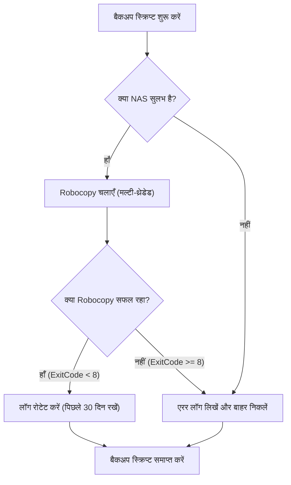
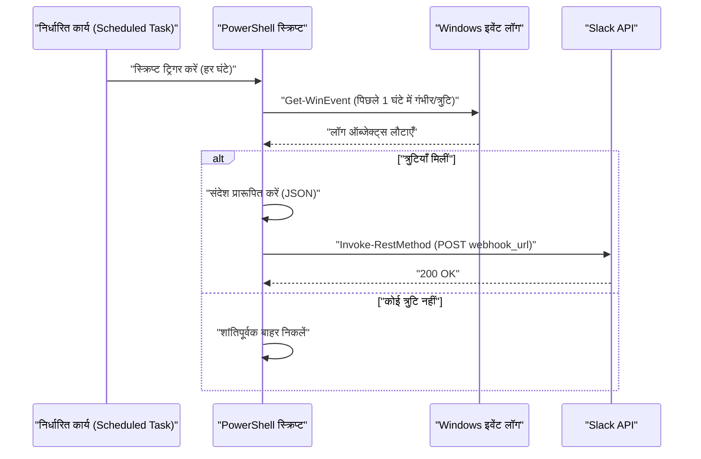

## परिचय: कार्यों को स्वचालित करने के लिए PowerShell का उपयोग क्यों करें?

आधुनिक IT इन्फ्रास्ट्रक्चर और विकास परिवेश में, Windows OS का उपयोग करने वाले उपयोगकर्ताओं के लिए "दैनिक नियमित कार्य" एक अपरिहार्य चुनौती है। फाइलों का बैकअप लेना, सिस्टम लॉग की निगरानी करना, और विकास संसाधनों (Git रिपॉजिटरी) को अपडेट और बिल्ड करना—इन कार्यों को मैन्युअल रूप से करने से मानवीय त्रुटियों की संभावना बढ़ती है और बहुमूल्य समय बर्बाद होता है।

अतीत में, बैच फाइलों (`.bat` या `.cmd`) और VBScript का उपयोग किया जाता था, लेकिन आज सबसे अच्छा समाधान निस्संदेह **PowerShell** है। PowerShell केवल एक टेक्स्ट-आधारित शेल नहीं है, बल्कि यह .NET Framework (और .NET Core) की शक्तिशाली ऑब्जेक्ट-ओरिएंटेड नींव पर बनाया गया है। क्योंकि पाइपलाइन के माध्यम से पारित डेटा "स्ट्रिंग" नहीं बल्कि "ऑब्जेक्ट" होता है, आपको जटिल टेक्स्ट पार्सिंग (जैसे grep, awk, sed) को खुद लागू करने की आवश्यकता नहीं होती है, और आप केवल गुण (properties) निर्दिष्ट करके आसानी से डेटा तक पहुंच सकते हैं।

इस लेख में, हम PowerShell का उपयोग करके व्यावहारिक कार्यों के लिए 3 पूरी तरह से स्वचालित स्क्रिप्ट्स के उदाहरण पेश करेंगे (NAS पर बैकअप और लॉग रोटेशन, इवेंट लॉग मॉनिटरिंग और Slack नोटिफिकेशन, और कई Git रिपॉजिटरी के बैच अपडेट/बिल्ड)। इसके अतिरिक्त, हम PowerShell निष्पादन नीतियों (execution policy), मॉड्यूलरकरण, और टास्क शेड्यूलर एकीकरण जैसी मूलभूत तकनीकों के बारे में भी गहराई से चर्चा करेंगे, जो इसके लिए आवश्यक हैं।

---

## PowerShell स्वचालन (Automation) की नींव तैयार करना

स्वचालित स्क्रिप्ट्स को उत्पादन (production) वातावरण में सुरक्षित और मज़बूती से काम करने के लिए कुछ प्रारंभिक तैयारियों की आवश्यकता होती है। यहाँ हम निष्पादन नीतियों को समझने, पुनः उपयोगिता (reusability) बढ़ाने के लिए मॉड्यूलरकरण, और मज़बूत एरर हैंडलिंग (error handling) के बारे में विस्तार से बताएंगे।

### 1. PowerShell की निष्पादन नीति (Execution Policy)

Windows में, डिफ़ॉल्ट रूप से दुर्भावनापूर्ण स्क्रिप्ट्स को गलती से निष्पादित होने से रोकने के लिए "निष्पादन नीति (Execution Policy)" सेट की गई है। प्रारंभिक अवस्था (`Restricted`) में, किसी भी स्क्रिप्ट (`.ps1` फ़ाइल) को निष्पादित नहीं किया जा सकता है। स्वचालन के लिए, इसे उचित स्तर पर बदलना आवश्यक है।

निष्पादन नीतियों के प्रकार निम्नलिखित हैं:

- **Restricted**: किसी भी स्क्रिप्ट के निष्पादन की अनुमति नहीं देता है। (डिफ़ॉल्ट)
- **AllSigned**: केवल विश्वसनीय प्रकाशकों द्वारा हस्ताक्षरित (signed) स्क्रिप्ट्स को चलाने की अनुमति देता है।
- **RemoteSigned**: स्थानीय रूप से (locally) बनाई गई स्क्रिप्ट्स को सीधे चलाया जा सकता है, लेकिन इंटरनेट से डाउनलोड की गई स्क्रिप्ट्स के लिए हस्ताक्षर आवश्यक हैं।
- **Unrestricted**: सभी स्क्रिप्ट्स को चलाया जा सकता है, लेकिन इंटरनेट से डाउनलोड की गई स्क्रिप्ट चलाते समय एक चेतावनी दिखाई जाएगी।
- **Bypass**: कुछ भी ब्लॉक नहीं किया जाता है और कोई चेतावनी नहीं दिखाई जाती है। इसका उपयोग अक्सर अस्थायी स्क्रिप्ट निष्पादन (जैसे CI/CD पाइपलाइन) के लिए किया जाता है।

यदि आप किसी कॉर्पोरेट स्थानीय वातावरण में टास्क शेड्यूलर के साथ अपनी खुद की स्क्रिप्ट चला रहे हैं, तो सबसे व्यावहारिक और सुरक्षित सेटिंग `RemoteSigned` है। व्यवस्थापक (Administrator) विशेषाधिकारों के साथ PowerShell शुरू करें और निम्नलिखित कमांड चलाएँ:

```powershell
Set-ExecutionPolicy RemoteSigned -Scope LocalMachine -Force
```

यह सुनिश्चित करेगा कि स्थानीय रूप से बनाई गई बैकअप स्क्रिप्ट आदि बिना ब्लॉक हुए सुचारू रूप से चलें।

### 2. मॉड्यूलरकरण के माध्यम से कोड का पुन: उपयोग (.psm1 / .psd1)

जटिल स्वचालन (automation) कार्यों के लिए, मेंटेनेबिलिटी (maintainability) के दृष्टिकोण से सभी प्रक्रियाओं को एक ही विशाल `.ps1` फ़ाइल में लिखना अनुशंसित नहीं है। अक्सर उपयोग किए जाने वाले कार्यों (उदाहरण के लिए, लॉग आउटपुट, Slack पर Webhook भेजना, एरर हैंडलिंग आदि) को "मॉड्यूल" के रूप में विभाजित किया जाना चाहिए।

PowerShell मॉड्यूल में मुख्य रूप से एक स्क्रिप्ट मॉड्यूल फ़ाइल (`.psm1`) और एक मॉड्यूल मेनिफेस्ट (`.psd1`) होता है।

**CommonUtils.psm1** का उदाहरण:
```powershell
function Write-CustomLog {
    [CmdletBinding()]
    param (
        [Parameter(Mandatory=$true)]
        [string]$Message,
        
        [ValidateSet('INFO', 'WARNING', 'ERROR')]
        [string]$Level = 'INFO'
    )
    
    $timestamp = Get-Date -Format "yyyy-MM-dd HH:mm:ss"
    $logLine = "[$timestamp] [$Level] $Message"
    
    # स्क्रीन पर और फ़ाइल दोनों में आउटपुट
    Write-Host $logLine
    Add-Content -Path "C:\logs\automation.log" -Value $logLine
}

Export-ModuleMember -Function Write-CustomLog
```

इस मॉड्यूल को अन्य स्क्रिप्ट्स से कॉल करने के लिए, स्क्रिप्ट की शुरुआत में `Import-Module` का उपयोग करें:

```powershell
Import-Module "C:\Scripts\Modules\CommonUtils.psm1"
Write-CustomLog -Message "बैकअप प्रक्रिया शुरू हो रही है।" -Level 'INFO'
```

### 3. मज़बूत एरर हैंडलिंग (try / catch)

स्वचालन में सबसे महत्वपूर्ण बात यह है कि "विफल होने पर क्या करना है"। PowerShell में, आप अंतर्निहित चर (built-in variable) `$ErrorActionPreference` सेट करके कमांड के विफल होने पर डिफ़ॉल्ट व्यवहार को नियंत्रित कर सकते हैं। डिफ़ॉल्ट `Continue` (त्रुटि प्रदर्शित करें और जारी रखें) है, लेकिन स्वचालित स्क्रिप्ट्स के लिए इसे `Stop` पर सेट करना और स्पष्ट रूप से अपवादों (exceptions) को पकड़ने के लिए `try / catch` ब्लॉक का उपयोग करना सर्वोत्तम अभ्यास है।

```powershell
$ErrorActionPreference = 'Stop'

try {
    # ऐसी प्रक्रिया जो विफल हो सकती है
    $content = Get-Content -Path "C:\NonExistentFile.txt"
} catch [System.Management.Automation.ItemNotFoundException] {
    # विशिष्ट त्रुटि को पकड़ना
    Write-Host "फ़ाइल नहीं मिली: $($_.Exception.Message)" -ForegroundColor Red
} catch {
    # अन्य सभी त्रुटियों को पकड़ना
    Write-Host "अप्रत्याशित त्रुटि उत्पन्न हुई: $($_.Exception.Message)" -ForegroundColor Red
} finally {
    # क्लीनअप प्रक्रिया जो सफलता या विफलता की परवाह किए बिना हमेशा निष्पादित होती है
    Write-Host "प्रक्रिया समाप्त हो रही है।"
}
```

इस आधार का लाभ उठाकर, आप ऐसी स्क्रिप्ट बना सकते हैं जो रात में बिना किसी निगरानी के चलने पर भी सुरक्षित और ट्रैक करने योग्य (trackable) हों।

---

## टास्क शेड्यूलर के साथ एकीकरण (Register-ScheduledTask)

एक बार स्क्रिप्ट पूरी हो जाने के बाद, आपको इसे नियमित रूप से चलाने के लिए एक तंत्र की आवश्यकता होती है। Windows में सबसे विश्वसनीय तरीका "टास्क शेड्यूलर" है। यद्यपि इसे GUI (`taskschd.msc`) से कॉन्फ़िगर किया जा सकता है, इन्फ्रास्ट्रक्चर प्रक्रियाओं (Infrastructure as Code) को कोड करने के दृष्टिकोण से, हम PowerShell कमांडलेट का उपयोग करके कार्यों को पंजीकृत करने का तरीका समझाएंगे।

PowerShell में `ScheduledTasks` मॉड्यूल शामिल है, जो आपको ट्रिगर (कब निष्पादित करना है), क्रिया (क्या निष्पादित करना है), और प्रिंसिपल (किस उपयोगकर्ता विशेषाधिकार के साथ निष्पादित करना है) को विस्तार से परिभाषित करने की अनुमति देता है।

```powershell
# 1. क्रिया की परिभाषा (PowerShell को छिपा कर चलाना और निर्दिष्ट स्क्रिप्ट पास करना)
$action = New-ScheduledTaskAction -Execute "powershell.exe" -Argument "-NoProfile -WindowStyle Hidden -ExecutionPolicy Bypass -File C:\Scripts\DailyTasks.ps1"

# 2. ट्रिगर की परिभाषा (प्रतिदिन सुबह 3:00 बजे निष्पादित करें)
$trigger = New-ScheduledTaskTrigger -Daily -At "3:00AM"

# 3. प्रिंसिपल (निष्पादन उपयोगकर्ता विशेषाधिकार) की परिभाषा (SYSTEM विशेषाधिकारों के साथ निष्पादित करें)
$principal = New-ScheduledTaskPrincipal -UserId "NT AUTHORITY\SYSTEM" -LogonType ServiceAccount -RunLevel Highest

# 4. कार्य सेटिंग्स का निर्माण
$settings = New-ScheduledTaskSettingsSet -AllowStartIfOnBatteries -DontStopIfGoingOnBatteries -StartWhenAvailable -DontStopOnIdleEnd

# 5. कार्य का पंजीकरण
$taskName = "MyDailyAutomationTask"
Register-ScheduledTask -TaskName $taskName -Action $action -Trigger $trigger -Principal $principal -Settings $settings -Description "दैनिक कार्यों को स्वचालित रूप से निष्पादित करने का कार्य" -Force
```

सिर्फ इस स्क्रिप्ट को चलाकर, कार्य (job) टास्क शेड्यूलर में पंजीकृत हो जाएगा, और स्क्रिप्ट निर्दिष्ट समय पर प्रतिदिन SYSTEM विशेषाधिकारों (उच्चतम विशेषाधिकार, पृष्ठभूमि में स्क्रीन दिखाए बिना) के साथ निष्पादित होगी।

---

## व्यावहारिक उदाहरण 1: बाहरी NAS पर बैकअप और लॉग रोटेशन

दैनिक व्यावसायिक डेटा का बैकअप लेना आवश्यक है, लेकिन मैन्युअल प्रतिलिपि (copy) करना अव्यावहारिक है। यहां, हम एक स्क्रिप्ट बनाएंगे जो PowerShell से विंडोज के सर्वश्रेष्ठ मानक कॉपी कमांड `Robocopy` को कॉल करती है, निष्पादन परिणामों का लॉग आउटपुट करती है, और स्वचालित रूप से पुराने लॉग हटाती है (लॉग रोटेशन)।

### नेटवर्क ट्रांसफर में सैद्धांतिक निष्पादन समय (Math)

बैकअप स्क्रिप्ट डिज़ाइन करते समय, यह अनुमान लगाना परिचालन रूप से महत्वपूर्ण है कि प्रक्रिया को पूरा होने में कितना समय लगेगा। नेटवर्क पर NAS में बैकअप लेते समय अनुमानित आवश्यक समय $T_{backup}$ का लगभग निम्नलिखित सूत्र द्वारा अनुमान लगाया जा सकता है:

$$ T_{backup} = \frac{S_{total}}{B \times (1 - \alpha)} + C \times L $$

यहां, प्रत्येक चर निम्नलिखित है:
- $S_{total}$ : बैकअप किए जाने वाले कुल डेटा की मात्रा (Bit)
- $B$ : नेटवर्क की बैंडविड्थ (bps, उदाहरण: 1Gbps = $10^9$ bps)
- $\alpha$ : नेटवर्क या प्रोटोकॉल ओवरहेड (आमतौर पर TCP/IP या SMB प्रोटोकॉल के लिए 0.1 से 0.2)
- $C$ : फाइलों की कुल संख्या
- $L$ : प्रति फ़ाइल प्रोसेसिंग विलंबता (latency) (सेकंड)

विशेष रूप से, बड़ी संख्या में छोटी फाइलों (जैसे स्रोत कोड) का बैकअप लेते समय, फाइलों की संख्या $C$ ($C \times L$) के कारण विलंब शब्द प्रभावी हो जाता है। इसलिए, बैकअप प्रोसेसिंग के लिए, सरल फ़ाइल कॉपी टूल के बजाय `Robocopy` का उपयोग करना सबसे अच्छा है जो मल्टीथ्रेडेड (multi-threaded) ट्रांसफर में सक्षम है।

### बैकअप स्क्रिप्ट का प्रोसेसिंग फ्लो



### PowerShell स्क्रिप्ट का कार्यान्वयन उदाहरण (`Backup-ToNas.ps1`)

```powershell
$ErrorActionPreference = 'Stop'

# सेटिंग्स
$SourceDir = "C:\WorkData"
$TargetNasDir = "\\NAS01\Backup\WorkData"
$LogDir = "C:\Scripts\Logs"
$DateStr = Get-Date -Format "yyyyMMdd"
$LogFile = Join-Path $LogDir "Backup_$DateStr.log"
$RetainDays = 30

try {
    # 1. पूर्व-जाँच: क्या NAS पहुँचा जा सकता है
    if (-not (Test-Path $TargetNasDir)) {
        throw "NAS लक्ष्य पथ तक नहीं पहुंचा जा सकता: $TargetNasDir"
    }

    Write-Host "बैकअप शुरू हो रहा है: $SourceDir -> $TargetNasDir"

    # 2. Robocopy निष्पादन
    # /MIR : मिररिंग (स्रोत में मौजूद न होने वाली फाइलें हटा दी जाएंगी)
    # /MT:16 : 16 थ्रेड्स के साथ मल्टी-थ्रेड कॉपी
    # /NP : प्रगति (%) आउटपुट न करें (लॉग को अव्यवस्थित होने से रोकने के लिए)
    # /R:2 /W:2 : त्रुटि पर 2 बार पुनः प्रयास, 2 सेकंड प्रतीक्षा
    $roboArgs = @(
        $SourceDir,
        $TargetNasDir,
        "/MIR",
        "/MT:16",
        "/NP",
        "/R:2",
        "/W:2",
        "/LOG+:$LogFile"
    )

    # PowerShell से बाहरी कमांड को कॉल करते समय Start-Process सबसे विश्वसनीय है
    $process = Start-Process -FilePath "robocopy.exe" -ArgumentList $roboArgs -Wait -NoNewWindow -PassThru
    $exitCode = $process.ExitCode

    # Robocopy एग्जिट कोड स्पेसिफिकेशन: 0-7 सफलता या अपेक्षित व्यवहार हैं। 8 या उससे अधिक त्रुटि है।
    if ($exitCode -ge 8) {
        throw "Robocopy त्रुटि के साथ बाहर निकला। ExitCode: $exitCode"
    }

    Write-Host "बैकअप सफलतापूर्वक पूरा हुआ। ExitCode: $exitCode"

    # 3. लॉग रोटेशन
    Write-Host "पुरानी लॉग फ़ाइलों को हटाया जा रहा है (रिटेंशन अवधि: ${RetainDays} दिन)"
    $limitDate = (Get-Date).AddDays(-$RetainDays)
    Get-ChildItem -Path $LogDir -Filter "Backup_*.log" | 
        Where-Object { $_.LastWriteTime -lt $limitDate } | 
        Remove-Item -Force

    Write-Host "लॉग क्लीनअप पूरा हुआ।"

} catch {
    $errorMessage = "बैकअप प्रक्रिया के दौरान एक त्रुटि हुई: $($_.Exception.Message)"
    Write-Error $errorMessage
    # वास्तविक त्रुटि लॉग फ़ाइल में लिखें
    Add-Content -Path (Join-Path $LogDir "Error.log") -Value "[(Get-Date -Format 'yyyy-MM-dd HH:mm:ss')] $errorMessage"
    # टास्क शेड्यूलर को त्रुटि सूचित करने के लिए नॉन-ज़ीरो के साथ बाहर निकलें
    exit 1
}
```

जब टास्क शेड्यूलर के साथ जोड़ा जाता है, तो यह स्क्रिप्ट दैनिक रूप से पूरी तरह से स्वचालित बैकअप प्रदान करती है। विशेष रूप से `Robocopy` का एग्जिट कोड प्रोसेसिंग बहुत महत्वपूर्ण है। Robocopy सफल होने पर भी, यह 1 लौटाता है यदि "नई फाइलें कॉपी की गईं", और 2 यदि "अतिरिक्त फाइलें हटा दी गईं", इसलिए यह ध्यान रखना महत्वपूर्ण है कि एक साधारण `$LASTEXITCODE -eq 0` जांच सही ढंग से काम नहीं करेगी।

---

## व्यावहारिक उदाहरण 2: सिस्टम इवेंट लॉग मॉनिटरिंग और Slack नोटिफिकेशन (Webhook)

विंडोज सर्वर और क्रिएटर वर्कस्टेशन में, डिस्क त्रुटियों या एप्लिकेशन क्रैश (Application Error) का शीघ्र पता लगाना बहुत महत्वपूर्ण है, जो ब्लू स्क्रीन (BSoD) के संकेत हो सकते हैं।
यहां, हम एक स्क्रिप्ट बनाएंगे जो पिछले 1 घंटे के `System` और `Application` इवेंट लॉग से "त्रुटि (Error)" और "गंभीर (Critical)" स्तर के लॉग निकालती है और यदि वे पाए जाते हैं तो Slack को एक सूचना भेजती है।

### अधिसूचना प्रसंस्करण का अनुक्रम आरेख (Sequence Diagram)



### PowerShell स्क्रिप्ट का कार्यान्वयन उदाहरण (`Monitor-EventLog.ps1`)

```powershell
$ErrorActionPreference = 'Stop'

# Slack Webhook URL (पहले से Slack के Incoming Webhooks इंटीग्रेशन से प्राप्त करें)
$SlackWebhookUrl = "https://hooks.slack.com/services/TXXXXX/BXXXXX/XXXXXXXXXXXXX"

# खोज के लिए समय सीमा (पिछले 1 घंटे)
$startTime = (Get-Date).AddHours(-1)

# ईवेंट लॉग को तेज़ी से खोजने के लिए XPath फ़िल्टर का उपयोग करें
# स्तर 1: गंभीर(Critical), 2: त्रुटि(Error)
$xmlFilter = @"
<QueryList>
  <Query Id="0" Path="System">
    <Select Path="System">*[System[(Level=1 or Level=2) and TimeCreated[@SystemTime&gt;='$($startTime.ToUniversalTime().ToString("o"))']]]</Select>
  </Query>
  <Query Id="1" Path="Application">
    <Select Path="Application">*[System[(Level=1 or Level=2) and TimeCreated[@SystemTime&gt;='$($startTime.ToUniversalTime().ToString("o"))']]]</Select>
  </Query>
</QueryList>
"@

try {
    # Get-WinEvent के साथ लॉग प्राप्त करें
    # -ErrorAction SilentlyContinue इसलिए है ताकि अगर कोई लॉग न मिले तो त्रुटि को अनदेखा किया जा सके
    $events = Get-WinEvent -FilterXml $xmlFilter -ErrorAction SilentlyContinue

    if ($events -and $events.Count -gt 0) {
        $eventCount = $events.Count
        Write-Host "पिछले 1 घंटे में $eventCount त्रुटि/गंभीर लॉग पाए गए।"

        # अधिसूचना के लिए टेक्स्ट इकट्ठा करें
        $messageBody = "*Windows सिस्टम अलर्ट* :rotating_light:`n"
        $messageBody += "पिछले 1 घंटे में $eventCount त्रुटियाँ पाई गईं।`n`n"

        # केवल नवीनतम 3 के विवरण शामिल करें (अक्षर सीमा आदि पर विचार करते हुए)
        $events | Select-Object -First 3 | ForEach-Object {
            $messageBody += "*$($_.LogName)* - $($_.ProviderName) (EventID: $($_.Id))`n"
            $messageBody += "> $($_.Message -replace '`n', ' ')`n`n"
        }

        if ($eventCount -gt 3) {
            $messageBody += "※ अन्य $($eventCount - 3) त्रुटियाँ हैं। कृपया इवेंट व्यूअर (Event Viewer) की जाँच करें।"
        }

        # Slack पर पोस्ट करने के लिए JSON पेलोड बनाएं
        $payload = @{
            text = $messageBody
            username = "SystemMonitor"
            icon_emoji = ":desktop_computer:"
        }
        $jsonPayload = $payload | ConvertTo-Json -Depth 3

        # REST API को कॉल करके Slack पर भेजें
        Invoke-RestMethod -Uri $SlackWebhookUrl -Method Post -Body $jsonPayload -ContentType "application/json; charset=utf-8"
        
        Write-Host "Slack अधिसूचना पूरी हुई।"
    } else {
        Write-Host "कोई त्रुटि/गंभीर लॉग नहीं मिला। सिस्टम सामान्य है।"
    }
} catch {
    Write-Error "इवेंट लॉग मॉनिटरिंग स्क्रिप्ट में त्रुटि हुई: $($_.Exception.Message)"
    exit 1
}
```

इस स्क्रिप्ट का तकनीकी बिंदु यह है कि यह `Get-WinEvent -FilterXml` का उपयोग करता है। पाइपलाइन के माध्यम से पारंपरिक `Get-EventLog` कमांडलेट या `Where-Object` के साथ फ़िल्टर करना बहुत धीमा है, क्योंकि यह फ़िल्टर करने से पहले सभी ईवेंट ऑब्जेक्ट्स को मेमोरी में लोड करता है। XML फ़िल्टर का उपयोग करने से Windows ईवेंट लॉग सेवा के स्तर पर फ़िल्टरिंग होती है, जिससे प्रदर्शन में बड़े पैमाने पर सुधार होता है और निष्पादन का समय कुछ सेकंड के भीतर आ जाता है।

---

## व्यावहारिक उदाहरण 3: कई Git रिपॉजिटरी का बैच अपडेट और बिल्ड ऑटोमेशन

डेवलपर्स के लिए, हर सुबह अपने कार्य PC (जैसे फ्रंटएंड, बैकएंड, इंफ्रास्ट्रक्चर रिपॉजिटरी आदि) पर कई Git रिपॉजिटरी को नवीनतम `main` शाखा (branch) के साथ सिंक करना, और आवश्यकतानुसार पैकेज इंस्टॉल करना (जैसे `npm install`) या निर्माण (build) कार्य करना बहुत थकाऊ हो सकता है।
हम एक टूल बनाएंगे जो PowerShell स्क्रिप्ट का उपयोग करके यह सब एक साथ करता है।

यह स्क्रिप्ट एक विशिष्ट मूल निर्देशिका (parent directory) के अंतर्गत सभी Git रिपॉजिटरी का स्वचालित रूप से पता लगाती है, और यदि कोई अनकमिटेड (uncommitted) परिवर्तन नहीं हैं तो `git pull` निष्पादित करती है। इसके अलावा, यदि नए परिवर्तन खींचे (pull) जाते हैं, तो यह स्वचालित रूप से एक बिल्ड कमांड जारी करता है।

### कई रिपॉजिटरी ऑटो-अपडेट स्क्रिप्ट (`Update-GitRepos.ps1`)

```powershell
$ErrorActionPreference = 'Stop'

# पैरेंट डायरेक्टरीज़ की सूची जहाँ रिपॉजिटरी स्थित हैं
$TargetDirectories = @(
    "C:\Dev\FrontendProjects",
    "C:\Dev\BackendProjects"
)

# प्रत्येक निर्देशिका (directory) को खोजना
foreach ($parentDir in $TargetDirectories) {
    if (-not (Test-Path $parentDir)) {
        Write-Warning "निर्देशिका नहीं मिली: $parentDir"
        continue
    }

    # उप-निर्देशिकाओं (subdirectories) की सूची प्राप्त करें
    $subDirs = Get-ChildItem -Path $parentDir -Directory
    
    foreach ($repoDir in $subDirs) {
        $repoPath = $repoDir.FullName
        $gitDir = Join-Path $repoPath ".git"

        # जाँचें कि क्या .git फ़ोल्डर मौजूद है (क्या यह Git रिपॉजिटरी है)
        if (Test-Path $gitDir) {
            Write-Host "---------------------------------"
            Write-Host "रिपॉजिटरी को संसाधित किया जा रहा है: $repoPath" -ForegroundColor Cyan
            
            # PowerShell की वर्तमान कार्यशील निर्देशिका बदलें
            Set-Location -Path $repoPath

            try {
                # जाँचें कि क्या अनकमिटेड परिवर्तन हैं
                $status = git status --porcelain
                if ($status) {
                    Write-Host "अनकमिटेड परिवर्तनों के कारण छोड़ (Skip) दिया गया।" -ForegroundColor Yellow
                    continue
                }

                # वर्तमान शाखा (branch) प्राप्त करें
                $branch = git rev-parse --abbrev-ref HEAD
                if ($branch -ne "main" -and $branch -ne "master") {
                    Write-Host "वर्तमान शाखा $branch होने के कारण छोड़ दिया गया (केवल main/master लक्षित हैं)।" -ForegroundColor Yellow
                    continue
                }

                # Pull निष्पादित करें और परिणाम को चर (variable) में सहेजें
                Write-Host "रिमोट से नवीनतम प्राप्त कर रहे हैं (git pull)..."
                $pullResult = git pull origin $branch 2>&1
                
                # कंसोल पर भी आउटपुट
                $pullResult | ForEach-Object { Write-Host "  $_" }

                # यदि इसमें "Already up to date." के अलावा अन्य स्ट्रिंग शामिल है, तो मान लें कि अपडेट किया गया था
                $isUpdated = $false
                foreach ($line in $pullResult) {
                    if ($line -notmatch "Already up to date") {
                        $isUpdated = $true
                        break
                    }
                }

                if ($isUpdated) {
                    Write-Host "रिपॉजिटरी अपडेट कर दी गई है। बिल्ड कार्य शुरू हो رہا है..." -ForegroundColor Green
                    
                    # यदि package.json मौजूद है, तो npm install और npm run build निष्पादित करें
                    if (Test-Path "package.json") {
                        Write-Host "npm install निष्पादित हो रहा है..."
                        npm install
                        Write-Host "npm run build निष्पादित हो रहा है..."
                        npm run build
                    }
                    
                    # यदि .sln (विजुअल स्टूडियो सॉल्यूशन) मौजूद है, तो msbuild या dotnet build निष्पादित करें
                    $slnFiles = Get-ChildItem -Filter "*.sln"
                    if ($slnFiles.Count -gt 0) {
                        Write-Host ".NET एप्लिकेशन को बिल्ड किया जा रहा है..."
                        dotnet build $slnFiles[0].FullName
                    }
                }

            } catch {
                Write-Error "रिपॉजिटरी $repoPath को संसाधित करते समय एक त्रुटि हुई: $($_.Exception.Message)"
            }
        }
    }
}

Write-Host "---------------------------------"
Write-Host "सभी रिपॉजिटरी के लिए अद्यतन (Update) प्रक्रिया पूरी हुई।" -ForegroundColor Green
```

इस स्क्रिप्ट को इस तरह डिज़ाइन किया गया है कि यदि कोई त्रुटि होती है, तो भी `try / catch` और `foreach` लूप यह सुनिश्चित करते हैं कि अगली रिपॉजिटरी का प्रसंस्करण प्रभावित हुए बिना जारी रहे। इसके अलावा, `git status --porcelain` विकल्प, जो स्क्रिप्ट प्रसंस्करण के लिए अभिप्रेत है, का उपयोग कार्यशील ट्री की स्वच्छता को मज़बूती से निर्धारित करने के लिए किया जाता है। इस स्क्रिप्ट को स्टार्टअप फ़ोल्डर में रखकर या उपयोगकर्ता के लॉगऑन पर इसे टास्क शेड्यूलर में पंजीकृत करके, जब तक आप अपने पीसी को चालू करते हैं और कॉफी बनाते हैं, तब तक आपका पूरा विकास परिवेश नवीनतम स्थिति में होगा।

---

## परिचालन संबंधी सावधानियाँ और उन्नत तकनीकें

लंबे समय तक स्वचालित स्क्रिप्ट के लिए PowerShell का उपयोग करते समय ध्यान में रखने के लिए कुछ सर्वोत्तम अभ्यास (best practices) हैं।

### 1. क्रेडेंशियल्स का सुरक्षित प्रबंधन
स्क्रिप्ट के अंदर पासवर्ड और API कुंजियों (जैसे Slack Webhook URL, डेटाबेस कनेक्शन स्ट्रिंग) को सादे पाठ (plain text) में हार्ड-कोड करना एक बड़ा सुरक्षा जोखिम है। PowerShell में `Export-Clixml` और `ConvertFrom-SecureString` जैसे फ़ंक्शन होते हैं जो क्रेडेंशियल्स को एन्क्रिप्ट करके सहेजने की अनुमति देते हैं।

```powershell
# पहली बार केवल मैन्युअल निष्पादन (पासवर्ड इनपुट डायलॉग प्रदर्शित किया जाएगा)
# Get-Credential | Export-Clixml -Path "C:\Scripts\Creds\admin.xml"

# स्वचालन स्क्रिप्ट में पढ़ रहे हैं
$cred = Import-Clixml -Path "C:\Scripts\Creds\admin.xml"
# रिमोट सर्वर आदि से कनेक्ट करने के लिए $cred का उपयोग करें
```

यह सुरक्षित क्रेडेंशियल हैंडलिंग की अनुमति देता है जिसे केवल स्क्रिप्ट निष्पादित करने वाले उपयोगकर्ता की प्रोफ़ाइल द्वारा डिक्रिप्ट किया जा सकता है।

### 2. ट्रांसक्रिप्ट (Transcript) के साथ पूर्ण निष्पादन लॉग रिकॉर्डिंग
पिछले उदाहरण में, हमने `Add-Content` आदि का उपयोग करके अलग-अलग लॉग आउटपुट किए थे, लेकिन PowerShell में एक ट्रांसक्रिप्ट सुविधा होती है जो स्वचालित रूप से स्क्रीन पर आउटपुट की गई सभी जानकारी (त्रुटि संदेश और मानक आउटपुट सहित) को फ़ाइल में लिखती है।

स्क्रिप्ट के शुरुआत और अंत में बस निम्नलिखित जोड़कर, आप एक मज़बूत ऑडिट लॉग बना सकते हैं।

```powershell
Start-Transcript -Path "C:\Scripts\Logs\Execution_$(Get-Date -Format 'yyyyMMdd_HHmmss').log" -Append

# (स्क्रिप्ट का मुख्य प्रसंस्करण यहाँ)

Stop-Transcript
```

### 3. मॉनिटरिंग के लिए गणितीय दृष्टिकोण और विसंगति का पता लगाना (Math)

बड़े पैमाने के स्वचालन में, केवल त्रुटियों का पता लगाना ही प्रभावी नहीं है, बल्कि "सामान्य से कुछ अलग" सांख्यिकीय रूप से पता लगाना भी प्रभावी है। उदाहरण के लिए, यदि दैनिक बैकअप समय सामान्य औसत से काफी अलग है, तो यह नेटवर्क विसंगतियों (anomalies) या डिस्क विफलता का संकेत हो सकता है।

यदि दैनिक बैकअप समय $x_1, x_2, \dots, x_n$ है, तो नमूना माध्य $\mu$ और मानक विचलन $\sigma$ की गणना निम्नानुसार की जा सकती है:

$$ \mu = \frac{1}{n} \sum_{i=1}^n x_i $$
$$ \sigma = \sqrt{ \frac{1}{n-1} \sum_{i=1}^n (x_i - \mu)^2 } $$

यदि चालू दिन का निष्पादन समय $x_{today}$, $\mu + 3\sigma$ (3-सिग्मा नियम) से अधिक हो जाता है, तो सिस्टम को यह मानने के लिए प्रोग्राम किया जा सकता है कि "एक सांख्यिकीय विसंगति हुई है" और एक चेतावनी सूचना जारी कर सकता है। PowerShell के `Measure-Object` कमांडलेट का उपयोग करके, आप कुछ ही पंक्तियों में इस तरह का सांख्यिकीय प्रसंस्करण लागू कर सकते हैं।

## निष्कर्ष

इस लेख में, हमने Windows परिवेश में PowerShell का उपयोग करके दैनिक नियमित कार्यों के पूर्ण स्वचालन के व्यावहारिक उदाहरणों की व्याख्या की।
निष्पादन नीतियों के प्रबंधन और मॉड्यूलरकरण के माध्यम से नींव बनाने से लेकर बैकअप और लॉग रोटेशन, इवेंट लॉग मॉनिटरिंग और Slack सूचनाएं, और एकाधिक Git रिपॉजिटरी के स्वचालित निर्माण (builds) तक, हमने ऐसी स्क्रिप्ट पेश कीं जिनका तुरंत अभ्यास में उपयोग किया जा सकता है।

PowerShell बहुत गहरा है; एक कमांड लाइन टूल होने के बावजूद, यह एक शक्तिशाली स्वचालन इंजन है जो .NET की लगभग सभी विशेषताओं तक पहुंच सकता है। अपने काम के माहौल के अनुरूप पथ (paths) और प्रोसेसिंग लॉजिक को कस्टमाइज़ करने के लिए यहां पेश की गई स्क्रिप्ट का उपयोग आधार के रूप में करें, और थकाऊ मैन्युअल काम से मुक्त होकर रचनात्मक समय वापस पाएं।

स्वचालन की सफलता "एक छोटी स्क्रिप्ट से शुरू होने और धीरे-धीरे एरर हैंडलिंग और लॉग आउटपुट जैसी मजबूती (robustness) को बढ़ाने" पर निर्भर करती है। क्यों न अपने स्वयं के पीसी पर एक फ़ोल्डर का बैकअप लेकर PowerShell स्वचालन की अपनी यात्रा शुरू की जाए?
