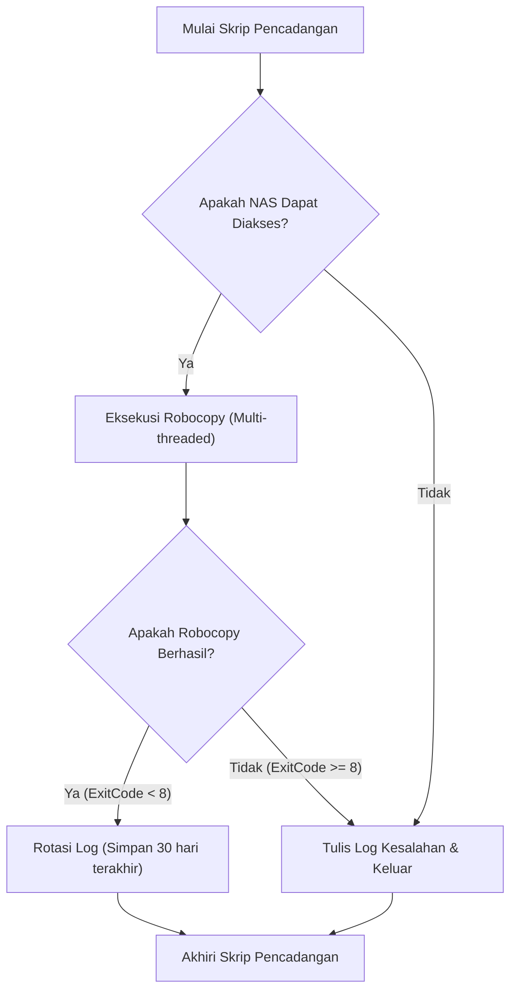
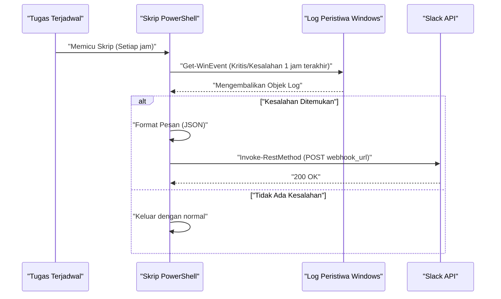

## Pendahuluan: Mengapa Mengotomatiskan Tugas dengan PowerShell

Dalam infrastruktur TI dan lingkungan pengembangan modern, bagi pengguna yang menggunakan OS Windows sebagai platform, "tugas rutin harian" adalah tantangan yang tidak bisa dihindari. Mencadangkan file, memantau log sistem, memperbarui dan mem-build sumber daya pengembangan (repositori Git)—melakukan hal-hal ini secara manual dapat menjadi sumber kesalahan manusia (human error) dan membuang-buang waktu yang berharga.

Di masa lalu, file batch (`.bat` atau `.cmd`) atau VBScript sering digunakan, tetapi saat ini solusi terbaik yang tak terbantahkan adalah **PowerShell**. PowerShell bukan sekadar shell berbasis teks, melainkan dibangun di atas fondasi berorientasi objek yang kuat dari .NET Framework (dan .NET Core). Karena data yang dilewatkan melalui pipeline adalah "objek" dan bukan "string", Anda tidak perlu mengimplementasikan penguraian teks yang rumit (seperti pemrosesan grep, awk, sed) sendiri; Anda dapat dengan mudah mengakses data hanya dengan menentukan propertinya.

Artikel ini akan memperkenalkan 3 contoh skrip otomatisasi penuh menggunakan PowerShell yang berhubungan langsung dengan tugas praktis (Pencadangan ke NAS dan rotasi log, pemantauan log aktivitas dan notifikasi Slack, pembaruan batch dan build untuk beberapa repositori Git). Selain itu, kami juga akan membahas lebih dalam tentang teknologi dasar yang diperlukan sebelum itu, seperti kebijakan eksekusi PowerShell, modularisasi, dan integrasi Task Scheduler.

---

## Mempersiapkan Fondasi Otomatisasi PowerShell

Agar skrip otomatisasi dapat berjalan dengan aman dan andal di lingkungan produksi, diperlukan beberapa persiapan. Di sini, kami akan merinci pemahaman tentang kebijakan eksekusi, modularisasi untuk meningkatkan penggunaan ulang (reusability), dan penanganan kesalahan (error handling) yang tangguh.

### 1. Kebijakan Eksekusi (Execution Policy) PowerShell

Di Windows, untuk mencegah skrip berbahaya dijalankan secara tidak sengaja pada keadaan default, telah ditetapkan "kebijakan eksekusi" (Execution Policy), dan dalam keadaan awal (`Restricted`), tidak ada skrip (file `.ps1`) yang dapat dieksekusi. Untuk melakukan otomatisasi, Anda perlu mengubah ini ke tingkat yang sesuai.

Terdapat berbagai jenis kebijakan eksekusi sebagai berikut:

- **Restricted**: Tidak mengizinkan eksekusi skrip apa pun. (Default)
- **AllSigned**: Hanya mengizinkan eksekusi skrip yang ditandatangani oleh penerbit tepercaya.
- **RemoteSigned**: Skrip yang dibuat secara lokal dapat dieksekusi apa adanya, tetapi skrip yang diunduh dari internet memerlukan tanda tangan (signature).
- **Unrestricted**: Semua skrip dapat dieksekusi, tetapi peringatan akan ditampilkan saat mengeksekusi skrip yang diunduh dari internet.
- **Bypass**: Tidak ada yang diblokir dan tidak ada peringatan yang ditampilkan. Sering digunakan untuk eksekusi skrip sementara (seperti dalam pipeline CI/CD).

Jika Anda menjalankan skrip buatan sendiri melalui Task Scheduler di lingkungan lokal perusahaan, pengaturan yang paling realistis dan aman adalah `RemoteSigned`. Jalankan PowerShell dengan hak administrator, dan jalankan perintah berikut:

```powershell
Set-ExecutionPolicy RemoteSigned -Scope LocalMachine -Force
```

Dengan ini, skrip pencadangan dan lainnya yang dibuat secara lokal akan beroperasi tanpa diblokir.

### 2. Penggunaan Ulang Kode melalui Modularisasi (.psm1 / .psd1)

Saat melakukan proses otomatisasi yang kompleks, tidak disarankan untuk menulis semua proses dalam satu file `.ps1` yang sangat besar dari sudut pandang pemeliharaan. Fungsi yang sering digunakan (misalnya keluaran log, pengiriman Webhook ke Slack, penanganan kesalahan, dll.) sebaiknya dipisahkan menjadi "modul".

Modul PowerShell terutama terdiri dari file modul skrip (`.psm1`) dan manifes modul (`.psd1`).

Contoh **CommonUtils.psm1**:
```powershell
function Write-CustomLog {
    [CmdletBinding()]
    param (
        [Parameter(Mandatory=$true)]
        [string]$Message,
        
        [ValidateSet('INFO', 'WARNING', 'ERROR')]
        [string]$Level = 'INFO'
    )
    
    $timestamp = Get-Date -Format "yyyy-MM-dd HH:mm:ss"
    $logLine = "[$timestamp] [$Level] $Message"
    
    # Melakukan output ke layar dan output ke file sekaligus
    Write-Host $logLine
    Add-Content -Path "C:\logs\automation.log" -Value $logLine
}

Export-ModuleMember -Function Write-CustomLog
```

Untuk memanggil modul ini dari skrip lain, gunakan `Import-Module` di bagian awal skrip.

```powershell
Import-Module "C:\Scripts\Modules\CommonUtils.psm1"
Write-CustomLog -Message "Memulai proses pencadangan." -Level 'INFO'
```

### 3. Penanganan Kesalahan yang Tangguh (try / catch)

Hal terpenting dalam otomatisasi adalah "bagaimana skrip berperilaku ketika gagal". Di PowerShell, dengan mengatur variabel bawaan `$ErrorActionPreference`, Anda dapat mengontrol perilaku default saat perintah gagal. Default-nya adalah `Continue` (menampilkan kesalahan dan melanjutkan proses), tetapi dalam skrip otomatisasi, praktik terbaiknya adalah mengaturnya ke `Stop` dan secara eksplisit menangkap pengecualian (exception) dengan blok `try / catch`.

```powershell
$ErrorActionPreference = 'Stop'

try {
    # Proses yang berpotensi gagal
    $content = Get-Content -Path "C:\NonExistentFile.txt"
} catch [System.Management.Automation.ItemNotFoundException] {
    # Menangkap kesalahan spesifik
    Write-Host "File tidak ditemukan: $($_.Exception.Message)" -ForegroundColor Red
} catch {
    # Menangkap semua kesalahan lainnya
    Write-Host "Terjadi kesalahan tak terduga: $($_.Exception.Message)" -ForegroundColor Red
} finally {
    # Proses pembersihan yang selalu dieksekusi terlepas dari sukses atau gagal
    Write-Host "Mengakhiri proses."
}
```

Dengan memanfaatkan fondasi ini, Anda dapat membangun skrip yang aman dan dapat dilacak (traceable) bahkan jika berjalan tanpa pengawasan pada malam hari.

---

## Integrasi dengan Task Scheduler (Register-ScheduledTask)

Setelah skrip selesai, selanjutnya diperlukan mekanisme untuk mengeksekusi skrip tersebut secara berkala. Di Windows, yang paling andal adalah "Task Scheduler". Meskipun dimungkinkan untuk mengonfigurasinya dari GUI (`taskschd.msc`), dari perspektif pengodean manual infrastruktur (Infrastructure as Code), kami akan menjelaskan cara mendaftarkan tugas menggunakan cmdlet PowerShell.

PowerShell menyediakan modul `ScheduledTasks`, yang dengannya Anda dapat mendefinisikan pemicu (kapan dieksekusi), tindakan (apa yang dieksekusi), dan prinsipal (dengan hak pengguna mana skrip dieksekusi) secara mendetail.

```powershell
# 1. Mendefinisikan tindakan (Menjalankan PowerShell secara tersembunyi dan meneruskan skrip yang ditentukan)
$action = New-ScheduledTaskAction -Execute "powershell.exe" -Argument "-NoProfile -WindowStyle Hidden -ExecutionPolicy Bypass -File C:\Scripts\DailyTasks.ps1"

# 2. Mendefinisikan pemicu (Dieksekusi setiap hari pada pukul 3:00 pagi)
$trigger = New-ScheduledTaskTrigger -Daily -At "3:00AM"

# 3. Mendefinisikan prinsipal (Hak eksekusi pengguna) (Dieksekusi dengan hak SYSTEM)
$principal = New-ScheduledTaskPrincipal -UserId "NT AUTHORITY\SYSTEM" -LogonType ServiceAccount -RunLevel Highest

# 4. Membangun pengaturan tugas
$settings = New-ScheduledTaskSettingsSet -AllowStartIfOnBatteries -DontStopIfGoingOnBatteries -StartWhenAvailable -DontStopOnIdleEnd

# 5. Mendaftarkan tugas
$taskName = "MyDailyAutomationTask"
Register-ScheduledTask -TaskName $taskName -Action $action -Trigger $trigger -Principal $principal -Settings $settings -Description "Tugas untuk secara otomatis menjalankan rutinitas harian" -Force
```

Hanya dengan mengeksekusi skrip ini, pekerjaan akan terdaftar di Task Scheduler, dan skrip akan dieksekusi setiap hari pada waktu yang ditentukan dengan hak SYSTEM (hak tertinggi yang berjalan di latar belakang tanpa memunculkan layar).

---

## Contoh Praktis 1: Pencadangan ke NAS Eksternal dan Rotasi Log

Mencadangkan data pekerjaan harian sangatlah penting, tetapi penyalinan manual tidak masuk akal. Di sini, kita akan membuat skrip yang memanggil `Robocopy`, perintah penyalinan terkuat bawaan Windows, dari PowerShell, mengeluarkan log dari hasil eksekusi, dan juga secara otomatis menghapus log lama (rotasi).

### Nilai Teoritis Waktu Eksekusi dalam Transfer Jaringan (Math)

Saat mendesain skrip pencadangan, penting secara operasional untuk memperkirakan berapa lama proses tersebut akan selesai. Perkiraan waktu yang dibutuhkan $T_{backup}$ ketika mencadangkan ke NAS melalui jaringan dapat dihitung dengan rumus berikut.

$$ T_{backup} = \frac{S_{total}}{B \times (1 - \alpha)} + C \times L $$

Di sini, setiap variabel adalah sebagai berikut:
- $S_{total}$ : Jumlah total data yang akan dicadangkan (Bit)
- $B$ : Bandwidth jaringan (bps, misal: 1Gbps = $10^9$ bps)
- $\alpha$ : Overhead jaringan atau protokol (biasanya 0.1 hingga 0.2 untuk TCP/IP atau protokol SMB)
- $C$ : Jumlah total file
- $L$ : Latensi pemrosesan per file (detik)

Terutama ketika mencadangkan sejumlah besar file kecil (seperti kode sumber), suku penundaan yang disebabkan oleh jumlah file $C$ ($C \times L$) akan mendominasi. Oleh karena itu, untuk proses pencadangan, mengoptimalkan `Robocopy` yang memungkinkan transfer multithread lebih baik daripada alat penyalinan file sederhana.

### Alur Pemrosesan Skrip Pencadangan



### Contoh Implementasi Skrip PowerShell (`Backup-ToNas.ps1`)

```powershell
$ErrorActionPreference = 'Stop'

# Nilai pengaturan
$SourceDir = "C:\WorkData"
$TargetNasDir = "\\NAS01\Backup\WorkData"
$LogDir = "C:\Scripts\Logs"
$DateStr = Get-Date -Format "yyyyMMdd"
$LogFile = Join-Path $LogDir "Backup_$DateStr.log"
$RetainDays = 30

try {
    # 1. Pemeriksaan awal: Apakah NAS dapat diakses?
    if (-not (Test-Path $TargetNasDir)) {
        throw "Tidak dapat mengakses jalur target NAS: $TargetNasDir"
    }

    Write-Host "Memulai pencadangan: $SourceDir -> $TargetNasDir"

    # 2. Eksekusi Robocopy
    # /MIR : Mirroring (Hapus file yang tidak ada di sumber)
    # /MT:16 : Salin multithread dengan 16 utas
    # /NP : Jangan tampilkan kemajuan (%) (untuk mencegah log menjadi berantakan)
    # /R:2 /W:2 : Coba lagi 2 kali saat gagal, tunggu 2 detik
    $roboArgs = @(
        $SourceDir,
        $TargetNasDir,
        "/MIR",
        "/MT:16",
        "/NP",
        "/R:2",
        "/W:2",
        "/LOG+:$LogFile"
    )

    # Start-Process adalah cara yang aman untuk memanggil perintah eksternal dari PowerShell
    $process = Start-Process -FilePath "robocopy.exe" -ArgumentList $roboArgs -Wait -NoNewWindow -PassThru
    $exitCode = $process.ExitCode

    # Spesifikasi Exit Code Robocopy: 0-7 adalah sukses atau perilaku sesuai spesifikasi. 8 atau lebih adalah kesalahan.
    if ($exitCode -ge 8) {
        throw "Robocopy dihentikan karena kesalahan. ExitCode: $exitCode"
    }

    Write-Host "Pencadangan berhasil diselesaikan. ExitCode: $exitCode"

    # 3. Rotasi Log
    Write-Host "Menghapus file log lama (Periode penyimpanan: ${RetainDays} hari)"
    $limitDate = (Get-Date).AddDays(-$RetainDays)
    Get-ChildItem -Path $LogDir -Filter "Backup_*.log" | 
        Where-Object { $_.LastWriteTime -lt $limitDate } | 
        Remove-Item -Force

    Write-Host "Pembersihan log telah selesai."

} catch {
    $errorMessage = "Terjadi kesalahan selama proses pencadangan: $($_.Exception.Message)"
    Write-Error $errorMessage
    # Tulis ke file log kesalahan yang sebenarnya
    Add-Content -Path (Join-Path $LogDir "Error.log") -Value "[(Get-Date -Format 'yyyy-MM-dd HH:mm:ss')] $errorMessage"
    # Keluar dengan nilai non-nol untuk memberitahukan Task Scheduler tentang kesalahan
    exit 1
}
```

Skrip ini, jika dikombinasikan dengan Task Scheduler, mewujudkan pencadangan yang sepenuhnya otomatis setiap harinya. Terutama penanganan kode keluar (exit code) `Robocopy` sangatlah penting. Perlu diperhatikan bahwa bahkan saat berhasil, Robocopy akan mengembalikan nilai 1 jika "file baru telah disalin", atau 2 jika "file tambahan dihapus", sehingga evaluasi sederhana seperti `$LASTEXITCODE -eq 0` tidak akan berfungsi dengan benar.

---

## Contoh Praktis 2: Pemantauan Log Peristiwa Sistem dan Notifikasi Slack (Webhook)

Di server Windows atau workstation kreator, mendeteksi kesalahan disk, yang merupakan pendahuluan dari Blue Screen (BSoD), atau kerusakan aplikasi (Application Error) sedini mungkin sangatlah penting.
Di sini, kita akan membuat skrip yang mengekstrak log level "Error" (Kesalahan) dan "Critical" (Kritis) dari log peristiwa `System` dan `Application` selama satu jam terakhir, dan jika ditemukan, akan mengirimkan pemberitahuan ke Slack.

### Diagram Urutan dari Proses Pemberitahuan



### Contoh Implementasi Skrip PowerShell (`Monitor-EventLog.ps1`)

```powershell
$ErrorActionPreference = 'Stop'

# URL Webhook Slack (Didapatkan sebelumnya dari integrasi Incoming Webhooks Slack)
$SlackWebhookUrl = "https://hooks.slack.com/services/TXXXXX/BXXXXX/XXXXXXXXXXXXX"

# Rentang waktu pencarian (1 jam terakhir)
$startTime = (Get-Date).AddHours(-1)

# Mencari log peristiwa dengan cepat menggunakan filter XPath
# Level 1: Kritis (Critical), 2: Kesalahan (Error)
$xmlFilter = @"
<QueryList>
  <Query Id="0" Path="System">
    <Select Path="System">*[System[(Level=1 or Level=2) and TimeCreated[@SystemTime&gt;='$($startTime.ToUniversalTime().ToString("o"))']]]</Select>
  </Query>
  <Query Id="1" Path="Application">
    <Select Path="Application">*[System[(Level=1 or Level=2) and TimeCreated[@SystemTime&gt;='$($startTime.ToUniversalTime().ToString("o"))']]]</Select>
  </Query>
</QueryList>
"@

try {
    # Dapatkan log dengan Get-WinEvent
    # -ErrorAction SilentlyContinue mengabaikan kesalahan saat log tidak ditemukan
    $events = Get-WinEvent -FilterXml $xmlFilter -ErrorAction SilentlyContinue

    if ($events -and $events.Count -gt 0) {
        $eventCount = $events.Count
        Write-Host "Ditemukan $eventCount log kesalahan/kritis dalam 1 jam terakhir."

        # Menyusun teks untuk pemberitahuan
        $messageBody = "*Peringatan Sistem Windows* :rotating_light:`n"
        $messageBody += "Telah terdeteksi $eventCount kesalahan dalam 1 jam terakhir.`n`n"

        # Menyertakan detail untuk 3 item terbaru saja (mempertimbangkan batasan karakter, dll.)
        $events | Select-Object -First 3 | ForEach-Object {
            $messageBody += "*$($_.LogName)* - $($_.ProviderName) (EventID: $($_.Id))`n"
            $messageBody += "> $($_.Message -replace '`n', ' ')`n`n"
        }

        if ($eventCount -gt 3) {
            $messageBody += "※Ada $($eventCount - 3) kesalahan lainnya. Silakan periksa Peraga Peristiwa (Event Viewer)."
        }

        # Membuat muatan JSON (payload) untuk di-POST ke Slack
        $payload = @{
            text = $messageBody
            username = "SystemMonitor"
            icon_emoji = ":desktop_computer:"
        }
        $jsonPayload = $payload | ConvertTo-Json -Depth 3

        # Memanggil REST API untuk mengirim ke Slack
        Invoke-RestMethod -Uri $SlackWebhookUrl -Method Post -Body $jsonPayload -ContentType "application/json; charset=utf-8"
        
        Write-Host "Notifikasi ke Slack telah selesai."
    } else {
        Write-Host "Log kesalahan/kritis tidak ditemukan. Sistem beroperasi secara normal."
    }
} catch {
    Write-Error "Terjadi kesalahan pada skrip pemantauan log peristiwa: $($_.Exception.Message)"
    exit 1
}
```

Poin teknis dari skrip ini adalah penggunaan `Get-WinEvent -FilterXml`. Filter lama dengan cmdlet `Get-EventLog` atau menggunakan `Where-Object` melalui pipeline memuat semua objek peristiwa ke dalam memori terlebih dahulu baru kemudian melakukan pemrosesan, yang mana sangat lambat. Dengan menggunakan filter XML, pemfilteran dilakukan di sisi layanan log peristiwa Windows, sehingga Anda dapat mengharapkan peningkatan kinerja yang sangat besar di mana waktu eksekusi berada dalam beberapa detik.

---

## Contoh Praktis 3: Pembaruan Massal dan Otomatisasi Pembuatan untuk Beberapa Repositori Git

Bagi para pengembang, hal pertama di pagi hari dengan menyinkronkan beberapa repositori Git (frontend, backend, repositori infrastruktur, dll.) di PC kerja mereka ke cabang (branch) `main` terbaru, dan kemudian menginstal paket (seperti `npm install`) atau melakukan build (pembuatan) jika perlu, adalah tugas yang sangat merepotkan.
Kita akan membuat alat yang melakukan semua ini sekaligus dengan skrip PowerShell.

Skrip ini akan mendeteksi semua repositori Git secara otomatis di bawah direktori induk (parent directory) tertentu, dan jika tidak ada perubahan yang belum di-commit, ia akan menjalankan `git pull`. Selain itu, jika ada perubahan baru yang berhasil ditarik (pulled), perintah build akan dikeluarkan secara otomatis.

### Skrip Pembaruan Otomatis Multi-repositori (`Update-GitRepos.ps1`)

```powershell
$ErrorActionPreference = 'Stop'

# Daftar direktori induk tempat repositori berada
$TargetDirectories = @(
    "C:\Dev\FrontendProjects",
    "C:\Dev\BackendProjects"
)

# Mengeksplorasi setiap direktori
foreach ($parentDir in $TargetDirectories) {
    if (-not (Test-Path $parentDir)) {
        Write-Warning "Direktori tidak ditemukan: $parentDir"
        continue
    }

    # Mendapatkan daftar subdirektori
    $subDirs = Get-ChildItem -Path $parentDir -Directory
    
    foreach ($repoDir in $subDirs) {
        $repoPath = $repoDir.FullName
        $gitDir = Join-Path $repoPath ".git"

        # Memeriksa apakah folder .git ada (apakah ini adalah repositori Git)
        if (Test-Path $gitDir) {
            Write-Host "---------------------------------"
            Write-Host "Memproses repositori: $repoPath" -ForegroundColor Cyan
            
            # Mengubah direktori kerja PowerShell saat ini
            Set-Location -Path $repoPath

            try {
                # Memeriksa apakah ada perubahan yang belum di-commit
                $status = git status --porcelain
                if ($status) {
                    Write-Host "Lewati karena ada perubahan yang belum di-commit." -ForegroundColor Yellow
                    continue
                }

                # Mendapatkan cabang (branch) saat ini
                $branch = git rev-parse --abbrev-ref HEAD
                if ($branch -ne "main" -and $branch -ne "master") {
                    Write-Host "Lewati karena cabang saat ini adalah $branch (hanya target main/master)." -ForegroundColor Yellow
                    continue
                }

                # Menjalankan Pull, dan menyimpan hasilnya dalam sebuah variabel
                Write-Host "Mengambil pembaruan terbaru dari remote (git pull)..."
                $pullResult = git pull origin $branch 2>&1
                
                # Menampilkan juga di konsol
                $pullResult | ForEach-Object { Write-Host "  $_" }

                # Jika berisi string selain "Already up to date.", anggap ada pembaruan
                $isUpdated = $false
                foreach ($line in $pullResult) {
                    if ($line -notmatch "Already up to date") {
                        $isUpdated = $true
                        break
                    }
                }

                if ($isUpdated) {
                    Write-Host "Repositori telah diperbarui. Memulai tugas build..." -ForegroundColor Green
                    
                    # Jika package.json ada, jalankan npm install dan npm run build
                    if (Test-Path "package.json") {
                        Write-Host "Menjalankan npm install..."
                        npm install
                        Write-Host "Menjalankan npm run build..."
                        npm run build
                    }
                    
                    # Jika .sln (Visual Studio Solution) ada, jalankan msbuild atau dotnet build
                    $slnFiles = Get-ChildItem -Filter "*.sln"
                    if ($slnFiles.Count -gt 0) {
                        Write-Host "Mem-build aplikasi .NET..."
                        dotnet build $slnFiles[0].FullName
                    }
                }

            } catch {
                Write-Error "Terjadi kesalahan saat memproses repositori $repoPath: $($_.Exception.Message)"
            }
        }
    }
}

Write-Host "---------------------------------"
Write-Host "Proses pembaruan untuk semua repositori telah selesai." -ForegroundColor Green
```

Skrip ini dirancang sedemikian rupa sehingga meskipun terjadi kesalahan, berkat `try / catch` dan loop `foreach`, proses tersebut dapat dilanjutkan ke repositori berikutnya tanpa memengaruhinya. Selain itu, kami menggunakan opsi yang ditujukan untuk pemrosesan skrip bernama `git status --porcelain` untuk menentukan tingkat kebersihan pohon kerja (working tree) dengan andal. Jika Anda menempatkan skrip ini di folder startup, atau mendaftarkannya di Task Scheduler pada saat masuk pengguna, semua lingkungan pengembangan akan diperbarui dengan status terbaru saat Anda menyalakan PC dan menyeduh kopi.

---

## Catatan Operasional dan Teknik Lanjutan

Ada beberapa praktik terbaik yang harus diperhatikan saat menjalankan skrip otomatisasi dengan PowerShell untuk jangka waktu yang lama.

### 1. Manajemen Kredensial yang Aman
Melakukan hard-coding kata sandi atau kunci API (misalnya: URL Webhook Slack, string koneksi basis data) di dalam skrip dalam bentuk teks biasa adalah risiko keamanan yang besar. PowerShell memiliki fungsi untuk mengenkripsi dan menyimpan kredensial (informasi otentikasi), seperti `Export-Clixml` dan `ConvertFrom-SecureString`.

```powershell
# Jalankan secara manual untuk pertama kalinya saja (dialog entri kata sandi akan ditampilkan)
# Get-Credential | Export-Clixml -Path "C:\Scripts\Creds\admin.xml"

# Membaca informasi di dalam skrip otomatisasi
$cred = Import-Clixml -Path "C:\Scripts\Creds\admin.xml"
# Melakukan koneksi server jarak jauh, dll. menggunakan $cred
```

Hal ini memungkinkan penanganan kredensial yang aman, yang hanya dapat didekripsi dengan profil pengguna yang mengeksekusi skrip tersebut.

### 2. Perekaman Penuh Log Eksekusi dengan Transcript
Dalam contoh sebelumnya, kami menggunakan `Add-Content` dan lain-lain untuk mengeluarkan log satu per satu, tetapi PowerShell memiliki fungsi Transcript (Transkrip) yang secara otomatis menulis semua informasi yang ditampilkan di layar (termasuk pesan kesalahan dan keluaran standar) ke dalam sebuah file.

Anda dapat membuat log audit yang solid hanya dengan menuliskan kode berikut di bagian awal dan akhir skrip.

```powershell
Start-Transcript -Path "C:\Scripts\Logs\Execution_$(Get-Date -Format 'yyyyMMdd_HHmmss').log" -Append

# (Proses inti skrip ada di sini)

Stop-Transcript
```

### 3. Pendekatan Matematis untuk Pemantauan dan Deteksi Anomali (Math)

Dalam otomatisasi skala besar, lebih efektif mendeteksi anomali (keabnormalan) secara statistik "sesuatu yang berbeda dari biasanya" daripada sekadar mendeteksi kesalahan. Misalnya, jika waktu pencadangan harian sangat melenceng dari rata-rata biasanya, itu bisa menjadi pertanda adanya masalah jaringan atau kegagalan disk.

Misalkan waktu pencadangan harian adalah $x_1, x_2, \dots, x_n$, rata-rata sampel (mean) $\mu$ dan simpangan baku (standard deviation) $\sigma$ dapat dihitung sebagai berikut.

$$ \mu = \frac{1}{n} \sum_{i=1}^n x_i $$
$$ \sigma = \sqrt{ \frac{1}{n-1} \sum_{i=1}^n (x_i - \mu)^2 } $$

Jika waktu eksekusi hari ini $x_{today}$ melebihi $\mu + 3\sigma$ (Aturan 3 Sigma), sistem akan menganggap bahwa "Telah terjadi anomali statistik", dan Anda dapat membuat logika peringatan pemberitahuan. Dengan menggunakan cmdlet `Measure-Object` di PowerShell, proses statistik semacam ini juga dapat diimplementasikan hanya dengan beberapa baris.

## Kesimpulan

Artikel ini telah menjelaskan tentang sepenuhnya mengotomatiskan tugas harian dengan PowerShell dalam lingkungan Windows dengan berbagai contoh.
Dimulai dengan pembuatan infrastruktur dasar melalui kebijakan eksekusi dan modularisasi, kami telah memperkenalkan skrip yang langsung berguna dalam tugas-tugas praktis, seperti rotasi log pencadangan, pemantauan log peristiwa dan pemberitahuan Slack, serta pembuatan massal repositori Git.

PowerShell merupakan engine otomasi yang sangat mendalam dan kuat, yang meskipun merupakan alat baris perintah (command line tool), ia dapat mengakses hampir seluruh fitur .NET. Berdasarkan skrip yang telah diperkenalkan, kami harap Anda dapat menyesuaikan alur dan logika pemrosesan yang sesuai dengan lingkungan bisnis Anda, serta mendapatkan kembali waktu produktif dan terbebas dari tugas manual yang rumit.

Keberhasilan dalam hal otomasi tergantung pada "memulai dengan skrip kecil dan secara bertahap meningkatkan kekokohannya, seperti penanganan kesalahan dan pengeluaran log". Pertama, mengapa Anda tidak memulai perjalanan otomasi dengan PowerShell dari mencadangkan satu folder di PC Anda sendiri?
