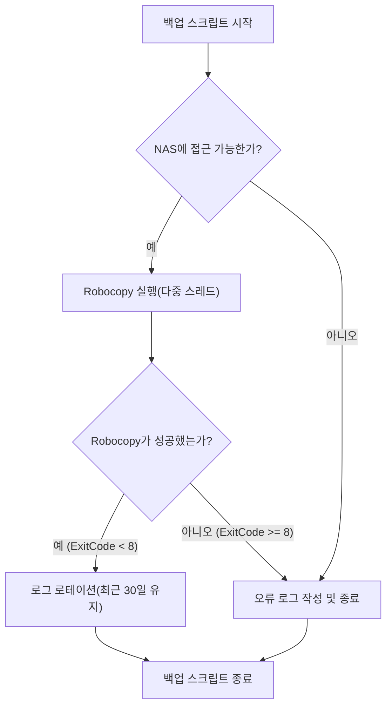
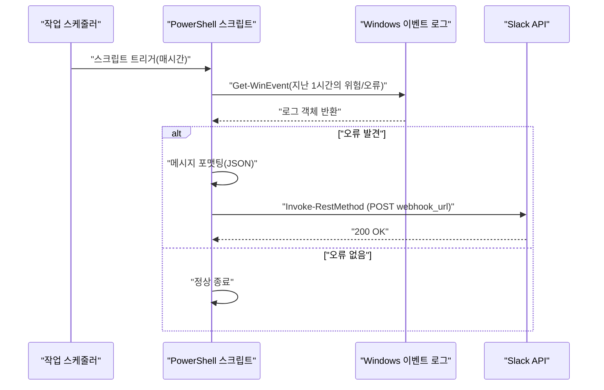

## 시작하며: 왜 PowerShell로 업무를 자동화해야 하는가

현대의 IT 인프라스트럭처나 개발 환경에서 Windows OS를 플랫폼으로 이용하는 사용자에게 '매일의 정형 업무'는 피할 수 없는 과제입니다. 파일 백업, 시스템 로그 모니터링, 개발 리소스(Git 리포지토리)의 최신화 및 빌드 등을 수동으로 수행하는 것은 인적 오류의 온상이 되며 귀중한 시간 낭비로 이어집니다.

과거에는 배치 파일(`.bat`이나 `.cmd`)이나 VBScript가 사용되었지만, 현재 가장 최적의 해답은 의심할 여지 없이 **PowerShell**입니다. PowerShell은 단순한 텍스트 기반 셸이 아니라 .NET Framework (그리고 .NET Core)의 강력한 객체 지향 기반 위에 구축되어 있습니다. 파이프라인을 통해 전달되는 데이터는 '문자열'이 아니라 '객체'이기 때문에 복잡한 텍스트 분석(grep, awk, sed와 같은 처리)을 자체적으로 구현할 필요 없이 속성만 지정하면 쉽게 데이터에 액세스할 수 있습니다.

이 글에서는 PowerShell을 사용한 실무에 직결되는 완전 자동화 스크립트의 실제 사례 세 가지(NAS로의 백업 및 로그 로테이션, 이벤트 로그 모니터링 및 Slack 알림, 다중 Git 리포지토리 일괄 업데이트 및 빌드)를 소개합니다. 또한 그에 앞서 필요한 PowerShell의 실행 정책, 모듈화, 작업 스케줄러 연동과 같은 기반 기술에 대해서도 깊이 있게 파헤쳐 설명합니다.

---

## PowerShell 자동화의 기반 다지기

자동화 스크립트를 운영 환경에서 안전하고 확실하게 작동시키기 위해서는 몇 가지 사전 준비가 필요합니다. 여기에서는 실행 정책에 대한 이해, 재사용성을 높이는 모듈화, 그리고 견고한 오류 처리에 대해 자세히 설명합니다.

### 1. PowerShell의 실행 정책(Execution Policy)

Windows에서는 기본 상태에서 악의적인 스크립트가 잘못 실행되는 것을 방지하기 위해 '실행 정책'이 설정되어 있으며, 초기 상태(`Restricted`)에서는 모든 스크립트(`.ps1` 파일)를 실행할 수 없습니다. 자동화를 수행하려면 이를 적절한 수준으로 변경해야 합니다.

실행 정책에는 다음과 같은 종류가 있습니다:

- **Restricted**: 스크립트 실행을 허용하지 않습니다. (기본값)
- **AllSigned**: 신뢰할 수 있는 게시자가 서명한 스크립트만 실행을 허용합니다.
- **RemoteSigned**: 로컬에서 작성된 스크립트는 그대로 실행할 수 있지만, 인터넷에서 다운로드한 스크립트에는 서명이 필요합니다.
- **Unrestricted**: 모든 스크립트를 실행할 수 있지만, 인터넷에서 다운로드한 스크립트를 실행할 때는 경고가 표시됩니다.
- **Bypass**: 아무것도 차단되지 않으며 경고도 표시되지 않습니다. 일시적인 스크립트 실행(CI/CD 파이프라인 등)에서 자주 사용됩니다.

기업의 로컬 환경에서 자체 제작 스크립트를 작업 스케줄러 등을 통해 실행할 경우, 가장 현실적이고 안전한 설정은 `RemoteSigned`입니다. 관리자 권한으로 PowerShell을 실행하고 아래 명령을 실행합니다.

```powershell
Set-ExecutionPolicy RemoteSigned -Scope LocalMachine -Force
```

이로써 로컬에서 작성한 백업 스크립트 등이 차단되지 않고 작동하게 됩니다.

### 2. 모듈화를 통한 코드 재사용(.psm1 / .psd1)

복잡한 자동화 처리를 수행할 경우, 모든 처리를 하나의 거대한 `.ps1` 파일에 작성하는 것은 유지 보수 측면에서 권장되지 않습니다. 자주 사용하는 함수(예: 로그 출력, Slack Webhook 전송, 오류 처리 등)는 '모듈'로 분할해야 합니다.

PowerShell 모듈은 주로 스크립트 모듈 파일(`.psm1`)과 모듈 매니페스트(`.psd1`)로 구성됩니다.

**CommonUtils.psm1**의 예:
```powershell
function Write-CustomLog {
    [CmdletBinding()]
    param (
        [Parameter(Mandatory=$true)]
        [string]$Message,
        
        [ValidateSet('INFO', 'WARNING', 'ERROR')]
        [string]$Level = 'INFO'
    )
    
    $timestamp = Get-Date -Format "yyyy-MM-dd HH:mm:ss"
    $logLine = "[$timestamp] [$Level] $Message"
    
    # 화면 출력과 파일 출력 모두 실행
    Write-Host $logLine
    Add-Content -Path "C:\logs\automation.log" -Value $logLine
}

Export-ModuleMember -Function Write-CustomLog
```

이 모듈을 다른 스크립트에서 호출하려면 스크립트 맨 처음에 `Import-Module`을 사용합니다.

```powershell
Import-Module "C:\Scripts\Modules\CommonUtils.psm1"
Write-CustomLog -Message "백업 처리를 시작합니다." -Level 'INFO'
```

### 3. 견고한 오류 처리(try / catch)

자동화에서 가장 중요한 것은 '실패했을 때 어떻게 동작할 것인가'입니다. PowerShell에서는 `$ErrorActionPreference`라는 내장 변수를 설정하여 명령 실패 시 기본 동작을 제어할 수 있습니다. 기본값은 `Continue`(오류를 표시하고 처리를 계속함)이지만, 자동화 스크립트에서는 `Stop`으로 설정하고 `try / catch` 블록으로 예외를 명시적으로 포착하는 것이 모범 사례입니다.

```powershell
$ErrorActionPreference = 'Stop'

try {
    # 실패할 가능성이 있는 처리
    $content = Get-Content -Path "C:\NonExistentFile.txt"
} catch [System.Management.Automation.ItemNotFoundException] {
    # 특정 오류 포착
    Write-Host "파일을 찾을 수 없습니다: $($_.Exception.Message)" -ForegroundColor Red
} catch {
    # 그 외의 모든 오류 포착
    Write-Host "예기치 않은 오류가 발생했습니다: $($_.Exception.Message)" -ForegroundColor Red
} finally {
    # 성공·실패에 관계없이 항상 실행되는 정리 처리
    Write-Host "처리를 종료합니다."
}
```

이 기반을 활용하면 야간에 무인으로 작동해도 안전하고 추적 가능한 스크립트를 구축할 수 있습니다.

---

## 작업 스케줄러 연동(Register-ScheduledTask)

스크립트가 완성되면 다음으로 그 스크립트를 주기적으로 실행하는 메커니즘이 필요합니다. Windows에서 가장 신뢰성이 높은 것은 '작업 스케줄러'입니다. GUI(`taskschd.msc`)를 통해 설정할 수도 있지만, 인프라의 절차서를 코드화(Infrastructure as Code)하는 관점에서 PowerShell cmdlet을 사용하여 작업을 등록하는 방법을 설명합니다.

PowerShell에는 `ScheduledTasks` 모듈이 준비되어 있으며, 이를 사용하면 트리거(언제 실행할지), 액션(무엇을 실행할지), 주체(어떤 사용자 권한으로 실행할지)를 상세하게 정의할 수 있습니다.

```powershell
# 1. 액션 정의(PowerShell을 숨김 상태로 실행하고, 지정된 스크립트를 전달)
$action = New-ScheduledTaskAction -Execute "powershell.exe" -Argument "-NoProfile -WindowStyle Hidden -ExecutionPolicy Bypass -File C:\Scripts\DailyTasks.ps1"

# 2. 트리거 정의(매일 오전 3시 00분에 실행)
$trigger = New-ScheduledTaskTrigger -Daily -At "3:00AM"

# 3. 주체(실행 사용자 권한) 정의(SYSTEM 권한으로 실행)
$principal = New-ScheduledTaskPrincipal -UserId "NT AUTHORITY\SYSTEM" -LogonType ServiceAccount -RunLevel Highest

# 4. 작업 설정 구성
$settings = New-ScheduledTaskSettingsSet -AllowStartIfOnBatteries -DontStopIfGoingOnBatteries -StartWhenAvailable -DontStopOnIdleEnd

# 5. 작업 등록
$taskName = "MyDailyAutomationTask"
Register-ScheduledTask -TaskName $taskName -Action $action -Trigger $trigger -Principal $principal -Settings $settings -Description "매일의 정형 업무를 자동 실행하는 작업" -Force
```

이 스크립트를 실행하기만 하면 작업 스케줄러에 작업이 등록되고, 매일 지정한 시간에 SYSTEM 권한(백그라운드에서 화면을 띄우지 않고 최고 권한으로)으로 스크립트가 실행됩니다.

---

## 실전 사례 1: 외부 NAS로의 백업 및 로그 로테이션

매일의 업무 데이터 백업은 필수이지만 수동 복사는 논외입니다. 여기에서는 Windows 표준 최강의 복사 명령인 `Robocopy`를 PowerShell에서 호출하여 실행 결과의 로그를 출력하고, 동시에 오래된 로그를 자동으로 삭제(로테이션)하는 스크립트를 작성합니다.

### 네트워크 전송 시 실행 시간의 이론값(Math)

백업 스크립트를 설계할 때 처리가 완료될 때까지 어느 정도의 시간이 걸릴지 추정하는 것은 운영상 중요합니다. 네트워크를 통해 NAS로 백업을 수행할 경우의 예상 소요 시간 $T_{backup}$은 아래 수식으로 근사할 수 있습니다.

$$ T_{backup} = \frac{S_{total}}{B \times (1 - \alpha)} + C \times L $$

여기서 각 변수는 다음과 같습니다.
- $S_{total}$ : 백업 대상의 총 데이터 양(Bit)
- $B$ : 네트워크 대역폭(bps, 예: 1Gbps = $10^9$ bps)
- $\alpha$ : 네트워크나 프로토콜의 오버헤드(일반적으로 TCP/IP나 SMB 프로토콜에서 0.1 ~ 0.2)
- $C$ : 총 파일 수
- $L$ : 파일 1개당 처리 레이턴시(초)

특히, 대량의 작은 파일(소스 코드 등)을 백업할 경우 파일 수 $C$에 의한 지연 항($C \times L$)이 지배적이 됩니다. 이 때문에 백업 처리에서는 단순한 파일 복사 도구가 아니라 다중 스레드 전송이 가능한 `Robocopy`를 이용하는 것이 최적입니다.

### 백업 스크립트 처리 흐름



### PowerShell 스크립트 구현 예시(`Backup-ToNas.ps1`)

```powershell
$ErrorActionPreference = 'Stop'

# 설정값
$SourceDir = "C:\WorkData"
$TargetNasDir = "\\NAS01\Backup\WorkData"
$LogDir = "C:\Scripts\Logs"
$DateStr = Get-Date -Format "yyyyMMdd"
$LogFile = Join-Path $LogDir "Backup_$DateStr.log"
$RetainDays = 30

try {
    # 1. 사전 확인: NAS에 접근할 수 있는지 여부
    if (-not (Test-Path $TargetNasDir)) {
        throw "NAS의 대상 경로에 접근할 수 없습니다: $TargetNasDir"
    }

    Write-Host "백업을 시작합니다: $SourceDir -> $TargetNasDir"

    # 2. Robocopy 실행
    # /MIR : 미러링(원본에 없는 파일은 삭제)
    # /MT:16 : 16개 스레드로 다중 스레드 복사
    # /NP : 진행 상태(%)를 출력하지 않음(로그가 지저분해지는 것을 방지)
    # /R:2 /W:2 : 오류 시 재시도 횟수 2회, 대기 2초
    $roboArgs = @(
        $SourceDir,
        $TargetNasDir,
        "/MIR",
        "/MT:16",
        "/NP",
        "/R:2",
        "/W:2",
        "/LOG+:$LogFile"
    )

    # PowerShell에서 외부 명령을 호출할 때는 Start-Process가 확실합니다
    $process = Start-Process -FilePath "robocopy.exe" -ArgumentList $roboArgs -Wait -NoNewWindow -PassThru
    $exitCode = $process.ExitCode

    # Robocopy의 종료 코드 사양: 0-7은 성공 또는 사양에 따른 정상 동작. 8 이상은 오류
    if ($exitCode -ge 8) {
        throw "Robocopy가 오류로 종료되었습니다. ExitCode: $exitCode"
    }

    Write-Host "백업이 정상적으로 완료되었습니다. ExitCode: $exitCode"

    # 3. 로그 로테이션
    Write-Host "오래된 로그 파일을 삭제하고 있습니다(보존 기간: ${RetainDays}일)"
    $limitDate = (Get-Date).AddDays(-$RetainDays)
    Get-ChildItem -Path $LogDir -Filter "Backup_*.log" | 
        Where-Object { $_.LastWriteTime -lt $limitDate } | 
        Remove-Item -Force

    Write-Host "로그 정리가 완료되었습니다."

} catch {
    $errorMessage = "백업 처리 중 오류가 발생했습니다: $($_.Exception.Message)"
    Write-Error $errorMessage
    # 실제 오류 로그 파일에 기록
    Add-Content -Path (Join-Path $LogDir "Error.log") -Value "[(Get-Date -Format 'yyyy-MM-dd HH:mm:ss')] $errorMessage"
    # 작업 스케줄러에 오류를 알리기 위해 0이 아닌 값으로 종료
    exit 1
}
```

이 스크립트는 작업 스케줄러와 결합하여 매일 완전 자동 백업을 실현합니다. 특히 `Robocopy`의 종료 코드 처리는 매우 중요합니다. Robocopy는 성공 시에도 '새 파일이 복사된' 경우 1, '여분의 파일이 삭제된' 경우 2 등을 반환하므로 단순한 `$LASTEXITCODE -eq 0`의 판정으로는 제대로 작동하지 않는다는 점에 주의해야 합니다.

---

## 실전 사례 2: 시스템 이벤트 로그 모니터링 및 Slack 알림(Webhook)

Windows 서버나 크리에이터용 워크스테이션에서 블루스크린(BSoD)의 전조가 정되는 디스크 오류나 애플리케이션 충돌(Application Error)을 재빨리 감지하는 것은 매우 중요합니다.
여기에서는 지난 1시간 동안의 `System` 및 `Application` 이벤트 로그에서 '오류' 및 '위험' 수준의 로그를 추출하고, 발견되었을 경우 Slack에 알림을 보내는 스크립트를 작성합니다.

### 알림 처리 시퀀스 다이어그램



### PowerShell 스크립트 구현 예시(`Monitor-EventLog.ps1`)

```powershell
$ErrorActionPreference = 'Stop'

# Slack Webhook URL (사전에 Slack의 Incoming Webhooks 연동으로 획득)
$SlackWebhookUrl = "https://hooks.slack.com/services/TXXXXX/BXXXXX/XXXXXXXXXXXXX"

# 검색 대상 시간 범위(과거 1시간)
$startTime = (Get-Date).AddHours(-1)

# XPath 필터를 사용하여 이벤트를 고속으로 검색
# 레벨 1: 위험(Critical), 2: 오류(Error)
$xmlFilter = @"
<QueryList>
  <Query Id="0" Path="System">
    <Select Path="System">*[System[(Level=1 or Level=2) and TimeCreated[@SystemTime&gt;='$($startTime.ToUniversalTime().ToString("o"))']]]</Select>
  </Query>
  <Query Id="1" Path="Application">
    <Select Path="Application">*[System[(Level=1 or Level=2) and TimeCreated[@SystemTime&gt;='$($startTime.ToUniversalTime().ToString("o"))']]]</Select>
  </Query>
</QueryList>
"@

try {
    # Get-WinEvent로 로그 가져오기
    # -ErrorAction SilentlyContinue 는 로그를 찾지 못했을 때의 오류를 무시하기 위함
    $events = Get-WinEvent -FilterXml $xmlFilter -ErrorAction SilentlyContinue

    if ($events -and $events.Count -gt 0) {
        $eventCount = $events.Count
        Write-Host "과거 1시간 동안 $eventCount 건의 오류/위험 로그가 발견되었습니다."

        # 알림용 텍스트 조립
        $messageBody = "*Windows 시스템 알림* :rotating_light:`n"
        $messageBody += "지난 1시간 동안 $eventCount 건의 오류가 감지되었습니다.`n`n"

        # 최신 3건만 상세 내용을 포함(글자 수 제한 등 고려)
        $events | Select-Object -First 3 | ForEach-Object {
            $messageBody += "*$($_.LogName)* - $($_.ProviderName) (EventID: $($_.Id))`n"
            $messageBody += "> $($_.Message -replace '`n', ' ')`n`n"
        }

        if ($eventCount -gt 3) {
            $messageBody += "※ 그 외 $($eventCount - 3) 건의 오류가 있습니다. 이벤트 뷰어를 확인해 주세요."
        }

        # Slack에 POST할 JSON 페이로드 작성
        $payload = @{
            text = $messageBody
            username = "SystemMonitor"
            icon_emoji = ":desktop_computer:"
        }
        $jsonPayload = $payload | ConvertTo-Json -Depth 3

        # REST API를 호출하여 Slack으로 전송
        Invoke-RestMethod -Uri $SlackWebhookUrl -Method Post -Body $jsonPayload -ContentType "application/json; charset=utf-8"
        
        Write-Host "Slack으로의 알림 전송이 완료되었습니다."
    } else {
        Write-Host "오류/위험 로그는 발견되지 않았습니다. 시스템은 정상입니다."
    }
} catch {
    Write-Error "이벤트 로그 모니터링 스크립트에서 오류가 발생했습니다: $($_.Exception.Message)"
    exit 1
}
```

이 스크립트의 기술적인 핵심은 `Get-WinEvent -FilterXml`을 사용한다는 점입니다. 기존의 `Get-EventLog` cmdlet이나 파이프라인을 통한 `Where-Object` 필터링은 전체 이벤트 객체를 메모리에 읽어들인 후 처리하기 때문에 처리가 매우 무거워집니다. XML 필터를 사용하면 Windows 이벤트 로그 서비스 측에서 필터링이 수행되므로 실행 시간이 몇 초 이내로 단축되는 압도적인 성능 향상을 기대할 수 있습니다.

---

## 실전 사례 3: 다중 Git 리포지토리 일괄 업데이트 및 빌드 자동화

개발자에게 있어 아침 일찍 자신의 작업 PC에 있는 여러 Git 리포지토리(프론트엔드, 백엔드, 인프라 리포지토리 등)를 최신 `main` 브랜치와 동기화하고, 필요에 따라 패키지 설치(`npm install` 등)나 빌드를 수행하는 작업은 매우 번거롭습니다.
이를 PowerShell 스크립트로 일괄 처리하는 도구를 작성합니다.

이 스크립트는 특정 부모 디렉터리 아래에 있는 모든 Git 리포지토리를 자동 감지하고, 커밋되지 않은 변경 사항이 없으면 `git pull`을 실행합니다. 또한 만약 새로운 변경 사항을 Pull 해왔다면 자동으로 빌드 명령을 실행합니다.

### 다중 리포지토리 자동 업데이트 스크립트(`Update-GitRepos.ps1`)

```powershell
$ErrorActionPreference = 'Stop'

# 리포지토리가 위치한 부모 디렉터리 목록
$TargetDirectories = @(
    "C:\Dev\FrontendProjects",
    "C:\Dev\BackendProjects"
)

# 각 디렉터리 탐색
foreach ($parentDir in $TargetDirectories) {
    if (-not (Test-Path $parentDir)) {
        Write-Warning "디렉터리를 찾을 수 없습니다: $parentDir"
        continue
    }

    # 하위 디렉터리 목록 가져오기
    $subDirs = Get-ChildItem -Path $parentDir -Directory
    
    foreach ($repoDir in $subDirs) {
        $repoPath = $repoDir.FullName
        $gitDir = Join-Path $repoPath ".git"

        # .git 폴더가 존재하는지 확인(Git 리포지토리 여부)
        if (Test-Path $gitDir) {
            Write-Host "---------------------------------"
            Write-Host "리포지토리 처리 중: $repoPath" -ForegroundColor Cyan
            
            # PowerShell의 현재 작업 디렉터리 변경
            Set-Location -Path $repoPath

            try {
                # 커밋되지 않은 변경 사항이 있는지 확인
                $status = git status --porcelain
                if ($status) {
                    Write-Host "커밋되지 않은 변경 사항이 있어 건너뜁니다." -ForegroundColor Yellow
                    continue
                }

                # 현재 브랜치 가져오기
                $branch = git rev-parse --abbrev-ref HEAD
                if ($branch -ne "main" -and $branch -ne "master") {
                    Write-Host "현재 브랜치가 $branch 이므로 건너뜁니다 (main/master만 대상)." -ForegroundColor Yellow
                    continue
                }

                # Pull을 실행하고 결과를 변수에 저장
                Write-Host "원격에서 최신 항목을 가져오는 중입니다 (git pull)..."
                $pullResult = git pull origin $branch 2>&1
                
                # 콘솔에도 출력
                $pullResult | ForEach-Object { Write-Host "  $_" }

                # 만약 "Already up to date." 이외의 문자열이 포함되어 있다면 업데이트가 있었다고 간주
                $isUpdated = $false
                foreach ($line in $pullResult) {
                    if ($line -notmatch "Already up to date") {
                        $isUpdated = $true
                        break
                    }
                }

                if ($isUpdated) {
                    Write-Host "리포지토리가 업데이트되었습니다. 빌드 작업을 시작합니다..." -ForegroundColor Green
                    
                    # package.json이 있으면 npm install 및 npm run build 실행
                    if (Test-Path "package.json") {
                        Write-Host "npm install 실행 중..."
                        npm install
                        Write-Host "npm run build 실행 중..."
                        npm run build
                    }
                    
                    # .sln(Visual Studio 솔루션)이 있으면 msbuild 또는 dotnet build 실행
                    $slnFiles = Get-ChildItem -Filter "*.sln"
                    if ($slnFiles.Count -gt 0) {
                        Write-Host ".NET 애플리케이션 빌드 중..."
                        dotnet build $slnFiles[0].FullName
                    }
                }

            } catch {
                Write-Error "리포지토리 $repoPath 처리 중 오류가 발생했습니다: $($_.Exception.Message)"
            }
        }
    }
}

Write-Host "---------------------------------"
Write-Host "모든 리포지토리의 업데이트 처리가 완료되었습니다." -ForegroundColor Green
```

이 스크립트는 오류가 발생해도 `try / catch`와 `foreach` 루프를 통해 다음 리포지토리의 처리에 영향을 주지 않고 계속 진행할 수 있도록 설계되었습니다. 또한 `git status --porcelain`이라는 스크립트 처리용 옵션을 이용하여 작업 트리의 정리 수준을 확실하게 판정합니다. 이 스크립트를 시작 폴더에 배치하거나 사용자 로그인 시 작업 스케줄러에 등록해 두면 PC를 켜고 커피를 내리는 동안 모든 개발 환경이 최신 상태로 정돈됩니다.

---

## 운영 시 주의점 및 고급 기술

PowerShell을 활용한 자동화 스크립트를 장기간 운영할 때 주의해야 할 몇 가지 모범 사례가 있습니다.

### 1. 자격 증명의 안전한 관리
스크립트 내에 비밀번호나 API 키(예: Slack Webhook URL, 데이터베이스 연결 문자열)를 일반 텍스트로 하드코딩하는 것은 보안상 큰 위험입니다. PowerShell에는 `Export-Clixml`이나 `ConvertFrom-SecureString`과 같이 인증 정보를 암호화하여 저장하는 기능이 갖춰져 있습니다.

```powershell
# 최초 1회만 수동 실행(비밀번호 입력 대화 상자가 표시됨)
# Get-Credential | Export-Clixml -Path "C:\Scripts\Creds\admin.xml"

# 자동화 스크립트 내에서 읽어들이기
$cred = Import-Clixml -Path "C:\Scripts\Creds\admin.xml"
# $cred 를 사용하여 원격 서버 연결 등을 수행
```

이로써 스크립트 실행 사용자의 프로필에서만 복호화할 수 있는 안전한 인증 정보 처리가 가능해집니다.

### 2. 트랜스크립트(Transcript)를 통한 실행 로그 전체 기록
앞서 언급한 예시에서는 `Add-Content` 등을 통해 개별적으로 로그를 출력했지만, PowerShell에는 화면에 출력된 모든 정보(오류 메시지나 표준 출력 포함)를 자동으로 파일에 기록하는 트랜스크립트 기능이 있습니다.

스크립트의 맨 처음과 끝에 아래 코드를 작성하기만 하면 강력한 감사 로그를 생성할 수 있습니다.

```powershell
Start-Transcript -Path "C:\Scripts\Logs\Execution_$(Get-Date -Format 'yyyyMMdd_HHmmss').log" -Append

# (여기에 스크립트 본문 처리)

Stop-Transcript
```

### 3. 모니터링의 수리적 접근과 이상 탐지(Math)

대규모 자동화에서는 단순히 오류를 감지하는 것뿐만 아니라 '평소와 다르다는' 것을 통계적으로 감지하는 방식이 효과적입니다. 예를 들어, 매일 백업 시간이 평소 평균과 극단적으로 차이가 나는 경우 네트워크 이상이나 디스크 고장의 전조일 수 있습니다.

매일의 백업 시간을 $x_1, x_2, \dots, x_n$ 이라고 할 때, 표본 평균 $\mu$ 와 표준 편차 $\sigma$ 는 다음과 같이 구할 수 있습니다.

$$ \mu = \frac{1}{n} \sum_{i=1}^n x_i $$
$$ \sigma = \sqrt{ \frac{1}{n-1} \sum_{i=1}^n (x_i - \mu)^2 } $$

만약 당일의 실행 시간 $x_{today}$ 가 $\mu + 3\sigma$ 를 초과한 경우(3시그마 규칙), 시스템은 '통계적인 이상이 발생했다'고 간주하고 경고 알림을 보내는 로직을 구성할 수도 있습니다. PowerShell의 `Measure-Object` cmdlet을 활용하면 이런 통계 처리도 단 몇 줄로 구현할 수 있습니다.

## 마무리

이 글에서는 Windows 환경에서 PowerShell을 이용한 정형 업무의 완전 자동화에 대해 실제 사례를 들어 설명했습니다.
실행 정책 관리와 모듈화를 통한 기반 구축부터 시작하여 백업·로그 로테이션, 이벤트 로그 모니터링 및 Slack 알림, 다중 Git 리포지토리 자동 빌드 등 실무에서 즉시 활용할 수 있는 스크립트를 소개했습니다.

PowerShell은 매우 심오하며 명령줄 도구이면서도 .NET의 거의 모든 기능에 접근할 수 있는 강력한 자동화 엔진입니다. 이번에 소개한 스크립트를 바탕으로 여러분의 업무 환경에 맞춰 경로와 처리 로직을 사용자 정의하여 번거로운 수작업에서 벗어나 창조적인 시간을 확보하시길 바랍니다.

자동화의 성공은 '작은 스크립트에서 시작하여 점차 오류 처리나 로그 출력 등 견고성을 높여가는 것'에 달려 있습니다. 먼저 여러분의 PC에서 폴더 하나를 백업하는 것부터 시작하여 PowerShell을 통한 자동화 여정을 시작해 보는 것은 어떨까요?
