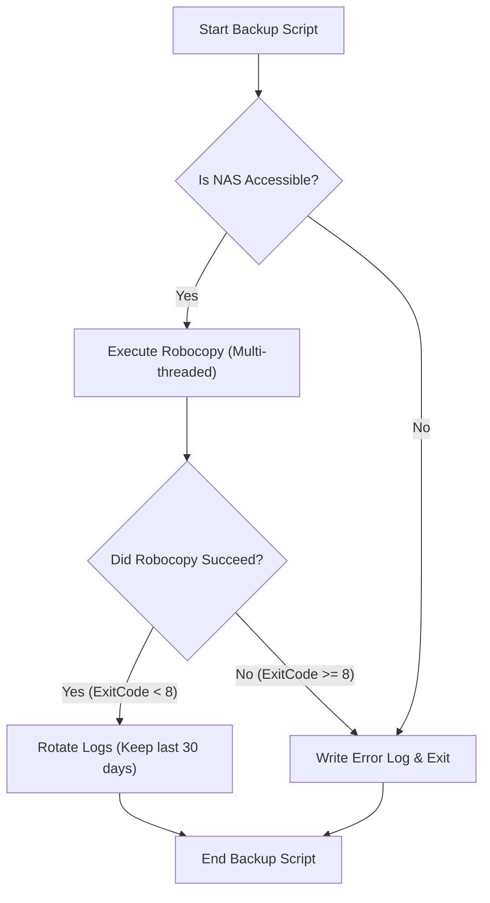
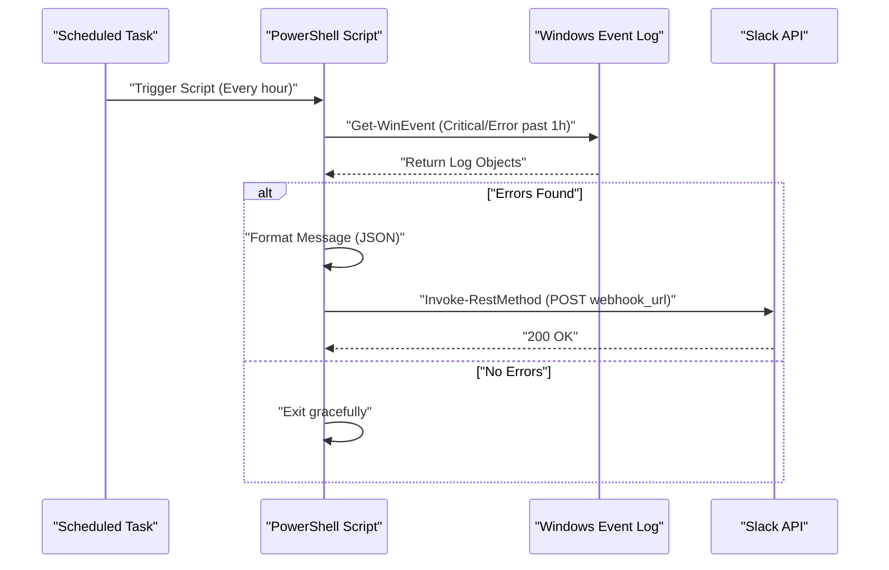

## はじめに：なぜPowerShellで業務を自動化するのか

現代のITインフラストラクチャや開発環境において、Windows OSをプラットフォームとして利用しているユーザーにとって「日々の定型業務」は避けて通れない課題です。ファイルのバックアップ、システムログの監視、開発リソース（Gitリポジトリ）の最新化とビルドなど、これらを手動で行うことは人的ミスの温床となり、貴重な時間の浪費につながります。

かつてはバッチファイル（`.bat`や`.cmd`）やVBScriptが使われていましたが、現在において最適な解は間違いなく **PowerShell** です。PowerShellは単なるテキストベースのシェルではなく、.NET Framework (および .NET Core) の強力なオブジェクト指向基盤の上に構築されています。パイプラインを通って渡されるデータは「文字列」ではなく「オブジェクト」であるため、複雑なテキスト解析（grep, awk, sedのような処理）を自前で実装する必要がなく、プロパティを指定するだけで容易にデータにアクセスできます。

本記事では、PowerShellを用いた実務に直結する完全自動化スクリプトの実例を3つ（NASへのバックアップとログローテーション、イベントログ監視とSlack通知、複数Gitリポジトリのバッチ更新・ビルド）紹介します。また、それに先立って必要となるPowerShellの実行ポリシー、モジュール化、タスクスケジューラ連携といった基盤技術についても深く掘り下げて解説します。

---

## PowerShell自動化の基盤を整える

自動化スクリプトを運用環境で安全かつ確実に動作させるためには、いくつかのお膳立てが必要です。ここでは、実行ポリシーの理解、再利用性を高めるモジュール化、そして堅牢なエラーハンドリングについて詳述します。

### 1. PowerShellの実行ポリシー（Execution Policy）

Windowsでは、デフォルトの状態で悪意のあるスクリプトが誤って実行されるのを防ぐために「実行ポリシー」が設定されており、初期状態（`Restricted`）では一切のスクリプト（`.ps1`ファイル）が実行できません。自動化を行うためには、これを適切なレベルに変更する必要があります。

実行ポリシーには以下のような種類があります：

- **Restricted**: スクリプトの実行を許可しません。（デフォルト）
- **AllSigned**: 信頼された発行元によって署名されたスクリプトのみ実行を許可します。
- **RemoteSigned**: ローカルで作成されたスクリプトはそのまま実行可能ですが、インターネットからダウンロードしたスクリプトには署名が必要です。
- **Unrestricted**: すべてのスクリプトを実行できますが、インターネットからダウンロードしたスクリプトを実行する際には警告が表示されます。
- **Bypass**: 何もブロックされず、警告も表示されません。一時的なスクリプト実行（CI/CDパイプラインなど）でよく使われます。

企業のローカル環境で自作スクリプトをタスクスケジューラ等で実行する場合、最も現実的かつ安全な設定は `RemoteSigned` です。管理者権限でPowerShellを起動し、以下のコマンドを実行します。

```powershell
Set-ExecutionPolicy RemoteSigned -Scope LocalMachine -Force
```

これにより、ローカルで作成したバックアップスクリプトなどがブロックされることなく動作するようになります。

### 2. モジュール化によるコードの再利用（.psm1 / .psd1）

複雑な自動化処理を行う場合、すべての処理を1つの巨大な `.ps1` ファイルに記述するのは保守性の観点から推奨されません。よく使う関数（例えばログ出力、SlackへのWebhook送信、エラーハンドリングなど）は「モジュール」として分割するべきです。

PowerShellモジュールは、主にスクリプトモジュールファイル（`.psm1`）とモジュールマニフェスト（`.psd1`）で構成されます。

**CommonUtils.psm1** の例：
```powershell
function Write-CustomLog {
    [CmdletBinding()]
    param (
        [Parameter(Mandatory=$true)]
        [string]$Message,
        
        [ValidateSet('INFO', 'WARNING', 'ERROR')]
        [string]$Level = 'INFO'
    )
    
    $timestamp = Get-Date -Format "yyyy-MM-dd HH:mm:ss"
    $logLine = "[$timestamp] [$Level] $Message"
    
    # 画面出力とファイル出力の両方を実施
    Write-Host $logLine
    Add-Content -Path "C:\logs\automation.log" -Value $logLine
}

Export-ModuleMember -Function Write-CustomLog
```

このモジュールを他のスクリプトから呼び出すには、スクリプトの先頭で `Import-Module` を使用します。

```powershell
Import-Module "C:\Scripts\Modules\CommonUtils.psm1"
Write-CustomLog -Message "バックアップ処理を開始します。" -Level 'INFO'
```

### 3. 堅牢なエラーハンドリング（try / catch）

自動化において最も重要なのは「失敗したときにどう振る舞うか」です。PowerShellでは `$ErrorActionPreference` という組み込み変数を設定することで、コマンド失敗時のデフォルトの挙動を制御できます。デフォルトは `Continue`（エラーを表示して処理を継続する）ですが、自動化スクリプトでは `Stop` に設定し、`try / catch` ブロックで例外を明示的に捕捉するのがベストプラクティスです。

```powershell
$ErrorActionPreference = 'Stop'

try {
    # 失敗する可能性のある処理
    $content = Get-Content -Path "C:\NonExistentFile.txt"
} catch [System.Management.Automation.ItemNotFoundException] {
    # 特定のエラーを捕捉
    Write-Host "ファイルが見つかりません: $($_.Exception.Message)" -ForegroundColor Red
} catch {
    # それ以外のすべてのエラーを捕捉
    Write-Host "予期せぬエラーが発生しました: $($_.Exception.Message)" -ForegroundColor Red
} finally {
    # 成功・失敗にかかわらず必ず実行されるクリーンアップ処理
    Write-Host "処理を終了します。"
}
```

この基盤を活用することで、夜間に無人で動作しても安全で追跡可能なスクリプトを構築することができます。

---

## タスクスケジューラとの連携（Register-ScheduledTask）

スクリプトが完成したら、次はそのスクリプトを定期的に実行する仕組みが必要です。Windowsにおいて最も信頼性が高いのは「タスクスケジューラ」です。GUI（`taskschd.msc`）から設定することも可能ですが、インフラの手順書をコード化（Infrastructure as Code）する観点から、PowerShellコマンドレットを使ってタスクを登録する方法を解説します。

PowerShellには `ScheduledTasks` モジュールが用意されており、これを使うことでトリガー（いつ実行するか）、アクション（何を実行するか）、プリンシパル（どのユーザー権限で実行するか）を詳細に定義できます。

```powershell
# 1. アクションの定義（PowerShellを非表示で実行し、指定のスクリプトを渡す）
$action = New-ScheduledTaskAction -Execute "powershell.exe" -Argument "-NoProfile -WindowStyle Hidden -ExecutionPolicy Bypass -File C:\Scripts\DailyTasks.ps1"

# 2. トリガーの定義（毎日 午前3時00分に実行）
$trigger = New-ScheduledTaskTrigger -Daily -At "3:00AM"

# 3. プリンシパル（実行ユーザー権限）の定義（SYSTEM権限で実行）
$principal = New-ScheduledTaskPrincipal -UserId "NT AUTHORITY\SYSTEM" -LogonType ServiceAccount -RunLevel Highest

# 4. タスク設定の構築
$settings = New-ScheduledTaskSettingsSet -AllowStartIfOnBatteries -DontStopIfGoingOnBatteries -StartWhenAvailable -DontStopOnIdleEnd

# 5. タスクの登録
$taskName = "MyDailyAutomationTask"
Register-ScheduledTask -TaskName $taskName -Action $action -Trigger $trigger -Principal $principal -Settings $settings -Description "毎日の定型業務を自動実行するタスク" -Force
```

このスクリプトを実行するだけで、タスクスケジューラにジョブが登録され、毎日指定した時間に SYSTEM 権限（バックグラウンドで画面を出さずに最高の権限）でスクリプトが実行されるようになります。

---

## 実践例1：外部NASへのバックアップとログローテーション

毎日の業務データのバックアップは必須ですが、手動コピーは論外です。ここではWindows標準の最強コピーコマンドである `Robocopy` をPowerShellから呼び出し、実行結果のログを出力し、かつ古いログを自動で削除（ローテーション）するスクリプトを作成します。

### ネットワーク転送における実行時間の理論値（Math）

バックアップスクリプトを設計する際、処理が完了するまでにどの程度の時間がかかるかを見積もることは運用上重要です。ネットワーク経由でNASにバックアップを行う場合の推定所要時間 $T_{backup}$ は、以下の式で近似できます。

$$ T_{backup} = \frac{S_{total}}{B \times (1 - \alpha)} + C \times L $$

ここで、各変数は以下の通りです。
- $S_{total}$ : バックアップ対象の総データ量 (Bit)
- $B$ : ネットワークの帯域幅 (bps, 例: 1Gbps = $10^9$ bps)
- $\alpha$ : ネットワークやプロトコルのオーバーヘッド (通常 TCP/IP や SMB プロトコルで 0.1 ～ 0.2)
- $C$ : ファイルの総数
- $L$ : ファイル1つあたりの処理レイテンシ (秒)

特に、大量の小さなファイル（ソースコードなど）をバックアップする場合、ファイル数 $C$ による遅延の項 ($C \times L$) が支配的になります。このため、バックアップ処理においては単純なファイルコピーツールではなく、マルチスレッド転送が可能な `Robocopy` を利用するのが最適です。

### バックアップスクリプトの処理フロー



### PowerShellスクリプトの実装例 (`Backup-ToNas.ps1`)

```powershell
$ErrorActionPreference = 'Stop'

# 設定値
$SourceDir = "C:\WorkData"
$TargetNasDir = "\\NAS01\Backup\WorkData"
$LogDir = "C:\Scripts\Logs"
$DateStr = Get-Date -Format "yyyyMMdd"
$LogFile = Join-Path $LogDir "Backup_$DateStr.log"
$RetainDays = 30

try {
    # 1. 事前チェック：NASにアクセスできるか
    if (-not (Test-Path $TargetNasDir)) {
        throw "NASのターゲットパスにアクセスできません: $TargetNasDir"
    }

    Write-Host "バックアップを開始します: $SourceDir -> $TargetNasDir"

    # 2. Robocopyの実行
    # /MIR : ミラーリング（コピー元にないファイルは削除）
    # /MT:16 : 16スレッドでマルチスレッドコピー
    # /NP : 進行状況（%）を出力しない（ログが汚れるのを防ぐため）
    # /R:2 /W:2 : エラー時の再試行回数2回、待機2秒
    $roboArgs = @(
        $SourceDir,
        $TargetNasDir,
        "/MIR",
        "/MT:16",
        "/NP",
        "/R:2",
        "/W:2",
        "/LOG+:$LogFile"
    )

    # PowerShellから外部コマンドを呼び出す際は Start-Process が確実です
    $process = Start-Process -FilePath "robocopy.exe" -ArgumentList $roboArgs -Wait -NoNewWindow -PassThru
    $exitCode = $process.ExitCode

    # Robocopyの終了コード仕様: 0-7 は成功または仕様通りの動作。8以上はエラー
    if ($exitCode -ge 8) {
        throw "Robocopyがエラーで終了しました。ExitCode: $exitCode"
    }

    Write-Host "バックアップが正常に完了しました。ExitCode: $exitCode"

    # 3. ログローテーション
    Write-Host "古いログファイルを削除しています（保存期間: ${RetainDays}日）"
    $limitDate = (Get-Date).AddDays(-$RetainDays)
    Get-ChildItem -Path $LogDir -Filter "Backup_*.log" | 
        Where-Object { $_.LastWriteTime -lt $limitDate } | 
        Remove-Item -Force

    Write-Host "ログのクリーンアップが完了しました。"

} catch {
    $errorMessage = "バックアップ処理中にエラーが発生しました: $($_.Exception.Message)"
    Write-Error $errorMessage
    # 実際のエラーログファイルに書き出す
    Add-Content -Path (Join-Path $LogDir "Error.log") -Value "[(Get-Date -Format 'yyyy-MM-dd HH:mm:ss')] $errorMessage"
    # タスクスケジューラにエラーを通知するために非ゼロで終了
    exit 1
}
```

このスクリプトは、タスクスケジューラと組み合わせることで日々の完全自動バックアップを実現します。特に `Robocopy` の終了コード処理は非常に重要です。Robocopyは成功時でも「新しいファイルがコピーされた」場合は 1、「余分なファイルが削除された」場合は 2 などを返すため、単純な `$LASTEXITCODE -eq 0` の判定では正しく動かない点に注意が必要です。

---

## 実践例2：システムイベントログの監視とSlack通知（Webhook）

Windowsサーバーやクリエイター用ワークステーションにおいて、ブルースクリーン（BSoD）の予兆となるディスクエラーや、アプリケーションのクラッシュ（Application Error）をいち早く検知することは非常に重要です。
ここでは、過去1時間の `System` および `Application` イベントログから「エラー」および「重大」レベルのログを抽出し、見つかった場合に Slack へ通知を送るスクリプトを作成します。

### 通知処理のシーケンス図



### PowerShellスクリプトの実装例 (`Monitor-EventLog.ps1`)

```powershell
$ErrorActionPreference = 'Stop'

# Slack Webhook URL (事前にSlackのIncoming Webhooksインテグレーションで取得)
$SlackWebhookUrl = "https://hooks.slack.com/services/TXXXXX/BXXXXX/XXXXXXXXXXXXX"

# 検索対象の時間範囲（過去1時間）
$startTime = (Get-Date).AddHours(-1)

# XPathフィルタを使用して高速にイベントログを検索
# レベル 1: 重大(Critical), 2: エラー(Error)
$xmlFilter = @"
<QueryList>
  <Query Id="0" Path="System">
    <Select Path="System">*[System[(Level=1 or Level=2) and TimeCreated[@SystemTime&gt;='$($startTime.ToUniversalTime().ToString("o"))']]]</Select>
  </Query>
  <Query Id="1" Path="Application">
    <Select Path="Application">*[System[(Level=1 or Level=2) and TimeCreated[@SystemTime&gt;='$($startTime.ToUniversalTime().ToString("o"))']]]</Select>
  </Query>
</QueryList>
"@

try {
    # Get-WinEventでログを取得
    # -ErrorAction SilentlyContinue は、ログが見つからなかったときのエラーを無視するため
    $events = Get-WinEvent -FilterXml $xmlFilter -ErrorAction SilentlyContinue

    if ($events -and $events.Count -gt 0) {
        $eventCount = $events.Count
        Write-Host "過去1時間に $eventCount 件のエラー/重大ログが見つかりました。"

        # 通知用のテキストを組み立てる
        $messageBody = "*Windowsシステム アラート* :rotating_light:`n"
        $messageBody += "過去1時間に $eventCount 件のエラーが検出されました。`n`n"

        # 最新の3件だけ詳細を載せる（文字数制限などを考慮）
        $events | Select-Object -First 3 | ForEach-Object {
            $messageBody += "*$($_.LogName)* - $($_.ProviderName) (EventID: $($_.Id))`n"
            $messageBody += "> $($_.Message -replace '`n', ' ')`n`n"
        }

        if ($eventCount -gt 3) {
            $messageBody += "※他 $($eventCount - 3) 件のエラーがあります。イベントビューアを確認してください。"
        }

        # SlackにPOSTするJSONペイロードの作成
        $payload = @{
            text = $messageBody
            username = "SystemMonitor"
            icon_emoji = ":desktop_computer:"
        }
        $jsonPayload = $payload | ConvertTo-Json -Depth 3

        # REST APIを呼び出してSlackへ送信
        Invoke-RestMethod -Uri $SlackWebhookUrl -Method Post -Body $jsonPayload -ContentType "application/json; charset=utf-8"
        
        Write-Host "Slackへの通知が完了しました。"
    } else {
        Write-Host "エラー/重大ログは見つかりませんでした。システムは正常です。"
    }
} catch {
    Write-Error "イベントログ監視スクリプトでエラーが発生しました: $($_.Exception.Message)"
    exit 1
}
```

このスクリプトの技術的なポイントは `Get-WinEvent -FilterXml` を使用している点です。従来の `Get-EventLog` コマンドレットやパイプラインによる `Where-Object` でのフィルタリングは、全件のイベントオブジェクトをメモリに読み込んでから処理するため、非常に処理が重くなります。XMLフィルタを使用することで、Windowsのイベントログサービス側でフィルタリングが行われるため、実行時間が数秒以内に収まるという圧倒的なパフォーマンスの向上が見込めます。

---

## 実践例3：複数Gitリポジトリの一括更新とビルド自動化

開発者にとって、朝一番に自分の作業PCに入っている複数のGitリポジトリ（フロントエンド、バックエンド、インフラリポジトリなど）を最新の `main` ブランチに同期し、必要に応じてパッケージのインストール（`npm install`等）やビルドを行う作業は非常に面倒です。
これをPowerShellスクリプトで一括で行うツールを作成します。

このスクリプトは、特定の親ディレクトリ配下にあるすべてのGitリポジトリを自動検知し、未コミットの変更がなければ `git pull` を実行します。さらに、もし新しい変更が Pull されてきた場合は自動的にビルドコマンドを発行します。

### 複数リポジトリ自動更新スクリプト (`Update-GitRepos.ps1`)

```powershell
$ErrorActionPreference = 'Stop'

# リポジトリが配置されている親ディレクトリのリスト
$TargetDirectories = @(
    "C:\Dev\FrontendProjects",
    "C:\Dev\BackendProjects"
)

# 各ディレクトリを探索
foreach ($parentDir in $TargetDirectories) {
    if (-not (Test-Path $parentDir)) {
        Write-Warning "ディレクトリが見つかりません: $parentDir"
        continue
    }

    # 子ディレクトリ一覧を取得
    $subDirs = Get-ChildItem -Path $parentDir -Directory
    
    foreach ($repoDir in $subDirs) {
        $repoPath = $repoDir.FullName
        $gitDir = Join-Path $repoPath ".git"

        # .git フォルダが存在するかチェック（Gitリポジトリかどうか）
        if (Test-Path $gitDir) {
            Write-Host "---------------------------------"
            Write-Host "リポジトリを処理中: $repoPath" -ForegroundColor Cyan
            
            # PowerShellの現在の作業ディレクトリを変更
            Set-Location -Path $repoPath

            try {
                # 未コミットの変更があるかチェック
                $status = git status --porcelain
                if ($status) {
                    Write-Host "未コミットの変更があるためスキップします。" -ForegroundColor Yellow
                    continue
                }

                # 現在のブランチを取得
                $branch = git rev-parse --abbrev-ref HEAD
                if ($branch -ne "main" -and $branch -ne "master") {
                    Write-Host "現在のブランチが $branch のためスキップします (main/masterのみ対象)。" -ForegroundColor Yellow
                    continue
                }

                # Pull を実行し、結果を変数に格納
                Write-Host "リモートから最新を取得しています (git pull)..."
                $pullResult = git pull origin $branch 2>&1
                
                # コンソールにも出力
                $pullResult | ForEach-Object { Write-Host "  $_" }

                # もし "Already up to date." 以外の文字列が含まれていたら、更新があったとみなす
                $isUpdated = $false
                foreach ($line in $pullResult) {
                    if ($line -notmatch "Already up to date") {
                        $isUpdated = $true
                        break
                    }
                }

                if ($isUpdated) {
                    Write-Host "リポジトリが更新されました。ビルドタスクを開始します..." -ForegroundColor Green
                    
                    # package.json があれば npm install と npm run build を実行
                    if (Test-Path "package.json") {
                        Write-Host "npm install を実行中..."
                        npm install
                        Write-Host "npm run build を実行中..."
                        npm run build
                    }
                    
                    # .sln (Visual Studio Solution) があれば msbuild または dotnet build を実行
                    $slnFiles = Get-ChildItem -Filter "*.sln"
                    if ($slnFiles.Count -gt 0) {
                        Write-Host ".NET アプリケーションをビルド中..."
                        dotnet build $slnFiles[0].FullName
                    }
                }

            } catch {
                Write-Error "リポジトリ $repoPath の処理中にエラーが発生しました: $($_.Exception.Message)"
            }
        }
    }
}

Write-Host "---------------------------------"
Write-Host "すべてのリポジトリの更新処理が完了しました。" -ForegroundColor Green
```

このスクリプトは、エラーが発生しても `try / catch` と `foreach` ループによって、次のリポジトリの処理に影響を与えずに継続できる設計になっています。また、`git status --porcelain` というスクリプト処理向けのオプションを利用して作業ツリーのクリーン度合いを確実に判定しています。このスクリプトをスタートアップフォルダに配置するか、ユーザーログオン時のタスクスケジューラに登録しておけば、PCを起動してコーヒーを入れている間にすべての開発環境が最新状態に整うことになります。

---

## 運用上の注意点と高度なテクニック

PowerShellを用いた自動化スクリプトを長期間運用する上で、いくつか気をつけるべきベストプラクティスがあります。

### 1. 資格情報の安全な管理
スクリプト内でパスワードやAPIキー（例：Slack Webhook URL、データベース接続文字列）をプレーンテキストでハードコードするのはセキュリティ上の大きなリスクです。PowerShellには `Export-Clixml` や `ConvertFrom-SecureString` といった、認証情報を暗号化して保存する機能が備わっています。

```powershell
# 初回のみ手動実行（パスワード入力ダイアログが表示される）
# Get-Credential | Export-Clixml -Path "C:\Scripts\Creds\admin.xml"

# 自動化スクリプト内での読み込み
$cred = Import-Clixml -Path "C:\Scripts\Creds\admin.xml"
# $cred を用いてリモートサーバー接続などを行う
```

これにより、スクリプト実行ユーザーのプロファイルでのみ復号化可能な安全な認証情報の取り扱いが可能になります。

### 2. トランスクリプト（Transcript）による実行ログの全記録
前述の例では `Add-Content` 等で個別にログを出力していましたが、PowerShellには画面に出力されたすべての情報（エラーメッセージや標準出力含む）を自動的にファイルに書き出すトランスクリプト機能があります。

スクリプトの先頭と末尾に以下を記述するだけで、強固な監査ログを作成できます。

```powershell
Start-Transcript -Path "C:\Scripts\Logs\Execution_$(Get-Date -Format 'yyyyMMdd_HHmmss').log" -Append

# （ここにスクリプト本体の処理）

Stop-Transcript
```

### 3. モニタリングの数理的アプローチと異常検知 (Math)

大規模な自動化では、単にエラーを検知するだけでなく、「普段と違う」ことを統計的に検知する手法が有効です。例えば、毎日のバックアップ時間が普段の平均から極端に乖離している場合、ネットワーク異常やディスク故障の予兆の可能性があります。

日々のバックアップ時間を $x_1, x_2, \dots, x_n$ としたとき、標本平均 $\mu$ と標準偏差 $\sigma$ は以下のように求まります。

$$ \mu = \frac{1}{n} \sum_{i=1}^n x_i $$
$$ \sigma = \sqrt{ \frac{1}{n-1} \sum_{i=1}^n (x_i - \mu)^2 } $$

もし当日の実行時間 $x_{today}$ が $\mu + 3\sigma$ を超えた場合（3シグマ・ルール）、システムは「統計的な異常が発生した」とみなし、警告通知を出すようなロジックを組むことも可能です。PowerShellの `Measure-Object` コマンドレットを活用すれば、このような統計的な処理も数行で実装できます。

## まとめ

本記事では、Windows環境におけるPowerShellを利用した定型業務の完全自動化について、実例を交えて解説しました。
実行ポリシーの管理やモジュール化による基盤作りから始まり、バックアップ・ログローテーション、イベントログ監視とSlack通知、複数Gitリポジトリの自動ビルドなど、実務で即戦力となるスクリプトを紹介しました。

PowerShellは非常に奥深く、コマンドラインツールでありながら.NETのほぼすべての機能にアクセスできる強力な自動化エンジンです。今回紹介したスクリプトをベースに、皆様の業務環境に合わせてパスや処理ロジックをカスタマイズし、煩雑な手作業から解放された創造的な時間を手に入れてください。

自動化の成功は「小さなスクリプトから始め、徐々にエラーハンドリングやログ出力などの堅牢性を高めていくこと」にかかっています。まずはご自身のPCの1つのフォルダをバックアップするところから、PowerShellによる自動化の旅をスタートしてみてはいかがでしょうか。
