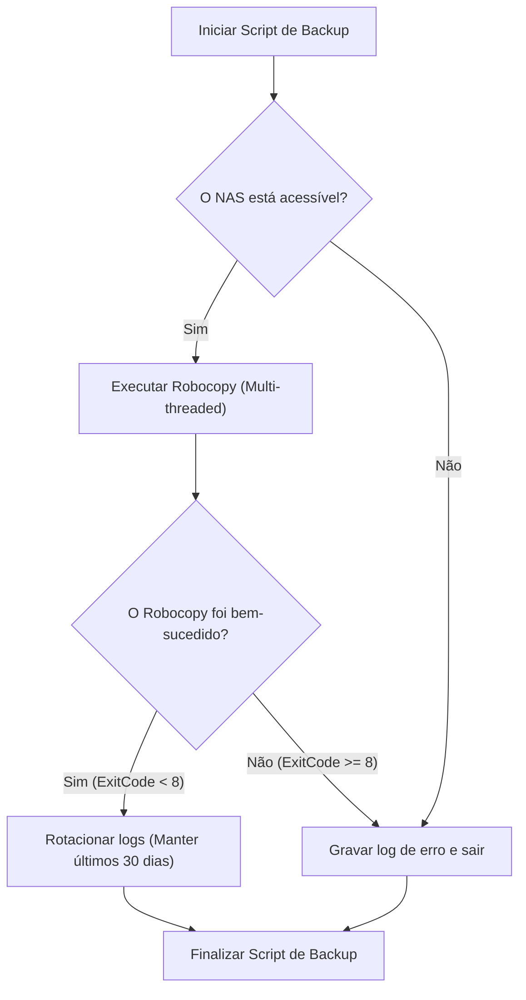
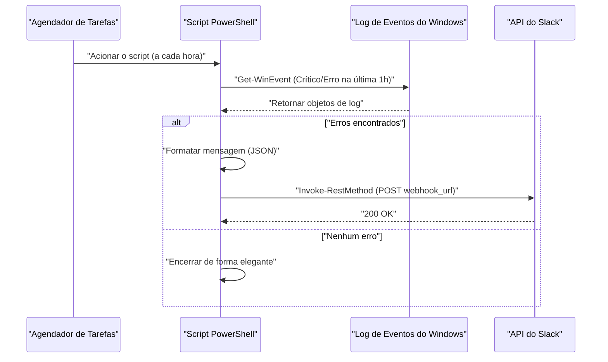

## Introdução: Por que automatizar tarefas com PowerShell?

Na infraestrutura de TI moderna e nos ambientes de desenvolvimento, as "tarefas rotineiras diárias" são um desafio inevitável para os usuários que utilizam o sistema operacional Windows como plataforma. Fazer backups de arquivos, monitorar logs do sistema, atualizar e compilar recursos de desenvolvimento (repositórios Git), entre outros, de forma manual, é um terreno fértil para erros humanos e leva ao desperdício de tempo precioso.

No passado, arquivos de lote (`.bat` ou `.cmd`) e VBScript eram utilizados, mas hoje a melhor solução, sem dúvida, é o **PowerShell**. O PowerShell não é apenas um shell baseado em texto, mas é construído sobre a poderosa base orientada a objetos do .NET Framework (e .NET Core). Como os dados passados pelo pipeline são "objetos" em vez de "strings", não há necessidade de implementar análises de texto complexas (como comandos grep, awk ou sed), e você pode acessar facilmente os dados apenas especificando suas propriedades.

Neste artigo, apresentaremos três exemplos reais de scripts de automação completa com PowerShell diretamente aplicáveis ao seu trabalho (backup para NAS e rotação de logs, monitoramento de logs de eventos e notificações no Slack, atualização em lote e build de vários repositórios Git). Antes disso, explicaremos detalhadamente as tecnologias subjacentes necessárias, como a política de execução do PowerShell, modularização e integração com o Agendador de Tarefas.

---

## Preparando a base para automação com PowerShell

Para que os scripts de automação funcionem de forma segura e confiável em um ambiente de produção, é necessária alguma preparação. Aqui, detalharemos o entendimento das políticas de execução, a modularização para melhorar a reutilização e o tratamento robusto de erros.

### 1. Política de Execução do PowerShell (Execution Policy)

No Windows, há uma "política de execução" configurada por padrão para evitar que scripts maliciosos sejam executados acidentalmente. No estado inicial (`Restricted`), nenhum script (arquivos `.ps1`) pode ser executado. Para realizar automações, é necessário alterar isso para um nível adequado.

Os tipos de políticas de execução são os seguintes:

- **Restricted**: Não permite a execução de scripts. (Padrão)
- **AllSigned**: Permite apenas a execução de scripts assinados por um editor confiável.
- **RemoteSigned**: Scripts criados localmente podem ser executados como estão, mas os scripts baixados da Internet exigem uma assinatura.
- **Unrestricted**: Pode executar todos os scripts, mas exibe um aviso ao executar scripts baixados da Internet.
- **Bypass**: Nada é bloqueado e nenhum aviso é exibido. Freqüentemente usado para execuções temporárias de scripts (como em pipelines de CI/CD).

Ao executar seus próprios scripts com o Agendador de Tarefas em um ambiente corporativo local, a configuração mais prática e segura é `RemoteSigned`. Inicie o PowerShell com privilégios de administrador e execute o seguinte comando:

```powershell
Set-ExecutionPolicy RemoteSigned -Scope LocalMachine -Force
```

Isso garantirá que os scripts de backup criados localmente sejam executados sem serem bloqueados.

### 2. Reutilização de código através da modularização (.psm1 / .psd1)

Ao lidar com automações complexas, escrever todo o processamento em um único arquivo `.ps1` gigante não é recomendado do ponto de vista de manutenção. Funções frequentemente usadas (por exemplo, saída de log, envio de Webhooks para o Slack, tratamento de erros, etc.) devem ser divididas em "módulos".

Os módulos do PowerShell consistem principalmente em arquivos de módulo de script (`.psm1`) e manifestos de módulo (`.psd1`).

Exemplo do **CommonUtils.psm1**:
```powershell
function Write-CustomLog {
    [CmdletBinding()]
    param (
        [Parameter(Mandatory=$true)]
        [string]$Message,
        
        [ValidateSet('INFO', 'WARNING', 'ERROR')]
        [string]$Level = 'INFO'
    )
    
    $timestamp = Get-Date -Format "yyyy-MM-dd HH:mm:ss"
    $logLine = "[$timestamp] [$Level] $Message"
    
    # Executa a saída na tela e a saída em arquivo
    Write-Host $logLine
    Add-Content -Path "C:\logs\automation.log" -Value $logLine
}

Export-ModuleMember -Function Write-CustomLog
```

Para chamar este módulo de outro script, use `Import-Module` no início do script.

```powershell
Import-Module "C:\Scripts\Modules\CommonUtils.psm1"
Write-CustomLog -Message "Iniciando o processo de backup." -Level 'INFO'
```

### 3. Tratamento robusto de erros (try / catch)

O mais importante na automação é "como se comportar quando ocorre uma falha". No PowerShell, ao definir a variável incorporada `$ErrorActionPreference`, você pode controlar o comportamento padrão quando um comando falha. O padrão é `Continue` (exibir o erro e continuar o processamento), mas em scripts de automação, a melhor prática é defini-lo como `Stop` e capturar a exceção explicitamente usando um bloco `try / catch`.

```powershell
$ErrorActionPreference = 'Stop'

try {
    # Processo que pode falhar
    $content = Get-Content -Path "C:\NonExistentFile.txt"
} catch [System.Management.Automation.ItemNotFoundException] {
    # Capturar um erro específico
    Write-Host "Arquivo não encontrado: $($_.Exception.Message)" -ForegroundColor Red
} catch {
    # Capturar todos os outros erros
    Write-Host "Ocorreu um erro inesperado: $($_.Exception.Message)" -ForegroundColor Red
} finally {
    # Processo de limpeza executado sempre, quer haja sucesso ou falha
    Write-Host "Finalizando o processamento."
}
```

Ao aproveitar esta base, você pode construir scripts seguros e rastreáveis que funcionam sem supervisão durante a noite.

---

## Integração com o Agendador de Tarefas (Register-ScheduledTask)

Quando o script estiver concluído, o próximo passo é ter um mecanismo para executá-lo regularmente. A ferramenta mais confiável no Windows é o "Agendador de Tarefas" (Task Scheduler). É possível configurá-lo pela GUI (`taskschd.msc`), mas, do ponto de vista de codificar o manual de infraestrutura (Infrastructure as Code), explicaremos como registrar tarefas usando os cmdlets do PowerShell.

O PowerShell inclui o módulo `ScheduledTasks`, que permite definir detalhadamente os gatilhos (quando executar), ações (o que executar) e a entidade (com quais privilégios de usuário executar).

```powershell
# 1. Definição da ação (Executar o PowerShell oculto e passar o script especificado)
$action = New-ScheduledTaskAction -Execute "powershell.exe" -Argument "-NoProfile -WindowStyle Hidden -ExecutionPolicy Bypass -File C:\Scripts\DailyTasks.ps1"

# 2. Definição do gatilho (Executar diariamente às 3h00 da manhã)
$trigger = New-ScheduledTaskTrigger -Daily -At "3:00AM"

# 3. Definição do principal (privilégios do usuário) (Executar com privilégios SYSTEM)
$principal = New-ScheduledTaskPrincipal -UserId "NT AUTHORITY\SYSTEM" -LogonType ServiceAccount -RunLevel Highest

# 4. Construção das configurações da tarefa
$settings = New-ScheduledTaskSettingsSet -AllowStartIfOnBatteries -DontStopIfGoingOnBatteries -StartWhenAvailable -DontStopOnIdleEnd

# 5. Registro da tarefa
$taskName = "MyDailyAutomationTask"
Register-ScheduledTask -TaskName $taskName -Action $action -Trigger $trigger -Principal $principal -Settings $settings -Description "Tarefa que executa automaticamente as rotinas diárias" -Force
```

Basta executar esse script para registrar a tarefa no Agendador de Tarefas, e o script será executado diariamente no horário especificado, com privilégios SYSTEM (o nível mais alto de privilégio, em segundo plano sem exibir telas).

---

## Exemplo prático 1: Backup em NAS externo e Rotação de Logs

O backup diário dos dados de trabalho é essencial, mas a cópia manual está fora de questão. Aqui, chamaremos o `Robocopy`, o comando de cópia mais poderoso integrado ao Windows, através do PowerShell, criaremos um script que gera logs de execução e exclui automaticamente os logs antigos (rotação).

### Valor teórico do tempo de execução em transferência de rede (Matemática)

Ao projetar um script de backup, é importante operacionalmente estimar quanto tempo levará para o processo ser concluído. O tempo estimado necessário $T_{backup}$ para realizar um backup em um NAS através de uma rede pode ser aproximado pela seguinte fórmula:

$$ T_{backup} = \frac{S_{total}}{B \times (1 - \alpha)} + C \times L $$

Onde cada variável é a seguinte:
- $S_{total}$ : Quantidade total de dados de backup (Bits)
- $B$ : Largura de banda da rede (bps, ex: 1Gbps = $10^9$ bps)
- $\alpha$ : Sobrecarga (overhead) de rede e protocolos (geralmente entre 0,1 e 0,2 em protocolos TCP/IP ou SMB)
- $C$ : Número total de arquivos
- $L$ : Latência de processamento por arquivo (segundos)

Especialmente ao fazer backup de um grande número de arquivos pequenos (como código-fonte), o termo de latência devido ao número de arquivos $C$ ($C \times L$) torna-se dominante. Portanto, em processos de backup, é ideal usar o `Robocopy`, que permite transferências multitarefa (multi-threaded), em vez de uma ferramenta de cópia de arquivos simples.

### Fluxo de processamento do script de backup



### Exemplo de implementação do script PowerShell (`Backup-ToNas.ps1`)

```powershell
$ErrorActionPreference = 'Stop'

# Configurações
$SourceDir = "C:\WorkData"
$TargetNasDir = "\\NAS01\Backup\WorkData"
$LogDir = "C:\Scripts\Logs"
$DateStr = Get-Date -Format "yyyyMMdd"
$LogFile = Join-Path $LogDir "Backup_$DateStr.log"
$RetainDays = 30

try {
    # 1. Verificação prévia: é possível acessar o NAS?
    if (-not (Test-Path $TargetNasDir)) {
        throw "Não é possível acessar o caminho de destino no NAS: $TargetNasDir"
    }

    Write-Host "Iniciando o backup: $SourceDir -> $TargetNasDir"

    # 2. Execução do Robocopy
    # /MIR : Espelhamento (arquivos não existentes na origem serão excluídos)
    # /MT:16 : Cópia com 16 threads (multi-threaded)
    # /NP : Não exibir progresso (%) (para evitar poluição no log)
    # /R:2 /W:2 : Número de novas tentativas em caso de erro é 2, com 2 segundos de espera
    $roboArgs = @(
        $SourceDir,
        $TargetNasDir,
        "/MIR",
        "/MT:16",
        "/NP",
        "/R:2",
        "/W:2",
        "/LOG+:$LogFile"
    )

    # Usar Start-Process é o método mais seguro ao chamar comandos externos do PowerShell
    $process = Start-Process -FilePath "robocopy.exe" -ArgumentList $roboArgs -Wait -NoNewWindow -PassThru
    $exitCode = $process.ExitCode

    # Especificação dos códigos de saída do Robocopy: 0-7 são sucesso ou comportamentos esperados. 8 ou mais são erros.
    if ($exitCode -ge 8) {
        throw "O Robocopy terminou com erro. ExitCode: $exitCode"
    }

    Write-Host "O backup foi concluído com sucesso. ExitCode: $exitCode"

    # 3. Rotação de logs
    Write-Host "Excluindo arquivos de log antigos (período de retenção: ${RetainDays} dias)"
    $limitDate = (Get-Date).AddDays(-$RetainDays)
    Get-ChildItem -Path $LogDir -Filter "Backup_*.log" | 
        Where-Object { $_.LastWriteTime -lt $limitDate } | 
        Remove-Item -Force

    Write-Host "A limpeza de logs foi concluída."

} catch {
    $errorMessage = "Ocorreu um erro durante o processo de backup: $($_.Exception.Message)"
    Write-Error $errorMessage
    # Gravar no arquivo de log de erro real
    Add-Content -Path (Join-Path $LogDir "Error.log") -Value "[(Get-Date -Format 'yyyy-MM-dd HH:mm:ss')] $errorMessage"
    # Sair com um código diferente de zero para notificar o erro ao Agendador de Tarefas
    exit 1
}
```

Este script, combinado com o Agendador de Tarefas, alcança backups automáticos e completos diariamente. Em particular, o tratamento do código de saída do `Robocopy` é de extrema importância. O Robocopy retorna 1 mesmo em caso de sucesso se "novos arquivos foram copiados", ou 2 se "arquivos extras foram excluídos". Portanto, é necessário ter cuidado, pois uma simples verificação `$LASTEXITCODE -eq 0` não funcionará corretamente.

---

## Exemplo prático 2: Monitoramento de logs de eventos do sistema e notificação no Slack (Webhook)

Em servidores Windows ou estações de trabalho para criadores, é muito importante detectar precocemente erros de disco, que podem ser precursores de telas azuis (BSoD), ou travamentos de aplicações (Application Error).
Aqui, criaremos um script que extrai logs dos níveis "Erro" e "Crítico" dos logs de eventos `System` e `Application` na última hora, e envia uma notificação para o Slack se encontrar algum.

### Diagrama de sequência do processo de notificação



### Exemplo de implementação do script PowerShell (`Monitor-EventLog.ps1`)

```powershell
$ErrorActionPreference = 'Stop'

# URL do Webhook do Slack (Obtido previamente com a integração Incoming Webhooks no Slack)
$SlackWebhookUrl = "https://hooks.slack.com/services/TXXXXX/BXXXXX/XXXXXXXXXXXXX"

# Intervalo de tempo da pesquisa (Última 1 hora)
$startTime = (Get-Date).AddHours(-1)

# Pesquisar logs de eventos rapidamente usando filtro XPath
# Nível 1: Crítico (Critical), 2: Erro (Error)
$xmlFilter = @"
<QueryList>
  <Query Id="0" Path="System">
    <Select Path="System">*[System[(Level=1 or Level=2) and TimeCreated[@SystemTime&gt;='$($startTime.ToUniversalTime().ToString("o"))']]]</Select>
  </Query>
  <Query Id="1" Path="Application">
    <Select Path="Application">*[System[(Level=1 or Level=2) and TimeCreated[@SystemTime&gt;='$($startTime.ToUniversalTime().ToString("o"))']]]</Select>
  </Query>
</QueryList>
"@

try {
    # Obter os logs com Get-WinEvent
    # -ErrorAction SilentlyContinue é usado para ignorar erros quando nenhum log é encontrado
    $events = Get-WinEvent -FilterXml $xmlFilter -ErrorAction SilentlyContinue

    if ($events -and $events.Count -gt 0) {
        $eventCount = $events.Count
        Write-Host "Foram encontrados $eventCount logs críticos/erros na última 1 hora."

        # Construir o texto da notificação
        $messageBody = "*Alerta do Sistema Windows* :rotating_light:`n"
        $messageBody += "Foram detectados $eventCount erros na última hora.`n`n"

        # Incluir detalhes apenas dos 3 logs mais recentes (considerando limite de caracteres, etc.)
        $events | Select-Object -First 3 | ForEach-Object {
            $messageBody += "*$($_.LogName)* - $($_.ProviderName) (EventID: $($_.Id))`n"
            $messageBody += "> $($_.Message -replace '`n', ' ')`n`n"
        }

        if ($eventCount -gt 3) {
            $messageBody += "※Há $($eventCount - 3) outros erros. Verifique o Visualizador de Eventos."
        }

        # Criação do payload JSON para POST no Slack
        $payload = @{
            text = $messageBody
            username = "SystemMonitor"
            icon_emoji = ":desktop_computer:"
        }
        $jsonPayload = $payload | ConvertTo-Json -Depth 3

        # Chamar a API REST e enviar para o Slack
        Invoke-RestMethod -Uri $SlackWebhookUrl -Method Post -Body $jsonPayload -ContentType "application/json; charset=utf-8"
        
        Write-Host "A notificação para o Slack foi concluída."
    } else {
        Write-Host "Nenhum log crítico/erro foi encontrado. O sistema está normal."
    }
} catch {
    Write-Error "Ocorreu um erro no script de monitoramento de logs de eventos: $($_.Exception.Message)"
    exit 1
}
```

O ponto técnico chave neste script é o uso de `Get-WinEvent -FilterXml`. Ferramentas anteriores como o cmdlet `Get-EventLog` ou a filtragem com `Where-Object` através de pipeline são extremamente pesadas, pois carregam todos os objetos de evento na memória antes de processá-los. Ao usar o filtro XML, a filtragem é realizada no próprio serviço de Log de Eventos do Windows, o que proporciona uma melhoria impressionante de desempenho, geralmente mantendo o tempo de execução em menos de alguns segundos.

---

## Exemplo prático 3: Atualização em lote de múltiplos repositórios Git e automação de build

Para os desenvolvedores, logo de manhã, sincronizar vários repositórios Git em seus computadores (como repositórios de frontend, backend e infraestrutura) com a ramificação `main` mais recente, instalando pacotes conforme necessário (como `npm install`) e compilando (build) tudo pode ser uma tarefa entediante.
Criaremos uma ferramenta baseada em scripts do PowerShell para realizar essas tarefas em lote.

Este script detecta automaticamente todos os repositórios Git em diretórios pai específicos e, se não houver alterações não confirmadas (uncommitted), ele executará um `git pull`. Além disso, se houver novas atualizações recebidas após o Pull, ele emitirá automaticamente um comando de build.

### Script de atualização automática para múltiplos repositórios (`Update-GitRepos.ps1`)

```powershell
$ErrorActionPreference = 'Stop'

# Lista de diretórios pai onde os repositórios estão localizados
$TargetDirectories = @(
    "C:\Dev\FrontendProjects",
    "C:\Dev\BackendProjects"
)

# Explorar cada diretório
foreach ($parentDir in $TargetDirectories) {
    if (-not (Test-Path $parentDir)) {
        Write-Warning "O diretório não foi encontrado: $parentDir"
        continue
    }

    # Obter a lista de subdiretórios
    $subDirs = Get-ChildItem -Path $parentDir -Directory
    
    foreach ($repoDir in $subDirs) {
        $repoPath = $repoDir.FullName
        $gitDir = Join-Path $repoPath ".git"

        # Verificar se a pasta .git existe (Se é um repositório Git)
        if (Test-Path $gitDir) {
            Write-Host "---------------------------------"
            Write-Host "Processando repositório: $repoPath" -ForegroundColor Cyan
            
            # Alterar o diretório de trabalho atual do PowerShell
            Set-Location -Path $repoPath

            try {
                # Verificar se há alterações não confirmadas
                $status = git status --porcelain
                if ($status) {
                    Write-Host "Ignorado porque há alterações não confirmadas (uncommitted)." -ForegroundColor Yellow
                    continue
                }

                # Obter o branch atual
                $branch = git rev-parse --abbrev-ref HEAD
                if ($branch -ne "main" -and $branch -ne "master") {
                    Write-Host "Ignorado porque a branch atual é $branch (Aplica-se apenas a main/master)." -ForegroundColor Yellow
                    continue
                }

                # Executar Pull e armazenar o resultado em uma variável
                Write-Host "Obtendo as atualizações mais recentes do remoto (git pull)..."
                $pullResult = git pull origin $branch 2>&1
                
                # Exibir no console
                $pullResult | ForEach-Object { Write-Host "  $_" }

                # Se a string contiver algo além de "Already up to date.", será considerado atualizado
                $isUpdated = $false
                foreach ($line in $pullResult) {
                    if ($line -notmatch "Already up to date") {
                        $isUpdated = $true
                        break
                    }
                }

                if ($isUpdated) {
                    Write-Host "O repositório foi atualizado. Iniciando as tarefas de build..." -ForegroundColor Green
                    
                    # Se package.json existir, execute npm install e npm run build
                    if (Test-Path "package.json") {
                        Write-Host "Executando npm install..."
                        npm install
                        Write-Host "Executando npm run build..."
                        npm run build
                    }
                    
                    # Se existir .sln (Visual Studio Solution), execute msbuild ou dotnet build
                    $slnFiles = Get-ChildItem -Filter "*.sln"
                    if ($slnFiles.Count -gt 0) {
                        Write-Host "Compilando o aplicativo .NET..."
                        dotnet build $slnFiles[0].FullName
                    }
                }

            } catch {
                Write-Error "Ocorreu um erro durante o processamento do repositório $repoPath: $($_.Exception.Message)"
            }
        }
    }
}

Write-Host "---------------------------------"
Write-Host "O processo de atualização para todos os repositórios foi concluído." -ForegroundColor Green
```

O design deste script garante que se ocorrer um erro, ele será capturado pelo `try / catch` e continuará o loop `foreach` para o próximo repositório sem interromper a execução inteira. Além disso, ele utiliza a opção `git status --porcelain` para determinar de maneira confiável a limpeza da árvore de trabalho (working tree), o que é ideal para o uso com scripts. Ao colocar este script em uma pasta de inicialização (startup) ou agendá-lo no Agendador de Tarefas no logon do usuário, você pode ter todos os seus ambientes de desenvolvimento atualizados enquanto prepara seu café, logo após inicializar o PC.

---

## Considerações operacionais e técnicas avançadas

Ao usar scripts de automação PowerShell a longo prazo, existem várias práticas recomendadas a serem observadas.

### 1. Gerenciamento seguro de credenciais
Embutir senhas e chaves de API em texto puro no script (por exemplo, URL do Webhook do Slack, string de conexão do banco de dados) é um grande risco de segurança. O PowerShell vem equipado com recursos como `Export-Clixml` e `ConvertFrom-SecureString`, que podem criptografar e armazenar informações de autenticação com segurança.

```powershell
# Executado manualmente pela primeira vez (a caixa de diálogo para digitação da senha aparecerá)
# Get-Credential | Export-Clixml -Path "C:\Scripts\Creds\admin.xml"

# Leitura nos scripts de automação
$cred = Import-Clixml -Path "C:\Scripts\Creds\admin.xml"
# Use $cred para conectar a um servidor remoto, etc.
```

Isso permite um gerenciamento seguro de credenciais e pode ser descriptografado apenas pelo perfil do usuário que executa o script.

### 2. Registro completo das execuções com Transcript
Nos exemplos anteriores, os logs foram criados individualmente com `Add-Content` ou similares. No entanto, o PowerShell possui um recurso de Transcrição (Transcript) embutido que salva de maneira automática e detalhada todas as informações de saída visíveis no console (incluindo mensagens de erro e a saída padrão) para um arquivo.

Você pode criar um log de auditoria robusto simplesmente adicionando os seguintes comandos no início e no final do seu script.

```powershell
Start-Transcript -Path "C:\Scripts\Logs\Execution_$(Get-Date -Format 'yyyyMMdd_HHmmss').log" -Append

# (O corpo de processamento principal do seu script aqui)

Stop-Transcript
```

### 3. Abordagens matemáticas no monitoramento e detecção de anomalias (Math)

Na automação em larga escala, métodos baseados em análises estatísticas para não apenas detectar erros diretos, mas também desvios do normal, podem ser extremamente eficazes. Por exemplo, se o tempo de backup diário se desviar drasticamente da sua média habitual, pode ser um sinal de anomalia na rede ou prenúncio de uma falha de disco.

Onde o tempo de backup diário é $x_1, x_2, \dots, x_n$, a média da amostra $\mu$ e o desvio padrão $\sigma$ são expressos da seguinte forma:

$$ \mu = \frac{1}{n} \sum_{i=1}^n x_i $$
$$ \sigma = \sqrt{ \frac{1}{n-1} \sum_{i=1}^n (x_i - \mu)^2 } $$

Se o tempo de execução de hoje $x_{today}$ exceder $\mu + 3\sigma$ (regra do 3-sigma), o sistema considerará que uma "anomalia estatística" ocorreu e poderá disparar uma notificação de alerta baseada nessa lógica de regras. Utilizando o cmdlet `Measure-Object` do PowerShell, você pode implementar esses cálculos estatísticos em poucas linhas de código.

## Conclusão

Neste artigo, explicamos como usar o PowerShell para automatizar totalmente suas tarefas rotineiras em ambientes Windows, usando exemplos reais.
Começando desde as bases, como gerenciar políticas de execução e modularização, apresentamos scripts prontos para uso focados no trabalho cotidiano, englobando rotação de logs e backup, monitoramento de logs de eventos e notificações no Slack, além de build automático em múltiplos repositórios Git.

O PowerShell é um mecanismo de automação extremamente profundo e poderoso que, apesar de ser executado por linha de comando, dá acesso a quase todos os recursos do .NET. Aproveite os scripts apresentados como um ponto de partida, personalize os caminhos e as lógicas de acordo com as necessidades do seu próprio ambiente de trabalho, e desfrute de um tempo criativo onde você está livre de tarefas manuais árduas.

O sucesso na automação provém de "começar com pequenos scripts e gradualmente aumentar a robustez, abordando também o tratamento de erros e a saída de logs". Que tal começar a sua jornada de automação usando PowerShell criando inicialmente um backup de apenas uma pasta de sua preferência no seu próprio PC?
