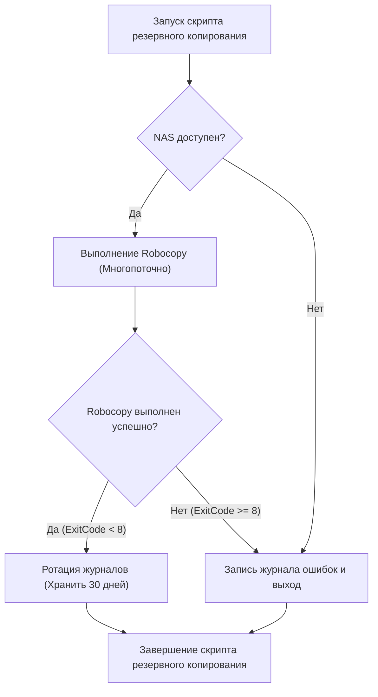
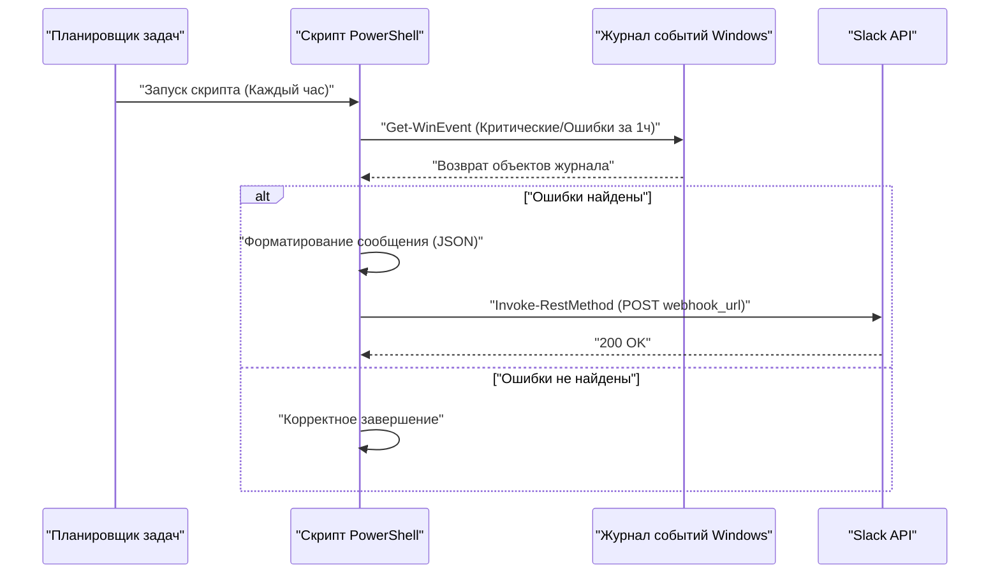

## Введение: Почему стоит автоматизировать задачи с помощью PowerShell

В современной ИТ-инфраструктуре и средах разработки для пользователей, использующих ОС Windows в качестве платформы, «ежедневные рутинные задачи» — это проблема, которую невозможно избежать. Резервное копирование файлов, мониторинг системных журналов, обновление и сборка ресурсов разработки (репозиториев Git) — выполнение этих задач вручную становится питательной средой для человеческих ошибок и приводит к пустой трате драгоценного времени.

Раньше использовались пакетные файлы (`.bat` или `.cmd`) и VBScript, но на сегодняшний день оптимальным решением, без сомнения, является **PowerShell**. PowerShell — это не просто текстовая оболочка; она построена на мощной объектно-ориентированной основе .NET Framework (и .NET Core). Поскольку данные, передаваемые через конвейер, являются «объектами», а не «строками», нет необходимости самостоятельно реализовывать сложный анализ текста (как в grep, awk, sed), и вы можете легко получить доступ к данным, просто указав свойства.

В этой статье представлены три практических примера скриптов полной автоматизации с использованием PowerShell (резервное копирование на NAS и ротация журналов, мониторинг журналов событий и уведомления в Slack, пакетное обновление и сборка нескольких Git-репозиториев). Кроме того, мы подробно рассмотрим такие фундаментальные технологии, как политики выполнения PowerShell, модуляризация и интеграция с Планировщиком задач, которые необходимы перед началом работы.

---

## Подготовка основы для автоматизации PowerShell

Чтобы скрипты автоматизации работали безопасно и надежно в производственной среде, требуется некоторая подготовка. Здесь мы подробно опишем понимание политик выполнения, модуляризацию для повышения возможности повторного использования и надежную обработку ошибок.

### 1. Политика выполнения PowerShell (Execution Policy)

В Windows по умолчанию установлена «политика выполнения» для предотвращения случайного выполнения вредоносных скриптов, и в исходном состоянии (`Restricted`) выполнение любых скриптов (файлов `.ps1`) запрещено. Чтобы выполнять автоматизацию, необходимо изменить этот параметр на соответствующий уровень.

Существуют следующие типы политик выполнения:

- **Restricted**: Не разрешает выполнение скриптов. (По умолчанию)
- **AllSigned**: Разрешает выполнение только скриптов, подписанных доверенным издателем.
- **RemoteSigned**: Скрипты, созданные локально, могут выполняться как есть, но скрипты, загруженные из Интернета, требуют подписи.
- **Unrestricted**: Все скрипты могут быть выполнены, но при выполнении скриптов, загруженных из Интернета, будет отображаться предупреждение.
- **Bypass**: Ничего не блокируется, и предупреждения не отображаются. Часто используется для временного выполнения скриптов (например, в CI/CD конвейерах).

При запуске собственных скриптов в локальной корпоративной среде, например, через Планировщик задач, наиболее практичной и безопасной настройкой является `RemoteSigned`. Запустите PowerShell с правами администратора и выполните следующую команду:

```powershell
Set-ExecutionPolicy RemoteSigned -Scope LocalMachine -Force
```

Это позволит локально созданным скриптам резервного копирования и другим скриптам работать без блокировки.

### 2. Повторное использование кода с помощью модуляризации (.psm1 / .psd1)

При выполнении сложной автоматизации с точки зрения удобства сопровождения не рекомендуется писать все процессы в одном огромном файле `.ps1`. Часто используемые функции (например, вывод журнала, отправка Webhook в Slack, обработка ошибок и т.д.) следует разделить на «модули».

Модуль PowerShell в основном состоит из файла модуля скрипта (`.psm1`) и манифеста модуля (`.psd1`).

Пример **CommonUtils.psm1**:
```powershell
function Write-CustomLog {
    [CmdletBinding()]
    param (
        [Parameter(Mandatory=$true)]
        [string]$Message,
        
        [ValidateSet('INFO', 'WARNING', 'ERROR')]
        [string]$Level = 'INFO'
    )
    
    $timestamp = Get-Date -Format "yyyy-MM-dd HH:mm:ss"
    $logLine = "[$timestamp] [$Level] $Message"
    
    # Выполнение вывода как на экран, так и в файл
    Write-Host $logLine
    Add-Content -Path "C:\logs\automation.log" -Value $logLine
}

Export-ModuleMember -Function Write-CustomLog
```

Чтобы вызвать этот модуль из другого скрипта, используйте `Import-Module` в начале скрипта.

```powershell
Import-Module "C:\Scripts\Modules\CommonUtils.psm1"
Write-CustomLog -Message "Запуск процесса резервного копирования." -Level 'INFO'
```

### 3. Надежная обработка ошибок (try / catch)

Самое главное в автоматизации — это «как вести себя в случае сбоя». В PowerShell вы можете управлять поведением по умолчанию при сбое команды, установив встроенную переменную `$ErrorActionPreference`. Значение по умолчанию — `Continue` (отобразить ошибку и продолжить обработку), но в скриптах автоматизации лучшей практикой является установка значения `Stop` и явный перехват исключений с помощью блока `try / catch`.

```powershell
$ErrorActionPreference = 'Stop'

try {
    # Процесс, который может завершиться неудачей
    $content = Get-Content -Path "C:\NonExistentFile.txt"
} catch [System.Management.Automation.ItemNotFoundException] {
    # Перехват конкретной ошибки
    Write-Host "Файл не найден: $($_.Exception.Message)" -ForegroundColor Red
} catch {
    # Перехват всех остальных ошибок
    Write-Host "Произошла непредвиденная ошибка: $($_.Exception.Message)" -ForegroundColor Red
} finally {
    # Процесс очистки, который всегда выполняется независимо от успеха или неудачи
    Write-Host "Завершение процесса."
}
```

Используя эту основу, вы можете создавать скрипты, которые безопасны и отслеживаемы, даже если они работают ночью без присмотра.

---

## Интеграция с Планировщиком задач (Register-ScheduledTask)

После того как скрипт готов, следующим шагом будет создание механизма для его регулярного выполнения. В Windows наиболее надежным является «Планировщик задач». Настроить его можно из графического интерфейса (`taskschd.msc`), но с точки зрения кодирования инфраструктурных процедур (Infrastructure as Code) мы объясним, как регистрировать задачи с помощью командлетов PowerShell.

В PowerShell есть модуль `ScheduledTasks`, с помощью которого вы можете детально определить триггер (когда выполнять), действие (что выполнять) и субъект (под какими правами пользователя выполнять).

```powershell
# 1. Определение действия (запуск PowerShell в скрытом режиме и передача указанного скрипта)
$action = New-ScheduledTaskAction -Execute "powershell.exe" -Argument "-NoProfile -WindowStyle Hidden -ExecutionPolicy Bypass -File C:\Scripts\DailyTasks.ps1"

# 2. Определение триггера (выполнение ежедневно в 3:00 утра)
$trigger = New-ScheduledTaskTrigger -Daily -At "3:00AM"

# 3. Определение субъекта (прав пользователя для выполнения) (выполнение с правами SYSTEM)
$principal = New-ScheduledTaskPrincipal -UserId "NT AUTHORITY\SYSTEM" -LogonType ServiceAccount -RunLevel Highest

# 4. Создание настроек задачи
$settings = New-ScheduledTaskSettingsSet -AllowStartIfOnBatteries -DontStopIfGoingOnBatteries -StartWhenAvailable -DontStopOnIdleEnd

# 5. Регистрация задачи
$taskName = "MyDailyAutomationTask"
Register-ScheduledTask -TaskName $taskName -Action $action -Trigger $trigger -Principal $principal -Settings $settings -Description "Задача для автоматического выполнения ежедневных рутинных задач" -Force
```

Просто выполнив этот скрипт, задание будет зарегистрировано в Планировщике задач, и скрипт будет выполняться каждый день в указанное время с правами SYSTEM (с высочайшими привилегиями в фоновом режиме без отображения экрана).

---

## Практический пример 1: Резервное копирование на внешний NAS и ротация журналов

Ежедневное резервное копирование бизнес-данных обязательно, но копирование вручную исключено. Здесь мы создадим скрипт, который вызывает стандартную, самую мощную команду копирования Windows `Robocopy` из PowerShell, выводит журнал результатов выполнения и автоматически удаляет (ротирует) старые журналы.

### Теоретическое время выполнения при передаче по сети (Math)

При проектировании скрипта резервного копирования важно с операционной точки зрения оценить, сколько времени потребуется для завершения процесса. Предполагаемое время, необходимое для резервного копирования на NAS по сети, $T_{backup}$, можно аппроксимировать следующей формулой:

$$ T_{backup} = \frac{S_{total}}{B \times (1 - \alpha)} + C \times L $$

Где переменные следующие:
- $S_{total}$ : Общий объем данных для резервного копирования (Бит)
- $B$ : Пропускная способность сети (бит/с, пример: 1 Гбит/с = $10^9$ бит/с)
- $\alpha$ : Накладные расходы сети и протокола (обычно 0.1 - 0.2 для протоколов TCP/IP или SMB)
- $C$ : Общее количество файлов
- $L$ : Задержка обработки одного файла (секунды)

В частности, при резервном копировании большого количества мелких файлов (например, исходного кода), слагаемое задержки из-за количества файлов $C$ ($C \times L$) становится доминирующим. По этой причине для процесса резервного копирования оптимально использовать `Robocopy`, который позволяет выполнять многопоточную передачу, а не простой инструмент копирования файлов.

### Блок-схема процесса скрипта резервного копирования



### Пример реализации скрипта PowerShell (`Backup-ToNas.ps1`)

```powershell
$ErrorActionPreference = 'Stop'

# Настройки
$SourceDir = "C:\WorkData"
$TargetNasDir = "\\NAS01\Backup\WorkData"
$LogDir = "C:\Scripts\Logs"
$DateStr = Get-Date -Format "yyyyMMdd"
$LogFile = Join-Path $LogDir "Backup_$DateStr.log"
$RetainDays = 30

try {
    # 1. Предварительная проверка: доступен ли NAS
    if (-not (Test-Path $TargetNasDir)) {
        throw "Невозможно получить доступ к целевому пути NAS: $TargetNasDir"
    }

    Write-Host "Запуск резервного копирования: $SourceDir -> $TargetNasDir"

    # 2. Выполнение Robocopy
    # /MIR : Зеркалирование (удаление файлов, которых нет в источнике)
    # /MT:16 : Многопоточное копирование в 16 потоков
    # /NP : Не выводить прогресс (%) (чтобы избежать засорения журнала)
    # /R:2 /W:2 : Количество повторных попыток при ошибке - 2, ожидание - 2 секунды
    $roboArgs = @(
        $SourceDir,
        $TargetNasDir,
        "/MIR",
        "/MT:16",
        "/NP",
        "/R:2",
        "/W:2",
        "/LOG+:$LogFile"
    )

    # При вызове внешних команд из PowerShell надежнее использовать Start-Process
    $process = Start-Process -FilePath "robocopy.exe" -ArgumentList $roboArgs -Wait -NoNewWindow -PassThru
    $exitCode = $process.ExitCode

    # Спецификация кодов завершения Robocopy: 0-7 означает успех или ожидаемое поведение. 8 и выше - ошибка
    if ($exitCode -ge 8) {
        throw "Robocopy завершился с ошибкой. ExitCode: $exitCode"
    }

    Write-Host "Резервное копирование успешно завершено. ExitCode: $exitCode"

    # 3. Ротация журналов
    Write-Host "Удаление старых файлов журналов (срок хранения: ${RetainDays} дней)"
    $limitDate = (Get-Date).AddDays(-$RetainDays)
    Get-ChildItem -Path $LogDir -Filter "Backup_*.log" | 
        Where-Object { $_.LastWriteTime -lt $limitDate } | 
        Remove-Item -Force

    Write-Host "Очистка журналов завершена."

} catch {
    $errorMessage = "Во время процесса резервного копирования произошла ошибка: $($_.Exception.Message)"
    Write-Error $errorMessage
    # Запись в фактический файл журнала ошибок
    Add-Content -Path (Join-Path $LogDir "Error.log") -Value "[(Get-Date -Format 'yyyy-MM-dd HH:mm:ss')] $errorMessage"
    # Завершение с ненулевым кодом, чтобы уведомить Планировщик задач об ошибке
    exit 1
}
```

Этот скрипт в сочетании с Планировщиком задач обеспечивает полностью автоматизированное ежедневное резервное копирование. В частности, очень важна обработка кода завершения `Robocopy`. Обратите внимание, что простая проверка `$LASTEXITCODE -eq 0` не будет работать правильно, потому что `Robocopy` возвращает 1, если «скопированы новые файлы», и 2, если «удалены лишние файлы», даже в случае успеха.

---

## Практический пример 2: Мониторинг системного журнала событий и уведомление в Slack (Webhook)

На серверах Windows и рабочих станциях создателей контента критически важно быстро обнаруживать ошибки диска, которые могут быть предвестниками "Синего экрана смерти" (BSoD), или сбои приложений (Application Error).
Здесь мы создадим скрипт, который извлекает журналы уровня «Ошибка» и «Критический» из журналов событий `System` и `Application` за последний час, и при их обнаружении отправляет уведомление в Slack.

### Диаграмма последовательности процесса уведомления



### Пример реализации скрипта PowerShell (`Monitor-EventLog.ps1`)

```powershell
$ErrorActionPreference = 'Stop'

# Slack Webhook URL (предварительно полученный в интеграции Incoming Webhooks в Slack)
$SlackWebhookUrl = "https://hooks.slack.com/services/TXXXXX/BXXXXX/XXXXXXXXXXXXX"

# Временной диапазон для поиска (за последний час)
$startTime = (Get-Date).AddHours(-1)

# Быстрый поиск в журнале событий с использованием фильтра XPath
# Уровень 1: Критический (Critical), 2: Ошибка (Error)
$xmlFilter = @"
<QueryList>
  <Query Id="0" Path="System">
    <Select Path="System">*[System[(Level=1 or Level=2) and TimeCreated[@SystemTime&gt;='$($startTime.ToUniversalTime().ToString("o"))']]]</Select>
  </Query>
  <Query Id="1" Path="Application">
    <Select Path="Application">*[System[(Level=1 or Level=2) and TimeCreated[@SystemTime&gt;='$($startTime.ToUniversalTime().ToString("o"))']]]</Select>
  </Query>
</QueryList>
"@

try {
    # Получение журналов с помощью Get-WinEvent
    # -ErrorAction SilentlyContinue игнорирует ошибки, когда журналы не найдены
    $events = Get-WinEvent -FilterXml $xmlFilter -ErrorAction SilentlyContinue

    if ($events -and $events.Count -gt 0) {
        $eventCount = $events.Count
        Write-Host "За последний час найдено $eventCount критических ошибок/журналов ошибок."

        # Формирование текста для уведомления
        $messageBody = "*Системное оповещение Windows* :rotating_light:`n"
        $messageBody += "За последний час было обнаружено $eventCount ошибок.`n`n"

        # Включение подробностей только о трех последних событиях (учитывая ограничения на количество символов и т.д.)
        $events | Select-Object -First 3 | ForEach-Object {
            $messageBody += "*$($_.LogName)* - $($_.ProviderName) (EventID: $($_.Id))`n"
            $messageBody += "> $($_.Message -replace '`n', ' ')`n`n"
        }

        if ($eventCount -gt 3) {
            $messageBody += "※Есть еще $($eventCount - 3) ошибок. Пожалуйста, проверьте Просмотр событий."
        }

        # Создание полезной нагрузки JSON для отправки (POST) в Slack
        $payload = @{
            text = $messageBody
            username = "SystemMonitor"
            icon_emoji = ":desktop_computer:"
        }
        $jsonPayload = $payload | ConvertTo-Json -Depth 3

        # Вызов REST API для отправки в Slack
        Invoke-RestMethod -Uri $SlackWebhookUrl -Method Post -Body $jsonPayload -ContentType "application/json; charset=utf-8"
        
        Write-Host "Уведомление в Slack успешно отправлено."
    } else {
        Write-Host "Критических ошибок или журналов ошибок не найдено. Система в норме."
    }
} catch {
    Write-Error "В скрипте мониторинга журнала событий произошла ошибка: $($_.Exception.Message)"
    exit 1
}
```

Техническим моментом этого скрипта является использование параметра `Get-WinEvent -FilterXml`. Традиционные командлеты, такие как `Get-EventLog` или фильтрация с использованием `Where-Object` через конвейер, сначала загружают все объекты событий в память перед их обработкой, что делает процесс очень тяжелым. Использование XML-фильтров позволяет выполнять фильтрацию на стороне службы журнала событий Windows, что может привести к значительному повышению производительности, сокращая время выполнения до нескольких секунд.

---

## Практический пример 3: Пакетное обновление нескольких репозиториев Git и автоматизация сборки

Для разработчиков очень утомительной задачей является синхронизация нескольких репозиториев Git (фронтенд, бэкенд, инфраструктура и т.д.) на их рабочем компьютере с последней веткой `main` первым делом с утра, а также установка пакетов (например, `npm install`) или выполнение сборок по мере необходимости.
Мы создадим инструмент, который будет делать все это сразу с помощью скрипта PowerShell.

Этот скрипт автоматически обнаруживает все репозитории Git в определенном родительском каталоге и выполняет `git pull`, если нет незафиксированных изменений. Кроме того, если извлекаются новые изменения, он автоматически выполняет команды сборки.

### Скрипт автоматического обновления нескольких репозиториев (`Update-GitRepos.ps1`)

```powershell
$ErrorActionPreference = 'Stop'

# Список родительских каталогов, в которых расположены репозитории
$TargetDirectories = @(
    "C:\Dev\FrontendProjects",
    "C:\Dev\BackendProjects"
)

# Поиск в каждом каталоге
foreach ($parentDir in $TargetDirectories) {
    if (-not (Test-Path $parentDir)) {
        Write-Warning "Каталог не найден: $parentDir"
        continue
    }

    # Получение списка подкаталогов
    $subDirs = Get-ChildItem -Path $parentDir -Directory
    
    foreach ($repoDir in $subDirs) {
        $repoPath = $repoDir.FullName
        $gitDir = Join-Path $repoPath ".git"

        # Проверка наличия папки .git (является ли это репозиторием Git)
        if (Test-Path $gitDir) {
            Write-Host "---------------------------------"
            Write-Host "Обработка репозитория: $repoPath" -ForegroundColor Cyan
            
            # Изменение текущего рабочего каталога PowerShell
            Set-Location -Path $repoPath

            try {
                # Проверка наличия незафиксированных изменений
                $status = git status --porcelain
                if ($status) {
                    Write-Host "Пропуск, так как есть незафиксированные изменения." -ForegroundColor Yellow
                    continue
                }

                # Получение текущей ветки
                $branch = git rev-parse --abbrev-ref HEAD
                if ($branch -ne "main" -and $branch -ne "master") {
                    Write-Host "Пропуск, так как текущая ветка $branch (целевые только main/master)." -ForegroundColor Yellow
                    continue
                }

                # Выполнение Pull и сохранение результата в переменную
                Write-Host "Получение последних изменений с удаленного сервера (git pull)..."
                $pullResult = git pull origin $branch 2>&1
                
                # Вывод также в консоль
                $pullResult | ForEach-Object { Write-Host "  $_" }

                # Если включена какая-либо строка, кроме "Already up to date.", считаем, что было обновление
                $isUpdated = $false
                foreach ($line in $pullResult) {
                    if ($line -notmatch "Already up to date") {
                        $isUpdated = $true
                        break
                    }
                }

                if ($isUpdated) {
                    Write-Host "Репозиторий был обновлен. Запуск задачи сборки..." -ForegroundColor Green
                    
                    # Если есть package.json, выполняем npm install и npm run build
                    if (Test-Path "package.json") {
                        Write-Host "Выполнение npm install..."
                        npm install
                        Write-Host "Выполнение npm run build..."
                        npm run build
                    }
                    
                    # Если есть .sln (Visual Studio Solution), выполняем msbuild или dotnet build
                    $slnFiles = Get-ChildItem -Filter "*.sln"
                    if ($slnFiles.Count -gt 0) {
                        Write-Host "Сборка приложения .NET..."
                        dotnet build $slnFiles[0].FullName
                    }
                }

            } catch {
                Write-Error "Произошла ошибка при обработке репозитория $repoPath: $($_.Exception.Message)"
            }
        }
    }
}

Write-Host "---------------------------------"
Write-Host "Процесс обновления всех репозиториев завершен." -ForegroundColor Green
```

Этот скрипт разработан таким образом, что даже если возникает ошибка, он может продолжить обработку следующего репозитория, не затрагивая его, благодаря `try / catch` и циклу `foreach`. Он также надежно определяет чистоту рабочего дерева, используя параметр `git status --porcelain`, который предназначен для обработки скриптами. Разместив этот скрипт в папке автозагрузки или зарегистрировав его в Планировщике задач при входе пользователя в систему, вся ваша среда разработки будет обновлена до последней версии к тому времени, когда вы включите компьютер и нальете себе кофе.

---

## Замечания по эксплуатации и продвинутые методы

При долгосрочной эксплуатации скриптов автоматизации с использованием PowerShell существует несколько лучших практик, о которых следует помнить.

### 1. Безопасное управление учетными данными
Жесткое кодирование паролей и ключей API (например, URL-адреса Slack Webhook, строк подключения к базе данных) в виде простого текста в скриптах представляет собой серьезную угрозу безопасности. В PowerShell есть такие функции, как `Export-Clixml` и `ConvertFrom-SecureString`, которые шифруют и сохраняют учетные данные.

```powershell
# Выполнить вручную только первый раз (появится диалоговое окно ввода пароля)
# Get-Credential | Export-Clixml -Path "C:\Scripts\Creds\admin.xml"

# Чтение внутри скрипта автоматизации
$cred = Import-Clixml -Path "C:\Scripts\Creds\admin.xml"
# Использование $cred для подключения к удаленному серверу и т.д.
```

Это позволяет безопасно работать с учетными данными, которые могут быть расшифрованы только в профиле пользователя, выполняющего скрипт.

### 2. Полная запись журналов выполнения с помощью Transcript (Транскрибирование)
В предыдущем примере журналы выводились индивидуально с помощью `Add-Content` и т.д., но в PowerShell есть функция транскрибирования, которая автоматически записывает всю информацию, выводимую на экран (включая сообщения об ошибках и стандартный вывод), в файл.

Просто добавив следующее в начало и конец скрипта, вы можете создать надежный журнал аудита.

```powershell
Start-Transcript -Path "C:\Scripts\Logs\Execution_$(Get-Date -Format 'yyyyMMdd_HHmmss').log" -Append

# (Здесь основное тело скрипта)

Stop-Transcript
```

### 3. Математический подход к мониторингу и обнаружению аномалий (Math)

В крупномасштабной автоматизации эффективно не только просто обнаруживать ошибки, но и статистически выявлять то, что «отличается от обычного». Например, если время ежедневного резервного копирования сильно отклоняется от обычного среднего значения, это может быть признаком аномалии сети или сбоя диска.

Если ежедневное время резервного копирования равно $x_1, x_2, \dots, x_n$, выборочное среднее $\mu$ и стандартное отклонение $\sigma$ можно рассчитать следующим образом:

$$ \mu = \frac{1}{n} \sum_{i=1}^n x_i $$
$$ \sigma = \sqrt{ \frac{1}{n-1} \sum_{i=1}^n (x_i - \mu)^2 } $$

Если время выполнения в текущий день $x_{today}$ превышает $\mu + 3\sigma$ (правило трех сигм), система может счесть, что «произошла статистическая аномалия», и вы можете создать логику для выдачи предупреждающего уведомления. Используя командлет PowerShell `Measure-Object`, такую статистическую обработку можно реализовать всего в несколько строк.

## Заключение

В этой статье мы рассмотрели полную автоматизацию ежедневных рутинных задач с использованием PowerShell в среде Windows с практическими примерами.
Начиная с создания основы с помощью управления политиками выполнения и модуляризации, мы представили скрипты, которые сразу же готовы к использованию на практике, такие как резервное копирование и ротация журналов, мониторинг журналов событий и уведомления в Slack, а также автоматическая сборка нескольких Git-репозиториев.

PowerShell очень глубок, и хотя это инструмент командной строки, это мощный механизм автоматизации, который может получить доступ почти ко всем функциям .NET. На основе представленных здесь скриптов настройте пути и логику обработки в соответствии с вашей собственной рабочей средой и получите творческое время, освободившись от громоздкой ручной работы.

Успех автоматизации зависит от «начала с небольших скриптов и постепенного повышения их надежности, например, добавления обработки ошибок и ведения журналов». Почему бы не начать свое путешествие по автоматизации с PowerShell с резервного копирования одной папки на вашем компьютере?
