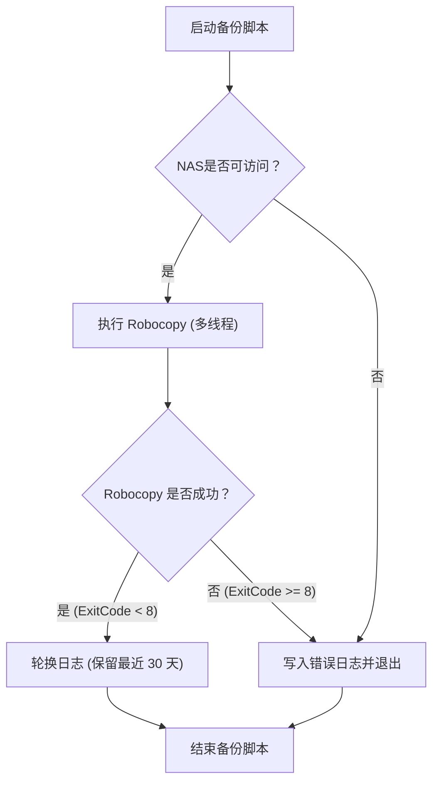
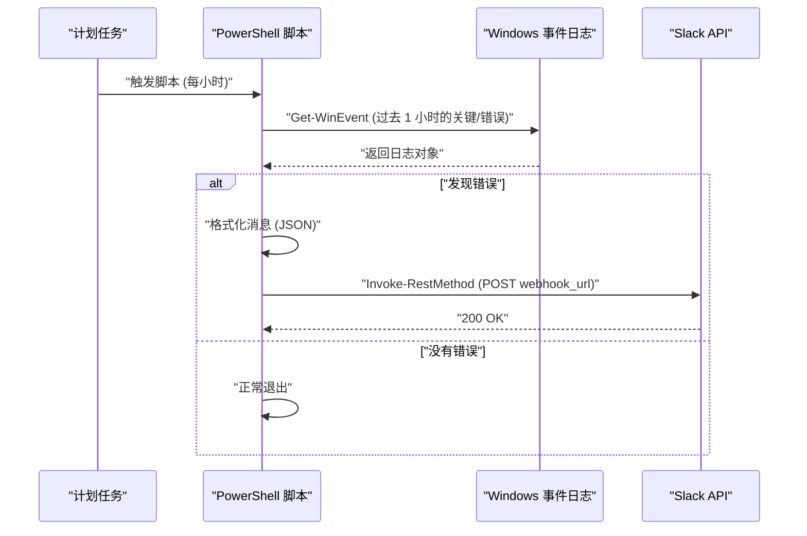

## 引言：为什么要使用PowerShell进行业务自动化

在现代IT基础设施和开发环境中，对于使用Windows OS作为平台的系统用户来说，“日常例行任务”是一个不可避免的课题。手动进行文件备份、系统日志监控、开发资源（Git仓库）更新和构建等操作，容易成为人为失误的温床，并导致宝贵时间的浪费。

过去常常使用批处理文件（`.bat`或`.cmd`）或VBScript，而在当今，最佳的解决方案毫无疑问是 **PowerShell**。PowerShell不仅仅是一个基于文本的shell，它是构建在.NET Framework（以及.NET Core）强大的面向对象基础之上的。由于通过管道传递的数据是“对象”而不是“字符串”，因此无需自己实现复杂的文本解析（如grep、awk、sed等处理），只需指定属性即可轻松访问数据。

本文将介绍3个直接应用于实际业务的PowerShell完全自动化脚本实例（NAS备份与日志轮换、事件日志监控与Slack通知、多个Git仓库的批量更新与构建）。此外，在此之前，我们还将深入探讨必要的PowerShell执行策略、模块化、以及任务计划程序集成等基础技术。

---

## 建立PowerShell自动化的基础

为了让自动化脚本在生产环境中安全可靠地运行，需要进行一些准备工作。在这里，我们将详细说明对执行策略的理解、提高可重用性的模块化、以及健壮的错误处理。

### 1. PowerShell的执行策略（Execution Policy）

在Windows中，默认状态下为了防止意外执行恶意脚本，设置了“执行策略”，在初始状态（`Restricted`）下无法执行任何脚本（`.ps1`文件）。为了进行自动化，必须将其修改为合适的级别。

执行策略包含以下几种：

- **Restricted**: 不允许执行脚本。（默认）
- **AllSigned**: 仅允许执行由受信任的发布者签名的脚本。
- **RemoteSigned**: 可以在本地直接执行本地创建的脚本，但从互联网下载的脚本需要签名。
- **Unrestricted**: 可以执行所有脚本，但在执行从互联网下载的脚本时会显示警告。
- **Bypass**: 没有任何阻止，也不显示警告。常用于临时脚本执行（如CI/CD流水线）。

在企业本地环境中通过任务计划程序等运行自制脚本时，最实用且最安全的设置是 `RemoteSigned`。以管理员权限启动PowerShell，然后执行以下命令。

```powershell
Set-ExecutionPolicy RemoteSigned -Scope LocalMachine -Force
```

这样一来，本地创建的备份脚本等就可以在不被阻止的情况下运行了。

### 2. 通过模块化实现代码复用（.psm1 / .psd1）

在进行复杂的自动化处理时，从可维护性的角度来看，不建议将所有处理都写在一个巨大的 `.ps1` 文件中。常用的函数（例如日志输出、发送Slack Webhook、错误处理等）应拆分为“模块”。

PowerShell模块主要由脚本模块文件（`.psm1`）和模块清单（`.psd1`）组成。

**CommonUtils.psm1** 的示例：
```powershell
function Write-CustomLog {
    [CmdletBinding()]
    param (
        [Parameter(Mandatory=$true)]
        [string]$Message,
        
        [ValidateSet('INFO', 'WARNING', 'ERROR')]
        [string]$Level = 'INFO'
    )
    
    $timestamp = Get-Date -Format "yyyy-MM-dd HH:mm:ss"
    $logLine = "[$timestamp] [$Level] $Message"
    
    # 同时在屏幕输出并写入文件
    Write-Host $logLine
    Add-Content -Path "C:\logs\automation.log" -Value $logLine
}

Export-ModuleMember -Function Write-CustomLog
```

要在其他脚本中调用此模块，请在脚本开头使用 `Import-Module`。

```powershell
Import-Module "C:\Scripts\Modules\CommonUtils.psm1"
Write-CustomLog -Message "开始备份处理。" -Level 'INFO'
```

### 3. 健壮的错误处理（try / catch）

在自动化中最重要的是“发生失败时如何表现”。在PowerShell中，通过设置内置变量 `$ErrorActionPreference`，可以控制命令失败时的默认行为。默认值为 `Continue`（显示错误并继续处理），但在自动化脚本中，最佳实践是将其设置为 `Stop`，并在 `try / catch` 块中显式捕获异常。

```powershell
$ErrorActionPreference = 'Stop'

try {
    # 可能失败的处理
    $content = Get-Content -Path "C:\NonExistentFile.txt"
} catch [System.Management.Automation.ItemNotFoundException] {
    # 捕获特定错误
    Write-Host "找不到文件: $($_.Exception.Message)" -ForegroundColor Red
} catch {
    # 捕获其他所有错误
    Write-Host "发生意外错误: $($_.Exception.Message)" -ForegroundColor Red
} finally {
    # 无论成功还是失败，都必定执行的清理处理
    Write-Host "处理结束。"
}
```

利用这一基础，即使在夜间无人值守的情况下，也能构建出安全且可追踪的脚本。

---

## 与任务计划程序的集成（Register-ScheduledTask）

脚本完成后，接下来需要一种机制来定期执行该脚本。在Windows中，最可靠的机制是“任务计划程序”。虽然可以通过图形界面（`taskschd.msc`）进行设置，但从将基础设施指南作为代码（Infrastructure as Code）的角度来看，我们将讲解使用PowerShell cmdlet来注册任务的方法。

PowerShell提供了 `ScheduledTasks` 模块，使用它可以详细定义触发器（何时执行）、操作（执行什么）以及主体（以哪个用户权限执行）。

```powershell
# 1. 定义操作（隐藏运行PowerShell，并传递指定脚本）
$action = New-ScheduledTaskAction -Execute "powershell.exe" -Argument "-NoProfile -WindowStyle Hidden -ExecutionPolicy Bypass -File C:\Scripts\DailyTasks.ps1"

# 2. 定义触发器（每天凌晨 3:00 执行）
$trigger = New-ScheduledTaskTrigger -Daily -At "3:00AM"

# 3. 定义主体（执行用户权限）（以SYSTEM权限执行）
$principal = New-ScheduledTaskPrincipal -UserId "NT AUTHORITY\SYSTEM" -LogonType ServiceAccount -RunLevel Highest

# 4. 构建任务设置
$settings = New-ScheduledTaskSettingsSet -AllowStartIfOnBatteries -DontStopIfGoingOnBatteries -StartWhenAvailable -DontStopOnIdleEnd

# 5. 注册任务
$taskName = "MyDailyAutomationTask"
Register-ScheduledTask -TaskName $taskName -Action $action -Trigger $trigger -Principal $principal -Settings $settings -Description "自动执行每日例行业务的任务" -Force
```

只需执行该脚本，即可在任务计划程序中注册作业，使其在每天的指定时间以 SYSTEM 权限（在后台不显示界面的最高权限）运行。

---

## 实践例1：备份到外部NAS与日志轮换

每日业务数据的备份是必不可少的，但手动复制是不可取的。在这里，我们将创建一个脚本，从PowerShell调用Windows标准的最强复制命令 `Robocopy`，输出执行结果的日志，并自动删除（轮换）旧日志。

### 网络传输执行时间的理论值（Math）

在设计备份脚本时，估算处理完成所需的时间对于运维非常重要。通过网络备份到NAS时的预计所需时间 $T_{backup}$ 可以用以下公式近似：

$$ T_{backup} = \frac{S_{total}}{B \times (1 - \alpha)} + C \times L $$

其中，各个变量如下：
- $S_{total}$ : 备份对象的总数据量 (Bit)
- $B$ : 网络带宽 (bps, 例: 1Gbps = $10^9$ bps)
- $\alpha$ : 网络或协议的开销 (通常在 TCP/IP 或 SMB 协议中为 0.1 ～ 0.2)
- $C$ : 文件总数
- $L$ : 单个文件的处理延迟 (秒)

特别是在备份大量小文件（如源代码）时，由于文件数 $C$ 导致的延迟项 ($C \times L$) 将占据主导地位。因此，在备份处理中，最佳选择不是简单的文件复制工具，而是能够进行多线程传输的 `Robocopy`。

### 备份脚本的处理流程



### PowerShell脚本的实现示例 (`Backup-ToNas.ps1`)

```powershell
$ErrorActionPreference = 'Stop'

# 设置值
$SourceDir = "C:\WorkData"
$TargetNasDir = "\\NAS01\Backup\WorkData"
$LogDir = "C:\Scripts\Logs"
$DateStr = Get-Date -Format "yyyyMMdd"
$LogFile = Join-Path $LogDir "Backup_$DateStr.log"
$RetainDays = 30

try {
    # 1. 预先检查：是否可以访问NAS
    if (-not (Test-Path $TargetNasDir)) {
        throw "无法访问NAS目标路径: $TargetNasDir"
    }

    Write-Host "开始备份: $SourceDir -> $TargetNasDir"

    # 2. 执行 Robocopy
    # /MIR : 镜像（删除源目录中没有的文件）
    # /MT:16 : 使用16个线程进行多线程复制
    # /NP : 不输出进度（%）（为了防止日志杂乱）
    # /R:2 /W:2 : 发生错误时重试2次，每次等待2秒
    $roboArgs = @(
        $SourceDir,
        $TargetNasDir,
        "/MIR",
        "/MT:16",
        "/NP",
        "/R:2",
        "/W:2",
        "/LOG+:$LogFile"
    )

    # 从PowerShell调用外部命令时，使用 Start-Process 最为稳妥
    $process = Start-Process -FilePath "robocopy.exe" -ArgumentList $roboArgs -Wait -NoNewWindow -PassThru
    $exitCode = $process.ExitCode

    # Robocopy 的退出代码规范: 0-7 为成功或符合规范的行为。8及以上为错误
    if ($exitCode -ge 8) {
        throw "Robocopy 异常退出。ExitCode: $exitCode"
    }

    Write-Host "备份成功完成。ExitCode: $exitCode"

    # 3. 日志轮换
    Write-Host "正在删除旧日志文件（保存期限: ${RetainDays}天）"
    $limitDate = (Get-Date).AddDays(-$RetainDays)
    Get-ChildItem -Path $LogDir -Filter "Backup_*.log" | 
        Where-Object { $_.LastWriteTime -lt $limitDate } | 
        Remove-Item -Force

    Write-Host "日志清理完成。"

} catch {
    $errorMessage = "备份处理过程中发生错误: $($_.Exception.Message)"
    Write-Error $errorMessage
    # 写入实际的错误日志文件中
    Add-Content -Path (Join-Path $LogDir "Error.log") -Value "[(Get-Date -Format 'yyyy-MM-dd HH:mm:ss')] $errorMessage"
    # 以非零状态退出，以便通知任务计划程序发生错误
    exit 1
}
```

将该脚本与任务计划程序结合使用，可实现每日的完全自动备份。特别是对 `Robocopy` 的退出代码处理非常重要。即使在成功的情况下，如果“复制了新文件”，Robocopy也会返回 1；如果“删除了多余文件”，它会返回 2 等，因此需要注意不能简单地使用 `$LASTEXITCODE -eq 0` 来进行判断，否则无法正常运行。

---

## 实践例2：系统事件日志监控与Slack通知（Webhook）

在Windows服务器和创作者工作站中，尽早检测到可能导致蓝屏（BSoD）预兆的磁盘错误，或应用程序崩溃（Application Error）是非常重要的。
在此，我们将创建一个脚本，从过去1小时的 `System` 和 `Application` 事件日志中提取“错误”和“关键”级别的日志，如果找到，则向Slack发送通知。

### 通知处理的序列图



### PowerShell脚本的实现示例 (`Monitor-EventLog.ps1`)

```powershell
$ErrorActionPreference = 'Stop'

# Slack Webhook URL (需事先在 Slack 的 Incoming Webhooks 集成中获取)
$SlackWebhookUrl = "https://hooks.slack.com/services/TXXXXX/BXXXXX/XXXXXXXXXXXXX"

# 搜索的时间范围（过去 1 小时）
$startTime = (Get-Date).AddHours(-1)

# 使用 XPath 过滤器快速搜索事件日志
# 级别 1: 关键(Critical), 2: 错误(Error)
$xmlFilter = @"
<QueryList>
  <Query Id="0" Path="System">
    <Select Path="System">*[System[(Level=1 or Level=2) and TimeCreated[@SystemTime&gt;='$($startTime.ToUniversalTime().ToString("o"))']]]</Select>
  </Query>
  <Query Id="1" Path="Application">
    <Select Path="Application">*[System[(Level=1 or Level=2) and TimeCreated[@SystemTime&gt;='$($startTime.ToUniversalTime().ToString("o"))']]]</Select>
  </Query>
</QueryList>
"@

try {
    # 使用 Get-WinEvent 获取日志
    # -ErrorAction SilentlyContinue 是为了忽略找不到日志时的错误
    $events = Get-WinEvent -FilterXml $xmlFilter -ErrorAction SilentlyContinue

    if ($events -and $events.Count -gt 0) {
        $eventCount = $events.Count
        Write-Host "过去 1 小时内发现了 $eventCount 条错误/关键日志。"

        # 组合通知文本
        $messageBody = "*Windows 系统警报* :rotating_light:`n"
        $messageBody += "过去 1 小时内检测到 $eventCount 个错误。`n`n"

        # 仅包含最新 3 条的详细信息（考虑到字符限制等）
        $events | Select-Object -First 3 | ForEach-Object {
            $messageBody += "*$($_.LogName)* - $($_.ProviderName) (EventID: $($_.Id))`n"
            $messageBody += "> $($_.Message -replace '`n', ' ')`n`n"
        }

        if ($eventCount -gt 3) {
            $messageBody += "※还有其他 $($eventCount - 3) 个错误。请检查事件查看器。"
        }

        # 创建 POST 到 Slack 的 JSON 有效负载
        $payload = @{
            text = $messageBody
            username = "SystemMonitor"
            icon_emoji = ":desktop_computer:"
        }
        $jsonPayload = $payload | ConvertTo-Json -Depth 3

        # 调用 REST API 发送到 Slack
        Invoke-RestMethod -Uri $SlackWebhookUrl -Method Post -Body $jsonPayload -ContentType "application/json; charset=utf-8"
        
        Write-Host "Slack 通知已完成。"
    } else {
        Write-Host "未发现错误/关键日志。系统运行正常。"
    }
} catch {
    Write-Error "事件日志监控脚本中发生错误: $($_.Exception.Message)"
    exit 1
}
```

该脚本的技术要点是使用了 `Get-WinEvent -FilterXml`。传统的 `Get-EventLog` cmdlet 或通过管道使用 `Where-Object` 进行过滤，需要将所有事件对象加载到内存后再处理，这会导致执行非常缓慢。而使用 XML 过滤器，由于过滤操作在 Windows 事件日志服务端进行，可以预期性能将大幅提升，执行时间通常保持在几秒钟以内。

---

## 实践例3：批量更新多个Git仓库及自动构建

对于开发人员来说，每天早晨第一件事就是将工作电脑里的多个 Git 仓库（前端、后端、基础设施仓库等）同步到最新的 `main` 分支，并在需要时进行包安装（如 `npm install` 等）或构建操作，这是一项非常繁琐的工作。
我们将创建一个 PowerShell 脚本工具来一次性自动完成这些工作。

该脚本会自动检测特定父目录下的所有 Git 仓库，如果没有未提交的更改，则执行 `git pull`。此外，如果拉取到了新的更改，它将自动触发构建命令。

### 多仓库自动更新脚本 (`Update-GitRepos.ps1`)

```powershell
$ErrorActionPreference = 'Stop'

# 仓库所在的父目录列表
$TargetDirectories = @(
    "C:\Dev\FrontendProjects",
    "C:\Dev\BackendProjects"
)

# 遍历各个目录
foreach ($parentDir in $TargetDirectories) {
    if (-not (Test-Path $parentDir)) {
        Write-Warning "未找到目录: $parentDir"
        continue
    }

    # 获取子目录列表
    $subDirs = Get-ChildItem -Path $parentDir -Directory
    
    foreach ($repoDir in $subDirs) {
        $repoPath = $repoDir.FullName
        $gitDir = Join-Path $repoPath ".git"

        # 检查是否存在 .git 文件夹（以确认是否为 Git 仓库）
        if (Test-Path $gitDir) {
            Write-Host "---------------------------------"
            Write-Host "正在处理仓库: $repoPath" -ForegroundColor Cyan
            
            # 更改 PowerShell 的当前工作目录
            Set-Location -Path $repoPath

            try {
                # 检查是否有未提交的更改
                $status = git status --porcelain
                if ($status) {
                    Write-Host "存在未提交的更改，跳过。" -ForegroundColor Yellow
                    continue
                }

                # 获取当前分支
                $branch = git rev-parse --abbrev-ref HEAD
                if ($branch -ne "main" -and $branch -ne "master") {
                    Write-Host "当前分支为 $branch，跳过 (仅限 main/master)。" -ForegroundColor Yellow
                    continue
                }

                # 执行 Pull，并将结果存入变量
                Write-Host "正在从远程获取最新更改 (git pull)..."
                $pullResult = git pull origin $branch 2>&1
                
                # 输出到控制台
                $pullResult | ForEach-Object { Write-Host "  $_" }

                # 如果不包含 "Already up to date." 字符串，则认为有更新
                $isUpdated = $false
                foreach ($line in $pullResult) {
                    if ($line -notmatch "Already up to date") {
                        $isUpdated = $true
                        break
                    }
                }

                if ($isUpdated) {
                    Write-Host "仓库已更新。开始构建任务..." -ForegroundColor Green
                    
                    # 如果存在 package.json，则执行 npm install 和 npm run build
                    if (Test-Path "package.json") {
                        Write-Host "正在执行 npm install..."
                        npm install
                        Write-Host "正在执行 npm run build..."
                        npm run build
                    }
                    
                    # 如果存在 .sln (Visual Studio 解决方案)，则执行 msbuild 或 dotnet build
                    $slnFiles = Get-ChildItem -Filter "*.sln"
                    if ($slnFiles.Count -gt 0) {
                        Write-Host "正在构建 .NET 应用程序..."
                        dotnet build $slnFiles[0].FullName
                    }
                }

            } catch {
                Write-Error "在处理仓库 $repoPath 时发生错误: $($_.Exception.Message)"
            }
        }
    }
}

Write-Host "---------------------------------"
Write-Host "所有仓库的更新处理已完成。" -ForegroundColor Green
```

该脚本被设计为通过 `try / catch` 和 `foreach` 循环，即使发生错误也能继续处理下一个仓库，而不受影响。另外，它使用针对脚本处理而设的 `git status --porcelain` 选项，能够可靠地判断工作树的整洁程度。只要将该脚本放在启动文件夹中，或者注册到用户登录时的任务计划程序里，你只需开启电脑去泡杯咖啡，所有的开发环境便会在此时自动更新到最新状态。

---

## 运维注意事项与高级技巧

长期运行基于 PowerShell 的自动化脚本时，有一些值得注意的最佳实践。

### 1. 凭据的安全管理
在脚本中以纯文本形式硬编码密码或 API 密钥（如 Slack Webhook URL、数据库连接字符串），是极其重大的安全风险。PowerShell 提供了诸如 `Export-Clixml` 和 `ConvertFrom-SecureString` 的功能，用于加密保存凭据。

```powershell
# 仅需首次手动执行（将弹出密码输入对话框）
# Get-Credential | Export-Clixml -Path "C:\Scripts\Creds\admin.xml"

# 在自动化脚本中读取
$cred = Import-Clixml -Path "C:\Scripts\Creds\admin.xml"
# 使用 $cred 进行远程服务器连接等
```

这样就可以确保经过加密的安全凭据信息，仅供执行该脚本的用户配置文件解密使用。

### 2. 通过记录（Transcript）保存完整执行日志
在前面的例子中，使用了 `Add-Content` 等逐条输出日志。实际上，PowerShell 具有 Transcript（脚本内容转录）功能，可以自动把输出到屏幕上的所有信息（包括错误信息及标准输出）全部写入文件。

只需在脚本的开头和末尾写下以下代码，便可创建稳固的审计日志。

```powershell
Start-Transcript -Path "C:\Scripts\Logs\Execution_$(Get-Date -Format 'yyyyMMdd_HHmmss').log" -Append

# （此处为主体脚本的处理过程）

Stop-Transcript
```

### 3. 监控的数学方法与异常检测 (Math)

在大规模的自动化中，不仅仅是捕捉错误，运用统计学方法来检测“异于平常”的情况也十分有效。例如，如果每日的备份时间与平时的平均值出现极大偏差，有可能是网络异常或磁盘故障的前兆。

设每日备份时间为 $x_1, x_2, \dots, x_n$，样本均值 $\mu$ 与标准差 $\sigma$ 如下所示：

$$ \mu = \frac{1}{n} \sum_{i=1}^n x_i $$
$$ \sigma = \sqrt{ \frac{1}{n-1} \sum_{i=1}^n (x_i - \mu)^2 } $$

如果当天的执行时间 $x_{today}$ 超过了 $\mu + 3\sigma$（三西格玛法则），系统即可认定“发生了统计学上的异常”，并触发发送警报通知的逻辑。借助 PowerShell 的 `Measure-Object` cmdlet，这类统计处理也仅需寥寥几行代码即可实现。

## 总结

本文结合实例，介绍了在 Windows 环境下利用 PowerShell 完全自动化日常例行业务的方法。
从执行策略的管理和利用模块化打好基础开始，展示了能立即运用于实际工作中的脚本，包括备份和日志轮换、事件日志监控及 Slack 通知、以及多个 Git 仓库的自动构建。

PowerShell 虽然是命令行工具，但它是一台可以访问 .NET 几乎所有功能的强大自动化引擎，内容极其深奥。请以本次介绍的脚本为基础，结合您自身的业务环境，定制路径和处理逻辑，从繁琐的手动作业中解脱出来，腾出更多时间用于创造性的工作吧。

自动化的成功在于“从微小脚本起步，逐步完善错误处理和日志输出，以提高健壮性”。不妨先试着从备份自己电脑上的一个文件夹开始，踏上您的 PowerShell 自动化之旅吧。
