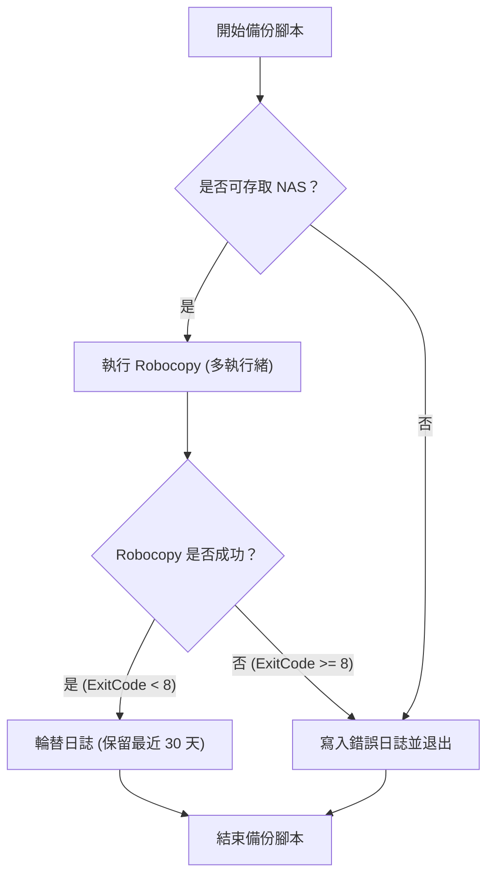
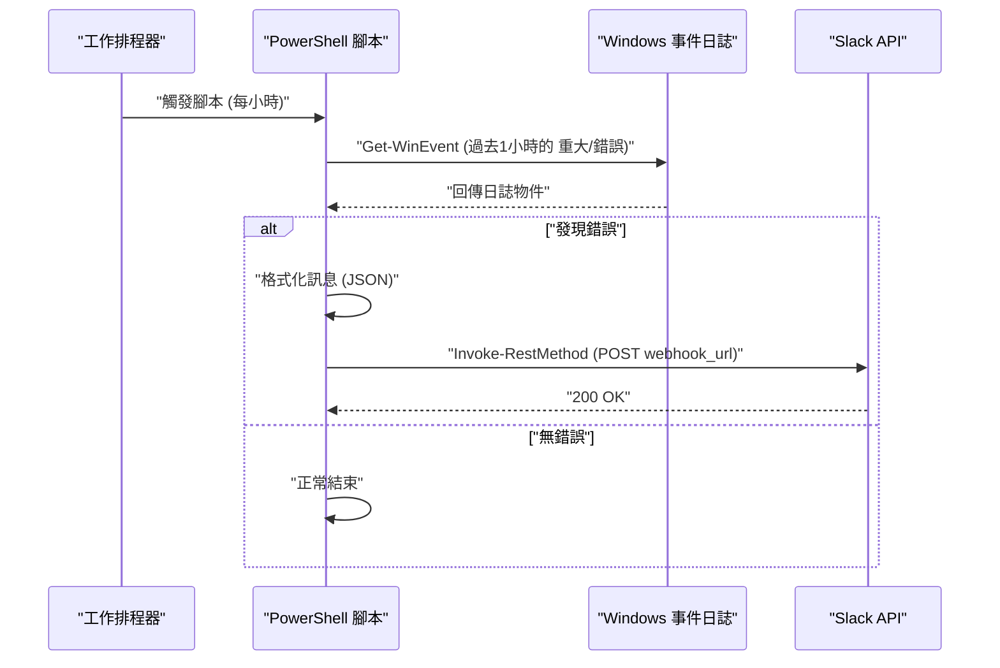

## 前言：為什麼要使用 PowerShell 自動化工作？

在現代的 IT 基礎設施與開發環境中，對於使用 Windows OS 作為平台的用戶來說，「日常的例行工作」是無法避免的課題。諸如檔案備份、系統日誌監控、開發資源（Git 儲存庫）的更新與建置等，如果以手動方式進行，不僅容易成為人為失誤的溫床，更會導致寶貴時間的浪費。

過去人們經常使用批次檔（`.bat` 或 `.cmd`）或 VBScript，但在現今，最佳的解決方案毫無疑問是 **PowerShell**。PowerShell 不僅僅是個以文字為基礎的 shell，它更是建構於 .NET Framework（以及 .NET Core）強大的物件導向基礎之上。透過管線（Pipeline）傳遞的資料並非「字串」，而是「物件」，因此我們不需要自行實作複雜的文字解析（例如 grep、awk、sed 等處理），只需指定屬性就能輕鬆存取資料。

本文將介紹 3 個與實務直接相關、使用 PowerShell 撰寫的完全自動化腳本實例（備份至 NAS 與日誌輪替、事件日誌監控與 Slack 通知、多個 Git 儲存庫的批次更新與建置）。此外，在介紹這些實例之前，也會針對必要的基礎技術，如 PowerShell 的執行原則、模組化、與工作排程器的整合等，進行深入探討與解說。

---

## 建立 PowerShell 自動化的基礎

為了讓自動化腳本能在正式環境中安全且穩定地運作，我們需要做一些事前準備。這裡將詳細說明對執行原則的理解、提高可重複使用性的模組化，以及穩健的錯誤處理（Error Handling）。

### 1. PowerShell 的執行原則（Execution Policy）

在 Windows 中，為了防止惡意腳本被意外執行，系統預設設定了「執行原則」，在初始狀態下（`Restricted`）是無法執行任何腳本（`.ps1` 檔案）的。為了進行自動化，我們需要將其更改為適當的級別。

執行原則包含以下幾種類型：

- **Restricted**: 不允許執行腳本。（預設值）
- **AllSigned**: 僅允許執行由受信任發行者簽署的腳本。
- **RemoteSigned**: 在本機建立的腳本可直接執行，但從網際網路下載的腳本則需要簽章。
- **Unrestricted**: 可以執行所有腳本，但在執行從網際網路下載的腳本時，系統會顯示警告。
- **Bypass**: 不會封鎖任何項目，也不會顯示警告。通常用於暫時性的腳本執行（例如 CI/CD 管線）。

在企業的本機環境中，如果要在工作排程器等工具中執行自製腳本，最務實且安全的設定是 `RemoteSigned`。請以系統管理員權限啟動 PowerShell，並執行以下指令。

```powershell
Set-ExecutionPolicy RemoteSigned -Scope LocalMachine -Force
```

設定完成後，您在本機建立的備份腳本等將不會被封鎖，並能順利運作。

### 2. 透過模組化實作程式碼重複使用（.psm1 / .psd1）

在進行複雜的自動化處理時，從維護性的角度來看，不建議將所有的處理都寫在一個巨大的 `.ps1` 檔案中。對於常用的函式（例如日誌輸出、傳送 Webhook 至 Slack、錯誤處理等），應該將其分割成「模組」。

PowerShell 模組主要由腳本模組檔（`.psm1`）與模組資訊清單（`.psd1`）組成。

**CommonUtils.psm1** 的範例：
```powershell
function Write-CustomLog {
    [CmdletBinding()]
    param (
        [Parameter(Mandatory=$true)]
        [string]$Message,
        
        [ValidateSet('INFO', 'WARNING', 'ERROR')]
        [string]$Level = 'INFO'
    )
    
    $timestamp = Get-Date -Format "yyyy-MM-dd HH:mm:ss"
    $logLine = "[$timestamp] [$Level] $Message"
    
    # 同時執行畫面輸出與檔案輸出
    Write-Host $logLine
    Add-Content -Path "C:\logs\automation.log" -Value $logLine
}

Export-ModuleMember -Function Write-CustomLog
```

若要在其他腳本中呼叫此模組，請在腳本的開頭使用 `Import-Module`。

```powershell
Import-Module "C:\Scripts\Modules\CommonUtils.psm1"
Write-CustomLog -Message "開始備份處理。" -Level 'INFO'
```

### 3. 穩健的錯誤處理（try / catch）

在自動化過程中，最重要的是「失敗時該如何應對」。在 PowerShell 中，透過設定 `$ErrorActionPreference` 這個內建變數，我們可以控制指令失敗時的預設行為。雖然預設值為 `Continue`（顯示錯誤並繼續處理），但在自動化腳本中，最佳實踐是將其設定為 `Stop`，並使用 `try / catch` 區塊明確地捕捉例外狀況。

```powershell
$ErrorActionPreference = 'Stop'

try {
    # 可能會失敗的處理
    $content = Get-Content -Path "C:\NonExistentFile.txt"
} catch [System.Management.Automation.ItemNotFoundException] {
    # 捕捉特定的錯誤
    Write-Host "找不到檔案: $($_.Exception.Message)" -ForegroundColor Red
} catch {
    # 捕捉除此之外的所有錯誤
    Write-Host "發生未預期的錯誤: $($_.Exception.Message)" -ForegroundColor Red
} finally {
    # 不論成功或失敗，必定會執行的清理處理
    Write-Host "結束處理。"
}
```

透過活用這個基礎，即使是在夜間無人值守的情況下運作，也能建立出安全且可追蹤的腳本。

---

## 與工作排程器整合（Register-ScheduledTask）

腳本完成後，接下來就需要一個能定期執行該腳本的機制。在 Windows 中，最可靠的就是「工作排程器」。雖然也可以透過 GUI（`taskschd.msc`）進行設定，但從基礎設施即程式碼（Infrastructure as Code）的觀點出發，我們將解說如何使用 PowerShell Cmdlet 來註冊工作。

PowerShell 提供了 `ScheduledTasks` 模組，透過使用它，我們可以詳細定義觸發程序（何時執行）、動作（執行什麼）以及主體（以哪個使用者權限執行）。

```powershell
# 1. 動作定義（以隱藏方式執行 PowerShell，並傳入指定的腳本）
$action = New-ScheduledTaskAction -Execute "powershell.exe" -Argument "-NoProfile -WindowStyle Hidden -ExecutionPolicy Bypass -File C:\Scripts\DailyTasks.ps1"

# 2. 觸發程序定義（每天上午 3:00 執行）
$trigger = New-ScheduledTaskTrigger -Daily -At "3:00AM"

# 3. 主體（執行使用者權限）定義（以 SYSTEM 權限執行）
$principal = New-ScheduledTaskPrincipal -UserId "NT AUTHORITY\SYSTEM" -LogonType ServiceAccount -RunLevel Highest

# 4. 建立工作設定
$settings = New-ScheduledTaskSettingsSet -AllowStartIfOnBatteries -DontStopIfGoingOnBatteries -StartWhenAvailable -DontStopOnIdleEnd

# 5. 註冊工作
$taskName = "MyDailyAutomationTask"
Register-ScheduledTask -TaskName $taskName -Action $action -Trigger $trigger -Principal $principal -Settings $settings -Description "自動執行每日例行工作的工作" -Force
```

只需執行這段腳本，工作就會註冊到工作排程器中，每天在指定時間，系統將以 SYSTEM 權限（在背景不顯示畫面且具有最高權限）自動執行該腳本。

---

## 實踐例 1：備份至外部 NAS 與日誌輪替

每日業務資料的備份是不可或缺的，但手動複製絕對不在考慮之列。在這裡，我們將編寫一個腳本，透過 PowerShell 呼叫 Windows 內建最強的複製指令 `Robocopy`，不僅輸出執行結果的日誌，還能自動刪除（輪替）舊的日誌檔。

### 網路傳輸執行時間的理論值（Math）

在設計備份腳本時，估算處理完成所需的時間在營運上非常重要。透過網路備份至 NAS 時的預估所需時間 $T_{backup}$，可透過以下公式近似計算：

$$ T_{backup} = \frac{S_{total}}{B \times (1 - \alpha)} + C \times L $$

其中，各變數的意義如下：
- $S_{total}$ : 備份目標的總資料量 (Bit)
- $B$ : 網路頻寬 (bps，例：1Gbps = $10^9$ bps)
- $\alpha$ : 網路或通訊協定的額外負載（通常 TCP/IP 或 SMB 通訊協定為 0.1 ～ 0.2）
- $C$ : 檔案總數
- $L$ : 每個檔案的處理延遲 (秒)

特別是在備份大量小檔案（如原始碼）時，由檔案數量 $C$ 引起的延遲項 ($C \times L$) 將成為主導因素。因此，在備份處理中，不應使用單純的檔案複製工具，而是應該利用支援多執行緒傳輸的 `Robocopy` 才是最佳選擇。

### 備份腳本的處理流程



### PowerShell 腳本實作範例 (`Backup-ToNas.ps1`)

```powershell
$ErrorActionPreference = 'Stop'

# 設定值
$SourceDir = "C:\WorkData"
$TargetNasDir = "\\NAS01\Backup\WorkData"
$LogDir = "C:\Scripts\Logs"
$DateStr = Get-Date -Format "yyyyMMdd"
$LogFile = Join-Path $LogDir "Backup_$DateStr.log"
$RetainDays = 30

try {
    # 1. 事前檢查：是否能存取 NAS
    if (-not (Test-Path $TargetNasDir)) {
        throw "無法存取 NAS 的目標路徑: $TargetNasDir"
    }

    Write-Host "開始備份: $SourceDir -> $TargetNasDir"

    # 2. 執行 Robocopy
    # /MIR : 鏡像（刪除來源端沒有的檔案）
    # /MT:16 : 以 16 個執行緒進行多執行緒複製
    # /NP : 不輸出進度（%）（為了避免日誌變得凌亂）
    # /R:2 /W:2 : 發生錯誤時重試 2 次，等待 2 秒
    $roboArgs = @(
        $SourceDir,
        $TargetNasDir,
        "/MIR",
        "/MT:16",
        "/NP",
        "/R:2",
        "/W:2",
        "/LOG+:$LogFile"
    )

    # 透過 PowerShell 呼叫外部指令時，使用 Start-Process 是最可靠的
    $process = Start-Process -FilePath "robocopy.exe" -ArgumentList $roboArgs -Wait -NoNewWindow -PassThru
    $exitCode = $process.ExitCode

    # Robocopy 的結束代碼規格: 0-7 為成功或符合規格的行為。8 以上為錯誤
    if ($exitCode -ge 8) {
        throw "Robocopy 因錯誤而結束。ExitCode: $exitCode"
    }

    Write-Host "備份順利完成。ExitCode: $exitCode"

    # 3. 日誌輪替
    Write-Host "正在刪除舊的日誌檔（保留期間: ${RetainDays}天）"
    $limitDate = (Get-Date).AddDays(-$RetainDays)
    Get-ChildItem -Path $LogDir -Filter "Backup_*.log" | 
        Where-Object { $_.LastWriteTime -lt $limitDate } | 
        Remove-Item -Force

    Write-Host "日誌清理完成。"

} catch {
    $errorMessage = "備份處理期間發生錯誤: $($_.Exception.Message)"
    Write-Error $errorMessage
    # 寫入實際的錯誤日誌檔
    Add-Content -Path (Join-Path $LogDir "Error.log") -Value "[(Get-Date -Format 'yyyy-MM-dd HH:mm:ss')] $errorMessage"
    # 為了向工作排程器通知錯誤，以非零值結束
    exit 1
}
```

這個腳本透過與工作排程器結合，實現了每天的完全自動備份。特別要注意的是 `Robocopy` 的結束代碼處理非常重要。因為即使 Robocopy 執行成功，在「複製了新檔案」時會回傳 1，「刪除了多餘檔案」時會回傳 2，所以如果僅使用 `$LASTEXITCODE -eq 0` 來判斷，將無法正確運作。

---

## 實踐例 2：系統事件日誌監控與 Slack 通知（Webhook）

在 Windows 伺服器或創作者用的工作站中，及早發現可能導致藍白畫面（BSoD）的磁碟錯誤或應用程式崩潰（Application Error）是非常重要的。
在這裡，我們將編寫一個腳本，從過去 1 小時的 `System` 和 `Application` 事件日誌中，擷取出「錯誤」和「重大」級別的日誌，並在發現時發送通知至 Slack。

### 通知處理的循序圖



### PowerShell 腳本實作範例 (`Monitor-EventLog.ps1`)

```powershell
$ErrorActionPreference = 'Stop'

# Slack Webhook URL (需事先在 Slack 的 Incoming Webhooks 整合中取得)
$SlackWebhookUrl = "https://hooks.slack.com/services/TXXXXX/BXXXXX/XXXXXXXXXXXXX"

# 搜尋目標的時間範圍（過去 1 小時）
$startTime = (Get-Date).AddHours(-1)

# 使用 XPath 過濾器進行高速事件日誌搜尋
# 級別 1: 重大(Critical), 2: 錯誤(Error)
$xmlFilter = @"
<QueryList>
  <Query Id="0" Path="System">
    <Select Path="System">*[System[(Level=1 or Level=2) and TimeCreated[@SystemTime&gt;='$($startTime.ToUniversalTime().ToString("o"))']]]</Select>
  </Query>
  <Query Id="1" Path="Application">
    <Select Path="Application">*[System[(Level=1 or Level=2) and TimeCreated[@SystemTime&gt;='$($startTime.ToUniversalTime().ToString("o"))']]]</Select>
  </Query>
</QueryList>
"@

try {
    # 使用 Get-WinEvent 取得日誌
    # -ErrorAction SilentlyContinue 是為了忽略找不到日誌時的錯誤
    $events = Get-WinEvent -FilterXml $xmlFilter -ErrorAction SilentlyContinue

    if ($events -and $events.Count -gt 0) {
        $eventCount = $events.Count
        Write-Host "過去 1 小時內發現了 $eventCount 筆錯誤/重大日誌。"

        # 組合通知用的文字
        $messageBody = "*Windows 系統警報* :rotating_light:`n"
        $messageBody += "過去 1 小時內偵測到 $eventCount 筆錯誤。`n`n"

        # 僅附上最新 3 筆的詳細資訊（考量到字數限制等）
        $events | Select-Object -First 3 | ForEach-Object {
            $messageBody += "*$($_.LogName)* - $($_.ProviderName) (EventID: $($_.Id))`n"
            $messageBody += "> $($_.Message -replace '`n', ' ')`n`n"
        }

        if ($eventCount -gt 3) {
            $messageBody += "※還有其他 $($eventCount - 3) 筆錯誤。請查看事件檢視器。"
        }

        # 建立要 POST 至 Slack 的 JSON 負載資料 (Payload)
        $payload = @{
            text = $messageBody
            username = "SystemMonitor"
            icon_emoji = ":desktop_computer:"
        }
        $jsonPayload = $payload | ConvertTo-Json -Depth 3

        # 呼叫 REST API 傳送至 Slack
        Invoke-RestMethod -Uri $SlackWebhookUrl -Method Post -Body $jsonPayload -ContentType "application/json; charset=utf-8"
        
        Write-Host "已完成 Slack 通知。"
    } else {
        Write-Host "未發現錯誤/重大日誌。系統運作正常。"
    }
} catch {
    Write-Error "事件日誌監控腳本發生錯誤: $($_.Exception.Message)"
    exit 1
}
```

這個腳本在技術上的重點在於使用了 `Get-WinEvent -FilterXml`。傳統的 `Get-EventLog` Cmdlet 或透過管線使用 `Where-Object` 進行過濾的方式，會將所有的事件物件載入記憶體後再進行處理，因此處理過程會變得非常繁重。透過使用 XML 過濾器，過濾工作會交由 Windows 事件日誌服務端執行，因此能將執行時間縮短至幾秒鐘內，帶來壓倒性的效能提升。

---

## 實踐例 3：多個 Git 儲存庫的批次更新與建置自動化

對於開發者而言，每天早上第一件事就是將自己工作用 PC 上的多個 Git 儲存庫（如前端、後端、基礎設施儲存庫等）同步至最新的 `main` 分支，並視需要執行套件安裝（如 `npm install`）或建置工作，這實在是一件非常繁瑣的事。
因此，我們將建立一個使用 PowerShell 腳本來批次完成這些工作的工具。

此腳本會自動偵測特定父目錄下的所有 Git 儲存庫，如果沒有未提交的變更，就會執行 `git pull`。此外，如果 Pull 了新的變更，它會自動發出建置指令。

### 多儲存庫自動更新腳本 (`Update-GitRepos.ps1`)

```powershell
$ErrorActionPreference = 'Stop'

# 放置儲存庫的父目錄清單
$TargetDirectories = @(
    "C:\Dev\FrontendProjects",
    "C:\Dev\BackendProjects"
)

# 探索各個目錄
foreach ($parentDir in $TargetDirectories) {
    if (-not (Test-Path $parentDir)) {
        Write-Warning "找不到目錄: $parentDir"
        continue
    }

    # 取得子目錄清單
    $subDirs = Get-ChildItem -Path $parentDir -Directory
    
    foreach ($repoDir in $subDirs) {
        $repoPath = $repoDir.FullName
        $gitDir = Join-Path $repoPath ".git"

        # 檢查 .git 資料夾是否存在（確認是否為 Git 儲存庫）
        if (Test-Path $gitDir) {
            Write-Host "---------------------------------"
            Write-Host "正在處理儲存庫: $repoPath" -ForegroundColor Cyan
            
            # 變更 PowerShell 的目前工作目錄
            Set-Location -Path $repoPath

            try {
                # 檢查是否有未提交的變更
                $status = git status --porcelain
                if ($status) {
                    Write-Host "由於存在未提交的變更，跳過此儲存庫。" -ForegroundColor Yellow
                    continue
                }

                # 取得目前分支
                $branch = git rev-parse --abbrev-ref HEAD
                if ($branch -ne "main" -and $branch -ne "master") {
                    Write-Host "目前分支為 $branch ，因此跳過 (僅針對 main/master)。" -ForegroundColor Yellow
                    continue
                }

                # 執行 Pull，並將結果儲存至變數中
                Write-Host "正在從遠端取得最新變更 (git pull)..."
                $pullResult = git pull origin $branch 2>&1
                
                # 同時輸出到主控台
                $pullResult | ForEach-Object { Write-Host "  $_" }

                # 如果不包含 "Already up to date." 字串，則視為有更新
                $isUpdated = $false
                foreach ($line in $pullResult) {
                    if ($line -notmatch "Already up to date") {
                        $isUpdated = $true
                        break
                    }
                }

                if ($isUpdated) {
                    Write-Host "儲存庫已更新。開始執行建置任務..." -ForegroundColor Green
                    
                    # 如果有 package.json，則執行 npm install 和 npm run build
                    if (Test-Path "package.json") {
                        Write-Host "正在執行 npm install..."
                        npm install
                        Write-Host "正在執行 npm run build..."
                        npm run build
                    }
                    
                    # 如果有 .sln (Visual Studio Solution)，則執行 msbuild 或 dotnet build
                    $slnFiles = Get-ChildItem -Filter "*.sln"
                    if ($slnFiles.Count -gt 0) {
                        Write-Host "正在建置 .NET 應用程式..."
                        dotnet build $slnFiles[0].FullName
                    }
                }

            } catch {
                Write-Error "處理儲存庫 $repoPath 時發生錯誤: $($_.Exception.Message)"
            }
        }
    }
}

Write-Host "---------------------------------"
Write-Host "所有儲存庫的更新處理已完成。" -ForegroundColor Green
```

這個腳本在設計上，即使發生錯誤，也能透過 `try / catch` 和 `foreach` 迴圈繼續執行，而不會影響到下一個儲存庫的處理。此外，它利用了針對腳本處理設計的 `git status --porcelain` 選項，能確實判定工作樹（Working Tree）的乾淨程度。只要將此腳本放置在啟動資料夾中，或是註冊為使用者登入時執行的工作排程，當您開啟 PC 並去沖杯咖啡的空檔，所有的開發環境就能自動更新到最新狀態了。

---

## 營運上的注意事項與進階技巧

在長期營運使用 PowerShell 編寫的自動化腳本時，有一些需要注意的最佳實踐。

### 1. 認證資訊的安全管理
在腳本中以純文字硬編碼密碼或 API 金鑰（例如：Slack Webhook URL、資料庫連線字串），是個極大的安全風險。PowerShell 具備了如 `Export-Clixml` 和 `ConvertFrom-SecureString` 等將認證資訊加密並儲存的功能。

```powershell
# 僅第一次需要手動執行（會顯示密碼輸入對話框）
# Get-Credential | Export-Clixml -Path "C:\Scripts\Creds\admin.xml"

# 在自動化腳本中讀取
$cred = Import-Clixml -Path "C:\Scripts\Creds\admin.xml"
# 使用 $cred 進行遠端伺服器連線等操作
```

透過這樣的方式，就能實現安全地處理認證資訊，且這些資訊僅能在執行腳本之使用者的設定檔中被解密。

### 2. 透過轉錄（Transcript）完整記錄執行日誌
在前面的例子中，我們使用了 `Add-Content` 等指令個別輸出日誌，不過 PowerShell 擁有一個轉錄功能，可以自動將畫面上輸出的所有資訊（包含錯誤訊息與標準輸出）寫入到檔案中。

只要在腳本的開頭和結尾加入以下內容，就能建立強大的稽核日誌。

```powershell
Start-Transcript -Path "C:\Scripts\Logs\Execution_$(Get-Date -Format 'yyyyMMdd_HHmmss').log" -Append

# （在此處放入腳本主體的處理）

Stop-Transcript
```

### 3. 監控的數學方法與異常偵測 (Math)

在大規模的自動化中，不僅是單純偵測錯誤，透過統計方法偵測「與平時不同」的狀況也非常有效。例如，如果每天的備份時間與平時的平均值出現極端偏差，這可能幾是網路異常或磁碟故障的前兆。

假設每天的備份時間為 $x_1, x_2, \dots, x_n$，那麼樣本平均數 $\mu$ 與標準差 $\sigma$ 即可透過以下方式求得。

$$ \mu = \frac{1}{n} \sum_{i=1}^n x_i $$
$$ \sigma = \sqrt{ \frac{1}{n-1} \sum_{i=1}^n (x_i - \mu)^2 } $$

如果當天的執行時間 $x_{today}$ 超過了 $\mu + 3\sigma$（三標準差法則），系統就會將其視為「發生了統計上的異常」，我們甚至可以編寫出能發出警告通知的邏輯。只要活用 PowerShell 的 `Measure-Object` Cmdlet，這種統計處理只需幾行程式碼就能實作完成。

## 總結

本文結合了實際範例，針對在 Windows 環境下利用 PowerShell 實現例行工作完全自動化進行了解說。
從執行原則的管理與模組化的基礎建立開始，介紹了備份與日誌輪替、事件日誌監控與 Slack 通知，以及多個 Git 儲存庫的自動建置等，能夠在實務上立刻派上用場的腳本。

PowerShell 是一門非常深奧的學問，它雖然是命令列工具，卻是一個能存取幾乎所有 .NET 功能的強大自動化引擎。希望大家能以這次介紹的腳本為基礎，配合自身的業務環境來客製化路徑與處理邏輯，讓自己從繁瑣的手動作業中解放，贏得更多具有創造力的時間。

自動化成功的關鍵在於「從小型腳本開始，並逐步提高錯誤處理與日誌輸出等穩健性」。不妨先從備份自己 PC 裡的一個資料夾開始，展開您的 PowerShell 自動化之旅吧。
