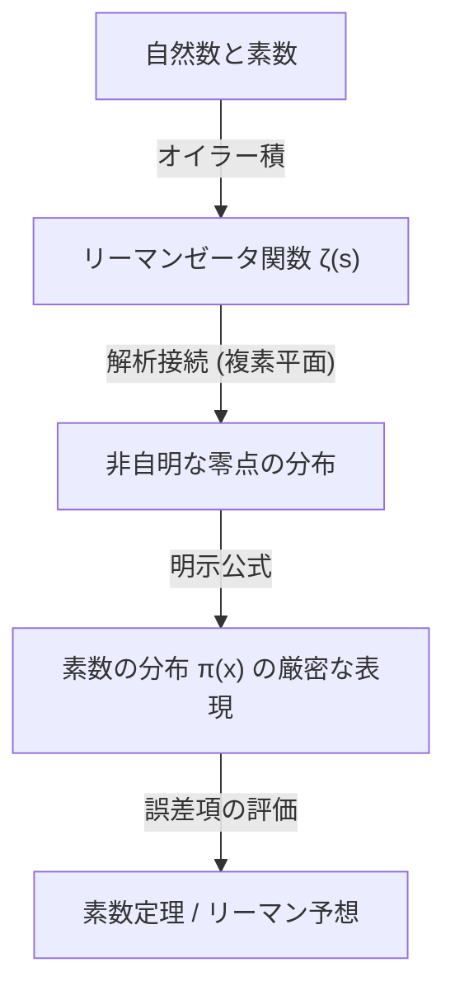

## 1. مقدمة: غموض وعدم انتظام الأعداد الأولية

الأعداد الأولية (Prime Numbers) هي أعداد طبيعية ليس لها قواسم موجبة سوى 1 ونفسها. هذه السلسلة من الأعداد التي تستمر كـ 2، 3، 5، 7، 11، 13، 17، 19... جذبت العديد من علماء الرياضيات منذ العصور القديمة كأكثر الكيانات أساسية وفي نفس الوقت الأكثر غموضاً في الرياضيات. تُسمى الأعداد الأولية أيضًا "ذرات الأعداد"، ويمكن التعبير عن جميع الأعداد الطبيعية بشكل فريد كحاصل ضرب أعداد أولية (وحدانية التحليل إلى العوامل الأولية).

ومع ذلك، عند النظر إلى نمط ظهور الأعداد الأولية للوهلة الأولى، لا يمكن إيجاد أي انتظام فيها. تارةً تظهر متقاربة كأعداد أولية توأمية مثل 11 و 13، وتارةً أخرى توجد "صحاري الأعداد الأولية" حيث لا يظهر العدد الأولي التالي حتى بعد الآلاف أو عشرات الآلاف من الأرقام. هذه العشوائية المحلية وعدم القدرة على التنبؤ شكلت عقبة كبيرة لعلماء الرياضيات.

على الرغم من ذلك، من منظور مجهري (ماكروسكوبي)، أي السلوك العام لـ "ما هي نسبة وجود الأعداد الأولية في الأعداد بأكملها"، تم اكتشاف أن هناك قانوناً جميلاً وسلساً بشكل مذهل مخبأ. هذه هي **نظرية الأعداد الأولية ([Prime Number Theorem](/ar/p/prime-number-theorem/), PNT)** التي سنشرحها في هذا المقال.

## 2. ما هي نظرية الأعداد الأولية؟ حدس غاوس العظيم

نظرية الأعداد الأولية هي نظرية تصف كيف يزداد عدد الأعداد الأولية $\pi(x)$ التي تقل عن أو تساوي العدد الحقيقي المعطى $x$ مع ازدياد قيمة $x$.

إذا عبرنا عنها رياضياً، يمكن صياغة نظرية الأعداد الأولية على النحو التالي:

$$
\lim_{x \to \infty} \frac{\pi(x)}{x / \ln(x)} = 1
$$

هذا يعني أن "عدد الأعداد الأولية $\pi(x)$ التي تقل عن أو تساوي $x$ مساوية بشكل مقارب لـ $x / \ln(x)$ ($\pi(x) \sim x / \ln(x)$)" (حيث $\ln(x)$ هو اللوغاريتم الطبيعي). بعبارة أخرى، عند اختيار عدد بشكل عشوائي بالقرب من عدد كبير بما فيه الكفاية $N$، فإن احتمال أن يكون هذا العدد أولياً هو حوالي $1 / \ln(N)$.

### اكتشاف غاوس في سن الخامسة عشرة

أول من لاحظ هذه الحقيقة المذهلة كان العبقري كارل فريدريش غاوس (Carl Friedrich Gauss) والذي كان يبلغ من العمر حينها 15 عاماً فقط. في عام 1792، درس غاوس بشغف جداول اللوغاريتمات وجداول الأعداد الأولية، ولاحظ اتجاه كثافة الأعداد الأولية للانخفاض بشكل عكسي مع اللوغاريتم الطبيعي. لقد توقع معادلة التقريب التالية:

$$
\pi(x) \approx \operatorname{Li}(x) = \int_{2}^{x} \frac{dt}{\ln t}
$$

يُسمى هذا الـ $\operatorname{Li}(x)$ بـ **التكامل اللوغاريتمي**. يوفر $\operatorname{Li}(x)$ تقريباً أفضل بكثير لـ $\pi(x)$ الفعلي مقارنة بـ $x / \ln(x)$. كان هذا الحدس من غاوس هو اللحظة الأولى التي لمحت فيها البشرية القانونية العميقة الكامنة في توزيع الأعداد الأولية.

## 3. نظرية تشيبيشيف والتقدم الجزئي

لم تُثبت حدسية غاوس لفترة طويلة، ولكن في منتصف القرن التاسع عشر، أحدث عالم الرياضيات الروسي بافنوتي تشيبيشيف (Pafnuty Chebyshev) تقدماً كبيراً. في أوراقه البحثية عامي 1848 و 1850، أثبت تشيبيشيف بدقة أن $\pi(x)$ هو من نفس رتبة $x / \ln(x)$.

تحديداً، أظهر أنه بالنسبة لجميع قيم $x$ الكبيرة بما فيه الكفاية، تتحقق المتباينة التالية:

$$
0.92129 \frac{x}{\ln x} < \pi(x) < 1.10555 \frac{x}{\ln x}
$$

كما أثبت تشيبيشيف أنه إذا كانت نهاية $\pi(x) / (x/\ln x)$ موجودة، فيجب أن تكون بالتأكيد 1. ومع ذلك، لم يتمكن من إثبات وجود النهاية بحد ذاتها (أي الإثبات الكامل لنظرية الأعداد الأولية).

## 4. دالة زيتا لريمان وإدخال التحليل المركب

أكبر اختراق نحو إثبات نظرية الأعداد الأولية جاء من قبل [برنارد ريمان](/ar/p/riemann/) (Bernhard Riemann). في ورقته البحثية الرائدة التي نُشرت عام 1859 بعنوان "عن عدد الأعداد الأولية الأقل من مقدار معطى"، أظهر ريمان أن توزيع الأعداد الأولية وسلوك **الدوال المركبة** مرتبطان ارتباطاً وثيقاً.

استخدم الدالة $\zeta(s)$ التي تُعرف اليوم بـ **دالة زيتا لريمان**.

$$
\zeta(s) = \sum_{n=1}^{\infty} \frac{1}{n^s} = \prod_{p \text{ prime}} \left( 1 - \frac{1}{p^s} \right)^{-1}
$$

تربط هذه المعادلة (تمثيل جداء أويلر) بين مجموع الأعداد الصحيحة بأكملها وجداء الأعداد الأولية بأكملها، مما يدل على أن معلومات الأعداد الأولية مُرمزة بالكامل داخل دالة زيتا.

قام ريمان بتوسيع (عبر الامتداد التحليلي) المتغير $s$ إلى الأعداد المركبة ($s = \sigma + it$)، واكتشف أن توزيع "أصفار" دالة زيتا (النقاط حيث $\zeta(s) = 0$) يحدد بدقة التذبذب في توزيع الأعداد الأولية (الخطأ بين $\pi(x)$ و $\operatorname{Li}(x)$).



## 5. الإثبات الكامل من قبل هادامار ودي لا فالي بوسان

بعد حوالي 40 عاماً من نهج ريمان الرائد، وفي عام 1896، نجح كل من الفرنسي جاك هادامار (Jacques Hadamard) والبلجيكي شارل دي لا فالي بوسان (Charles de la Vallée Poussin) بشكل مستقل في إثبات نظرية الأعداد الأولية بالكامل.

كان جوهر إثباتهم هو إظهار أن "دالة زيتا $\zeta(s)$ لا تمتلك أصفاراً على المستقيم $\operatorname{Re}(s) = 1$ في المستوى المركب". باستخدام أدوات قوية من التحليل المركب (مثل [نظرية تكامل كوشي](/ar/p/cauchys-integral-theorem/))، تُستنتج نظرية الأعداد الأولية من عدم وجود هذه الأصفار.

وبهذا، فإن قانون التوزيع المقارب للأعداد الأولية الذي توقعه غاوس في سن الخامسة عشرة، تم تأسيسه أخيرًا كـ "نظرية" رياضية بعد مرور أكثر من 100 عام.

## 6. فرضية ريمان وحدأ الخطأ في نظرية الأعداد الأولية

حتى بعد إثبات نظرية الأعداد الأولية، لم ينتهِ استكشاف الأعداد الأولية. التركيز الحالي هو على مسألة "إلى أي مدى يكون الفرق (الخطأ) بين $\pi(x)$ و $\operatorname{Li}(x)$ صغيراً؟".

قدم دي لا فالي بوسان التقييم التالي بخصوص حد الخطأ:

$$
\pi(x) = \operatorname{Li}(x) + O\left(x e^{-c\sqrt{\ln x}}\right)
$$

ومع ذلك، إذا كانت الفرضية التي طرحها ريمان نفسه في ورقته البحثية عام 1859 (**فرضية ريمان**) صحيحة، فإن هذا الخطأ سيصبح أصغر بشكل كبير. تنص فرضية ريمان على أن "جميع الأصفار غير التافهة لدالة زيتا تقع على خط مستقيم واحد $\operatorname{Re}(s) = 1/2$".

إذا كانت فرضية ريمان صحيحة، فسيتم تقييم حد الخطأ على النحو التالي:

$$
\pi(x) = \operatorname{Li}(x) + O(\sqrt{x} \ln x)
$$

هذا يعني أن توزيع الأعداد الأولية (رغم عشوائيته) مرتب بشكل منتظم قدر الإمكان. لا تزال فرضية ريمان واحدة من أهم المشاكل الصعبة وغير المحلولة في الرياضيات الحديثة، ويستمر العديد من علماء الرياضيات في محاولة حلها حتى يومنا هذا.

## 7. التطبيقات في علوم الحاسوب واختبار أولية الأعداد

لا تقتصر نظرية الأعداد الأولية على عالم الرياضيات البحتة. في المجتمع الرقمي الحديث، تدعم الأعداد الأولية أساس نظرية التشفير (خاصة تشفير المفتاح العام).

على سبيل المثال، تستخدم **تشفير RSA**، الذي يتيح الاتصال الآمن عبر الإنترنت، خاصية "أنه من السهل ضرب عددين أوليين ضخمين، ولكن من الصعب للغاية تحليل حاصل ضربهما إلى عوامله الأولية الأصلية".

لتوليد مفتاح تشفير RSA، من الضروري العثور بسرعة على أعداد أولية ضخمة تتكون من مئات الخانات (آلاف البتات). هنا، تلعب نظرية الأعداد الأولية دوراً مهماً. وفقاً لنظرية الأعداد الأولية، فإن احتمال أن يكون عدد بالقرب من $N$ أولياً هو $1 / \ln(N)$. لذلك، إذا اخترنا عدداً عشوائياً بالقرب من عدد مكون من 2048 بت (حوالي $10^{616}$)، وبعد تجربة حوالي $616 \times \ln(10) \approx 1418$ عدداً، يمكننا العثور على عدد أولي واحد بشكل شبه مؤكد. بفضل وجود نظرية الأعداد الأولية، يتم ضمان انتهاء الخوارزمية التي تبحث عن أعداد أولية ضخمة في وقت واقعي.

### اختبار ميلر-رابين لأولية الأعداد

لتحديد ما إذا كان عدد ضخم أولياً أم لا بسرعة، لا يتم استخدام طريقة القسمة التجريبية، بل طريقة اختبار الأولية الاحتمالية. ممثل هذه الطرق هو **اختبار ميلر-رابين (Miller-Rabin) لأولية الأعداد**.

فيما يلي مثال بسيط لتنفيذ اختبار ميلر-رابين لأولية الأعداد باستخدام بايثون.

```python
import random

def miller_rabin_test(n, k=5):
    """
    ミラー・ラビン素数判定法
    n: 判定する整数
    k: テストを繰り返す回数（精度を決定）
    戻り値: True ならおそらく素数、False なら合成数
    """
    if n == 2 or n == 3:
        return True
    if n <= 1 or n % 2 == 0:
        return False

    # n - 1 = d * 2^s となるように d と s を求める
    s = 0
    d = n - 1
    while d % 2 == 0:
        s += 1
        d //= 2

    for _ in range(k):
        a = random.randrange(2, n - 1)
        x = pow(a, d, n)
        if x == 1 or x == n - 1:
            continue
        
        for _ in range(s - 1):
            x = pow(x, 2, n)
            if x == n - 1:
                break
        else:
            return False  # 合成数であることが確定
            
    return True  # おそらく素数

# テスト
print(f"997 is prime? {miller_rabin_test(997)}")
print(f"1001 is prime? {miller_rabin_test(1001)}")
```

هذه الخوارزمية هي توسيع لنظرية فيرما الصغرى، ويمكن تقليل احتمال الخطأ في تصنيف عدد مركب على أنه أولي بشكل أُسّي عن طريق زيادة عدد مرات الاختبار $k$ (احتمال الخطأ هو $4^{-k}$ أو أقل).

## 8. الخاتمة: الأعداد الأولية كشيفرة الكون

توضح نظرية الأعداد الأولية فلسفة عميقة في الرياضيات مفادها أن "ما يبدو فوضوياً تماماً على المستوى الفردي، ينتج عنه نظام راقٍ للغاية عندما يتجمع ككل".

بدءاً من حدس غاوس، مروراً بتحليل تشيبيشيف الدقيق، وقفزة ريمان إلى المستوى المركب، ووصولاً إلى الإثبات النهائي من قبل هادامار ودي لا فالي بوسان، فإن تاريخ نظرية الأعداد الأولية هو حقاً تاريخ للذكاء البشري نفسه.

عندما نتسوق بأمان عبر الإنترنت، يتم حساب أعداد أولية مكونة من مئات الخانات بصمت هناك، مما يحمي أمان المعلومات. الأعداد الأولية التي بدأ علماء الرياضيات في اليونان القديمة استكشافها قبل آلاف السنين، تطورت الآن إلى تقنية أساسية تدعم البنية التحتية للمجتمع الحديث.

هل سيأتي اليوم الذي يتم فيه توضيح الطبيعة الحقيقية الخفية في توزيع الأعداد الأولية (فرضية ريمان) بالكامل؟ لم يتم فك شيفرة أعظم ما تركه الكون بالكامل حتى الآن. ومع ذلك، من خلال العدسة القوية لنظرية الأعداد الأولية، يمكننا بالتأكيد التقاط ملامح هذا القانون الجميل.
