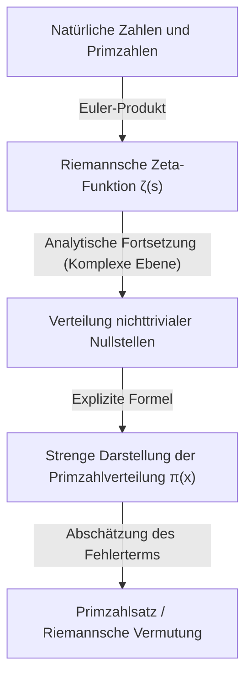

## 1. Einleitung: Das Geheimnis und die Unregelmäßigkeit der Primzahlen

Primzahlen (Prime Numbers) sind natürliche Zahlen, die keine positiven Teiler außer 1 und sich selbst haben. Die Folge dieser Zahlen, wie 2, 3, 5, 7, 11, 13, 17, 19..., ist eine der grundlegendsten und gleichzeitig mysteriösesten Entitäten in der Mathematik und hat Mathematiker seit der Antike fasziniert. Primzahlen werden oft als die „Atome der Zahlen“ bezeichnet, da jede natürliche Zahl eindeutig als Produkt von Primzahlen dargestellt werden kann (Eindeutigkeit der Primfaktorzerlegung).

Betrachtet man jedoch das Auftreten von Primzahlen auf den ersten Blick, so lässt sich keine Regelmäßigkeit erkennen. Manchmal treten sie dicht als Primzahlzwillinge wie 11 und 13 auf, und manchmal gibt es „Primzahlwüsten“, in denen selbst nach Tausenden oder Zehntausenden von Zahlen keine nächste Primzahl erscheint. Diese lokale Zufälligkeit und Unvorhersehbarkeit war eine große Hürde für Mathematiker.

Trotzdem wurde entdeckt, dass sich in ihrem makroskopischen Verhalten, d. h. in der Gesamtbetrachtung „Welchen Anteil machen Primzahlen in der Gesamtheit aller Zahlen aus?“, ein erstaunlich schönes und glattes Gesetz verbirgt. Das ist der **[Primzahlsatz](/de/p/prime-number-theorem/) ([Prime Number Theorem](/de/p/prime-number-theorem/), PNT)**, der in diesem Artikel erläutert wird.

## 2. Was ist der Primzahlsatz? Die großartige Intuition von Gauß

Der [Primzahlsatz](/de/p/prime-number-theorem/) beschreibt, wie die Anzahl der Primzahlen $\pi(x)$, die kleiner oder gleich einer gegebenen reellen Zahl $x$ sind, ansteigt, wenn $x$ größer wird.

Mathematisch ausgedrückt lässt sich der [Primzahlsatz](/de/p/prime-number-theorem/) wie folgt formulieren:

$$
\lim_{x \to \infty} \frac{\pi(x)}{x / \ln(x)} = 1
$$

Dies bedeutet, dass „die Anzahl der Primzahlen $\pi(x)$ bis $x$ asymptotisch gleich $x / \ln(x)$ ist ($\pi(x) \sim x / \ln(x)$)“ (wobei $\ln(x)$ der natürliche Logarithmus ist). Mit anderen Worten: Wenn man eine Zahl in der Nähe einer ausreichend großen Zahl $N$ zufällig auswählt, beträgt die Wahrscheinlichkeit, dass es sich um eine Primzahl handelt, in etwa $1 / \ln(N)$.

### Die Entdeckung des 15-jährigen Gauß

Der erste, der diese erstaunliche Tatsache bemerkte, war das damals erst 15-jährige Genie [Carl Friedrich Gauß](/de/p/gauss/). Im Jahr 1792 untersuchte Gauß intensiv Logarithmentafeln und Primzahltabellen und erkannte die Tendenz, dass die Dichte der Primzahlen umgekehrt proportional zum natürlichen Logarithmus abnimmt. Er vermutete folgende Näherungsformel:

$$
\pi(x) \approx \operatorname{Li}(x) = \int_{2}^{x} \frac{dt}{\ln t}
$$

Dieses $\operatorname{Li}(x)$ wird als **Integrallogarithmus** bezeichnet. $\operatorname{Li}(x)$ liefert eine wesentlich bessere Annäherung an das tatsächliche $\pi(x)$ als $x / \ln(x)$. Diese Vermutung von Gauß war der Moment, in dem die Menschheit zum ersten Mal einen Blick auf die tiefen Gesetzmäßigkeiten erhaschte, die in der Verteilung der Primzahlen verborgen sind.

## 3. Der Satz von Tschebyscheff und teilweise Fortschritte

Die Vermutung von Gauß blieb lange Zeit unbewiesen, aber Mitte des 19. Jahrhunderts brachte der russische Mathematiker Pafnuti Tschebyscheff (Pafnuty Chebyshev) große Fortschritte. In seinen Arbeiten von 1848 und 1850 bewies Tschebyscheff rigoros, dass $\pi(x)$ von der gleichen Größenordnung wie $x / \ln(x)$ ist.

Konkret zeigte er, dass für alle ausreichend großen $x$ folgende Ungleichung gilt:

$$
0.92129 \frac{x}{\ln x} < \pi(x) < 1.10555 \frac{x}{\ln x}
$$

Tschebyscheff bewies auch, dass, falls der Grenzwert von $\pi(x) / (x/\ln x)$ existiert, dieser zwingend 1 sein muss. Er konnte jedoch nicht beweisen, dass der Grenzwert selbst existiert (also keinen vollständigen Beweis für den [Primzahlsatz](/de/p/prime-number-theorem/) liefern).

## 4. Die Riemannsche Zeta-Funktion und die Einführung der komplexen Analysis

Der größte Durchbruch auf dem Weg zum Beweis des Primzahlsatzes wurde von [Bernhard Riemann](/de/p/riemann/) erzielt. In seiner bahnbrechenden Arbeit von 1859, „Ueber die Anzahl der Primzahlen unter einer gegebenen Grösse“, zeigte Riemann, dass die Verteilung der Primzahlen tief mit dem Verhalten **komplexer Funktionen** verbunden ist.

Die Funktion, die er verwendete, wird heute als **Riemannsche Zeta-Funktion** $\zeta(s)$ bezeichnet.

$$
\zeta(s) = \sum_{n=1}^{\infty} \frac{1}{n^s} = \prod_{p \text{ prime}} \left( 1 - \frac{1}{p^s} \right)^{-1}
$$

Diese Gleichung (Euler-Produkt-Darstellung) verbindet die Summe über alle ganzen Zahlen mit dem Produkt über alle Primzahlen und zeigt, dass die Informationen über Primzahlen vollständig in der Zeta-Funktion kodiert sind.

Riemann erweiterte (analytische Fortsetzung) die Variable $s$ auf komplexe Zahlen ($s = \sigma + it$) und entdeckte, dass die Verteilung der „Nullstellen“ der Zeta-Funktion (Punkte, an denen $\zeta(s) = 0$) genau die Schwankungen in der Verteilung der Primzahlen (den Fehler zwischen $\pi(x)$ und $\operatorname{Li}(x)$) bestimmt.



## 5. Der vollständige Beweis durch Hadamard und de la Vallée Poussin

Etwa 40 Jahre nach Riemanns bahnbrechendem Ansatz gelang es 1896 dem Franzosen Jacques Hadamard und dem Belgier Charles de la Vallée Poussin jeweils unabhängig voneinander, den [Primzahlsatz](/de/p/prime-number-theorem/) vollständig zu beweisen.

Der Kern ihres Beweises bestand darin zu zeigen, dass „die Zeta-Funktion $\zeta(s)$ keine Nullstellen auf der Geraden $\operatorname{Re}(s) = 1$ in der komplexen Ebene hat“. Durch die Anwendung mächtiger Werkzeuge der komplexen Analysis (wie dem Cauchyschen Integralsatz) lässt sich der [Primzahlsatz](/de/p/prime-number-theorem/) aus dieser Nichtexistenz von Nullstellen ableiten.

Damit wurde das asymptotische Verteilungsgesetz der Primzahlen, das Gauß im Alter von 15 Jahren vermutete, nach über 100 Jahren endlich als mathematischer „Satz“ etabliert.

## 6. Die Riemannsche Vermutung und der Fehlerterm des Primzahlsatzes

Auch nach dem Beweis des Primzahlsatzes ist die Erforschung der Primzahlen noch nicht abgeschlossen. Der heutige Schwerpunkt liegt auf der Frage: „Wie klein ist die Differenz (der Fehler) zwischen $\pi(x)$ und $\operatorname{Li}(x)$?“.

De la Vallée Poussin gab folgende Abschätzung für den Fehlerterm:

$$
\pi(x) = \operatorname{Li}(x) + O\left(x e^{-c\sqrt{\ln x}}\right)
$$

Wenn jedoch die Vermutung, die Riemann selbst in seiner Arbeit von 1859 aufstellte (**Riemannsche Vermutung**), richtig ist, wird dieser Fehler drastisch kleiner. Die Riemannsche Vermutung besagt: „Alle nichttrivialen Nullstellen der Zeta-Funktion liegen auf der Geraden $\operatorname{Re}(s) = 1/2$“.

Wäre die Riemannsche Vermutung wahr, ließe sich der Fehlerterm wie folgt abschätzen:

$$
\pi(x) = \operatorname{Li}(x) + O(\sqrt{x} \ln x)
$$

Das bedeutet, dass die Verteilung der Primzahlen (obwohl sie eine gewisse Zufälligkeit aufweist) so regelmäßig wie möglich angeordnet ist. Die Riemannsche Vermutung ist eines der wichtigsten und ungelösten Probleme der modernen Mathematik, an dessen Lösung auch heute noch viele Mathematiker arbeiten.

## 7. Anwendungen in der Informatik und Primzahltests

Die Theorie der Primzahlen beschränkt sich nicht nur auf die reine Mathematik. In der modernen digitalen Gesellschaft bilden Primzahlen das Fundament der Kryptographie (insbesondere der Public-Key-Kryptographie).

Zum Beispiel nutzt die **RSA-Verschlüsselung**, die eine sichere Kommunikation im Internet ermöglicht, die Eigenschaft, dass „es einfach ist, zwei riesige Primzahlen miteinander zu multiplizieren, aber extrem schwierig, dieses Produkt wieder in seine ursprünglichen Primfaktoren zu zerlegen“.

Um Schlüssel für die RSA-Verschlüsselung zu generieren, muss man schnell riesige Primzahlen mit Hunderten von Stellen (Tausenden von Bits) finden. Hierbei spielt der [Primzahlsatz](/de/p/prime-number-theorem/) eine wichtige Rolle. Laut dem [Primzahlsatz](/de/p/prime-number-theorem/) beträgt die Wahrscheinlichkeit, dass eine Zahl in der Nähe von $N$ eine Primzahl ist, $1 / \ln(N)$. Wählt man also zufällig eine Zahl im Bereich einer 2048-Bit-Zahl (etwa $10^{616}$), muss man ungefähr $616 \times \ln(10) \approx 1418$ Zahlen testen, um fast sicher eine Primzahl zu finden. Dank des Primzahlsatzes ist garantiert, dass Algorithmen zur Suche nach riesigen Primzahlen in realistischer Zeit abgeschlossen werden können.

### Der Miller-Rabin-Primzahltest

Um schnell zu überprüfen, ob eine riesige Zahl eine Primzahl ist, verwendet man keine Probedivision, sondern probabilistische Primzahltests. Ein bekannter Vertreter davon ist der **Miller-Rabin-Primzahltest**.

Hier ist ein einfaches Implementierungsbeispiel des Miller-Rabin-Primzahltests in Python.

```python
import random

def miller_rabin_test(n, k=5):
    """
    Miller-Rabin-Primzahltest
    n: zu testende Ganzzahl
    k: Anzahl der Testwiederholungen (bestimmt die Genauigkeit)
    Rückgabewert: True, wenn wahrscheinlich prim, False, wenn zusammengesetzt
    """
    if n == 2 or n == 3:
        return True
    if n <= 1 or n % 2 == 0:
        return False

    # Finde d und s so, dass n - 1 = d * 2^s
    s = 0
    d = n - 1
    while d % 2 == 0:
        s += 1
        d //= 2

    for _ in range(k):
        a = random.randrange(2, n - 1)
        x = pow(a, d, n)
        if x == 1 or x == n - 1:
            continue
        
        for _ in range(s - 1):
            x = pow(x, 2, n)
            if x == n - 1:
                break
        else:
            return False  # Garantiert zusammengesetzte Zahl
            
    return True  # Wahrscheinlich Primzahl

# Test
print(f"997 is prime? {miller_rabin_test(997)}")
print(f"1001 is prime? {miller_rabin_test(1001)}")
```

Dieser Algorithmus ist eine Erweiterung des kleinen Fermatschen Satzes, und die Wahrscheinlichkeit, eine zusammengesetzte Zahl fälschlicherweise als Primzahl zu klassifizieren, kann durch Erhöhen der Anzahl der Tests $k$ exponentiell verringert werden (die Fehlerwahrscheinlichkeit ist kleiner als $4^{-k}$).

## 8. Fazit: Primzahlen als Code des Universums

Der [Primzahlsatz](/de/p/prime-number-theorem/) zeigt eine tiefe mathematische Philosophie: „Dinge, die auf individueller Ebene völlig chaotisch erscheinen, können in ihrer Gesamtheit eine äußerst raffinierte Ordnung hervorbringen.“

Von der Intuition von Gauß über die beharrlichen Analysen von Tschebyscheff und Riemanns Sprung in die komplexe Ebene bis hin zum endgültigen Beweis durch Hadamard und de la Vallée Poussin ist die Geschichte des Primzahlsatzes wahrlich die Geschichte des menschlichen Intellekts selbst.

Wenn wir heute sicher im Internet einkaufen, werden dort still und leise Primzahlen mit Hunderten von Stellen berechnet, um die Sicherheit unserer Informationen zu gewährleisten. Die Primzahlen, deren Erforschung vor Tausenden von Jahren von antiken griechischen Mathematikern begonnen wurde, haben sich heute zu einer grundlegenden Technologie entwickelt, die die Infrastruktur der modernen Gesellschaft stützt.

Wird der Tag kommen, an dem das wahre Gesicht hinter der Verteilung der Primzahlen (die Riemannsche Vermutung) vollständig gelöst wird? Der größte vom Universum hinterlassene Code ist noch immer nicht vollständig entschlüsselt. Doch durch die mächtige Linse des Primzahlsatzes können wir zweifellos die Umrisse seines wunderschönen Gesetzes erkennen.
