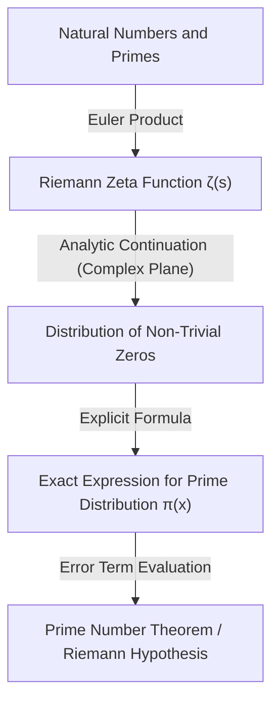

## 1. Introduction: The Mystery and Irregularity of Prime Numbers

Prime numbers are natural numbers that have no positive divisors other than 1 and themselves. This sequence of numbers, starting with 2, 3, 5, 7, 11, 13, 17, 19..., is the most fundamental yet mysterious existence in mathematics, having fascinated mathematicians since ancient times. Primes are often called the "atoms of numbers," as every natural number can be uniquely expressed as a product of primes (the fundamental theorem of arithmetic).

However, at first glance, the pattern of prime appearances seems completely devoid of any regularity. Sometimes they appear tightly clustered as twin primes like 11 and 13, while other times there are "prime deserts" where the next prime does not appear for thousands or tens of thousands of numbers. This local randomness and unpredictability presented a massive wall for mathematicians.

Despite this, looking from a macroscopic perspective—the overall behavior of "what proportion of all numbers are primes"—an astonishingly beautiful and smooth law was discovered to be hidden within. This is the **Prime Number Theorem (PNT)**, which we will explore in this article.

## 2. What is the Prime Number Theorem? Gauss's Great Intuition

The Prime Number Theorem describes how the number of primes less than or equal to a given real number $x$, denoted by $\pi(x)$, increases as $x$ becomes larger.

Expressed mathematically, the Prime Number Theorem is stated as follows:

$$
\lim_{x \to \infty} \frac{\pi(x)}{x / \ln(x)} = 1
$$

This means that "the number of primes less than or equal to $x$, $\pi(x)$, is asymptotically equal to $x / \ln(x)$ ($\pi(x) \sim x / \ln(x)$)" (where $\ln(x)$ is the natural logarithm). In other words, if you randomly select a number near a sufficiently large number $N$, the probability that it is prime is roughly $1 / \ln(N)$.

### Discovery by 15-Year-Old Gauss

The first person to notice this incredible fact was the young genius Carl Friedrich Gauss when he was just 15 years old. In 1792, Gauss eagerly examined tables of logarithms and prime numbers, observing a trend where the density of primes decreased inversely proportional to the natural logarithm. He conjectured the following approximation formula:

$$
\pi(x) \approx \operatorname{Li}(x) = \int_{2}^{x} \frac{dt}{\ln t}
$$

This $\operatorname{Li}(x)$ is known as the **logarithmic integral**. $\operatorname{Li}(x)$ provides a much better approximation to the actual $\pi(x)$ than $x / \ln(x)$. Gauss's conjecture was the moment humanity caught its first glimpse of the deep laws hidden in the distribution of prime numbers.

## 3. Chebyshev's Theorem and Partial Progress

Gauss's conjecture went unproven for a long time, but moving into the mid-19th century, Russian mathematician Pafnuty Chebyshev brought about significant progress. In papers from 1848 and 1850, Chebyshev rigorously proved that $\pi(x)$ is of the same order as $x / \ln(x)$.

Specifically, he showed that for all sufficiently large $x$, the following inequality holds:

$$
0.92129 \frac{x}{\ln x} < \pi(x) < 1.10555 \frac{x}{\ln x}
$$

Chebyshev also proved that if the limit of $\pi(x) / (x/\ln x)$ exists, it must absolutely be 1. However, he did not manage to show that the limit itself exists (which would be a complete proof of the Prime Number Theorem).

## 4. Riemann's Zeta Function and the Introduction of Complex Analysis

The greatest breakthrough toward proving the Prime Number Theorem was brought about by Bernhard Riemann. In his groundbreaking 1859 paper "On the Number of Primes Less Than a Given Magnitude," Riemann demonstrated that the distribution of primes is deeply connected to the behavior of **complex functions**.

The function he used is what we call the **Riemann zeta function**, $\zeta(s)$, today.

$$
\zeta(s) = \sum_{n=1}^{\infty} \frac{1}{n^s} = \prod_{p \text{ prime}} \left( 1 - \frac{1}{p^s} \right)^{-1}
$$

This equation (the Euler product formula) bridges the sum over all integers with the product over all primes, indicating that the information about prime numbers is completely encoded within the zeta function.

Riemann extended the variable $s$ to complex numbers ($s = \sigma + it$) via analytic continuation, and discovered that the distribution of the "zeros" of the zeta function (the points where $\zeta(s) = 0$) precisely determines the fluctuations in the distribution of primes (the error between $\pi(x)$ and $\operatorname{Li}(x)$).



## 5. Complete Proof by Hadamard and de la Vallée Poussin

In 1896, almost 40 years after Riemann's revolutionary approach, French mathematician Jacques Hadamard and Belgian mathematician Charles de la Vallée Poussin independently succeeded in fully proving the Prime Number Theorem.

The core of their proofs was showing that "the zeta function $\zeta(s)$ has no zeros on the line $\operatorname{Re}(s) = 1$ in the complex plane." By utilizing powerful tools of complex analysis (such as Cauchy's integral theorem), the Prime Number Theorem can be derived from the non-existence of these zeros.

With this, the asymptotic distribution law of prime numbers conjectured by Gauss at age 15 was finally established as a mathematical "theorem" after more than 100 years.

## 6. The Riemann Hypothesis and the Error Term of the Prime Number Theorem

Even after the Prime Number Theorem was proved, the exploration of prime numbers did not end. The current focus is on the problem of "how small is the difference (error) between $\pi(x)$ and $\operatorname{Li}(x)$?"

De la Vallée Poussin provided the following evaluation for the error term:

$$
\pi(x) = \operatorname{Li}(x) + O\left(x e^{-c\sqrt{\ln x}}\right)
$$

However, if the conjecture Riemann himself made in his 1859 paper (the **Riemann Hypothesis**) is correct, this error becomes dramatically smaller. The Riemann Hypothesis states that "all non-trivial zeros of the zeta function lie on the single straight line $\operatorname{Re}(s) = 1/2$."

If the Riemann Hypothesis is true, the error term can be evaluated as follows:

$$
\pi(x) = \operatorname{Li}(x) + O(\sqrt{x} \ln x)
$$

This implies that the distribution of prime numbers is arranged as regularly as possible (while still possessing randomness). The Riemann Hypothesis remains one of the most important and unsolved difficult problems in modern mathematics, with many mathematicians continuing to challenge it today.

## 7. Applications in Computer Science and Primality Testing

The theory of prime numbers is not confined to the world of pure mathematics. In our modern digital society, primes form the foundation of cryptography (especially public-key cryptography).

For instance, the **RSA cryptography** that enables secure communications on the internet leverages the property that "while it is easy to multiply two enormous prime numbers together, it is extremely difficult to factorize their product back into the original primes."

To generate keys for RSA encryption, one must quickly find massive prime numbers that are hundreds of digits (thousands of bits) long. This is where the Prime Number Theorem plays a crucial role. According to the Prime Number Theorem, the probability that a number near $N$ is prime is $1 / \ln(N)$. Therefore, if you randomly pick numbers near a 2048-bit number (about $10^{616}$), you are almost guaranteed to find a prime after checking about $616 \times \ln(10) \approx 1418$ numbers. It is because of the Prime Number Theorem that algorithms to find massive primes are guaranteed to finish in a realistic amount of time.

### Miller-Rabin Primality Test

To quickly determine whether a massive number is prime, probabilistic primality tests are used rather than trial division. The most prominent example is the **Miller-Rabin primality test**.

Below is a simple Python implementation example of the Miller-Rabin primality test.

```python
import random

def miller_rabin_test(n, k=5):
    """
    Miller-Rabin primality test
    n: The integer to test
    k: Number of iterations (determines accuracy)
    Returns: True if probably prime, False if composite
    """
    if n == 2 or n == 3:
        return True
    if n <= 1 or n % 2 == 0:
        return False

    # Find d and s such that n - 1 = d * 2^s
    s = 0
    d = n - 1
    while d % 2 == 0:
        s += 1
        d //= 2

    for _ in range(k):
        a = random.randrange(2, n - 1)
        x = pow(a, d, n)
        if x == 1 or x == n - 1:
            continue
        
        for _ in range(s - 1):
            x = pow(x, 2, n)
            if x == n - 1:
                break
        else:
            return False  # Definitely composite
            
    return True  # Probably prime

# Tests
print(f"997 is prime? {miller_rabin_test(997)}")
print(f"1001 is prime? {miller_rabin_test(1001)}")
```

This algorithm is an extension of Fermat's Little Theorem, and the probability of incorrectly determining a composite number as a prime can be made exponentially small by increasing the number of tests $k$ (the probability of error is less than $4^{-k}$).

## 8. Conclusion: Primes as the Universe's Cipher

The Prime Number Theorem presents a profound philosophy in mathematics: "Things that appear completely chaotic on an individual level can give rise to extremely elegant order when collected as a whole."

From Gauss's intuition, through Chebyshev's steady analysis and Riemann's leap into the complex plane, down to the final proofs by Hadamard and de la Vallée Poussin, the history of the Prime Number Theorem is truly the history of human intellect itself.

When we shop securely on the internet, prime numbers hundreds of digits long are silently being calculated to protect the security of our information. Prime numbers, whose exploration was begun by ancient Greek mathematicians thousands of years ago, have now evolved into a foundational technology supporting the infrastructure of modern society.

Will the day come when the true nature hidden within the distribution of primes (the Riemann Hypothesis) is completely unraveled? The greatest cipher written by the universe has yet to be fully decoded. However, through the powerful lens of the Prime Number Theorem, we are certainly able to grasp the contours of its beautiful laws.
