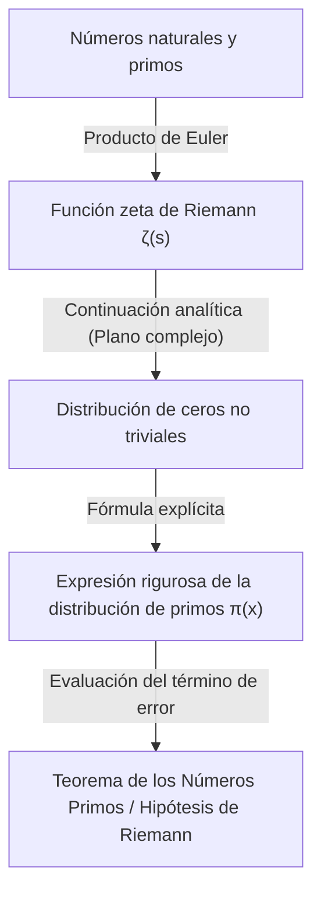

## 1. Introducción: El misterio y la irregularidad de los números primos

Los números primos (Prime Numbers) son números naturales que no tienen más divisores positivos que el 1 y ellos mismos. Esta secuencia de números, que continúa como 2, 3, 5, 7, 11, 13, 17, 19..., ha fascinado a muchos matemáticos desde la antigüedad como una de las entidades más fundamentales y a la vez más misteriosas de las matemáticas. Los números primos también son conocidos como los "átomos de los números", ya que todo número natural puede expresarse de forma única como un producto de números primos (teorema fundamental de la aritmética).

Sin embargo, al observar el patrón de aparición de los números primos a primera vista, no se puede encontrar ninguna regularidad. A veces aparecen agrupados como números primos gemelos, como el 11 y el 13, y otras veces hay "desiertos de números primos" donde no aparece el siguiente número primo incluso después de miles o decenas de miles de números. Esta aleatoriedad local e imprevisibilidad supuso una gran barrera para los matemáticos.

A pesar de esto, desde una perspectiva macroscópica, es decir, en el comportamiento global de "qué proporción de números primos existe en el conjunto de todos los números", se descubrió que se esconde una ley sorprendentemente hermosa y suave. Esto es el **Teorema de los Números Primos (Prime Number Theorem, PNT)**, que se explica en este artículo.

## 2. ¿Qué es el Teorema de los Números Primos? La gran intuición de Gauss

El Teorema de los Números Primos es un teorema que describe cómo aumenta la cantidad de números primos $\pi(x)$ menores o iguales a un número real dado $x$, a medida que $x$ se hace más grande.

Expresado matemáticamente, el Teorema de los Números Primos se enuncia de la siguiente manera:

$$
\lim_{x \to \infty} \frac{\pi(x)}{x / \ln(x)} = 1
$$

Esto significa que "la cantidad de números primos $\pi(x)$ menores o iguales a $x$ es asintóticamente igual a $x / \ln(x)$ ($\pi(x) \sim x / \ln(x)$)" (donde $\ln(x)$ es el logaritmo natural). En otras palabras, si elegimos un número al azar cerca de un número $N$ suficientemente grande, la probabilidad de que sea un número primo es aproximadamente $1 / \ln(N)$.

### El descubrimiento de Gauss a los 15 años

El primero en darse cuenta de este sorprendente hecho fue el genio Carl Friedrich Gauss, que entonces tenía solo 15 años. En 1792, Gauss estudió con entusiasmo las tablas de logaritmos y de números primos, y notó la tendencia de que la densidad de los números primos disminuía en proporción inversa al logaritmo natural. Conjeturó la siguiente fórmula de aproximación:

$$
\pi(x) \approx \operatorname{Li}(x) = \int_{2}^{x} \frac{dt}{\ln t}
$$

Este $\operatorname{Li}(x)$ se llama **logaritmo integral**. $\operatorname{Li}(x)$ da una aproximación mucho mejor al $\pi(x)$ real que $x / \ln(x)$. Esta conjetura de Gauss fue el momento en que la humanidad vislumbró por primera vez la profunda ley subyacente en la distribución de los números primos.

## 3. El teorema de Chebyshev y los avances parciales

La conjetura de Gauss permaneció sin demostrarse durante mucho tiempo, pero a mediados del siglo XIX, el matemático ruso Pafnuty Chebyshev logró un gran avance. En sus artículos de 1848 y 1850, Chebyshev demostró rigurosamente que $\pi(x)$ es del mismo orden que $x / \ln(x)$.

Específicamente, demostró que la siguiente desigualdad se cumple para todo $x$ suficientemente grande:

$$
0.92129 \frac{x}{\ln x} < \pi(x) < 1.10555 \frac{x}{\ln x}
$$

Chebyshev también demostró que, si existe el límite de $\pi(x) / (x/\ln x)$, entonces debe ser necesariamente 1. Sin embargo, no llegó a demostrar que el límite en sí existiera (es decir, la demostración completa del Teorema de los Números Primos).

## 4. La función zeta de Riemann y la introducción del análisis complejo

El mayor avance hacia la demostración del Teorema de los Números Primos fue aportado por Bernhard Riemann. En su revolucionario artículo de 1859, "Sobre el número de primos menores que una magnitud dada", Riemann demostró que la distribución de los números primos está profundamente conectada con el comportamiento de una **función compleja**.

Lo que utilizó es la función $\zeta(s)$, que hoy se conoce como la **función zeta de Riemann**.

$$
\zeta(s) = \sum_{n=1}^{\infty} \frac{1}{n^s} = \prod_{p \text{ prime}} \left( 1 - \frac{1}{p^s} \right)^{-1}
$$

Esta ecuación (la expresión del producto de Euler) conecta la suma sobre todos los números enteros con el producto sobre todos los números primos, mostrando que la información de los números primos está completamente codificada dentro de la función zeta.

Riemann extendió (continuación analítica) la variable $s$ a los números complejos ($s = \sigma + it$), y descubrió que la distribución de los "ceros" de la función zeta (los puntos donde $\zeta(s) = 0$) determina exactamente la fluctuación de la distribución de los números primos (el error entre $\pi(x)$ y $\operatorname{Li}(x)$).



## 5. La demostración completa por Hadamard y de la Vallée Poussin

En 1896, unos 40 años después del enfoque revolucionario de Riemann, el francés Jacques Hadamard y el belga Charles de la Vallée Poussin lograron, de manera independiente, la demostración completa del Teorema de los Números Primos.

El núcleo de sus demostraciones fue demostrar que "la función zeta $\zeta(s)$ no tiene ceros en la recta $\operatorname{Re}(s) = 1$ en el plano complejo". Utilizando herramientas poderosas del análisis complejo (como el teorema integral de Cauchy), el Teorema de los Números Primos se deriva de la no existencia de estos ceros.

De esta manera, la ley de distribución asintótica de los números primos, conjeturada por Gauss a los 15 años, se estableció finalmente como un "teorema" matemático después de más de 100 años.

## 6. La Hipótesis de Riemann y el término de error del Teorema de los Números Primos

Incluso después de que se demostró el Teorema de los Números Primos, la exploración de los números primos no terminó. El enfoque actual es el problema de "cuán pequeña es la diferencia (error) entre $\pi(x)$ y $\operatorname{Li}(x)$".

De la Vallée Poussin dio la siguiente evaluación con respecto al término de error:

$$
\pi(x) = \operatorname{Li}(x) + O\left(x e^{-c\sqrt{\ln x}}\right)
$$

Sin embargo, si la conjetura hecha por el propio Riemann en su artículo de 1859 (la **Hipótesis de Riemann**) es correcta, este error se vuelve drásticamente más pequeño. La Hipótesis de Riemann establece que "todos los ceros no triviales de la función zeta se encuentran en la recta $\operatorname{Re}(s) = 1/2$".

Si la Hipótesis de Riemann es verdadera, el término de error se evalúa de la siguiente manera:

$$
\pi(x) = \operatorname{Li}(x) + O(\sqrt{x} \ln x)
$$

Esto significa que la distribución de los números primos está dispuesta de la manera más regular posible (a pesar de tener aleatoriedad). La Hipótesis de Riemann sigue siendo uno de los problemas sin resolver más importantes y difíciles de las matemáticas modernas, y muchos matemáticos continúan desafiándolo en la actualidad.

## 7. Aplicaciones a la informática y tests de primalidad

La teoría de los números primos no se limita al mundo de las matemáticas puras. En la sociedad digital moderna, los números primos sustentan los cimientos de la teoría criptográfica (especialmente la criptografía de clave pública).

Por ejemplo, la **criptografía RSA**, que permite la comunicación segura en Internet, utiliza la propiedad de que "multiplicar dos números primos enormes es fácil, pero factorizar su producto en los números primos originales es extremadamente difícil".

Para generar una clave para la criptografía RSA, es necesario encontrar rápidamente números primos gigantes de cientos de dígitos (miles de bits). Aquí es donde el Teorema de los Números Primos juega un papel importante. Según el Teorema de los Números Primos, la probabilidad de que un número cercano a $N$ sea primo es $1 / \ln(N)$. Por lo tanto, si elegimos números al azar cerca de un número de 2048 bits (aproximadamente $10^{616}$), si probamos aproximadamente $616 \times \ln(10) \approx 1418$ números, es casi seguro que encontraremos un número primo. Es gracias al Teorema de los Números Primos que se garantiza que el algoritmo para encontrar números primos enormes termine en un tiempo realista.

### Test de primalidad de Miller-Rabin

Para determinar rápidamente si un número enorme es primo o no, no se utiliza la división por tentativa, sino algoritmos de test de primalidad probabilísticos. El representante de estos es el **test de primalidad de Miller-Rabin (Miller-Rabin)**.

A continuación se muestra un ejemplo sencillo de implementación del test de primalidad de Miller-Rabin en Python.

```python
import random

def miller_rabin_test(n, k=5):
    """
    Test de primalidad de Miller-Rabin
    n: Entero a evaluar
    k: Número de iteraciones del test (determina la precisión)
    Retorno: True si es probablemente primo, False si es compuesto
    """
    if n == 2 or n == 3:
        return True
    if n <= 1 or n % 2 == 0:
        return False

    # Encontrar d y s tal que n - 1 = d * 2^s
    s = 0
    d = n - 1
    while d % 2 == 0:
        s += 1
        d //= 2

    for _ in range(k):
        a = random.randrange(2, n - 1)
        x = pow(a, d, n)
        if x == 1 or x == n - 1:
            continue
        
        for _ in range(s - 1):
            x = pow(x, 2, n)
            if x == n - 1:
                break
        else:
            return False  # Definitivamente compuesto
            
    return True  # Probablemente primo

# Prueba
print(f"¿997 es primo? {miller_rabin_test(997)}")
print(f"¿1001 es primo? {miller_rabin_test(1001)}")
```

Este algoritmo es una extensión del pequeño teorema de Fermat, y la probabilidad de clasificar erróneamente un número compuesto como primo puede reducirse exponencialmente aumentando el número de pruebas $k$ (la probabilidad de error es menor o igual a $4^{-k}$).

## 8. Conclusión: Los números primos como el código del universo

El Teorema de los Números Primos demuestra una profunda filosofía en matemáticas: "lo que parece completamente desordenado a nivel individual produce un orden extremadamente refinado cuando se reúne como un todo".

Desde la intuición de Gauss, pasando por el constante análisis de Chebyshev, el salto de Riemann al plano complejo y, finalmente, la demostración definitiva por Hadamard y de la Vallée Poussin, la historia del Teorema de los Números Primos es verdaderamente la historia del intelecto humano en sí misma.

Cuando compramos de forma segura en Internet, los números primos de cientos de dígitos se calculan silenciosamente allí, protegiendo la seguridad de nuestra información. Los números primos, cuya exploración fue iniciada por los matemáticos griegos de la antigüedad hace miles de años, se han convertido ahora en una tecnología fundamental que sustenta la infraestructura de la sociedad moderna.

¿Llegará el día en que se descifre por completo la verdadera naturaleza oculta en la distribución de los números primos (la Hipótesis de Riemann)? El mayor código dejado por el universo aún no ha sido descifrado por completo. Sin embargo, a través de la poderosa lente del Teorema de los Números Primos, sin duda estamos logrando captar los contornos de sus hermosas leyes.
