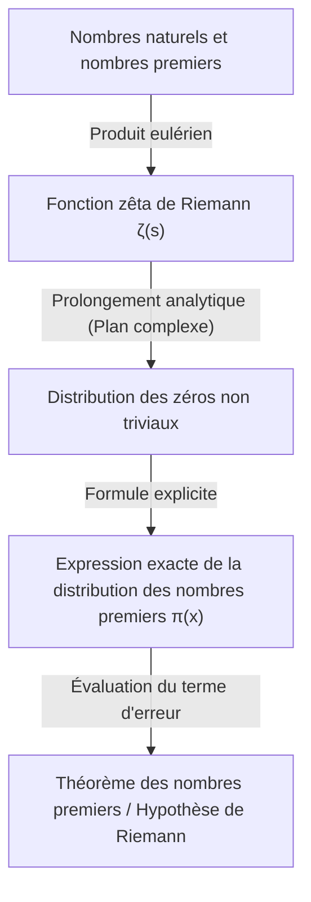

## 1. Introduction : Le mystère et l'irrégularité des nombres premiers

Les nombres premiers (Prime Numbers) sont des entiers naturels qui n'ont pas d'autres diviseurs positifs que 1 et eux-mêmes. La suite de ces nombres, 2, 3, 5, 7, 11, 13, 17, 19... bien qu'étant l'une des plus fondamentales en mathématiques, est aussi l'une des plus mystérieuses, et elle fascine de nombreux mathématiciens depuis l'Antiquité. Les nombres premiers sont parfois appelés les « atomes des nombres », et tout entier naturel peut être représenté de manière unique comme un produit de nombres premiers (l'unicité de la décomposition en produit de facteurs premiers).

Cependant, à première vue, aucun motif régulier ne se dégage de l'apparition des nombres premiers. Parfois, ils apparaissent de manière rapprochée comme les nombres premiers jumeaux 11 et 13, et d'autres fois, il existe des « déserts de nombres premiers » où le nombre premier suivant n'apparaît qu'après des milliers ou des dizaines de milliers de nombres. Cette stochasticité locale et cette imprévisibilité ont longtemps été un grand obstacle pour les mathématiciens.

Malgré cela, il a été découvert qu'une loi incroyablement belle et lisse se cache dans leur comportement global, c'est-à-dire la proportion de nombres premiers dans l'ensemble des nombres. C'est le **Théorème des Nombres Premiers (Prime Number Theorem, PNT)** que nous allons expliquer dans cet article.

## 2. Qu'est-ce que le Théorème des Nombres Premiers ? La grande intuition de Gauss

Le théorème des nombres premiers est un théorème qui décrit comment la quantité de nombres premiers inférieurs à un nombre réel donné $x$, notée $\pi(x)$, augmente à mesure que $x$ devient grand.

Exprimé mathématiquement, le théorème des nombres premiers s'énonce comme suit :

$$
\lim_{x \to \infty} \frac{\pi(x)}{x / \ln(x)} = 1
$$

Cela signifie que « le nombre de nombres premiers inférieurs ou égaux à $x$, $\pi(x)$, est asymptotiquement égal à $x / \ln(x)$ ($\pi(x) \sim x / \ln(x)$) » (où $\ln(x)$ est le logarithme népérien). En d'autres termes, si l'on choisit un nombre au hasard autour d'un nombre $N$ suffisamment grand, la probabilité qu'il soit premier est d'environ $1 / \ln(N)$.

### La découverte de Gauss à l'âge de 15 ans

La première personne à avoir remarqué ce fait surprenant fut le génie Carl Friedrich Gauss, alors âgé de seulement 15 ans. En 1792, Gauss a étudié assidûment les tables de logarithmes et de nombres premiers, et a observé la tendance de la densité des nombres premiers à diminuer de manière inversement proportionnelle au logarithme népérien. Il a conjecturé l'approximation suivante :

$$
\pi(x) \approx \operatorname{Li}(x) = \int_{2}^{x} \frac{dt}{\ln t}
$$

Ce $\operatorname{Li}(x)$ est appelé **logarithme intégral**. $\operatorname{Li}(x)$ donne une bien meilleure approximation du véritable $\pi(x)$ que $x / \ln(x)$. Cette conjecture de Gauss a été le moment où l'humanité a pu entrevoir pour la première fois la profonde régularité cachée dans la distribution des nombres premiers.

## 3. Le théorème de Tchebychev et les avancées partielles

La conjecture de Gauss est restée non prouvée pendant longtemps, mais au milieu du 19ème siècle, le mathématicien russe Pafnouti Tchebychev (Pafnuty Chebyshev) y a apporté une avancée majeure. Dans ses articles de 1848 et 1850, Tchebychev a rigoureusement prouvé que $\pi(x)$ est du même ordre de grandeur que $x / \ln(x)$.

Spécifiquement, il a montré que pour tout $x$ suffisamment grand, l'inégalité suivante est vérifiée :

$$
0.92129 \frac{x}{\ln x} < \pi(x) < 1.10555 \frac{x}{\ln x}
$$

Tchebychev a également prouvé que si la limite de $\pi(x) / (x/\ln x)$ existe, elle doit nécessairement être égale à 1. Cependant, il n'est pas parvenu à démontrer l'existence de la limite elle-même (c'est-à-dire la preuve complète du théorème des nombres premiers).

## 4. La fonction zêta de Riemann et l'introduction de l'analyse complexe

La plus grande percée vers la preuve du théorème des nombres premiers a été apportée par Bernhard Riemann. Dans son article révolutionnaire de 1859, « Sur le nombre de nombres premiers inférieurs à une taille donnée », Riemann a montré que la distribution des nombres premiers et le comportement des **fonctions complexes** sont profondément liés.

La fonction qu'il a utilisée est aujourd'hui appelée la **fonction zêta de Riemann**, notée $\zeta(s)$.

$$
\zeta(s) = \sum_{n=1}^{\infty} \frac{1}{n^s} = \prod_{p \text{ prime}} \left( 1 - \frac{1}{p^s} \right)^{-1}
$$

Cette équation (le produit eulérien) relie la somme sur tous les entiers au produit sur tous les nombres premiers, montrant que l'information sur les nombres premiers est entièrement encodée dans la fonction zêta.

Riemann a étendu la variable $s$ aux nombres complexes ($s = \sigma + it$) (prolongement analytique), et a découvert que la distribution des « zéros » de la fonction zêta (les points où $\zeta(s) = 0$) détermine avec précision les fluctuations dans la distribution des nombres premiers (l'erreur entre $\pi(x)$ et $\operatorname{Li}(x)$).



## 5. La preuve complète par Hadamard et de La Vallée Poussin

En 1896, environ 40 ans après l'approche révolutionnaire de Riemann, le Français Jacques Hadamard et le Belge Charles de La Vallée Poussin ont réussi, chacun indépendamment, à prouver complètement le théorème des nombres premiers.

Le cœur de leur preuve consistait à montrer que « la fonction zêta $\zeta(s)$ n'a pas de zéros sur la droite $\operatorname{Re}(s) = 1$ du plan complexe ». En utilisant des outils puissants de l'analyse complexe (comme le théorème intégral de Cauchy), l'absence de ces zéros permet de déduire le théorème des nombres premiers.

Ainsi, la loi de la distribution asymptotique des nombres premiers que Gauss avait conjecturée à l'âge de 15 ans, a finalement été établie comme un véritable « théorème » mathématique après plus de 100 ans.

## 6. L'hypothèse de Riemann et le terme d'erreur du théorème des nombres premiers

Même après la preuve du théorème des nombres premiers, l'exploration des nombres premiers n'est pas terminée. L'attention se porte actuellement sur la question de savoir « à quel point la différence (l'erreur) entre $\pi(x)$ et $\operatorname{Li}(x)$ est petite ».

De La Vallée Poussin a fourni l'évaluation suivante pour le terme d'erreur :

$$
\pi(x) = \operatorname{Li}(x) + O\left(x e^{-c\sqrt{\ln x}}\right)
$$

Cependant, si la conjecture énoncée par Riemann lui-même dans son article de 1859 (l'**hypothèse de Riemann**) est exacte, cette erreur devient radicalement plus petite. L'hypothèse de Riemann stipule que « tous les zéros non triviaux de la fonction zêta se trouvent sur la même ligne droite $\operatorname{Re}(s) = 1/2$ ».

Si l'hypothèse de Riemann est vraie, le terme d'erreur est évalué comme suit :

$$
\pi(x) = \operatorname{Li}(x) + O(\sqrt{x} \ln x)
$$

Cela signifie que la distribution des nombres premiers (bien qu'ayant une nature aléatoire) est disposée de la manière la plus régulière possible. L'hypothèse de Riemann demeure aujourd'hui l'un des problèmes ouverts les plus importants et les plus difficiles des mathématiques modernes, auquel de nombreux mathématiciens continuent de s'attaquer.

## 7. Application à l'informatique et tests de primalité

La théorie des nombres premiers ne se limite pas au monde des mathématiques pures. Dans notre société numérique moderne, les nombres premiers sont au cœur de la cryptographie (en particulier la cryptographie à clé publique).

Par exemple, le **chiffrement RSA**, qui permet les communications sécurisées sur Internet, tire parti de la propriété suivante : « il est facile de multiplier deux très grands nombres premiers, mais il est extrêmement difficile de factoriser leur produit pour retrouver les nombres premiers initiaux ».

Pour générer une clé RSA, il est nécessaire de trouver rapidement d'énormes nombres premiers de plusieurs centaines de chiffres (des milliers de bits). C'est là que le théorème des nombres premiers joue un rôle crucial. Selon le théorème, la probabilité qu'un nombre autour de $N$ soit premier est de $1 / \ln(N)$. Par conséquent, si l'on choisit des nombres au hasard autour d'un nombre de 2048 bits (environ $10^{616}$), il suffit d'essayer environ $616 \times \ln(10) \approx 1418$ nombres pour trouver presque certainement un nombre premier. C'est l'existence même du théorème des nombres premiers qui garantit que l'algorithme de recherche de grands nombres premiers se termine dans un temps raisonnable.

### Test de primalité de Miller-Rabin

Pour déterminer rapidement si un nombre gigantesque est premier, on utilise des tests de primalité probabilistes plutôt que la méthode des divisions successives. L'un des plus représentatifs est le **test de primalité de Miller-Rabin**.

Voici un exemple simple d'implémentation du test de primalité de Miller-Rabin en Python.

```python
import random

def miller_rabin_test(n, k=5):
    """
    Test de primalité de Miller-Rabin
    n: entier à tester
    k: nombre d'itérations du test (détermine la précision)
    Valeur de retour: True si probablement premier, False si composé
    """
    if n == 2 or n == 3:
        return True
    if n <= 1 or n % 2 == 0:
        return False

    # Trouver d et s tels que n - 1 = d * 2^s
    s = 0
    d = n - 1
    while d % 2 == 0:
        s += 1
        d //= 2

    for _ in range(k):
        a = random.randrange(2, n - 1)
        x = pow(a, d, n)
        if x == 1 or x == n - 1:
            continue
        
        for _ in range(s - 1):
            x = pow(x, 2, n)
            if x == n - 1:
                break
        else:
            return False  # Certainement composé
            
    return True  # Probablement premier

# Tests
print(f"997 is prime? {miller_rabin_test(997)}")
print(f"1001 is prime? {miller_rabin_test(1001)}")
```

Cet algorithme est une extension du petit théorème de Fermat. La probabilité qu'il déclare à tort qu'un nombre composé est premier peut être réduite de manière exponentielle en augmentant le nombre de tests $k$ (la probabilité d'erreur est inférieure à $4^{-k}$).

## 8. Conclusion : Les nombres premiers, comme code de l'univers

Le théorème des nombres premiers illustre une philosophie profonde en mathématiques : « des éléments qui semblent totalement désordonnés à l'échelle individuelle produisent un ordre extrêmement raffiné lorsqu'ils sont considérés dans leur ensemble ».

Depuis l'intuition de Gauss, jusqu'à l'analyse assidue de Tchebychev, le bond vers le plan complexe de Riemann, et la preuve finale de Hadamard et de La Vallée Poussin, l'histoire du théorème des nombres premiers est véritablement celle de l'intelligence humaine.

Lorsque nous faisons des achats en toute sécurité sur Internet, des nombres premiers de plusieurs centaines de chiffres sont silencieusement calculés pour protéger nos informations. Les nombres premiers, dont les mathématiciens de la Grèce antique avaient commencé l'étude il y a des milliers d'années, ont évolué pour devenir aujourd'hui une technologie fondamentale soutenant l'infrastructure de la société moderne.

Viendra-t-il un jour où la véritable nature cachée dans la distribution des nombres premiers (l'hypothèse de Riemann) sera complètement élucidée ? Le plus grand code que l'univers nous a laissé n'est toujours pas totalement déchiffré. Cependant, à travers la puissante lentille du théorème des nombres premiers, nous sommes indéniablement capables d'en saisir les belles lois qui s'y dessinent.
