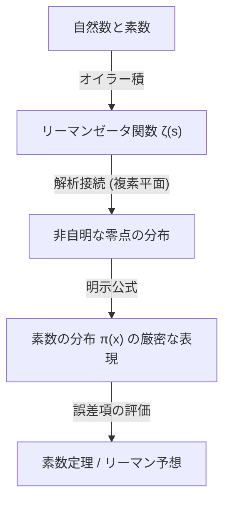

## 1. परिचय: अभाज्य संख्याओं का रहस्य और अनियमितता

अभाज्य संख्याएँ (Prime Numbers) वे प्राकृतिक संख्याएँ हैं जिनके 1 और स्वयं के अलावा कोई सकारात्मक भाजक नहीं होते हैं। 2, 3, 5, 7, 11, 13, 17, 19... के साथ जारी यह संख्या श्रृंखला, गणित में सबसे बुनियादी होते हुए भी, लंबे समय से कई गणितज्ञों को सबसे रहस्यमय अस्तित्व के रूप में आकर्षित करती रही है। अभाज्य संख्याओं को "संख्याओं के परमाणु" के रूप में भी जाना जाता है, और सभी प्राकृतिक संख्याओं को विशिष्ट रूप से अभाज्य संख्याओं के गुणनफल के रूप में व्यक्त किया जा सकता है (अभाज्य गुणनखंडन की विशिष्टता)।

हालाँकि, जब आप पहली बार अभाज्य संख्याओं के प्रकट होने के पैटर्न को देखते हैं, तो कोई नियमितता नहीं मिल सकती है। कभी-कभी वे 11 और 13 की तरह जुड़वां अभाज्य संख्याओं के रूप में सघन रूप से प्रकट होते हैं, और अन्य समय में "अभाज्य संख्याओं का रेगिस्तान" होता है जहां हजारों या हजारों की दूरी के बाद भी अगली अभाज्य संख्या प्रकट नहीं होती है। यह स्थानीय यादृच्छिकता और अप्रत्याशितता गणितज्ञों के लिए एक बड़ी बाधा थी।

इसके बावजूद, व्यापक परिप्रेक्ष्य से एक आश्चर्यजनक रूप से सुंदर और सहज नियम खोजा गया है, अर्थात, "सभी संख्याओं में अभाज्य संख्याएँ किस अनुपात में मौजूद हैं" इसका व्यापक व्यवहार। यही वह **अभाज्य संख्या प्रमेय (Prime Number Theorem, PNT)** है जिसे इस लेख में समझाया गया है।

## 2. अभाज्य संख्या प्रमेय क्या है? गॉस का महान अंतर्ज्ञान

अभाज्य संख्या प्रमेय एक प्रमेय है जो बताता है कि किसी दिए गए वास्तविक संख्या $x$ से कम या उसके बराबर अभाज्य संख्याओं की संख्या $\pi(x)$ कैसे बढ़ती है जैसे-जैसे $x$ बड़ा होता जाता है।

गणितीय रूप में व्यक्त किया जाए, तो अभाज्य संख्या प्रमेय को इस प्रकार बताया जा सकता है:

$$
\lim_{x \to \infty} \frac{\pi(x)}{x / \ln(x)} = 1
$$

इसका अर्थ यह है कि "$x$ से कम या उसके बराबर अभाज्य संख्याओं की संख्या $\pi(x)$ अतुल्यकालिक रूप से $x / \ln(x)$ के बराबर है ($\pi(x) \sim x / \ln(x)$)" (जहाँ $\ln(x)$ प्राकृतिक लघुगणक है)। दूसरे शब्दों में, यदि हम यादृच्छिक रूप से किसी पर्याप्त रूप से बड़ी संख्या $N$ के पास एक संख्या चुनते हैं, तो उसके अभाज्य होने की प्रायिकता लगभग $1 / \ln(N)$ होती है।

### 15 वर्षीय गॉस द्वारा खोज

इस आश्चर्यजनक तथ्य को पहली बार 15 वर्षीय प्रतिभाशाली कार्ल फ्रेडरिक गॉस (Carl Friedrich Gauss) ने देखा था। 1792 में, गॉस ने लघुगणक तालिकाओं और अभाज्य संख्या तालिकाओं का उत्सुकता से अध्ययन किया, और पढ़ा कि अभाज्य संख्याओं का घनत्व प्राकृतिक लघुगणक के व्युत्क्रमानुपाती रूप से कम हो जाता है। उन्होंने निम्नलिखित सन्निकटन का अनुमान लगाया।

$$
\pi(x) \approx \operatorname{Li}(x) = \int_{2}^{x} \frac{dt}{\ln t}
$$

इस $\operatorname{Li}(x)$ को **लघुगणकीय समाकलन** कहा जाता है। $x / \ln(x)$ की तुलना में $\operatorname{Li}(x)$, वास्तविक $\pi(x)$ का अधिक बेहतर सन्निकटन देता है। गॉस का यह अनुमान वह क्षण था जब मानव जाति ने पहली बार अभाज्य संख्याओं के वितरण में छिपी गहरी नियमबद्धता की झलक देखी थी।

## 3. चेबिशेव की प्रमेय और आंशिक प्रगति

गॉस का अनुमान लंबे समय तक सिद्ध नहीं हुआ था, लेकिन 19वीं सदी के मध्य में, रूसी गणितज्ञ पफनुती चेबिशेव (Pafnuty Chebyshev) ने बड़ी प्रगति की। 1848 और 1850 के शोध पत्रों में, चेबिशेव ने सख्ती से साबित किया कि $\pi(x)$ उसी कोटि का है जो $x / \ln(x)$ का है।

विशेष रूप से, उन्होंने दिखाया कि सभी पर्याप्त रूप से बड़े $x$ के लिए निम्नलिखित असमानता सत्य है:

$$
0.92129 \frac{x}{\ln x} < \pi(x) < 1.10555 \frac{x}{\ln x}
$$

चेबिशेव ने यह भी साबित किया कि यदि $\pi(x) / (x/\ln x)$ की सीमा मौजूद है, तो यह 1 होनी चाहिए। हालाँकि, वे यह दिखाने में सफल नहीं हुए कि सीमा स्वयं मौजूद है (अर्थात, अभाज्य संख्या प्रमेय का पूर्ण प्रमाण)।

## 4. रीमैन का ज़ेटा फलन और सम्मिश्र विश्लेषण का परिचय

अभाज्य संख्या प्रमेय को साबित करने की दिशा में सबसे बड़ी सफलता बर्नहार्ड रीमैन (Bernhard Riemann) ने हासिल की थी। 1859 में प्रकाशित उनके ऐतिहासिक शोध पत्र "दी गई संख्या से कम अभाज्य संख्याओं की संख्या पर" में, रीमैन ने दिखाया कि अभाज्य संख्याओं का वितरण और **सम्मिश्र फलनों** का व्यवहार गहराई से जुड़े हुए हैं।

उन्होंने जिस फलन का उपयोग किया, उसे आज **रीमैन ज़ेटा फलन** $\zeta(s)$ कहा जाता है।

$$
\zeta(s) = \sum_{n=1}^{\infty} \frac{1}{n^s} = \prod_{p \text{ prime}} \left( 1 - \frac{1}{p^s} \right)^{-1}
$$

यह समीकरण (यूलर उत्पाद निरूपण) सभी पूर्णांकों के योग और सभी अभाज्य संख्याओं के गुणनफल को जोड़ता है, यह दर्शाता है कि अभाज्य संख्याओं की जानकारी पूरी तरह से ज़ेटा फलन में एन्कोड की गई है।

रीमैन ने चर $s$ को सम्मिश्र संख्याओं ($s = \sigma + it$) तक विस्तारित किया (विश्लेषणात्मक निरंतरता), और पाया कि ज़ेटा फलन के "शून्य" (वे बिंदु जहाँ $\zeta(s) = 0$) का वितरण, अभाज्य संख्याओं के वितरण के उतार-चढ़ाव ($\pi(x)$ और $\operatorname{Li}(x)$ की त्रुटि) को सटीक रूप से निर्धारित करता है।



## 5. हैडमार्ड और डी ला वैली-पौसिन द्वारा पूर्ण प्रमाण

रीमैन के अभूतपूर्व दृष्टिकोण के लगभग 40 साल बाद, 1896 में, फ्रांस के जैक्स हैडमार्ड (Jacques Hadamard) और बेल्जियम के चार्ल्स डी ला वैली-पौसिन (Charles de la Vallée Poussin) स्वतंत्र रूप से अभाज्य संख्या प्रमेय को पूरी तरह से साबित करने में सफल रहे।

उनके प्रमाण का मूल यह दिखाना था कि "ज़ेटा फलन $\zeta(s)$ का सम्मिश्र तल में रेखा $\operatorname{Re}(s) = 1$ पर कोई शून्य नहीं है"। सम्मिश्र विश्लेषण के शक्तिशाली उपकरणों (जैसे कॉची का समाकलन प्रमेय) का उपयोग करके, शून्य की इस अनुपस्थिति से अभाज्य संख्या प्रमेय प्राप्त होता है।

इसके साथ, 15 वर्ष की आयु में गॉस द्वारा अनुमानित अभाज्य संख्याओं का स्पर्शोन्मुख वितरण नियम 100 से अधिक वर्षों के बाद अंततः एक गणितीय "प्रमेय" के रूप में स्थापित हो गया।

## 6. रीमैन परिकल्पना और अभाज्य संख्या प्रमेय का त्रुटि पद

अभाज्य संख्या प्रमेय सिद्ध होने के बाद भी अभाज्य संख्याओं की खोज समाप्त नहीं हुई है। वर्तमान फोकस इस प्रश्न पर है कि "$\pi(x)$ और $\operatorname{Li}(x)$ के बीच का अंतर (त्रुटि) कितना छोटा है?"।

डी ला वैली-पौसिन ने त्रुटि पद के संबंध में निम्नलिखित मूल्यांकन दिया:

$$
\pi(x) = \operatorname{Li}(x) + O\left(x e^{-c\sqrt{\ln x}}\right)
$$

हालाँकि, यदि रीमैन द्वारा 1859 के अपने शोध पत्र में की गई परिकल्पना (**रीमैन परिकल्पना**) सत्य है, तो यह त्रुटि नाटकीय रूप से कम हो जाएगी। रीमैन की परिकल्पना यह है कि "ज़ेटा फलन के सभी गैर-तुच्छ शून्य एक सीधी रेखा $\operatorname{Re}(s) = 1/2$ पर स्थित हैं।"

यदि रीमैन की परिकल्पना सत्य है, तो त्रुटि पद का मूल्यांकन इस प्रकार किया जाएगा:

$$
\pi(x) = \operatorname{Li}(x) + O(\sqrt{x} \ln x)
$$

इसका अर्थ यह है कि अभाज्य संख्याओं का वितरण (यादृच्छिकता रखते हुए भी) यथासंभव नियमित रूप से व्यवस्थित होता है। रीमैन परिकल्पना, आधुनिक गणित में सबसे महत्वपूर्ण और अनसुलझी पहेलियों में से एक के रूप में, आज भी कई गणितज्ञों को चुनौती दे रही है।

## 7. कंप्यूटर विज्ञान में अनुप्रयोग और अभाज्य संख्या परीक्षण

अभाज्य संख्याओं का सिद्धांत शुद्ध गणित की दुनिया तक सीमित नहीं है। आधुनिक डिजिटल समाज में, अभाज्य संख्याएँ क्रिप्टोग्राफी (विशेष रूप से सार्वजनिक-कुंजी क्रिप्टोग्राफी) की नींव का समर्थन करती हैं।

उदाहरण के लिए, इंटरनेट पर सुरक्षित संचार को सक्षम बनाने वाला **RSA एन्क्रिप्शन**, इस गुण का उपयोग करता है कि "दो विशाल अभाज्य संख्याओं को गुणा करना आसान है, लेकिन उनके गुणनफल को मूल अभाज्य संख्याओं में गुणनखंडित करना अत्यंत कठिन है।"

RSA कुंजियाँ उत्पन्न करने के लिए, हमें सैकड़ों अंकों (हजारों बिट्स) की विशाल अभाज्य संख्याओं को जल्दी से खोजने की आवश्यकता होती है। यहाँ, अभाज्य संख्या प्रमेय एक महत्वपूर्ण भूमिका निभाता है। अभाज्य संख्या प्रमेय के अनुसार, $N$ के पास की संख्या के अभाज्य होने की प्रायिकता $1 / \ln(N)$ है। इसलिए, यदि हम 2048-बिट संख्या (लगभग $10^{616}$) के पास यादृच्छिक रूप से कोई संख्या चुनते हैं, तो यदि हम लगभग $616 \times \ln(10) \approx 1418$ संख्याओं का परीक्षण करते हैं, तो हम लगभग निश्चित रूप से एक अभाज्य संख्या पा सकते हैं। अभाज्य संख्या प्रमेय के कारण ही विशाल अभाज्य संख्याओं को खोजने वाले एल्गोरिदम को यथार्थवादी समय में समाप्त होने की गारंटी दी जाती है।

### मिलर-राबिन अभाज्य संख्या परीक्षण

यह निर्धारित करने के लिए कि कोई बड़ी संख्या अभाज्य है या नहीं, ट्रायल डिवीजन के बजाय एक संभाव्य अभाज्य संख्या परीक्षण का उपयोग किया जाता है। इसका एक विशिष्ट उदाहरण **मिलर-राबिन (Miller-Rabin) अभाज्य संख्या परीक्षण** है।

नीचे पायथन में मिलर-राबिन अभाज्य संख्या परीक्षण का एक सरल कार्यान्वयन उदाहरण दिया गया है।

```python
import random

def miller_rabin_test(n, k=5):
    """
    ミラー・ラビン素数判定法
    n: 判定する整数
    k: テストを繰り返す回数（精度を決定）
    戻り値: True ならおそらく素数、False なら合成数
    """
    if n == 2 or n == 3:
        return True
    if n <= 1 or n % 2 == 0:
        return False

    # n - 1 = d * 2^s となるように d と s を求める
    s = 0
    d = n - 1
    while d % 2 == 0:
        s += 1
        d //= 2

    for _ in range(k):
        a = random.randrange(2, n - 1)
        x = pow(a, d, n)
        if x == 1 or x == n - 1:
            continue
        
        for _ in range(s - 1):
            x = pow(x, 2, n)
            if x == n - 1:
                break
        else:
            return False  # 合成数であることが確定
            
    return True  # おそらく素数

# テスト
print(f"997 is prime? {miller_rabin_test(997)}")
print(f"1001 is prime? {miller_rabin_test(1001)}")
```

यह एल्गोरिदम फर्मेट के छोटे प्रमेय का विस्तार है, और इसके मिश्रित संख्या होने के बावजूद इसे अभाज्य संख्या के रूप में गलत आंकने की प्रायिकता को परीक्षणों की संख्या $k$ को बढ़ाकर घातीय रूप से कम किया जा सकता है (गलत सकारात्मक प्रायिकता $4^{-k}$ या उससे कम है)।

## 8. निष्कर्ष: ब्रह्मांड के कोड के रूप में अभाज्य संख्याएँ

अभाज्य संख्या प्रमेय गणित में इस गहरे दर्शन को दर्शाता है कि "जो व्यक्तिगत स्तर पर पूरी तरह से अराजक प्रतीत होता है, वह एक साथ मिलकर एक अत्यंत परिष्कृत क्रम बना सकता है।"

गॉस के अंतर्ज्ञान से शुरू होकर, चेबिशेव के स्थिर विश्लेषण, रीमैन के सम्मिश्र तल में छलांग, और हैडमार्ड और डी ला वैली-पौसिन द्वारा अंतिम प्रमाण तक, अभाज्य संख्या प्रमेय का इतिहास वास्तव में मानव बुद्धि का इतिहास है।

जब हम इंटरनेट पर सुरक्षित रूप से खरीदारी करते हैं, तो जानकारी को सुरक्षित रखने के लिए सैकड़ों अंकों की अभाज्य संख्याओं की चुपचाप गणना की जाती है। अभाज्य संख्याएँ, जिनका अन्वेषण हजारों साल पहले प्राचीन यूनानी गणितज्ञों ने शुरू किया था, अब आधुनिक समाज के बुनियादी ढांचे का समर्थन करने वाली एक मूलभूत तकनीक के रूप में विकसित हो गई हैं।

क्या वह दिन आएगा जब अभाज्य संख्याओं (रीमैन परिकल्पना) के वितरण के पीछे छिपे वास्तविक स्वरूप को पूरी तरह से स्पष्ट किया जाएगा? ब्रह्मांड द्वारा छोड़ा गया सबसे बड़ा कोड अभी तक पूरी तरह से समझा नहीं जा सका है। हालाँकि, अभाज्य संख्या प्रमेय के शक्तिशाली लेंस के माध्यम से, हम निश्चित रूप से इसके सुंदर नियम की रूपरेखा को पकड़ने में सक्षम हैं。
