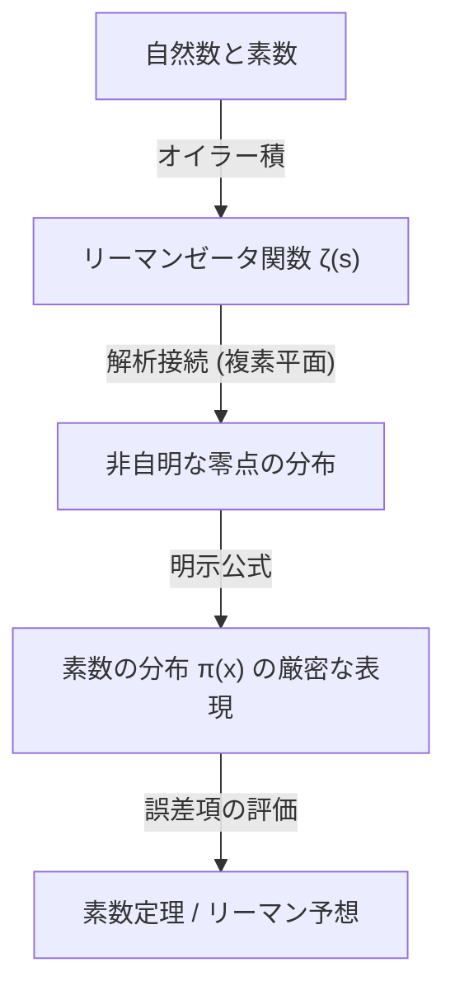

## 1. Pendahuluan: Misteri dan Ketidakteraturan Bilangan Prima

Bilangan prima (Prime Numbers) adalah bilangan asli yang tidak memiliki pembagi positif selain 1 dan bilangan itu sendiri. Deretan bilangan seperti 2, 3, 5, 7, 11, 13, 17, 19... ini adalah hal yang paling mendasar dalam matematika, namun kehadirannya yang paling misterius telah memikat banyak matematikawan sejak zaman kuno. Bilangan prima juga disebut sebagai "atom bilangan", dan setiap bilangan asli dapat dinyatakan secara unik sebagai hasil kali bilangan prima (keunikan faktorisasi prima).

Namun, jika kita melihat sekilas pola kemunculan bilangan prima, tidak ada keteraturan apa pun yang bisa ditemukan di sana. Terkadang mereka muncul berdekatan sebagai bilangan prima kembar seperti 11 dan 13, dan di lain waktu terdapat "gurun bilangan prima" di mana bilangan prima berikutnya tidak muncul meskipun berjarak ribuan atau puluhan ribu angka. Keacakan lokal dan ketidakpastian ini merupakan hambatan besar bagi para matematikawan.

Meskipun demikian, ditemukan bahwa dari perspektif makroskopis, yaitu perilaku global tentang "berapa proporsi bilangan prima yang ada di dalam keseluruhan bilangan", tersembunyi sebuah hukum yang luar biasa indah dan mulus. Itulah yang akan dijelaskan dalam artikel ini, **Teorema Bilangan Prima ([Prime Number Theorem](/id/p/prime-number-theorem/), PNT)**.

## 2. Apa itu Teorema Bilangan Prima? Intuisi Hebat Gauss

Teorema Bilangan Prima adalah teorema yang mendeskripsikan bagaimana jumlah bilangan prima $\pi(x)$ yang kurang dari atau sama dengan bilangan real tertentu $x$, meningkat seiring dengan bertambah besarnya $x$.

Dinyatakan secara matematis, Teorema Bilangan Prima diuraikan sebagai berikut:

$$
\lim_{x \to \infty} \frac{\pi(x)}{x / \ln(x)} = 1
$$

Ini berarti bahwa "jumlah bilangan prima $\pi(x)$ yang kurang dari atau sama dengan $x$ sama secara asimtotik dengan $x / \ln(x)$ ($\pi(x) \sim x / \ln(x)$)" (di mana $\ln(x)$ adalah logaritma natural). Dengan kata lain, jika kita memilih sebuah angka secara acak di sekitar bilangan $N$ yang cukup besar, probabilitas bahwa angka tersebut adalah bilangan prima kira-kira sebesar $1 / \ln(N)$.

### Penemuan oleh Gauss yang Berusia 15 Tahun

Orang pertama yang menyadari fakta luar biasa ini adalah seorang jenius yang saat itu baru berusia 15 tahun, [Carl Friedrich Gauss](/id/p/gauss/). Pada tahun 1792, Gauss mempelajari dengan sungguh-sungguh tabel logaritma dan tabel bilangan prima, lalu membaca kecenderungan di mana kepadatan bilangan prima menurun berbanding terbalik dengan logaritma natural. Dia memprediksi rumus hampiran sebagai berikut.

$$
\pi(x) \approx \operatorname{Li}(x) = \int_{2}^{x} \frac{dt}{\ln t}
$$

$\operatorname{Li}(x)$ ini disebut sebagai **integral logaritmik**. Dibandingkan dengan $x / \ln(x)$, $\operatorname{Li}(x)$ memberikan hampiran yang jauh lebih baik terhadap nilai $\pi(x)$ yang sebenarnya. Konjektur Gauss ini adalah momen ketika umat manusia untuk pertama kalinya melihat sekilas hukum mendalam yang tersembunyi dalam distribusi bilangan prima.

## 3. Teorema Chebyshev dan Kemajuan Parsial

Konjektur Gauss tidak terbukti untuk waktu yang lama, tetapi memasuki pertengahan abad ke-19, matematikawan Rusia Pafnuty Chebyshev membawa kemajuan besar. Dalam makalahnya pada tahun 1848 dan 1850, Chebyshev secara ketat membuktikan bahwa $\pi(x)$ berada pada orde yang sama dengan $x / \ln(x)$.

Secara spesifik, untuk semua $x$ yang cukup besar, dia menunjukkan bahwa ketidaksamaan berikut berlaku:

$$
0.92129 \frac{x}{\ln x} < \pi(x) < 1.10555 \frac{x}{\ln x}
$$

Chebyshev juga membuktikan bahwa jika limit dari $\pi(x) / (x/\ln x)$ ada, maka limit itu harus bernilai 1. Namun, dia tidak sampai pada titik membuktikan keberadaan limit itu sendiri (yakni pembuktian lengkap dari Teorema Bilangan Prima).

## 4. Fungsi Zeta Riemann dan Pengenalan Analisis Kompleks

Terobosan terbesar menuju pembuktian Teorema Bilangan Prima dibawa oleh [Bernhard Riemann](/id/p/riemann/). Dalam makalah terobosan yang diterbitkan pada tahun 1859, "Tentang Jumlah Bilangan Prima di Bawah Magnitudo Tertentu", Riemann menunjukkan bahwa distribusi bilangan prima terkait erat dengan perilaku **fungsi kompleks**.

Apa yang dia gunakan adalah fungsi $\zeta(s)$ yang saat ini disebut sebagai **fungsi zeta Riemann**.

$$
\zeta(s) = \sum_{n=1}^{\infty} \frac{1}{n^s} = \prod_{p \text{ prime}} \left( 1 - \frac{1}{p^s} \right)^{-1}
$$

Persamaan ini (representasi produk Euler) menghubungkan jumlah seluruh bilangan bulat dengan hasil kali seluruh bilangan prima, menunjukkan bahwa informasi tentang bilangan prima sepenuhnya terkodekan di dalam fungsi zeta.

Riemann memperluas (perpanjangan analitik) variabel $s$ ke dalam bilangan kompleks ($s = \sigma + it$), dan menemukan bahwa distribusi "titik nol" (titik di mana $\zeta(s) = 0$) dari fungsi zeta dengan tepat menentukan fluktuasi distribusi bilangan prima (kesalahan antara $\pi(x)$ dan $\operatorname{Li}(x)$).



## 5. Pembuktian Lengkap oleh Hadamard dan de la Vallée Poussin

Sekitar 40 tahun setelah pendekatan terobosan Riemann, pada tahun 1896, Jacques Hadamard dari Prancis dan Charles de la Vallée Poussin dari Belgia, masing-masing secara independen berhasil memberikan pembuktian lengkap untuk Teorema Bilangan Prima.

Inti dari pembuktian mereka adalah menunjukkan bahwa "Fungsi zeta $\zeta(s)$ tidak memiliki titik nol pada garis $\operatorname{Re}(s) = 1$ di bidang kompleks". Dengan menggunakan alat yang kuat dari analisis kompleks (seperti [Teorema Integral Cauchy](/id/p/cauchys-integral-theorem/)), Teorema Bilangan Prima diturunkan dari ketiadaan titik nol ini.

Dengan ini, hukum distribusi asimtotik dari bilangan prima yang dikonjekturkan oleh Gauss pada usia 15 tahun, setelah melewati waktu lebih dari 100 tahun, akhirnya ditetapkan secara matematis sebagai sebuah "teorema".

## 6. Hipotesis Riemann dan Suku Kesalahan Teorema Bilangan Prima

Bahkan setelah Teorema Bilangan Prima dibuktikan, eksplorasi tentang bilangan prima belum berakhir. Fokus saat ini adalah pada masalah: "Seberapa kecil perbedaan (kesalahan) antara $\pi(x)$ dan $\operatorname{Li}(x)$?".

De la Vallée Poussin memberikan evaluasi berikut terkait suku kesalahan:

$$
\pi(x) = \operatorname{Li}(x) + O\left(x e^{-c\sqrt{\ln x}}\right)
$$

Namun, jika konjektur yang dibuat oleh Riemann sendiri dalam makalahnya pada tahun 1859 (**Hipotesis Riemann**) benar, kesalahan ini akan menjadi jauh lebih kecil. Hipotesis Riemann menyatakan bahwa "Semua titik nol non-trivial dari fungsi zeta terletak pada satu garis lurus $\operatorname{Re}(s) = 1/2$".

Jika Hipotesis Riemann benar, maka suku kesalahan dievaluasi sebagai berikut:

$$
\pi(x) = \operatorname{Li}(x) + O(\sqrt{x} \ln x)
$$

Ini berarti bahwa distribusi bilangan prima (meskipun memiliki keacakan) tertata se-teratur mungkin. Hipotesis Riemann, sebagai salah satu masalah terpenting dan belum terpecahkan dalam matematika modern, masih terus ditantang oleh banyak matematikawan hingga saat ini.

## 7. Aplikasi dalam Ilmu Komputer dan Pengujian Keprimaan

Teori bilangan prima tidak hanya terbatas pada dunia matematika murni. Dalam masyarakat digital modern, bilangan prima menopang fondasi teori kriptografi (khususnya kriptografi kunci publik).

Misalnya, **Kriptografi RSA**, yang memungkinkan komunikasi aman di internet, memanfaatkan sifat di mana "Sangat mudah untuk mengalikan dua bilangan prima raksasa, tetapi sangat sulit untuk memfaktorkan hasil kali tersebut kembali menjadi bilangan prima asalnya".

Untuk menghasilkan kunci dalam kriptografi RSA, bilangan prima raksasa dengan ratusan digit (ribuan bit) harus ditemukan dengan cepat. Di sinilah Teorema Bilangan Prima memainkan peran penting. Menurut Teorema Bilangan Prima, probabilitas bahwa suatu bilangan di sekitar $N$ adalah bilangan prima sebesar $1 / \ln(N)$. Oleh karena itu, jika kita memilih angka secara acak di sekitar angka 2048-bit (sekitar $10^{616}$), dengan mencoba sekitar $616 \times \ln(10) \approx 1418$ angka, kita hampir pasti dapat menemukan satu bilangan prima. Justru karena adanya Teorema Bilangan Prima inilah, algoritma untuk menemukan bilangan prima raksasa dijamin akan selesai dalam waktu yang realistis.

### Uji Keprimaan Miller-Rabin

Untuk menguji secara cepat apakah sebuah bilangan raksasa merupakan bilangan prima atau bukan, alih-alih pembagian percobaan, digunakanlah metode pengujian keprimaan probabilistik. Salah satu yang paling representatif adalah **Uji Keprimaan Miller-Rabin**.

Berikut adalah contoh implementasi sederhana dari Uji Keprimaan Miller-Rabin dalam Python.

```python
import random

def miller_rabin_test(n, k=5):
    """
    ミラー・ラビン素数判定法
    n: 判定する整数
    k: テストを繰り返す回数（精度を決定）
    戻り値: True ならおそらく素数、False なら合成数
    """
    if n == 2 or n == 3:
        return True
    if n <= 1 or n % 2 == 0:
        return False

    # n - 1 = d * 2^s となるように d と s を求める
    s = 0
    d = n - 1
    while d % 2 == 0:
        s += 1
        d //= 2

    for _ in range(k):
        a = random.randrange(2, n - 1)
        x = pow(a, d, n)
        if x == 1 or x == n - 1:
            continue
        
        for _ in range(s - 1):
            x = pow(x, 2, n)
            if x == n - 1:
                break
        else:
            return False  # 合成数であることが確定
            
    return True  # おそらく素数

# テスト
print(f"997 is prime? {miller_rabin_test(997)}")
print(f"1001 is prime? {miller_rabin_test(1001)}")
```

Algoritma ini merupakan perluasan dari [Teorema Kecil Fermat](/id/p/fermats-little-theorem/), dan probabilitas bahwa ia salah mengidentifikasi sebuah bilangan komposit sebagai bilangan prima dapat dikurangi secara eksponensial dengan meningkatkan jumlah tes $k$ (probabilitas kesalahan identifikasi kurang dari atau sama dengan $4^{-k}$).

## 8. Kesimpulan: Bilangan Prima Sebagai Sandi Alam Semesta

Teorema Bilangan Prima menunjukkan filosofi mendalam dalam matematika bahwa "Hal-hal yang tampak sepenuhnya tak beraturan pada tingkat individu, ketika dikumpulkan secara keseluruhan, akan menghasilkan keteraturan yang sangat canggih".

Mulai dari intuisi Gauss, berlanjut ke analisis tekun Chebyshev, lompatan Riemann ke bidang kompleks, hingga pembuktian akhir oleh Hadamard dan de la Vallée Poussin, sejarah Teorema Bilangan Prima tidak lain adalah sejarah kecerdasan umat manusia itu sendiri.

Ketika kita berbelanja dengan aman di internet, bilangan-bilangan prima dengan ratusan digit dihitung secara diam-diam di sana untuk melindungi keamanan informasi. Bilangan prima, yang mulai dieksplorasi oleh matematikawan Yunani kuno ribuan tahun yang lalu, kini telah berevolusi menjadi teknologi dasar yang menopang infrastruktur masyarakat modern.

Akankah tiba harinya ketika wujud asli yang tersembunyi dalam distribusi bilangan prima (Hipotesis Riemann) akan terungkap sepenuhnya? Sandi terbesar yang ditinggalkan oleh alam semesta ini masih belum terpecahkan seutuhnya. Namun, melalui lensa yang kuat dari Teorema Bilangan Prima, kita dengan pasti mampu menangkap garis besar dari hukumnya yang indah tersebut.
