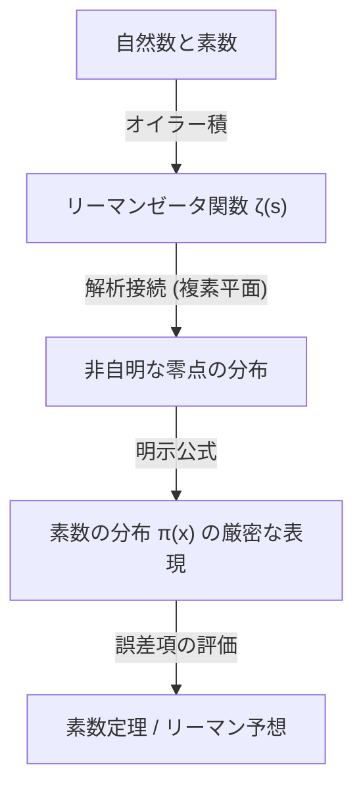

## 1. 시작하며: 소수의 신비와 불규칙성

소수(Prime Numbers)는 1과 자기 자신 외에는 양의 약수를 가지지 않는 자연수입니다. 2, 3, 5, 7, 11, 13, 17, 19... 로 이어지는 이 수의 나열은 수학에서 가장 기본적이면서도 가장 신비로운 존재로서 옛날부터 많은 수학자들을 매료시켜 왔습니다. 소수는 '수의 원자'라고도 불리며, 모든 자연수는 소수들의 곱으로 유일하게 나타낼 수 있습니다(소인수분해의 유일성).

하지만 소수의 출현 패턴을 언뜻 보면 거기에서 어떠한 규칙성도 찾아볼 수 없습니다. 어떨 때는 11과 13처럼 쌍둥이 소수로서 밀집해서 나타나고, 또 어떨 때는 수천, 수만 번을 떨어져도 다음 소수가 나타나지 않는 '소수의 사막'이 존재합니다. 이 국소적인 무작위성과 예측 불가능성은 수학자들에게 있어 커다란 벽이었습니다.

그럼에도 불구하고 거시적인 관점, 즉 '전체 수 중에서 소수가 어느 정도의 비율로 존재하는가' 하는 대국적인 움직임에는 놀랍도록 아름답고 매끄러운 법칙이 숨겨져 있다는 사실이 발견되었습니다. 그것이 본 기사에서 해설할 **소수 정리([Prime Number Theorem](/ko/p/prime-number-theorem/), PNT)**입니다.

## 2. 소수 정리란 무엇인가? 가우스의 위대한 직관

소수 정리란 주어진 실수 $x$ 이하의 소수의 개수 $\pi(x)$가, $x$가 커짐에 따라 어떻게 증가하는지를 서술하는 정리입니다.

수학적으로 표현하면, 소수 정리는 다음과 같이 서술할 수 있습니다:

$$
\lim_{x \to \infty} \frac{\pi(x)}{x / \ln(x)} = 1
$$

이는 '$x$ 이하의 소수의 개수 $\pi(x)$는, $x / \ln(x)$에 점근적으로 같다($\pi(x) \sim x / \ln(x)$)'는 것을 의미합니다(여기서 $\ln(x)$는 자연로그입니다). 바꿔 말하면, 어떤 충분히 큰 수 $N$ 부근에서 무작위로 수를 골랐을 때, 그것이 소수일 확률은 대략 $1 / \ln(N)$이 된다는 것입니다.

### 15세의 가우스가 발견하다

이 놀라운 사실을 처음 깨달은 것은 당시 불과 15세였던 천재 [카를 프리드리히 가우스](/ko/p/gauss/)(Carl Friedrich Gauss)였습니다. 1792년, 가우스는 로그표와 소수표를 열심히 조사하여 소수의 밀도가 자연로그에 반비례하여 감소해 가는 경향을 읽어냈습니다. 그는 다음과 같은 근사식을 추측했습니다.

$$
\pi(x) \approx \operatorname{Li}(x) = \int_{2}^{x} \frac{dt}{\ln t}
$$

이 $\operatorname{Li}(x)$는 **로그 적분**이라고 불립니다. $x / \ln(x)$보다 $\operatorname{Li}(x)$ 쪽이 실제 $\pi(x)$에 대해 훨씬 더 좋은 근사를 제공합니다. 가우스의 이 추측은 소수의 분포에 숨겨진 깊은 법칙성을 인류가 처음으로 엿본 순간이었습니다.

## 3. 체비쇼프의 정리와 부분적 진전

가우스의 추측은 오랫동안 증명되지 않았으나, 19세기 중반에 접어들어 러시아의 수학자 파프누티 체비쇼프(Pafnuty Chebyshev)가 큰 진전을 가져왔습니다. 1848년과 1850년의 논문에서 체비쇼프는 $\pi(x)$가 $x / \ln(x)$와 같은 차수(order)임을 엄밀하게 증명했습니다.

구체적으로는, 충분히 큰 모든 $x$에 대해 다음 부등식이 성립함을 보여주었습니다:

$$
0.92129 \frac{x}{\ln x} < \pi(x) < 1.10555 \frac{x}{\ln x}
$$

체비쇼프는 만약 $\pi(x) / (x/\ln x)$의 극한이 존재한다면 그것은 반드시 1이 되어야 한다는 것도 증명했습니다. 그러나 극한 그 자체가 존재한다는 것(즉 소수 정리의 완전한 증명)을 보여주지는 못했습니다.

## 4. 리만의 제타 함수와 복소해석학의 도입

소수 정리 증명을 향한 가장 큰 돌파구는 [베른하르트 리만](/ko/p/riemann/)(Bernhard Riemann)에 의해 마련되었습니다. 1859년에 발표된 획기적인 논문 '주어진 수보다 작은 소수의 개수에 대하여'에서 리만은 소수의 분포와 **복소함수**의 움직임이 깊게 결부되어 있다는 것을 보여주었습니다.

그가 사용한 것이 오늘날 **리만 제타 함수**라고 불리는 함수 $\zeta(s)$입니다.

$$
\zeta(s) = \sum_{n=1}^{\infty} \frac{1}{n^s} = \prod_{p \text{ prime}} \left( 1 - \frac{1}{p^s} \right)^{-1}
$$

이 등식(오일러 곱 표현)은 정수 전체의 합과 소수 전체의 곱을 연결하는 것으로, 소수의 정보가 제타 함수 안에 완전히 암호화되어 있다는 것을 보여줍니다.

리만은 변수 $s$를 복소수($s = \sigma + it$)로 확장(해석적 연속)하여 제타 함수의 '영점'($\zeta(s) = 0$이 되는 점) 분포가 소수 분포의 요동($\pi(x)$와 $\operatorname{Li}(x)$의 오차)을 정확하게 결정한다는 사실을 발견했습니다.



## 5. 아다마르와 드 라 발레 푸생에 의한 완전한 증명

리만의 획기적인 접근으로부터 약 40년 후인 1896년, 프랑스의 자크 아다마르(Jacques Hadamard)와 벨기에의 샤를 드 라 발레 푸생(Charles de la Vallée Poussin)이 각각 독립적으로 소수 정리의 완전한 증명에 성공했습니다.

그들 증명의 핵심은 '제타 함수 $\zeta(s)$는 복소평면상의 직선 $\operatorname{Re}(s) = 1$ 위에 영점을 갖지 않는다'는 것을 보여주는 것이었습니다. 복소해석학의 강력한 도구([코시의 적분 정리](/ko/p/cauchys-integral-theorem/) 등)를 이용함으로써 이 영점의 비존재로부터 소수 정리가 도출됩니다.

이로써 가우스가 15세에 추측했던 소수의 점근적인 분포 법칙은 100년 이상의 세월을 거쳐 마침내 수학적인 '정리'로서 확립된 것입니다.

## 6. 리만 가설과 소수 정리의 오차항

소수 정리가 증명된 후에도 소수에 관한 탐구는 끝나지 않았습니다. 현재의 초점은 '$\pi(x)$와 $\operatorname{Li}(x)$의 차이(오차)는 얼마나 작은가' 하는 문제입니다.

드 라 발레 푸생은 오차항에 관하여 다음과 같은 평가를 내렸습니다:

$$
\pi(x) = \operatorname{Li}(x) + O\left(x e^{-c\sqrt{\ln x}}\right)
$$

하지만 리만 자신이 1859년 논문에서 세운 추측(**리만 가설**)이 옳다면 이 오차는 극적으로 작아집니다. 리만 가설은 '제타 함수의 비자명한 영점은 모두 일직선 $\operatorname{Re}(s) = 1/2$ 위에 있다'는 것입니다.

만약 리만 가설이 참이라면 오차항은 다음과 같이 평가됩니다:

$$
\pi(x) = \operatorname{Li}(x) + O(\sqrt{x} \ln x)
$$

이는 소수의 분포가 (무작위성을 가지면서도) 가능한 한 가장 규칙적으로 배치되어 있다는 것을 의미합니다. 리만 가설은 현대 수학에서 가장 중요하고 미해결된 난제 중 하나로서 현재도 많은 수학자들이 도전을 계속하고 있습니다.

## 7. 컴퓨터 과학으로의 응용과 소수 판정

소수 이론은 순수 수학의 세계에만 머물지 않습니다. 현대 디지털 사회에서 소수는 암호 이론(특히 공개키 암호)의 근간을 지탱하고 있습니다.

예를 들어 인터넷상의 안전한 통신을 가능하게 하는 **RSA 암호**는 '두 개의 거대한 소수를 곱하는 것은 쉽지만, 그 곱을 원래의 소수로 소인수분해하는 것은 극히 어렵다'는 성질을 이용하고 있습니다.

RSA 암호의 키를 생성하기 위해서는 수백 자리(수천 비트)의 거대한 소수를 빠르게 찾아낼 필요가 있습니다. 여기서 소수 정리가 중요한 역할을 합니다. 소수 정리에 따르면 $N$ 부근의 수가 소수일 확률은 $1 / \ln(N)$입니다. 따라서 2048비트의 수(약 $10^{616}$) 부근에서 무작위로 수를 고를 경우, 약 $616 \times \ln(10) \approx 1418$개의 수를 시도해 보면 거의 확실하게 하나의 소수를 찾을 수 있습니다. 소수 정리가 있기 때문에 거대한 소수를 찾는 알고리즘이 현실적인 시간 내에 종료된다는 것이 보장되는 것입니다.

### 밀러-라빈 소수 판정법

거대한 수가 소수인지 아닌지를 고속으로 판정하기 위해서는, 시험 나눗셈법(trial division)이 아니라 확률적 소수 판정법이 사용됩니다. 그 대표적인 것이 **밀러-라빈(Miller-Rabin) 소수 판정법**입니다.

다음은 파이썬을 이용한 밀러-라빈 소수 판정법의 간단한 구현 예입니다.

```python
import random

def miller_rabin_test(n, k=5):
    """
    ミラー・ラビン素数判定法
    n: 判定する整数
    k: テストを繰り返す回数（精度を決定）
    戻り値: True ならおそらく素数、False なら合成数
    """
    if n == 2 or n == 3:
        return True
    if n <= 1 or n % 2 == 0:
        return False

    # n - 1 = d * 2^s となるように d と s を求める
    s = 0
    d = n - 1
    while d % 2 == 0:
        s += 1
        d //= 2

    for _ in range(k):
        a = random.randrange(2, n - 1)
        x = pow(a, d, n)
        if x == 1 or x == n - 1:
            continue
        
        for _ in range(s - 1):
            x = pow(x, 2, n)
            if x == n - 1:
                break
        else:
            return False  # 合成数であることが確定
            
    return True  # おそらく素数

# テスト
print(f"997 is prime? {miller_rabin_test(997)}")
print(f"1001 is prime? {miller_rabin_test(1001)}")
```

이 알고리즘은 [페르마의 소정리](/ko/p/fermats-little-theorem/)를 확장한 것으로, 합성수임에도 불구하고 소수로 오판할 확률을 테스트 횟수 $k$를 늘림으로써 지수함수적으로 작게 만들 수 있습니다(오판 확률은 $4^{-k}$ 이하).

## 8. 결론: 우주의 암호로서의 소수

소수 정리는 '개별적인 수준에서는 완전히 무질서해 보이는 것이 전체로 모이면 극히 세련된 질서를 만들어 낸다'는 수학에서의 깊은 철학을 보여줍니다.

가우스의 직관에서 시작되어 체비쇼프의 착실한 해석, 리만의 복소평면으로의 도약, 그리고 아다마르와 드 라 발레 푸생에 의한 최종적인 증명에 이르기까지 소수 정리의 역사는 그야말로 인류 지성의 역사 그 자체입니다.

우리가 인터넷에서 안전하게 쇼핑을 할 때, 그곳에서는 수백 자리의 소수들이 조용히 계산되며 정보의 안전을 지키고 있습니다. 수천 년 전 고대 그리스의 수학자들이 탐구를 시작했던 소수는 이제 현대 사회의 인프라를 지탱하는 기반 기술로 진화했습니다.

소수의 분포에 숨겨진 진정한 모습(리만 가설)이 완전히 해명되는 날이 올까요. 우주가 남겨놓은 가장 큰 암호는 아직 완전히 해독되지 않았습니다. 하지만 소수 정리라는 강력한 렌즈를 통해 우리는 그 아름다운 법칙의 윤곽을 분명하게 포착할 수 있게 되었습니다.
