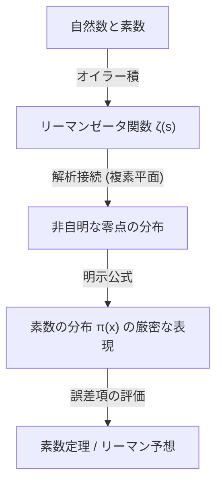

## 1. はじめに：素数の神秘と不規則性

素数（Prime Numbers）は、1と自分自身以外に正の約数を持たない自然数です。2, 3, 5, 7, 11, 13, 17, 19... と続くこの数の列は、数学において最も基本的でありながら、最も神秘的な存在として古くから多くの数学者を魅了してきました。素数は「数の原子」とも呼ばれ、すべての自然数は素数の積として一意に表すことができます（素因数分解の一意性）。

しかし、素数の出現パターンを一見すると、そこにはいかなる規則性も見出せません。ある時は 11 と 13 のように双子素数として密集して現れ、またある時は数千、数万と離れても次の素数が現れない「素数の砂漠」が存在します。この局所的なランダム性と予測不可能性は、数学者たちにとって大きな壁でした。

それにもかかわらず、巨視的な視点、つまり「数全体の中で素数がどれくらいの割合で存在するのか」という大局的な振る舞いには、驚くほど美しく滑らかな法則が隠されていることが発見されました。それが本記事で解説する**素数定理（Prime Number Theorem, PNT）**です。

## 2. 素数定理とは何か？ガウスの偉大なる直感

素数定理とは、与えられた実数 $x$ 以下の素数の個数 $\pi(x)$ が、$x$ が大きくなるにつれてどのように増加するかを記述する定理です。

数学的に表現すると、素数定理は次のように述べられます：

$$
\lim_{x \to \infty} \frac{\pi(x)}{x / \ln(x)} = 1
$$

これは、「$x$ 以下の素数の個数 $\pi(x)$ は、$x / \ln(x)$ に漸近的に等しい（$\pi(x) \sim x / \ln(x)$）」ということを意味しています（ここで $\ln(x)$ は自然対数です）。言い換えれば、ある十分に大きな数 $N$ の付近でランダムに数を選んだとき、それが素数である確率はだいたい $1 / \ln(N)$ になるということです。

### 15歳のガウスによる発見

この驚くべき事実に最初に気付いたのは、当時わずか15歳の天才カール・フリードリヒ・ガウス（Carl Friedrich Gauss）でした。1792年、ガウスは対数表と素数表を熱心に調べ、素数の密度が自然対数に反比例して減少していく傾向を読み取りました。彼は次のような近似式を予想しました。

$$
\pi(x) \approx \operatorname{Li}(x) = \int_{2}^{x} \frac{dt}{\ln t}
$$

この $\operatorname{Li}(x)$ は**対数積分**と呼ばれます。$x / \ln(x)$ よりも $\operatorname{Li}(x)$ の方が、実際の $\pi(x)$ に対してはるかに良い近似を与えます。ガウスのこの予想は、素数の分布に潜む深い法則性を人類が初めて垣間見た瞬間でした。

## 3. チェビシェフの定理と部分的進展

ガウスの予想は長らく証明されませんでしたが、19世紀中頃に入り、ロシアの数学者パフヌティ・チェビシェフ（Pafnuty Chebyshev）が大きな進展をもたらしました。1848年と1850年の論文で、チェビシェフは $\pi(x)$ が $x / \ln(x)$ と同じオーダーであることを厳密に証明しました。

具体的には、十分大きなすべての $x$ に対して、次の不等式が成り立つことを示しました：

$$
0.92129 \frac{x}{\ln x} < \pi(x) < 1.10555 \frac{x}{\ln x}
$$

チェビシェフは、もし $\pi(x) / (x/\ln x)$ の極限が存在するならば、それは必ず 1 にならなければならないことも証明しました。しかし、極限そのものが存在すること（つまり素数定理の完全な証明）を示すには至りませんでした。

## 4. リーマンのゼータ関数と複素解析の導入

素数定理の証明に向けた最大のブレイクスルーは、ベルンハルト・リーマン（Bernhard Riemann）によってもたらされました。1859年に発表された画期的な論文「与えられた数より小さい素数の個数について」の中で、リーマンは素数の分布と**複素関数**の振る舞いが深く結びついていることを示しました。

彼が用いたのが、今日**リーマンゼータ関数**と呼ばれる関数 $\zeta(s)$ です。

$$
\zeta(s) = \sum_{n=1}^{\infty} \frac{1}{n^s} = \prod_{p \text{ prime}} \left( 1 - \frac{1}{p^s} \right)^{-1}
$$

この等式（オイラー積表現）は、整数全体の和と素数全体の積を結びつけるもので、素数の情報がゼータ関数の中に完全にコード化されていることを示しています。

リーマンは、変数 $s$ を複素数（$s = \sigma + it$）に拡張（解析接続）し、ゼータ関数の「零点」（$\zeta(s) = 0$ となる点）の分布が、素数の分布の揺らぎ（$\pi(x)$ と $\operatorname{Li}(x)$ の誤差）を正確に決定することを発見しました。



## 5. アダマールとド・ラ・ヴァレ・プーサンによる完全な証明

リーマンの画期的なアプローチから約40年後の1896年、フランスのジャック・アダマール（Jacques Hadamard）とベルギーのシャルル・ド・ラ・ヴァレ・プーサン（Charles de la Vallée Poussin）が、それぞれ独立に素数定理の完全な証明に成功しました。

彼らの証明の核心は、「ゼータ関数 $\zeta(s)$ は、複素平面上の直線 $\operatorname{Re}(s) = 1$ 上に零点を持たない」ことを示すことでした。複素解析の強力なツール（コーシーの積分定理など）を用いることで、この零点の非存在から素数定理が導かれます。

これにより、ガウスが15歳で予想した素数の漸近的な分布則は、100年以上の時を経てついに数学的な「定理」として確立されたのです。

## 6. リーマン予想と素数定理の誤差項

素数定理が証明された後も、素数に関する探求は終わっていません。現在の焦点は、「$\pi(x)$ と $\operatorname{Li}(x)$ の差（誤差）はどれくらい小さいか」という問題です。

ド・ラ・ヴァレ・プーサンは、誤差項に関する次のような評価を与えました：

$$
\pi(x) = \operatorname{Li}(x) + O\left(x e^{-c\sqrt{\ln x}}\right)
$$

しかし、リーマン自身が1859年の論文で立てた予想（**リーマン予想**）が正しければ、この誤差は劇的に小さくなります。リーマン予想は、「ゼータ関数の非自明な零点はすべて一直線 $\operatorname{Re}(s) = 1/2$ 上にある」というものです。

もしリーマン予想が真であれば、誤差項は次のように評価されます：

$$
\pi(x) = \operatorname{Li}(x) + O(\sqrt{x} \ln x)
$$

これは、素数の分布が（ランダム性を持ちながらも）可能な限り最も規則的に配置されていることを意味しています。リーマン予想は、現代数学において最も重要で未解決の難問の一つとして、現在も多くの数学者が挑戦を続けています。

## 7. コンピュータサイエンスへの応用と素数判定

素数の理論は、純粋数学の世界にとどまりません。現代のデジタル社会において、素数は暗号理論（特に公開鍵暗号）の根幹を支えています。

例えば、インターネット上の安全な通信を可能にしている **RSA暗号** は、「2つの巨大な素数を掛け合わせることは容易だが、その積を元の素数に素因数分解することは極めて困難である」という性質を利用しています。

RSA暗号の鍵を生成するためには、数百桁（数千ビット）の巨大な素数を素早く見つけ出す必要があります。ここで、素数定理が重要な役割を果たします。素数定理によれば、$N$ 付近の数が素数である確率は $1 / \ln(N)$ です。したがって、2048ビットの数（約 $10^{616}$）付近でランダムに数を選んだ場合、約 $616 \times \ln(10) \approx 1418$ 個の数を試せば、ほぼ確実に1つの素数を見つけることができます。素数定理があるからこそ、巨大な素数を見つけるアルゴリズムが現実的な時間で終了することが保証されているのです。

### ミラー・ラビン素数判定法

巨大な数が素数かどうかを高速に判定するためには、試し割り法ではなく、確率的素数判定法が用いられます。その代表が**ミラー・ラビン（Miller-Rabin）素数判定法**です。

以下は、Pythonによるミラー・ラビン素数判定法の簡単な実装例です。

```python
import random

def miller_rabin_test(n, k=5):
    """
    ミラー・ラビン素数判定法
    n: 判定する整数
    k: テストを繰り返す回数（精度を決定）
    戻り値: True ならおそらく素数、False なら合成数
    """
    if n == 2 or n == 3:
        return True
    if n <= 1 or n % 2 == 0:
        return False

    # n - 1 = d * 2^s となるように d と s を求める
    s = 0
    d = n - 1
    while d % 2 == 0:
        s += 1
        d //= 2

    for _ in range(k):
        a = random.randrange(2, n - 1)
        x = pow(a, d, n)
        if x == 1 or x == n - 1:
            continue
        
        for _ in range(s - 1):
            x = pow(x, 2, n)
            if x == n - 1:
                break
        else:
            return False  # 合成数であることが確定
            
    return True  # おそらく素数

# テスト
print(f"997 is prime? {miller_rabin_test(997)}")
print(f"1001 is prime? {miller_rabin_test(1001)}")
```

このアルゴリズムは、フェルマーの小定理を拡張したものであり、合成数であるにもかかわらず素数と誤判定してしまう確率を、テスト回数 $k$ を増やすことで指数関数的に小さくすることができます（誤判定確率は $4^{-k}$ 以下）。

## 8. 結論：宇宙の暗号としての素数

素数定理は、「個々のレベルでは完全に無秩序に見えるものが、全体として集まると極めて洗練された秩序を生み出す」という、数学における深い哲学を示しています。

ガウスの直感から始まり、チェビシェフの地道な解析、リーマンの複素平面への飛躍、そしてアダマールとド・ラ・ヴァレ・プーサンによる最終的な証明に至るまで、素数定理の歴史はまさに人類の知性の歴史そのものです。

私たちがインターネットで安全に買い物をするとき、そこでは数百桁の素数たちが静かに計算され、情報の安全を守っています。何千年も前に古代ギリシャの数学者たちが探求を始めた素数は、今や現代社会のインフラストラクチャを支える基盤技術へと進化しました。

素数の分布に隠された真の姿（リーマン予想）が完全に解明される日は来るのでしょうか。宇宙が書き残した最大の暗号は、いまだに完全には解読されていません。しかし、素数定理という強力なレンズを通して、私たちはその美しい法則の輪郭を確かに捉えることができているのです。
