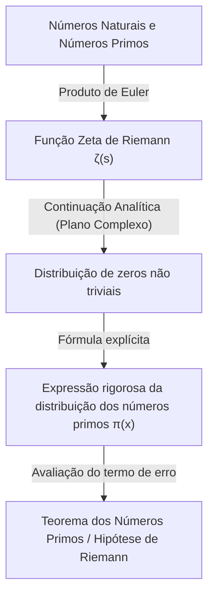

## 1. Introdução: O mistério e a irregularidade dos números primos

Os Números Primos (Prime Numbers) são números naturais que não possuem divisores positivos além de 1 e eles mesmos. A sequência que começa com 2, 3, 5, 7, 11, 13, 17, 19... é a mais fundamental da matemática, mas ao mesmo tempo uma existência misteriosa que fascinou muitos matemáticos desde a antiguidade. Os números primos são frequentemente chamados de "átomos dos números", e todo número natural pode ser expresso de forma única como o produto de números primos (teorema fundamental da aritmética).

No entanto, à primeira vista, não é possível encontrar qualquer regularidade no padrão de aparecimento dos números primos. Às vezes, eles aparecem densamente agrupados como primos gêmeos, como 11 e 13, e outras vezes existe um "deserto de números primos" onde o próximo número primo não aparece por milhares ou dezenas de milhares de números. Essa aleatoriedade local e imprevisibilidade representaram uma grande barreira para os matemáticos.

Apesar disso, em uma perspectiva macroscópica, ou seja, no comportamento global de "qual é a proporção de números primos entre todos os números", descobriu-se que uma lei surpreendentemente bela e suave está oculta. Esse é o **Teorema dos Números Primos ([Prime Number Theorem](/pt/p/prime-number-theorem/), PNT)** que será explicado neste artigo.

## 2. O que é o Teorema dos Números Primos? A grande intuição de Gauss

O teorema dos números primos é um teorema que descreve como o número de números primos $\pi(x)$ menores ou iguais a um dado número real $x$ aumenta à medida que $x$ cresce.

Expresso matematicamente, o teorema dos números primos é formulado da seguinte maneira:

$$
\lim_{x \to \infty} \frac{\pi(x)}{x / \ln(x)} = 1
$$

Isso significa que "o número de números primos $\pi(x)$ menores ou iguais a $x$ é assintoticamente igual a $x / \ln(x)$ ($\pi(x) \sim x / \ln(x)$)" (onde $\ln(x)$ é o logaritmo natural). Em outras palavras, quando escolhemos aleatoriamente um número próximo a um número $N$ suficientemente grande, a probabilidade de que ele seja um número primo é de aproximadamente $1 / \ln(N)$.

### A descoberta por Gauss aos 15 anos

O primeiro a perceber esse fato surpreendente foi o gênio [Carl Friedrich Gauss](/pt/p/gauss/), que tinha apenas 15 anos na época. Em 1792, Gauss estudou avidamente as tabelas de logaritmos e de números primos, e interpretou a tendência de que a densidade dos números primos diminuía de forma inversamente proporcional ao logaritmo natural. Ele conjecturou a seguinte equação de aproximação:

$$
\pi(x) \approx \operatorname{Li}(x) = \int_{2}^{x} \frac{dt}{\ln t}
$$

Este $\operatorname{Li}(x)$ é chamado de **logaritmo integral**. $\operatorname{Li}(x)$ oferece uma aproximação muito melhor para o $\pi(x)$ real do que $x / \ln(x)$. Essa conjectura de Gauss foi o momento em que a humanidade teve o primeiro vislumbre das leis profundas ocultas na distribuição dos números primos.

## 3. Teorema de Chebyshev e o progresso parcial

A conjectura de Gauss permaneceu sem comprovação por muito tempo, mas em meados do século XIX, o matemático russo Pafnuty Chebyshev trouxe um grande avanço. Em artigos de 1848 e 1850, Chebyshev provou rigorosamente que $\pi(x)$ tem a mesma ordem de grandeza que $x / \ln(x)$.

Especificamente, para todo $x$ suficientemente grande, ele mostrou que a seguinte desigualdade é válida:

$$
0.92129 \frac{x}{\ln x} < \pi(x) < 1.10555 \frac{x}{\ln x}
$$

Chebyshev também provou que, se o limite de $\pi(x) / (x/\ln x)$ existe, ele deve ser necessariamente igual a 1. No entanto, ele não conseguiu demonstrar que o limite em si existia (ou seja, a prova completa do teorema dos números primos).

## 4. Função Zeta de Riemann e a introdução da análise complexa

O maior avanço em direção à prova do teorema dos números primos foi trazido por [Bernhard Riemann](/pt/p/riemann/). Em seu artigo revolucionário de 1859, "Sobre o Número de Primos Menores que uma Dada Magnitude", Riemann mostrou que a distribuição dos números primos e o comportamento das **funções complexas** estão profundamente interligados.

O que ele usou foi a função $\zeta(s)$, hoje chamada de **função zeta de Riemann**.

$$
\zeta(s) = \sum_{n=1}^{\infty} \frac{1}{n^s} = \prod_{p \text{ prime}} \left( 1 - \frac{1}{p^s} \right)^{-1}
$$

Essa equação (representação em produto de Euler) conecta a soma de todos os números inteiros e o produto de todos os números primos, indicando que as informações sobre os números primos estão perfeitamente codificadas na função zeta.

Riemann estendeu (continuação analítica) a variável $s$ para números complexos ($s = \sigma + it$) e descobriu que a distribuição dos "zeros" da função zeta (os pontos onde $\zeta(s) = 0$) determina com precisão as flutuações na distribuição dos números primos (o erro entre $\pi(x)$ e $\operatorname{Li}(x)$).



## 5. A prova completa por Hadamard e de la Vallée Poussin

Em 1896, cerca de 40 anos após a abordagem revolucionária de Riemann, o francês Jacques Hadamard e o belga Charles de la Vallée Poussin conseguiram, de forma independente, provar completamente o teorema dos números primos.

O núcleo de suas provas consistia em demonstrar que "a função zeta $\zeta(s)$ não possui zeros na reta $\operatorname{Re}(s) = 1$ no plano complexo". Ao utilizar ferramentas poderosas da análise complexa (como o [teorema integral de Cauchy](/pt/p/cauchys-integral-theorem/)), o teorema dos números primos pôde ser derivado a partir da inexistência desses zeros.

Com isso, a lei de distribuição assintótica dos números primos, que Gauss havia conjecturado aos 15 anos, finalmente se estabeleceu como um "teorema" matemático após mais de 100 anos.

## 6. Hipótese de Riemann e o termo de erro do teorema dos números primos

Mesmo após a comprovação do teorema dos números primos, a exploração sobre os números primos não terminou. O foco atual é o problema de "quão pequena é a diferença (erro) entre $\pi(x)$ e $\operatorname{Li}(x)$".

De la Vallée Poussin forneceu a seguinte avaliação para o termo de erro:

$$
\pi(x) = \operatorname{Li}(x) + O\left(x e^{-c\sqrt{\ln x}}\right)
$$

No entanto, se a conjectura que o próprio Riemann apresentou em seu artigo de 1859 (a **Hipótese de Riemann**) for correta, esse erro será drasticamente menor. A Hipótese de Riemann afirma que "todos os zeros não triviais da função zeta estão na mesma linha $\operatorname{Re}(s) = 1/2$".

Se a Hipótese de Riemann for verdadeira, o termo de erro será avaliado da seguinte forma:

$$
\pi(x) = \operatorname{Li}(x) + O(\sqrt{x} \ln x)
$$

Isso significa que a distribuição dos números primos (apesar de sua aleatoriedade) está organizada da maneira mais regular possível. A Hipótese de Riemann permanece como um dos problemas não resolvidos mais importantes e difíceis da matemática moderna, com muitos matemáticos ainda continuando a desafiá-la.

## 7. Aplicação na ciência da computação e testes de primalidade

A teoria dos números primos não se restringe ao mundo da matemática pura. Na sociedade digital moderna, os números primos sustentam os fundamentos da teoria da criptografia (especialmente a criptografia de chave pública).

Por exemplo, a **criptografia RSA**, que possibilita comunicações seguras na internet, utiliza a propriedade de que "é fácil multiplicar dois números primos gigantes, mas é extremamente difícil fatorar o produto resultante de volta aos números primos originais".

Para gerar chaves de criptografia RSA, é necessário encontrar rapidamente números primos gigantescos com centenas de dígitos (milhares de bits). Aqui, o teorema dos números primos desempenha um papel crucial. De acordo com o teorema dos números primos, a probabilidade de um número em torno de $N$ ser primo é $1 / \ln(N)$. Portanto, se escolhermos números aleatoriamente em torno de um número de 2048 bits (cerca de $10^{616}$), testando aproximadamente $616 \times \ln(10) \approx 1418$ números, quase certamente encontraremos um número primo. É graças à existência do teorema dos números primos que podemos garantir que algoritmos para encontrar números primos gigantes terminem em um tempo razoável.

### Teste de primalidade de Miller-Rabin

Para determinar rapidamente se um número gigantesco é primo, não se utiliza a divisão por tentativa, mas sim testes de primalidade probabilísticos. O mais proeminente é o **Teste de primalidade de Miller-Rabin**.

Abaixo está um exemplo simples de implementação em Python do teste de primalidade de Miller-Rabin.

```python
import random

def miller_rabin_test(n, k=5):
    """
    Teste de primalidade de Miller-Rabin
    n: inteiro a ser testado
    k: número de vezes para repetir o teste (determina a precisão)
    Retorno: True se provavelmente for primo, False se for um número composto
    """
    if n == 2 or n == 3:
        return True
    if n <= 1 or n % 2 == 0:
        return False

    # Encontrar d e s tal que n - 1 = d * 2^s
    s = 0
    d = n - 1
    while d % 2 == 0:
        s += 1
        d //= 2

    for _ in range(k):
        a = random.randrange(2, n - 1)
        x = pow(a, d, n)
        if x == 1 or x == n - 1:
            continue
        
        for _ in range(s - 1):
            x = pow(x, 2, n)
            if x == n - 1:
                break
        else:
            return False  # Confirmado como número composto
            
    return True  # Provavelmente primo

# Testes
print(f"997 is prime? {miller_rabin_test(997)}")
print(f"1001 is prime? {miller_rabin_test(1001)}")
```

Este algoritmo é uma extensão do Pequeno Teorema de Fermat, e a probabilidade de julgar erroneamente um número composto como primo pode ser reduzida exponencialmente aumentando o número de testes $k$ (a probabilidade de erro é menor ou igual a $4^{-k}$).

## 8. Conclusão: Os números primos como um código do universo

O teorema dos números primos ilustra uma filosofia profunda na matemática: "algo que parece completamente desordenado no nível individual cria uma ordem extremamente sofisticada quando visto como um todo".

Começando com a intuição de Gauss, a análise persistente de Chebyshev, o salto de Riemann para o plano complexo e culminando nas provas finais de Hadamard e de la Vallée Poussin, a história do teorema dos números primos é, de fato, a própria história da inteligência humana.

Quando fazemos compras seguras na internet, números primos de centenas de dígitos estão sendo calculados silenciosamente nos bastidores, protegendo a segurança das nossas informações. Os números primos, cuja exploração começou há milhares de anos pelos antigos matemáticos gregos, agora evoluíram para uma tecnologia fundamental que sustenta a infraestrutura da nossa sociedade moderna.

Chegará o dia em que a verdadeira forma (a Hipótese de Riemann) oculta na distribuição dos números primos será completamente desvendada? O maior código deixado pelo universo ainda não foi totalmente decifrado. No entanto, através da poderosa lente do teorema dos números primos, podemos certamente vislumbrar os contornos dessa bela lei.
