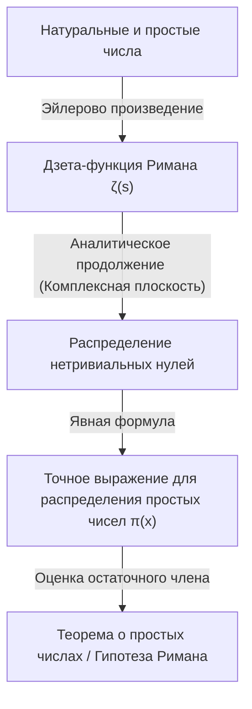

## 1. Введение: Таинственность и нерегулярность простых чисел

Простые числа (Prime Numbers) — это натуральные числа, имеющие ровно два различных натуральных делителя: единицу и само себя. Ряд этих чисел, продолжающийся как 2, 3, 5, 7, 11, 13, 17, 19..., является наиболее фундаментальным и в то же время самым мистическим объектом в математике, издревле очаровывающим многих математиков. Простые числа также называют «атомами чисел», поскольку любое натуральное число можно однозначно представить в виде произведения простых чисел (основная теорема арифметики об однозначности разложения на множители).

Однако на первый взгляд в шаблоне появления простых чисел не удается обнаружить какой-либо закономерности. Иногда они появляются плотно друг к другу в виде простых чисел-близнецов, таких как 11 и 13, а иногда существуют «пустыни простых чисел», когда следующее простое число не появляется даже через тысячи или десятки тысяч чисел. Эта локальная случайность и непредсказуемость стала серьезным препятствием для математиков.

Несмотря на это, было обнаружено, что с макроскопической точки зрения, то есть в глобальном поведении, отвечающем на вопрос «какова доля простых чисел среди всех чисел», скрывается удивительно красивая и гладкая закономерность. Это и есть **теорема о распределении простых чисел ([Prime Number Theorem](/ru/p/prime-number-theorem/), PNT)**, которая будет рассмотрена в этой статье.

## 2. Что такое теорема о распределении простых чисел? Великая интуиция Гаусса

Теорема о распределении простых чисел — это теорема, описывающая, как количество простых чисел $\pi(x)$, не превышающих заданного действительного числа $x$, увеличивается с ростом $x$.

В математическом выражении теорема о распределении простых чисел формулируется следующим образом:

$$
\lim_{x \to \infty} \frac{\pi(x)}{x / \ln(x)} = 1
$$

Это означает, что «количество простых чисел $\pi(x)$, меньших или равных $x$, асимптотически равно $x / \ln(x)$ ($\pi(x) \sim x / \ln(x)$)» (здесь $\ln(x)$ — натуральный логарифм). Иными словами, если случайным образом выбрать число в окрестности достаточно большого числа $N$, вероятность того, что оно окажется простым, составит примерно $1 / \ln(N)$.

### Открытие, сделанное 15-летним Гауссом

Первым, кто заметил этот удивительный факт, был гениальный [Карл Фридрих Гаусс](/ru/p/gauss/) (Carl Friedrich Gauss), которому тогда было всего 15 лет. В 1792 году Гаусс с энтузиазмом изучил таблицы логарифмов и таблицы простых чисел, уловив тенденцию уменьшения плотности простых чисел обратно пропорционально натуральному логарифму. Он выдвинул гипотезу о следующем приближении:

$$
\pi(x) \approx \operatorname{Li}(x) = \int_{2}^{x} \frac{dt}{\ln t}
$$

Это $\operatorname{Li}(x)$ называется **интегральным логарифмом**. По сравнению с $x / \ln(x)$, $\operatorname{Li}(x)$ дает гораздо лучшее приближение к фактическому $\pi(x)$. Эта гипотеза Гаусса стала моментом, когда человечество впервые увидело глубокую закономерность, скрытую в распределении простых чисел.

## 3. Теорема Чебышева и частичный прогресс

Гипотеза Гаусса долгое время оставалась недоказанной, но в середине 19 века российский математик Пафнутий Чебышев (Pafnuty Chebyshev) добился значительного прогресса. В своих статьях 1848 и 1850 годов Чебышев строго доказал, что $\pi(x)$ имеет тот же порядок, что и $x / \ln(x)$.

В частности, он показал, что для всех достаточно больших $x$ выполняется следующее неравенство:

$$
0.92129 \frac{x}{\ln x} < \pi(x) < 1.10555 \frac{x}{\ln x}
$$

Чебышев также доказал, что если предел $\pi(x) / (x/\ln x)$ существует, то он обязательно должен быть равен 1. Однако он не смог показать существование самого предела (то есть дать полное доказательство теоремы о распределении простых чисел).

## 4. Дзета-функция Римана и введение комплексного анализа

Величайший прорыв на пути к доказательству теоремы о распределении простых чисел был сделан Бернхардом Риманом (Bernhard Riemann). В своей новаторской статье «О числе простых чисел, не превышающих данной величины», опубликованной в 1859 году, Риман показал, что распределение простых чисел глубоко связано с поведением **комплексных функций**.

Он использовал функцию $\zeta(s)$, которая сегодня называется **дзета-функцией Римана**.

$$
\zeta(s) = \sum_{n=1}^{\infty} \frac{1}{n^s} = \prod_{p \text{ prime}} \left( 1 - \frac{1}{p^s} \right)^{-1}
$$

Это уравнение (представление в виде эйлерова произведения) связывает сумму по всем целым числам и произведение по всем простым числам, показывая, что информация о простых числах полностью закодирована в дзета-функции.

Риман расширил (аналитически продолжил) переменную $s$ на комплексные числа ($s = \sigma + it$) и обнаружил, что распределение «нулей» дзета-функции (точек, где $\zeta(s) = 0$) точно определяет флуктуации в распределении простых чисел (погрешность между $\pi(x)$ и $\operatorname{Li}(x)$).



## 5. Полное доказательство Адамара и де ла Валле-Пуссена

Примерно через 40 лет после новаторского подхода Римана, в 1896 году, француз Жак Адамар (Jacques Hadamard) и бельгиец Шарль де ла Валле-Пуссен (Charles de la Vallée Poussin) независимо друг от друга успешно завершили полное доказательство теоремы о распределении простых чисел.

Суть их доказательства заключалась в том, чтобы показать, что «дзета-функция $\zeta(s)$ не имеет нулей на прямой $\operatorname{Re}(s) = 1$ в комплексной плоскости». Используя мощные инструменты комплексного анализа (такие как [интегральная теорема Коши](/ru/p/cauchys-integral-theorem/)), из отсутствия этих нулей выводится теорема о распределении простых чисел.

Таким образом, асимптотический закон распределения простых чисел, предсказанный Гауссом в 15 лет, спустя более 100 лет, наконец, утвердился как математическая «теорема».

## 6. Гипотеза Римана и остаточный член теоремы о простых числах

Даже после того, как теорема о распределении простых чисел была доказана, исследования простых чисел не закончились. В настоящее время основное внимание уделяется проблеме «насколько мала разница (погрешность) между $\pi(x)$ и $\operatorname{Li}(x)$».

Де ла Валле-Пуссен дал следующую оценку остаточного члена:

$$
\pi(x) = \operatorname{Li}(x) + O\left(x e^{-c\sqrt{\ln x}}\right)
$$

Однако, если гипотеза, выдвинутая самим Риманом в его статье 1859 года (**гипотеза Римана**), верна, эта погрешность станет кардинально меньше. Гипотеза Римана утверждает, что «все нетривиальные нули дзета-функции лежат на одной прямой $\operatorname{Re}(s) = 1/2$».

Если гипотеза Римана верна, остаточный член оценивается следующим образом:

$$
\pi(x) = \operatorname{Li}(x) + O(\sqrt{x} \ln x)
$$

Это означает, что распределение простых чисел (несмотря на случайность) расположено настолько регулярно, насколько это вообще возможно. Гипотеза Римана остается одной из самых важных и нерешенных проблем современной математики, над которой до сих пор бьются многие математики.

## 7. Применение в информатике и проверка на простоту

Теория простых чисел не ограничивается миром чистой математики. В современном цифровом обществе простые числа служат основой криптографии (в частности, криптографии с открытым ключом).

Например, алгоритм **RSA**, который обеспечивает безопасную связь в Интернете, использует то свойство, что «легко перемножить два гигантских простых числа, но разложить их произведение на исходные простые множители крайне сложно».

Для генерации ключей шифрования RSA необходимо быстро находить гигантские простые числа из сотен цифр (тысяч бит). Здесь важную роль играет теорема о распределении простых чисел. Согласно ей, вероятность того, что число около $N$ является простым, составляет $1 / \ln(N)$. Следовательно, если случайным образом выбирать числа в окрестности 2048-битного числа (около $10^{616}$), то достаточно проверить примерно $616 \times \ln(10) \approx 1418$ чисел, чтобы почти наверняка найти одно простое число. Именно наличие теоремы о распределении простых чисел гарантирует, что [алгоритмы поиска](/ru/p/search-algorithms-linear-binary-hash-table-principles/) гигантских простых чисел завершатся за приемлемое время.

### Тест Миллера — Рабина на простоту

Для быстрой проверки, является ли гигантское число простым, используется не метод пробного деления, а вероятностные тесты простоты. Наиболее известным из них является **тест Миллера — Рабина на простоту**.

Ниже приведен пример простой реализации теста Миллера — Рабина на Python.

```python
import random

def miller_rabin_test(n, k=5):
    """
    Тест Миллера — Рабина на простоту
    n: проверяемое целое число
    k: количество итераций теста (определяет точность)
    Возвращает: True, если число вероятно простое, False, если составное
    """
    if n == 2 or n == 3:
        return True
    if n <= 1 or n % 2 == 0:
        return False

    # Найти d и s такие, что n - 1 = d * 2^s
    s = 0
    d = n - 1
    while d % 2 == 0:
        s += 1
        d //= 2

    for _ in range(k):
        a = random.randrange(2, n - 1)
        x = pow(a, d, n)
        if x == 1 or x == n - 1:
            continue
        
        for _ in range(s - 1):
            x = pow(x, 2, n)
            if x == n - 1:
                break
        else:
            return False  # Точно составное число
            
    return True  # Вероятно простое число

# Тестирование
print(f"997 is prime? {miller_rabin_test(997)}")
print(f"1001 is prime? {miller_rabin_test(1001)}")
```

Этот алгоритм является расширением малой теоремы Ферма, и вероятность того, что составное число будет ошибочно признано простым, можно экспоненциально уменьшить, увеличивая количество тестов $k$ (вероятность ошибки составляет не более $4^{-k}$).

## 8. Заключение: Простые числа как шифр Вселенной

Теорема о распределении простых чисел демонстрирует глубокую философскую мысль в математике: «то, что на индивидуальном уровне кажется полностью хаотичным, при объединении в единое целое порождает в высшей степени утонченный порядок».

Начиная от интуиции Гаусса, через кропотливый анализ Чебышева, скачок Римана в комплексную плоскость и вплоть до окончательного доказательства Адамара и де ла Валле-Пуссена, история теоремы о распределении простых чисел — это поистине история самого человеческого интеллекта.

Когда мы безопасно совершаем покупки в Интернете, там тихо вычисляются сотни цифр простых чисел, защищая безопасность информации. Простые числа, исследование которых началось тысячелетия назад древнегреческими математиками, теперь эволюционировали в базовую технологию, поддерживающую инфраструктуру современного общества.

Настанет ли день, когда истинная картина, скрытая в распределении простых чисел (гипотеза Римана), будет полностью раскрыта? Величайший шифр, оставленный Вселенной, до сих пор полностью не расшифрован. Однако через мощную линзу теоремы о распределении простых чисел мы можем уверенно улавливать контуры этой прекрасной закономерности.
