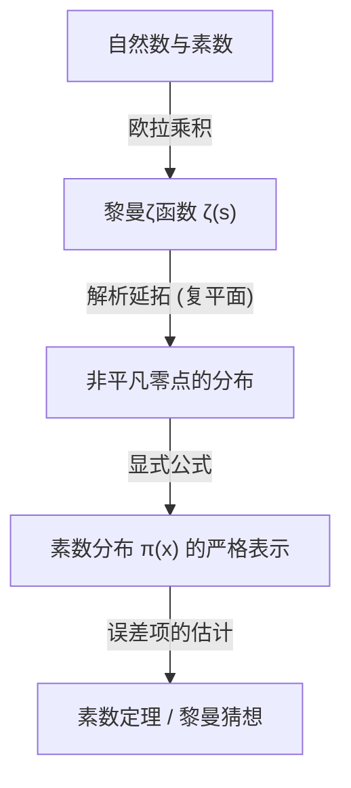

## 1. 引言：素数的神秘与不规则性

素数（Prime Numbers）是除了1和自身之外没有正因数的自然数。2, 3, 5, 7, 11, 13, 17, 19... 这个数列作为数学中最基础却又最神秘的存在，自古以来就吸引了无数数学家。素数也被称为“数的原子”，所有的自然数都可以唯一地表示为素数的乘积（素因数分解的唯一性）。

然而，乍看之下素数的出现模式，我们无法从中发现任何规律。有时它们会像11和13一样作为孪生素数密集出现，有时又会存在即使相隔数千、数万也没有下一个素数出现的“素数沙漠”。这种局部的随机性和不可预测性，对数学家们来说是一堵巨大的墙。

尽管如此，从宏观的视角，也就是关于“在所有数中素数存在多大比例”的全局行为中，人们发现隐藏着令人惊叹的美丽且平滑的法则。这就是本文将要解说的**素数定理（[Prime Number Theorem](/zh-cn/p/prime-number-theorem/), PNT）**。

## 2. 什么是素数定理？高斯的伟大直觉

素数定理是一个描述在给定的实数 $x$ 以下的素数个数 $\pi(x)$ ，随着 $x$ 的增大将如何增加的定理。

用数学表达的话，素数定理可以如下表述：

$$
\lim_{x \to \infty} \frac{\pi(x)}{x / \ln(x)} = 1
$$

这意味着，“$x$ 以下的素数个数 $\pi(x)$ ，渐近地等于 $x / \ln(x)$（$\pi(x) \sim x / \ln(x)$）”（这里的 $\ln(x)$ 是自然对数）。换句话说，当在一个足够大的数 $N$ 附近随机选择一个数时，它是素数的概率大约为 $1 / \ln(N)$。

### 15岁高斯的发现

最早注意到这一惊人事实的，是当时年仅15岁的天才[卡尔·弗里德里希·高斯](/zh-cn/p/gauss/)（Carl Friedrich Gauss）。1792年，高斯热心地研究了对数表和素数表，读出了素数的密度与自然对数成反比递减的趋势。他猜测了以下近似公式。

$$
\pi(x) \approx \operatorname{Li}(x) = \int_{2}^{x} \frac{dt}{\ln t}
$$

这个 $\operatorname{Li}(x)$ 被称为**对数积分**。对于实际的 $\pi(x)$，$\operatorname{Li}(x)$ 给出的近似要比 $x / \ln(x)$ 好得多。高斯的这一猜想，是人类首次瞥见隐藏在素数分布中的深刻规律的瞬间。

## 3. 切比雪夫定理与局部进展

高斯的猜想在很长一段时间内未能得到证明，但进入19世纪中叶，俄罗斯数学家帕夫努季·切比雪夫（Pafnuty Chebyshev）带来了巨大的进展。在1848年和1850年的论文中，切比雪夫严格证明了 $\pi(x)$ 与 $x / \ln(x)$ 是同阶的。

具体来说，他证明了对于所有足够大的 $x$，以下不等式成立：

$$
0.92129 \frac{x}{\ln x} < \pi(x) < 1.10555 \frac{x}{\ln x}
$$

切比雪夫还证明了，如果 $\pi(x) / (x/\ln x)$ 的极限存在，那么它必定为 1。然而，他未能证明极限本身的存在（即素数定理的完整证明）。

## 4. 黎曼ζ函数与复分析的引入

通向素数定理证明的最大突破，是由伯恩哈德·黎曼（Bernhard Riemann）带来的。在1859年发表的划时代论文《论小于给定数值的素数个数》中，黎曼展示了素数的分布与**复变函数**的行为有着深刻的联系。

他使用的是今天被称为**黎曼ζ（Zeta）函数**的函数 $\zeta(s)$。

$$
\zeta(s) = \sum_{n=1}^{\infty} \frac{1}{n^s} = \prod_{p \text{ prime}} \left( 1 - \frac{1}{p^s} \right)^{-1}
$$

这个等式（欧拉乘积表示）将全体整数的和与全体素数的积联系在一起，表明素数的信息完全编码在了ζ函数中。

黎曼将变量 $s$ 扩展（解析延拓）为复数（$s = \sigma + it$），并发现ζ函数的“零点”（即使 $\zeta(s) = 0$ 的点）的分布，精确地决定了素数分布的波动（$\pi(x)$ 和 $\operatorname{Li}(x)$ 的误差）。



## 5. 阿达马与德·拉·瓦莱·普桑的完整证明

在黎曼的划时代方法提出约40年后的1896年，法国的雅克·阿达马（Jacques Hadamard）和比利时的夏尔·德·拉·瓦莱·普桑（Charles de la Vallée Poussin），各自独立地成功给出了素数定理的完整证明。

他们证明的核心，是证明“ζ函数 $\zeta(s)$ 在复平面上的直线 $\operatorname{Re}(s) = 1$ 上没有零点”。通过使用复分析的强大工具（如[柯西积分定理](/zh-cn/p/cauchys-integral-theorem/)），从零点的不存在可以推导出素数定理。

至此，高斯在15岁时猜想的素数渐近分布规律，历经100多年，终于被确立为数学上的“定理”。

## 6. 黎曼猜想与素数定理的误差项

即使素数定理被证明后，关于素数的探索也没有结束。当前的焦点是，“$\pi(x)$ 和 $\operatorname{Li}(x)$ 的差（误差）有多小”的问题。

德·拉·瓦莱·普桑给出了关于误差项的如下估计：

$$
\pi(x) = \operatorname{Li}(x) + O\left(x e^{-c\sqrt{\ln x}}\right)
$$

但是，如果黎曼自己在1859年论文中提出的猜想（**黎曼猜想**）是正确的，这个误差将急剧减小。黎曼猜想认为，“ζ函数的所有非平凡零点都位于直线 $\operatorname{Re}(s) = 1/2$ 上”。

如果黎曼猜想为真，误差项将被估计为：

$$
\pi(x) = \operatorname{Li}(x) + O(\sqrt{x} \ln x)
$$

这意味着，素数的分布（尽管带有随机性）以尽可能最规则的方式排列。作为现代数学中最重要且未解决的难题之一，黎曼猜想至今仍有许多数学家在不断挑战。

## 7. 计算机科学的应用与素数判定

素数的理论并没有停留在纯数学的世界里。在现代的数字社会中，素数支撑着密码理论（特别是公开密钥密码）的基础。

例如，使互联网上安全通信成为可能的 **RSA加密算法** ，就是利用了“将两个巨大的素数相乘很容易，但将其乘积进行素因数分解还原回原来的素数却极其困难”的性质。

为了生成RSA加密算法的密钥，需要快速找出数百位（数千比特）的巨大素数。在这里，素数定理发挥了重要作用。根据素数定理，$N$ 附近的数是素数的概率为 $1 / \ln(N)$。因此，如果在一个2048比特的数（约 $10^{616}$）附近随机选取数字，大约尝试 $616 \times \ln(10) \approx 1418$ 个数，几乎就能肯定地找到一个素数。正因为有素数定理，寻找巨大素数的算法才被保证能在现实时间内结束。

### 米勒-拉宾素数判定法

为了快速判定一个巨大的数是否为素数，使用的不是试除法，而是概率素数判定法。其代表就是**米勒-拉宾（Miller-Rabin）素数判定法**。

以下是使用Python实现的米勒-拉宾素数判定法的简单示例。

```python
import random

def miller_rabin_test(n, k=5):
    """
    米勒-拉宾素数判定法
    n: 待判定的整数
    k: 测试重复的次数（决定精度）
    返回值: True 表示可能是素数，False 表示合数
    """
    if n == 2 or n == 3:
        return True
    if n <= 1 or n % 2 == 0:
        return False

    # 求出 d 和 s，使得 n - 1 = d * 2^s
    s = 0
    d = n - 1
    while d % 2 == 0:
        s += 1
        d //= 2

    for _ in range(k):
        a = random.randrange(2, n - 1)
        x = pow(a, d, n)
        if x == 1 or x == n - 1:
            continue
        
        for _ in range(s - 1):
            x = pow(x, 2, n)
            if x == n - 1:
                break
        else:
            return False  # 确定为合数
            
    return True  # 可能是素数

# 测试
print(f"997 is prime? {miller_rabin_test(997)}")
print(f"1001 is prime? {miller_rabin_test(1001)}")
```

这个算法是对[费马小定理](/zh-cn/p/fermats-little-theorem/)的扩展，即使是合数也被误判为素数的概率，可以通过增加测试次数 $k$ 来使其呈指数级减小（误判概率在 $4^{-k}$ 以下）。

## 8. 结论：作为宇宙密码的素数

素数定理展示了数学中深刻的哲学：“在个体层面上看起来完全无序的事物，当它们整体汇聚时却能产生极其精致的秩序”。

从高斯的直觉开始，经过切比雪夫脚踏实地的分析、黎曼向复平面的飞跃，再到阿达马和德·拉·瓦莱·普桑的最终证明，素数定理的历史简直就是人类智力的历史本身。

当我们在互联网上安全地购物时，数百位的素数们在那里静静地被计算着，保护着信息的安全。数千年前古希腊数学家们开始探索的素数，如今已进化为支撑现代社会基础设施的底层技术。

隐藏在素数分布中的真实面貌（黎曼猜想）被完全解开的那一天会到来吗？宇宙留下的最大密码，至今仍未被完全破译。然而，透过素数定理这一强大的透镜，我们确实已经能够捕捉到其美丽法则的轮廓。
